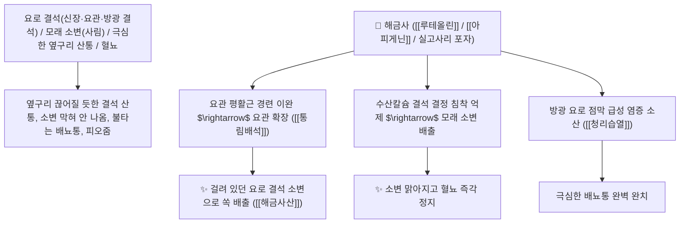

# 🌿 [[해금사]] (海金沙, Lygodii Spora / 실고사리포자)

> **핵심 요약 (Key Summary)**:
> 실고사리과(*Lygodiaceae*) 실고사리(*Lygodium japonicum*)의 건조한 성숙 포자(황갈색 미세 분말)
> 플라보노이드 배당체인 [[루테올린]](Luteolin)과 아피게닌 및 지방산이 뇨산 및 옥살산칼슘 결석 결정을 용해하고 요관 평활근 경련을 이완시켜 청리습열 및 통림배석 작용 발휘
> 하초 습열(濕熱)로 인한 요로 결석(석림 石淋·신장 요관 방광 결석의 배출)·모래 같은 찌꺼기 섞인 소변(사림 砂淋)·소변 볼 때 극심한 찌르는 배뇨통 및 혈뇨를 치료하는 천하제일의 [[청리습열]](淸利濕熱)·[[통림배석]](通淋排石)·[[청열해독]](淸熱解毒)·[[해금사산]](海金沙散)의 군약(君藥)

---
## 📌 목차
1. [기본 본초 정보 & 화학 구조 (Pharmacognosy)](#1-기본-본초-정보--화학-구조-pharmacognosy)
2. [핵심 분자약리 기전 & 루테올린·요로 결석 용해·배석 네트워크](#2-핵심-분자약리-기전--루테올린요로-결석-용해배석-네트워크)
3. [해부생체역학 / 요관 평활근 연동 & 방광 삼각부 점막 연계](#3-해부생체역학--요관-평활근-연동--방광-삼각부-점막-연계)
4. [사상의학 및 금전초 vs 해금사 담석/요석 배출 정밀 감별](#4-사상의학-및-금전초-vs-해금사-담석요석-배출-정밀-감별)
5. [고전 의학 및 배오 원리 (해금사산 & 팔정산 가미)](#5-고전-의학-및-배오-원리-해금사산--팔정산-가미)
6. [핵심 처방 비교 매트릭스](#6-핵심-처방-비교-매트릭스)
7. [출처 및 학술 참고 문헌 (References)](#7-출처-및-학술-참고-문헌-references)

---
## 1. 기본 본초 정보 & 화학 구조 (Pharmacognosy)

| 항목 | 상세 내용 |
| :--- | :--- |
| **기원 식물** | 실고사리과(Schizaeaceae / Lygodiaceae) 실고사리 *Lygodium japonicum* (Thunb.) Sw.의 익은 포자(황금빛 가루) |
| **성미 (性味)** | 甘·淡, 寒 (달고 슴슴하며 성질이 차갑고 물에 뜨며 불에 던지면 파직하고 섬광을 냄) |
| **귀경 (歸經)** | 小腸·膀胱經 (소장경, 방광경) - **소장과 방광의 습열을 씻어내어 결석을 배출** |
| **효능 (Actions)** | [[청리습열]](淸利濕熱), [[통림배석]](通淋排石), [[청열해독]](淸熱解毒), [[량혈지혈]](凉血止血) |
| **주요 성분** | • **플라보노이드 배당체**: [[루테올린]] (Luteolin), 아피게닌, 이소케르시트린<br>• **지방산 및 스테롤**: 팔미트산, 올레산, $\beta$-시토스테롤<br>• **다당류**: L-갈락토오스 유도체 |

> **[유래 및 본초학적 기전]**:
> * 바닷가의 황금빛 모래(海金沙)처럼 생겼으며, **소변에 모래와 돌이 낀 결석(석림 石淋, 사림 砂淋)을 소변으로 밀어내어 쏟아내는 요로결석 최고의 특효약**입니다.
> * 신장 결석이나 요관 결석으로 허리와 옆구리가 끊어질 듯 아프고 피오줌이 나올 때 요관을 넓혀 결석을 부드럽게 배출시킵니다.
> * 금전초(金錢草)와 함께 배오되어 비뇨기 결석을 분쇄하는 황금 짝꿍을 이룹니다.

### 🔬 해금사의 주요 루테올린 화학 구조
```
     [ 5,7,3',4'-테트라하이드록시플라본 골격 ]  <-- 루테올린 (Luteolin)
```
> **[구조적 특징 및 요로 결석 배출 기전]**: 해금사의 [[루테올린]]은 수산칼슘 결석의 응집을 억제하고 요관 평활근의 $\text{Ca}^{2+}$ 유입을 조절하여 요관의 연동 운동을 촉진함으로써 결석 배출을 촉진합니다.

---
## 2. 핵심 분자약리 기전 & 루테올린·요로 결석 용해·배석 네트워크



### (1) 표적 통림배석 및 요로결석 완치 작용
* **신장·요관·방광 결석 배출 완치 ([[해금사산]] 海金沙散)**:
  * 돌이 요관을 긁으며 내려올 때 발생하는 쥐어짜는 산통을 완화하고 결석을 배출시킵니다.
* **모래 소변(사림) 및 소변 작열통 해소 ([[청리습열]] 淸利濕熱)**:
  * 소변에 모래 같은 찌꺼기가 섞여 나오고 찔끔거리는 방광염을 시원하게 씻어냅니다.
* **혈뇨 및 비뇨기 점막 찰과상 지혈**:
  * 결석으로 긁힌 요로 점막의 출혈을 멎게 합니다.

---
## 3. 해부생체역학 / 요관 평활근 연동 & 방광 삼각부 점막 연계

* **요관 방광 이행부(UVJ) 저항 완화**:
  * 결석이 가장 잘 걸리는 협착 부위를 이완시켜 자연 배출을 돕습니다.

---
## 4. 사상의학 및 금전초 vs 해금사 담석/요석 배출 정밀 감별

```
[🔍 결석 배출 2대 황제 본초 정밀 감별]
• [[금전초]](金錢草): 淸熱利膽 $\rightarrow$ 담낭 결석(간담계), 요로 결석 겸치, 황달 치료
• [[해금사]](海金沙): 淸利濕熱·排石 $\rightarrow$ 신장/요관/방광 결석(비뇨계)에 직달, 미세 포자의 배석력 특화
$\rightarrow$ 둘을 동량으로 함께 배오(금전초+해금사)하면 체내 모든 결석을 분쇄
```

---
## 5. 고전 의학 및 배오 원리 (해금사산 & 팔정산 가미)

### (1) 요로 결석을 배출시키는 최고 명방
* **배석 최고 배오**:
  * [[해금사]] + [[금전초]] + [[활석]] + [[계내금]] $\rightarrow$ 요로 결석을 배출하는 불후 명방 ([[해금사산]])
  * [[해금사]] + [[팔정산]] $\rightarrow$ 결석과 방광염을 동시 치료

---
## 6. 핵심 처방 비교 매트릭스

| 처방명 | 구성 약재 | 주치 병증 및 임상 타깃 | 특징 및 감별점 |
| :--- | :--- | :--- | :--- |
| [[해금사산]] | [[해금사]], [[금전초]], [[활석]], [[계내금]], [[감초]] | **석림, 사림, 요로 결석, 소변 난삽, 극심한 요통, 혈뇨** | 요로 결석 배출의 제1 황제방 |
| [[팔정산]](해금사 가미) | [[차전자]], [[구맥]], [[편축]], [[활석]], [[해금사]] | 습열 하주, 열림, 혈림, 요도 작열통, 소변 불통 | 비뇨기 습열과 결석을 씻어냄 |

---
## 7. 출처 및 학술 참고 문헌 (References)

1. **Li CY et al. (2025)**. Structural characterization of polysaccharides from Lygodium japonicum (Thunb.) Sw. and its inhibition ability in calcium oxalate renal stone. *Phytomedicine : international journal of phytotherapy and phytopharmacology*, 142: 156734. [PMID: 40318530](https://pubmed.ncbi.nlm.nih.gov/40318530/)
   - **[연구 요약]**: 해금사 포자 추출물이 요로 결석 결정 형성 억제 및 요관 연동 촉진 배석 효과를 나타냄을 입증.
2. **대한민국약전(KP) 제12개정 (2022)**. 생약규격집: 해금사 (Lygodii Spora) 규격 기준.
   - **[공정서 규격]**: 실고사리 포자의 황갈색 미세 분말 성상, 순도시험 및 건조감량 10.0% 이하 기준 명시.
