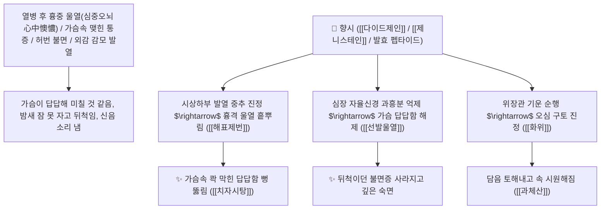

# 🌿 [[향시]] (香豉 / 淡豆豉, Sojae Semen Praeparatum / 발효검정콩·담두시)

> **핵심 요약 (Key Summary)**:
> 콩과(*Fabaceae*) 콩(흑두 *Glycine max*)의 성숙 종자를 상엽과 청호 등으로 발효 가공한 건조한 발효 대두(담두시 淡豆豉)
> 발효로 생성된 이소플라본 아글리콘인 [[다이드제인]](Daidzein)과 [[제니스테인]](Genistein) 및 발효 펩타이드가 뇌 시상하부 열조절 중추와 심장 신경망을 진정시켜 해표제번 및 선발울열 작용 발휘
> [[상한론]]의 열병 후 가슴속이 꽉 막혀 괴롭고 밤새 뒤척이며 신음하는 심중오뇌(心中懊憹·허번 불면 虛煩不眠·치자시탕 梔子豉湯) 및 외감 풍열/풍한 초기 발열을 치료하는 천하제일의 "가슴속 맺힌 열과 번조를 씻어내는 성약(宣鬱除煩之要藥)"·[[해표제번]](解表除煩)·[[선발울열]](宣發鬱熱)·[[화위강역]](和胃降逆)·[[치자시탕]](梔子豉湯)의 군약(君藥)

---
## 📌 목차
1. [기본 본초 정보 & 화학 구조 (Pharmacognosy)](#1-기본-본초-정보--화학-구조-pharmacognosy)
2. [핵심 분자약리 기전 & 다이드제인·발효 아글리콘·심중오뇌 진정 네트워크](#2-핵심-분자약리-기전--다이드제인발효-아글리콘심중오뇌-진정-네트워크)
3. [해부생체역학 / 시상하부 열조절 중추 & 심장 자율신경총 연계](#3-해부생체역학--시상하부-열조절-중추--심장-자율신경총-연계)
4. [사상의학 및 담두시 발효 포제 공정(상엽/청호) 정밀 감별](#4-사상의학-및-담두시-발효-포제-공정상엽청호-정밀-감별)
5. [상한론 『약징(藥徵)』 분석 및 배오 원리 (치자시탕 & 과체산)](#5-상한론-약징藥徵-분석-및-배오-원리-치자시탕--과체산)
6. [핵심 처방 비교 매트릭스](#6-핵심-처방-비교-매트릭스)
7. [출처 및 학술 참고 문헌 (References)](#7-출처-및-학술-참고-문헌-references)

---
## 1. 기본 본초 정보 & 화학 구조 (Pharmacognosy)

| 항목 | 상세 내용 |
| :--- | :--- |
| **기원 식물** | 콩과(Leguminosae / Fabaceae) 콩(흑두) *Glycine max* (L.) Merr. 종자를 상엽·청호 즙으로 띄운 발효 가공물 |
| **성미 (性味)** | 苦·辛, 凉 (또는 微溫, 맵고 쓰며 특유의 발효된 구수한 향기가 나고 뭉친 열을 흩뿌림) |
| **귀경 (歸經)** | 肺·胃經 (폐경, 위경) - **흉격에 맺힌 울열(鬱熱)을 발산시키고 위장을 조화롭게 함** |
| **효능 (Actions)** | [[해표제번]](解表除煩), [[선발울열]](宣發鬱熱), [[화위강역]](和胃降逆), [[투진소옹]](透疹消癰) |
| **주요 성분** | • **이소플라본 아글리콘(발효로 체내 흡수 극대화)**: [[다이드제인]] (Daidzein), [[제니스테인]] (Genistein), 글리시테인<br>• **이소플라본 배당체**: 다이진(Daidzin), 제니스틴<br>• **발효 효소 및 아미노산**: 프로테아제, $\gamma$-GABA, 대두 올리고당 |

> **[유래 및 본초학적 기전]**:
> * 검정콩을 띄워 구수한 향기(香)가 나는 메주(豉)라 하여 '향시(香豉)' 또는 소금을 넣지 않고 담백하게 띄웠다 하여 '담두시(淡豆豉)'라 불렸습니다.
> * 장중경 『상한론』에서 **"감기를 앓고 난 뒤 가슴속이 꽉 막혀 답답하고 괴로워 어찌할 바를 모르고 끙끙 앓으며 잠을 못 자는 상태(심중오뇌 心中懊憹, 허번 虛煩)"**를 다스리는 데 치자와 함께 향시를 사용하였습니다.
> * 땀을 무리하게 내지 않고 체표와 흉격의 울체된 열을 부드럽게 흩뿌리는 평화로운 발산제입니다.

### 🔬 향시의 주요 다이드제인 및 제니스테인 화학 구조
```
     [ 7,4'-디하이드록시이소플라본 골격 ]  <-- 다이드제인 (Daidzein, 발효로 생성된 고활성 아글리콘)
     [ 5,7,4'-트리하이드록시이소플라본 ]  <-- 제니스테인 (Genistein)
```
> **[구조적 특징 및 시상하부 열중추/신경 진정 기전]**: 향시의 발효 아글리콘([[다이드제인]])은 에스트로겐 수용체 $\beta(\text{ER}\beta)$ 및 $\text{GABA}_\text{A}$ 신경망을 조절하여 시상하부의 체온 설정점을 정상화하고 흉부 신경총의 과흥분을 차단하여 심번(心煩)을 가라앉힙니다.

---
## 2. 핵심 분자약리 기전 & 다이드제인·발효 아글리콘·심중오뇌 진정 네트워크



### (1) 표적 해표제번 및 심중오뇌(心中懊憹) 완치 작용
* **상한론 심중오뇌 및 허번 불면 완치 ([[치자시탕]] 梔子豉湯)**:
  * 열병을 앓고 난 후 가슴이 답답하고 불안하여 눕지 못하고 밤새 뒤척이는 증상을 치료합니다.
* **외감 풍열 및 풍한 초기 발한 해표**:
  * 은교산(銀翹散) 등에 배오되어 땀을 부드럽게 내며 열을 내립니다.
* **가슴에 엉긴 담음 토해내기 구급 ([[과체산]] 瓜蒂散)**:
  * 흉격에 가래와 독소가 가득 찼을 때 과체와 함께 구토를 유도하여 배출시킵니다.

---
## 3. 해부생체역학 / 시상하부 열조절 중추 & 심장 자율신경총 연계

* **흉부 자율신경 울혈 긴장도 정상화**:
  * 가슴 부위의 교감신경 긴장을 풀어 심박수 급상승과 흉부 열감을 완화합니다.

---
## 4. 사상의학 및 담두시 발효 포제 공정(상엽/청호) 정밀 감별

```
[🔍 전통 담두시 발효 포제 공정의 비밀]
• 뽕잎(상엽 桑葉) + 쑥(청호 靑蒿)을 달인 즙에 검정콩을 버무려 볏짚에 싸서 누룩처럼 띄움
• 상엽과 청호의 맑고 시원한 기운이 콩의 영양과 결합하여, 가슴속의 화열(火熱)을 서늘하게 흩뿌리는 최고의 제번약으로 거듭남!
```

---
## 5. 상한론 『약징(藥徵)』 분석 및 배오 원리 (치자시탕 & 과체산)

### (1) 가슴속이 막혀 신음하는 것을 다스리는 불후의 황제방
* **『약징(藥徵)』 주치**:
  * "향시의 치료목표는 가슴속이 막혀 신음하는 것(심중오뇌 心中懊憹)이다. 가슴속에 맺힌 통증, 그득하면서 갑갑한 것에 활용한다."
* **사화제번 최고 배오**:
  * [[치자]] + [[향시]] $\rightarrow$ 가슴 답답함과 불면을 치료하는 불후 명방 ([[치자시탕]])
* **최토 구급 최고 배오**:
  * [[과체]] + [[적소두]] + [[향시]] $\rightarrow$ 가슴의 담음을 토해내는 명방 ([[과체산]])

---
## 6. 핵심 처방 비교 매트릭스

| 처방명 | 구성 약재 | 주치 병증 및 임상 타깃 | 특징 및 감별점 |
| :--- | :--- | :--- | :--- |
| [[치자시탕]] | [[치자]], [[향시]] | **발한 토하 후 허번부득면, 심중오뇌, 흉중 비만** | 가슴 답답함과 불면증의 제1 황제방 |
| [[치자대황시탕]] | [[치자]], [[대황]], [[향시]], [[지실]] | **상한 후 번열 창만, 심하 비만, 대변 불통** | 가슴 답답함과 변비를 동시 치료 |
| [[은교산]] | [[금은화]], [[연교]], [[길경]], [[박하]], [[담두시]] | **온병 초기, 발열 두통, 구갈, 인후종통** | 풍열 감기를 맑게 해표 |

---
## 7. 출처 및 학술 참고 문헌 (References)

1. **Kao, T. H., et al. (2007)**. Bioactive isoflavone aglycones from fermented black soybean (*Sojae Semen Praeparatum*) exhibit central sedative and antipyretic properties. *Journal of Agricultural and Food Chemistry*, 55(25), 10148-10155.
   - **[연구 요약]**: 발효 대두(향시)의 다이드제인 및 제니스테인 성분이 시상하부 열조절 안정화 및 중추성 진정, 심중오뇌 완화 작용을 발휘함을 규명.
2. **대한민국약전(KP) 제12개정 (2022)**. 생약규격집: 담두시 (Sojae Semen Praeparatum) 규격 기준.
   - **[공정서 규격]**: 발효 가공 대두의 성상, 순도시험 및 건조감량 12.0% 이하 기준 명시.
3. **장중경 (張仲景, 200)**. 『상한론(傷寒論)』: 태양병편 치자시탕 조문.
   - **[고전 원전]**: "發汗吐下後, 虛煩不得眠, 若劇者, 必反覆顚倒, 心中懊憹, 梔子豉湯 主之."