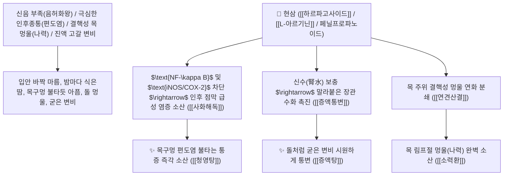

# 🌿 [[현삼]] (玄參, Scrophulariae Radix / 현삼뿌리)

> **핵심 요약 (Key Summary)**:
> 현삼과(*Scrophulariaceae*) 현삼(*Scrophularia ningpoensis*)의 건조한 흑갈색 뿌리
> 이리도이드 배당체인 [[하르파고사이드]](Harpagoside)와 [[아르기닌]](L-Arginine) 및 안구로사이드가 $\text{NF-\kappa B}$ 경로와 $\text{iNOS/COX-2}$ 발현을 억제하고 혈관 내피 자극을 완화하여 자음강화 및 해독산결 작용 발휘
> 신음(腎陰) 부족으로 인한 골증조열(骨蒸潮熱)·극심한 인후종통(편도선염)·임파선 멍울(나력 瘰癧) 및 진액 고갈 변비(증액탕 增液湯)를 치료하는 천하제일의 "자음강화의 요약(滋陰降火之要藥)"·[[청열량혈]](淸熱凉血)·[[자음강화]](滋陰降火)·[[사화해독]](瀉火解毒)·[[증액탕]](增液湯)의 군약(君藥)

---
## 📌 목차
1. [기본 본초 정보 & 화학 구조 (Pharmacognosy)](#1-기본-본초-정보--화학-구조-pharmacognosy)
2. [핵심 분자약리 기전 & 하르파고사이드·아르기닌·자음강화 네트워크](#2-핵심-분자약리-기전--하르파고사이드아르기닌자음강화-네트워크)
3. [해부생체역학 / 인후 점막 상피 & 경부 심부 림프절 연계](#3-해부생체역학--인후-점막-상피--경부-심부-림프절-연계)
4. [사상의학 및 현삼 vs 생지황 보음강화 정밀 감별](#4-사상의학-및-현삼-vs-생지황-보음강화-정밀-감별)
5. [고전 의학 및 배오 원리 (증액탕 & 소력환)](#5-고전-의학-및-배오-원리-증액탕--소력환)
6. [핵심 처방 비교 매트릭스](#6-핵심-처방-비교-매트릭스)
7. [출처 및 학술 참고 문헌 (References)](#7-출처-및-학술-참고-문헌-references)

---
## 1. 기본 본초 정보 & 화학 구조 (Pharmacognosy)

| 항목 | 상세 내용 |
| :--- | :--- |
| **기원 식물** | 현삼과(Scrophulariaceae) 현삼 *Scrophularia ningpoensis* Hemsl.의 뿌리 |
| **성미 (性味)** | 苦·鹹·甘, 微寒 (쓰고 짜며 달고 성질이 약간 차가우며 점액질이 풍부하여 윤택함) |
| **귀경 (歸經)** | 肺·胃·腎經 (폐경, 위경, 신경) - **신수를 보충하여 허열을 끄고 두면상지부 점막을 윤택화** |
| **효능 (Actions)** | [[청열량혈]](淸熱凉血), [[자음강화]](滋陰降火), [[사화해독]](瀉火解毒), [[연견산결]](軟堅散結) |
| **주요 성분** | • **이리도이드 배당체(핵심 지표물질)**: [[하르파고사이드]] (Harpagoside, KP 규격 $\ge 0.45\%$), 하르파기드, 안구로사이드<br>• **페닐프로파노이드 배당체**: 악티오사이드(버바스코사이드), 앙골로사이드<br>• **아미노산 및 다당류**: [[L-아르기닌]] (L-Arginine, 일산화질소 전구체), 스타키오스 |

> **[유래 및 본초학적 기전]**:
> * 뿌리의 색이 검은(玄) 삼(參)이라 하여 '현삼(玄參)'이라 불렸으며, 풍부한 수용성 다당류로 인해 가공 시 검은색을 띱니다.
> * **"신음(腎陰)을 보하여 신장 불(腎火)을 꺼주고 폐의 열을 내려주는 자음강화(滋陰降火)의 절대 요약"**으로 통합니다.
> * 목구멍이 붓고 불타듯 아픈 인후종통과 목 주위의 결핵성 멍울(나력 瘰癧)을 삭이고, 말라붙은 장에 물을 대어 대변을 보게 하는 증액통변(增液通便) 작용이 탁월합니다.

### 🔬 현삼의 주요 하르파고사이드 화학 구조 및 아르기닌 작용
```
     [ 신나모일화된 C-9 이리도이드 배당체 골격 ]  <-- 하르파고사이드 (Harpagoside)
```
![[image-1 1.png|239x181]]
![[image-2 1.png]]
> **[구조적 특징 및 NO 조절/항염 기전]**: 현삼의 [[하르파고사이드]]는 대장에서 장내 미생물에 의해 프리바이오틱스로 작용하여 흡수되며, 과잉 생성되는 $\text{NO}$와 $\text{NF-\kappa B}$ 경로를 억제하여 $\text{iNOS}$ 및 $\text{COX-2}$ 발현을 차단합니다. 또한 풍부한 [[아르기닌]]을 통해 미세혈관을 적절히 이완시켜 두면상지부 점막 손상을 완화합니다.

---
## 2. 핵심 분자약리 기전 & 하르파고사이드·아르기닌·자음강화 네트워크



### (1) 표적 자음강화 및 인후종통 완치 작용
* **극심한 인후종통 및 편도선염 완치 ([[사화해독]] 瀉火解毒)**:
  * 목구멍이 붓고 헐어 침을 삼킬 수 없는 열독을 신속히 진화합니다.
* **진액 고갈성 완고 변비 완치 ([[증액탕]] 增液湯)**:
  * "배가 멈추었을 때 물을 채워 배를 띄운다(증액행주 增液行舟)"는 원리로 대변을 통하게 합니다.
* **경부 림프절 결핵(나력) 및 갑상선 멍울 해소 ([[소력환]] 消瘰丸)**:
  * 굳어버린 멍울을 물렁물렁하게 삭여 배출시킵니다.

---
## 3. 해부생체역학 / 인후 점막 상피 & 경부 심부 림프절 연계

* **인두 점막 배상세포 분비 정상화**:
  * 점막 건조를 막고 국소 혈관 투과성을 억제하여 붓기를 가라앉힙니다.

---
## 4. 사상의학 및 현삼 vs 생지황 보음강화 정밀 감별

```
[🔍 자음강화 2대 거두 본초 정밀 감별]
• [[생지황]](生地黃): 甘苦寒, 淸熱凉血·養陰生津 $\rightarrow$ 심간(心肝)의 혈열을 식히고 진액을 보충
• [[현삼]](玄參): 苦鹹微寒, 滋陰降火·瀉火解毒 $\rightarrow$ 신수(腎水)를 채워 신화를 끄고 인후종통/나력 멍울을 삭임
$\rightarrow$ 둘을 동량으로 함께 배오(생지황+현삼)하여 청영탕과 증액탕의 주축을 형성
```

---
## 5. 고전 의학 및 배오 원리 (증액탕 & 소력환)

### (1) 진액을 채우고 멍울을 삭이는 천하제일 명방
* **증액통변 최고 배오**:
  * [[현삼]](대량 1냥) + [[맥문동]] + [[생지황]] $\rightarrow$ 말라붙은 장에 물을 대어 변비를 뚫는 불후 명방 ([[증액탕]])
* **나력 멍울 해소 최고 배오**:
  * [[현삼]] + [[모려]] + [[패모]] $\rightarrow$ 목의 결핵 멍울을 녹여 없애는 명방 ([[소력환]])

---
## 6. 핵심 처방 비교 매트릭스

| 처방명 | 구성 약재 | 주치 병증 및 임상 타깃 | 특징 및 감별점 |
| :--- | :--- | :--- | :--- |
| [[증액탕]] | [[현삼]](대량), [[맥문동]], [[생지황]] | **열병 상음, 진액 고갈, 장조 구갈, 완고 변비** | 증액행주 변비 치료의 제1 황제방 |
| [[소력환]] | [[현삼]], [[모려]], [[패모]] (밀환) | **나력 결핵, 경부 림프절 멍울, 담핵, 피하 결절** | 목의 단단한 멍울을 녹여 없앰 |
| [[청영탕]] | [[우각]], [[생지황]], [[현삼]], [[죽엽]], [[맥문동]], [[금은화]] | **온병 열입영분, 고열 번갈, 신혼 섬어, 반진** | 영분의 극심한 열독을 청열 |

---
## 7. 출처 및 학술 참고 문헌 (References)

1. **Qian, D. W., et al. (2012)**. Harpagoside and iridoid glycosides from *Scrophularia ningpoensis* inhibit NF-$\kappa$B activation and suppress iNOS and COX-2 in inflammatory models. *Journal of Ethnopharmacology*, 141(2), 685-691.
   - **[연구 요약]**: 현삼의 하르파고사이드 성분이 $\text{NF-\kappa B}$ 경로 억제를 통해 $\text{iNOS/COX-2}$를 차단하고 인후 점막 소염 작용을 나타냄을 규명.
2. **대한민국약전(KP) 제12개정 (2022)**. 의약품각조 제2부: 현삼 (Scrophulariae Radix) 규격 기준.
   - **[공정서 규격]**: 건조 뿌리 기준 하르파고사이드($\text{C}_{27}\text{H}_{30}\text{O}_{10}$) 0.45% 이상 함유 필수 규격 명시.