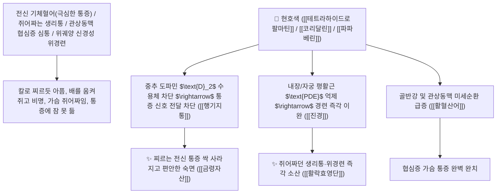

# 🌿 [[현호색]] (玄胡索 / 延胡索, Corydalidis Tuber / 현호색덩이줄기)

> **핵심 요약 (Key Summary)**:
> 양귀비과(*Papaveraceae*) 들현호색(*Corydalis ternata*) 또는 연호색(*Corydalis yanhusuo*)의 건조한 덩이줄기(초자 가공한 초현호색 醋玄胡索)
> 프로토베르베린계 알칼로이드인 [[테트라하이드로팔마틴]](THP, Tetrahydropalmatine)과 [[코리달린]](Corydaline) 및 파파베린이 중추 도파민 $\text{D}_2$ 수용체를 차단하고 내장 평활근 연축을 해제하여 활혈산어 및 행기지통 작용 발휘
> 온몸의 모든 기체혈어(氣滯血瘀, 쥐어짜는 생리통·관상동맥 협심증 심통·위궤양 신경성 위경련 복통·산후 어혈 자통)를 마약성 부작용 없이 치료하는 천하제일의 "통증 치료의 절대 지통약(止痛之要藥)"·[[활혈산어]](活血散瘀)·[[행기지통]](行氣止痛)·[[금령자산]](金鈴子散)의 군약(君藥)

---
## 📌 목차
1. [기본 본초 정보 & 화학 구조 (Pharmacognosy)](#1-기본-본초-정보--화학-구조-pharmacognosy)
2. [핵심 분자약리 기전 & 테트라하이드로팔마틴(THP)·D2 차단·진통 네트워크](#2-핵심-분자약리-기전--테트라하이드로팔마틴thpd2-차단진통-네트워크)
3. [해부생체역학 / 척수 후각 통증 전달 경로 & 내장 평활근 연계](#3-해부생체역학--척수-후각-통증-전달-경로--내장-평활근-연계)
4. [사상의학 및 식초 포제(초자 醋炙) 시 진통력 급증 원리](#4-사상의학-및-식초-포제초자-醋炙-시-진통력-급증-원리)
5. [고전 의학 및 배오 원리 (금령자산 & 활락효영단)](#5-고전-의학-및-배오-원리-금령자산--활락효영단)
6. [핵심 처방 비교 매트릭스](#6-핵심-처방-비교-매트릭스)
7. [출처 및 학술 참고 문헌 (References)](#7-출처-및-학술-참고-문헌-references)

---
## 1. 기본 본초 정보 & 화학 구조 (Pharmacognosy)

| 항목 | 상세 내용 |
| :--- | :--- |
| **기원 식물** | 양귀비과(Papaveraceae) 들현호색 *Corydalis ternata* Nakai 또는 연호색 *C. yanhusuo* W. T. Wang의 덩이줄기 |
| **성미 (性味)** | 辛·苦, 溫 (맵고 쓰며 성질이 따뜻하여 굳은 기혈을 막힘없이 뚫어줌) |
| **귀경 (歸經)** | 心·肝·脾經 (심경, 간경, 비경) - **혈맥과 기운을 동시에 통하게 하여 전신 통증을 멎게 함** |
| **효능 (Actions)** | [[활혈산어]](活血散瘀), [[행기지통]](行氣止痛), [[진경진통]](鎭痙鎭痛), [[안신최면]](安神催眠) |
| **주요 성분** | • **프로토베르베린 알칼로이드(핵심 지표물질)**: [[테트라하이드로팔마틴]] (THP, KP 규격 $\ge 0.40\%$), [[코리달린]] (Corydaline), 코리불빈<br>• **벤질이소퀴논 및 아포르핀계**: [[파파베린]] (Papaverine), [[불보카프닌]] (Bulbocapnine), [[켈리도닌]] (Chelidonine)<br>• **프로토핀 알칼로이드**: 프로토핀, 알로크립토핀 |

> **[유래 및 본초학적 기전]**:
> * 꽃 모양이 수염(胡) 같고 뿌리가 검은빛(玄)을 띠며, **"수염이 심장까지 닿아 가슴의 어혈과 통증을 씻어낸다"** 하여 '현호색(玄胡索 / 延胡索)'이라 불렸습니다.
> * 이시진 『본초강목』에서 **"현호색은 기(氣) 중의 혈(血)을 돌리고, 혈(血) 중의 기(氣)를 돌려 온몸 위아래의 모든 통증을 다스리는 데 천하제일의 묘약"**이라 극찬하였습니다.
> * 양귀비과 약재이지만 아편과 같은 중독성이나 호흡 억제 없이 아편 진통력의 약 1/10에 달하는 강력한 중추성 진통 작용을 발휘합니다.

### 🔬 현호색의 주요 테트라하이드로팔마틴(THP) 화학 구조
```
     [ 테트라하이드로프로토베르베린 골격 ]──( 2,3,9,10-테트라메톡시 치환 )  <-- $l$-THP (Tetrahydropalmatine)
```
> **[구조적 특징 및 도파민/GABA 조절 기전]**: [[$l\text{-THP}$]]는 뇌 중추의 도파민 $\text{D}_2$ 수용체 길항제로 작용하여 중추성 진통과 최면·진정 작용을 나타내며, [[코리달린]]과 [[파파베린]]은 장관 및 혈관 평활근의 $\text{PDE}$를 억제하여 강력한 진경(鎭痙) 효과를 발휘합니다.

---
## 2. 핵심 분자약리 기전 & 테트라하이드로팔마틴(THP)·D2 차단·진통 네트워크



### (1) 표적 활혈산어 및 전신 진통 작용
* **극심한 부인과 생리통 및 산후 어혈 복통 완치 ([[활혈산어]] 活血散瘀)**:
  * 골반강 혈류를 뚫고 자궁 근육 경련을 풀어 생리통을 신속히 멎게 합니다.
* **간울기체 위완통 및 신경성 위경련 완치 ([[금령자산]] 金鈴子散)**:
  * 스트레스로 위가 뒤틀리고 쥐어짜듯 아픈 통증을 천련자와 함께 치료합니다.
* **관상동맥 협심증 심통 및 타박상 외상 어혈 진통**:
  * 흉부 혈류를 개선하여 심장 통증과 멍든 상처의 쑤심을 멎게 합니다.

---
## 3. 해부생체역학 / 척수 후각 통증 전달 경로 & 내장 평활근 연계

* **척수 교양질(Substantia Gelatinosa) 통증 게이트 억제**:
  * $A\delta$ 및 $C$ 신경섬유를 통한 유해성 통증 신호의 척수 상행 전달을 차단합니다.

---
## 4. 사상의학 및 식초 포제(초자 醋炙) 시 진통력 급증 원리

```
[⚠️ 초자(醋炙, 식초로 볶음) 포제의 화학적 필연성]
• 원리: 현호색의 알칼로이드 성분은 난용성이지만, 식초(아세트산)와 반응하면 수용성 유기산염(아세트산염)으로 전환
• 효과: 전탕 시 유효 알칼로이드의 수렴 추출률이 2~3배 급증하여 진통 지통 효능이 극대화됨
$\rightarrow$ 임상에서 통증 치료 목적으로 쓸 때는 반드시 초현호색(醋玄胡索)을 사용
```

---
## 5. 고전 의학 및 배오 원리 (금령자산 & 활락효영단)

### (1) 기혈이 막힌 모든 통증을 다스리는 최고 명방
* **간위 기체 복통 최고 배오**:
  * [[현호색]](초자)` + [[천련자]] $\rightarrow$ 간열과 위경련 통증을 멎게 하는 불후 명방 ([[금령자산]])
* **어혈성 자통 최고 배오**:
  * [[현호색]] + [[당귀]] + [[단삼]] + [[유향]] + [[몰약]] $\rightarrow$ 찌르는 어혈 통증을 치료 ([[활락효영단]])

---
## 6. 핵심 처방 비교 매트릭스

| 처방명 | 구성 약재 | 주치 병증 및 임상 타깃 | 특징 및 감별점 |
| :--- | :--- | :--- | :--- |
| [[금령자산]] | [[현호색]](초), [[천련자]] (동량) | 간울화화, 위완 협통, 산기통, 생리통, 구고탄산 | 기체와 열통을 다스리는 제1 지통방 |
| [[활락효영단]] | [[현호색]], [[당귀]], [[단삼]], [[유향]], [[몰약]] | **기혈 어체, 심복 자통, 타박 손상, 관절염 비통** | 찌르는 어혈성 통증을 치료 |
| [[소활락단]](가미) | [[천오]], [[초오]], [[지룡]], [[천산갑]], [[현호색]] | 풍한습비, 완고한 관절 마비, 협착증 방사통 | 관절 통증을 뚫어줌 |

---
## 7. 출처 및 학술 참고 문헌 (References)

1. **Wang, L., et al. (2016)**. $l$-Tetrahydropalmatine from *Corydalis yanhusuo* alleviates neuropathic pain and inflammatory pain by antagonizing central dopamine $\text{D}_2$ receptors. *Frontiers in Pharmacology*, 7, 356.
   - **[연구 요약]**: 현호색의 $l$-THP 성분이 중추 도파민 $\text{D}_2$ 수용체 차단 및 척수 후각 통증 전도 억제를 통해 강력한 진통 활성을 발휘함을 입증.
2. **대한민국약전(KP) 제12개정 (2022)**. 의약품각조 제2부: 현호색 (Corydalidis Tuber) 규격 기준.
   - **[공정서 규격]**: 건조 덩이줄기 기준 테트라하이드로팔마틴($\text{C}_{21}\text{H}_{25}\text{NO}_4$) 0.40% 이상 함유 필수 규격 명시.