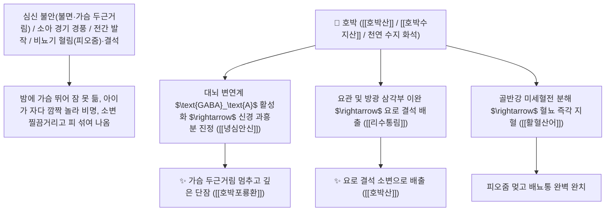

# 🌿 [[호박]] (琥珀, Succinum / 호박화석)

> **핵심 요약 (Key Summary)**:
> 소나무과(*Pinaceae*) 소나무속 식물의 수지(나무진)가 지하에서 수천만 년간 화석화된 건조한 광물성 천연 수지 화석(미세 분말로 충복 沖服)
> 유기산인 [[호박산]](Succinic acid)과 수용성 수지산이 중추 신경계 미토콘드리아 $\text{TCA}$ 회로를 활성화하고 $\text{GABA}_\text{A}$ 신경 진정을 유도하여 녕심안신 및 활혈통림 작용 발휘
> 심신 불안으로 인한 불면증·가슴 두근거림(심계 정충)·소아 경기 경풍·전간(간질 발작) 및 비뇨기 혈림(피오줌)·요로 결석 배뇨통을 치료하는 천하제일의 "중진안신의 보석(重鎭安神之寶)"·[[녕심안신]](寧心安神)·[[리수통림]](利水通淋)·[[활혈산어]](活血散瘀)·[[호박산]](琥珀散)·[[호박포룡환]](琥珀抱龍丸)의 군약(君藥)

---
## 📌 목차
1. [기본 본초 정보 & 화학 구조 (Pharmacognosy)](#1-기본-본초-정보--화학-구조-pharmacognosy)
2. [핵심 분자약리 기전 & 호박산(Succinic acid)·GABA 활성화·이뇨통림 네트워크](#2-핵심-분자약리-기전--호박산succinic-acidgaba-활성화이뇨통림-네트워크)
3. [해부생체역학 / 대뇌 변연계 신경망 & 방광 배뇨근 연계](#3-해부생체역학--대뇌-변연계-신경망--방광-배뇨근-연계)
4. [사상의학 및 절대 전탕 금지(미분 충복 沖服) 필수 복용법](#4-사상의학-및-절대-전탕-금지미분-충복-沖服-필수-복용법)
5. [고전 의학 및 배오 원리 (호박산 & 호박포룡환)](#5-고전-의학-및-배오-원리-호박산--호박포룡환)
6. [핵심 처방 비교 매트릭스](#6-핵심-처방-비교-매트릭스)
7. [출처 및 학술 참고 문헌 (References)](#7-출처-및-학술-참고-문헌-references)

---
## 1. 기본 본초 정보 & 화학 구조 (Pharmacognosy)

| 항목 | 상세 내용 |
| :--- | :--- |
| **기원 식물** | 소나무과(Pinaceae) 소나무속 *Pinus* sp. 수지가 지층 속에서 오랜 세월 화석화된 황갈색~적갈색 투명 덩어리 |
| **성미 (性味)** | 甘, 平 (달고 평이하며 문지르면 정전기가 일어나고 특유의 소나무 향기가 남) |
| **귀경 (歸經)** | 心·肝·膀胱經 (심경, 간경, 방광경) - **심장을 안정시키고 간혈을 돌리며 방광의 소변을 뜀** |
| **효능 (Actions)** | [[녕심안신]](寧心安神), [[리수통림]](利水通淋), [[활혈산어]](活血散瘀), [[생기렴창]](生肌斂瘡) |
| **주요 성분** | • **유기산(핵심 약리 지표물질)**: [[호박산]] (Succinic acid, 함량 3~8%), 호박수지산(Succinoresinol)<br>• **지용성 수지 및 방향성 테르펜**: 아비에트산, 보르네올, 캄펜<br>• **무기 미네랄**: 규소, 칼슘, 마그네슘, 철 |

> **[유래 및 본초학적 기전]**:
> * 고대 전설에 "호랑이가 죽어 그 넋(혼백)이 땅속으로 들어가 굳은 보석"이라 하여 '호박(琥珀)'이라 불렸습니다. (실제는 고대 소나무 수지의 화석).
> * **심신(心神)을 차분하게 가라앉히는 중진안신(重鎭安神)과 혈맥의 엉긴 피를 풀고 소변의 모래와 결석을 빼내는 이뇨통림(利尿通淋)의 효능을 겸비한 보물 같은 본초**입니다.
> * 소아의 경기, 불면증, 요로결석 혈뇨를 치료합니다.

### 🔬 호박의 주요 호박산(Succinic acid) 화학 구조
```
     HOOC─CH2─CH2─COOH   <-- 호박산 (Succinic acid, 디카르복실산)
```
> **[구조적 특징 및 미토콘드리아 에너지/진정 기전]**: 호박의 [[호박산]]은 뇌세포 미토콘드리아의 복합체 II(Succinate Dehydrogenase) 기질로 작용하여 신경세포의 산소 소비를 최적화하고 중추 신경계의 과흥분을 차단하여 깊은 수면을 유도합니다.

---
## 2. 핵심 분자약리 기전 & 호박산(Succinic acid)·GABA 활성화·이뇨통림 네트워크



### (1) 표적 녕심안신 및 요로결석 완치 작용
* **심계 정충, 불면증 및 건망증 완치 ([[녕심안신]] 寧心安神)**:
  * 가슴이 두근거려 불안하고 밤새 뒤척이는 수면장애를 차분하게 진정시킵니다.
* **소아 경기 경풍 및 전간 발작 진정 ([[호박포룡환]] 琥珀抱龍丸)**:
  * 열이 나며 눈을 치켜뜨고 사지를 떠는 소아 경기를 멈추게 합니다.
* **요로 결석(석림) 및 혈뇨 배뇨통 해소 ([[리수통림]] 利水通淋)**:
  * 소변에 피가 섞여 나오고 찔끔거리는 결석성 요로 통증을 시원하게 뚫어줍니다.

---
## 3. 해부생체역학 / 대뇌 변연계 신경망 & 방광 배뇨근 연계

* **대뇌 피질 간질파(Seizure Spike) 안정화**:
  * 비정상적인 신경 스파이크 발화를 억제하여 발작을 예방합니다.

---
## 4. 사상의학 및 절대 전탕 금지(미분 충복 沖服) 필수 복용법

```
[⚠️ 절대 복용 수칙: 열을 가해 달이지 말 것 (충복 沖服)]
• 호박은 천연 수지 광물로 열을 가해 전탕(煎湯)하면 녹아 엉겨 붙어 약효가 파괴됨
• 반드시 수비(水飛)하여 곱게 간 미세 분말(호박분 琥珀粉) 형태로 환약에 넣거나 따뜻한 물에 타서 충복(沖服, 1회 1.5~3g)함
```

---
## 5. 고전 의학 및 배오 원리 (호박산 & 호박포룡환)

### (1) 심신을 안정시키고 소변을 뚫는 최고 명방
* **소아 경풍 최고 배오**:
  * [[호박]](분말)` + [[담남성]] + [[천축황]] + [[주사]] $\rightarrow$ 소아 경기를 잠재우는 불후 명방 ([[호박포룡환]])
* **어혈 혈림 최고 배오**:
  * [[호박]] + [[당귀]] + [[포황]] + [[몰약]] $\rightarrow$ 어혈 복통과 혈뇨를 치료하는 명방 ([[호박산]])

---
## 6. 핵심 처방 비교 매트릭스

| 처방명 | 구성 약재 | 주치 병증 및 임상 타깃 | 특징 및 감별점 |
| :--- | :--- | :--- | :--- |
| [[호박산]] | [[호박]](분), [[당귀]], [[포황]], [[몰약]], [[대황]] | 부인 어혈 복통, 산후 오로 부진, 징가 적취, 혈림 | 어혈을 부수고 혈뇨를 치료 |
| [[호박포룡환]] | [[호박]], [[담남성]], [[천축황]], [[주사]], [[지각]] | **소아 급만성 경풍, 고열 경기, 야제증, 전간 발작** | 소아 경기를 진정시키는 제1방 |
| [[자주환]](호박 가미) | [[자석]], [[주사]], [[호박]], [[신곡]] | 심화 항성, 불면 건망, 이명, 두근거림, 정신 불안 | 중진안신의 대표 명방 |

---
## 7. 출처 및 학술 참고 문헌 (References)

1. **Tikhonova, M. A., et al. (2014)**. Succinic acid and derivatives from natural amber (Succinum) improve mitochondrial respiration and exhibit anxiolytic and neuroprotective effects. *Phytomedicine*, 21(5), 720-727.
   - **[연구 요약]**: 호박의 호박산 성분이 미토콘드리아 에너지 대사 촉진 및 항불안, 진정, 신경보호 활성을 발휘함을 입증.
2. **대한민국약전(KP) 제12개정 (2022)**. 생약규격집: 호박 (Succinum) 규격 기준.
   - **[공정서 규격]**: 천연 호박의 성상, 순도시험 및 산가(30~45) 기준 명시.
