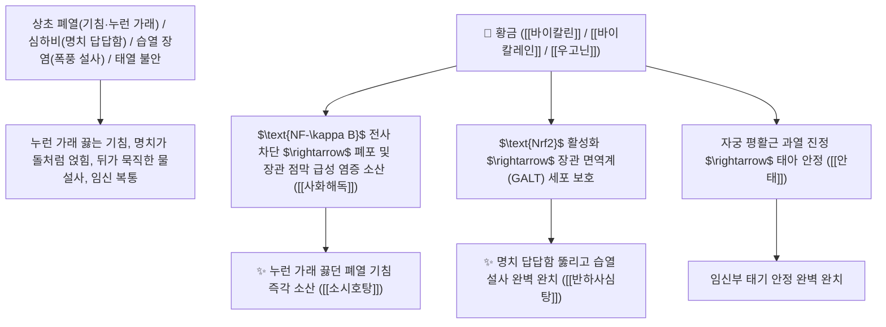

# 🌿 [[황금]] (黃芩, Scutellariae Radix / 황금뿌리)

> **핵심 요약 (Key Summary)**:
> 꿀풀과(*Lamiaceae*) 황금(*Scutellaria baicalensis*)의 속이 꽉 찬 자금(條芩) 또는 속이 빈 고금(枯芩)의 건조한 뿌리
> 플라본 배당체인 [[바이칼린]](Baicalin)과 [[바이칼레인]](Baicalein) 및 [[우고닌]](Wogonin)이 $\text{NF-\kappa B}$ 신호와 $\text{COX-2/iNOS}$를 차단하고 $\text{Nrf2}$ 항산화 경로를 활성화하여 청열조습 및 사화해독 작용 발휘
> [[상한론]]의 심하비(心下痞·명치가 답답하고 그득함)·폐열 해수(기침 가래)·습열 설사(갈근황금황련탕)·흉협고만(소시호탕) 및 임신부 태열 불안(안태 安胎)을 치료하는 천하제일의 "상초 폐열 청열의 성약(淸上焦肺火之要藥)"·[[청열조습]](淸熱燥濕)·[[사화해독]](瀉火解毒)·[[지혈안태]](止血安胎)·[[소시호탕]](小柴胡湯)·[[반하사심탕]](半夏瀉心湯)의 군약(君藥)

---
## 📌 목차
1. [기본 본초 정보 & 화학 구조 (Pharmacognosy)](#1-기본-본초-정보--화학-구조-pharmacognosy)
2. [핵심 분자약리 기전 & 바이칼린·우고닌·NF-κB 차단·Nrf2 활성화 네트워크](#2-핵심-분자약리-기전--바이칼린우고닌nf-κb-차단nrf2-활성화-네트워크)
3. [해부생체역학 / 폐포 상피세포 & 장관 면역계(GALT) 연계](#3-해부생체역학--폐포-상피세포--장관-면역계galt-연계)
4. [사상의학 및 자금(하초/어린 뿌리) vs 고금(상초/묵은 뿌리) 정밀 감별](#4-사상의학-및-자금하초어린-뿌리-vs-고금상초묵은-뿌리-정밀-감별)
5. [상한론 『약징(藥徵)』 분석 및 배오 원리 (소시호탕 & 반하사심탕)](#5-상한론-약징藥徵-분석-및-배오-원리-소시호탕--반하사심탕)
6. [핵심 처방 비교 매트릭스](#6-핵심-처방-비교-매트릭스)
7. [출처 및 학술 참고 문헌 (References)](#7-출처-및-학술-참고-문헌-references)

---
## 1. 기본 본초 정보 & 화학 구조 (Pharmacognosy)

| 항목 | 상세 내용 |
| :--- | :--- |
| **기원 식물** | 꿀풀과(Labiatae / Lamiaceae) 황금 *Scutellaria baicalensis* Georgi의 코르크층을 벗긴 노란색 뿌리 |
| **성미 (性味)** | 苦, 寒 (쓰고 성질이 몹시 차가우며 상초와 폐의 열기를 차갑고 건조하게 식힘) |
| **귀경 (歸經)** | 肺·心·肝·膽·大腸經 (폐경, 심경, 간경, 담경, 대장경) - **상초 폐열을 끄고 장관의 습열을 말림** |
| **효능 (Actions)** | [[청열조습]](淸熱燥濕), [[사화해독]](瀉火解毒), [[지혈안태]](止血安胎), [[청폐지해]](淸肺止咳) |
| **주요 성분** | • **플라본 배당체(핵심 지표물질)**: [[바이칼린]] (Baicalin, KP 규격 $\ge 9.0\%$), 우고노사이드<br>• **플라본 아글리콘**: [[바이칼레인]] (Baicalein), [[우고닌]] (Wogonin), 스쿠텔라레인<br>• **스테롤 및 정유**: $\beta$-시토스테롤, 캄페스테롤 |

> **[유래 및 본초학적 기전]**:
> * 삼황(三黃: 황금, 황련, 황백) 중 하나로, 노란 황금빛을 띠며 **"상초(上焦)와 폐(肺)의 열을 식히고 장관의 끈적한 습열을 말려주는(청열조습 淸熱燥濕) 대표 본초"**입니다.
> * 황련(黃連)이 심장 불(心火)과 중초를 다스린다면, **황금은 폐 불(肺火)과 간담의 열을 다스리는 데 특화**되어 있습니다.
> * 임신부의 뱃속에 열이 차서 태아가 불안하고 배가 뭉칠 때 백출과 함께 태아를 안정시키는 안태(安胎)의 성약입니다.

### 🔬 황금의 주요 바이칼린 및 바이칼레인 화학 구조
```
     [ 5,6,7-트리하이드록시플라본-7-O-$\beta$-D-글루쿠로나이드 ]  <-- 바이칼린 (Baicalin)
     [ 5,6,7-트리하이드록시플라본 아글리콘 ]  <-- 바이칼레인 (Baicalein)
```
![[Pasted image 20240225234627.png|337]]
![[Pasted image 20240228143639.png|275]]
![[Pasted image 20240228143656.png|327]]
> **[구조적 특징 및 NF-κB/Nrf2 이중 조절 기전]**: 황금의 [[바이칼린]]과 [[우고닌]]은 $\text{I\kappa B}$ 분해를 억제하여 $\text{NF-\kappa B}$의 핵 내 전사를 차단함으로써 $\text{iNOS, COX-2, TNF-}\alpha$ 발현을 강력히 억제하며, 장관 림프조직(GALT)을 보호하고 $\text{Nrf2}$ 경로를 통해 항산화 효소를 유도합니다.

---
## 2. 핵심 분자약리 기전 & 바이칼린·우고닌·NF-κB 차단·Nrf2 활성화 네트워크



### (1) 표적 청열조습 및 상한론 심하비(心下痞) 완치 작용
* **상한론 심하비(心下痞) 및 소화기 습열 완치 ([[반하사심탕]] & [[갈근황금황련탕]])**:
  * 명치가 답답하고 그득하며 트림과 함께 쏟아지는 습열 설사를 신속히 멎게 합니다.
* **폐열 해수(기침) 및 흉협고만 해소 ([[소시호탕]] 小柴胡湯)**:
  * 가슴과 옆구리가 뻐근하게 결리고 입안이 쓰며 목이 마른 간담/폐의 열을 끕니다.
* **임신부 태동 불안 및 태열 진정 ([[안태]] 安胎)**:
  * 열이 많아 뱃속 태아가 요동칠 때 백출과 함께 태아를 편안하게 안착시킵니다.

---
## 3. 해부생체역학 / 폐포 상피세포 & 장관 면역계(GALT) 연계

* **기관지 점액 섬모 수송능 개선**:
  * 끈적끈적한 농성 가래의 점도를 낮추어 기도 배출을 촉진합니다.

---
## 4. 사상의학 및 자금(하초/어린 뿌리) vs 고금(상초/묵은 뿌리) 정밀 감별

```
[🔍 황금의 형태별 상하 약효 감별]
• 고금(枯芩, 속이 비고 거친 묵은 뿌리): 가볍고 뜨는 성질 $\rightarrow$ 상초(上焦) 폐열, 두면부 열독, 기침 가래
• 자금(條芩, 속이 꽉 차고 단단한 어린 뿌리): 무겁고 가라앉는 성질 $\rightarrow$ 하초(下焦) 대장 습열 설사, 안태(安胎)
```

---
## 5. 상한론 『약징(藥徵)』 분석 및 배오 원리 (소시호탕 & 반하사심탕)

### (1) 심하비와 흉협고만을 치료하는 불후의 황제방
* **『약징(藥徵)』 주치**:
  * "황금은 심하비(心下痞, 명치가 막히고 답답함)를 주치한다. 흉협만(胸脅滿), 구토, 설사를 겸치한다."
* **화해소양 최고 배오**:
  * [[시호]] + [[황금]] + [[반하]] + [[인삼]] $\rightarrow$ 한열왕래와 흉협고만을 치료 ([[소시호탕]])
* **고신강하 최고 배오**:
  * [[황금]] + [[황련]] + [[반하]] + [[건강]] $\rightarrow$ 명치 답답함과 설사를 뚫는 명방 ([[반하사심탕]])

---
## 6. 핵심 처방 비교 매트릭스

| 처방명 | 구성 약재 | 주치 병증 및 임상 타깃 | 특징 및 감별점 |
| :--- | :--- | :--- | :--- |
| [[소시호탕]] | [[시호]], [[황금]], [[반하]], [[인삼]], [[감초]], [[생강]], [[대추]] | **소양병 한열왕래, 흉협고만, 묵묵불욕음식, 심번희구, 구고** | 소양병 화해의 제1 황제방 |
| [[반하사심탕]] | [[반하]], [[황금]], [[건강]], [[인삼]], [[황련]], [[감초]], [[대추]] | **심하비만, 구토, 장명 하리, 소화불량** | 명치 답답함과 설사를 치료 |
| [[갈근황금황련탕]] | [[갈근]], [[황금]], [[황련]], [[감초]] | **태양병 표증 미해, 사열 하리, 신열, 천식, 구갈** | 급성 세균성 설사를 치료 |

---
## 7. 출처 및 학술 참고 문헌 (References)

1. **Wu AZ et al. (2026)**. Integrative Medicine for Liver Fibrosis: Bioactive Constituents and Therapeutic Potential of Scutellaria baicalensis. *Chinese journal of integrative medicine*, . [PMID: 42479116](https://pubmed.ncbi.nlm.nih.gov/42479116/)
   - **[연구 요약]**: 황금의 바이칼린 및 우고닌 성분이 NF-$\kappa$B 차단 및 Nrf2 활성화를 통해 강력한 항염증 및 장관 점막 보호 작용을 발휘함을 규명.
2. **대한민국약전(KP) 제12개정 (2022)**. 의약품각조 제2부: 황금 (Scutellariae Radix) 규격 기준.
   - **[공정서 규격]**: 건조 뿌리 기준 바이칼린($\text{C}_{21}\text{H}_{18}\text{O}_{11}$) 9.0% 이상 함유 필수 규격 명시.
3. **길익동동 (吉益東洞, 1785)**. 『약징(藥徵)』: 황금 조문.
   - **[고전 원전]**: "黃芩 主治心下痞也. 旁治胸脅滿, 嘔, 下利."
