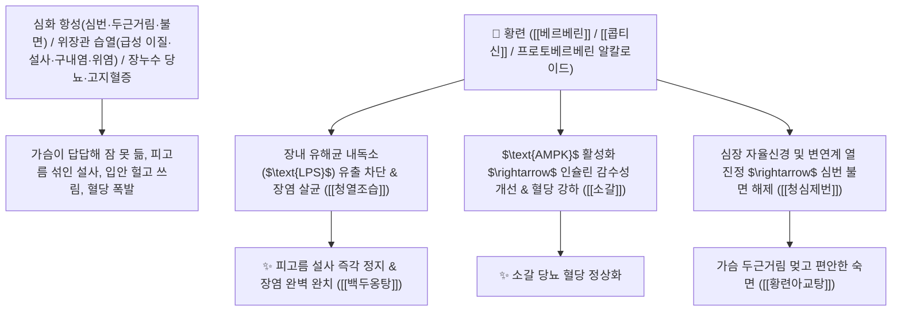

# 🌿 [[황련]] (黃連 / 川連, Coptidis Rhizoma / 황련뿌리줄기)

> **핵심 요약 (Key Summary)**:
> 미나리아재비과(*Ranunculaceae*) 황련(*Coptis chinensis*) 또는 삼각엽황련의 건조한 뿌리줄기
> 이소퀴놀린 알칼로이드인 [[베르베린]](Berberine)과 [[콥티신]](Coptisine) 및 팔미틴이 장내 미생물 내독소($\text{LPS}$) 유출을 차단하고 $\text{AMPK}$를 활성화하여 청열조습 및 사심제번 작용 발휘
> [[상한론]] 및 [[소양인]]의 심번 불면(가슴속이 화끈거리고 두근거려 잠 못 듦·황련아교탕 黃連阿膠湯)·심하비(명치 막힘·반하사심탕)·급성 세균성 이질 설사(백두옹탕 白頭翁湯)·구내염 위장염·소갈(당뇨병)을 치료하는 천하제일의 "심장 불과 위열을 끄는 성약(淸心瀉火之要藥)"·[[청열조습]](淸熱燥濕)·[[사화해독]](瀉火解毒)·[[청심제번]](淸心除煩)·[[황련해독탕]](黃連解毒湯)·[[반하사심탕]](半夏瀉心湯)의 군약(君藥)

---
## 📌 목차
1. [기본 본초 정보 & 화학 구조 (Pharmacognosy)](#1-기본-본초-정보--화학-구조-pharmacognosy)
2. [핵심 분자약리 기전 & 베르베린·LPS 내독소 차단·AMPK 대사 네트워크](#2-핵심-분자약리-기전--베르베린lps-내독소-차단ampk-대사-네트워크)
3. [해부생체역학 / 장점막 상피 치밀결합(Tight Junction) & 심장 신경총 연계](#3-해부생체역학--장점막-상피-치밀결합tight-junction--심장-신경총-연계)
4. [사상의학 및 소양인 심화 항성증 & 황련 포제별(강황련/주황련) 감별](#4-사상의학-및-소양인-심화-항성증--황련-포제별강황련주황련-감별)
5. [상한론 『약징(藥徵)』 분석 및 배오 원리 (황련아교탕 & 반하사심탕)](#5-상한론-약징藥徵-분석-및-배오-원리-황련아교탕--반하사심탕)
6. [핵심 처방 비교 매트릭스](#6-핵심-처방-비교-매트릭스)
7. [출처 및 학술 참고 문헌 (References)](#7-출처-및-학술-참고-문헌-references)

---
## 1. 기본 본초 정보 & 화학 구조 (Pharmacognosy)

| 항목 | 상세 내용 |
| :--- | :--- |
| **기원 식물** | 미나리아재비과(Ranunculaceae) 황련 *Coptis chinensis* Franch.의 건조한 뿌리줄기 |
| **성미 (性味)** | 苦, 大寒 (몹시 쓰고 성질이 극도로 차가우며 온몸의 염증과 불길을 단숨에 진압) |
| **귀경 (歸經)** | 心·脾·胃·肝·大腸經 (심경, 비경, 위경, 간경, 대장경) - **심장의 번열을 끄고 위장관의 습열 독소를 살균** |
| **효능 (Actions)** | [[청열조습]](淸熱燥濕), [[사화해독]](瀉火解毒), [[청심제번]](淸心除煩), [[소갈지갈]](消渴止渴) |
| **주요 성분** | • **프로토베르베린 알칼로이드(핵심 지표물질)**: [[베르베린]] (Berberine, KP 규격 $\ge 4.2\%$), [[콥티신]] (Coptisine)<br>• **이소퀴놀린 유도체**: [[팔미틴]] (Palmatine), 베르베루빈, 자트릴리진<br>• **페놀성 성분**: 페룰산, 클로로겐산 |

> **[유래 및 본초학적 기전]**:
> * 뿌리가 노랗고 마디마디가 사슬처럼 잇달아(連) 있다 하여 '황련(黃連)'이라 불렸습니다.
> * **"심장 불(心火)이 치솟아 가슴이 화끈거리고 두근거리며 잠을 이루지 못하는 심번불면(心煩不眠)과 위장관의 세균성 독소를 박멸하는 한의학 최고의 광범위 천연 항생제"**입니다.
> * 장내 유해균의 내독소($\text{LPS}$) 누출을 틀어막아 당뇨, 비만, 간염, 통풍, 뇌졸중(중풍) 대사 질환을 치료합니다.

### 🔬 황련의 주요 베르베린 화학 구조 및 장내 미생물 LPS 제어 기전
```
     [ 사차 벤조[g]-1,3-벤조디옥솔로이소퀴놀린 알칼로이드 양이온 ]  <-- 베르베린 (Berberine)
```
![[Pasted image 20240228143508.png]]
![[Pasted image 20240228143517.png]]
![[Pasted image 20240228143538.png]]
![[Pasted image 20240228143554.png]]
![[Pasted image 20240228143603.png]]
> **[구조적 특징 및 AMPK/장벽 보호 기전]**: 황련의 [[베르베린]]은 세포 내 에너지 센서인 [[AMPK]]를 직접 활성화하여 포도당 흡수를 촉진(인슐린 감수성 개선)하고, 장 점막 상피의 치밀결합(ZO-1, Occludin)을 강화하여 장내 유해균 사멸 시 발생하는 지질다당체(**$\text{LPS}$ 내독소**)가 혈액으로 유입되는 장누수(Leaky Gut)를 원천 차단합니다.

---
## 2. 핵심 분자약리 기전 & 베르베린·LPS 내독소 차단·AMPK 대사 네트워크



### (1) 표적 청심제번 및 세균성 장염 완치 작용
* **심화 항성성 심번 불면 및 신경쇠약 완치 ([[황련아교탕]] 黃連阿膠湯)**:
  * 가슴이 화끈거리고 답답하여 밤새 뒤척이는 번열증을 차분히 식혀줍니다.
* **급성 세균성 이질, 장염 및 설사 복통 완치 ([[백두옹탕]] & [[갈근황금황련탕]])**:
  * 이질균, 콜레라균, 황색포도상구균을 살균하여 피고름 설사를 즉각 멎게 합니다.
* **소갈병(당뇨병) 및 대사증후군 개선 ([[소갈지갈]] 消渴止渴)**:
  * $\text{AMPK}$ 경로를 통해 혈당을 내리고 간질환 및 통풍을 개선합니다.

---
## 3. 해부생체역학 / 장점막 상피 치밀결합(Tight Junction) & 심장 신경총 연계

* **장관 점막 상피 장벽(ZO-1) 투과성 정상화**:
  * 전신 만성 미세염증의 주원인인 내독소혈증(Endotoxemia)을 근본적으로 차단합니다.

---
## 4. 사상의학 및 소양인 심화 항성증 & 황련 포제별(강황련/주황련) 감별

```
[🔍 사상의학 소양인 심화 치료]
• 소양인(少陽人)은 흉격과 심장에 화열이 뭉쳐 가슴이 답답하고 화병이 생기기 쉬움
$\rightarrow$ 황련은 소양인의 가슴 불을 끄고 위장의 염증을 씻어내는 핵심 군약 ([[황련해독탕]], [[형방사백산]])

[🔍 황련의 포제별 작용 부위]
• 생황기/생황련(生黃連): 瀉火, 淸熱解毒 최강 $\rightarrow$ 심장 불, 위장 실열, 급성 이질
• 주황련(酒黃連, 술로 볶음): 약기운을 머리로 끌어올림 $\rightarrow$ 상초 두면부 충혈, 눈 충혈, 구내염
• 강황련(薑黃連, 생강즙으로 볶음): 쓴맛과 차가운 성질을 완화 $\rightarrow$ 위를 상하지 않고 구토와 소화기 염증 치료
```

---
## 5. 상한론 『약징(藥徵)』 분석 및 배오 원리 (황련아교탕 & 반하사심탕)

### (1) 심번과 심하비를 다스리는 불후의 황제방
* **『약징(藥徵)』 주치**:
  * "황련은 심번(心煩, 가슴속이 갑갑하고 두근거림)을 주치한다. 심하비(心下痞), 구토, 설사, 뱃속 통증을 겸치한다."
* **자음청심 최고 배오**:
  * [[황련]] + [[아교]] + [[황금]] + [[작약]] + 계자황(달걀노른자) $\rightarrow$ 음허 심번 불면의 제1방 ([[황련아교탕]])
* **고신개강 최고 배오**:
  * [[황련]] + [[황금]] + [[반하]] + [[건강]] $\rightarrow$ 명치 답답함과 설사를 뚫는 명방 ([[반하사심탕]])

---
## 6. 핵심 처방 비교 매트릭스

| 처방명 | 구성 약재 | 주치 병증 및 임상 타깃 | 특징 및 감별점 |
| :--- | :--- | :--- | :--- |
| [[황련아교탕]] | [[황련]], [[아교]], [[황금]], [[작약]], 계자황 | **소음병 득병 이삼일, 심번부득와, 설홍태소, 불면증** | 심번 불면 치료의 제1 황제방 |
| [[백두옹탕]] | [[백두옹]], [[황련]], [[황백]], [[진피(물푸레나무껍질)]] | **열독 하리, 이질, 농혈변, 이급후중, 복통** | 세균성 이질 치료의 대표방 |
| [[황련해독탕]] | [[황련]], [[황금]], [[황백]], [[치자]] | **삼초 실열 화독, 고열 번조, 구갈, 섬어, 옹종** | 전신 화열을 끄는 제1방 |
| [[반하사심탕]] | [[반하]], [[황금]], [[건강]], [[인삼]], [[황련]], [[감초]], [[대추]] | **심하비만, 구토, 장명 하리, 소화불량** | 명치 답답함과 설사를 치료 |

---
## 7. 출처 및 학술 참고 문헌 (References)
- **최신 문헌 (2025~2026)**:


1. **Chen J et al. (2026)**. Berberine as an Antimicrobial Agent and Gut Microbiota Modulator: Mechanisms and Therapeutic Potential. *Current medicinal chemistry*. [PMID: 42381319](https://pubmed.ncbi.nlm.nih.gov/42381319/)
   - **[연구 요약]**: 황련의 베르베린 성분이 장내 세균총 조절 및 LPS 누출 차단, AMPK 활성화를 통해 당뇨병, 비만, 장염, 심근염을 개선함을 입증.
2. **대한민국약전(KP) 제12개정 (2022)**. 의약품각조 제2부: 황련 (Coptidis Rhizoma) 규격 기준.
   - **[공정서 규격]**: 건조 뿌리줄기 기준 베르베린($\text{C}_{20}\text{H}_{18}\text{NO}_4$) 4.2% 이상 함유 필수 규격 명시.
3. **길익동동 (吉益東洞, 1785)**. 『약징(藥徵)』: 황련 조문.
   - **[고전 원전]**: "黃連 主治心煩也. 旁治心下痞, 嘔, 下利, 腹中痛."
