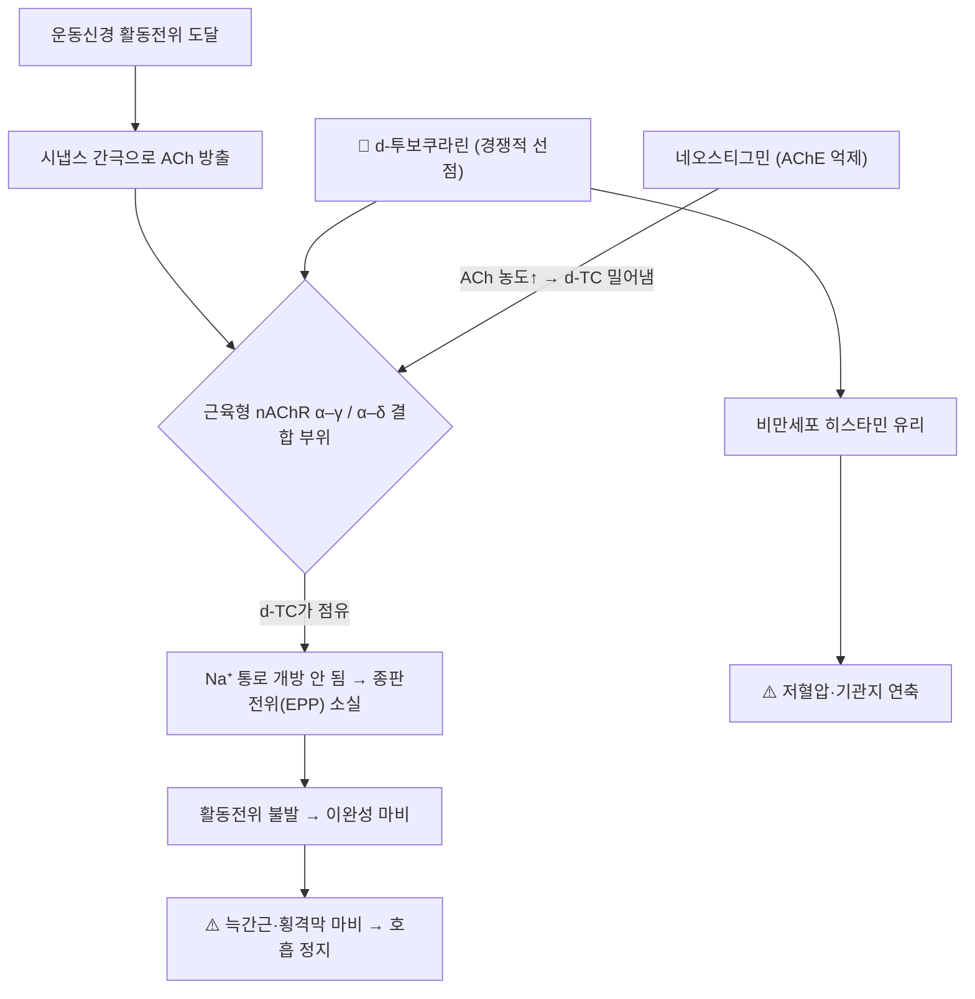

# 🔬 d-투보쿠라린 (d-Tubocurarine, C₃₇H₄₁N₂O₆⁺)

> **핵심 3줄 요약 (Key Summary)**:
> - 🌿 기원 & 화학 계열: 남아메리카 화살독 쿠라레(Curare)의 원료인 방기과 덩굴식물 *Chondrodendron tomentosum*에서 얻는 비스벤질이소퀴놀린(Bisbenzylisoquinoline) [[알칼로이드]]. 한약 처방에 배합되는 성분은 아니며, 한의학의 [[방기]]와는 과(科)만 같다.
> - 🎯 핵심 분자 표적: 골격근 운동종판의 근육형 니코틴성 [[아세틸콜린]] 수용체(nAChR)에서 α–γ·α–δ 서브유닛 경계면의 ACh 결합 부위를 경쟁적으로 점유해 종판 탈분극을 막는 **비탈분극성 신경근 차단제**의 원형(PMID 2320589).
> - 🩺 임상적 의의: 1942년 전신마취에 처음 도입되어(Griffith & Johnson) 현대 근이완제(로쿠로늄·베쿠로늄·아트라쿠륨 등) 개발의 기준 화합물이 되었고, 지금도 신약 연구의 대조 약물로 쓰인다(Frangež 2026, *short-acting non-depolarizing muscle relaxants derived from galantamine*, PMID 41671734).
> - <font color="#fa7e7e">⚠️ 독성·주의: 호흡근([[횡격막]]) 마비로 자발 호흡이 멈추므로 인공호흡 없이는 치명적. 0.5 mg/kg 정주 1분 뒤 혈장 [[히스타민]]이 약 2.5배로 오르며(PMID 7577286) [[저혈압]]·기관지 연축 위험. 신부전에서는 배설 지연으로 차단이 길어진다(PMID 195035).</font>

---

## 📌 목차
1. [기본 화학 정보 & 분자 구조식 (Chemical Identity)](#1-기본-화학-정보--분자-구조식-chemical-identity)
2. [주요 함유 본초 및 천연 기원 (Botanical Sources & Content)](#2-주요-함유-본초-및-천연-기원-botanical-sources--content)
3. [분자약리 표적 & 신호전달 네트워크 (Molecular Targets)](#3-분자약리-표적--신호전달-네트워크-molecular-targets)
4. [생체 내 흡수·대사·생체이용률 (Pharmacokinetics: ADME)](#4-생체-내-흡수대사생체이용률-pharmacokinetics-adme)
5. [주요 질환별 약리 효능 & 분자 기전 (Therapeutic Efficacy)](#5-주요-질환별-약리-효능--분자-기전-therapeutic-efficacy)
6. [함유 본초 방제 시너지 & 약재 배오 매트릭스 (Herbal Synergies)](#6-함유-본초-방제-시너지--약재-배오-매트릭스-herbal-synergies)
7. [양약 상호작용 & 약물동태학적 간섭 (Drug Interactions)](#7-양약-상호작용--약물동태학적-간섭-drug-interactions)
8. [💡 사용자 진료실 핵심 필기 & 임상 응용 팁 (Melt-In & High-Yield)](#8--사용자-진료실-핵심-필기--임상-응용-팁-melt-in--high-yield)
9. [출처 및 학술 참고 문헌 (References)](#9-출처-및-학술-참고-문헌-references)

---

## 1. 기본 화학 정보 & 분자 구조식 (Chemical Identity)

### 1.1 화학적 특성
d-투보쿠라린은 두 개의 벤질이소퀴놀린 단위가 두 개의 디페닐에테르 다리로 고리 모양으로 이어진 비스벤질이소퀴놀린 이합체입니다. PubChem 등록 IUPAC명을 보면 질소 하나는 4급 암모늄(azonia), 다른 하나는 3급 아민(aza)으로 표기되어 **4급 1개 + 3급 1개** 구조임이 확인됩니다 — 아래 원장님 수기 필기의 "4급/3급 질소" 도해와 일치합니다. 생리적 pH에서는 3급 질소도 대부분 양성자화되어 두 개의 양전하 중심이 일정 간격을 두고 배치되는데, 이것이 오량체 수용체의 두 ACh 결합 부위에 걸쳐 결합하는 구조적 바탕으로 설명됩니다.

| 항목 (Property) | 세부 정보 (Specification) |
| :--- | :--- |
| **IUPAC 명칭** | (1S,16R)-10,25-dimethoxy-15,15,30-trimethyl-7,23-dioxa-30-aza-15-azoniaheptacyclo[22.6.2.2³,⁶.1⁸,¹².1¹⁸,²².0²⁷,³¹.0¹⁶,³⁴]hexatriaconta-3(36),4,6(35),8(34),9,11,18(33),19,21,24,26,31-dodecaene-9,21-diol (PubChem) |
| **분자식 / 분자량** | C₃₇H₄₁N₂O₆⁺ / 609.7 g/mol (양이온, PubChem CID 6000) · 염화물 무수물 C₃₇H₄₂Cl₂N₂O₆ / 681.6 g/mol (CID 16051918) |
| **PubChem CID** | [6000](https://pubchem.ncbi.nlm.nih.gov/compound/6000) |
| **CAS 등록번호** | 57-95-4 (PubChem 동의어 기준) · 염산염 5수화물 6989-98-6 ⚠️ 원문 기재, CAS 원본 대조 못 함 |
| **화학 골격 분류** | 비스벤질이소퀴놀린 알칼로이드 (4급 암모늄 1개 포함) |
| **물리화학 지표** | XLogP 6.0 · TPSA 80.6 Ų · 수소결합 공여 2 / 수용 7 (PubChem 계산값) |
| **성상·용해도** | 백색~미황색 결정성 분말, 물에 가용(1:20)·알코올 가용·에테르/클로로포름 불용 ⚠️ 원문 기재, 이번 작업에서 약전 원문 대조는 못 함 |
| **구조적 특이성** | 두 양전하 질소 사이 거리 약 1.4 nm(10~14 Å)가 수용체 두 결합 부위 간격과 맞는다는 원문 서술 ⚠️ 거리 수치의 1차 근거는 확인하지 못함 |

### 1.2 2D 분자 구조식
![[d-투보쿠라린_2D_구조식.png|300]]
> [그림 1: ① 2D 화학 구조식 — d-투보쿠라린(PubChem CID 6000). 두 벤질이소퀴놀린 단위가 에테르 다리로 연결된 거대 고리. 출처: [PubChem](https://pubchem.ncbi.nlm.nih.gov/compound/6000)]

![[d-투보쿠라린-20240916020958355.png|350]]
> [그림 2: 원장님 수기 필기 — 4급/3급 질소를 지닌 비스벤질이소퀴놀린 이합체 골격 도해 (원본 필기 보존)]

### 1.3 3D 약리 분자 구조 (Interactive Viewer)
> [!abstract]+ 🧪 3D 약리 분자 구조 (Interactive 3D Viewer)
> <iframe src="https://molecule-viewer-rho.vercel.app/?cid=6000" width="100%" height="450px" frameborder="0" allow="webgl" style="border-radius: 8px;"></iframe>

---

## 2. 주요 함유 본초 및 천연 기원 (Botanical Sources & Content)

![[d-투보쿠라린_2_기원식물_Chondrodendron.jpg|400]]
> [그림 3: ② 기원 식물 도해 — *Chondrodendron tomentosum* Ruiz & Pav.(방기과)의 잎·꽃차례·열매·줄기 단면. 출처: R. Bentley & H. Trimen, *Medicinal Plants*(1880), Wellcome Collection via [Wikimedia Commons](https://commons.wikimedia.org/wiki/File:R._Bentley_%26_H._Trimen,_Medicinal_Plants_Wellcome_L0019166.jpg) (CC BY 4.0)]

남아메리카 아마존 유역 원주민이 사냥용 독화살에 바르던 갈색 점조성 추출물 **쿠라레(Curare)**의 핵심 알칼로이드입니다. 대나무 관(tube)에 담아 보관하던 쿠라레를 '튜보쿠라레(tube curare)'라 부른 데서 이름이 유래했습니다.

| 기원 | 식물학적 명칭 | 약용 부위 | 비고 |
| :--- | :--- | :--- | :--- |
| 튜보쿠라레(tube curare) | 방기과 / *Chondrodendron tomentosum* Ruiz & Pav. | 줄기 껍질·뿌리줄기 | 대형 목질 덩굴, 남미 고유종 — 한의학 본초 목록에 없음 |
| (구분) 한약 [[방기]] | 방기과 동아시아 식물 | 뿌리·줄기 | 같은 방기과지만 **다른 식물·다른 약재**. 방기 계열의 대표 알칼로이드는 [[시노메닌]] 등 |

> [!note] 한의학 처방 배오와의 구분
> 콘드로덴드론은 한의학 본초가 아니므로 d-투보쿠라린은 한약 처방에 실제로 배합되는 성분이 아닙니다. [[방기]]와 과(科)만 같을 뿐 동일 본초로 보면 안 됩니다.

* ⚠️ 쿠라레에는 식물·지역에 따라 다른 계열이 있습니다(예: 박 그릇 쿠라레 원료인 마전과 *Strychnos* 속 — [[스트리크닌]]과 같은 속). 계열별 원료 식물 구분은 이번 작업에서 문헌으로 확인하지 못해 원문 수준으로만 둡니다.

---

## 3. 분자약리 표적 & 신호전달 네트워크 (Molecular Targets)

![[d-투보쿠라린_3_신경근접합부.png|450]]
> [그림 4: ③ 표적 부위 도해 — 신경근접합부(운동신경 말단·시냅스 간극·근섬유의 ACh 수용체). d-투보쿠라린은 근섬유 쪽 ACh 수용체를 선점한다. 출처: Doctor Jana, [Wikimedia Commons](https://commons.wikimedia.org/wiki/File:Neuro_Muscular_Junction.png) (CC BY 4.0)]



### 3.1 신경근접합부(NMJ) 비탈분극성 경쟁적 차단
* **결합 부위**: 근육형 nAChR는 2α·β·γ(성인은 ε)·δ로 이루어진 오량체입니다. *Torpedo* 수용체를 d-[³H]투보쿠라린으로 광친화 표지한 연구에서 d-투보쿠라린은 **α–γ 경계면(고친화, Kd 35 nM)**과 **α–δ 경계면(저친화, Kd 1.2 μM)** 두 부위에 결합했고, 두 결합 부위 모두 서브유닛 사이 경계면에 있음이 확인되었습니다(Pedersen & Cohen 1990, PMID 2320589).
* **경쟁적 길항**: 스스로 수용체를 열지 않으면서 ACh 결합을 막아 [[나트륨]](Na⁺) 유입과 종판전위 형성을 차단하고, 근섬유로 활동전위가 전도되지 못해 **이완성 마비(flaccid paralysis)**가 일어납니다. 쥐 횡격막 표본에서 d-투보쿠라린의 IC50는 1.57 μM, 마취 랫드 정주 ED50는 0.07 mg/kg였고 연축 완전 회복까지 약 34분이 걸렸습니다(Frangež 2026, *non-depolarizing muscle relaxants derived from galantamine*, PMID 41671734).
* **역전 원리**: 경쟁적 길항이므로 시냅스 ACh 농도를 높이면 차단이 풀립니다. 이 원리로 콜린에스테라아제 억제제([[네오스티그민]] 등)가 역전제로 쓰입니다(§7). 해양 독소 gambierol은 운동신경 말단 K⁺ 통로를 막아 ACh 양자 방출을 늘림으로써 d-투보쿠라린 차단을 역전시켰습니다(Molgó 2020, PMID 31255710).

### 3.2 마비 진행 순서 (원문)
1. 외안근(복시)·안면근 → 2. 저작근·인두근·후두근(연하 곤란, 발성 불가) → 3. 사지·체간 골격근 → 4. **마지막으로 늑간근·[[횡격막]] 마비 → 자발 호흡 정지**
* ⚠️ 부위별 민감도 순서는 마취약리학 교과서 서술이며 이번 작업에서 1차 문헌으로 확인하지 못했습니다.

### 3.3 히스타민 유리 (부작용 기전)
* 수술 환자 75명 무작위 비교에서 d-투보쿠라린 0.5 mg/kg 급속 정주 1분 뒤 혈장 히스타민이 252%, 3분 뒤 157% 증가했습니다. 같은 조건에서 스테로이드계 근이완제(로쿠로늄 0.6 mg/kg, 베쿠로늄 0.1 mg/kg)는 히스타민·혈역학 변화가 없었습니다(Naguib 1995, PMID 7577286).
* 랫드에서 투보쿠라린은 분리 비만세포에서 히스타민을 유리했고 혈장 히스타민 증가와 상관을 보였습니다(Kubota 1986, PMID 2431703). 할로탄이 d-투보쿠라린 유도 히스타민 유리를 억제한다는 보고도 있습니다(Kettlekamp 1987, PMID 2437835, 제목 기준).

---

## 4. 생체 내 흡수·대사·생체이용률 (Pharmacokinetics: ADME)

| 약동학 파라미터 | 수치 | 근거·임상적 의의 |
| :--- | :--- | :--- |
| **경구 흡수** | 거의 흡수되지 않음 (원문: 0%) | 4급 암모늄 양이온이라 장 점막 투과가 어렵다는 원문 서술. ⚠️ 정량 수치의 1차 근거는 확인하지 못함 |
| **투여 경로** | 정맥주사 | 신경근접합부로 즉시 도달 |
| **작용 발현 / 지속** | 1~3분 / 40~90분 (원문) | ⚠️ 1차 문헌 미확인. 랫드 연축 완전 회복 약 34분(PMID 41671734, 동물) |
| **말단 반감기** | **231~346분** (약 4~6시간) | 사람: 346분(0.15 mg/kg, Meijer 1979, PMID 496054) · 231분(신기능 정상, Miller 1977, PMID 195035). ⚠️ 원문 '1.5~2.5시간'은 문헌과 맞지 않아 정정 |
| **대사** | **대사체 검출 안 됨** | 소변·담즙에서 대사체가 발견되지 않음(PMID 496054). ⚠️ 원문 '간 대사 40%'는 문헌과 맞지 않아 정정 |
| **배설** | 신장 46~95%(48시간) · 담즙 11.8% | 미변화체 배설(PMID 496054). 전신 청소율 56 mL/min |
| **신부전** | 차단 지속 연장 | 신부전 환자에서 차단이 길어진 원인은 민감도 증가가 아니라 **배설 속도 감소**였다(0.5 mg/kg, 25시간 소변 미변화체 38% vs 이식 직후 13%, PMID 195035) |

* 흡입마취 종류가 약동·약력학에 영향을 주는지는 아산화질소-마약성 진통제 마취와 할로탄 마취를 비교한 연구가 있습니다(Stanski 1979, PMID 475025, 제목 기준).

---

## 5. 주요 질환별 약리 효능 & 분자 기전 (Therapeutic Efficacy)

### 5.1 현대 마취과학의 전환점 (역사적 적응증)
* 1942년 몬트리올의 Griffith와 Johnson이 쿠라레를 전신마취에 처음 사용한 보고를 발표했습니다([Griffith & Johnson 1942, *Anesthesiology* 3:418-420](https://doi.org/10.1097/00000542-194207000-00006)). 깊은 마취 없이 복벽 근이완과 기관내 삽관을 가능하게 했다는 것이 원문의 요지입니다.
* ⚠️ '수술 사망률을 극적으로 낮추었다'는 원문 표현은 이번 작업에서 정량 근거를 확인하지 못했습니다.

### 5.2 비탈분극성 근이완제 개발의 기준 화합물
* 판쿠로늄·베쿠로늄·로쿠로늄(스테로이드계), 아트라쿠륨·미바쿠륨(벤질이소퀴놀리늄계) 등 현대 비탈분극성 근이완제(NMBA)가 d-투보쿠라린의 경쟁적 길항 원리를 공유합니다. 벤질이소퀴놀리늄계는 d-투보쿠라린처럼 히스타민 유리 경향이 있고 스테로이드계는 적다는 차이가 확인됩니다(PMID 7577286).
* 2020년대 신약 연구에서도 여전히 대조 약물입니다 — ZINC15 가상 스크리닝에서 d-투보쿠라린을 기준 화합물로 삼아 더 나은 도킹 점수의 후보를 찾았고(Zhang 2024, PMID 38731447), [[갈란타민]] 골격에 4급 암모늄 사슬을 붙인 DR-976은 d-투보쿠라린과 비슷한 IC50(1.45 vs 1.57 μM)에 회복은 더 빨랐습니다(PMID 41671734).
* ⚠️ '모든 NMBA의 분자 모핵'이라는 원문 표현은 과장입니다 — 스테로이드계는 골격이 다르고 작용 원리만 공유합니다.

### 5.3 현재 임상 위치
* 히스타민 유리·저혈압 부작용과 긴 작용 시간 때문에 현재 임상 마취에서는 거의 쓰이지 않고 약리학 교육·실험용 표준 길항제로 남아 있습니다. ⚠️ 국내 허가·유통 현황은 이번 작업에서 식약처 자료로 확인하지 못했습니다.

---

## 6. 함유 본초 방제 시너지 & 약재 배오 매트릭스 (Herbal Synergies)

> [!warning] ⚠️ 템플릿 적용 상 주의
> d-투보쿠라린은 한약 처방에 배합되지 않는 남미 화살독 유래 알칼로이드입니다. 이 절은 "함유 처방의 배오" 대신, **신경근·신경막 마비를 일으키는 한의학 독성 본초와의 기전 대비표**로 대체합니다. 아래 본초들을 d-투보쿠라린과 병용하는 처방은 존재하지 않습니다.

| 비교 대상 | 분자 표적 | 마비 양상 | 역전·해독 |
| :--- | :--- | :--- | :--- |
| **d-투보쿠라린** | 근육형 nAChR (시냅스 후, 경쟁적 차단) | 비탈분극성 이완 마비 | [[네오스티그민]] 등 AChE 억제제 |
| [[부자]]의 [[아코니틴]] | 전압의존성 Na⁺ 채널 (지속 개방) | 지속 탈분극 → 흥분 후 마비·부정맥 | 특이 해독제 없음, 대증 치료 ⚠️(상세는 [[아코니틴]] 노트) |
| [[스트리크닌]] | 척수 글리신 수용체 차단 | 억제 소실 → 강직성 경련 | 대증(경련 조절) |

* 한약 [[방기]]는 같은 방기과지만 d-투보쿠라린을 함유하지 않습니다(§2).

---

## 7. 양약 상호작용 & 약물동태학적 간섭 (Drug Interactions)

* **[[네오스티그민]] + 아트로핀 (마비 역전)**: AChE 억제로 시냅스 ACh를 늘려 d-투보쿠라린을 결합 부위에서 밀어냅니다. 네오스티그민의 무스카린성 부작용(서맥·기관지 분비 증가)을 막기 위해 항무스카린제 아트로핀을 함께 씁니다. 에드로포늄·네오스티그민으로 d-투보쿠라린 차단을 역전할 때의 약동학 비교 연구가 있습니다(Morris 1981, PMID 7224209, 제목 기준).
* **휘발성 흡입마취제 — 차단 증강**: 휘발성 마취제가 d-투보쿠라린의 신경근 차단 작용을 증강한다는 연구가 있습니다(Vermeer 1974, PMID 4458482, 제목 기준). 반면 할로탄은 d-투보쿠라린의 히스타민 유리를 억제했습니다(PMID 2437835).
* **아미노글리코사이드 항생제(겐타마이신 등) — 차단·호흡억제 증강**: 겐타마이신·투보쿠라린·리그노카인([[리도카인]]) 병용 중 신경근 차단이 문제된 증례 보고가 있고(Hall 1972, PMID 4568132), 아미노글리코사이드 자체의 신경근 차단 작용이 비교 연구되었습니다(Paradelis 1980, PMID 6121961). 수술 중 병용 시 호흡 회복을 확인해야 합니다.
* **[[마그네슘]]·[[칼슘]]**: 마그네슘·칼슘이 근이완제와 아미노글리코사이드 차단에 미치는 영향을 본 연구가 있습니다(Okamoto 1992, PMID 1479660, 일본어·제목 기준). ⚠️ 방향과 크기는 이번 작업에서 초록으로 확인하지 못했습니다.
* **신부전 환자**: 배설 지연으로 차단이 길어지므로(PMID 195035) [[신부전]] 환자에게는 용량·모니터링 주의.

---

## 8. 💡 사용자 진료실 핵심 필기 & 임상 응용 팁 (Melt-In & High-Yield)

> 원문 필기 중 §3·§6·§7에 녹이지 못한 고유 내용만 남깁니다.

### 8.1 한의학 독성 본초와의 신경근 전기생리학적 대비 (원문 필기)
- **d-투보쿠라린 (비탈분극성 마비)**: 니코틴 수용체를 막아 탈분극이 "아예 일어나지 못하게" 해 근육이 축 늘어짐.
- **부자의 아코니틴 (탈분극성 마비)**: 전압의존성 Na⁺ 채널을 "계속 열어" 탈분극 상태로 고정시켜 마비.
- 같은 호흡 마비 독성이지만 표적이 정반대 — 한방 독성학을 설명하는 좋은 대비 소재.

```
[신경근 마비 기전의 대척점]
d-투보쿠라린 ──► NM 수용체 차단 ──► Na+ 유입 차단 ──► 비탈분극성 이완 마비 (Flaccid)
부자 (아코니틴) ─► 전압 Na+ 채널 개방 ──► Na+ 과유입 ──► 지속 탈분극성 강직/마비 (Depolarizing)
```

### 8.2 경구 무독성(Oral Non-toxicity)의 약리학적 통찰 (원문 필기)
- "화살독에 맞아 죽은 짐승의 고기를 원주민이 먹어도 왜 중독되지 않았는가?" → 4급 암모늄 양이온이라 장 점막 지질이중층을 거의 통과하지 못하기 때문.
- 한약재 경구 복용 시 장관 흡수율과 지용성·수용성 균형(Lipinski's Rule of 5)을 설명하는 강의 소재.

### 8.3 진료실 연결 포인트
- **"독화살 성분이 수술 약이 되었다"** — 독성과 약효는 용량·경로의 문제라는 점을 환자 교육에 쓸 수 있음(부자 포제 설명과 연결).
- 신부전 환자는 수술 후 근이완 회복이 늦을 수 있다는 점을 [[신부전]] 환자 상담 시 참고(원인은 배설 지연, PMID 195035).

---

## 9. 출처 및 학술 참고 문헌 (References)

1. **Pedersen SE, Cohen JB. (1990)**. *d-Tubocurarine binding sites are located at alpha-gamma and alpha-delta subunit interfaces of the nicotinic acetylcholine receptor*. **Proc Natl Acad Sci U S A**, 87(7):2785-2789. [PMID 2320589](https://pubmed.ncbi.nlm.nih.gov/2320589/) · [DOI](https://doi.org/10.1073/pnas.87.7.2785)
   - **[연구 요약]**: 광친화 표지로 d-투보쿠라린 결합 부위가 α–γ(Kd 35 nM)·α–δ(Kd 1.2 μM) 경계면에 있음을 규명.
2. **Frangež R, Rouleau J, Molgó J, et al. (2026)**. *Novel short-acting non-depolarizing muscle relaxants derived from galantamine: Design, synthesis, and pharmacological evaluation*. **Biomed Pharmacother**, 196:119099. [PMID 41671734](https://pubmed.ncbi.nlm.nih.gov/41671734/) · [DOI](https://doi.org/10.1016/j.biopha.2026.119099)
   - **[연구 요약]**: 갈란타민 유래 DR-976·화합물 15를 d-투보쿠라린(랫드 ED50 0.07 mg/kg, 회복 34분, IC50 1.57 μM)과 비교. *(기존 기재 저자 'Chen X'·권호 '184'는 오류라 정정)*
3. **Zhang Y, Ge G, Xu X, Wu J. (2024)**. *Ensemble-Based Virtual Screening Led to the Discovery of Novel Lead Molecules as Potential NMBAs*. **Molecules**, 29(9):1955. [PMID 38731447](https://pubmed.ncbi.nlm.nih.gov/38731447/) · [DOI](https://doi.org/10.3390/molecules29091955)
   - **[연구 요약]**: d-투보쿠라린을 기준 화합물로 ZINC15에서 nAChR 결합 후보를 가상 스크리닝. *(기존 기재 저자 'Al-Sha'er MA'는 오류라 정정)*
4. **Molgó J, Schlumberger S, Sasaki M, et al. (2020)**. *Gambierol Potently Increases Evoked Quantal Transmitter Release and Reverses Pre- and Post-Synaptic Blockade at Vertebrate Neuromuscular Junctions*. **Neuroscience**, 439:106-116. [PMID 31255710](https://pubmed.ncbi.nlm.nih.gov/31255710/) · [DOI](https://doi.org/10.1016/j.neuroscience.2019.06.024)
   - **[연구 요약]**: gambierol이 K⁺ 통로 억제로 ACh 방출을 늘려 d-투보쿠라린 시냅스 후 차단을 역전. *(기존 기재 저자 'Nagai H'·쪽수 '206-221'은 오류라 정정)*
5. **Meijer DK, Weitering JG, Vermeer GA, Scaf AH. (1979)**. *Comparative pharmacokinetics of d-tubocurarine and metocurine in man*. **Anesthesiology**, 51(5):402-407. [PMID 496054](https://pubmed.ncbi.nlm.nih.gov/496054/) · [DOI](https://doi.org/10.1097/00000542-197911000-00007)
   - **[연구 요약]**: 말단 반감기 346분, 대사체 없음, 48시간 신배설 46~95%·담즙 11.8%, 청소율 56 mL/min.
6. **Miller RD, Matteo RS, Benet LZ, Sohn YJ. (1977)**. *The pharmacokinetics of d-tubocurarine in man with and without renal failure*. **J Pharmacol Exp Ther**, 202(1):1-7. [PMID 195035](https://pubmed.ncbi.nlm.nih.gov/195035/)
   - **[연구 요약]**: 신부전 시 차단 연장은 민감도 증가가 아닌 배설 감소 때문.
7. **Naguib M, Samarkandi AH, Bakhamees HS, et al. (1995)**. *Histamine-release haemodynamic changes produced by rocuronium, vecuronium, mivacurium, atracurium and tubocurarine*. **Br J Anaesth**, 75(5):588-592. [PMID 7577286](https://pubmed.ncbi.nlm.nih.gov/7577286/) · [DOI](https://doi.org/10.1093/bja/75.5.588)
   - **[연구 요약]**: 투보쿠라린 0.5 mg/kg 후 혈장 히스타민 1분 252% 증가, 스테로이드계는 변화 없음.
8. **Kubota Y, et al. (1986)**. *Effects of tubocurarine on plasma histamine concentration in the rat. Correlation with the release of histamine from isolated mast cells*. **Br J Anaesth**, 58(12):1397-1403. [PMID 2431703](https://pubmed.ncbi.nlm.nih.gov/2431703/)
9. **Kettlekamp NS, et al. (1987)**. *Inhibition of d-tubocurarine-induced histamine release by halothane*. **Anesthesiology**, 66(5):666-669. [PMID 2437835](https://pubmed.ncbi.nlm.nih.gov/2437835/)
10. **Stanski DR, et al. (1979)**. *Pharmacokinetics and pharmacodynamics of d-tubocurarine during nitrous oxide-narcotic and halothane anesthesia in man*. **Anesthesiology**, 51(3):235-241. [PMID 475025](https://pubmed.ncbi.nlm.nih.gov/475025/)
11. **Morris RB, et al. (1981)**. *Pharmacokinetics of edrophonium and neostigmine when antagonizing d-tubocurarine neuromuscular blockade in man*. **Anesthesiology**, 54(5):399-401. [PMID 7224209](https://pubmed.ncbi.nlm.nih.gov/7224209/)
12. **Vermeer GA, Hess SW. (1974)**. *The potentiation of the neuromuscular blocking activity of hexafluorenium and d-tubocurarine by volatile anaesthetics*. **Anaesthesist**, 23(2):72-78. [PMID 4458482](https://pubmed.ncbi.nlm.nih.gov/4458482/)
13. **Hall DR, et al. (1972)**. *Gentamicin, tubocurarine, lignocaine and neuromuscular blockade. A case report*. **Br J Anaesth**, 44(12):1329-1332. [PMID 4568132](https://pubmed.ncbi.nlm.nih.gov/4568132/)
14. **Paradelis AG, et al. (1980)**. *Neuromuscular blocking activity of aminoglycoside antibiotics*. **Methods Find Exp Clin Pharmacol**, 2(1):45-51. [PMID 6121961](https://pubmed.ncbi.nlm.nih.gov/6121961/)
15. **Okamoto T, et al. (1992)**. *[Effects of magnesium and calcium on muscle contractility and neuromuscular blockade produced by muscle relaxants and aminoglycoside]*. **Masui**, 41(12):1910-1922. [PMID 1479660](https://pubmed.ncbi.nlm.nih.gov/1479660/)
16. **Griffith HR, Johnson GE. (1942)**. *The use of curare in general anesthesia*. **Anesthesiology**, 3:418-420. [DOI 10.1097/00000542-194207000-00006](https://doi.org/10.1097/00000542-194207000-00006) (PubMed 미수재, Crossref로 서지 확인)
17. PubChem Compound Summary — Tubocurarine (CID 6000): [https://pubchem.ncbi.nlm.nih.gov/compound/6000](https://pubchem.ncbi.nlm.nih.gov/compound/6000)

**이미지 출처·라이선스**
- 그림 1: PubChem 2D 구조식 (CID 6000) — 공공 데이터
- 그림 2: 원장님 수기 필기 (원본)
- 그림 3: R. Bentley & H. Trimen, *Medicinal Plants* — Wellcome Collection, [Commons](https://commons.wikimedia.org/wiki/File:R._Bentley_%26_H._Trimen,_Medicinal_Plants_Wellcome_L0019166.jpg), CC BY 4.0
- 그림 4: Doctor Jana, *Neuro Muscular Junction* — [Commons](https://commons.wikimedia.org/wiki/File:Neuro_Muscular_Junction.png), CC BY 4.0

<!-- 보관 태그(1회용·링크오류, 필요시 복원): 비스벤질이소퀴놀린, 신경근차단제, 니코틴수용체 -->
