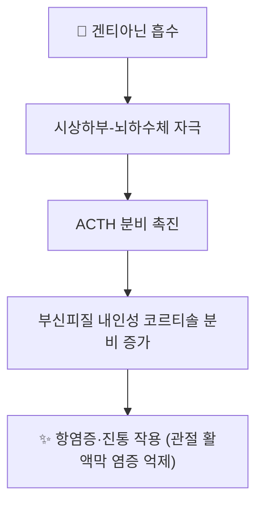

# 🔬 겐티아닌 (Gentianine)

> **핵심 3줄 요약 (Key Summary)**:
> - 🌿 기원 본초 & 화학 계열: [[진교]](秦艽, *Gentiana macrophylla* 등 용담과 뿌리)에 함유된 피리딘계 알칼로이드. 세코이리도이드 배당체인 [[겐티오피크로사이드]]와 함께 진교의 대표 활성 성분.
> - 🎯 핵심 분자 표적: 시상하부-뇌하수체-부신피질(HPA) 축을 자극해 ACTH 분비를 촉진하고, 이를 통해 내인성 코르티솔 분비를 증가시키는 것으로 제시되는 독특한 기전.
> - 🩺 주요 약리 활성: 내인성 코르티솔 증가를 매개로 한 항염증·진통 작용이 진교의 거풍습(祛風濕)·서근통락(舒筋通絡) 효능의 현대적 근거로 다뤄지며, 관절 활액막 염증 억제 효과가 함께 보고됨.
> - ⚠️ 근거 수준: HPA축 자극을 통한 코르티솔 분비 촉진 기전은 일부 약리 연구에서 제시된 가설적 기전으로, 사람 대상 대규모 임상 검증 자료는 제한적이며 장기 복용 시 외인성 스테로이드와 유사한 주의가 필요할 수 있음.

---

## 1. 기본 화학 정보 & 분자 구조식 (Chemical Identity)

> [!abstract]+ 🧪 3D 약리 분자 구조 (Interactive 3D Viewer)
> <iframe src="https://molecule-viewer-rho.vercel.app/?cid=354616" style="width: 100%; height: 600px; border: none; border-radius: 12px; box-shadow: 0 4px 20px rgba(0,0,0,0.15);" allowfullscreen></iframe>

| 항목 | 상세 내용 |
| :--- | :--- |
| **분자식 / 분자량** | C₁₀H₉NO₂ / 약 175.18 g/mol |
| **PubChem CID** | [354616](https://pubchem.ncbi.nlm.nih.gov/compound/Gentianine) |
| **화학 골격 분류** | 피리딘계 알칼로이드(세코이리도이드 유래 알칼로이드) |

---

## 2. 주요 함유 본초 및 천연 기원 (Botanical Sources & Content)

| 함유 본초 | 기원 식물학적 명칭 | 주요 함유 부위 | 한의학적 귀경 및 약효 특성 |
| :--- | :--- | :--- | :--- |
| [[진교]] (秦艽) | 용담과 / *Gentiana macrophylla* 등 | 뿌리 | 간·위·담경 귀경, 거풍습(祛風濕)·서근통락(舒筋通絡)·청허열(淸虛熱) — 풍습비통, 골증조열에 활용 |

---

## 3. 분자약리 표적 & 신호전달 네트워크 (Molecular Targets)

- 겐티아닌은 시상하부-뇌하수체 축을 자극하여 [[ACTH]] 분비를 촉진하고, 이어 부신피질에서 내인성 코르티솔을 합성·방출시켜 합성 스테로이드제와 유사한 항염증·진통 작용을 나타내는 것으로 제시됩니다.
- 이 기전은 진교가 관절염 등 풍습비통(風濕痹痛)에 사용되어 온 전통적 효능의 현대 약리학적 근거로 다뤄집니다.

---

## 4. 생체 내 흡수·대사·생체이용률 (Pharmacokinetics: ADME)

⚠️ 내용 검토 필요: 겐티아닌 단일 성분에 대한 인체·동물 정량 약동학(흡수율·반감기·생체이용률) 데이터는 현재 문헌상 확인되지 않았습니다. 진교 전탕액 투여 후 겐티아닌을 포함한 복합 알칼로이드·이리도이드 성분의 체내 거동에 대한 종합적 연구가 향후 보강되어야 할 영역입니다.

---

## 5. 주요 질환별 약리 효능 & 분자 기전 (Therapeutic Efficacy)

- **풍습성 관절염 및 관절통**: HPA축 자극을 통한 내인성 코르티솔 증가가 관절 활액막 염증을 억제하는 기전으로 제시됩니다.
- **골증조열(骨蒸潮熱)**: 만성 소모성 미열 병증에서 진교가 청허열(淸虛熱) 효능을 나타내는 것으로 전통적으로 활용됩니다.

⚠️ 위 효능들은 대부분 진교 전체 추출물 수준의 연구에 기반하며, 겐티아닌 단일 성분만의 효능을 분리하여 검증한 인체 임상시험은 확인되지 않습니다.

---

## 6. 함유 본초 방제 시너지 & 약재 배오 매트릭스 (Herbal Synergies)

겐티아닌은 [[진교]]의 거풍습·서근통락 효능을 뒷받침하는 핵심 알칼로이드 성분으로, [[겐티오피크로사이드]] 등 다른 진교 성분과 함께 작용해 풍습성 관절통, 골증조열(만성 소모성 미열) 등의 병증에 활용되는 근거로 제시됩니다. [[진교]]가 배오되는 거풍습 처방(예: 진교강활탕 계열)에서 겐티아닌의 정량적 기여도는 아직 확립되어 있지 않습니다.

---

## 7. 양약 상호작용 & 약물동태학적 간섭 (Drug Interactions)

- **외인성 스테로이드제와의 병용 이론적 우려**: 겐티아닌이 HPA축을 자극해 내인성 코르티솔을 높이는 기전이 실제라면, 이미 스테로이드제(프레드니솔론 등)를 복용 중인 환자에서 코르티솔 관련 부작용(고혈당, 골다공증 등)이 상가적으로 증가할 가능성이 이론적으로 우려됩니다.
- 다만 이를 뒷받침하는 정량적 인체 병용 연구는 현재 확인되지 않아, 가설적 우려로만 서술하며 단정하지 않습니다.

---

## 8. 💡 사용자 진료실 핵심 필기 & 임상 응용 팁 (Melt-In & High-Yield)

- 진교의 "거풍습" 효능을 "HPA축 자극을 통한 내인성 스테로이드 유사 작용"이라는 독특한 기전으로 설명하면 관절염 환자 상담에 흥미로운 포인트가 됨.
- 다만 이 기전은 가설적 수준이므로, 장기 스테로이드 복용 환자에게 진교 함유 처방을 병용할 때는 근거 수준의 한계를 함께 설명하고 신중히 접근.

---

## 9. 출처 및 학술 참고 문헌 (References)

1. The chemical structure, pharmacological activity, and clinical progress of Gentianae Radix et Rhizoma. *Frontiers in Pharmacology*. [PMC](https://pmc.ncbi.nlm.nih.gov/articles/PMC12583185/)
2. PubChem Compound Summary — Gentianine (CID 354616): [PubChem](https://pubchem.ncbi.nlm.nih.gov/compound/Gentianine)

<!-- 보관 태그(1회용·링크오류, 필요시 복원): 진교 -->
