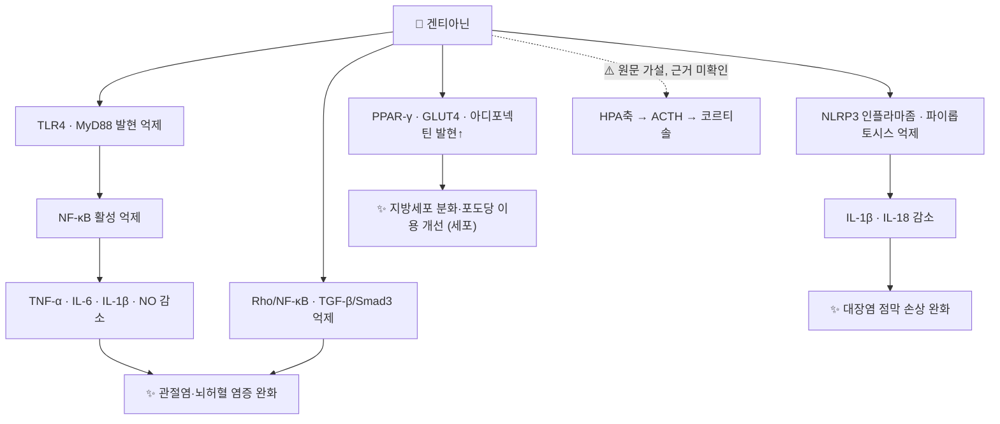

# 🔬 겐티아닌 (Gentianine, C₁₀H₉NO₂)

> **핵심 3줄 요약 (Key Summary)**:
> - 🌿 기원 본초 & 화학 계열: [[진교]](秦艽, *Gentiana macrophylla* 등)와 [[용담초]](龍膽, *G. scabra*)에서 분리되는 **모노테르펜 피리딘 알칼로이드**. 세코이리도이드 배당체(겐티오피크로사이드·스웨르티아마린)에서 질소가 들어가 만들어지는 계열이며, 스웨르티아마린의 활성 대사체로도 보고된다(PMID 22718571).
> - 🎯 핵심 분자 표적: [[TLR4]]/[[NF-κB]] 및 TLR4/[[NLRP3]] 염증 신호를 억제해 TNF-α·[[IL-6]]·[[IL-1β]] 생성을 낮춘다(동물·세포, PMID 15802824·34563661·37979455). 원문의 'HPA축 자극 → [[ACTH]]·[[코르티솔]] 분비 촉진' 기전은 이번 PubMed 검색에서 근거를 찾지 못했다.
> - 🩺 주요 약리 활성: 보조제 관절염(FCA) 랫드의 염증 완화(PMID 28501981), 허혈성 뇌졸중·궤양성 대장염 모델 보호, 지방세포 PPAR-γ·GLUT4 발현 증가 — 진교의 거풍습(祛風濕)·서근통락(舒筋通絡) 효능과 연결되어 논의된다.
> - ⚠️ 근거 한계: 사람 대상 임상·약동학 자료가 없다. 모든 효능 근거가 세포·동물 수준이며, 스테로이드 유사 작용(코르티솔 증가)은 확인되지 않은 가설이다.

---

## 📌 목차
1. [기본 화학 정보 & 분자 구조식 (Chemical Identity)](#1-기본-화학-정보--분자-구조식-chemical-identity)
2. [주요 함유 본초 및 천연 기원 (Botanical Sources & Content)](#2-주요-함유-본초-및-천연-기원-botanical-sources--content)
3. [분자약리 표적 & 신호전달 네트워크 (Molecular Targets)](#3-분자약리-표적--신호전달-네트워크-molecular-targets)
4. [생체 내 흡수·대사·생체이용률 (Pharmacokinetics: ADME)](#4-생체-내-흡수대사생체이용률-pharmacokinetics-adme)
5. [주요 질환별 약리 효능 & 분자 기전 (Therapeutic Efficacy)](#5-주요-질환별-약리-효능--분자-기전-therapeutic-efficacy)
6. [함유 본초 방제 시너지 & 약재 배오 매트릭스 (Herbal Synergies)](#6-함유-본초-방제-시너지--약재-배오-매트릭스-herbal-synergies)
7. [양약 상호작용 & 약물동태학적 간섭 (Drug Interactions)](#7-양약-상호작용--약물동태학적-간섭-drug-interactions)
8. [💡 사용자 진료실 핵심 필기 & 임상 응용 팁 (Melt-In & High-Yield)](#8--사용자-진료실-핵심-필기--임상-응용-팁-melt-in--high-yield)
9. [출처 및 학술 참고 문헌 (References)](#9-출처-및-학술-참고-문헌-references)

---

## 1. 기본 화학 정보 & 분자 구조식 (Chemical Identity)

### 1.1 화학적 특성
겐티아닌은 피라노피리딘(pyrano[3,4-c]pyridine) 고리에 비닐기가 붙은 작은 분자(분자량 175)입니다. 용담과 식물에 많은 **세코이리도이드 배당체**(겐티오피크로사이드·스웨르티아마린·스웨로사이드)의 비당체 부분에 질소가 들어가 피리딘 고리가 만들어진 **모노테르펜 피리딘 알칼로이드(MTPA)** 계열로, 이 계열은 이리도이드 배당체에서 유래하는 알칼로이드로 정리됩니다(Zhang 2022, PMID 36364013).

| 항목 (Property) | 세부 정보 (Specification) |
| :--- | :--- |
| **IUPAC 명칭** | 5-ethenyl-3,4-dihydropyrano[3,4-c]pyridin-1-one (PubChem) |
| **분자식 / 분자량** | C₁₀H₉NO₂ / 175.18 g/mol |
| **PubChem CID** | [354616](https://pubchem.ncbi.nlm.nih.gov/compound/354616) |
| **CAS 등록번호** | 439-89-4 (PubChem 동의어 기준, CAS 원본 대조는 못 함) |
| **화학 골격 분류** | 모노테르펜 피리딘 알칼로이드 (세코이리도이드 유래) |
| **물리화학 지표** | XLogP 1.5 · TPSA 39.2 Ų · 수소결합 공여 0 / 수용 3 (PubChem 계산값) — 작고 적당히 지용성이라 막 투과에 불리하지 않은 구조 |
| **생성 경로** | 세코이리도이드 배당체 → (가수분해·질소 도입) → 겐티아닌. 스웨르티아마린 투여 후 활성 대사체로 제시됨(PMID 22718571) |

### 1.2 2D 분자 구조식
![[겐티아닌_1_화학구조식.png|320]]
> [그림 1: ① 2D 화학 구조식 — 겐티아닌(PubChem CID 354616). 피라노피리딘 고리와 5번 위치 비닐기. 출처: [PubChem](https://pubchem.ncbi.nlm.nih.gov/compound/354616)]

### 1.3 3D 약리 분자 구조 (Interactive Viewer)
> [!abstract]+ 🧪 3D 약리 분자 구조 (Interactive 3D Viewer)
> <iframe src="https://molecule-viewer-rho.vercel.app/?cid=354616" width="100%" height="450px" frameborder="0" allow="webgl" style="border-radius: 8px;"></iframe>

---

## 2. 주요 함유 본초 및 천연 기원 (Botanical Sources & Content)

![[겐티아닌_2_기원식물_진교.jpg|380]]
> [그림 2: ② 기원 식물 실사 — 진교(秦艽)의 기원 식물 *Gentiana macrophylla* Pall.의 꽃차례. 출처: Orchi, [Wikimedia Commons](https://commons.wikimedia.org/wiki/File:Gentiana_macrophylla_Orchi_03.jpg) (CC BY-SA 3.0)]

![[겐티아닌_2_기원식물_용담.jpg|380]]
> [그림 3: ② 기원 식물 실사 — 용담(龍膽) 계열 *Gentiana scabra* var. *buergeri*의 꽃. 겐티아닌의 뇌졸중·대장염 연구는 *G. scabra* 유래 겐티아닌을 사용했다. 출처: [Wikimedia Commons](https://commons.wikimedia.org/wiki/File:Gentiana_scabra2.jpg) (CC BY-SA 3.0)]

| 함유 본초 | 기원 식물 (과명 / 학명) | 약용 부위 | 한의학적 귀경 및 약효 | 겐티아닌 근거 |
| :--- | :--- | :--- | :--- | :--- |
| [[진교]] (秦艽) | 용담과 / *Gentiana macrophylla* Pall. 등 4종 | 뿌리 | 위·간·담경 / 거풍습·서근통락·청허열 — 풍습비통, 골증조열 | 진교의 성분 원문 기재. ⚠️ 진교 종설 초록(166종 성분, 이리도이드 배당체 위주)에서는 겐티아닌 함량을 확인하지 못함(PMID 30097114) |
| [[용담초]] (龍膽) | 용담과 / *Gentiana scabra* Bunge 등 | 뿌리·뿌리줄기 | 간·담경 / 청열조습·사간담화 | *G. scabra*에서 분리된 겐티아닌으로 약리 연구 수행(PMID 34563661·37979455) |
| (참고) 당약(當藥) | 용담과 / *Swertia japonica* | 전초 | 건위·고미 | 스웨르티아마린·겐티아닌 약리 연구(Yamahara 1978, PMID 739381, 제목 기준) |

* ⚠️ **함량 주의**: 겐티아닌은 세코이리도이드 배당체에서 질소가 도입되어 생기는 계열이므로(PMID 36364013), 식물 속에 원래 들어 있는 양과 추출·가공 중 전환된 양을 구분해야 합니다. 이번 작업에서 진교·용담의 겐티아닌 정량값은 확인하지 못했으므로 본초의 겐티아닌 '함량'은 확정 수치로 보지 않습니다. 반면 세코이리도이드 배당체인 겐티오피크로사이드가 진교의 품질관리 지표 성분이라는 점은 종설에서 확인됩니다(PMID 30097114).

---

## 3. 분자약리 표적 & 신호전달 네트워크 (Molecular Targets)

![[겐티아닌_3_TLR4_NF-kB_경로.png|450]]
> [그림 4: ③ 표적 경로 도해 — TLR4 신호전달(MyD88 → IRAK → TRAF6 → TAK1 → IKK → NF-κB). 겐티아닌은 이 경로의 TLR4·MyD88·NF-κB 발현을 낮춘다고 보고되었다(PMID 34563661). 출처: Macflan75, [Wikimedia Commons](https://commons.wikimedia.org/wiki/File:TLR4_signaling_pathway_V2.png-1.png) (CC BY-SA 4.0)]

```mermaid
graph TD
    G["🔬 겐티아닌"] --> TLR4["TLR4 · MyD88 발현 억제"]
    TLR4 --> NFkB["NF-κB 활성 억제"]
    NFkB --> Cyt["TNF-α · IL-6 · IL-1β · NO 감소"]
    G --> NLRP3["NLRP3 인플라마좀 · 파이롭토시스 억제"]
    NLRP3 --> IL18["IL-1β · IL-18 감소"]
    G --> Rho["Rho/NF-κB · TGF-β/Smad3 억제"]
    G --> PPAR["PPAR-γ · GLUT4 · 아디포넥틴 발현↑"]
    Cyt --> O1["✨ 관절염·뇌허혈 염증 완화"]
    IL18 --> O2["✨ 대장염 점막 손상 완화"]
    Rho --> O1
    PPAR --> O3["✨ 지방세포 분화·포도당 이용 개선 (세포)"]
    G -.->|"⚠️ 원문 가설, 근거 미확인"| HPA["HPA축 → ACTH → 코르티솔"]
```

### 3.1 TLR4/NF-κB 염증 신호 억제
* LPS로 활성화한 BV-2 미세아교세포에서 겐티아닌은 [[TLR4]]·MyD88·[[NF-κB]] 발현과 NO·염증성 사이토카인 분비를 줄였고, TLR4 억제제와 함께 쓰면 억제가 더 커졌습니다(Wang 2021, PMID 34563661).
* 랫드에 겐티아닌 10~100 mg/kg을 **경구** 투여하면 LPS 자극 후 혈청 TNF-α(ED50 37.7 mg/kg)와 [[IL-6]](ED50 38.5 mg/kg) 증가가 억제되었으나 다른 인터루킨은 유의하게 바뀌지 않았습니다(Kwak 2005, PMID 15802824).

### 3.2 TLR4/NLRP3 인플라마좀·파이롭토시스 억제
* DSS 대장염 마우스(복강 12.5·25·50 mg/kg/일, 7일)와 HT-29 세포에서 겐티아닌은 NOD 유사 수용체 경로 단백, 파이롭토시스 관련 단백과 [[IL-1β]]·IL-18을 줄였고, TLR4나 [[NLRP3]]를 과발현시키면 보호 효과가 사라졌습니다(Li 2024, PMID 37979455).

### 3.3 Rho/NF-κB 및 TGF-β/Smad3 억제 (관절)
* 프로인트 완전보조제(FCA) 관절염 랫드에서 IL-6·IL-1β·TNF-α가 줄고 발 병리 소견이 호전되었으며 Rho/NF-κB와 TGF-β/Smad3 경로 단백 발현이 억제되었습니다(Wenjin 2017, PMID 28501981).

### 3.4 PPAR-γ 경로 (대사)
* 3T3-L1 지방세포에서 스웨르티아마린은 PPAR-γ·GLUT4 mRNA를 바꾸지 못했지만 겐티아닌은 지방세포 분화와 [[PPAR]]-γ·[[GLUT4]]·[[아디포넥틴]] 발현을 유의하게 올렸습니다 — 저자들은 스웨르티아마린의 항당뇨 효과가 대사체 겐티아닌 때문이라고 해석했습니다(Vaidya 2013, PMID 22718571).

### 3.5 HPA축 자극 가설 (원문 서술, ⚠️ 근거 미확인)
* 원문과 볼트 [[진교]] 노트는 "겐티아닌이 시상하부-뇌하수체를 자극해 [[ACTH]] 분비를 늘리고 부신피질의 내인성 [[코르티솔]]을 증가시켜 스테로이드 유사 항염증 작용을 낸다"고 서술합니다.
* ⚠️ 이번 작업에서 'gentianine ACTH/adrenal', 'Gentiana macrophylla adrenal cortex'로 PubMed를 검색했으나 해당 연구를 찾지 못했습니다. 현재 확인되는 항염증 근거는 모두 사이토카인·TLR4 경로 억제(§3.1~3.3)이므로, HPA축 가설은 **미확인 전통 약리 서술**로만 둡니다.

> 🧬 현대 학술 근거 (2026-09-27 B-7 패치)
> 겐티아닌은 항염증·항암 기전 외에 전산생물학적 표적 탐색에서도 연구되었다. 열대열원충(*Plasmodium falciparum*) 단백질 상호작용망과 분자 도킹·분자동역학 시뮬레이션을 이용한 연구에서 겐티아닌이 할로산탈수효소(PfHAD1)·포스포엔올피루브산 카르복시키나아제(PfPEPCK)·푸마르산탈수효소(PfFH)·젖산탈수소효소(PfLDH) 등 기생충 대사 필수 효소에 우호적으로 결합함이 시사되어, 진교·용담의 전통적 항염증 용도와는 별개로 항말라리아 후보 물질로서의 가능성도 제기되었다(PMID 32593550, 실험적 검증 이전의 계산생물학적 예측 단계).

---

## 4. 생체 내 흡수·대사·생체이용률 (Pharmacokinetics: ADME)

* **경구 활성**: 랫드 경구 10~100 mg/kg에서 전신 사이토카인 억제가 나타나 경구로 흡수되어 작용할 수 있음이 간접적으로 시사됩니다(PMID 15802824). 흡수율·혈중농도·반감기 수치는 보고되지 않았습니다.
* **전구체에서의 생성**: 스웨르티아마린은 혈장 반감기가 1.3시간으로 짧고, 그 활성 대사체로 겐티아닌이 제시되었습니다(PMID 22718571). 스웨르티아마린·겐티오피크로사이드가 사람 장내세균에 의해 대사된다는 연구가 있습니다(el-Sedawy 1989, PMID 2748732·2605687). 다만 겐티오피크로사이드 연구에서 확인된 대사체는 에리트로센타우린 등 5종이었고 겐티아닌은 그 목록에 없었습니다(PMID 2605687).
* ⚠️ 내용 검토 필요: 겐티아닌 자체의 사람·동물 정량 약동학(생체이용률·CYP 대사·배설)은 확인되지 않았습니다. 진교 전탕 복용 시 겐티아닌이 혈중에 나타나는지도 미확인입니다.

---

## 5. 주요 질환별 약리 효능 & 분자 기전 (Therapeutic Efficacy)

| 질환 (모델) | 투여 | 주요 결과 | 근거 수준 |
| :--- | :--- | :--- | :--- |
| 관절염 — [[류마티스 관절염]] 동물 모델(FCA) | 랫드 | IL-6·IL-1β·TNF-α↓, 발 병리 호전, Rho/NF-κB·TGF-β/Smad3↓ | 동물 (PMID 28501981) |
| 전신 염증(LPS) | 랫드 경구 10~100 mg/kg | TNF-α·IL-6 증가 억제 (ED50 약 38 mg/kg) | 동물 (PMID 15802824) |
| [[허혈성 뇌졸중]] (tMCAO) | 마우스 | 경색 부피↓, 신경학 점수·상지 근력↑, TLR4·Iba-1↓ | 동물·세포 (PMID 34563661) |
| [[궤양성 대장염]] (DSS) | 마우스 복강 12.5~50 mg/kg | 체중 감소·결장 단축·DAI·MPO↓, 파이롭토시스↓ | 동물·세포 (PMID 37979455) |
| [[제2형 당뇨병]] 관련 대사 | 3T3-L1 세포 | PPAR-γ·GLUT4·아디포넥틴↑ | 세포 (PMID 22718571) |
| 종양 | 세포·동물 | 신세포암(KDM5B·페롭토시스), [[대장암]](HIF1α/SLC7A11 페롭토시스) 억제 보고 | 제목 기준 (PMID 41371563·41329219) |

* **풍습비통(관절통)**: 진교의 거풍습 효능과 가장 직접 연결되는 근거는 FCA 관절염 랫드 연구입니다. 흥미롭게도 이 논문은 겐티아닌을 **[[독활기생탕]]의 구성 성분**으로 소개합니다(진교가 독활기생탕의 구성약, §6).
* **골증조열(骨蒸潮熱)**: 진교의 청허열 효능은 전통 용법이며, 겐티아닌과 연결한 연구는 확인되지 않았습니다.
* ⚠️ 겐티아닌 단일 성분의 사람 임상시험은 확인되지 않습니다. 위 결과는 모두 세포·동물 수준입니다.

---

## 6. 함유 본초 방제 시너지 & 약재 배오 매트릭스 (Herbal Synergies)

| 함유 본초 / 방제 | 구성 (볼트 노트 기준) | 겐티아닌 관련 연결 | 전통 효능 연계 |
| :--- | :--- | :--- | :--- |
| [[진교]] | 단미 | 겐티오피크로사이드(지표 성분)와 공존 | 거풍습·서근통락·청허열 |
| [[독활기생탕]] | [[독활]]·[[상기생]]·두충·우슬·**[[진교]]**·[[세신]]·[[방풍]]·당귀 등 | FCA 관절염 연구가 겐티아닌을 독활기생탕 유래 화합물로 소개(PMID 28501981) | 간신 양허의 만성 요슬 비통 |
| [[대진교탕]] | **진교**(군약)·[[강활]]·독활·방풍·당귀·숙지황·백작약·천궁 등 | 진교 성분으로서의 기여 — 정량 근거 없음 | 풍사 초중경락, 사지 마비 |
| [[진교별갑탕]] | 진교·[[별갑]]·[[지골피]]·시호·당귀·지모 | 정량 근거 없음 | 음허 골증조열·도한 |
| [[용담사간탕]] | **[[용담초]]**(군약) 등 | *G. scabra* 겐티아닌의 항염증 근거(§3) | 간담 실화·습열 |

* 처방 수준에서 겐티아닌의 기여도나 공존 성분과의 상승 작용을 측정한 연구는 확인되지 않았습니다 ⚠️.
* 세코이리도이드 배당체(겐티오피크로사이드 등)가 장내세균·체내 대사로 다른 활성 대사체를 만들 수 있다는 점(§4)은, **전탕 복용 시 배당체가 '전구약' 역할을 할 수 있다**는 가설과 맞닿아 있으나 겐티아닌 생성은 사람에서 확인되지 않았습니다.

---

## 7. 양약 상호작용 & 약물동태학적 간섭 (Drug Interactions)

* **외인성 스테로이드제([[프레드니솔론]] 등) — 이론적 우려(원문)**: HPA축 자극으로 코르티솔이 늘어난다면 [[스테로이드]] 복용 환자에서 고혈당·골다공증 등 부작용이 더해질 수 있다는 우려가 원문에 있습니다. 그러나 코르티솔 증가 자체가 확인되지 않았으므로(§3.5) 이 우려도 근거가 없습니다.
* **항염증제·면역조절제와의 중첩 — 이론적 가능성**: TNF-α·IL-6·NF-κB 억제 방향이 같으므로 항염증·면역억제 치료와 효과가 겹칠 가능성은 이론적으로만 거론됩니다.
* **혈당강하제 — 이론적 가능성**: 세포에서 PPAR-γ·GLUT4를 올린 결과(PMID 22718571)로 볼 때 혈당강하제와의 상가 효과를 생각할 수 있으나 동물·사람 근거는 없습니다.
* ⚠️ 겐티아닌의 CYP 억제·유도, P-gp 기질성 등 약물상호작용 연구는 확인되지 않았습니다.

---

## 8. 💡 사용자 진료실 핵심 필기 & 임상 응용 팁 (Melt-In & High-Yield)

* **(원문 필기)** 진교의 "거풍습" 효능을 "HPA축 자극을 통한 내인성 스테로이드 유사 작용"이라는 독특한 기전으로 설명하면 관절염 환자 상담에 흥미로운 포인트가 됨.
  * → **2026-09-26 보강**: 이 기전은 PubMed에서 근거를 찾지 못했습니다. 환자 설명에는 "진교 성분이 동물 실험에서 염증 물질(TNF-α·IL-6)을 줄였다" 수준으로 말하는 것이 안전합니다.
* **(원문 필기)** 장기 스테로이드 복용 환자에게 진교 함유 처방을 병용할 때는 근거 수준의 한계를 함께 설명하고 신중히 접근.
* **진교 vs 용담 구분**: 둘 다 용담과 *Gentiana* 속이라 같은 성분(겐티아닌·겐티오피크로사이드)을 공유하지만, 진교는 거풍습·청허열, [[용담초]]는 청열조습·사간담화로 용도가 다릅니다. 겐티아닌 연구 다수는 사실 용담(*G. scabra*) 유래입니다.

---

## 9. 출처 및 학술 참고 문헌 (References)

1. **Kwak WJ, Kim JH, Ryu KH, et al. (2005)**. *Effects of gentianine on the production of pro-inflammatory cytokines in male Sprague-Dawley rats treated with lipopolysaccharide (LPS)*. **Biol Pharm Bull**, 28(4):750-753. [PMID 15802824](https://pubmed.ncbi.nlm.nih.gov/15802824/) · [DOI](https://doi.org/10.1248/bpb.28.750)
   - **[연구 요약]**: 경구 겐티아닌이 LPS 유도 TNF-α(ED50 37.7 mg/kg)·IL-6(ED50 38.5 mg/kg) 증가를 억제.
2. **Wenjin C, Jianwei W. (2017)**. *Protective Effect of Gentianine, a compound from Du Huo Ji Sheng Tang, against Freund's Complete Adjuvant-Induced Arthritis in Rats*. **Inflammation**, 40(4):1401-1408. [PMID 28501981](https://pubmed.ncbi.nlm.nih.gov/28501981/) · [DOI](https://doi.org/10.1007/s10753-017-0583-8)
   - **[연구 요약]**: FCA 관절염 랫드에서 사이토카인·Rho/NF-κB·TGF-β/Smad3 억제.
3. **Wang N, Liu Y, Jia C, et al. (2021)**. *Machine learning enables discovery of Gentianine targeting TLR4/NF-κB pathway to repair ischemic stroke injury*. **Pharmacol Res**, 173:105913. [PMID 34563661](https://pubmed.ncbi.nlm.nih.gov/34563661/) · [DOI](https://doi.org/10.1016/j.phrs.2021.105913)
   - **[연구 요약]**: *G. scabra* 유래 겐티아닌이 tMCAO 마우스 경색을 줄이고 TLR4/MyD88/NF-κB 억제.
4. **Li YX, Lv L, Li SL, Qian HH. (2024)**. *Gentianine alleviates dextran sulfate sodium-induced ulcerative colitis via inhibition of TLR4/NLRP3-mediated pyroptosis*. **Int Immunopharmacol**, 126:111214. [PMID 37979455](https://pubmed.ncbi.nlm.nih.gov/37979455/) · [DOI](https://doi.org/10.1016/j.intimp.2023.111214)
   - **[연구 요약]**: DSS 대장염에서 TLR4/NLRP3 매개 파이롭토시스 억제.
5. **Vaidya H, Goyal RK, Cheema SK. (2013)**. *Anti-diabetic activity of swertiamarin is due to an active metabolite, gentianine, that upregulates PPAR-γ gene expression in 3T3-L1 cells*. **Phytother Res**, 27(4):624-627. [PMID 22718571](https://pubmed.ncbi.nlm.nih.gov/22718571/) · [DOI](https://doi.org/10.1002/ptr.4763)
   - **[연구 요약]**: 겐티아닌이 PPAR-γ·GLUT4·아디포넥틴 발현을 올림, 스웨르티아마린의 활성 대사체로 제시.
6. **Zhang X, Tao F, Cui T, et al. (2022)**. *Sources, Transformations, Syntheses, and Bioactivities of Monoterpene Pyridine Alkaloids and Cyclopenta[c]pyridine Derivatives*. **Molecules**, 27(21):7187. [PMID 36364013](https://pubmed.ncbi.nlm.nih.gov/36364013/) · [DOI](https://doi.org/10.3390/molecules27217187)
   - **[연구 요약]**: 이리도이드 배당체 유래 모노테르펜 피리딘 알칼로이드의 기원·전환·활성을 정리한 종설.
7. **Zhang X, Zhan G, Jin M, et al. (2018)**. *Botany, traditional use, phytochemistry, pharmacology, quality control, and authentication of Radix Gentianae Macrophyllae — A traditional medicine: A review*. **Phytomedicine**, 46:142-163. [PMID 30097114](https://pubmed.ncbi.nlm.nih.gov/30097114/) · [DOI](https://doi.org/10.1016/j.phymed.2018.04.020)
   - **[연구 요약]**: 진교 4종 기원·166종 성분(이리도이드 배당체 위주)·약리·품질관리(겐티오피크로사이드 지표) 종설.
8. **Liu H, Liu X, Liu S, Zhao F. (2025)**. *The chemical structure, pharmacological activity, and clinical progress of Gentianae Radix et Rhizoma*. **Front Pharmacol**, 16:1656493. [PMID 41194879](https://pubmed.ncbi.nlm.nih.gov/41194879/) · [PMC12583185](https://pmc.ncbi.nlm.nih.gov/articles/PMC12583185/)
   - **[연구 요약]**: **용담(龍膽)** 172종 성분·약리·임상 종설. *(기존 노트는 이 논문을 진교 문헌처럼 인용했으나 대상 약재는 용담이라 정정)*
9. **el-Sedawy AI, Hattori M, Kobashi K, Namba T. (1989)**. *Metabolism of gentiopicroside (gentiopicrin) by human intestinal bacteria*. **Chem Pharm Bull (Tokyo)**, 37(9):2435-2437. [PMID 2605687](https://pubmed.ncbi.nlm.nih.gov/2605687/)
10. **el-Sedawy AI, et al. (1989)**. *Metabolism of swertiamarin from Swertia japonica by human intestinal bacteria*. **Planta Med**, 55(2):147-150. [PMID 2748732](https://pubmed.ncbi.nlm.nih.gov/2748732/) (제목 기준)
11. **Yamahara J, et al. (1978)**. *[Biologically active principles of crude drugs: pharmacological actions of Swertia japonica extracts, swertiamarin and gentianine]*. **Yakugaku Zasshi**, 98(11):1446-1451. [PMID 739381](https://pubmed.ncbi.nlm.nih.gov/739381/) (제목 기준)
12. **Wu J, et al. (2026)**. *Gentianine suppresses renal cell carcinoma progression via direct interaction with KDM5B and ferroptosis activation*. **Cell Signal**, 139:112300. [PMID 41371563](https://pubmed.ncbi.nlm.nih.gov/41371563/) (제목 기준)
13. **Han L, et al. (2026)**. *Gentianine inhibits colorectal cancer growth via HIF1α/SLC7A11-modulated ferroptosis through suppression of METTL3-mediated AKT2 m6A methylation*. **Naunyn Schmiedebergs Arch Pharmacol**, 399(5):7001-7016. [PMID 41329219](https://pubmed.ncbi.nlm.nih.gov/41329219/) (제목 기준)
14. PubChem Compound Summary — Gentianine (CID 354616): [https://pubchem.ncbi.nlm.nih.gov/compound/354616](https://pubchem.ncbi.nlm.nih.gov/compound/354616)

**이미지 출처·라이선스**
- 그림 1: PubChem 2D 구조식 (CID 354616) — 공공 데이터
- 그림 2: Orchi, *Gentiana macrophylla* — [Commons](https://commons.wikimedia.org/wiki/File:Gentiana_macrophylla_Orchi_03.jpg), CC BY-SA 3.0
- 그림 3: *Gentiana scabra* var. *buergeri* — [Commons](https://commons.wikimedia.org/wiki/File:Gentiana_scabra2.jpg), CC BY-SA 3.0
- 그림 4: Macflan75, *TLR4 signaling pathway* — [Commons](https://commons.wikimedia.org/wiki/File:TLR4_signaling_pathway_V2.png-1.png), CC BY-SA 4.0

<!-- 보관 태그(1회용·링크오류, 필요시 복원): 진교 -->
