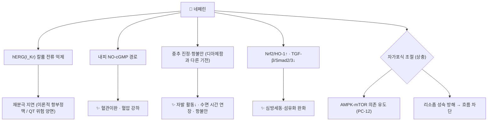

# 🔬 네페린 (Neferine, C₃₈H₄₄N₂O₆)

> **핵심 3줄 요약 (Key Summary)**:
> - 🌿 기원 본초 & 화학 계열: [[연자심]](蓮子心, *Nelumbo nucifera* 씨의 녹색 배아)의 **주 알칼로이드**인 비스벤질이소퀴놀린 알칼로이드. 같은 배아의 [[리에닌]]·이소리에닌과 구조가 가깝고, 쥐 간에서 CYP2D6에 의해 이들로 일부 전환된다(PMID 17654697).
> - 🎯 핵심 분자 표적: hERG(IKr) 칼륨 채널 전류 억제(PMID 22508050), NO-cGMP 경로 혈관이완(PMID 32219782), 중추 진정·항불안(PMID 19010651). 자가포식은 AMPK-mTOR 의존 유도(PMID 25699594)와 리소좀 기능 방해로 인한 흐름 차단(PMID 29197576)이 모두 보고되어 **미확립**.
> - 🩺 주요 약리 활성: 연자심의 청심안신(淸心安神)·강심화(降心火) 효능과 연결되는 진정·항불안, 혈압 강하, 항부정맥(심방세동), 폐 섬유화 억제 — 모두 세포·동물 근거.
> - ⚠️ 주의: 사람 임상 근거 없음. CYP3A4가 네페린을 반응성 퀴논메티드 대사체로 바꿔 글루타치온 고갈 시 세포독성을 키운다(PMID 25451576). hERG 억제는 QT 연장 약물과의 상가 가능성을 시사한다(이론적).

---

## 📌 목차
1. [기본 화학 정보 & 분자 구조식 (Chemical Identity)](#1-기본-화학-정보--분자-구조식-chemical-identity)
2. [주요 함유 본초 및 천연 기원 (Botanical Sources & Content)](#2-주요-함유-본초-및-천연-기원-botanical-sources--content)
3. [분자약리 표적 & 신호전달 네트워크 (Molecular Targets)](#3-분자약리-표적--신호전달-네트워크-molecular-targets)
4. [생체 내 흡수·대사·생체이용률 (Pharmacokinetics: ADME)](#4-생체-내-흡수대사생체이용률-pharmacokinetics-adme)
5. [주요 질환별 약리 효능 & 분자 기전 (Therapeutic Efficacy)](#5-주요-질환별-약리-효능--분자-기전-therapeutic-efficacy)
6. [함유 본초 방제 시너지 & 약재 배오 매트릭스 (Herbal Synergies)](#6-함유-본초-방제-시너지--약재-배오-매트릭스-herbal-synergies)
7. [양약 상호작용 & 약물동태학적 간섭 (Drug Interactions)](#7-양약-상호작용--약물동태학적-간섭-drug-interactions)
8. [💡 사용자 진료실 핵심 필기 & 임상 응용 팁 (Melt-In & High-Yield)](#8--사용자-진료실-핵심-필기--임상-응용-팁-melt-in--high-yield)
9. [출처 및 학술 참고 문헌 (References)](#9-출처-및-학술-참고-문헌-references)

---

## 1. 기본 화학 정보 & 분자 구조식 (Chemical Identity)

### 1.1 화학적 특성
네페린은 두 개의 벤질테트라히드로이소퀴놀린 단위가 **디아릴에테르 결합 하나**로 이어진 비스벤질이소퀴놀린 알칼로이드입니다. PubChem 등록 구조는 두 키랄 탄소가 모두 (1R) 배치이며, 질소는 둘 다 N-메틸 3급 아민입니다 — 같은 계열이지만 4급 암모늄을 가진 [[d-투보쿠라린]]과 달리 지용성이 높아(XLogP 6.7) 경구로 흡수됩니다(§4).

| 항목 (Property) | 세부 정보 (Specification) |
| :--- | :--- |
| **IUPAC 명칭** | 4-[[(1R)-6,7-dimethoxy-2-methyl-3,4-dihydro-1H-isoquinolin-1-yl]methyl]-2-[[(1R)-6-methoxy-1-[(4-methoxyphenyl)methyl]-2-methyl-3,4-dihydro-1H-isoquinolin-7-yl]oxy]phenol (PubChem) |
| **분자식 / 분자량** | C₃₈H₄₄N₂O₆ / 624.8 g/mol (원문 624.77) |
| **PubChem CID** | [159654](https://pubchem.ncbi.nlm.nih.gov/compound/159654) |
| **CAS 등록번호** | 2292-16-2 (PubChem 동의어 기준, CAS 원본 대조는 못 함) |
| **화학 골격 분류** | 비스벤질이소퀴놀린 알칼로이드 (3급 아민 2개, 페놀성 OH 1개) |
| **물리화학 지표** | XLogP 6.7 · TPSA 72.9 Ų · 수소결합 공여 1 / 수용 8 (PubChem 계산값) |
| **성상·용해도** | 미황색 분말, 클로로포름·메탄올 가용, 물에 난용 ⚠️ 원문 기재, 1차 자료 대조 못 함 |
| **입체이성질체** | 천연형 외에 여러 입체이성질체가 합성되어 약리 비교되었다(Nishimura 2013, PMID 23117579). 합성 (R,S)-네페린은 오렉신 수용체 길항 연구에 쓰였다(PMID 40644919) |

### 1.2 2D 분자 구조식
![[네페린_1_화학구조식.png|380]]
> [그림 1: ① 2D 화학 구조식 — 네페린(PubChem CID 159654). 두 벤질이소퀴놀린 단위가 디아릴에테르 하나로 연결. 출처: [PubChem](https://pubchem.ncbi.nlm.nih.gov/compound/159654)]

### 1.3 3D 약리 분자 구조 (Interactive Viewer)
> [!abstract]+ 🧪 3D 약리 분자 구조 (Interactive 3D Viewer)
> <iframe src="https://molecule-viewer-rho.vercel.app/?cid=159654" width="100%" height="450px" frameborder="0" allow="webgl" style="border-radius: 8px;"></iframe>

---

## 2. 주요 함유 본초 및 천연 기원 (Botanical Sources & Content)

![[네페린_2_기원식물_연꽃.jpg|380]]
> [그림 2: ② 기원 식물 실사 — 연꽃(*Nelumbo nucifera* Gaertn., 연꽃과). 꽃 중앙의 노란 화탁이 자라 연방(蓮房)이 된다. 출처: H. Zell, [Wikimedia Commons](https://commons.wikimedia.org/wiki/File:Nelumbo_nucifera_002.JPG) (CC BY-SA 3.0)]

![[네페린_2_연꽃_연방과_씨앗.jpg|320]]
> [그림 3: ② 약용 부위 실사 — 연방(蓮房)에 박힌 덜 익은 연꽃 씨(연자). 씨 속의 녹색 배아가 연자심이며 네페린의 주된 공급원이다. 출처: そらみみ (Soramimi), [Wikimedia Commons](https://commons.wikimedia.org/wiki/File:Seeds_of_Nelumbo_nucifera.jpg) (CC BY-SA 4.0)]

| 함유 본초 | 기원 식물 (과명 / 학명) | 약용 부위 | 한의학적 귀경 및 약효 특성 | 네페린 근거 |
| :--- | :--- | :--- | :--- | :--- |
| [[연자심]] (蓮子心) | 연꽃과 / *Nelumbo nucifera* Gaertn. | 성숙 종자의 녹색 배아 | 심·신경 / 고한(苦寒), 청심안신·강심화·지혈삽정 | 연자심 클로로포름 분획의 **주 알칼로이드**(Sugimoto 2008, PMID 19010651) · 배아 유래로 명시(PMID 25451576) |
| (구분) [[연자육]] (蓮子肉) | 같은 식물 | 배아를 뺀 씨 | 비·신·심경 / 보비지사·익신고정·양심안신 | 네페린 주 공급원 아님 — 연자심과 **다른 약재** |
| (참고) [[하엽]]·[[우절]] | 같은 식물 | 잎·뿌리줄기 마디 | 각기 다른 효능 | 잎의 대표 알칼로이드는 [[누시페린]] 등 — 네페린 함량은 이번에 확인 못 함 |

* 연자심에는 네페린 외에 [[리에닌]]·이소리에닌 같은 비스벤질이소퀴놀린과 히게나민 배당체 등 단순 벤질이소퀴놀린도 들어 있어([[히게나민]] 노트 참고), 생합성상 모두 (S)/(R)-노르코클라우린(=[[히게나민]])에서 갈라져 나옵니다.

---

## 3. 분자약리 표적 & 신호전달 네트워크 (Molecular Targets)

![[네페린_3_심근_활동전위_이온전류.png|450]]
> [그림 4: ③ 표적 도해 — 심실·심방 심근 활동전위와 각 이온전류(I_Na, I_Ca(L), I_Kr 등). 네페린이 억제하는 hERG 전류가 3기 재분극을 담당하는 **I_Kr**이다. 출처: PeaBrainC, [Wikimedia Commons](https://commons.wikimedia.org/wiki/File:Currents_responsible_for_the_cardiac_action_potential.png) (CC BY-SA 4.0)]

### 3.1 심근 이온 채널 및 항부정맥
* **hERG(I_Kr) 억제 — 확인됨**: HEK293 세포의 인간 hERG 채널에서 네페린은 전류 진폭을 농도 의존적으로 줄였고 채널의 열림·불활성화 상태에 결합 친화력을 보였습니다(Dong 2012, PMID 22508050).
* **심방세동 — 확인됨(동물)**: 앤지오텐신 II 유도 심방세동 마우스에서 [[Nrf2]]/HO-1 활성화와 TGF-β/p-Smad2/3 억제로 심방세동 유발과 섬유화를 줄였습니다(Jiang 2024, PMID 38775722).
* **L형 [[칼슘]] 채널 차단·APD 연장 — 원문, ⚠️ 미확인**: 원문은 네페린이 I_Ca,L와 지연정류 [[칼륨]] 전류(I_K)를 막아 칼슘 과부하를 줄이고 활동전위 기간을 늘린다고 서술하나, L형 칼슘 채널 차단을 직접 보인 문헌은 이번 작업에서도 확인하지 못했습니다. hERG 억제만으로 보면 APD 연장은 **항부정맥과 QT 연장 위험의 양면**을 가집니다.

### 3.2 혈관 내피 NO-cGMP 경로와 혈압 강하
* L-NAME 유도 고혈압 랫드에서 네페린(1·10 mg/kg)은 심박수 변화 없이 수축기 혈압을 낮췄고, 흉부대동맥 고리에서 농도 의존적 이완을 보였으며 이 이완은 L-NAME·ODQ 전처치로 줄어 NO-cGMP 경로 관여가 시사되었습니다(Wicha 2020, PMID 32219782). 원문의 '세포외 칼슘 유입 억제'는 이 초록에서 확인하지 못했습니다 ⚠️.

### 3.3 중추 진정·항불안 (연자심 안신 효능의 근거)
* 연자심 메탄올 추출물이 마우스 자발 활동을 억제했고, 활성은 클로로포름 분획에 집중되었으며 그 주 알칼로이드가 네페린이었습니다. 네페린은 용량 의존적으로 자발 활동을 줄이고 체온을 낮추며 티오펜탈 수면 시간을 늘렸고, 고가십자미로에서 항불안 효과를 보였습니다. 반면 [[디아제팜]]과 달리 근이완·항경련 작용은 없어 **기전이 벤조디아제핀과 다르다**고 결론지었습니다(Sugimoto 2008, PMID 19010651).
* 합성 (R,S)-네페린은 오렉신 수용체(OX1R·OX2R)에 KD 0.68·0.81 nM로 결합하는 길항제로 불면 마우스의 수면을 개선했습니다(Fang 2025, PMID 40644919). ⚠️ 이는 **합성 입체이성질체** 결과로, 연자심의 천연 네페린에 그대로 적용되는지는 확인되지 않았습니다.

### 3.4 자가포식(Autophagy) 조절 — 상충
* 원문: "네페린은 mTOR 경로에 의존하지 않고 Ca²⁺/CaMKKβ-AMPK 축을 자극하여 자가포식소체 형성을 촉진하며, 타우·헌팅틴·Aβ와 손상 미토콘드리아를 제거한다."
* 검증 결과는 서로 엇갈립니다:
  * PC-12 세포에서 **[[AMPK]]-[[mTOR]] 의존 경로**로 자가포식을 유도하고 Atg7 의존적으로 돌연변이 헌팅틴 양과 독성을 줄였다(Wong 2015, PMID 25699594) — 원문의 'mTOR 비의존성'과 반대.
  * 네페린은 자가포식 **유도제가 아니라 차단제**로, 리소좀 성숙(카텝신 D)을 방해해 LC3-II·p62를 쌓이게 한다(Xu 2018, PMID 29197576).
  * 영구 뇌허혈 랫드에서는 자가포식 단백(LC3-II·beclin-1·p62) 증가를 오히려 **억제**하며 Ca²⁺ 의존 AMPK/mTOR 조절로 신경보호를 보였다(Sengking 2021, PMID 34498225).
* 결론: 자가포식에 대한 효과는 세포·질환 맥락에 따라 달라 **미확립**입니다. 타우·Aβ 제거는 확인하지 못했습니다 ⚠️.

---

## 4. 생체 내 흡수·대사·생체이용률 (Pharmacokinetics: ADME)

| 항목 | 내용 | 근거 |
| :--- | :--- | :--- |
| **경구 흡수** | 랫드 경구 10·20·50 mg/kg에서 혈중농도 곡선이 **이중 흡수 봉우리**(10분·1시간) | Huang 2007, PMID 17654697 |
| **반감기** | t½β 15.6 / 22.9 / 35.5시간 (10 / 20 / 50 mg/kg, 용량 증가 시 연장) | PMID 17654697 |
| **조직 분포** | 빠르게 분포, 간 > 폐 > 신장 > 심장 (10·20 mg/kg) | PMID 17654697 · 리에닌보다 빠른 분포(PMID 22508050) |
| **대사 효소** | 간에서 주로 대사, **CYP2D6**가 일부를 리에닌·이소리에닌·데스메틸체로 전환(랫드). 사람 간 마이크로솜에서는 CYP2D6·**[[CYP3A4]]**가 탈메틸화 | PMID 17654697 · Shen 2014, PMID 25451576 |
| **대사 경로** | 탈메틸화·탈알킬화·탈수소화·글루쿠론산 포합, 대사체 6종(랫드) | Hu 2021, PMID 34128252 |
| **반응성 대사체** | CYP3A4가 퀴논메티드 반응성 대사체 생성 → GSH 포합체 4종. CYP3A4 발현·GSH 고갈 시 세포독성 증가 | PMID 25451576 |
| **생체이용률** | 합성 (R,S)-네페린 경구 F = 63.7% (마우스/랫드 연구) | PMID 40644919 ⚠️ 천연형 수치 아님 |
| **사람 자료** | 없음 | ⚠️ 연자심 전탕 복용 시 체내 거동도 미확인 |

* 개 정주(5 mg/kg)·경구(10 mg/kg) 약동학 연구도 있으나 수치는 초록에 없습니다(Zhao 2007, PMID 17707700).

---

## 5. 주요 질환별 약리 효능 & 분자 기전 (Therapeutic Efficacy)

| 질환 (원문 효능) | 확인된 근거 | 근거 수준 |
| :--- | :--- | :--- |
| 빈맥·심계항진·심방세동 | hERG 억제(PMID 22508050), Ang II 심방세동 억제(PMID 38775722) | 세포·동물 |
| [[고혈압]] | L-NAME 고혈압 랫드 수축기 혈압↓, NO-cGMP 혈관이완(PMID 32219782) | 동물 |
| 협심증 보조 | ⚠️ 직접 근거 확인 못 함 | — |
| 심화왕성의 불안·[[불면증]] | 마우스 진정·항불안·수면 연장(PMID 19010651), 합성 이성질체의 오렉신 길항(PMID 40644919) | 동물 |
| 폐 섬유화 ([[특발성 폐섬유증]] 관련 모델) | 블레오마이신 폐 섬유증 마우스 20 mg/kg b.i.d.: 히드록시프롤린↓, SOD 회복·MDA/MPO↓, TNF-α·IL-6·엔도텔린-1·NF-κB·TGF-β1↓(PMID 19909737) | 동물 |
| 신경퇴행·허혈 | 헌팅틴 독성 감소(PMID 25699594), 영구 뇌허혈 보호(PMID 34498225) | 세포·동물 |

* 종설: 네페린의 항염증·항산화·항고혈압·항부정맥·항혈소판·항암·중추 작용과 약동학이 정리되어 있습니다(Bharathi Priya 2021, PMID 34779018).
* ⚠️ 사람 대상 임상시험은 확인되지 않습니다. 위 효능은 모두 세포·동물 수준입니다.

---

## 6. 함유 본초 방제 시너지 & 약재 배오 매트릭스 (Herbal Synergies)

| 함유 본초 / 방제 | 공존 성분 | 네페린 관련 연결 | 전통 효능 연계 |
| :--- | :--- | :--- | :--- |
| [[연자심]] | [[리에닌]], 이소리에닌, 히게나민 배당체 | 주 알칼로이드 · 진정 분획의 활성 성분(PMID 19010651) | 청심안신·강심화 — 심화로 인한 번조·불면·심계 |
| [[청심연자음]] | [[연자육]](군약) 등 | ⚠️ 볼트 노트상 군약은 **연자육**이며 연자심은 구성약으로 확인되지 않음 | 심화 상충의 소변불리·유정·번갈 |
| 연령고본단 (원문) | — | ⚠️ 볼트에 노트가 없어 구성 확인 못 함 | 신음·심혈 보익 |

* 연자심 안의 비스벤질이소퀴놀린(네페린·리에닌)은 쥐 간에서 서로 대사 전환되므로(PMID 17654697), 단일 성분보다 **연자심 전체가 알칼로이드 풀(pool)**로 작용한다고 보는 편이 실제에 가깝습니다. 다만 처방 수준의 상승 작용을 측정한 연구는 확인되지 않았습니다 ⚠️.

---

## 7. 양약 상호작용 & 약물동태학적 간섭 (Drug Interactions)

* **[[아미오다론]] — 약동학 영향 없음(랫드)**: 네페린 경구 병용 시 아미오다론(경구·정주)의 Cmax·AUC 비가 0.7~1.4로 대조군과 차이가 없어, 저자들은 병용 시 용량 조절이 필요 없다고 결론지었습니다(Wan 2011, PMID 21728182). ⚠️ 약력학적(QT) 상가 효과는 이 연구에서 평가되지 않았습니다.
* **CYP 억제 — 낮음**: 재조합 인간 CYP1A2·CYP2D6·CYP3A4에 대해 네페린은 세 성분(테트라히드로팔마틴·네페린·[[베르베린]]) 중 **가장 낮은** 억제 잠재력을 보였습니다(Zhao 2012, PMID 21678521).
* **CYP3A4 유도제·GSH 고갈 — 독성 증가 가능**: CYP3A4가 반응성 퀴논메티드 대사체를 만들고 GSH가 줄면 세포독성이 커지므로(PMID 25451576), 이론적으로 CYP3A4 유도제 병용이나 아세트아미노펜 과량 등 GSH 고갈 상황에서 주의가 필요합니다(세포 결과, 임상 근거 없음).
* **QT 연장 약물·강압제 — 이론적 상가**: hERG 억제(PMID 22508050)와 혈압 강하(PMID 32219782)로 볼 때 QT 연장 약물(일부 항부정맥제·항정신병제 등)이나 강압제와의 병용은 이론적으로 효과가 겹칠 수 있으나 확립된 근거는 없습니다.
* **진정제 — 이론적 상가**: 티오펜탈 수면 시간을 늘렸으므로(PMID 19010651) 벤조디아제핀([[디아제팜]] 등)·수면제와 진정 효과가 더해질 가능성이 있습니다(동물 결과).

---

## 8. 💡 사용자 진료실 핵심 필기 & 임상 응용 팁 (Melt-In & High-Yield)

* **(원문 필기)** 연자심(고한, 청심열·강심화)은 심화왕성으로 인한 불안·불면·번조와 연결해 설명하고, 네페린은 그 지표 알칼로이드로 항부정맥·혈압 강하 기전과 함께 언급.
  * → **2026-09-26 보강**: 진정·항불안은 이제 동물 근거가 있습니다(PMID 19010651). "연자심의 쓴 성분이 쥐에서 진정·항불안 작용을 보였고, 신경안정제와는 다른 방식"이라고 설명할 수 있습니다.
* **(원문 필기)** 연자육과 연자심을 혼동하지 않기 — 청심연자음의 군약은 연자육.
* **(원문 필기)** 자가포식(mTOR 비의존성)과 L형 칼슘 채널 서술은 문헌과 상충하거나 미확인이므로 환자 설명 시 단정하지 않기.
* **복약 상담 포인트**: 부정맥약·QT 연장 약을 먹는 환자에게 연자심을 장기·고용량으로 줄 때는 이론적 hERG 억제를 염두에 둡니다(사람 근거는 없음).

---

## 9. 출처 및 학술 참고 문헌 (References)

1. **Wong VK, Wu AG, Wang JR, et al. (2015)**. *Neferine attenuates the protein level and toxicity of mutant huntingtin in PC-12 cells via induction of autophagy*. **Molecules**, 20(3):3496-3514. [PMID 25699594](https://pubmed.ncbi.nlm.nih.gov/25699594/)
   - **[연구 요약]**: AMPK-mTOR 의존 자가포식 유도, Atg7 의존적 헌팅틴 독성 감소.
2. **Xu T, Singh D, Liu J, et al. (2018)**. *Neferine, is not inducer but blocker for macroautophagic flux targeting on lysosome malfunction*. **Biochem Biophys Res Commun**, 495(1):1516-1521. [PMID 29197576](https://pubmed.ncbi.nlm.nih.gov/29197576/)
   - **[연구 요약]**: 리소좀 성숙 저해로 자가포식 흐름 차단(상충 근거).
3. **Sengking J, Oka C, Wicha P, et al. (2021)**. *Neferine Protects Against Brain Damage in Permanent Cerebral Ischemic Rat Associated with Autophagy Suppression and AMPK/mTOR Regulation*. **Mol Neurobiol**, 58(12):6304-6315. [PMID 34498225](https://pubmed.ncbi.nlm.nih.gov/34498225/)
   - **[연구 요약]**: 영구 뇌허혈 랫드에서 자가포식 단백 증가 억제·신경보호.
4. **Dong ZX, Zhao X, Gu DF, et al. (2012)**. *Comparative effects of liensinine and neferine on the human ether-a-go-go-related gene potassium channel and pharmacological activity analysis*. **Cell Physiol Biochem**, 29(3-4):431-442. [PMID 22508050](https://pubmed.ncbi.nlm.nih.gov/22508050/)
   - **[연구 요약]**: hERG 전류 농도 의존적 감소, 랫드 약동학·조직분포 비교.
5. **Jiang XX, Zhang R, Wang HS, et al. (2024)**. *Neferine mitigates angiotensin II-induced atrial fibrillation and fibrosis via upregulation of Nrf2/HO-1 and inhibition of TGF-β/p-Smad2/3 pathways*. **Aging (Albany NY)**, 16(10):8630-8644. [PMID 38775722](https://pubmed.ncbi.nlm.nih.gov/38775722/)
   - **[연구 요약]**: Ang II 심방세동 마우스에서 심방세동·섬유화 억제.
6. **Wicha P, Onsa-Ard A, Chaichompoo W, et al. (2020)**. *Vasorelaxant and Antihypertensive Effects of Neferine in Rats: An In Vitro and In Vivo Study*. **Planta Med**, 86(7):496-504. [PMID 32219782](https://pubmed.ncbi.nlm.nih.gov/32219782/)
   - **[연구 요약]**: L-NAME 고혈압 랫드 혈압 강하, NO-cGMP 경로 혈관이완.
7. **Zhao L, Wang X, Chang Q, et al. (2010)**. *Neferine, a bisbenzylisoquinline alkaloid attenuates bleomycin-induced pulmonary fibrosis*. **Eur J Pharmacol**, 627(1-3):304-312. [PMID 19909737](https://pubmed.ncbi.nlm.nih.gov/19909737/)
   - **[연구 요약]**: 블레오마이신 폐 섬유증 마우스에서 섬유화·산화·염증 지표 완화.
8. **Bharathi Priya L, Huang CY, Hu RM, et al. (2021)**. *An updated review on pharmacological properties of neferine — A bisbenzylisoquinoline alkaloid from Nelumbo nucifera*. **J Food Biochem**, 45(12):e13986. [PMID 34779018](https://pubmed.ncbi.nlm.nih.gov/34779018/)
   - **[연구 요약]**: 네페린 약리·약동학 종설.
9. **Sugimoto Y, Furutani S, Itoh A, et al. (2008)**. *Effects of extracts and neferine from the embryo of Nelumbo nucifera seeds on the central nervous system*. **Phytomedicine**, 15(12):1117-1124. [PMID 19010651](https://pubmed.ncbi.nlm.nih.gov/19010651/) · [DOI](https://doi.org/10.1016/j.phymed.2008.09.005)
   - **[연구 요약]**: 연자심 주 알칼로이드 네페린의 진정·저체온·수면 연장·항불안, 디아제팜과 다른 기전.
10. **Fang J, Wang Y, He J, et al. (2025)**. *Discovery, asymmetric synthesis and biological evaluation of new bisbenzylisoquinoline-orexin receptor antagonists for insomnia treatment*. **Eur J Med Chem**, 297:117957. [PMID 40644919](https://pubmed.ncbi.nlm.nih.gov/40644919/) · [DOI](https://doi.org/10.1016/j.ejmech.2025.117957)
    - **[연구 요약]**: 합성 (R,S)-네페린의 OX1R/OX2R 길항(KD 0.68/0.81 nM), 불면 마우스 수면 개선, F = 63.7%.
11. **Huang Y, Bai Y, Zhao L, et al. (2007)**. *Pharmacokinetics and metabolism of neferine in rats after a single oral administration*. **Biopharm Drug Dispos**, 28(7):361-372. [PMID 17654697](https://pubmed.ncbi.nlm.nih.gov/17654697/) · [DOI](https://doi.org/10.1002/bdd.556)
    - **[연구 요약]**: 이중 흡수 봉우리, t½β 15.6~35.5시간, 간>폐>신>심 분포, CYP2D6 대사.
12. **Hu L, Wang Y, Shu C, et al. (2021)**. *Pharmacokinetics, bioavailability and metabolism of neferine in rat by LC-MS/MS and LC-HRMS*. **Biomed Chromatogr**, 35(11):e5193. [PMID 34128252](https://pubmed.ncbi.nlm.nih.gov/34128252/) · [DOI](https://doi.org/10.1002/bmc.5193)
    - **[연구 요약]**: 대사체 6종, 탈메틸화·탈알킬화·탈수소화·글루쿠론산 포합.
13. **Shen Q, Zuo M, Ma L, et al. (2014)**. *Demethylation of neferine in human liver microsomes and formation of quinone methide metabolites mediated by CYP3A4 accentuates its cytotoxicity*. **Chem Biol Interact**, 224:89-99. [PMID 25451576](https://pubmed.ncbi.nlm.nih.gov/25451576/) · [DOI](https://doi.org/10.1016/j.cbi.2014.10.014)
    - **[연구 요약]**: CYP2D6·CYP3A4 탈메틸화, CYP3A4 반응성 대사체·GSH 고갈로 세포독성 증가.
14. **Zhao Y, Hellum BH, Liang A, Nilsen OG. (2012)**. *The in vitro inhibition of human CYP1A2, CYP2D6 and CYP3A4 by tetrahydropalmatine, neferine and berberine*. **Phytother Res**, 26(2):277-283. [PMID 21678521](https://pubmed.ncbi.nlm.nih.gov/21678521/) · [DOI](https://doi.org/10.1002/ptr.3554)
    - **[연구 요약]**: 네페린의 CYP 억제 잠재력이 세 성분 중 가장 낮음.
15. **Wan J, Zhao L, Xu C, et al. (2011)**. *Effects of neferine on the pharmacokinetics of amiodarone in rats*. **Biomed Chromatogr**, 25(8):858-866. [PMID 21728182](https://pubmed.ncbi.nlm.nih.gov/21728182/) · [DOI](https://doi.org/10.1002/bmc.1535)
    - **[연구 요약]**: 네페린 병용이 아미오다론 약동학을 바꾸지 않음.
16. **Zhao L, Wang X, Wu J, et al. (2007)**. *Improved RP-HPLC method to determine neferine in dog plasma and its application to pharmacokinetics*. **J Chromatogr B**, 857(2):341-346. [PMID 17707700](https://pubmed.ncbi.nlm.nih.gov/17707700/)
17. **Nishimura K, Horii S, Tanahashi T, et al. (2013)**. *Synthesis and pharmacological activity of alkaloids from embryo of lotus, Nelumbo nucifera*. **Chem Pharm Bull (Tokyo)**, 61(1):59-68. [PMID 23117579](https://pubmed.ncbi.nlm.nih.gov/23117579/)
18. PubChem Compound Summary — Neferine (CID 159654): [https://pubchem.ncbi.nlm.nih.gov/compound/159654](https://pubchem.ncbi.nlm.nih.gov/compound/159654)

**이미지 출처·라이선스**
- 그림 1: PubChem 2D 구조식 (CID 159654) — 공공 데이터
- 그림 2: H. Zell, *Nelumbo nucifera* — [Commons](https://commons.wikimedia.org/wiki/File:Nelumbo_nucifera_002.JPG), CC BY-SA 3.0
- 그림 3: そらみみ (Soramimi), *Seeds of Nelumbo nucifera* — [Commons](https://commons.wikimedia.org/wiki/File:Seeds_of_Nelumbo_nucifera.jpg), CC BY-SA 4.0
- 그림 4: PeaBrainC, *Currents responsible for the cardiac action potential* — [Commons](https://commons.wikimedia.org/wiki/File:Currents_responsible_for_the_cardiac_action_potential.png), CC BY-SA 4.0
