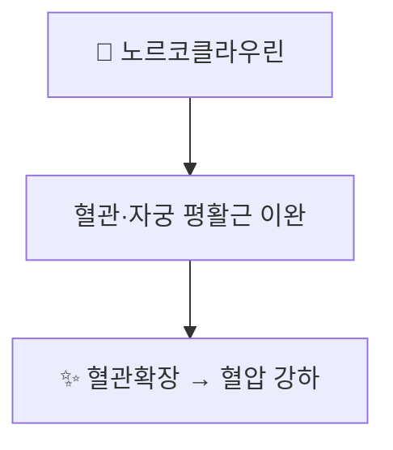

# 🔬 노르코클라우린 (Norcoclaurine)

> **핵심 3줄 요약 (Key Summary)**:
> - 🌿 기원 본초 & 화학 계열: [[연자심]](蓮子心, 수련과 *Nelumbo nucifera* 연꽃 씨앗의 배아)에 함유된 벤질이소퀴놀린 알칼로이드. 식물계에서 벤질이소퀴놀린 알칼로이드 생합성의 최초 골격 화합물로, [[리에닌]]·[[네페린]] 등 연자심의 주요 알칼로이드 생합성 경로의 시원 물질이기도 함.
> - 🎯 핵심 분자 표적: 혈관·자궁 평활근 이완 작용에 관여하는 것으로 제시되며, [[네페린]]과 함께 혈압 강하 효과의 기전으로 다뤄짐.
> - 🩺 주요 약리 활성: 평활근 이완을 통한 혈관확장·혈압강하 작용이 연자심의 청심사화(淸心瀉火) 효능의 현대적 근거로 제시됨.
> - ⚠️ 근거 수준: 노르코클라우린 단독의 약리 효능에 대한 사람 대상 임상 연구는 제한적이며, 대부분 연자심 전체 추출물 또는 관련 알칼로이드 복합체 수준의 연구입니다.

---

## 📌 목차
1. [기본 화학 정보 & 분자 구조식 (Chemical Identity)](#1-기본-화학-정보--분자-구조식-chemical-identity)
2. [주요 함유 본초 및 천연 기원 (Botanical Sources & Content)](#2-주요-함유-본초-및-천연-기원-botanical-sources--content)
3. [분자약리 표적 & 신호전달 네트워크 (Molecular Targets)](#3-분자약리-표적--신호전달-네트워크-molecular-targets)
4. [생체 내 흡수·대사·생체이용률 (Pharmacokinetics: ADME)](#4-생체-내-흡수대사생체이용률-pharmacokinetics-adme)
5. [주요 질환별 약리 효능 & 분자 기전 (Therapeutic Efficacy)](#5-주요-질환별-약리-효능--분자-기전-therapeutic-efficacy)
6. [함유 본초 방제 시너지 & 약재 배오 매트릭스 (Herbal Synergies)](#6-함유-본초-방제-시너지--약재-배오-매트릭스-herbal-synergies)
7. [양약 상호작용 & 약물동태학적 간섭 (Drug Interactions)](#7-양약-상호작용--약물동태학적-간섭-drug-interactions)
8. [💡 사용자 진료실 핵심 필기 & 임상 응용 팁 (Melt-In & High-Yield)](#8--사용자-진료실-핵심-필기--임상-응용-팁-melt-in--high-yield)
9. [출처 및 학술 참고 문헌 (References)](#9-출처-및-학술-참고-문헌-references)

---

## 1. 기본 화학 정보 & 분자 구조식 (Chemical Identity)

> [!abstract]+ 🧪 3D 약리 분자 구조 (Interactive 3D Viewer)
> <iframe src="https://molecule-viewer-rho.vercel.app/?cid=440927" width="100%" height="450px" frameborder="0" allow="webgl" style="border-radius: 8px;"></iframe>

| 항목 | 상세 내용 |
| :--- | :--- |
| **분자식 / 분자량** | C₁₆H₁₇NO₃ / 약 271.31 g/mol |
| **PubChem CID** | [440927](https://pubchem.ncbi.nlm.nih.gov/compound/S_-Norcoclaurine) ((S)-형) — PubChem에는 (−)-Higenamine으로도 등록됨 |
| **화학 골격 분류** | 벤질이소퀴놀린 알칼로이드(Benzylisoquinoline alkaloid, BIA) 계열의 가장 단순한 시조 구조 |

---

## 2. 주요 함유 본초 및 천연 기원 (Botanical Sources & Content)

| 함유 본초 | 기원 식물학적 명칭 | 주요 함유 부위 | 한의학적 귀경 및 약효 특성 |
| :--- | :--- | :--- | :--- |
| [[연자심]] (蓮子心) | 수련과 / *Nelumbo nucifera* | 연꽃 씨앗(연자)의 배아(심) | 심경(心經) 귀경, 청심사화(淸心瀉火)·삽정지혈(澁精止血) |

### 생합성적 의의: 벤질이소퀴놀린 알칼로이드의 시원 물질
식물 생합성 경로에서 (S)-노르코클라우린은 효소 (S)-노르코클라우린 합성효소(NCS)에 의해 도파민과 4-하이드록시페닐아세트알데히드가 축합되어 생성되는 벤질이소퀴놀린 알칼로이드(BIA) 계열의 최초 골격 화합물입니다. 이후 다양한 효소적 변형을 거쳐 모르핀(양귀비), 베르베린(황련 등), 그리고 연자심의 리에닌·네페린 등 수많은 BIA 알칼로이드로 분화됩니다.

* 연자심(*N. nucifera*)의 벤질이소퀴놀린 알칼로이드 생합성 경로와 (R)-형 경로가 연구되어 있습니다(Menéndez-Perdomo 2018, 2023).

---

## 3. 분자약리 표적 & 신호전달 네트워크 (Molecular Targets)

* [[연자심]] 노트에 기술된 바와 같이, 노르코클라우린은 [[네페린]]과 함께 혈관과 자궁 평활근을 이완시켜 혈압을 낮추는 작용에 관여하는 것으로 제시됩니다.

### 근거 보충 (검증됨)
* PubChem에서 (S)-노르코클라우린(CID 440927)은 (−)-higenamine으로도 등록되어 있으며, higenamine은 2017년 세계반도핑기구(WADA) 금지목록에 β2-아드레날린 수용체 작용제로 포함된 물질로, 시험관·동물·소수 임상 연구에서 부분적으로 β2 작용제로 작용하는 것으로 정리되어 있습니다(Hudzik 2021). 이 β2 작용이 위 평활근 이완 서술의 기전일 수 있으나, 연자심 노트의 서술과 직접 연결하는 문헌은 이 노트에서 확인하지 못했습니다.
* ⚠️ 내용 검토 필요: 자궁 평활근 이완·혈압 강하에 대한 노르코클라우린 단일 성분의 직접 근거는 확인되지 않았습니다.

---

## 4. 생체 내 흡수·대사·생체이용률 (Pharmacokinetics: ADME)

⚠️ 내용 검토 필요: 노르코클라우린 단독의 흡수·대사·반감기 등 약동학 자료는 이 노트에서 확인하지 못했습니다. 연자심 전탕액 복용 후 체내 거동도 미확인입니다.

---

## 5. 주요 질환별 약리 효능 & 분자 기전 (Therapeutic Efficacy)

* 평활근 이완을 통한 혈관확장·혈압강하 작용이 연자심의 청심사화(淸心瀉火) 효능의 현대적 근거로 제시됩니다(원문).
* higenamine(=노르코클라우린 계열)의 약리·의학적 응용은 종설로 정리되어 있습니다(Zhang 2017).
* ⚠️ 내용 검토 필요: 노르코클라우린 단독 임상 효능(혈압 강하 등)을 입증한 사람 대상 연구는 확인되지 않았습니다.

---

## 6. 함유 본초 방제 시너지 & 약재 배오 매트릭스 (Herbal Synergies)

노르코클라우린은 [[연자심]]의 청심사화 효능을 뒷받침하는 알칼로이드 성분 중 하나로, [[리에닌]]·[[네페린]] 등과 함께 심화(心火)로 인한 번조·불면·고혈압 경향에 활용되는 근거로 다뤄집니다.

| 함유 본초 | 공존 유효 성분군 | 전통 한의학적 효능 연계 |
| :--- | :--- | :--- |
| [[연자심]] | [[리에닌]], [[네페린]] | 심경 귀경, 청심사화(淸心瀉火) — 심화로 인한 번조·불면·고혈압 경향 |

---

## 7. 양약 상호작용 & 약물동태학적 간섭 (Drug Interactions)

* higenamine은 WADA 금지목록의 β2 작용제이므로(Hudzik 2021), 노르코클라우린과 동일 물질로 등록된 성분을 함유할 수 있는 제제를 복용하는 도핑검사 대상 운동선수 진료 시 유의가 필요합니다. 다만 [[연자심]] 복용 시 실제로 검출되는지는 이 노트에서 확인하지 못했습니다.
* ⚠️ 내용 검토 필요: β2 작용제 성격에 따른 심혈관계 약물(β차단제 등)과의 병용 상호작용은 직접 검증된 자료가 없어 이론적 우려로만 유의합니다.

---

## 8. 💡 사용자 진료실 핵심 필기 & 임상 응용 팁 (Melt-In & High-Yield)

* 노르코클라우린은 벤질이소퀴놀린 알칼로이드의 "시조 골격"으로 이해하면 모르핀·베르베린·리에닌·네페린이 한 뿌리에서 갈라진다는 점을 한 번에 설명할 수 있음.
* 연자심의 청심사화 효능은 심화로 인한 번조·불면·고혈압 경향 설명에 연결.
* 운동선수 환자 상담 시 higenamine과 동일 물질로 등록된다는 점을 참고.

---

## 9. 출처 및 학술 참고 문헌 (References)

1. **Menéndez-Perdomo IM, Facchini PJ (2018)**. *Benzylisoquinoline Alkaloids Biosynthesis in Sacred Lotus*. **Molecules**, 23(11):2899. PMID: [30404216](https://pubmed.ncbi.nlm.nih.gov/30404216/)
   - **[연구 요약]**: 연자심(Nelumbo nucifera)에서 노르코클라우린을 포함한 벤질이소퀴놀린 알칼로이드 생합성 경로를 정리한 연구.
2. **Menéndez-Perdomo IM, Facchini PJ (2023)**. *Elucidation of the (R)-enantiospecific benzylisoquinoline alkaloid biosynthetic pathways in sacred lotus (Nelumbo nucifera)*. **Sci Rep**, 13(1):2955. PMID: [36805479](https://pubmed.ncbi.nlm.nih.gov/36805479/) · [https://www.nature.com/articles/s41598-023-29415-0](https://www.nature.com/articles/s41598-023-29415-0)
   - **[연구 요약]**: 연자심의 (R)-형 벤질이소퀴놀린 알칼로이드 생합성 경로를 규명한 후속 연구.
3. **Hudzik TJ, Patel M, Brown A, et al. (2021)**. *β2-Adrenoceptor agonist activity of higenamine*. **Drug Test Anal**, 13(2):261-267. PMID: [33369180](https://pubmed.ncbi.nlm.nih.gov/33369180/)
   - **[연구 요약]**: higenamine이 WADA 금지목록에 β2 작용제로 포함된 배경과 β2 수용체 작용 증거를 정리한 미니 종설(체외·동물·소수 임상 및 in silico).
4. **Zhang N, Lian Z, Peng X, et al. (2017)**. *Applications of Higenamine in pharmacology and medicine*. **J Ethnopharmacol**, 196:242-252. PMID: [28007527](https://pubmed.ncbi.nlm.nih.gov/28007527/)
   - **[연구 요약]**: higenamine의 약리·의학적 응용을 정리한 종설.
5. PubChem Compound Summary — (S)-Norcoclaurine (CID 440927): [https://pubchem.ncbi.nlm.nih.gov/compound/S_-Norcoclaurine](https://pubchem.ncbi.nlm.nih.gov/compound/S_-Norcoclaurine)
