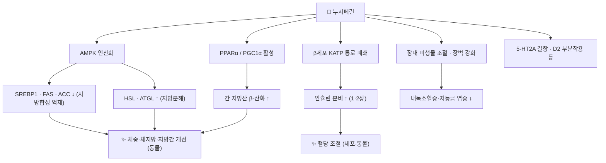

# 🔬 누시페린 (Nuciferine, C₁₉H₂₁NO₂)

> **핵심 3줄 요약 (Key Summary)**:
> - 🌿 기원 본초 & 화학 계열: [[하엽]](荷葉, 연꽃 *Nelumbo nucifera*의 잎)의 대표 성분인 **아포르핀(aporphine) 알칼로이드**. 같은 식물의 씨 배아([[연자심]])에는 [[네페린]]·[[리에닌]] 같은 비스벤질이소퀴놀린이 주를 이룬다.
> - 🎯 핵심 분자 표적: [[AMPK]] 활성화로 SREBP1·FAS·ACC(지방합성)를 누르고 HSL·ATGL(지방분해)을 올리며(§3.1), [[PPAR]]α/PGC1α로 간 β-산화를 높인다(§3.2). 췌장 β세포에서는 KATP 통로를 닫아 [[인슐린]] 분비를 늘리고(§3.3), 중추에서는 5-HT2A 길항·D2 부분작용 등 [[아리피프라졸]]과 비슷한 수용체 프로필을 보인다(§3.5).
> - 🩺 주요 약리 활성: 고지방식 비만·지방간·당뇨 동물에서 체중·체지방·간지방·인슐린 저항성 개선, 장내 미생물 조절 — 하엽의 청서이습(淸暑利濕)·승발청양(升發淸陽) 효능과 연결된다.
> - <font color="#fa7e7e">⚠️ 주의: 랫드 경구 생체이용률 **1.9%**(PMID 29909691)로 매우 낮고 사람 임상 근거가 없다. **CYP1A2를 억제**해 랫드에서 페나세틴 AUC를 74.6% 올렸고(PMID 20609070), KATP 폐쇄 작용이 있어 설포닐우레아와 저혈당 상가 가능성(이론적)이 있다.</font>

---

## 📌 목차
1. [기본 화학 정보 & 분자 구조식 (Chemical Identity)](#1-기본-화학-정보--분자-구조식-chemical-identity)
2. [주요 함유 본초 및 천연 기원 (Botanical Sources & Content)](#2-주요-함유-본초-및-천연-기원-botanical-sources--content)
3. [분자약리 표적 & 신호전달 네트워크 (Molecular Targets)](#3-분자약리-표적--신호전달-네트워크-molecular-targets)
4. [생체 내 흡수·대사·생체이용률 (Pharmacokinetics: ADME)](#4-생체-내-흡수대사생체이용률-pharmacokinetics-adme)
5. [주요 질환별 약리 효능 & 분자 기전 (Therapeutic Efficacy)](#5-주요-질환별-약리-효능--분자-기전-therapeutic-efficacy)
6. [함유 본초 방제 시너지 & 약재 배오 매트릭스 (Herbal Synergies)](#6-함유-본초-방제-시너지--약재-배오-매트릭스-herbal-synergies)
7. [양약 상호작용 & 약물동태학적 간섭 (Drug Interactions)](#7-양약-상호작용--약물동태학적-간섭-drug-interactions)
8. [💡 사용자 진료실 핵심 필기 & 임상 응용 팁 (Melt-In & High-Yield)](#8--사용자-진료실-핵심-필기--임상-응용-팁-melt-in--high-yield)
9. [출처 및 학술 참고 문헌 (References)](#9-출처-및-학술-참고-문헌-references)

---

## 1. 기본 화학 정보 & 분자 구조식 (Chemical Identity)

### 1.1 화학적 특성
누시페린은 테트라히드로이소퀴놀린에서 한 번 더 고리가 닫힌 **아포르핀(dibenzo[de,g]quinoline)** 골격에 메톡시기 2개와 N-메틸을 가진 알칼로이드입니다. PubChem에서 CID 10146은 (6aR) 배치의 (−)-누시페린입니다. 페놀 OH가 없고 극성 표면적이 작아(TPSA 21.7 Ų) 지용성이 높으며, 이것이 뇌 분포(§4)와 중추 수용체 작용(§3.3)의 구조적 바탕입니다.

| 항목 (Property) | 세부 정보 (Specification) |
| :--- | :--- |
| **IUPAC 명칭** | (6aR)-1,2-dimethoxy-6-methyl-5,6,6a,7-tetrahydro-4H-dibenzo[de,g]quinoline (PubChem) |
| **분자식 / 분자량** | C₁₉H₂₁NO₂ / 295.4 g/mol |
| **PubChem CID** | [10146](https://pubchem.ncbi.nlm.nih.gov/compound/10146) ((−)-Nuciferine) |
| **CAS 등록번호** | 475-83-2 (PubChem 동의어 기준, CAS 원본 대조는 못 함) |
| **화학 골격 분류** | 아포르핀 알칼로이드 (벤질이소퀴놀린 계열에서 파생) |
| **물리화학 지표** | XLogP 3.4 · TPSA 21.7 Ų (PubChem 계산값) |
| **성상·녹는점·용해도** | 백색~미황색 결정성 분말, 쓴맛, 녹는점 165~166 °C, 에탄올·아세톤·클로로포름 가용·물 난용 ⚠️ 원문 기재, 1차 자료 대조 못 함 |
| **생합성** | 벤질이소퀴놀린 경로([[히게나민]] = 노르코클라우린에서 출발)에서 분자 내 산화 결합으로 아포르핀 고리 형성 |

### 1.2 2D 분자 구조식
![[누시페린_2D_구조식.png|300]]
> [그림 1: ① 2D 화학 구조식 — (−)-누시페린(PubChem CID 10146). 1,2-디메톡시·N-메틸 아포르핀. 출처: [PubChem](https://pubchem.ncbi.nlm.nih.gov/compound/10146)]

![[누시페린-20240916022105940.png|350]]
> [그림 2: 원장님 수기 필기 — 누시페린과 불보카프닌(bulbocapnine)의 아포르핀 구조 비교 (원본 필기 보존)]

### 1.3 3D 약리 분자 구조 (Interactive Viewer)
> [!abstract]+ 🧪 3D 약리 분자 구조 (Interactive 3D Viewer)
> <iframe src="https://molecule-viewer-rho.vercel.app/?cid=10146" width="100%" height="450px" frameborder="0" allow="webgl" style="border-radius: 8px;"></iframe>

---

## 2. 주요 함유 본초 및 천연 기원 (Botanical Sources & Content)

![[누시페린_2_기원식물_연잎.jpg|400]]
> [그림 3: ② 약용 부위 실사 — 연꽃(*Nelumbo nucifera*)의 잎(하엽). 누시페린의 주 공급 부위. 출처: Goresm, [Wikimedia Commons](https://commons.wikimedia.org/wiki/File:Nelumbo_(Lutus)_Leaf.jpg) (CC BY-SA 4.0)]

| 본초명 | 학명 및 기원식물 | 약용 부위 | 함유율 (원문) | 성분 배합 특성 |
| :--- | :--- | :--- | :--- | :--- |
| [[하엽]] (荷葉, 연잎) | 연꽃과 / *Nelumbo nucifera* Gaertn. | 건조 잎 | 0.4 ~ 1.2% ⚠️ | 누시페린이 "연잎의 주요 아포르핀 알칼로이드"로 확인(PMID 20609070·30129056), 로에메린·[[퀘르세틴]] 배당체 공존(원문) |
| [[연자육]] (蓮子肉) | 같은 식물 | 성숙 종자 | 0.05 ~ 0.2% ⚠️ | 원문 기재, 함유 근거 확인 못 함 |
| [[연자심]] (蓮子心) | 같은 식물 | 종자 속 녹색 배아 | 0.1 ~ 0.5% ⚠️ | 원문 기재. 배아의 주 알칼로이드는 [[네페린]]·[[리에닌]](비스벤질이소퀴놀린) |

* ⚠️ 함유율(%) 수치는 모두 원문이며 문헌으로 확인하지 못했습니다.
* 연잎 가공 제제(허예후이, Heyehui)가 식이 유도 비만 마우스에서 효과를 보인 연구가 있으나 누시페린 단독 결과는 아닙니다(PMID 42468370).

---

## 3. 분자약리 표적 & 신호전달 네트워크 (Molecular Targets)



### 3.1 AMPK 활성화 — 지방합성 억제·지방분해 촉진
* 고지방식 마우스(식이 0.10%, 12주)에서 누시페린은 체중·체지방·간지방증을 줄이고 에너지 소비를 높였습니다. 간과 부고환 백색지방에서 AMPK 인산화를 높여 SREBP1·FAS·ACC(지방합성)를 억제하고 HSL·ATGL(지방분해)과 FGF21·ZAG를 올렸으며, AMPK 억제제(compound C)로 효과가 사라졌습니다(Xu 2022, *Distinct AMPK-Mediated FAS/HSL Pathway Is Implicated in the Alleviating Effect of Nuciferine on Obesity*, PMID 35565866).

### 3.2 PPARα/PGC1α — 간 β-산화 촉진
* 고지방식+STZ 당뇨 마우스에서 누시페린은 내당능·인슐린 저항성을 회복시키고 간 총콜레스테롤·중성지방·LDL과 지방방울을 줄였으며 β-산화 유전자를 올렸습니다. 루시페라아제 분석에서 팔미트산이 억제한 PPARα 전사 활성을 직접 되돌렸고, HepG2 세포에서 PGC1α를 없애면 효과가 사라졌습니다(Zhang 2018, *Nuciferine ameliorates hepatic steatosis in high-fat diet streptozocin-induced diabetic mice*, PMID 30129056).
* 이로써 원문의 "CPT-1·PPARα 상향 → 미토콘드리아 β-산화 촉진" 서술 가운데 **PPARα 경로는 확인**되었습니다. CPT-1 자체는 이번에 초록에서 확인하지 못했습니다 ⚠️.

### 3.3 췌장 β세포 인슐린 분비 — KATP 통로 폐쇄

![[누시페린_3_베타세포_인슐린분비.png|450]]
> [그림 4: ③ 표적 기전 도해 — β세포 인슐린 분비 경로(GLUT2 → ATP/ADP↑ → **KATP 통로 폐쇄** → 탈분극 → 전압의존 Ca²⁺ 통로 → 인슐린 과립 방출). 누시페린은 이 중 KATP 통로를 닫는다(§3.3 본문). 출처: BQUB17-PlanaCampas, [Wikimedia Commons](https://commons.wikimedia.org/wiki/File:Insulin_secretion.png) (CC BY-SA 4.0)]

* 분리 췌도에서 누시페린은 인슐린 분비 1·2상을 모두 자극했고, 이 효과는 디아족사이드(KATP 개방제)·니모디핀(Ca²⁺ 통로 차단제)으로 완전히 사라졌습니다. INS-1E 세포에서도 저·고포도당 조건 모두에서 분비를 늘렸고, 글리벤클라미드보다 효과가 강하고 β세포 독성은 적었으며, 설포닐우레아 수용체 결합을 두고 경쟁하지는 않았습니다(Nguyen 2012, PMID 22633982).

### 3.4 장내 미생물·장벽
* 고지방식 랫드에서 후벽균문/의간균문 비와 내독소 생성균(데설포비브리오속)을 줄이고 단쇄지방산 생성균을 늘렸으며, 장벽 무결성을 높여 내독소혈증과 만성 저등급 염증을 줄였습니다(Wang 2020, *gut microbiota and prevents obesity in high-fat diet-fed rats*, PMID 33262480).
* 원문의 "*Akkermansia muciniphila* 선택적 증식"은 이 초록에서 확인하지 못했습니다 ⚠️.

### 3.5 중추 세로토닌·도파민 수용체
* 누시페린은 5-HT2A·5-HT2C·5-HT2B 길항, 5-HT7 역작용, D2·D5·5-HT6 부분작용, 5-HT1A·D4 작용, 도파민 수송체 억제를 보여 [[아리피프라졸]]과 비슷한 수용체 프로필을 가졌고, 설치류에서 비정형 항정신병약 유사 작용을 보였습니다(Farrell 2016, PMID 26963248).
* 원문의 "항불안·식욕 억제" 효과 자체는 이번에 직접 확인하지 못했습니다 ⚠️.

---

## 4. 생체 내 흡수·대사·생체이용률 (Pharmacokinetics: ADME)

| 항목 | 내용 | 근거 |
| :--- | :--- | :--- |
| **경구 생체이용률(랫드)** | **1.9 ± 0.8%** (경구 10 mg/kg vs 정주 0.2 mg/kg) — 빠른 분포, 불량한 전신 흡수 | Wang 2018, PMID 29909691 |
| **조직 분포(랫드)** | AUC₀₋₄ₕ: 신장 > 폐 > 비장 > 간 > **뇌** > 심장 | PMID 29909691 |
| **배설(랫드)** | 경구 후 **50.7%가 미변화체로 신장 배설** | PMID 29909691 |
| **사람 간 대사** | CYP3A4·1A2·2A6·2C8(산화 대사체 7종) + UGT1A4(글루쿠론산 포합 1종) | Lu 2010, PMID 21127497 |
| **종간 차이** | 글루쿠론산 포합체는 **사람·토끼 간에서만** 생성 → 랫드·마우스·개·원숭이는 사람 약동학 모델로 부적합 | PMID 21127497 |

* ⚠️ **원문 수치 정정**: 원문의 "Tmax 0.8~1.5시간, 반감기 3.5~5.0시간, 담즙-분변 60%·뇨 35%, CYP1A2·2D6·3A4 대사"는 확인되지 않았습니다. 랫드에서는 오히려 **신장 배설이 절반**이었고, 사람 간 대사 효소는 CYP3A4·1A2·2A6·2C8·UGT1A4로 확인되었습니다(CYP2D6은 목록에 없음).
* 동물(특히 설치류)과 사람의 대사가 달라 동물 약동학을 사람에 그대로 옮기기 어렵다는 점이 핵심입니다(PMID 21127497).

---

## 5. 주요 질환별 약리 효능 & 분자 기전 (Therapeutic Efficacy)

| 질환 | 근거 | 근거 수준 |
| :--- | :--- | :--- |
| [[비만]]·대사증후군 | 고지방식 마우스 체중·체지방↓, 에너지 소비↑(PMID 35565866) · 랫드 비만 예방·장내 미생물 조절(PMID 33262480) | 동물 |
| 비알코올성 지방간(MASLD) | 간지방증↓(PMID 35565866) · 당뇨 마우스 간 TG·TC·LDL↓, PPARα/PGC1α(PMID 30129056) | 동물·세포 |
| [[이상지질혈증]] | 간 지질 프로필 개선(PMID 30129056) | 동물 |
| [[제2형 당뇨병]] | 내당능·인슐린 저항성 회복(PMID 30129056) · β세포 인슐린 분비↑(PMID 22633982) | 동물·세포 |

* 종설: 누시페린의 항비만·지질·혈당·항염·신경 작용이 정리되어 있습니다(Ren 2024, *Advances in the pharmacological effects and mechanisms of Nelumbo nucifera Extract nuciferine*, PMID 38670406).
* <font color="#fa7e7e">⚠️ 원문의 "AST·ALT·γ-GTP 정상화", "복부 비만 환자 체지방 감량" 등 사람 적응증을 입증한 임상 문헌은 확인되지 않았습니다. 낮은 경구 생체이용률(1.9%, 랫드)을 고려하면 동물 결과를 사람 효과로 옮길 때 신중해야 합니다.</font>

---

## 6. 함유 본초 방제 시너지 & 약재 배오 매트릭스 (Herbal Synergies)

### 6.1 원문 필기: 하엽과 처방 배오
* 여름철 더위·습기로 기력이 처지고 몸이 무거우며 부종·설사가 생기는 주하병(注夏病)·서습증에 [[청서익기탕]] 속 [[하엽]]의 누시페린이 장벽을 복구하고 수분 정체를 푼다.
* 비만 처방에서 식욕 항진·부종·지방간이 겹친 환자에게 [[마황]] 단독 처방의 심계항진 부담을 완충하는 보조 약재.

```
[비만·지방간 한의 처방 네트워크 — 원문 필기]
마황 (에페드린) ────► 교감신경 자극 (열량 소모)
      ▲
      │ (상보적 시너지 & 부작용 완충)
      ▼
하엽 (누시페린) ────► AMPK 활성화 (지방합성 억제) + 5-HT 진정 (심계항진 완화)
```

* ⚠️ 볼트의 [[청서익기탕]] 노트에서 하엽은 구성약으로 확인되지 않았습니다. 마황([[에페드린]])과의 완충 배오도 문헌으로 확인하지 못했습니다. AMPK 활성화(PMID 35565866)와 5-HT2A 길항(PMID 26963248)은 각각 확인된 기전이지만, 둘을 합쳐 "심계항진 완화"로 연결한 것은 원문의 해석입니다.

### 6.2 같은 식물 안의 성분 분업
| 부위 (본초) | 주 알칼로이드 | 대표 작용 |
| :--- | :--- | :--- |
| 잎 ([[하엽]]) | **누시페린**(아포르핀) | 지질·혈당 대사 |
| 씨 배아 ([[연자심]]) | [[네페린]]·[[리에닌]](비스벤질이소퀴놀린), [[히게나민]] | 진정·항부정맥(네페린), β 작용(히게나민) |

---

## 7. 양약 상호작용 & 약물동태학적 간섭 (Drug Interactions)

* **CYP1A2 기질 약물 — 농도 상승 가능(동물 근거)**: 누시페린은 재조합 CYP1A2를 억제했고(IC50 2.12 밀리몰/L), 랫드에 20 mg/kg 경구 투여 후 페나세틴을 정주하자 청소율이 43% 줄고 곡선하면적이 74.6% 늘었습니다(Hu 2010, PMID 20609070). 사람에서는 확인되지 않았지만, CYP1A2로 대사되는 좁은 치료역 약물([[클로자핀]]·테오필린 등)과 고용량 하엽 추출물의 병용은 주의 대상입니다.
* **설포닐우레아·인슐린 — 저혈당 상가(이론적)**: 누시페린은 KATP 통로를 닫아 인슐린 분비를 늘리므로(PMID 22633982), [[글리메피리드]] 등 설포닐우레아나 인슐린과 함께 쓰면 저혈당 위험이 더해질 수 있습니다. 설포닐우레아 수용체 결합을 경쟁하지 않아 **작용 부위가 겹치지 않고 더해지는** 구조입니다(원문의 "혈당 모니터링" 권고와 일치).
* **중추 작용 약물 — 이론적 유의**: 5-HT·도파민 수용체와 도파민 수송체에 다중 작용하므로(PMID 26963248) 항정신병약·항우울제와의 병용 시 이론적으로 상호작용 가능성이 있습니다.
* **원문 이상반응 표(⚠️ 인체 근거 미확인)**: 경미한 진정·졸림(야간 복용 권장), 소화불량·묽은 변(비위허한은 감초·생강 합방), 임신 중 다량 복용 삼가(자궁 평활근 수축 우려).

---

## 8. 💡 사용자 진료실 핵심 필기 & 임상 응용 팁 (Melt-In & High-Yield)

### 8.1 승발청양(升發淸陽)과 대사 리셋 (원문 필기)
* 『본초강목』에서 하엽은 "청양의 기운을 끌어올려 비위의 소화 흡수를 돕고 불필요한 군살을 깎아낸다"고 기록 → 누시페린이 칼로리를 백색지방으로 저장하지 않고 AMPK를 통해 소모시키는 작용과 대응.
  * ⚠️ 『본초강목』 원문 대조는 이번에 하지 못했습니다.

### 8.2 원장님 실전 다이어트 상담 티칭 (원문 필기)
* "연잎 성분인 누시페린은 간에서 기름을 만드는 공장 스위치(ACC/FAS)를 끄고 몸 안의 에너지 발전기(AMPK)를 켜주는 성분입니다. 장 속 유익균을 살려 다이어트 중 변비와 만성 피로를 함께 잡아줍니다."
  * → **2026-09-26 보강**: 기전 설명은 동물 근거와 맞습니다(PMID 35565866·33262480). 다만 "변비·만성 피로 개선"은 확인되지 않았고, 사람 임상 근거가 없다는 점을 함께 안내하는 것이 안전합니다.

### 8.3 복약 상담 포인트
* 당뇨약(특히 설포닐우레아) 복용 환자에게 하엽을 고용량으로 쓸 때는 저혈당 증상을 교육합니다(KATP 기전).
* 클로자핀·테오필린 복용 환자는 CYP1A2 억제 가능성 때문에 하엽 추출물 고용량 병용을 피하거나 모니터링합니다(동물 근거).

---

## 9. 출처 및 학술 참고 문헌 (References)

1. **Xu H, Lyu X, Guo X, et al. (2022)**. *Distinct AMPK-Mediated FAS/HSL Pathway Is Implicated in the Alleviating Effect of Nuciferine on Obesity and Hepatic Steatosis in HFD-Fed Mice*. **Nutrients**, 14(9):1898. [PMID 35565866](https://pubmed.ncbi.nlm.nih.gov/35565866/) · [DOI](https://doi.org/10.3390/nu14091898)
   - **[연구 요약]**: AMPK 매개 FAS/HSL 경로로 비만·지방간 완화, AMPK 억제제로 효과 소실.
2. **Zhang C, Deng J, Liu D, et al. (2018)**. *Nuciferine ameliorates hepatic steatosis in high-fat diet/streptozocin-induced diabetic mice through a PPARα/PPARγ coactivator-1α pathway*. **Br J Pharmacol**, 175(22):4218-4228. [PMID 30129056](https://pubmed.ncbi.nlm.nih.gov/30129056/) · [DOI](https://doi.org/10.1111/bph.14482)
   - **[연구 요약]**: 당뇨 마우스 간지방증 완화, PPARα/PGC1α 경로 β-산화 촉진.
3. **Nguyen KH, Ta TN, Pham TH, et al. (2012)**. *Nuciferine stimulates insulin secretion from beta cells — an in vitro comparison with glibenclamide*. **J Ethnopharmacol**, 142(2):488-495. [PMID 22633982](https://pubmed.ncbi.nlm.nih.gov/22633982/) · [DOI](https://doi.org/10.1016/j.jep.2012.05.024)
   - **[연구 요약]**: KATP 통로 폐쇄로 인슐린 분비 1·2상 촉진, 글리벤클라미드보다 강하고 독성 적음.
4. **Wang Y, Yao W, Li B, et al. (2020)**. *Nuciferine modulates the gut microbiota and prevents obesity in high-fat diet-fed rats*. **Exp Mol Med**, 52(12):1959-1975. [PMID 33262480](https://pubmed.ncbi.nlm.nih.gov/33262480/) · [DOI](https://doi.org/10.1038/s12276-020-00534-2)
   - **[연구 요약]**: 장내 미생물 조절·장벽 강화로 내독소혈증·저등급 염증 감소, 비만 예방.
5. **Farrell MS, McCorvy JD, Huang XP, et al. (2016)**. *In Vitro and In Vivo Characterization of the Alkaloid Nuciferine*. **PLoS One**, 11(3):e0150602. [PMID 26963248](https://pubmed.ncbi.nlm.nih.gov/26963248/) · [DOI](https://doi.org/10.1371/journal.pone.0150602)
   - **[연구 요약]**: 세로토닌·도파민 수용체 프로필, 비정형 항정신병약 유사 작용.
6. **Wang F, Cao J, Hou X, et al. (2018)**. *Pharmacokinetics, tissue distribution, bioavailability, and excretion of nuciferine, an alkaloid from lotus, in rats by LC/MS/MS*. **Drug Dev Ind Pharm**, 44(9):1557-1562. [PMID 29909691](https://pubmed.ncbi.nlm.nih.gov/29909691/) · [DOI](https://doi.org/10.1080/03639045.2018.1483399)
   - **[연구 요약]**: 경구 생체이용률 1.9%, 조직 분포 신>폐>비>간>뇌>심, 50.7% 신장 미변화체 배설.
7. **Lu YL, He YQ, Wang M, et al. (2010)**. *Characterization of nuciferine metabolism by P450 enzymes and uridine diphosphate glucuronosyltransferases in liver microsomes from humans and animals*. **Acta Pharmacol Sin**, 31(12):1635-1642. [PMID 21127497](https://pubmed.ncbi.nlm.nih.gov/21127497/) · [DOI](https://doi.org/10.1038/aps.2010.172)
   - **[연구 요약]**: CYP3A4·1A2·2A6·2C8·UGT1A4 관여, 글루쿠론산 포합은 사람·토끼에서만.
8. **Hu L, Xu W, Zhang X, et al. (2010)**. *In-vitro and in-vivo evaluations of cytochrome P450 1A2 interactions with nuciferine*. **J Pharm Pharmacol**, 62(5):658-662. [PMID 20609070](https://pubmed.ncbi.nlm.nih.gov/20609070/) · [DOI](https://doi.org/10.1211/jpp.62.05.0015)
   - **[연구 요약]**: CYP1A2 억제, 랫드에서 페나세틴 청소율 43% 감소·AUC 74.6% 증가.
9. **Ren X, et al. (2024)**. *Advances in the pharmacological effects and mechanisms of Nelumbo nucifera gaertn. Extract nuciferine*. **J Ethnopharmacol**, 331:118262. [PMID 38670406](https://pubmed.ncbi.nlm.nih.gov/38670406/)
   - **[연구 요약]**: 누시페린 약리·기전 종설.
10. **Wei K, Yu J, Zhou H, et al. (2026)**. *Heyehui attenuates diet-induced obesity via regulating LEP/AMPK/ACC axis and restoring intestinal function in mice*. **Phytomedicine**, 159:158574. [PMID 42468370](https://pubmed.ncbi.nlm.nih.gov/42468370/) · [DOI](https://doi.org/10.1016/j.phymed.2026.158574)
    - **[연구 요약]**: 연잎 가공 제제의 렙틴/AMPK/ACC 축 활성화·장 기능 회복(누시페린 단독 아님).
11. PubChem Compound Summary — (−)-Nuciferine (CID 10146): [https://pubchem.ncbi.nlm.nih.gov/compound/10146](https://pubchem.ncbi.nlm.nih.gov/compound/10146)

**이미지 출처·라이선스**
- 그림 1: PubChem 2D 구조식 (CID 10146) — 공공 데이터
- 그림 2: 원장님 수기 필기 (원본)
- 그림 3: Goresm, *Nelumbo (Lutus) Leaf* — [Commons](https://commons.wikimedia.org/wiki/File:Nelumbo_(Lutus)_Leaf.jpg), CC BY-SA 4.0
- 그림 4: BQUB17-PlanaCampas, *Insulin secretion* — [Commons](https://commons.wikimedia.org/wiki/File:Insulin_secretion.png), CC BY-SA 4.0

<!-- 보관 태그(1회용·링크오류, 필요시 복원): 하엽, 연자육 -->
