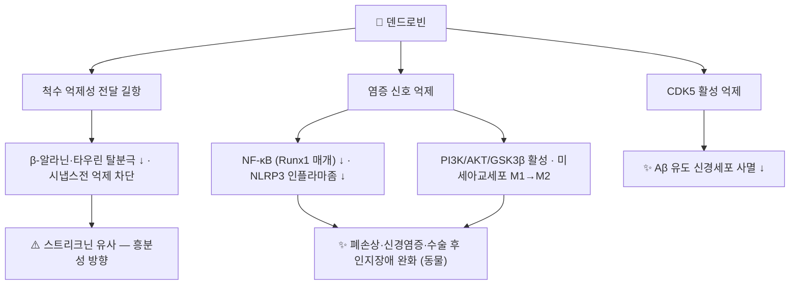

# 🔬 덴드로빈 (Dendrobine, C₁₆H₂₅NO₂)

> **핵심 3줄 요약 (Key Summary)**:
> - 🌿 기원 본초 & 화학 계열: [[석곡]](石斛, 난초과 *Dendrobium nobile* 등의 줄기)의 대표 지표 성분인 **피크로톡산(picrotoxane)형 세스퀴테르펜 [[알칼로이드]]**. 경련독 피크로톡시닌과 골격이 같다.
> - 🎯 핵심 분자 표적: 개구리 척수에서 β-알라닌·타우린 유발 탈분극과 시냅스전 억제를 **차단**했고 GABA·글리신 반응에는 영향이 적었다 — 작용 양상이 [[스트리크닌]]과 비슷했다(PMID 6405832). 즉 확인된 신경 작용은 "진정"이 아니라 **억제성 전달의 길항**이다.
> - 🩺 주요 약리 활성: 항염증([[NF-κB]]·[[NLRP3]] 억제)과 신경보호(Aβ 독성 억제, 수술 후 인지장애·신경염증 완화), 급성 폐손상·패혈증 폐손상 완화 — 모두 세포·동물 연구.
> - ⚠️ 주의: 사람 임상·약동학 자료가 없다. 억제성 신경전달을 막는 스트리크닌 유사 작용이 보고되었으므로 고용량 단일 성분 사용의 안전성은 확인되지 않았다(독성 정량 자료 미확인).

---

## 📌 목차
1. [기본 화학 정보 & 분자 구조식 (Chemical Identity)](#1-기본-화학-정보--분자-구조식-chemical-identity)
2. [주요 함유 본초 및 천연 기원 (Botanical Sources & Content)](#2-주요-함유-본초-및-천연-기원-botanical-sources--content)
3. [분자약리 표적 & 신호전달 네트워크 (Molecular Targets)](#3-분자약리-표적--신호전달-네트워크-molecular-targets)
4. [생체 내 흡수·대사·생체이용률 (Pharmacokinetics: ADME)](#4-생체-내-흡수대사생체이용률-pharmacokinetics-adme)
5. [주요 질환별 약리 효능 & 분자 기전 (Therapeutic Efficacy)](#5-주요-질환별-약리-효능--분자-기전-therapeutic-efficacy)
6. [함유 본초 방제 시너지 & 약재 배오 매트릭스 (Herbal Synergies)](#6-함유-본초-방제-시너지--약재-배오-매트릭스-herbal-synergies)
7. [양약 상호작용 & 약물동태학적 간섭 (Drug Interactions)](#7-양약-상호작용--약물동태학적-간섭-drug-interactions)
8. [💡 사용자 진료실 핵심 필기 & 임상 응용 팁 (Melt-In & High-Yield)](#8--사용자-진료실-핵심-필기--임상-응용-팁-melt-in--high-yield)
9. [출처 및 학술 참고 문헌 (References)](#9-출처-및-학술-참고-문헌-references)

---

## 1. 기본 화학 정보 & 분자 구조식 (Chemical Identity)

### 1.1 화학적 특성
덴드로빈은 세스퀴테르펜(C15) 골격에 질소가 들어간 4환 알칼로이드로, 락톤 고리와 N-메틸 3급 아민, 이소프로필기를 가집니다. 골격은 경련독 피크로톡시닌과 같은 **피크로톡산형**이며, 이 계열은 아미노산 신경전달물질 길항과 구조-활성 관계가 논의되어 왔습니다(PMID 6405832).

| 항목 (Property) | 세부 정보 (Specification) |
| :--- | :--- |
| **IUPAC 명칭** | (1S,4S,7S,8R,11R,12R,13S)-2,12-dimethyl-13-propan-2-yl-10-oxa-2-azatetracyclo[5.4.1.1⁸,¹¹.0⁴,¹²]tridecan-9-one (PubChem) |
| **분자식 / 분자량** | C₁₆H₂₅NO₂ / 263.37 g/mol |
| **PubChem CID** | [442523](https://pubchem.ncbi.nlm.nih.gov/compound/442523) |
| **CAS 등록번호** | 2115-91-5 (PubChem 동의어 기준, CAS 원본 대조는 못 함) |
| **화학 골격 분류** | 피크로톡산형 세스퀴테르펜 알칼로이드 — 석곡속 특이 *(기존 '피콜리놀리진형'은 오기라 정정)* |
| **물리화학 지표** | XLogP 3.0 · TPSA 29.5 Ų (PubChem 계산값) — 극성이 낮아 막 투과에 유리한 구조 |
| **동족 성분** | 석곡에서 덴드로빈형 알칼로이드 6종(N-메톡시카르보닐덴드로빈, 6-히드록시덴드로빈, 덴드로빈 N-옥사이드 등)이 함께 분리됨(PMID 34930072) |

### 1.2 2D 분자 구조식
![[덴드로빈_1_화학구조식.png|320]]
> [그림 1: ① 2D 화학 구조식 — 덴드로빈(PubChem CID 442523). 피크로톡산 골격의 4환 구조, 락톤(C=O)과 N-메틸 아민. 출처: [PubChem](https://pubchem.ncbi.nlm.nih.gov/compound/442523)]

### 1.3 3D 약리 분자 구조 (Interactive Viewer)
> [!abstract]+ 🧪 3D 약리 분자 구조 (Interactive 3D Viewer)
> <iframe src="https://molecule-viewer-rho.vercel.app/?cid=442523" width="100%" height="450px" frameborder="0" allow="webgl" style="border-radius: 8px;"></iframe>

---

## 2. 주요 함유 본초 및 천연 기원 (Botanical Sources & Content)

![[덴드로빈_2_기원식물_석곡.jpg|400]]
> [그림 2: ② 기원 식물 실사 — 금채석곡(*Dendrobium nobile* Lindl.)의 꽃과 마디진 줄기. 약용 부위는 줄기. 출처: Guérin Nicolas, [Wikimedia Commons](https://commons.wikimedia.org/wiki/File:Dendrobium_nobile_(BG_Zurich)-01.JPG) (CC BY-SA 3.0)]

![[덴드로빈_2_석곡_식물도해.jpg|320]]
> [그림 3: ② 식물 도해 — *Dendrobium nobile*의 마디진 줄기(위경, 僞莖)와 꽃. 출처: Lindley, *Sertum Orchidaceum* pl. 3 (1838), [Wikimedia Commons](https://commons.wikimedia.org/wiki/File:Dendrobium_nobile_-_Sertum_-_Lindley_pl._3_(1838).jpg) (Public domain)]

| 함유 본초 | 기원 식물 (과명 / 학명) | 약용 부위 | 한의학적 귀경 및 약효 | 덴드로빈 근거 |
| :--- | :--- | :--- | :--- | :--- |
| [[석곡]] (石斛) | 난초과 / *Dendrobium nobile* Lindl. 등 석곡속 | 줄기 | 위·신경 / 자음생진·양위생진·명목·강근 | 줄기에서 분리(PMID 34930072·36658700). 중국약전 수재 약재(PMID 36658700) |

* 석곡 알칼로이드(덴드로빈 포함)의 구조·약리·생합성은 최신 종설로 정리되어 있고(Yang 2026, PMID 42353576), 석곡속 세스퀴테르페노이드 전반도 종설이 있습니다(Li 2024, PMID 39769940).
* ⚠️ 석곡속 여러 종 가운데 덴드로빈이 *D. nobile*에 특히 많다는 서술은 원문 수준이며, 종별 함량은 이번에 확인하지 못했습니다.

---

## 3. 분자약리 표적 & 신호전달 네트워크 (Molecular Targets)

![[덴드로빈_3_피크로톡시닌_비교구조.png|320]]
> [그림 4: ③ 구조 비교 — 피크로톡시닌(picrotoxinin). 덴드로빈과 같은 피크로톡산 골격의 GABA_A 수용체 차단 경련독. 개구리 척수에서 덴드로빈의 작용은 피크로톡시닌보다 스트리크닌에 가까웠다(PMID 6405832). 출처: NEUROtiker, [Wikimedia Commons](https://commons.wikimedia.org/wiki/File:Picrotoxinin.svg) (Public domain)]

### 3.1 억제성 신경전달 길항 (원문 '진정 작용' 정정)
* 개구리 분리 척수에서 덴드로빈(3×10⁻⁵ M)은 1차 구심 말단의 **β-알라닌·타우린 유발 탈분극을 줄였지만 [[GABA]]·글리신 유발 탈분극에는 영향이 적었고**, 복근 역방향 자극에 의한 시냅스전 억제를 가역적으로 차단했습니다. 이 효과는 스트리크닌과 질적으로 비슷하고, 같은 골격의 피크로톡시닌과는 다소 달랐습니다. 같은 석곡 알칼로이드 노빌린(nobiline)은 효과가 없었습니다(Kudo 1983, PMID 6405832).
* 원문의 "GABA성 전달 조절을 통한 진정 유사 작용"은 이 결과와 방향이 반대입니다 — 확인된 것은 **억제의 차단**(흥분 방향)입니다. 피크로톡시닌 유사체가 곤충 GABA 수용체를 막는다는 보고(PMID 7916140)는 덴드로빈 자체 연구가 아닙니다.

### 3.2 항염증
* LPS 급성 폐손상: PI3K/AKT/GSK3β 경로 활성화로 완화(Zhou 2025, PMID 40089200).
* 패혈증 마우스 폐손상: 미토콘드리아-소포체 상호작용 매개 [[NLRP3]] 인플라마좀 활성화 억제(Zhang 2026, PMID 42303347).
* 수술 후 인지기능장애: Runx1 매개 [[NF-κB]] 신호 억제(Ji 2026, PMID 41616945).
* LPS 신경염증: 미세아교세포 M1→M2 분극 조절(Cui 2026, PMID 41830010).

### 3.3 신경보호 — CDK5 억제
* PC12 세포에서 석곡 알칼로이드 3종 중 덴드로빈이 Aβ₁₋₄₂ 독성을 가장 강하게 막았고, CDK5 활성화를 억제하며 Bcl-2↑·Bax·cyto-c·caspase-3↓를 보였습니다. SPR에서 CDK5 단백질에 직접 결합했습니다(KD 2.05×10⁻⁴ M)(Zhang 2023, PMID 36658700).

---

## 4. 생체 내 흡수·대사·생체이용률 (Pharmacokinetics: ADME)

| 항목 | 내용 | 근거 |
| :--- | :--- | :--- |
| **혈중 거동(랫드)** | 덴드로빈과 주 대사체 N-탈메틸 덴드로빈이 **다중 피크·지속 평탄부**를 보임 (N-옥사이드는 아님) | Pan 2025, PMID 40484035 |
| **장위 재순환** | 덴드로빈과 N-옥사이드가 이온 포획으로 **위 내강에 분비** → N-옥사이드가 임시 저장형으로 다시 덴드로빈으로 환원 → 장에서 재흡수 | PMID 40484035 |
| **장간 재순환** | 간에서 N-탈메틸화·N-옥사이드화·글루쿠론산 포합 → 담즙 배설된 포합체가 공장에서 탈포합·환원 → 재흡수 | PMID 40484035 |
| **장내 미생물 영향** | 항생제로 장내 생변환을 막으면 다중 피크가 일부 사라짐 | PMID 40484035 |
| **정량법** | 랫드 혈장 UPLC-MS/MS 약동학 | Wang 2016, PMID 26525040 |

* ⚠️ 사람 약동학, 경구 생체이용률 수치는 확인되지 않았습니다. 장내 미생물이 체내 거동을 바꾸므로 항생제 복용 중에는 노출이 달라질 수 있습니다(동물 근거).

---

## 5. 주요 질환별 약리 효능 & 분자 기전 (Therapeutic Efficacy)

덴드로빈은 [[석곡]]의 자음생진·양위생진 효능을 뒷받침하는 알칼로이드로, 음허로 인한 구갈·발열, 병후 진액 손상 회복에 활용되는 근거로 제시됩니다(원문).

| 질환 (모델) | 근거 | 근거 수준 |
| :--- | :--- | :--- |
| 급성 폐손상 (LPS) | PI3K/AKT/GSK3β (PMID 40089200) | 동물 |
| [[패혈증]] 폐손상 | NLRP3 억제 (PMID 42303347) | 동물 |
| 수술 후 인지기능장애 | Runx1/NF-κB 억제 (PMID 41616945) | 동물 |
| 신경염증 | 미세아교세포 분극 조절 (PMID 41830010) | 동물·세포 |
| [[알츠하이머병]]·[[치매]] 관련 Aβ 독성 | CDK5 억제 (PMID 36658700) | 세포 |

* 덴드로빈의 생물활성·생산·안전성을 정리한 종설이 있습니다(Sarsaiya 2025, PMID 39762029).
* ⚠️ 음허 구갈·발열 개선 등 덴드로빈 단일 성분의 사람 임상 효능은 확인되지 않았습니다.

---

## 6. 함유 본초 방제 시너지 & 약재 배오 매트릭스 (Herbal Synergies)

| 함유 본초 / 방제 | 볼트 내 확인된 구성·역할 | 덴드로빈 연계 |
| :--- | :--- | :--- |
| [[석곡]] | 단미 — 자음생진·양위생진 | 지표 알칼로이드 |
| [[지황음자]] | [[석곡]](좌약, 6g, 양음생진·청열자음 — [[부자]]·[[육계]]의 조열 완충) | 석곡의 자음생진(원문) |
| [[익위탕]] | 구강 건조·혀 갈라짐이 심할 때 [[석곡]]·[[천화분]] 가미 | 석곡의 자음생진(원문) |

* ⚠️ 처방 전탕액에서 덴드로빈의 정량 기여를 확인한 문헌은 없습니다. 자음생진 효능은 석곡의 다당류 등 다른 성분과의 관계도 함께 봐야 하며, 덴드로빈 한 성분으로 설명하기는 어렵습니다.

---

## 7. 양약 상호작용 & 약물동태학적 간섭 (Drug Interactions)

* **중추신경 작용 약물 — 이론적 유의**: 억제성 전달을 막는 스트리크닌 유사 작용이 개구리 척수에서 보고되었으므로(PMID 6405832), 이론적으로 경련 역치를 낮추는 약물과의 병용이나 [[뇌전증]] 환자의 항경련제([[디아제팜]] 등) 효과 감소 가능성을 생각할 수 있습니다. 포유류·사람 근거는 없습니다.
* **항생제 — 약동학 변동 가능(동물)**: 장내 미생물 생변환이 다중 피크에 관여하므로 항생제 병용 시 노출 양상이 달라질 수 있습니다(PMID 40484035).
* ⚠️ CYP 억제·유도, 수송체 상호작용 연구는 확인되지 않았습니다.

---

## 8. 💡 사용자 진료실 핵심 필기 & 임상 응용 팁 (Melt-In & High-Yield)

* **(원문 필기)** 석곡의 자음생진·양위생진(구갈, 병후 진액 손상)을 설명할 때 지표 알칼로이드로 덴드로빈을 언급.
* **(원문 필기)** 덴드로빈의 신경 작용은 "진정"으로 단정하기보다 억제성 전달 길항 보고가 있음을 구분해서 전달.
  * → **보강**: 골격이 경련독 피크로톡시닌과 같고, 작용은 스트리크닌과 비슷했습니다(개구리 척수). 석곡을 "안정·진정 약"으로 설명하지 않습니다.
* **(원문 필기)** 인체 임상 근거는 부족함을 안내.
* **석곡 = 줄기 약재**: 약용 부위는 꽃이 아니라 마디진 줄기(그림 3).

---

## 9. 출처 및 학술 참고 문헌 (References)

1. **Kudo Y, Tanaka A, Yamada K. (1983)**. *Dendrobine, an antagonist of beta-alanine, taurine and of presynaptic inhibition in the frog spinal cord*. **Br J Pharmacol**, 78(4):709-715. [PMID 6405832](https://pubmed.ncbi.nlm.nih.gov/6405832/) · [DOI](https://doi.org/10.1111/j.1476-5381.1983.tb09424.x)
   - **[연구 요약]**: β-알라닌·타우린·시냅스전 억제 길항, GABA·글리신 영향 적음, 스트리크닌 유사.
2. **Zhang CC, Kong YL, Zhang MS, et al. (2023)**. *Two new alkaloids from Dendrobium nobile Lindl. exhibited neuroprotective activity, and dendrobine alleviated Aβ(1-42)-induced apoptosis by inhibiting CDK5 activation in PC12 cells*. **Drug Dev Res**, 84(2):262-274. [PMID 36658700](https://pubmed.ncbi.nlm.nih.gov/36658700/) · [DOI](https://doi.org/10.1002/ddr.22030)
   - **[연구 요약]**: 덴드로빈이 CDK5 직접 결합·억제로 Aβ 유도 세포사멸 완화.
3. **Zhang MS, Linghu L, Wang G, et al. (2022)**. *Dendrobine-type alkaloids from Dendrobium nobile*. **Nat Prod Res**, 36(21):5393-5399. [PMID 34930072](https://pubmed.ncbi.nlm.nih.gov/34930072/)
   - **[연구 요약]**: 석곡 줄기에서 덴드로빈형 알칼로이드 6종 분리.
4. **Pan H, Shen Y, Zhai G, et al. (2025)**. *Enterogastric and enterohepatic recycling of dendrobine in rats: a novel disposition mechanism responsible for pharmacokinetic multiple peaks*. **Biochem Pharmacol**, 239:117042. [PMID 40484035](https://pubmed.ncbi.nlm.nih.gov/40484035/) · [DOI](https://doi.org/10.1016/j.bcp.2025.117042)
   - **[연구 요약]**: 위 분비·장 환원·재흡수와 장간 재순환이 다중 피크의 원인.
5. **Wang S, Wu H, Geng P, et al. (2016)**. *Pharmacokinetic study of dendrobine in rat plasma by ultra-performance liquid chromatography tandem mass spectrometry*. **Biomed Chromatogr**, 30(7):1145-1149. [PMID 26525040](https://pubmed.ncbi.nlm.nih.gov/26525040/)
   - **[연구 요약]**: 랫드 혈장 덴드로빈 정량·약동학.
6. **Zhou J, Li S, Zeng Z, et al. (2025)**. *Dendrobine alleviates LPS-induced acute lung injury via activation of the PI3K/AKT/GSK3β pathway*. **J Ethnopharmacol**, 346:119634. [PMID 40089200](https://pubmed.ncbi.nlm.nih.gov/40089200/)
   - **[연구 요약]**: LPS 급성 폐손상 완화.
7. **Ji D, Sun Q, Zhang C, et al. (2026)**. *Dendrobine attenuates postoperative cognitive dysfunction by inhibiting Runx1-mediated NF-κB signaling pathway*. **Brain Res Bull**, 235:111746. [PMID 41616945](https://pubmed.ncbi.nlm.nih.gov/41616945/)
   - **[연구 요약]**: 수술 후 인지기능장애 완화.
8. **Zhang S, Luo K, Wei X, et al. (2026)**. *Dendrobine alleviates lung injury in septic mice by inhibiting mitochondrial-endoplasmic reticulum crosstalk-mediated NLRP3 inflammasome activation*. **J Pharmacol Sci**, 161(4):119-129. [PMID 42303347](https://pubmed.ncbi.nlm.nih.gov/42303347/)
   - **[연구 요약]**: 패혈증 폐손상에서 NLRP3 억제.
9. **Cui J, Zhang X, Sun J, et al. (2026)**. *The Protective Effects of Dendrobine on LPS-Induced Neuroinflammation and Related Mechanisms Based on Microglial M1/M2 Polarization*. **Nutrients**, 18(5). [PMID 41830010](https://pubmed.ncbi.nlm.nih.gov/41830010/)
   - **[연구 요약]**: 미세아교세포 분극 조절로 신경염증 완화.
10. **Anthony NM, Holyoke CW Jr, Sattelle DB. (1994)**. *Blocking actions of picrotoxinin analogues on insect (Periplaneta americana) GABA receptors*. **Neurosci Lett**, 171(1-2):67-69. [PMID 7916140](https://pubmed.ncbi.nlm.nih.gov/7916140/)
    - **[연구 요약]**: 피크로톡시닌 유사체의 곤충 GABA 수용체 차단(덴드로빈 자체 연구 아님).
11. **Sarsaiya S, Jain A, Shu F, et al. (2025)**. *Unveiling the potential of dendrobine: insights into bioproduction, bioactivities, safety, circular economy, and future prospects*. **Crit Rev Biotechnol**, 45(6):1268-1286. [PMID 39762029](https://pubmed.ncbi.nlm.nih.gov/39762029/)
    - **[연구 요약]**: 덴드로빈 생산·생물활성·안전성 종설.
12. **Yang C, Jia Q, Zhao Y, et al. (2026)**. *Research Progress on the Alkaloids of Dendrobium nobile: Substantiation, Key Components, Pharmacological Activity, and Biosynthetic Pathways*. **Curr Issues Mol Biol**, 48(6). [PMID 42353576](https://pubmed.ncbi.nlm.nih.gov/42353576/) · [DOI](https://doi.org/10.3390/cimb48060570)
    - **[연구 요약]**: 석곡 알칼로이드 구조·약리·생합성 종설.
13. **Li J, Gao C, He Z, et al. (2024)**. *The Chemical Structure and Pharmacological Activity of Sesquiterpenoids in Dendrobium Sw*. **Molecules**, 29(24):5851. [PMID 39769940](https://pubmed.ncbi.nlm.nih.gov/39769940/) · [PMC11678299](https://pmc.ncbi.nlm.nih.gov/articles/PMC11678299/)
    - **[연구 요약]**: 석곡속 세스퀴테르페노이드(덴드로빈 포함) 구조·약리 종설. *(기존 기재는 PMID 없이 PMC 링크만 있어 보강)*
14. PubChem Compound Summary — Dendrobine (CID 442523): [https://pubchem.ncbi.nlm.nih.gov/compound/442523](https://pubchem.ncbi.nlm.nih.gov/compound/442523)

**이미지 출처·라이선스**
- 그림 1: PubChem 2D 구조식 (CID 442523) — 공공 데이터
- 그림 2: Guérin Nicolas, *Dendrobium nobile* — [Commons](https://commons.wikimedia.org/wiki/File:Dendrobium_nobile_(BG_Zurich)-01.JPG), CC BY-SA 3.0
- 그림 3: Lindley, *Sertum Orchidaceum* pl. 3 — [Commons](https://commons.wikimedia.org/wiki/File:Dendrobium_nobile_-_Sertum_-_Lindley_pl._3_(1838).jpg), Public domain
- 그림 4: NEUROtiker, *Picrotoxinin* — [Commons](https://commons.wikimedia.org/wiki/File:Picrotoxinin.svg), Public domain

<!-- 보관 태그(1회용·링크오류, 필요시 복원): 석곡 -->
