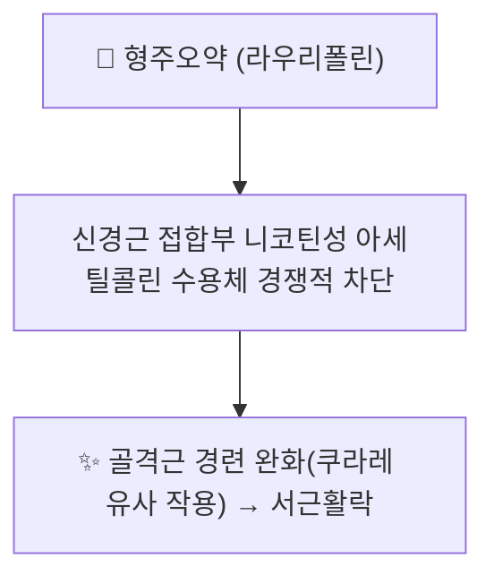

---
aliases:
  - Laurifoline
  - 라우리폴린
tags:
  - 약리
  - status/draft
  - 약리성분
  - 알칼로이드
title: 라우리폴린
date: 2026-09-22
출처: "https://molecule-viewer-rho.vercel.app/?cid=12305611\""
---

# 🔬 라우리폴린 (Laurifoline)

> **핵심 3줄 요약 (Key Summary)**:
> - 🌿 기원 본초 & 화학 계열: [[형주오약]](荊州烏藥, 녹나무과 *Lindera aggregata* 뿌리)에 함유된 아포르핀(aporphine)계 4차 암모늄 알칼로이드. [[코클라우린]]·[[마그노플로린]]과 함께 형주오약의 신경근·혈관 작용 관련 핵심 알칼로이드군을 구성.
> - 🎯 핵심 분자 표적: 신경근 접합부의 니코틴성 아세틸콜린 수용체를 경쟁적으로 차단하는 쿠라레(curare) 유사 작용이 제시됨.
> - 🩺 주요 약리 활성: 골격근 이완(신경근 차단), 항경련 작용이 형주오약의 거풍활락(祛風活絡)·서근활락(舒筋活絡) 효능의 현대적 근거 중 하나로 다뤄짐.
> - ⚠️ 근거 수준: 신경근 차단·α1 차단 기전과 형주오약(*Lindera aggregata*) 함유 여부는 이 노트에서 라우리폴린 단일 성분 문헌으로 확인하지 못했습니다. 확인된 기원 식물은 *Cocculus orbiculatus*(Chen 2026)이며, 대부분 조추출물 또는 관련 알칼로이드 유사체 연구에 기반합니다.

---

## 📌 목차
1. [기본 화학 정보 & 분자 구조식 (Chemical Identity)](#1-기본-화학-정보--분자-구조식-chemical-identity)
2. [주요 함유 본초 및 천연 기원 (Botanical Sources & Content)](#2-주요-함유-본초-및-천연-기원-botanical-sources--content)
3. [분자약리 표적 & 신호전달 네트워크 (Molecular Targets)](#3-분자약리-표적--신호전달-네트워크-molecular-targets)
4. [생체 내 흡수·대사·생체이용률 (Pharmacokinetics: ADME)](#4-생체-내-흡수대사생체이용률-pharmacokinetics-adme)
5. [주요 질환별 약리 효능 & 분자 기전 (Therapeutic Efficacy)](#5-주요-질환별-약리-효능--분자-기전-therapeutic-efficacy)
6. [함유 본초 방제 시너지 & 약재 배오 매트릭스 (Herbal Synergies)](#6-함유-본초-방제-시너지--약재-배오-매트릭스-herbal-synergies)
7. [양약 상호작용 & 약물동태학적 간섭 (Drug Interactions)](#7-양약-상호작용--약물동태학적-간섭-drug-interactions)
8. [💡 사용자 진료실 핵심 필기 & 임상 응용 팁 (Melt-In & High-Yield)](#8--사용자-진료실-핵심-필기--임상-응용-팁-melt-in--high-yield)
9. [출처 및 학술 참고 문헌 (References)](#9-출처-및-학술-참고-문헌-references)

---

## 1. 기본 화학 정보 & 분자 구조식 (Chemical Identity)

> [!abstract]+ 🧪 3D 약리 분자 구조 (Interactive 3D Viewer)
> <iframe src="https://molecule-viewer-rho.vercel.app/?cid=12305611" width="100%" height="450px" frameborder="0" allow="webgl" style="border-radius: 8px;"></iframe>

| 항목 | 상세 내용 |
| :--- | :--- |
| **CAS 번호** | 7224-61-5 |
| **PubChem CID** | [12305611](https://pubchem.ncbi.nlm.nih.gov/compound/12305611) — Laurifoline, C₂₀H₂₄NO₄⁺ / 약 342.4 g/mol (PubChem 확인, CAS 7224-61-5와 일치) |
| **화학 골격 분류** | 아포르핀(Aporphine)계 4차 암모늄 알칼로이드 |
| **근연 골격 참고** | 아포르핀(Aporphine) 모핵 — [PubChem CID 114911](https://pubchem.ncbi.nlm.nih.gov/compound/Aporphine) |

⚠️ 정정: 기존 노트는 "라우리폴린 단독의 PubChem 페이지가 확인되지 않는다"고 서술했으나, PubChem에서 이름·CAS 검색으로 CID 12305611이 확인되어 반영했습니다.

---

## 2. 주요 함유 본초 및 천연 기원 (Botanical Sources & Content)

| 함유 본초 | 기원 식물학적 명칭 | 주요 함유 부위 | 한의학적 귀경 및 약효 특성 |
| :--- | :--- | :--- | :--- |
| [[형주오약]] (荊州烏藥) | 녹나무과 / *Lindera aggregata* | 뿌리 | 폐·비·신·방광경 귀경, 행기지통(行氣止痛)·온신산한(溫腎散寒)·거풍활락(祛風活絡) |

⚠️ 내용 검토 필요: 원문은 라우리폴린을 형주오약 함유 성분으로 서술하나, 이 노트에서 확인된 라우리폴린의 천연 기원은 방기과(Menispermaceae) *Cocculus orbiculatus*이며, 마그노플로린·라우로테타닌·옵롱진 등과 함께 쥐 약동학 연구의 표지 성분으로 정량되었습니다(Chen 2026). 형주오약 화학성분 종설(Chen 2023, Tao 2024)에서 라우리폴린 함유를 직접 확인하지 못했습니다.

---

## 3. 분자약리 표적 & 신호전달 네트워크 (Molecular Targets)

* [[형주오약]] 노트에 기술된 바와 같이, 라우리폴린은 신경근 접합부의 니코틴성 아세틸콜린 수용체를 경쟁적으로 차단하여 골격근 경련을 완화하는 쿠라레 유사 작용에 관여하는 것으로 제시됩니다.
* [[마그노플로린]]과 함께 $\alpha_1$ 아드레날린 수용체 차단을 통한 말초 혈관 확장·혈압 강하 작용에도 관여하는 것으로 다뤄집니다.

⚠️ 내용 검토 필요: PubMed에서 "laurifoline" 검색 시 신경근 접합부 니코틴 수용체 차단이나 α1 차단을 보인 논문은 확인되지 않았습니다. 위 서술은 원문이며 확정 근거로 보지 않습니다.

### 참고: 형주오약에서 확인된 알칼로이드 연구 (노리소볼딘)
* 형주오약(Radix Linderae)의 항관절염 알칼로이드 **노리소볼딘(norisoboldine)**이 아릴탄화수소수용체(AhR) 의존적으로 파골세포 분화와 염증성 골 침식을 완화한다는 보고(Wei 2015), 아쥬반트 관절염 랫드 유래 섬유아세포양 활막세포에서 PKC/MAPK/NF-κB-p65/CREB 경로를 통해 IL-6 생성을 억제한다는 보고(Wei 2012)가 있습니다. 이는 형주오약의 다른 알칼로이드 연구이며 라우리폴린과 직접 연결되지는 않습니다.

---

## 4. 생체 내 흡수·대사·생체이용률 (Pharmacokinetics: ADME)

* 방기과 *Cocculus orbiculatus* 추출물을 랫드에 위관 투여한 뒤 마그노플로린, 옵롱진, 시링산과 함께 **라우리폴린**의 약동학과 조직분포(심장·간·비장·폐·신장·전립선·장·위)를 UHPLC-Q-trap-MS/MS로 평가한 연구가 있습니다(Chen 2026).
* ⚠️ 내용 검토 필요: 위 연구의 정량 수치(Tmax, 반감기 등)는 이 노트에서 확인하지 않았으며, 인체 약동학 자료도 없습니다.

---

## 5. 주요 질환별 약리 효능 & 분자 기전 (Therapeutic Efficacy)

라우리폴린은 [[형주오약]]의 거풍활락·서근활락 효능을 뒷받침하는 알칼로이드 성분 중 하나로, 풍한습(風寒濕)으로 인한 근육 경련·저림, 관절 동통에 활용되는 근거로 제시됩니다(원문).

⚠️ 내용 검토 필요: 라우리폴린 단일 성분의 골격근 이완·항경련·관절 동통 효능을 입증한 세포·동물·인체 연구는 이 노트에서 확인하지 못했습니다.

---

## 6. 함유 본초 방제 시너지 & 약재 배오 매트릭스 (Herbal Synergies)

| 본초 / 성분 | 볼트 내 노트 | 연계 |
| :--- | :--- | :--- |
| [[형주오약]] | 본초 노트 있음 | 거풍활락·서근활락 (원문) |
| [[코클라우린]] · [[마그노플로린]] | 약리성분 노트 있음 | 형주오약의 함께 언급되는 알칼로이드 (원문) |

⚠️ 내용 검토 필요: 볼트 내 처방 노트에서 [[형주오약]]을 구성약으로 하는 처방은 확인되지 않았고, 처방 내 라우리폴린의 정량적 기여도를 확인한 문헌도 없습니다.

---

## 7. 양약 상호작용 & 약물동태학적 간섭 (Drug Interactions)

⚠️ 내용 검토 필요: 라우리폴린과 양약 간 병용 상호작용을 직접 검증한 인체 연구는 확인되지 않았습니다. 원문의 신경근 차단 서술이 사실이라면 신경근 차단제·근이완제와의 병용은 이론적으로 유의할 수 있으나, 위 §3에서 밝힌 바와 같이 근거가 확인되지 않았습니다.

---

## 8. 💡 사용자 진료실 핵심 필기 & 임상 응용 팁 (Melt-In & High-Yield)

* 형주오약의 거풍활락·서근활락(풍한습으로 인한 근육 경련·저림, 관절 동통)을 설명할 때 알칼로이드 성분 군으로 언급하되, 라우리폴린 단독의 신경근 차단은 확인되지 않았음을 구분.
* 라우리폴린의 천연 기원 표기(형주오약 vs *Cocculus*)는 추가 성분 문헌 확인이 필요.

---

## 9. 출처 및 학술 참고 문헌 (References)

1. **Tao Y, Deng Y, Wang P, et al. (2024)**. *Traditional uses, phytochemistry, pharmacology, processing methods and quality control of Lindera aggregata (Sims) Kosterm: A critical review*. **J Ethnopharmacol**, 318(Pt A):116954. PMID: [37499843](https://pubmed.ncbi.nlm.nih.gov/37499843/) · DOI: [10.1016/j.jep.2023.116954](https://doi.org/10.1016/j.jep.2023.116954)
   - **[연구 요약]**: 형주오약(Lindera aggregata)의 전통 활용·화학성분·약리 활성·법제·품질관리를 종합한 비판적 리뷰.
2. **Chen FY, Liu Y, Xie D, et al. (2023)**. *[Chemical constituents of Lindera aggregata and their bioactivities: a review]*. **Zhongguo Zhong Yao Za Zhi**, 48(21):5719-5726. PMID: [38114168](https://pubmed.ncbi.nlm.nih.gov/38114168/)
   - **[연구 요약]**: 형주오약의 화학성분 및 생물활성을 정리한 리뷰.
3. **Huang et al. (2023)**. *Lindera aggregata (Sims) Kosterm: a systematic review of its traditional applications, phytochemical and pharmacological properties, and quality control*. **Medicinal Plant Biology**, 2023. DOI: [10.48130/MPB-2023-0011](https://doi.org/10.48130/MPB-2023-0011) · [https://www.maxapress.com/article/doi/10.48130/MPB-2023-0011](https://www.maxapress.com/article/doi/10.48130/MPB-2023-0011)
   - **[참고]**: 형주오약의 전통 응용·화학·약리·품질관리 체계적 리뷰.
4. **Chen X, Peng J, Wu D, et al. (2026)**. *Pharmacokinetics and Tissue Distribution of Four Characteristic Constituents from Cocculus orbiculatus in Rats Using UHPLC-Q-trap-MS/MS*. **J AOAC Int**, 2026 Aug 17. PMID: [42606568](https://pubmed.ncbi.nlm.nih.gov/42606568/) · DOI: [10.1093/jaoacint/qsag078](https://doi.org/10.1093/jaoacint/qsag078)
   - **[연구 요약]**: *Cocculus orbiculatus* 추출물 투여 후 마그노플로린·옵롱진·시링산·라우리폴린의 랫드 약동학과 조직분포를 평가.
5. **Wei ZF, Lv Q, Xia Y, et al. (2015)**. *Norisoboldine, an Anti-Arthritis Alkaloid Isolated from Radix Linderae, Attenuates Osteoclast Differentiation and Inflammatory Bone Erosion in an Aryl Hydrocarbon Receptor-Dependent Manner*. **Int J Biol Sci**, 11(9):1113-1126. PMID: [26221077](https://pubmed.ncbi.nlm.nih.gov/26221077/)
   - **[연구 요약]**: 형주오약 알칼로이드 노리소볼딘이 AhR 의존적으로 파골세포 분화와 골 침식을 완화함을 보고.
6. **Wei Z, Wang F, Song J, et al. (2012)**. *Norisoboldine inhibits the production of interleukin-6 in fibroblast-like synoviocytes from adjuvant arthritis rats through PKC/MAPK/NF-κB-p65/CREB pathways*. **J Cell Biochem**, 113(8):2785-2795. PMID: [22473817](https://pubmed.ncbi.nlm.nih.gov/22473817/)
   - **[연구 요약]**: 노리소볼딘이 관절염 랫드 유래 활막세포에서 IL-6 생성을 억제함을 보고.
7. PubChem Compound Summary — Laurifoline (CID 12305611): [https://pubchem.ncbi.nlm.nih.gov/compound/12305611](https://pubchem.ncbi.nlm.nih.gov/compound/12305611)

<!-- 보관 태그(1회용·링크오류, 필요시 복원): 형주오약 -->
