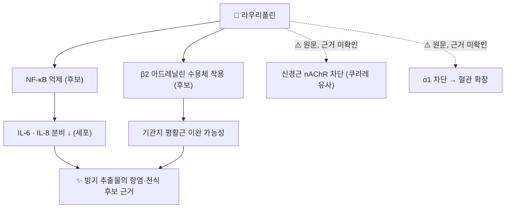

# 🔬 라우리폴린 (Laurifoline, C₂₀H₂₄NO₄⁺)

> **핵심 3줄 요약 (Key Summary)**:
> - 🌿 기원 본초 & 화학 계열: 방기과 식물 — [[방기]](청풍등, *Sinomenium acutum* 줄기)(PMID 22721764)와 *Cocculus orbiculatus*(PMID 42606568) — 에서 확인된 **4급 암모늄 아포르핀 [[알칼로이드]]**. 함께 들어 있는 [[마그노플로린]]과 분자식이 같은 위치 이성질체다. 원문의 [[형주오약]] 함유는 문헌으로 확인되지 않았다.
> - 🎯 핵심 분자 표적: 방기 성분 스크리닝에서 [[시노메닌]]·마그노플로린과 함께 **[[NF-κB]] 억제**와 **β2 아드레날린 수용체 작용** 후보로 동정되었다(루시페라아제 리포터·도킹, PMID 27187693). 원문의 '쿠라레 유사 신경근 차단'과 'α1 차단'은 근거를 찾지 못했다.
> - 🩺 주요 약리 활성: 항염증(IL-6·IL-8 억제)과 β2 작용에 따른 기관지 확장 가능성 — 방기 추출물의 [[천식]] 치료 후보 연구와 연결된다(세포 수준).
> - ⚠️ 근거 한계: 라우리폴린 단독의 동물·사람 효능 연구는 없고, 모든 근거가 세포 스크리닝·약동학 분석 수준이다.

---

## 📌 목차
1. [기본 화학 정보 & 분자 구조식 (Chemical Identity)](#1-기본-화학-정보--분자-구조식-chemical-identity)
2. [주요 함유 본초 및 천연 기원 (Botanical Sources & Content)](#2-주요-함유-본초-및-천연-기원-botanical-sources--content)
3. [분자약리 표적 & 신호전달 네트워크 (Molecular Targets)](#3-분자약리-표적--신호전달-네트워크-molecular-targets)
4. [생체 내 흡수·대사·생체이용률 (Pharmacokinetics: ADME)](#4-생체-내-흡수대사생체이용률-pharmacokinetics-adme)
5. [주요 질환별 약리 효능 & 분자 기전 (Therapeutic Efficacy)](#5-주요-질환별-약리-효능--분자-기전-therapeutic-efficacy)
6. [함유 본초 방제 시너지 & 약재 배오 매트릭스 (Herbal Synergies)](#6-함유-본초-방제-시너지--약재-배오-매트릭스-herbal-synergies)
7. [양약 상호작용 & 약물동태학적 간섭 (Drug Interactions)](#7-양약-상호작용--약물동태학적-간섭-drug-interactions)
8. [💡 사용자 진료실 핵심 필기 & 임상 응용 팁 (Melt-In & High-Yield)](#8--사용자-진료실-핵심-필기--임상-응용-팁-melt-in--high-yield)
9. [출처 및 학술 참고 문헌 (References)](#9-출처-및-학술-참고-문헌-references)

---

## 1. 기본 화학 정보 & 분자 구조식 (Chemical Identity)

### 1.1 화학적 특성
라우리폴린은 아포르핀 골격의 질소에 메틸기 2개가 붙은 **4급 암모늄 양이온**입니다. 치환기 배치(2,10-디메톡시-1,9-디올)만 다르고 분자식이 같은 [[마그노플로린]](2,10-디메톡시-1,11-디올)의 **위치 이성질체**로, 두 성분이 방기·*Cocculus*에서 함께 검출됩니다. 4급 암모늄이라는 점은 [[d-투보쿠라린]]과 같아 원문의 '쿠라레 유사' 연상이 생긴 것으로 보이나, 신경근 차단은 확인되지 않았습니다(§3). 같은 아포르핀 계열이지만 3급 아민·지용성인 [[누시페린]]과는 체내 거동이 다를 것으로 예상됩니다(추론).

| 항목 (Property) | 세부 정보 (Specification) |
| :--- | :--- |
| **IUPAC 명칭** | (6aS)-2,10-dimethoxy-6,6-dimethyl-5,6,6a,7-tetrahydro-4H-dibenzo[de,g]quinolin-6-ium-1,9-diol (PubChem) |
| **분자식 / 분자량** | C₂₀H₂₄NO₄⁺ / 342.4 g/mol (양이온). 1968년 분리 보고는 염화물 형태(laurifoline chloride)(PMID 5641685) |
| **PubChem CID** | [12305611](https://pubchem.ncbi.nlm.nih.gov/compound/12305611) · 비교: 마그노플로린 [73337](https://pubchem.ncbi.nlm.nih.gov/compound/73337) (같은 분자식) |
| **CAS 등록번호** | 7224-61-5 (PubChem 동의어 기준, CAS 원본 대조는 못 함) |
| **화학 골격 분류** | 4급 암모늄 아포르핀 알칼로이드 |
| **물리화학 지표** | XLogP 2.7 · TPSA 58.9 Ų (PubChem 계산값). 영구 양전하라 계산 지용성보다 실제 막 투과는 낮을 수 있음(추론) |

### 1.2 2D 분자 구조식
![[라우리폴린_1_화학구조식.png|320]]
> [그림 1: ① 2D 화학 구조식 — 라우리폴린(PubChem CID 12305611). N,N-디메틸 4급 암모늄, 1,9-디히드록시·2,10-디메톡시 아포르핀. 출처: [PubChem](https://pubchem.ncbi.nlm.nih.gov/compound/12305611)]

![[라우리폴린_1_마그노플로린_비교구조.png|320]]
> [그림 2: ① 구조 비교 — 마그노플로린(PubChem CID 73337). 분자식이 같고 D고리 수산기 위치(1,11-디올)만 다른 위치 이성질체. 방기·*Cocculus*에서 라우리폴린과 함께 검출된다. 출처: [PubChem](https://pubchem.ncbi.nlm.nih.gov/compound/73337)]

### 1.3 3D 약리 분자 구조 (Interactive Viewer)
> [!abstract]+ 🧪 3D 약리 분자 구조 (Interactive 3D Viewer)
> <iframe src="https://molecule-viewer-rho.vercel.app/?cid=12305611" width="100%" height="450px" frameborder="0" allow="webgl" style="border-radius: 8px;"></iframe>

---

## 2. 주요 함유 본초 및 천연 기원 (Botanical Sources & Content)

![[라우리폴린_2_기원식물_방기.jpg|400]]
> [그림 3: ② 기원 식물 실사 — 방기(청풍등, *Sinomenium acutum*)의 잎과 덩굴. 약용 부위는 줄기이며, 줄기의 모든 조직에서 라우리폴린이 검출되었다(PMID 22721764). 출처: りなべる, [Wikimedia Commons](https://commons.wikimedia.org/wiki/File:Sinomenium_acutum_239839604.jpg) (CC BY 4.0)]

![[라우리폴린_2_기원식물_Cocculus.jpg|380]]
> [그림 4: ② 기원 식물 실사 — *Cocculus orbiculatus*(방기과, 목방기류) 덩굴. 뿌리 추출물의 약동학 표지 성분으로 라우리폴린이 정량되었다(PMID 42606568). 출처: H. Zell, [Wikimedia Commons](https://commons.wikimedia.org/wiki/File:Cocculus_orbiculatus_001.JPG) (CC BY-SA 3.0)]

| 기원 본초 | 기원 식물 (과명 / 학명) | 약용 부위 | 한의학적 효능 | 라우리폴린 근거 |
| :--- | :--- | :--- | :--- | :--- |
| [[방기]] (청풍등, 靑風藤) | 방기과 / *Sinomenium acutum* | 줄기 | 거풍습·통경락 — 풍습비통 | 레이저 미세절제 LC-MS에서 표피·피층·석세포·내초·관다발·수 **모든 조직에서 검출**(주성분은 시노메닌·마그노플로린)(Yi 2012, PMID 22721764) · 활성 성분 스크리닝(PMID 27187693) |
| (목방기류) *Cocculus orbiculatus* | 방기과 / *Cocculus orbiculatus* (L.) DC. | 뿌리 | 항염·진통·이뇨로 쓰임(PMID 38752456) | 약동학 표지 성분 4종 중 하나(PMID 42606568) |
| (참고) *Zanthoxylum elephantiasis* | 운향과 | 수피 | — | 1968년 염화물로 분리(PMID 5641685) |
| [[형주오약]] (원문) | 녹나무과 / *Lindera aggregata* | 뿌리 | 행기지통·온신산한 | ⚠️ 형주오약 성분 종설 2편(PMID 37499843·38114168)에서 함유를 확인하지 못함 |

* 원문은 라우리폴린을 형주오약의 성분으로 적었으나 문헌상 확인된 기원은 **방기과(청풍등·*Cocculus*)**입니다. 같은 아포르핀 계열의 형주오약 알칼로이드로는 노리소볼딘 연구가 있습니다(§5).

---

## 3. 분자약리 표적 & 신호전달 네트워크 (Molecular Targets)

```mermaid
graph TD
    L["🔬 라우리폴린"] --> NFkB["NF-κB 억제 (후보)"]
    NFkB --> Cyt["IL-6 · IL-8 분비 ↓ (세포)"]
    L --> B2["β2 아드레날린 수용체 작용 (후보)"]
    B2 --> Br["기관지 평활근 이완 가능성"]
    L -.->|"⚠️ 원문, 근거 미확인"| NMJ["신경근 nAChR 차단 (쿠라레 유사)"]
    L -.->|"⚠️ 원문, 근거 미확인"| A1["α1 차단 → 혈관 확장"]
    Cyt --> O["✨ 방기 추출물의 항염·천식 후보 근거"]
    Br --> O
```

### 3.1 NF-κB 억제 + β2 작용 (확인된 근거)
* 방기(Caulis Sinomenii) 추출물을 UPLC-Q/TOF-MS와 이중 표적 스크리닝으로 분석해 NF-κB 억제 후보 7종을 찾았고, 그중 라우리폴린이 포함되었습니다. [[IL-6]]·IL-8 분석으로 항염 효과가 확인되었고, β2 수용체 루시페라아제 리포터에서는 [[시노메닌]]·[[마그노플로린]]·라우리폴린 3종이 **β2 작용제 후보**로 확인되었습니다. 도킹·분자동역학은 이 성분들이 Braf를 통한 MAPK 경로를 억제하면서 β2 수용체를 활성화할 수 있다고 제시했습니다(Sun 2016, PMID 27187693).
* β2 작용 성분이라는 점에서 [[히게나민]]과 비교할 수 있으나, 라우리폴린의 효능(EC50)·선택성은 보고되지 않았습니다 ⚠️.

### 3.2 원문 서술 — 근거 미확인
* "[[형주오약]] 노트에 기술된 바와 같이 라우리폴린은 신경근 접합부 니코틴성 ACh 수용체를 경쟁적으로 차단해 골격근 경련을 완화하는 쿠라레 유사 작용에 관여" — ⚠️ PubMed 'laurifoline' 검색에서 신경근 차단을 보인 연구가 없습니다.
* "[[마그노플로린]]과 함께 α1 아드레날린 수용체 차단을 통한 혈관 확장·혈압 강하" — ⚠️ 확인되지 않았습니다. 확인된 수용체 작용은 오히려 **β2 작용**(§3.1)입니다.

---

## 4. 생체 내 흡수·대사·생체이용률 (Pharmacokinetics: ADME)

* ***Cocculus orbiculatus* 추출물 위관 투여(랫드)**: 마그노플로린·옵롱진·시링산은 빨리 소실된 반면 **라우리폴린은 천천히 소실**되었습니다. 라우리폴린은 심장·간·비장·폐·신장·전립선·장·위 모든 조직에서 검출되었고 **장과 위에서 가장 높았습니다**(Chen 2026, PMID 42606568).
* 4급 암모늄 양이온이라는 구조로 볼 때 장관 흡수가 제한되어 위장관 조직에 머무는 경향과 부합합니다(추론).
* ⚠️ 반감기·생체이용률 수치는 초록에 없어 확인하지 못했고, 사람 약동학·대사 효소 자료도 없습니다.

---

## 5. 주요 질환별 약리 효능 & 분자 기전 (Therapeutic Efficacy)

| 영역 | 근거 | 근거 수준 |
| :--- | :--- | :--- |
| 염증 (IL-6·IL-8) | NF-κB 억제 후보 (PMID 27187693) | 세포 |
| [[천식]] (기관지 수축) | β2 작용 후보 — 저자들은 방기 추출물을 천식 약물 후보로 제시 (PMID 27187693) | 세포 |
| 풍습비통·[[관절염]]·근육 경련 (원문) | 방기의 거풍습 효능 성분 중 하나로 원문 서술. 신경근 차단은 미확인 | — |

* **참고 — 형주오약의 다른 알칼로이드**: 형주오약(Radix Linderae)의 노리소볼딘은 AhR 의존적으로 파골세포 분화와 염증성 골 침식을 완화했고(Wei 2015, PMID 26221077), 보조제 관절염 랫드([[류마티스 관절염]] 동물 모델) 활막세포에서 PKC/MAPK/NF-κB-p65/CREB 경로로 IL-6 생성을 억제했습니다(Wei 2012, PMID 22473817). 라우리폴린과 직접 연결되는 근거는 아닙니다.
* ⚠️ 라우리폴린 단독의 동물·사람 효능 연구는 확인되지 않았습니다.

---

## 6. 함유 본초 방제 시너지 & 약재 배오 매트릭스 (Herbal Synergies)

| 본초 / 성분 | 공존 성분 | 연계 | 전통 효능 |
| :--- | :--- | :--- | :--- |
| [[방기]] (청풍등) | [[시노메닌]](주성분), [[마그노플로린]], 메니스페린 등 | 세 성분 모두 NF-κB 억제 + β2 작용 후보(PMID 27187693) — **여러 성분이 같은 두 표적을 겹쳐 치는 구조** | 거풍습·통경락 |
| [[형주오약]] (원문) | [[코클라우린]], 노리소볼딘 등 | ⚠️ 라우리폴린 함유 미확인 | 행기지통·온신산한 |

* 방기의 항염·진통 효능은 주로 [[시노메닌]]으로 설명되며, 라우리폴린은 함량이 적은 보조 성분입니다(시노메닌·마그노플로린이 가장 풍부, PMID 22721764).
* ⚠️ 처방 전탕액에서 라우리폴린의 기여를 정량한 연구는 없습니다. 볼트 처방 노트에서 형주오약을 구성약으로 하는 처방도 확인되지 않았습니다(원문 기록).

---

## 7. 양약 상호작용 & 약물동태학적 간섭 (Drug Interactions)

* **β 차단제·β 작용제 — 이론적 상호작용**: β2 작용 후보이므로(PMID 27187693) β 차단제와는 길항, β2 흡입제([[알부테롤]] 등)와는 상가 가능성을 이론적으로 생각할 수 있습니다. 효능 수치가 없어 임상적 의미는 불명입니다.
* **근이완제 — 원문 우려, 근거 없음**: 원문의 신경근 차단 서술이 사실이라면 근이완제와 상가 우려가 있으나, 신경근 차단 자체가 확인되지 않았습니다.
* ⚠️ CYP·수송체 상호작용 연구는 확인되지 않았습니다.

---

## 8. 💡 사용자 진료실 핵심 필기 & 임상 응용 팁 (Melt-In & High-Yield)

* **(원문 필기)** 형주오약의 거풍활락·서근활락(풍한습으로 인한 근육 경련·저림, 관절 동통)을 설명할 때 알칼로이드 성분 군으로 언급하되, 라우리폴린 단독의 신경근 차단은 확인되지 않았음을 구분.
  * → **2026-09-26 보강**: 라우리폴린이 확인된 약재는 형주오약이 아니라 **방기(청풍등)**입니다. 방기의 거풍습 효능 설명에서 시노메닌의 보조 성분으로 언급하는 편이 정확합니다.
* **(원문 필기)** 라우리폴린의 천연 기원 표기(형주오약 vs *Cocculus*)는 추가 성분 문헌 확인이 필요.
  * → **보강**: 방기(*Sinomenium*)·*Cocculus orbiculatus*·*Zanthoxylum*에서 확인(§2).
* **마그노플로린과 쌍으로 기억**: 분자식이 같은 위치 이성질체이고 늘 함께 나옵니다.

---

## 9. 출처 및 학술 참고 문헌 (References)

1. **Sun D, Han Y, Wang W, et al. (2016)**. *Screening and identification of Caulis Sinomenii bioactive ingredients with dual-target NF-κB inhibition and β2-AR agonizing activities*. **Biomed Chromatogr**, 30(11):1843-1853. [PMID 27187693](https://pubmed.ncbi.nlm.nih.gov/27187693/) · [DOI](https://doi.org/10.1002/bmc.3761)
   - **[연구 요약]**: 방기 성분 중 라우리폴린이 NF-κB 억제·β2 작용 이중 활성 후보로 동정.
2. **Yi L, Liang ZT, Peng Y, et al. (2012)**. *Tissue-specific metabolite profiling of alkaloids in Sinomenii Caulis using laser microdissection and liquid chromatography-quadrupole/time of flight-mass spectrometry*. **J Chromatogr A**, 1248:93-103. [PMID 22721764](https://pubmed.ncbi.nlm.nih.gov/22721764/) · [DOI](https://doi.org/10.1016/j.chroma.2012.05.058)
   - **[연구 요약]**: 방기 줄기 모든 조직에서 라우리폴린 검출, 주성분은 시노메닌·마그노플로린.
3. **Chen X, Peng J, Wu D, et al. (2026)**. *Pharmacokinetics and Tissue Distribution of Four Characteristic Constituents from Cocculus orbiculatus in Rats Using UHPLC-Q-trap-MS/MS*. **J AOAC Int**, qsag078. [PMID 42606568](https://pubmed.ncbi.nlm.nih.gov/42606568/) · [DOI](https://doi.org/10.1093/jaoacint/qsag078)
   - **[연구 요약]**: 라우리폴린은 느리게 소실, 장·위 조직에 가장 높게 분포.
4. **Wang XR, Wei MC, Qin L, et al. (2024)**. *Chemical characterization and comparative analysis of different parts of Cocculus orbiculatus through UHPLC-Q-TOF-MS*. **Anal Methods**, 16(21):3392-3412. [PMID 38752456](https://pubmed.ncbi.nlm.nih.gov/38752456/)
   - **[연구 요약]**: *C. orbiculatus* 부위별 113종 성분 동정, 뿌리의 항염·진통·이뇨 용도.
5. **Tomko J, Awad AT, Beal JL, Doskotch RW. (1968)**. *Isolation of candicine chloride, laurifoline chloride, and xanthoxyletin from the bark of Zanthoxylum elephantiasis*. **J Pharm Sci**, 57(2):329-330. [PMID 5641685](https://pubmed.ncbi.nlm.nih.gov/5641685/)
   - **[연구 요약]**: 운향과 수피에서 라우리폴린 염화물 분리.
6. **Tao Y, Deng Y, Wang P, et al. (2024)**. *Traditional uses, phytochemistry, pharmacology, processing methods and quality control of Lindera aggregata (Sims) Kosterm: A critical review*. **J Ethnopharmacol**, 318(Pt A):116954. [PMID 37499843](https://pubmed.ncbi.nlm.nih.gov/37499843/) · [DOI](https://doi.org/10.1016/j.jep.2023.116954)
   - **[연구 요약]**: 형주오약 종설 — 라우리폴린 함유는 초록에서 확인 못 함.
7. **Chen FY, Liu Y, Xie D, et al. (2023)**. *[Chemical constituents of Lindera aggregata and their bioactivities: a review]*. **Zhongguo Zhong Yao Za Zhi**, 48(21):5719-5726. [PMID 38114168](https://pubmed.ncbi.nlm.nih.gov/38114168/)
   - **[연구 요약]**: 형주오약 화학성분 종설.
8. **Huang et al. (2023)**. *Lindera aggregata (Sims) Kosterm: a systematic review of its traditional applications, phytochemical and pharmacological properties, and quality control*. **Medicinal Plant Biology**. [DOI 10.48130/MPB-2023-0011](https://doi.org/10.48130/MPB-2023-0011) (PubMed 미수재)
9. **Wei ZF, Lv Q, Xia Y, et al. (2015)**. *Norisoboldine, an Anti-Arthritis Alkaloid Isolated from Radix Linderae, Attenuates Osteoclast Differentiation and Inflammatory Bone Erosion in an Aryl Hydrocarbon Receptor-Dependent Manner*. **Int J Biol Sci**, 11(9):1113-1126. [PMID 26221077](https://pubmed.ncbi.nlm.nih.gov/26221077/)
   - **[연구 요약]**: 형주오약 노리소볼딘의 AhR 의존 골 침식 완화.
10. **Wei Z, Wang F, Song J, et al. (2012)**. *Norisoboldine inhibits the production of interleukin-6 in fibroblast-like synoviocytes from adjuvant arthritis rats through PKC/MAPK/NF-κB-p65/CREB pathways*. **J Cell Biochem**, 113(8):2785-2795. [PMID 22473817](https://pubmed.ncbi.nlm.nih.gov/22473817/)
    - **[연구 요약]**: 노리소볼딘의 활막세포 IL-6 억제.
11. PubChem Compound Summary — Laurifoline (CID 12305611): [https://pubchem.ncbi.nlm.nih.gov/compound/12305611](https://pubchem.ncbi.nlm.nih.gov/compound/12305611)

**이미지 출처·라이선스**
- 그림 1: PubChem 2D 구조식 (CID 12305611) — 공공 데이터
- 그림 2: PubChem 2D 구조식 (CID 73337, 마그노플로린) — 공공 데이터
- 그림 3: りなべる, *Sinomenium acutum* — [Commons](https://commons.wikimedia.org/wiki/File:Sinomenium_acutum_239839604.jpg), CC BY 4.0
- 그림 4: H. Zell, *Cocculus orbiculatus* — [Commons](https://commons.wikimedia.org/wiki/File:Cocculus_orbiculatus_001.JPG), CC BY-SA 3.0

<!-- 보관 태그(1회용·링크오류, 필요시 복원): 형주오약 -->
