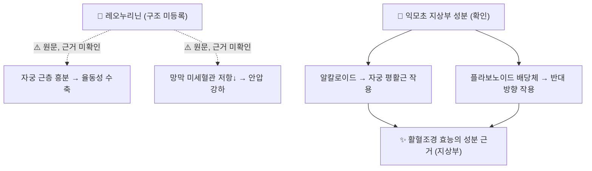

# 🔬 레오누리닌 (Leonurinine)

> **핵심 3줄 요약 (Key Summary)**:
> - 🌿 기원 본초 & 화학 계열: 익모초속(*Leonurus*) 식물의 알칼로이드로 [[레오누린]]·[[스타키드린]]과 **별개 성분으로 나열**되는 물질이다(PMID 32523334 본문: "Leonurine, Stachydrine, Leonurinine and Leonurdine"). 볼트의 [[충위자]] 노트는 충위자의 구아니딘 알칼로이드로 서술한다.
> - 🎯 핵심 분자 표적: **구조가 공개 DB에 등록되어 있지 않다** — PubChem 이름 검색 0건, PubMed 제목·초록 0건. 원문의 '자궁 근층 흥분'·'망막 혈류 개선으로 안압 강하'는 레오누리닌 단독 근거를 찾지 못했다.
> - 🩺 주요 약리 활성(원문): 충위자의 활혈조경(자궁 수축)·청간명목(눈) 효능과 연결. 확인된 근거는 익모초 지상부 알칼로이드·플라보노이드의 자궁 평활근 작용(PMID 29127939) 수준이다.
> - ⚠️ 주의: ① 레오누린은 **충위자(씨)에서 검출되지 않았다**(HPLC, PMID 23346757) — 씨의 알칼로이드 구성은 재확인이 필요하다. ② 이름이 비슷한 **시클로레오누리닌(cycloleonurinin)**은 충위자의 12아미노산 고리 펩타이드로 전혀 다른 물질이다(PMID 2070452). ③ 자궁 수축 작용 약재이므로 [[유산]] 위험 — 임신 중 금기(원문).

---

## 📌 목차
1. [기본 화학 정보 & 분자 구조식 (Chemical Identity)](#1-기본-화학-정보--분자-구조식-chemical-identity)
2. [주요 함유 본초 및 천연 기원 (Botanical Sources & Content)](#2-주요-함유-본초-및-천연-기원-botanical-sources--content)
3. [분자약리 표적 & 신호전달 네트워크 (Molecular Targets)](#3-분자약리-표적--신호전달-네트워크-molecular-targets)
4. [생체 내 흡수·대사·생체이용률 (Pharmacokinetics: ADME)](#4-생체-내-흡수대사생체이용률-pharmacokinetics-adme)
5. [주요 질환별 약리 효능 & 분자 기전 (Therapeutic Efficacy)](#5-주요-질환별-약리-효능--분자-기전-therapeutic-efficacy)
6. [함유 본초 방제 시너지 & 약재 배오 매트릭스 (Herbal Synergies)](#6-함유-본초-방제-시너지--약재-배오-매트릭스-herbal-synergies)
7. [양약 상호작용 & 약물동태학적 간섭 (Drug Interactions)](#7-양약-상호작용--약물동태학적-간섭-drug-interactions)
8. [💡 사용자 진료실 핵심 필기 & 임상 응용 팁 (Melt-In & High-Yield)](#8--사용자-진료실-핵심-필기--임상-응용-팁-melt-in--high-yield)
9. [출처 및 학술 참고 문헌 (References)](#9-출처-및-학술-참고-문헌-references)

---

## 1. 기본 화학 정보 & 분자 구조식 (Chemical Identity)

### 1.1 화학적 특성 — 등록 정보 없음
* 2026-09-26 확인: PubChem에서 'leonurinine'으로 등록된 화합물이 없고(CID 없음), PubMed 제목·초록에도 나오지 않습니다. Europe PMC 전문 검색에서는 레오누린 논문 1편의 서론(익모초 알칼로이드 나열)과 특허 2건에만 이름이 나옵니다.
* 따라서 분자식·분자량·구조는 확인할 수 없습니다. 원문은 [[레오누린]]과 가까운 **구아니딘 유도체**로 분류했으나 이 역시 1차 구조 문헌을 확인하지 못했습니다 ⚠️.
* **중복 여부 판단**: 문헌에서 레오누린과 나란히 **다른 성분으로 나열**되므로 [[레오누린]]과 같은 물질로 보아 통합하지 않았습니다.
* **3D 뷰어 제거**: 기존 노트에는 레오누린(CID 161464)의 3D 뷰어가 레오누리닌 자리에 들어 있어 다른 물질의 구조를 보여 주고 있었으므로 뺐습니다.

| 항목 (Property) | 세부 정보 (Specification) |
| :--- | :--- |
| **IUPAC / 분자식 / 분자량** | 확인 불가 (PubChem 미등록) |
| **화학 골격 분류** | 구아니딘 유도체 알칼로이드 (원문, ⚠️ 미확인) |
| **근연 화합물 (비교용)** | [[레오누린]] — [PubChem CID 161464](https://pubchem.ncbi.nlm.nih.gov/compound/161464), C₁₄H₂₁N₃O₅ / 311.33 g/mol |
| **혼동 주의** | 시클로레오누리닌(cycloleonurinin) = 충위자의 12아미노산 고리 펩타이드(PMID 2070452), 레오누리닌과 무관 |

### 1.2 근연 화합물 구조 (비교용)
![[레오누리닌_1_레오누린_비교구조.png|320]]
> [그림 1: ① 비교 구조 — **레오누린**(PubChem CID 161464). 레오누리닌이 아니라 익모초속의 대표 구아니딘 알칼로이드로, 원문이 레오누리닌과 근연 구조라고 한 물질이다. 레오누리닌 자체의 구조는 등록되어 있지 않다. 출처: [PubChem](https://pubchem.ncbi.nlm.nih.gov/compound/161464)]

---

## 2. 주요 함유 본초 및 천연 기원 (Botanical Sources & Content)

![[레오누리닌_2_기원식물_익모초.jpg|380]]
> [그림 2: ② 기원 식물 실사 — 익모초(*Leonurus japonicus* Houtt.) 전초. 지상부는 익모초, 익은 씨는 충위자로 쓴다. 출처: Alex Abair, [Wikimedia Commons](https://commons.wikimedia.org/wiki/File:Leonurus_japonicus_habit.jpg) (CC BY 4.0)]

![[레오누리닌_2_익모초_꽃받침.jpg|380]]
> [그림 3: ② 약용 부위 관련 실사 — 익모초의 가시 모양 꽃받침과 꽃부리. 충위자(작은 견과)는 이 꽃받침 안에서 익는다. 출처: Alex Abair, [Wikimedia Commons](https://commons.wikimedia.org/wiki/File:Leonurus_japonicus_calyx_and_corolla.jpg) (CC BY 4.0)]

![[레오누리닌_2_익모초_식물도해.jpg|300]]
> [그림 4: ② 식물 도해 — *Leonurus japonicus*의 깊게 갈라진 잎과 층층이 달리는 윤산꽃차례. 출처: F. M. Blanco, *Flora de Filipinas*, [Wikimedia Commons](https://commons.wikimedia.org/wiki/File:Leonurus_japonicus_Blanco2.259-cropped.jpg) (Public domain)]

| 함유 본초 | 기원 식물 (과명 / 학명) | 약용 부위 | 한의학적 효능 | 레오누리닌·알칼로이드 근거 |
| :--- | :--- | :--- | :--- | :--- |
| [[충위자]] (茺蔚子) | 꿀풀과 / *Leonurus japonicus* | 익은 씨 | 심포·간경 / 활혈조경·청간명목 | 원문·볼트 [[충위자]] 노트 기재. ⚠️ HPLC에서 씨 시료 2건 모두 **레오누린 불검출**(PMID 23346757). 충위자와 익모초의 알칼로이드를 TLC로 비교한 연구가 있다(PMID 32559000) |
| [[익모초]] (益母草) | 같은 식물 | 지상부 | 활혈조경·이수소종 | 익모초 알칼로이드 나열에 레오누리닌 포함(PMID 32523334, *L. heterophyllus*). 레오누린은 지상부에만 확인(0.001~0.049%, 국내 재배 0.1% 이상)(PMID 23346757) |

* 익모초속의 화학·약리 전반은 종설 2편에 정리되어 있습니다(PMID 29335190·24412548). ⚠️ 두 종설의 초록에서 레오누리닌은 확인하지 못했습니다.

---

## 3. 분자약리 표적 & 신호전달 네트워크 (Molecular Targets)

* **원문 서술**: "자궁 근층 수용체를 흥분시켜 율동적 수축을 유도하고([[레오누린]]과 유사한 구아니딘 골격), 망막 미세혈관 저항을 낮춰 안압을 강하시킨다." — ⚠️ 두 서술 모두 레오누리닌 단독 문헌을 찾지 못했고, 충위자의 안압 강하 논문도 PubMed에서 확인되지 않았습니다.
* **확인된 관련 근거**: 익모초 지상부의 알칼로이드와 플라보노이드 배당체가 자궁 평활근에 **서로 반대 방향**의 효과를 보였습니다(Liu 2018, PMID 29127939). 즉 약재 전체의 자궁 작용은 성분 간 균형의 결과이며, 한 알칼로이드로 설명하기 어렵습니다.
* 레오누린 자체의 약리(심혈관·자궁 수축·신경보호)는 [[레오누린]] 노트를 봅니다(PMID 23346757 서론).

---

## 4. 생체 내 흡수·대사·생체이용률 (Pharmacokinetics: ADME)

⚠️ 내용 검토 필요: 레오누리닌은 구조조차 등록되지 않아 약동학 문헌이 없습니다. 근연 성분 레오누린의 약동학은 [[레오누린]] 노트를 참고합니다.

---

## 5. 주요 질환별 약리 효능 & 분자 기전 (Therapeutic Efficacy)

레오누리닌은 [[충위자]]의 활혈조경·청간명목 효능을 뒷받침하는 알칼로이드로, 월경부조·산후 어혈과 간양상항(肝陽上亢)으로 인한 [[두통]]·목적종통(目赤腫痛)에 활용되는 근거로 제시됩니다(원문).

| 전통 적응 (충위자) | 관련 질환 노트 | 레오누리닌 근거 |
| :--- | :--- | :--- |
| 월경부조·[[무월경]]·[[월경곤란증]] | 활혈조경 | ⚠️ 없음 (익모초 지상부 성분 연구만 있음, PMID 29127939) |
| 산후 어혈·오로 부진 | [[산후풍]] 관련 | ⚠️ 없음 |
| 목적종통·안구 충혈 | [[결막염]] | ⚠️ 없음 |
| 간양상항 두통·[[고혈압]] 경향 | 청간 | ⚠️ 없음 |
| 안압 상승 (원문) | [[녹내장]] | ⚠️ 충위자 안압 강하 논문 PubMed 미확인 |

⚠️ 위 효능은 모두 원문·전통 서술이며 레오누리닌 단일 성분의 세포·동물·사람 연구는 없습니다.

---

## 6. 함유 본초 방제 시너지 & 약재 배오 매트릭스 (Herbal Synergies)

볼트 [[충위자]] 노트의 처방 매트릭스 기준:

| 처방 | 구성 (볼트 노트 기준) | 주치 | 레오누리닌 연결 |
| :--- | :--- | :--- | :--- |
| 충위자환 (볼트 노트 없음) | 충위자·[[결명자]]·[[구기자]]·생지황·백작약 | 간열 상요, 목적종통, 시물혼화 | 충위자 성분으로서 (원문) |
| [[사물탕]] 가미 | 숙지황·당귀·천궁·백작약 + 충위자 | 혈허 어혈, 생리불순, 무월경 | 〃 |
| [[익모초고]] | [[익모초]]·충위자 | 산후 복통, 오로 부진 | 〃 — 지상부(레오누린 확인)와 씨를 함께 씀 |

* ⚠️ 처방 전탕액에서 레오누리닌의 존재나 기여를 측정한 연구는 없습니다.

---

## 7. 양약 상호작용 & 약물동태학적 간섭 (Drug Interactions)

* **임신 금기 (원문)**: [[익모초]]와 마찬가지로 자궁 수축 작용이 있어 임신 중 금기입니다. 자궁수축제([[옥시토신]] 등)와의 병용은 이론적으로 작용이 더해질 수 있습니다.
* ⚠️ 레오누리닌과 양약 간 병용 상호작용을 직접 검증한 연구는 없습니다.

---

## 8. 💡 사용자 진료실 핵심 필기 & 임상 응용 팁 (Melt-In & High-Yield)

* **(원문 필기)** 충위자의 활혈조경·청간명목(월경부조, 산후 어혈, 간양상항 두통·목적종통)을 설명하되, 성분 서술은 "익모초속 알칼로이드 군" 수준으로 전달.
* **(원문 필기)** 레오누린은 익모초 지상부에서 확인되고 씨에서는 검출되지 않았다는 점을 구분(Kuchta 2012).
* **(원문 필기)** 임신 중 금기 — 반드시 확인.
* **혼동 주의 (보강)**: 레오누린(지상부 구아니딘 알칼로이드) · 레오누리닌(이름만 알려진 알칼로이드) · 시클로레오누리닌(충위자 고리 펩타이드)은 **서로 다른 물질**입니다.

---

## 9. 출처 및 학술 참고 문헌 (References)

1. **Lin M, Pan C, Xu W, Li J, Zhu X. (2020)**. *Leonurine Promotes Cisplatin Sensitivity in Human Cervical Cancer Cells Through Increasing Apoptosis and Inhibiting Drug-Resistant Proteins*. **Drug Des Devel Ther**, 14:1885-1895. [PMID 32523334](https://pubmed.ncbi.nlm.nih.gov/32523334/) · [PMC7237110](https://pmc.ncbi.nlm.nih.gov/articles/PMC7237110/)
   - **[연구 요약]**: 레오누린 연구. 서론에서 익모초(*L. heterophyllus*) 알칼로이드를 "Leonurine, Stachydrine, Leonurinine and Leonurdine"으로 나열 — 레오누리닌 이름의 확인 근거.
2. **Kuchta K, Ortwein J, Rauwald HW. (2012)**. *Leonurus japonicus, Leonurus cardiaca, Leonotis leonurus: a novel HPLC study on the occurrence and content of the pharmacologically active guanidino derivative leonurine*. **Pharmazie**, 67(12):973-979. [PMID 23346757](https://pubmed.ncbi.nlm.nih.gov/23346757/)
   - **[연구 요약]**: 레오누린은 익모초 지상부에만 확인(0.001~0.049%), 충위자 씨 시료에서는 불검출.
3. **Kinoshita K, Tanaka J, Kuroda K, et al. (1991)**. *Cycloleonurinin, a cyclic peptide from Leonuri Fructus*. **Chem Pharm Bull (Tokyo)**, 39(3):712-715. [PMID 2070452](https://pubmed.ncbi.nlm.nih.gov/2070452/)
   - **[연구 요약]**: 충위자에서 12아미노산 고리 펩타이드 분리 — 이름이 비슷하지만 레오누리닌과 다른 물질.
4. **Liu J, Peng C, Zhou QM, et al. (2018)**. *Alkaloids and flavonoid glycosides from the aerial parts of Leonurus japonicus and their opposite effects on uterine smooth muscle*. **Phytochemistry**, 145:128-136. [PMID 29127939](https://pubmed.ncbi.nlm.nih.gov/29127939/)
   - **[연구 요약]**: 익모초 지상부 알칼로이드와 플라보노이드 배당체가 자궁 평활근에 상반된 효과.
5. **Zhang N, Wang M, Li Y, et al. (2021)**. *TLC-MS identification of alkaloids in Leonuri Herba and Leonuri Fructus aided by a newly developed universal derivatisation reagent optimised by the response surface method*. **Phytochem Anal**, 32(3):242-251. [PMID 32559000](https://pubmed.ncbi.nlm.nih.gov/32559000/)
   - **[연구 요약]**: 익모초와 충위자의 알칼로이드를 TLC-MS로 비교 동정하는 방법.
6. **Zhang RH, Liu ZK, Yang DS, et al. (2018)**. *Phytochemistry and pharmacology of the genus Leonurus: The herb to benefit the mothers and more*. **Phytochemistry**, 147:167-183. [PMID 29335190](https://pubmed.ncbi.nlm.nih.gov/29335190/) · [DOI](https://doi.org/10.1016/j.phytochem.2017.12.016)
   - **[연구 요약]**: 익모초속 화학·약리 종설.
7. **Shang X, Pan H, Wang X, et al. (2014)**. *Leonurus japonicus Houtt.: ethnopharmacology, phytochemistry and pharmacology of an important traditional Chinese medicine*. **J Ethnopharmacol**, 152(1):14-32. [PMID 24412548](https://pubmed.ncbi.nlm.nih.gov/24412548/)
   - **[연구 요약]**: 익모초(지상부·씨) 민속약리·화학·약리 종설.
8. PubChem — Leonurine (CID 161464, 비교용): [https://pubchem.ncbi.nlm.nih.gov/compound/161464](https://pubchem.ncbi.nlm.nih.gov/compound/161464)

**이미지 출처·라이선스**
- 그림 1: PubChem 2D 구조식 (CID 161464, 레오누린 — 비교용) — 공공 데이터
- 그림 2: Alex Abair, *Leonurus japonicus habit* — [Commons](https://commons.wikimedia.org/wiki/File:Leonurus_japonicus_habit.jpg), CC BY 4.0
- 그림 3: Alex Abair, *Leonurus japonicus calyx and corolla* — [Commons](https://commons.wikimedia.org/wiki/File:Leonurus_japonicus_calyx_and_corolla.jpg), CC BY 4.0
- 그림 4: F. M. Blanco, *Leonurus japonicus* — [Commons](https://commons.wikimedia.org/wiki/File:Leonurus_japonicus_Blanco2.259-cropped.jpg), Public domain
