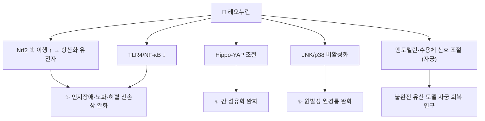

# 🔬 레오누린 (Leonurine, C₁₄H₂₁N₃O₅)

> **핵심 3줄 요약 (Key Summary)**:
> - 🌿 기원 본초 & 화학 계열: [[익모초]](益母草, *Leonurus japonicus* 지상부)의 대표 **구아니딘 알칼로이드**로, 익모초속 고유 성분이다. 함량은 시판 약재 0.001~0.049%, 재배품 0.1% 이상이며 **씨([[충위자]])에서는 검출되지 않았다**(§2).
> - 🎯 핵심 분자 표적: [[Nrf2]] 항산화 경로 활성화(알츠하이머·노화·신손상 모델), [[TLR4]]/[[NF-κB]] 억제, Hippo-YAP(간 섬유화), JNK/p38(월경통) — 모두 동물·세포 연구. 심혈관 신약 후보 코드명 **SCM-198**로도 연구되었다(PMID 21882210).
> - 🩺 주요 약리 활성: 익모초의 활혈조경(活血調經)·이수소종(利水消腫)과 연결되는 월경통 완화, 간 섬유화·신손상·인지장애·노화 모델의 보호 효과.
> - ⚠️ 주의: 랫드 **경구 생체이용률 0.14%**로 거의 흡수되지 않는다(PMID 42357401). 익모초와 함께 자궁 관련 작용이 있어 **임신 중 금기**(원문). 익모초 지상부 성분은 자궁 평활근에 서로 반대 방향으로 작용해(PMID 29127939) '레오누린 = 자궁수축제'로 단순화할 수 없다.

---

## 📌 목차
1. [기본 화학 정보 & 분자 구조식 (Chemical Identity)](#1-기본-화학-정보--분자-구조식-chemical-identity)
2. [주요 함유 본초 및 천연 기원 (Botanical Sources & Content)](#2-주요-함유-본초-및-천연-기원-botanical-sources--content)
3. [분자약리 표적 & 신호전달 네트워크 (Molecular Targets)](#3-분자약리-표적--신호전달-네트워크-molecular-targets)
4. [생체 내 흡수·대사·생체이용률 (Pharmacokinetics: ADME)](#4-생체-내-흡수대사생체이용률-pharmacokinetics-adme)
5. [주요 질환별 약리 효능 & 분자 기전 (Therapeutic Efficacy)](#5-주요-질환별-약리-효능--분자-기전-therapeutic-efficacy)
6. [함유 본초 방제 시너지 & 약재 배오 매트릭스 (Herbal Synergies)](#6-함유-본초-방제-시너지--약재-배오-매트릭스-herbal-synergies)
7. [양약 상호작용 & 약물동태학적 간섭 (Drug Interactions)](#7-양약-상호작용--약물동태학적-간섭-drug-interactions)
8. [💡 사용자 진료실 핵심 필기 & 임상 응용 팁 (Melt-In & High-Yield)](#8--사용자-진료실-핵심-필기--임상-응용-팁-melt-in--high-yield)
9. [출처 및 학술 참고 문헌 (References)](#9-출처-및-학술-참고-문헌-references)

---

## 1. 기본 화학 정보 & 분자 구조식 (Chemical Identity)

### 1.1 화학적 특성
레오누린은 **시링산(4-히드록시-3,5-디메톡시벤조산)**과 **4-구아니디노-1-부탄올**이 에스터 결합으로 이어진 구조입니다. 강염기성 구아니딘기 때문에 생리적 pH에서 양전하를 띠고 극성이 매우 커서(TPSA 129 Ų, XLogP 0.5) 경구 흡수가 나쁩니다(§4). 체내에서는 이 **에스터 결합이 끊기는 것**이 주요 대사 경로입니다(PMID 42357401).

| 항목 (Property) | 세부 정보 (Specification) |
| :--- | :--- |
| **IUPAC 명칭** | 4-(diaminomethylideneamino)butyl 4-hydroxy-3,5-dimethoxybenzoate (PubChem) |
| **분자식 / 분자량** | C₁₄H₂₁N₃O₅ / 311.33 g/mol |
| **PubChem CID** | [161464](https://pubchem.ncbi.nlm.nih.gov/compound/161464) |
| **CAS 등록번호** | 24697-74-3 (PubChem 동의어 기준, CAS 원본 대조는 못 함) |
| **화학 골격 분류** | 구아니딘 유도체 알칼로이드 (시링산 에스터) |
| **물리화학 지표** | XLogP 0.5 · TPSA 129 Ų (PubChem 계산값) — 고극성 |
| **개발 코드** | SCM-198 (심혈관 신약 후보, PMID 21882210). 개선된 화학 합성법도 보고됨(PMID 446644) |

### 1.2 2D 분자 구조식
![[레오누린_1_화학구조식.png|320]]
> [그림 1: ① 2D 화학 구조식 — 레오누린(PubChem CID 161464). 위쪽 시링산 고리와 아래쪽 구아니디노부틸 사슬이 에스터로 연결. 출처: [PubChem](https://pubchem.ncbi.nlm.nih.gov/compound/161464)]

### 1.3 3D 약리 분자 구조 (Interactive Viewer)
> [!abstract]+ 🧪 3D 약리 분자 구조 (Interactive 3D Viewer)
> <iframe src="https://molecule-viewer-rho.vercel.app/?cid=161464" width="100%" height="450px" frameborder="0" allow="webgl" style="border-radius: 8px;"></iframe>

---

## 2. 주요 함유 본초 및 천연 기원 (Botanical Sources & Content)

![[레오누린_2_익모초_꽃차례.jpg|380]]
> [그림 2: ② 기원 식물 실사 — 익모초(*Leonurus japonicus* Houtt.)의 층층이 달린 꽃과 줄기. 레오누린은 꽃 필 무렵 채취한 지상부에서 확인된다. 출처: Alex Abair, [Wikimedia Commons](https://commons.wikimedia.org/wiki/File:Leonurus_japonicus_inflorescence.jpg) (CC BY 4.0)]

![[레오누리닌_2_기원식물_익모초.jpg|300]]
> [그림 3: ② 기원 식물 실사 — 익모초 전초. 레오누린은 이 지상부에만 있고 씨(충위자)에는 없다(PMID 23346757). 출처: Alex Abair, [Wikimedia Commons](https://commons.wikimedia.org/wiki/File:Leonurus_japonicus_habit.jpg) (CC BY 4.0)]

| 함유 본초 | 기원 식물 (과명 / 학명) | 약용 부위 | 한의학적 귀경 및 약효 | 레오누린 함량 근거 |
| :--- | :--- | :--- | :--- | :--- |
| [[익모초]] (益母草) | 꿀풀과 / *Leonurus japonicus* Houtt. | 지상부 (꽃 필 무렵) | 심·간·방광경 / 활혈조경·이수소종·청열해독 | 중국·일본산 약재 0.001~0.049%, 재배품 ≥0.1% (HPLC, PMID 23346757) |
| (구분) [[충위자]] (茺蔚子) | 같은 식물 | 익은 씨 | 활혈조경·청간명목 | **불검출** (PMID 23346757) |
| (구분) 서양 익모초 | *Leonurus cardiaca* | 지상부 | — | **불검출** — 유럽 공정서 평가 수정 필요 (PMID 23346757) |

* 레오누린은 익모초속에 고유한 알칼로이드로 정리됩니다(Liu 2024 종설, PMID 39101131). 같은 약재에서 [[스타키드린]]도 주요 알칼로이드이며, 익모초 추출물 투여 후 두 성분을 동시에 정량한 약동학 연구가 있습니다(PMID 23348611).
* 이름이 비슷한 [[레오누리닌]]은 구조가 등록되지 않은 별개 성분입니다.

---

## 3. 분자약리 표적 & 신호전달 네트워크 (Molecular Targets)

![[레오누린_3_KEAP1_NRF2_경로.jpg|480]]
> [그림 4: ③ 표적 경로 도해 — KEAP1/NRF2 신호. 평소 KEAP1이 NRF2를 유비퀴틴화해 분해시키고, 산화 자극 시 NRF2가 핵으로 들어가 항산화 유전자(ARE)를 켠다. 레오누린은 여러 동물 모델에서 NRF2 핵 이행·활성을 높였다(§3.1). 출처: Wu & Papagiannakopoulos 2020, [Wikimedia Commons](https://commons.wikimedia.org/wiki/File:KEAP1_NRF2_signaling_pathway.jpg) (CC BY 4.0)]

### 3.1 Nrf2 항산화 · TLR4/NF-κB 억제
* 알츠하이머 마우스: Nrf-2 경로 활성화로 인지 장애·산화 스트레스 완화(Xie 2023, PMID 37284249).

* D-갈락토오스 노화 마우스: Nrf2 신호 활성화로 노화 지표 개선(Chen 2019, *Leonurine ameliorates D-galactose-induced aging in mice through activation*, PMID 31527304).
* 허혈성 급성 신손상 랫드: 전처치로 Nrf2 핵 이행 촉진, [[TLR4]]/[[NF-κB]] 억제(Han 2022, PMID 34980736).

### 3.2 Hippo-YAP (간 섬유화)
* CCl₄ 유도 간 섬유화 마우스에서 Hippo-YAP 경로를 통해 섬유화를 완화했습니다(Wang 2025, PMID 40761670).

### 3.3 자궁·월경 관련
* 원발성 월경통 랫드: JNK/p38 경로 비활성화로 통증 완화(Jiang 2026, PMID 41762356).
* 약물 유도 초기 불완전 유산 랫드: 레오누린 염산염이 엔도텔린·엔도텔린 수용체 신호에 영향(Li 2013, PMID 23541415; Li 2011, PMID 22030073).
* **방향성 주의**: 익모초 지상부의 알칼로이드와 플라보노이드 배당체가 자궁 평활근에 **상반된 효과**를 보였습니다(Liu 2018, PMID 29127939). 원문의 "자궁 수축 촉진"을 레오누린 단독의 확정 작용으로 보기 어렵고, 수축/이완 방향은 초록으로 확정하지 못했습니다 ⚠️.

### 3.4 심혈관
* eNOS-NO 계를 통한 항동맥경화(염증 억제·플라크 안정화) 보고가 있습니다(Ning 2020, PMID 32238453, 제목 기준). 심혈관·중추 질환 후보 약물로서의 종설도 있습니다(Huang 2021, PMID 33300684).

---

## 4. 생체 내 흡수·대사·생체이용률 (Pharmacokinetics: ADME)

| 항목 (랫드) | 수치 | 근거 |
| :--- | :--- | :--- |
| **정맥 반감기** | 2.48시간 | Liu 2026, PMID 42357401 |
| **청소율** | 152 mL/min/kg — 빠른 소실 | PMID 42357401 |
| **경구 절대 생체이용률** | **0.14%** (거의 흡수 안 됨) | PMID 42357401 |
| **복강 투여 생체이용률** | 66.6% | PMID 42357401 |
| **미변화체 배설** | 소변+대변 합계 **6% 미만** → 대사가 주 소실 경로 | PMID 42357401 |
| **대사** | 대사체 30종(새로 보고 24종): 글루쿠론산 포합 12·황산 포합 12, 가수분해·메틸화/탈메틸화. **에스터 결합 절단이 주요 1차 대사** | PMID 42357401 |

* 경구 약동학 정량법(SCM-198)과 익모초 추출물 경구 투여 후 스타키드린·레오누린 동시 정량 연구가 있습니다(PMID 21882210·23348611).
* ⚠️ 사람 약동학 수치는 확인하지 못했습니다. 경구 생체이용률이 0.14%라면 익모초 전탕 복용 시 전신 효과를 레오누린 단독으로 설명하기는 어렵습니다(가수분해 산물 시링산 등 대사체의 기여 가능성은 미확인).

---

## 5. 주요 질환별 약리 효능 & 분자 기전 (Therapeutic Efficacy)

레오누린은 [[익모초]]의 활혈조경·이수소종 효능을 뒷받침하는 핵심 알칼로이드로, 산후 어혈복통·오로불하·월경부조에 활용되는 근거로 제시됩니다(원문).

| 질환 (모델) | 근거 | 근거 수준 |
| :--- | :--- | :--- |
| [[월경곤란증]] (원발성) | JNK/p38 비활성화 (PMID 41762356) | 동물 |
| 불완전 [[유산]] 후 자궁 | 엔도텔린 신호 조절 (PMID 23541415·22030073) | 동물 |
| [[간 섬유증]] | Hippo-YAP (PMID 40761670) | 동물 |
| [[급성신손상]] (허혈) | Nrf2↑·TLR4/NF-κB↓ (PMID 34980736) | 동물 |
| [[알츠하이머병]] | Nrf-2 활성화 (PMID 37284249) | 동물 |
| 노화 | Nrf2 활성화 (PMID 31527304) | 동물 |
| [[죽상경화증]] | eNOS-NO·플라크 안정화 (PMID 32238453) | 동물(제목 기준) |
| [[호모시스테인]] 대사 | 임상시험 시료의 대사체·장내 미생물 분석 (PMID 34709742) | 사람 시료(제목 기준) |

* 종설: 약동학·약력학·독성·임상시험(PMID 39101131), 만성질환 치료 잠재력(PMID 40202674), 익모초 연구의 기초→임상(PMID 29360539).
* ⚠️ 산후 오로·월경 관련 사람 임상 효능은 확인하지 못했습니다. 임상시험 시료 분석 논문(PMID 34709742)이 있어 레오누린의 사람 투여 연구가 진행된 것으로 보이나 초록이 없어 내용을 확인하지 못했습니다.

---

## 6. 함유 본초 방제 시너지 & 약재 배오 매트릭스 (Herbal Synergies)

| 본초 / 방제 | 구성 | 레오누린 연결 | 전통 효능 |
| :--- | :--- | :--- | :--- |
| [[익모초]] | 단미 | 지표 알칼로이드 (지상부) | 활혈조경·이수소종 |
| [[익모초고]] | 익모초·[[충위자]] | 레오누린은 **익모초 쪽**에서만 기여(씨에는 없음, PMID 23346757) | 산후 복통·오로 부진 |

* 같은 약재 안에서 알칼로이드(레오누린 포함)와 플라보노이드가 자궁에 반대 방향으로 작용한다는 결과(PMID 29127939)는, 익모초 전체가 **양방향 조절** 약재일 수 있음을 시사합니다.
* ⚠️ 처방 전탕액에서 레오누린의 기여를 정량한 연구는 확인되지 않았습니다.

---

## 7. 양약 상호작용 & 약물동태학적 간섭 (Drug Interactions)

* **임신 금기(원문)**: 자궁 관련 작용 때문에 임신 중 금기입니다. 불완전 유산 모델 연구(PMID 23541415·22030073)가 있는 만큼 임신 가능성이 있는 환자에게 익모초·레오누린 제제를 쓸 때는 반드시 확인합니다.
* **자궁수축제·항응고제 — 이론적 유의**: 원문의 활혈 작용을 고려하면 자궁수축제([[옥시토신]] 등) 병용 시 작용 중첩을 이론적으로 생각할 수 있습니다. 직접 연구는 없습니다.
* 독성학은 종설에서 다뤄집니다(PMID 39101131). ⚠️ 사람 대상 약물상호작용 연구는 확인되지 않았습니다.

---

## 8. 💡 사용자 진료실 핵심 필기 & 임상 응용 팁 (Melt-In & High-Yield)

* **(원문 필기)** 익모초의 활혈조경·이수소종(산후 어혈복통, 오로불하, 월경부조)을 설명할 때 지표 알칼로이드로 레오누린을 연결.
* **(원문 필기)** 레오누린은 **지상부(익모초)**에서 확인되고 씨앗(충위자)에서는 검출되지 않았다는 점을 구분(Kuchta 2012).
* **(원문 필기)** 임신 중 금기 — 반드시 확인.
* **보강 — 흡수 문제**: 쥐에서 먹었을 때 0.14%만 혈중에 들어갔습니다. 동물 효능 연구 상당수는 주사로 준 결과이므로, "익모초 먹으면 레오누린이 간 섬유화를 막는다" 식의 설명은 피합니다.
* **보강 — 월경통 설명**: 월경통 랫드 연구(JNK/p38)가 가장 직접적인 근거입니다.

---

## 9. 출처 및 학술 참고 문헌 (References)

1. **Kuchta K, Ortwein J, Rauwald HW. (2012)**. *Leonurus japonicus, Leonurus cardiaca, Leonotis leonurus: a novel HPLC study on the occurrence and content of the pharmacologically active guanidino derivative leonurine*. **Pharmazie**, 67(12):973-979. [PMID 23346757](https://pubmed.ncbi.nlm.nih.gov/23346757/)
   - **[연구 요약]**: 레오누린은 익모초 지상부에만 존재(0.001~0.049%, 재배품 ≥0.1%), 씨·*L. cardiaca*에서는 불검출.
2. **Liu X, Hu J, Chen Y, et al. (2026)**. *Pharmacokinetics, Excretion, and Metabolite Profiling of Leonurine in Rats: Evidence for Extensive Phase II Conjugations*. **Molecules**, 31(12):2002. [PMID 42357401](https://pubmed.ncbi.nlm.nih.gov/42357401/) · [DOI](https://doi.org/10.3390/molecules31122002)
   - **[연구 요약]**: 경구 생체이용률 0.14%, 반감기 2.48시간, 대사체 30종(포합 위주), 에스터 절단.
3. **Zhu Q, Cai W, Sha X, et al. (2012)**. *Quantification of leonurine, a novel potential cardiovascular agent, in rat plasma by liquid chromatography-tandem mass spectrometry and its application to pharmacokinetic study in rats*. **Biomed Chromatogr**, 26(4):518-523. [PMID 21882210](https://pubmed.ncbi.nlm.nih.gov/21882210/)
   - **[연구 요약]**: SCM-198(레오누린) 랫드 혈장 정량법·약동학.
4. **Li B, et al. (2013)**. *Simultaneous determination and pharmacokinetic study of stachydrine and leonurine in rat plasma after oral administration of Herba Leonuri extract by LC-MS/MS*. **J Pharm Biomed Anal**. [PMID 23348611](https://pubmed.ncbi.nlm.nih.gov/23348611/)
   - **[연구 요약]**: 익모초 추출물 경구 후 스타키드린·레오누린 동시 약동학.
5. **Liu S, Sun C, Tang H, et al. (2024)**. *Leonurine: a comprehensive review of pharmacokinetics, pharmacodynamics, and toxicology*. **Front Pharmacol**, 15:1428406. [PMID 39101131](https://pubmed.ncbi.nlm.nih.gov/39101131/)
   - **[연구 요약]**: 레오누린 약동학·약리·독성·임상시험 종설.
6. **Liu J, Peng C, Zhou QM, et al. (2018)**. *Alkaloids and flavonoid glycosides from the aerial parts of Leonurus japonicus and their opposite effects on uterine smooth muscle*. **Phytochemistry**, 145:128-136. [PMID 29127939](https://pubmed.ncbi.nlm.nih.gov/29127939/)
   - **[연구 요약]**: 익모초 알칼로이드·플라보노이드의 자궁 평활근 상반 효과.
7. **Wang P, Bai J, Ye M, et al. (2025)**. *Leonurine Attenuates CCl4-Induced Hepatic Fibrosis in Mice via the Hippo-YAP Pathway*. **Drug Des Devel Ther**, 19:6553-6571. [PMID 40761670](https://pubmed.ncbi.nlm.nih.gov/40761670/) · [DOI](https://doi.org/10.2147/DDDT.S518793)
   - **[연구 요약]**: Hippo-YAP 경로로 간 섬유화 완화.
8. **Xie Y, Jin Y, Li S, et al. (2023)**. *Leonurine Alleviates Cognitive Dysfunction and Reduces Oxidative Stress by Activating Nrf-2 Pathway in Alzheimer's Disease Mouse Model*. **Neuropsychiatr Dis Treat**, 19:1347-1357. [PMID 37284249](https://pubmed.ncbi.nlm.nih.gov/37284249/)
   - **[연구 요약]**: 알츠하이머 마우스 Nrf-2 활성화.
9. **Chen P, Chen F, Zhou BH, et al. (2019)**. *Leonurine ameliorates D-galactose-induced aging in mice through activation of the Nrf2 signalling pathway*. **Aging (Albany NY)**, 11(18):7339-7356. [PMID 31527304](https://pubmed.ncbi.nlm.nih.gov/31527304/)
   - **[연구 요약]**: 노화 마우스 Nrf2 활성화.
10. **Han L, Chen A, Liu L, et al. (2022)**. *Leonurine Preconditioning Attenuates Ischemic Acute Kidney Injury in Rats by Promoting Nrf2 Nuclear Translocation and Suppressing TLR4/NF-κB Pathway*. **Chem Pharm Bull (Tokyo)**, 70(1):66-73. [PMID 34980736](https://pubmed.ncbi.nlm.nih.gov/34980736/)
    - **[연구 요약]**: 허혈 신손상 Nrf2↑·TLR4/NF-κB↓.
11. **Li X, Yuan FL, Zhao YQ, et al. (2013)**. *Effect of leonurine hydrochloride on endothelin and the endothelin receptor-mediated signal pathway in medically-induced incomplete abortion in rats*. **Eur J Obstet Gynecol Reprod Biol**, 169(2):299-303. [PMID 23541415](https://pubmed.ncbi.nlm.nih.gov/23541415/)
    - **[연구 요약]**: 불완전 유산 랫드 엔도텔린 신호.
12. **Li X, Yuan FL, Zhao YQ, et al. (2011)**. *Effects of leonurine hydrochloride on medically induced incomplete abortion in early pregnancy rats*. **Eur J Obstet Gynecol Reprod Biol**, 159(2):375-380. [PMID 22030073](https://pubmed.ncbi.nlm.nih.gov/22030073/)
    - **[연구 요약]**: 초기 임신 랫드 불완전 유산 효과.
13. **Jiang L, Jiang Y, Lin L, et al. (2026)**. *Leonurine Exerts an Anti-Primary Dysmenorrhea Effect in Rats by Inactivating the JNK/p38 Pathway*. **Appl Biochem Biotechnol**, 198(5):3711-3724. [PMID 41762356](https://pubmed.ncbi.nlm.nih.gov/41762356/)
    - **[연구 요약]**: 원발성 월경통 랫드 JNK/p38 비활성화.
14. **Ning K, et al. (2020)**. *eNOS-Nitric Oxide System Contributes to a Novel Antiatherogenic Effect of Leonurine via Inflammation Inhibition and Plaque Stabilization*. **J Pharmacol Exp Ther**, 373(3):463-475. [PMID 32238453](https://pubmed.ncbi.nlm.nih.gov/32238453/)
    - **[연구 요약]**: eNOS-NO 계를 통한 항동맥경화(제목 기준).
15. **Liao J, Suguro R, Zhao X, et al. (2021)**. *Leonurine affected homocysteine-methionine metabolism based on metabolomics and gut microbiota studies of clinical trial samples*. **Clin Transl Med**, 11(10):e535. [PMID 34709742](https://pubmed.ncbi.nlm.nih.gov/34709742/)
    - **[연구 요약]**: 임상시험 시료 기반 호모시스테인-메티오닌 대사 분석(초록 없음, 제목 기준).
16. **Huang L, et al. (2021)**. *Leonurine, a potential drug for the treatment of cardiovascular system and central nervous system diseases*. **Brain Behav**, 11(2):e01995. [PMID 33300684](https://pubmed.ncbi.nlm.nih.gov/33300684/)
    - **[연구 요약]**: 심혈관·중추 질환 후보로서의 종설.
17. **Manickasamy MK, Daimary UD, Sajeev A, et al. (2025)**. *Comprehensive review of leonurine: harnessing its therapeutic potential for chronic diseases*. **Naunyn Schmiedebergs Arch Pharmacol**, 398(9):11609-11653. [PMID 40202674](https://pubmed.ncbi.nlm.nih.gov/40202674/)
    - **[연구 요약]**: 만성질환 치료 잠재력 종설.
18. **Zhu YZ, Wu W, Zhu Q, et al. (2018)**. *Discovery of Leonuri and therapeutical applications: From bench to bedside*. **Pharmacol Ther**, 188:26-35. [PMID 29360539](https://pubmed.ncbi.nlm.nih.gov/29360539/)
    - **[연구 요약]**: 익모초 연구의 기초→임상 종설.
19. **Shang X, Pan H, Wang X, et al. (2014)**. *Leonurus japonicus Houtt.: ethnopharmacology, phytochemistry and pharmacology of an important traditional Chinese medicine*. **J Ethnopharmacol**, 152(1):14-32. [PMID 24412548](https://pubmed.ncbi.nlm.nih.gov/24412548/)
    - **[연구 요약]**: 익모초 민속약리·화학·약리 종설.
20. **Cheng KF, et al. (1979)**. *Leonurine, an improved synthesis*. **Experientia**, 35(5):571-572. [PMID 446644](https://pubmed.ncbi.nlm.nih.gov/446644/)
    - **[연구 요약]**: 레오누린 합성법 개선(제목 기준).
21. PubChem Compound Summary — Leonurine (CID 161464): [https://pubchem.ncbi.nlm.nih.gov/compound/161464](https://pubchem.ncbi.nlm.nih.gov/compound/161464)

**이미지 출처·라이선스**
- 그림 1: PubChem 2D 구조식 (CID 161464) — 공공 데이터
- 그림 2: Alex Abair, *Leonurus japonicus inflorescence* — [Commons](https://commons.wikimedia.org/wiki/File:Leonurus_japonicus_inflorescence.jpg), CC BY 4.0
- 그림 3: Alex Abair, *Leonurus japonicus habit* — [Commons](https://commons.wikimedia.org/wiki/File:Leonurus_japonicus_habit.jpg), CC BY 4.0
- 그림 4: Wu WL & Papagiannakopoulos T (2020), *KEAP1/NRF2 signaling pathway* — [Commons](https://commons.wikimedia.org/wiki/File:KEAP1_NRF2_signaling_pathway.jpg), CC BY 4.0
