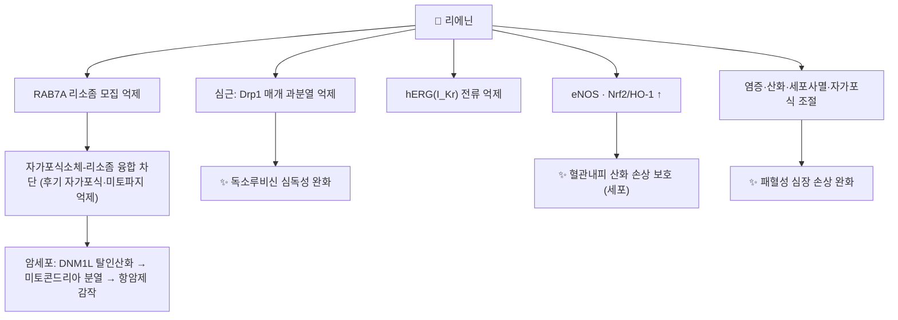

# 🔬 리에닌 (Liensinine, C₃₇H₄₂N₂O₆)

> **핵심 3줄 요약 (Key Summary)**:
> - 🌿 기원 본초 & 화학 계열: [[연자심]](蓮子心, 연꽃 *Nelumbo nucifera* 씨의 녹색 배아)의 주요 **비스벤질이소퀴놀린 알칼로이드**로, [[네페린]]·이소리에닌과 함께 연자심 알칼로이드의 중심을 이룬다(PMID 25636663). 네페린에서 페놀 메틸기 하나가 빠진 구조이며, 쥐 간에서 네페린이 CYP2D6에 의해 리에닌으로 일부 전환된다(PMID 17654697).
> - 🎯 핵심 분자 표적: **후기 자가포식·미토파지 억제제** — RAB7A의 리소좀 모집을 막아 자가포식소체-리소좀 융합을 차단한다(PMID 26114658). 독소루비신 심근 손상에서는 Drp1 매개 미토콘드리아 과분열을 억제했다(PMID 32339784). hERG 칼륨 전류도 억제한다(PMID 22508050).
> - 🩺 주요 약리 활성: 독소루비신 심독성 완화, 유방암 세포의 항암제 감수성 증가, 패혈성 심장 손상 완화, 혈관내피 산화 손상 보호 — 모두 세포·동물 연구.
> - ⚠️ 주의: 원문의 'L형 칼슘 채널(Ca_v1.2) 차단 → 혈압강하·항부정맥'은 PubMed에서 근거를 찾지 못했다. 확인된 이온 채널 작용은 **hERG 억제**로, QT 연장 약물과의 이론적 상가 가능성이 있다. 사람 임상 근거 없음.

---

## 📌 목차
1. [기본 화학 정보 & 분자 구조식 (Chemical Identity)](#1-기본-화학-정보--분자-구조식-chemical-identity)
2. [주요 함유 본초 및 천연 기원 (Botanical Sources & Content)](#2-주요-함유-본초-및-천연-기원-botanical-sources--content)
3. [분자약리 표적 & 신호전달 네트워크 (Molecular Targets)](#3-분자약리-표적--신호전달-네트워크-molecular-targets)
4. [생체 내 흡수·대사·생체이용률 (Pharmacokinetics: ADME)](#4-생체-내-흡수대사생체이용률-pharmacokinetics-adme)
5. [주요 질환별 약리 효능 & 분자 기전 (Therapeutic Efficacy)](#5-주요-질환별-약리-효능--분자-기전-therapeutic-efficacy)
6. [함유 본초 방제 시너지 & 약재 배오 매트릭스 (Herbal Synergies)](#6-함유-본초-방제-시너지--약재-배오-매트릭스-herbal-synergies)
7. [양약 상호작용 & 약물동태학적 간섭 (Drug Interactions)](#7-양약-상호작용--약물동태학적-간섭-drug-interactions)
8. [💡 사용자 진료실 핵심 필기 & 임상 응용 팁 (Melt-In & High-Yield)](#8--사용자-진료실-핵심-필기--임상-응용-팁-melt-in--high-yield)
9. [출처 및 학술 참고 문헌 (References)](#9-출처-및-학술-참고-문헌-references)

---

## 1. 기본 화학 정보 & 분자 구조식 (Chemical Identity)

### 1.1 화학적 특성
리에닌은 두 개의 벤질테트라히드로이소퀴놀린 단위가 디아릴에테르 하나로 이어진 비스벤질이소퀴놀린입니다. [[네페린]](C₃₈H₄₄N₂O₆)과 비교하면 한쪽 벤질기의 4-메톡시가 **4-히드록시**로 바뀐 구조(메틸기 하나 차이)이며, 두 키랄 탄소는 모두 (1R)입니다. 연꽃 알칼로이드가 (R)형 위주라는 특징(→ [[히게나민]] §2.1)과 맞습니다.

| 항목 (Property) | 세부 정보 (Specification) |
| :--- | :--- |
| **IUPAC 명칭** | 4-[[(1R)-6,7-dimethoxy-2-methyl-3,4-dihydro-1H-isoquinolin-1-yl]methyl]-2-[[(1R)-1-[(4-hydroxyphenyl)methyl]-6-methoxy-2-methyl-3,4-dihydro-1H-isoquinolin-7-yl]oxy]phenol (PubChem) |
| **분자식 / 분자량** | C₃₇H₄₂N₂O₆ / 610.7 g/mol |
| **PubChem CID** | [160644](https://pubchem.ncbi.nlm.nih.gov/compound/160644) |
| **CAS 등록번호** | 2586-96-1 (PubChem 동의어 기준, CAS 원본 대조는 못 함) |
| **화학 골격 분류** | 비스벤질이소퀴놀린 알칼로이드 (3급 아민 2개, 페놀 OH 2개) |
| **물리화학 지표** | XLogP 6.4 · TPSA 83.9 Ų (PubChem 계산값) |
| **공정서 규격 (원문)** | 대한민국약전 연자심 지표 성분, 건조물 기준 0.20% 이상 ⚠️ 약전 원문 대조는 이번에 하지 못함 |

### 1.2 2D 분자 구조식
![[리에닌_1_화학구조식.png|380]]
> [그림 1: ① 2D 화학 구조식 — 리에닌(PubChem CID 160644). 오른쪽 아래 벤질기 끝이 OH(네페린은 OCH₃). 출처: [PubChem](https://pubchem.ncbi.nlm.nih.gov/compound/160644)]

### 1.3 3D 약리 분자 구조 (Interactive Viewer)
> [!abstract]+ 🧪 3D 약리 분자 구조 (Interactive 3D Viewer)
> <iframe src="https://molecule-viewer-rho.vercel.app/?cid=160644" width="100%" height="450px" frameborder="0" allow="webgl" style="border-radius: 8px;"></iframe>

---

## 2. 주요 함유 본초 및 천연 기원 (Botanical Sources & Content)

![[네페린_2_연꽃_연방과_씨앗.jpg|320]]
> [그림 2: ② 약용 부위 실사 — 연방(蓮房)에 박힌 연꽃 씨. 씨 속 녹색 배아(연자심)에 리에닌·네페린·이소리에닌이 들어 있다. 출처: そらみみ (Soramimi), [Wikimedia Commons](https://commons.wikimedia.org/wiki/File:Seeds_of_Nelumbo_nucifera.jpg) (CC BY-SA 4.0)]

| 함유 본초 | 기원 식물 (과명 / 학명) | 약용 부위 | 한의학적 효능 | 리에닌 근거 |
| :--- | :--- | :--- | :--- | :--- |
| [[연자심]] (蓮子心) | 연꽃과 / *Nelumbo nucifera* Gaertn. | 성숙 종자의 녹색 배아 | 심경 / 청심사화·삽정지혈·안신 | "연자심의 주성분은 리에닌·이소리에닌·네페린 같은 알칼로이드"(PMID 25636663) · "주요 이소퀴놀린 알칼로이드"(PMID 26114658) |
| (구분) [[연자육]] (蓮子肉) | 같은 식물 | 배아를 뺀 씨 | 보비지사·익신고정·양심안신 | 주 공급원 아님 — 연자심과 다른 약재 |

* 같은 식물의 잎([[하엽]])에는 아포르핀 [[누시페린]]이, 배아에는 비스벤질이소퀴놀린(리에닌·[[네페린]])과 [[히게나민]]이 많아 부위별로 알칼로이드 구성이 다릅니다.

---

## 3. 분자약리 표적 & 신호전달 네트워크 (Molecular Targets)

![[리에닌_3_자가포식_과정.png|480]]
> [그림 3: ③ 표적 과정 도해 — 자가포식 5단계(개시 → 식포 형성 → 확장 → 자가포식소체 형성 → **리소좀 융합·분해**). 리에닌은 마지막 **자가포식소체-리소좀 융합** 단계를 막는 후기 억제제다(PMID 26114658). 출처: Yun HR et al., [Wikimedia Commons](https://commons.wikimedia.org/wiki/File:The_general_autophagy_process_(five_phase).png) (CC BY 4.0)]

### 3.1 후기 자가포식·미토파지 억제
* 리에닌은 RAB7A가 **리소좀으로** 모집되는 것을 막아(자가포식소체로의 모집은 영향 없음) 자가포식소체-리소좀 융합을 차단하는 후기 자가포식·미토파지 억제제로 규명되었습니다. 유방암 세포에서 여러 항암제와 병용하면 생존율이 떨어지고 세포사멸이 늘었으며, DNM1L(Drp1) 탈인산화·미토콘드리아 이동으로 **분열을 촉진**해 독소루비신 세포사멸을 키웠고, MDA-MB-231 이종이식 모델에서 독소루비신과 상승 작용을 보였습니다(Zhou 2015, PMID 26114658).

### 3.2 심근: Drp1 과분열 억제 — 조직별로 반대 방향
* 독소루비신 유발 심독성 모델에서 리에닌은 미토파지 억제제로서 **Drp1 매개 부적응적 미토콘드리아 분열을 억제**해 심근을 보호했습니다(Liang 2020, PMID 32339784).
* 즉 **암세포에서는 분열 촉진(항암 감작)**, **심근에서는 분열 억제(보호)**로 보고되어, 독소루비신과 병용 시 "항암 효과는 키우고 심독성은 줄이는" 조합 후보로 논의됩니다. 두 결과는 서로 다른 세포·모델에서 나왔으므로 한 환자에서 동시에 성립하는지는 확인되지 않았습니다 ⚠️.

### 3.3 hERG 칼륨 전류 억제
* 리에닌과 네페린은 모두 인간 hERG 칼륨 채널 전류를 농도 의존적으로 줄였습니다(Dong 2012, PMID 22508050).

![[네페린_3_심근_활동전위_이온전류.png|420]]
> [그림 4: ③ 표적 도해 — 심근 활동전위와 이온전류. 리에닌이 억제하는 hERG 전류는 3기 재분극의 **I_Kr**이다. 원문의 'L형 Ca²⁺ 전류(I_Ca(L)) 차단'은 확인되지 않았다. 출처: PeaBrainC, [Wikimedia Commons](https://commons.wikimedia.org/wiki/File:Currents_responsible_for_the_cardiac_action_potential.png) (CC BY-SA 4.0)]

### 3.4 기타
* 패혈성 심장 손상: 염증·산화 스트레스·세포사멸·자가포식을 표적으로 완화(Zhang 2023, PMID 36951482).
* 혈관내피 산화 손상: eNOS·[[Nrf2]]/HO-1 상향으로 보호(Gao 2026, PMID 42273331, 시험관).
* **원문 서술 — 근거 미확인**: "[[네페린]]과 함께 L형 칼슘 채널(Ca_v1.2)·칼륨 통로를 차단해 심근 수축력을 조절하고 말초 혈관을 확장해 혈압을 낮춘다" — ⚠️ PubMed 'liensinine calcium channel', 'liensinine hypertension/antiarrhythmic' 검색에서 근거를 찾지 못했습니다.

---

## 4. 생체 내 흡수·대사·생체이용률 (Pharmacokinetics: ADME)

| 항목 | 내용 | 근거 |
| :--- | :--- | :--- |
| **토끼 정맥 6 mg/kg** | 2구획 모델, t½α 8.3분 · **t½β 130분**, 청소율 0.045 L/min, Vc 2.77 L/kg | Hu 1992, PMID 1294182 |
| **랫드** | t½ **8.2 ± 3.3시간**, Cmax 668 ng/mL, AUC 1803 ng·h/mL (투여 경로는 초록에 명시 없음) | Lv 2015, PMID 25939097 |
| **랫드 정맥 (3성분 동시)** | 리에닌·이소리에닌·네페린 동시 정량 약동학 | Hu 2015, PMID 25636663 |
| **체내 생성** | 네페린 경구 후 쥐 간에서 CYP2D6이 네페린 → 리에닌·이소리에닌 전환 | Huang 2007, PMID 17654697 |
| **조직 분포** | 랫드에서 네페린보다 분포가 느림 | Dong 2012, PMID 22508050 |

* ⚠️ 경구 생체이용률과 사람 약동학은 확인되지 않았습니다. 원문의 "분자량이 커서 경구 생체이용률이 낮을 것"은 추정입니다.
* 연자심을 먹으면 리에닌을 직접 흡수할 뿐 아니라 **네페린이 체내에서 리에닌으로 바뀌는 경로**도 있어(쥐), 두 성분은 한 묶음으로 보는 편이 맞습니다.

---

## 5. 주요 질환별 약리 효능 & 분자 기전 (Therapeutic Efficacy)

| 질환 (모델) | 근거 | 근거 수준 |
| :--- | :--- | :--- |
| [[독소루비신]] 심독성 | Drp1 과분열 억제 (PMID 32339784) | 동물·세포 |
| [[유방암]] 항암제 감작 | 후기 자가포식 억제, 독소루비신 상승 (PMID 26114658) | 세포·이종이식 |
| [[패혈증]] 심장 손상 | 다표적 (PMID 36951482) | 동물 |
| 혈관내피 산화 손상 | eNOS·Nrf2/HO-1 (PMID 42273331) | 세포 |
| [[고혈압]]·부정맥 (원문) | ⚠️ Ca_v1.2 차단 근거 미확인. hERG 억제만 확인(PMID 22508050) | — |

⚠️ 사람 임상 근거는 없습니다. 혈압강하·항부정맥은 원문 서술이며, hERG 억제는 오히려 부정맥 유발(QT 연장) 방향의 위험 신호일 수도 있습니다.

---

## 6. 함유 본초 방제 시너지 & 약재 배오 매트릭스 (Herbal Synergies)

리에닌은 [[연자심]]의 청심사화·삽정지혈 효능을 뒷받침하는 핵심 알칼로이드로, [[네페린]]·[[히게나민]]과 함께 심화(心火)로 인한 번조·불면·고혈압 경향에 활용되는 근거로 다뤄집니다(원문).

| 함유 본초 / 방제 (원문) | 원문 구성 | 원문 연계 | 검토 |
| :--- | :--- | :--- | :--- |
| 청심음 | 연자심·생지황·맥문동·죽엽·[[감초]] | 심화 경로 항산화·혈관이완 시너지 | ⚠️ 볼트에 처방 노트 없음, 구성 출처 미확인 |
| 교태환 | [[황련]]·[[육계]]·연자심 | 한열 배오로 심신불교 조절 | ⚠️ 교태환의 고전 구성은 **황련·육계 2미**로 알려져 있어 연자심 포함 여부 재확인 필요 (볼트 노트 없음) |

* 연자심 안에서 같은 뿌리의 알칼로이드가 서로 다른 방향으로 작용합니다 — [[네페린]]은 진정(동물), [[히게나민]]은 β 자극, 리에닌은 자가포식 억제. 약재 전체의 순효과를 측정한 연구는 확인되지 않았습니다 ⚠️.

---

## 7. 양약 상호작용 & 약물동태학적 간섭 (Drug Interactions)

* **QT 연장 약물 — 이론적 상가**: 리에닌은 hERG 전류를 억제하므로(PMID 22508050) [[아미오다론]]·일부 항정신병약·마크롤라이드 등 QT 연장 약물과의 병용은 이론적으로 주의 대상입니다. 사람 근거는 없습니다.
* **안트라사이클린 항암제([[독소루비신]])**: 세포·동물에서 항암 효과 증강(PMID 26114658)과 심독성 완화(PMID 32339784)가 각각 보고되었습니다. 항암 치료 중인 환자에게 연자심 고용량을 쓰는 것은 효과·독성 양면에서 예측이 어려우므로 담당 의사와 상의 대상입니다.
* **자가포식 조절 약물**: 후기 자가포식 억제제(클로로퀸 계열)와 작용 단계가 겹칩니다(기전적 추론).
* **칼슘채널차단제([[암로디핀]]·[[니페디핀]] 등) — 원문 우려**: 원문은 Ca_v1.2 차단에 따른 상가 효과를 우려했으나, 칼슘 채널 차단 자체가 확인되지 않았습니다.
* ⚠️ CYP 억제·유도 연구는 확인되지 않았습니다.

---

## 8. 💡 사용자 진료실 핵심 필기 & 임상 응용 팁 (Melt-In & High-Yield)

* 기록된 원장님 필기는 없습니다.
* **정리 포인트**: 연자심 = 네페린(주) + 리에닌 + 이소리에닌 + 히게나민. 리에닌은 "네페린에서 메틸기 하나 빠진 형제"이고, 체내에서 네페린이 리에닌으로 바뀌기도 합니다(쥐).
* **항암 환자 상담**: 리에닌은 항암제 효과를 키우는 방향(세포)이지만 확립된 근거가 아니므로, 항암 치료 중 연자심 복용은 임의로 권하지 않습니다.

---

## 9. 출처 및 학술 참고 문헌 (References)

1. **Zhou J, Li G, Zheng Y, et al. (2015)**. *A novel autophagy/mitophagy inhibitor liensinine sensitizes breast cancer cells to chemotherapy through DNM1L-mediated mitochondrial fission*. **Autophagy**, 11(8):1259-1279. [PMID 26114658](https://pubmed.ncbi.nlm.nih.gov/26114658/) · [DOI](https://doi.org/10.1080/15548627.2015.1056970)
   - **[연구 요약]**: RAB7A 리소좀 모집 억제로 자가포식소체-리소좀 융합 차단, 유방암 항암제 감작.
2. **Liang X, Wang S, Wang L, et al. (2020)**. *Mitophagy inhibitor liensinine suppresses doxorubicin-induced cardiotoxicity through inhibition of Drp1-mediated maladaptive mitochondrial fission*. **Pharmacol Res**, 157:104846. [PMID 32339784](https://pubmed.ncbi.nlm.nih.gov/32339784/) · [DOI](https://doi.org/10.1016/j.phrs.2020.104846)
   - **[연구 요약]**: Drp1 과분열 억제로 독소루비신 심독성 완화.
3. **Dong ZX, Zhao X, Gu DF, et al. (2012)**. *Comparative effects of liensinine and neferine on the human ether-a-go-go-related gene potassium channel and pharmacological activity analysis*. **Cell Physiol Biochem**, 29(3-4):431-442. [PMID 22508050](https://pubmed.ncbi.nlm.nih.gov/22508050/)
   - **[연구 요약]**: 리에닌·네페린의 hERG 전류 억제, 랫드 분포 비교.
4. **Zhang W, Wang T, Chen H, et al. (2023)**. *Liensinine alleviates septic heart injury by targeting inflammation, oxidative stress, apoptosis, and autophagy*. **Acta Biochim Biophys Sin (Shanghai)**, 55(3):521-524. [PMID 36951482](https://pubmed.ncbi.nlm.nih.gov/36951482/)
   - **[연구 요약]**: 패혈성 심장 손상 완화.
5. **Gao F, Deng F, Du Q, et al. (2026)**. *Liensinine Ameliorating Oxidative Damage to Vascular Endothelium In Vitro via Upregulating eNOS and Nrf2/HO-1 Signaling*. **Food Sci Nutr**, 14(6):e72013. [PMID 42273331](https://pubmed.ncbi.nlm.nih.gov/42273331/)
   - **[연구 요약]**: 혈관내피 산화 손상 보호(시험관).
6. **Hu G, Xu RA, Dong YY, et al. (2015)**. *Simultaneous determination of liensinine, isoliensinine and neferine in rat plasma by UPLC-MS/MS and application of the technique to pharmacokinetic studies*. **J Ethnopharmacol**, 163:94-98. [PMID 25636663](https://pubmed.ncbi.nlm.nih.gov/25636663/) · [DOI](https://doi.org/10.1016/j.jep.2015.01.020)
   - **[연구 요약]**: 연자심 주성분 3종 동시 정량, 랫드 정맥 약동학.
7. **Lv SF, Wang XH, Li HW, et al. (2015)**. *Quantification of liensinine in rat plasma using ultra-performance liquid chromatography tandem mass spectrometry and its application to a pharmacokinetic study*. **J Chromatogr B**, 992:43-46. [PMID 25939097](https://pubmed.ncbi.nlm.nih.gov/25939097/)
   - **[연구 요약]**: 랫드 t½ 8.2시간, Cmax 668 ng/mL.
8. **Hu X, Zhang X, Cai H, et al. (1992)**. *[Pharmacokinetics of liensinine in rabbits]*. **Zhongguo Zhong Yao Za Zhi**, 17(10):622-624. [PMID 1294182](https://pubmed.ncbi.nlm.nih.gov/1294182/)
   - **[연구 요약]**: 토끼 정맥 2구획, t½β 130분.
9. **Huang Y, Bai Y, Zhao L, et al. (2007)**. *Pharmacokinetics and metabolism of neferine in rats after a single oral administration*. **Biopharm Drug Dispos**, 28(7):361-372. [PMID 17654697](https://pubmed.ncbi.nlm.nih.gov/17654697/)
   - **[연구 요약]**: 네페린이 CYP2D6에 의해 리에닌·이소리에닌으로 일부 전환.
10. PubChem Compound Summary — Liensinine (CID 160644): [https://pubchem.ncbi.nlm.nih.gov/compound/160644](https://pubchem.ncbi.nlm.nih.gov/compound/160644)

**이미지 출처·라이선스**
- 그림 1: PubChem 2D 구조식 (CID 160644) — 공공 데이터
- 그림 2: そらみみ (Soramimi), *Seeds of Nelumbo nucifera* — [Commons](https://commons.wikimedia.org/wiki/File:Seeds_of_Nelumbo_nucifera.jpg), CC BY-SA 4.0
- 그림 3: Yun HR et al., *The general autophagy process* — [Commons](https://commons.wikimedia.org/wiki/File:The_general_autophagy_process_(five_phase).png), CC BY 4.0
- 그림 4: PeaBrainC, *Currents responsible for the cardiac action potential* — [Commons](https://commons.wikimedia.org/wiki/File:Currents_responsible_for_the_cardiac_action_potential.png), CC BY-SA 4.0
