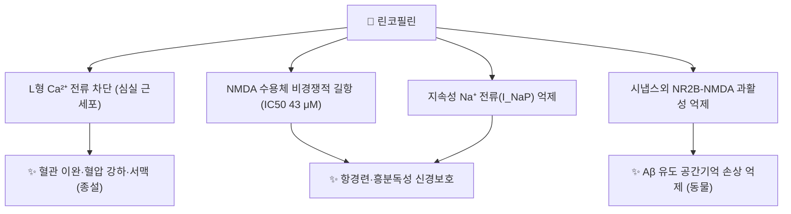

# 🔬 린코필린 (Rhynchophylline, C₂₂H₂₈N₂O₄)

> **핵심 3줄 요약 (Key Summary)**:
> - 🌿 기원 본초 & 화학 계열: [[조구등]](鉤藤, 꼭두서니과 *Uncaria rhynchophylla*의 갈고리 가시가 달린 가지)의 주 알칼로이드인 **사환 옥시인돌 알칼로이드**. 입체이성질체 이소린코필린과 서로 전환되는 에피머 쌍을 이룬다(PMID 28755970).
> - 🎯 핵심 분자 표적: 심실 근세포 **L형 Ca²⁺ 전류 차단**(10·50 μM에서 60·80% 감소, PMID 8010102), **NMDA 수용체 비경쟁적 길항**(IC50 43.2 μM, PMID 12433591), 지속성 Na⁺ 전류(I_NaP) 억제(PMID 27670903).
> - 🩺 주요 약리 활성: 혈압 강하·서맥·항부정맥, 항경련, 진정, 뇌허혈·혈관성 치매 보호 — 조구등의 평간식풍(平肝熄風)·청열평간 효능(현훈·두통·경련)과 연결된다(종설, PMID 20736055).
> - ⚠️ 주의: 사람 임상 근거가 적다(종설 결론, PMID 20736055). 칼슘 채널 차단 작용이 있어 칼슘채널차단제·강압제와 상가 가능성(이론적). 원문의 '고혈압 환자 24시간 혈압 개선 임상', '파킨슨병 이상운동증 완화'는 근거를 찾지 못했다.

---

## 📌 목차
1. [기본 화학 정보 & 분자 구조식 (Chemical Identity)](#1-기본-화학-정보--분자-구조식-chemical-identity)
2. [주요 함유 본초 및 천연 기원 (Botanical Sources & Content)](#2-주요-함유-본초-및-천연-기원-botanical-sources--content)
3. [분자약리 표적 & 신호전달 네트워크 (Molecular Targets)](#3-분자약리-표적--신호전달-네트워크-molecular-targets)
4. [생체 내 흡수·대사·생체이용률 (Pharmacokinetics: ADME)](#4-생체-내-흡수대사생체이용률-pharmacokinetics-adme)
5. [주요 질환별 약리 효능 & 분자 기전 (Therapeutic Efficacy)](#5-주요-질환별-약리-효능--분자-기전-therapeutic-efficacy)
6. [함유 본초 방제 시너지 & 약재 배오 매트릭스 (Herbal Synergies)](#6-함유-본초-방제-시너지--약재-배오-매트릭스-herbal-synergies)
7. [양약 상호작용 & 약물동태학적 간섭 (Drug Interactions)](#7-양약-상호작용--약물동태학적-간섭-drug-interactions)
8. [💡 사용자 진료실 핵심 필기 & 임상 응용 팁 (Melt-In & High-Yield)](#8--사용자-진료실-핵심-필기--임상-응용-팁-melt-in--high-yield)
9. [출처 및 학술 참고 문헌 (References)](#9-출처-및-학술-참고-문헌-references)

---

## 1. 기본 화학 정보 & 분자 구조식 (Chemical Identity)

### 1.1 화학적 특성
린코필린은 옥시인돌(2-옥소인돌)의 3번 탄소가 인돌리지딘 고리와 **스피로(spiro) 결합**한 사환 옥시인돌 알칼로이드입니다. 스피로 탄소의 배치만 다른 **이소린코필린**과 에피머 관계이며, pH에 따라 두 형태가 서로 전환될 수 있습니다(PMID 28755970). 조구등에는 이 둘 외에도 인돌·옥시인돌 알칼로이드가 여럿 들어 있습니다(PMID 34335255).

| 항목 (Property) | 세부 정보 (Specification) |
| :--- | :--- |
| **IUPAC 명칭** | methyl (E)-2-[(3R,6'R,7'S,8'aS)-6'-ethyl-2-oxospiro[1H-indole-3,1'-3,5,6,7,8,8a-hexahydro-2H-indolizine]-7'-yl]-3-methoxyprop-2-enoate (PubChem) |
| **분자식 / 분자량** | C₂₂H₂₈N₂O₄ / 384.5 g/mol |
| **PubChem CID** | [5281408](https://pubchem.ncbi.nlm.nih.gov/compound/5281408) |
| **CAS 등록번호** | 76-66-4 (PubChem 동의어 기준, CAS 원본 대조는 못 함) |
| **화학 골격 분류** | 사환 옥시인돌(tetracyclic oxindole) 알칼로이드 |
| **물리화학 지표** | XLogP 2.3 · TPSA 67.9 Ų (PubChem 계산값) — 뇌 분포 가능(§4) |
| **입체이성질체** | 이소린코필린(에피머) — 약동학이 크게 다름(§4) |

### 1.2 2D 분자 구조식
![[린코필린_1_화학구조식.png|340]]
> [그림 1: ① 2D 화학 구조식 — 린코필린(PubChem CID 5281408). 왼쪽 위 옥시인돌(C=O)과 스피로 결합한 인돌리지딘, 오른쪽 메톡시아크릴산 메틸에스터. 출처: [PubChem](https://pubchem.ncbi.nlm.nih.gov/compound/5281408)]

### 1.3 3D 약리 분자 구조 (Interactive Viewer)
> [!abstract]+ 🧪 3D 약리 분자 구조 (Interactive 3D Viewer)
> <iframe src="https://molecule-viewer-rho.vercel.app/?cid=5281408" width="100%" height="450px" frameborder="0" allow="webgl" style="border-radius: 8px;"></iframe>

---

## 2. 주요 함유 본초 및 천연 기원 (Botanical Sources & Content)

![[린코필린_2_기원식물_조등.jpg|320]]
> [그림 2: ② 기원 식물 실사 — 조구등(*Uncaria rhynchophylla*, 꼭두서니과)의 둥근 두상꽃차례와 잎. 출처: keisotyo, [Wikimedia Commons](https://commons.wikimedia.org/wiki/File:Uncaria_rhynchophylla_kagikzr01.jpg) (CC BY-SA 4.0)]

![[린코필린_2_조등_갈고리가시.jpg|420]]
> [그림 3: ② 약용 부위 실사 — 잎겨드랑이마다 달린 **갈고리 모양 가시(鉤)**. 약재 '조구등'은 이 갈고리가 달린 가지 마디를 쓴다. 출처: keisotyo, [Wikimedia Commons](https://commons.wikimedia.org/wiki/File:Uncaria_rhynchophylla_kagikzr02.jpg) (CC BY-SA 4.0)]

| 함유 본초 | 기원 식물 (과명 / 학명) | 약용 부위 | 한의학적 효능 | 근거 |
| :--- | :--- | :--- | :--- | :--- |
| [[조구등]] (釣鉤藤) | 꼭두서니과 / *Uncaria rhynchophylla* 등 *Uncaria* 속 | 갈고리 가시가 달린 가지 | 간·심포경 / 청열평간·식풍지경 | 주 알칼로이드(PMID 20736055·28755970). 조구등의 인돌·옥시인돌 알칼로이드 성질·약리·약동학 종설(PMID 34335255) |

---

## 3. 분자약리 표적 & 신호전달 네트워크 (Molecular Targets)

![[린코필린_3_NMDA수용체_길항제유형.png|340]]
> [그림 4: ③ 표적 도해 — NMDA 수용체 활성화와 길항제 유형(경쟁적·글리신 부위·**비경쟁적(알로스테릭)**·통로 차단). 린코필린은 NMDA·글리신의 EC50은 바꾸지 않고 최대 반응만 줄이는 **비경쟁적 길항제**로 판정되었다(PMID 12433591). 출처: Delldot, [Wikimedia Commons](https://commons.wikimedia.org/wiki/File:NMDA_receptor_activation_and_antagonists.PNG) (Public domain)]

### 3.1 L형 칼슘 채널 차단
* 랫드 심실 근세포 전세포 패치클램프에서 린코필린 10·50 μmol/L는 베라파밀 감수성 Ca²⁺ 내향 전류를 **60%·80%** 줄였고, 전압 의존성에는 영향이 없었습니다(pD2 5.91, Hill 계수 1.1). 효과는 10분에 최대였고 씻어내면 일부 회복되었습니다(Wang 1994, PMID 8010102).
* 종설은 칼슘·칼륨 통로 조절을 혈압 강하·서맥·항부정맥 작용의 기전으로 정리합니다(Zhou 2010, PMID 20736055).
* 원문의 "중추 교감신경 흥분 억제를 통한 혈압 강하"는 이번에 1차 문헌으로 확인하지 못했습니다 ⚠️.

### 3.2 NMDA 수용체 길항·항경련
* 제노푸스 난모세포에서 린코필린·이소린코필린은 NMDA 전류를 농도 의존적·전압 비의존적으로 줄였고(IC50 43.2·48.3 μM), 카이네이트·AMPA·대사성 글루탐산 수용체에는 영향이 없었습니다. 폴리아민·Zn²⁺·양성자·산화환원 부위와도 무관한 **비경쟁적 길항**이었습니다(Kang 2002, PMID 12433591).
* 필로카르핀 측두엽 뇌전증 랫드에서 전·후처치 모두 발작 중증도를 줄였고, 내후각피질 신경세포 사멸을 막았으며, **지속성 Na⁺ 전류와 NMDA 전류를 억제**하고 Nav1.6·NR2B 발현 증가를 되돌렸습니다(Shao 2016, PMID 27670903).
* 가용성 Aβ₁₋₄₂에 의한 공간 인지 손상을 시냅스외 NR2B-NMDA 수용체 과활성 억제로 막았다는 보고도 있습니다(Yang 2018, PMID 29510187, 제목 기준).

### 3.3 신경염증
* 원문: "미세아교세포 활성을 억제해 TNF-α·[[IL-1β]]·NO를 줄이고 타우 인산화를 감소시킨다." 신경·심혈관 질환에서의 항염 작용은 종설로 정리되어 있습니다(Geetha 2021, PMID 34452133). 타우 인산화 감소는 이번에 1차 문헌으로 확인하지 못했습니다 ⚠️.

---

## 4. 생체 내 흡수·대사·생체이용률 (Pharmacokinetics: ADME)

| 항목 (랫드) | 내용 | 근거 |
| :--- | :--- | :--- |
| **경구 생체이용률** | 린코필린 **23.4%** vs 이소린코필린 4.0% (5.9배) | Wang 2017, PMID 28755970 |
| **차이의 원인** | 간 이용률 46.9% vs 10.3% — **간 초회통과 대사 차이**가 주원인 (장 이용률은 비슷, 48.1% vs 42.7%) | PMID 28755970 |
| **P-gp** | 베라파밀 병용 시 린코필린 흡수가 달라짐 (이소린코필린은 영향 없음) → P-gp 기질 가능성 | PMID 28755970 |
| **대사 효소** | 10-·11-수산화 → 글루쿠론산 포합. **CYP2D·CYP1A1/2·CYP2C** 관여, CYP3A는 관여 안 함 | Wang 2010, PMID 20410604 |
| **배설 (경구 37.5 mg/kg)** | 24시간 내 대변 78.0% · 소변 12.6%, 9.4%가 수산화 대사체로 전환 | PMID 20410604 |
| **뇌 분포** | 경구 3시간 뒤 뇌에서 0.650 ng/g 검출 · 미세투석으로 뇌 비결합형 분포 측정 | PMID 20410604 · Lee 2014, PMID 24861762 |

* 천마와 조구등을 함께 줬을 때 가스트로딘·린코필린 약동학이 달라진다는 연구가 있습니다(Wu 2017, PMID 28840702, 중국어·제목 기준) — [[천마구등음]]의 배오와 관련됩니다.
* **열 불안정성·후하(後下)(원문)**: "린코필린은 열에 약해 조구등은 탕약 제조 시 끓기 직전 10~15분만 달인다." ⚠️ 가열에 따른 분해·이성질화 정량 연구는 이번에 확인하지 못했습니다. 다만 pH에 따른 린코필린⇄이소린코필린 에피머화는 확인되며(PMID 28755970), 두 에피머의 생체이용률이 5.9배 차이 나므로 전탕 조건이 체내 노출에 영향을 줄 가능성은 있습니다(추론).
* ⚠️ 사람 약동학은 확인되지 않았습니다.

---

## 5. 주요 질환별 약리 효능 & 분자 기전 (Therapeutic Efficacy)

종설에 따르면 린코필린은 주로 [[고혈압]]·서맥·부정맥·진정·[[혈관성 치매]]·간질 발작·약물 중독·뇌허혈에 작용하며, 항응고·혈관 평활근 증식 억제·항내독소 작용도 보고되었습니다. 다만 **임상 연구는 비교적 적다**고 결론지었습니다(Zhou 2010, PMID 20736055).

| 질환 | 근거 | 근거 수준 |
| :--- | :--- | :--- |
| [[고혈압]] | L형 Ca²⁺ 차단(PMID 8010102), 종설(PMID 20736055) | 세포·동물 |
| [[뇌전증]] (측두엽) | I_NaP·NMDA 억제로 발작 감소(PMID 27670903) | 동물 |
| [[알츠하이머병]]·[[치매]] | NR2B-NMDA 과활성 억제(PMID 29510187) | 동물 |
| 뇌허혈·신경보호 | 종설(PMID 20736055·34452133) | 동물 |
| 내피 기능 장애 | SIRT3 작용제로 내피 전구세포 미토콘드리아 손상 억제(PMID 40164963, 제목 기준) | 세포·동물 |
| 케타민 중독 | 해마 miRNA 발현 변화(PMID 29476799, 제목 기준) · 케타민 약동학 상호작용(PMID 29951541) | 동물 |

* **원문 서술 — 근거 미확인**:
  * "린코필린 복합 제제가 본태성 고혈압 환자의 24시간 활동혈압에서 혈압 변동성을 낮추고 non-dipper를 정상화" — ⚠️ PubMed에서 해당 임상 연구를 찾지 못했습니다.
  * "[[파킨슨병]] 도파민 신경세포 자가포식을 촉진해 레보도파 유발 이상운동증 완화" — ⚠️ 'rhynchophylline levodopa dyskinesia' 검색 결과 없음.

---

## 6. 함유 본초 방제 시너지 & 약재 배오 매트릭스 (Herbal Synergies)

| 처방 | 조구등의 역할 (원문) | 린코필린 연결 |
| :--- | :--- | :--- |
| [[천마구등음]] (天麻鉤藤飮) | 간양상항 고혈압, 뇌혈관 경련성 두통, 뇌졸중 전구증상 | [[천마]] 병용 시 린코필린 약동학 변화(PMID 28840702) · Ca²⁺ 차단 강압 |
| [[조등산]] (釣藤散) | 노인성 동맥경화, 긴장성 두통, 뇌혈관성 치매 초기 | NMDA 길항·신경보호(동물) |
| [[억간산]] (抑肝散) | 소아 야제증, 경련, 치매 환자의 환각·분노 | NMDA 길항·항경련(동물) |
| [[영각구등탕]] | 열극생풍의 경련 | 항경련(동물) |

* ⚠️ 처방 전탕액에서 린코필린의 기여를 정량한 사람 연구는 확인되지 않았습니다.
* 조구등은 **후하(後下)** 약재로 다뤄집니다(원문, §4 참조).

---

## 7. 양약 상호작용 & 약물동태학적 간섭 (Drug Interactions)

* **칼슘채널차단제·강압제 — 상가 가능성**: 린코필린이 L형 Ca²⁺ 전류를 차단하므로(PMID 8010102) [[암로디핀]]·[[니페디핀]] 등과 병용 시 혈압 저하·서맥이 더해질 수 있습니다(이론적, 원문 우려와 일치).
* **CYP2D6·CYP1A2·CYP2C 기질 약물 — 대사 경쟁 가능**: 린코필린 수산화에 이 효소들이 관여하므로(쥐 간, PMID 20410604) 같은 효소로 대사되는 약물과의 상호작용 가능성을 이론적으로 고려합니다. CYP3A 기질과는 관련이 적습니다.
* **P-gp 억제제(베라파밀 등)**: 장관 흡수가 달라질 수 있습니다(랫드, PMID 28755970).
* **NMDA 길항제·진정제**: 케타민과의 약동학 상호작용이 쥐에서 연구되었고(PMID 29951541), 항경련제·진정제와는 중추 억제가 더해질 가능성이 있습니다(기전적 추론).

---

## 8. 💡 사용자 진료실 핵심 필기 & 임상 응용 팁 (Melt-In & High-Yield)

* 기록된 원장님 필기는 없습니다.
* **진료 연결**: 조구등의 평간식풍(현훈·두통·경련)을 "칼슘 통로와 NMDA 수용체를 누르는 성분"으로 설명할 수 있습니다(세포·동물 근거).
* **강압제 복용 환자**: 천마구등음 등 조구등 처방을 더할 때 혈압·맥박을 확인합니다.
* **후하 이유 설명**: 전통적으로 열에 약해 뒤에 넣는다고 설명되지만 정량 근거는 확인하지 못했으므로 "전통 전탕법"으로 안내합니다.

---

## 9. 출처 및 학술 참고 문헌 (References)

> ⚠️ 기존 노트의 참고문헌 2건 — "Zhou JY 2012, *Fitoterapia* 83(2):346-353, 린코필린 뇌허혈 연구"와 "Ndagijimana 2013, *J Pharmacol Sci* 121(3):167-175, 린코필린 강압 종설" — 은 PubMed에서 해당 서지를 찾지 못해 삭제했습니다(같은 해 *Fitoterapia* 83(4)에는 **이소린코필린** 종설, PMID 22406453이 있음).

1. **Zhou J, Zhou S. (2010)**. *Antihypertensive and neuroprotective activities of rhynchophylline: the role of rhynchophylline in neurotransmission and ion channel activity*. **J Ethnopharmacol**, 132(1):15-27. [PMID 20736055](https://pubmed.ncbi.nlm.nih.gov/20736055/) · [DOI](https://doi.org/10.1016/j.jep.2010.08.041)
   - **[연구 요약]**: 고혈압·서맥·부정맥·진정·혈관성 치매·발작·뇌허혈 작용 종설, 임상 연구는 적음.
2. **Wang XL, Zhang LM, Hua Z. (1994)**. *Blocking effect of rhynchophylline on calcium channels in isolated rat ventricular myocytes*. **Zhongguo Yao Li Xue Bao**, 15(2):115-118. [PMID 8010102](https://pubmed.ncbi.nlm.nih.gov/8010102/)
   - **[연구 요약]**: L형 Ca²⁺ 전류 10·50 μM에서 60·80% 감소, 전압 비의존적.
3. **Kang TH, Murakami Y, Matsumoto K, et al. (2002)**. *Rhynchophylline and isorhynchophylline inhibit NMDA receptors expressed in Xenopus oocytes*. **Eur J Pharmacol**, 455(1):27-34. [PMID 12433591](https://pubmed.ncbi.nlm.nih.gov/12433591/) · [DOI](https://doi.org/10.1016/s0014-2999(02)02581-5)
   - **[연구 요약]**: NMDA 수용체 비경쟁적 길항(IC50 43.2 μM), AMPA·카이네이트 무영향.
4. **Shao H, Yang Y, Mi Z, et al. (2016)**. *Anticonvulsant effect of Rhynchophylline involved in the inhibition of persistent sodium current and NMDA receptor current in the pilocarpine rat model of temporal lobe epilepsy*. **Neuroscience**, 337:355-369. [PMID 27670903](https://pubmed.ncbi.nlm.nih.gov/27670903/) · [DOI](https://doi.org/10.1016/j.neuroscience.2016.09.029)
   - **[연구 요약]**: I_NaP·NMDA 전류 억제로 측두엽 뇌전증 발작 감소.
5. **Wang W, Ma CM, Hattori M. (2010)**. *Metabolism and pharmacokinetics of rhynchophylline in rats*. **Biol Pharm Bull**, 33(4):669-676. [PMID 20410604](https://pubmed.ncbi.nlm.nih.gov/20410604/) · [DOI](https://doi.org/10.1248/bpb.33.669)
   - **[연구 요약]**: CYP2D·1A·2C 수산화, 대변 78%·소변 12.6%, 뇌 검출.
6. **Wang X, Zheng M, Liu J, et al. (2017)**. *Differences of first-pass effect in the liver and intestine contribute to the stereoselective pharmacokinetics of rhynchophylline and isorhynchophylline epimers in rats*. **J Ethnopharmacol**, 209:175-183. [PMID 28755970](https://pubmed.ncbi.nlm.nih.gov/28755970/) · [DOI](https://doi.org/10.1016/j.jep.2017.07.039)
   - **[연구 요약]**: 생체이용률 23.4% vs 4.0%, 간 초회통과 차이, P-gp 관여.
7. **Kushida H, et al. (2021)**. *Properties, Pharmacology, and Pharmacokinetics of Active Indole and Oxindole Alkaloids in Uncaria Hook*. **Front Pharmacol**, 12:688670. [PMID 34335255](https://pubmed.ncbi.nlm.nih.gov/34335255/)
   - **[연구 요약]**: 조구등 인돌·옥시인돌 알칼로이드 성질·약리·약동학 종설.
8. **Shi JS, et al. (2003)**. *Pharmacological actions of Uncaria alkaloids, rhynchophylline and isorhynchophylline*. **Acta Pharmacol Sin**, 24(2):97-101. [PMID 12546715](https://pubmed.ncbi.nlm.nih.gov/12546715/)
   - **[연구 요약]**: 린코필린·이소린코필린 약리 종설.
9. **Geetha RG, et al. (2021)**. *Recent Advances in the Anti-Inflammatory Activity of Plant-Derived Alkaloid Rhynchophylline in Neurological and Cardiovascular Diseases*. **Pharmaceutics**, 13(8). [PMID 34452133](https://pubmed.ncbi.nlm.nih.gov/34452133/)
   - **[연구 요약]**: 신경·심혈관 질환 항염 작용 종설.
10. **Yang Y, et al. (2018)**. *Rhynchophylline suppresses soluble Aβ(1-42)-induced impairment of spatial cognition function via inhibiting excessive activation of extrasynaptic NR2B-containing NMDA receptors*. [PMID 29510187](https://pubmed.ncbi.nlm.nih.gov/29510187/)
    - **[연구 요약]**: 시냅스외 NR2B 과활성 억제로 Aβ 인지 손상 억제(제목 기준).
11. **Lee CJ, et al. (2014)**. *Determination of protein-unbound rhynchiphylline brain distribution by microdialysis and ultra-performance liquid chromatography with tandem mass spectrometry*. **Biomed Chromatogr**. [PMID 24861762](https://pubmed.ncbi.nlm.nih.gov/24861762/)
    - **[연구 요약]**: 미세투석으로 뇌 비결합형 분포 측정(제목 기준).
12. **Wu LH, et al. (2017)**. *[Effect of combination of gastrodia and uncaria on pharmacokinetics of gastrodin and rhynchophylline]*. **Zhongguo Zhong Yao Za Zhi**, 42(13):2577-2582. [PMID 28840702](https://pubmed.ncbi.nlm.nih.gov/28840702/)
    - **[연구 요약]**: 천마·조구등 병용이 가스트로딘·린코필린 약동학에 미치는 영향(제목 기준).
13. **Lin L, et al. (2025)**. *Rhynchophylline as an agonist of sirtuin 3 ameliorates endothelial dysfunction via antagonizing mitochondrial damage of endothelial progenitor cells*. **Br J Pharmacol**. [PMID 40164963](https://pubmed.ncbi.nlm.nih.gov/40164963/)
    - **[연구 요약]**: SIRT3 작용제로 내피 기능 장애 개선(제목 기준).
14. **Li C, et al. (2018)**. *Effects of rhynchophylline on the hippocampal miRNA expression profile in ketamine-addicted rats*. **Prog Neuropsychopharmacol Biol Psychiatry**, 86:379-389. [PMID 29476799](https://pubmed.ncbi.nlm.nih.gov/29476799/)
    - **[연구 요약]**: 케타민 중독 랫드 해마 miRNA(제목 기준).
15. **Chen L, et al. (2018)**. *Pharmacokinetic Interaction Study of Ketamine and Rhynchophylline in Rat Plasma by Ultra-Performance Liquid Chromatography Tandem Mass Spectrometry*. **Biomed Res Int**. [PMID 29951541](https://pubmed.ncbi.nlm.nih.gov/29951541/)
    - **[연구 요약]**: 케타민-린코필린 약동학 상호작용(제목 기준).
16. PubChem Compound Summary — Rhynchophylline (CID 5281408): [https://pubchem.ncbi.nlm.nih.gov/compound/5281408](https://pubchem.ncbi.nlm.nih.gov/compound/5281408)

**이미지 출처·라이선스**
- 그림 1: PubChem 2D 구조식 (CID 5281408) — 공공 데이터
- 그림 2·3: keisotyo, *Uncaria rhynchophylla* — [Commons 01](https://commons.wikimedia.org/wiki/File:Uncaria_rhynchophylla_kagikzr01.jpg) · [Commons 02](https://commons.wikimedia.org/wiki/File:Uncaria_rhynchophylla_kagikzr02.jpg), CC BY-SA 4.0
- 그림 4: Delldot, *NMDA receptor activation and antagonists* — [Commons](https://commons.wikimedia.org/wiki/File:NMDA_receptor_activation_and_antagonists.PNG), Public domain

<!-- 보관 태그(1회용·링크오류, 필요시 복원): 조등, 칼슘채널차단, 혈압강하, 항경련 -->
