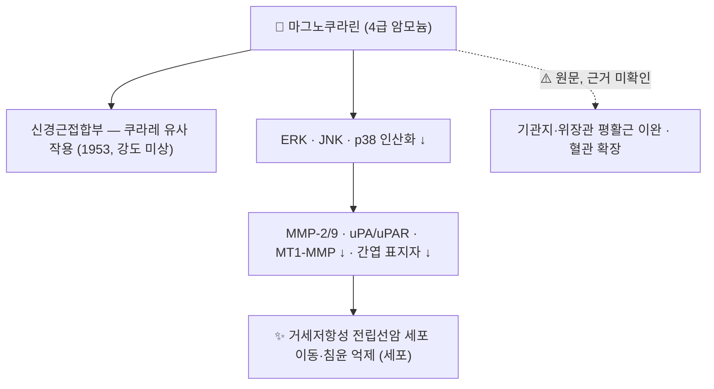

# 🔬 마그노쿠라린 (Magnocurarine, C₁₉H₂₄NO₃⁺)

> **핵심 3줄 요약 (Key Summary)**:
> - 🌿 기원 본초 & 화학 계열: [[후박]](厚朴, 목련과 *Magnolia officinalis*·*M. obovata*의 수피)에 들어 있는 **4급 암모늄 벤질이소퀴놀린 알칼로이드**. 구조는 [[코클라우린]]의 질소에 메틸기 2개가 붙은 형태로, [[히게나민]](노르코클라우린) → 코클라우린 → 마그노쿠라린으로 이어지는 같은 계열이다.
> - 🎯 핵심 분자 표적: 1953년 *M. obovata*에서 분리되어 **쿠라레 유사(신경근 차단) 작용**이 보고되었다(PMID 13084304). 이름도 여기서 왔다. 최근 세포 연구에서는 ERK·JNK·p38(MAPK) 인산화를 줄여 전립선암 세포의 이동·침윤을 억제했다(PMID 42741420).
> - 🩺 주요 약리 활성(원문): 후박의 강역평천(降逆平喘)·행기소창(行氣消脹)과 연결되는 기관지·위장관 평활근 이완 — [[반하후박탕]]·[[계지가후박행자탕]]의 분자 지표로 서술된다. 평활근 이완 자체는 근거를 확인하지 못했다.
> - <font color="#fa7e7e">⚠️ 주의: 신경근 차단 활성의 강도·용량 반응은 확인되지 않았고, 원문의 "쿠라레 대비 1/100 이하, 후박 6~12g에서 매우 안전"도 근거를 찾지 못했다. 4급 암모늄이라 경구 흡수는 제한적일 것으로 추정(미확인).</font>

---

## 📌 목차
1. [기본 화학 정보 & 분자 구조식 (Chemical Identity)](#1-기본-화학-정보--분자-구조식-chemical-identity)
2. [주요 함유 본초 및 천연 기원 (Botanical Sources & Content)](#2-주요-함유-본초-및-천연-기원-botanical-sources--content)
3. [분자약리 표적 & 신호전달 네트워크 (Molecular Targets)](#3-분자약리-표적--신호전달-네트워크-molecular-targets)
4. [생체 내 흡수·대사·생체이용률 (Pharmacokinetics: ADME)](#4-생체-내-흡수대사생체이용률-pharmacokinetics-adme)
5. [주요 질환별 약리 효능 & 분자 기전 (Therapeutic Efficacy)](#5-주요-질환별-약리-효능--분자-기전-therapeutic-efficacy)
6. [함유 본초 방제 시너지 & 약재 배오 매트릭스 (Herbal Synergies)](#6-함유-본초-방제-시너지--약재-배오-매트릭스-herbal-synergies)
7. [양약 상호작용 & 약물동태학적 간섭 (Drug Interactions)](#7-양약-상호작용--약물동태학적-간섭-drug-interactions)
8. [💡 사용자 진료실 핵심 필기 & 임상 응용 팁 (Melt-In & High-Yield)](#8--사용자-진료실-핵심-필기--임상-응용-팁-melt-in--high-yield)
9. [출처 및 학술 참고 문헌 (References)](#9-출처-및-학술-참고-문헌-references)

---

## 1. 기본 화학 정보 & 분자 구조식 (Chemical Identity)

### 1.1 화학적 특성
마그노쿠라린은 1-(4-히드록시벤질)-6-메톡시-7-히드록시 테트라히드로이소퀴놀린(= [[코클라우린]] 골격)의 질소에 메틸기 2개가 붙은 **4급 암모늄 양이온**입니다(PubChem IUPAC 기준 구조 비교). 후박에서는 (R)형이 분리되었습니다(PMID 23823874). 이량체 4급 암모늄인 [[d-투보쿠라린]]과 달리 단량체이며, 같은 후박의 [[마그노플로린]](4급 아포르핀)과도 다른 골격입니다.

| 항목 (Property) | 세부 정보 (Specification) |
| :--- | :--- |
| **IUPAC 명칭** | (1R)-1-[(4-hydroxyphenyl)methyl]-6-methoxy-2,2-dimethyl-3,4-dihydro-1H-isoquinolin-2-ium-7-ol (PubChem) |
| **분자식 / 분자량** | C₁₉H₂₄NO₃⁺ / 314.4 g/mol (양이온) · 염산염 [CID 53265](https://pubchem.ncbi.nlm.nih.gov/compound/53265) |
| **PubChem CID** | [53266](https://pubchem.ncbi.nlm.nih.gov/compound/53266) |
| **CAS 등록번호** | 6801-40-7 (PubChem 동의어 기준, CAS 원본 대조는 못 함) |
| **화학 골격 분류** | 4급 암모늄 1-벤질테트라히드로이소퀴놀린 (N,N-디메틸코클라우린형) |
| **물리화학 지표** | XLogP 3.1 · TPSA 49.7 Ų (PubChem 계산값). 영구 양전하라 실제 막 투과는 계산값보다 낮을 수 있음(추론) |
| **성상·용해도·명명 (원문)** | 무색~백색 침상 결정, 쓴맛, 물·알코올에 잘 녹음. 이름은 목련속(Magnolia)의 쿠라레 유사 알칼로이드라는 뜻 ⚠️ 성상·용해도는 1차 자료 대조 못 함 |

### 1.2 2D 분자 구조식
![[마그노쿠라린_2D_구조식.png|300]]
> [그림 1: ① 2D 화학 구조식 — 마그노쿠라린(PubChem CID 53266). 이소퀴놀린 질소의 N⁺(CH₃)₂와 4-히드록시벤질기. 출처: [PubChem](https://pubchem.ncbi.nlm.nih.gov/compound/53266)]

![[마그노쿠라린-20240916015938938.png|300]]
> [그림 2: 원본 첨부 이미지 — 마그노쿠라린 구조식(4급 암모늄 N⁺, 1번 탄소 입체배치 표시). 원본 보존]

### 1.3 3D 약리 분자 구조 (Interactive Viewer)
> [!abstract]+ 🧪 3D 약리 분자 구조 (Interactive 3D Viewer)
> <iframe src="https://molecule-viewer-rho.vercel.app/?cid=53266" width="100%" height="450px" frameborder="0" allow="webgl" style="border-radius: 8px;"></iframe>

---

## 2. 주요 함유 본초 및 천연 기원 (Botanical Sources & Content)

![[마그노쿠라린_2_기원식물_후박.jpg|340]]
> [그림 3: ② 기원 식물 실사 — 후박(*Magnolia officinalis* var. *biloba*) 나무. 약용 부위는 줄기·가지·뿌리의 껍질. 출처: Bruce Marlin, [Wikimedia Commons](https://commons.wikimedia.org/wiki/File:Magnolia_officinalis_habit.jpg) (CC BY-SA 3.0)]

| 본초명 | 학명 및 기원식물 | 약용 부위 | 함유율 (원문) | 근거 |
| :--- | :--- | :--- | :--- | :--- |
| [[후박]] (당후박) | 목련과 / *Magnolia officinalis* | 수피 | 0.05~0.2% ⚠️ | (R)-마그노쿠라린 분리, 수피 알칼로이드 23종 동정(아포르핀 13·벤질이소퀴놀린 8·아미드 2)(PMID 23823874) |
| [[후박]] (일본후박) | 목련과 / *Magnolia obovata* | 수피 | — | 분리 및 쿠라레 유사 작용 보고(PMID 13084304) |
| (원문) [[신이]] (목련 꽃봉오리) | *Magnolia denudata* 등 | 꽃봉오리 | 미량~0.03% ⚠️ | 함유 근거 확인 못 함 |
| (참고) 운향과 *Evodia* cf. *trichotoma* | — | — | — | (R)-마그노쿠라린 분리(PMID 17235984) |

* 후박 수피의 지용성 주성분은 [[마그놀롤]]·[[호노키올]]이고, 마그노쿠라린·[[마그노플로린]]은 수용성 알칼로이드 분획을 이룹니다. 네 성분을 동시에 정량하는 LC-MS/MS법이 있습니다(PMID 41376510).
* ⚠️ 함유율 수치는 원문이며 확인하지 못했습니다.

---

## 3. 분자약리 표적 & 신호전달 네트워크 (Molecular Targets)

![[d-투보쿠라린_3_신경근접합부.png|420]]
> [그림 4: ③ 표적 부위 도해 — 신경근접합부. 마그노쿠라린의 '쿠라레 유사 작용'은 [[d-투보쿠라린]]처럼 근섬유 쪽 ACh 수용체 부위의 차단으로 추정되나, 수용체 수준 기전은 확인되지 않았다. 출처: Doctor Jana, [Wikimedia Commons](https://commons.wikimedia.org/wiki/File:Neuro_Muscular_Junction.png) (CC BY 4.0)]



### 3.1 쿠라레 유사 작용 (확인된 최초 보고)
* *Magnolia obovata*에서 분리한 마그노쿠라린의 쿠라레 유사 작용이 1953년 보고되었습니다(Ogiu & Morita 1953, PMID 13084304). 초록이 없어 실험 모델·강도·가역성은 확인하지 못했습니다 ⚠️.
* 원문: "[[d-투보쿠라린]]의 절반에 해당하는 단량체 4급 암모늄 구조로 니코틴 수용체에 약한 길항 활성을 나타내 골격근 과긴장과 흉곽 압박감을 이완한다" — 구조 비교는 맞지만(§1.1), '골격근·흉곽 이완' 효과는 확인되지 않았습니다 ⚠️.

### 3.2 MAPK 억제 — 암세포 이동·침윤
* 거세저항성 전립선암 세포(DU145·PC3)에서 독성 없는 농도(0~40 μM)의 마그노쿠라린이 이동·침윤을 용량 의존적으로 줄였고, MMP-2·MMP-9 활성과 uPA·uPAR·MT1-MMP, 간엽 표지자(N-카드헤린·비멘틴·피브로넥틴)를 낮췄으며 ERK·JNK·p38 인산화를 억제했습니다. 서론은 기존의 진통·항염·항균 보고를 언급합니다(Semmarath 2026, PMID 42741420).

### 3.3 원문 서술 — 근거 미확인
* §3.1 원문: "기관지 평활근의 무스카린 수용체·칼슘 채널을 간접 안정화해 기관지 경련 이완", "위장관 과도한 경련성 수축 억제" ⚠️
* §3.3 원문: "혈관 평활근 긴장도를 낮춰 온화한 혈압 강하" ⚠️
* 후박 수피 알칼로이드들은 알도스 환원효소·리파아제·α-글루코시다아제·DPP-IV와 암세포 3종에 대해 모두 **약한 활성**만 보였습니다(PMID 23823874).

---

## 4. 생체 내 흡수·대사·생체이용률 (Pharmacokinetics: ADME)

| 약동학 항목 (원문) | 원문 서술 | 검토 |
| :--- | :--- | :--- |
| 장관 흡수 | 4급 암모늄이라 서서히 흡수, 위장관에서 국소 진경 작용 후 흡수 | ⚠️ 정량 연구 없음. 같은 4급 암모늄인 d-투보쿠라린·라우리폴린의 흡수 제한·위장관 체류 경향과는 부합(추론) |
| 수용성 용출 | 탕전 시 물에 매우 잘 용출 | ⚠️ 미확인 (4급 양이온 성질과는 부합) |
| 배설 | 친수성 대사체로 신장 배설 | ⚠️ 미확인 |

* <font color="#fa7e7e">⚠️ 마그노쿠라린의 흡수·분포·대사·배설 정량 연구는 확인되지 않았습니다.</font>

---

## 5. 주요 질환별 약리 효능 & 분자 기전 (Therapeutic Efficacy)

| 적응 (원문) | 원문 기전 | 근거 |
| :--- | :--- | :--- |
| 매핵기(梅核氣, 인후 이물감)·식도 경련 | 식도 평활근 이완 | ⚠️ 없음 |
| [[천식]]·기침·가래 | 기관지 연축 완화 | ⚠️ 없음 |
| 기능성 복부 팽만·가스 정체 | 장관 경련 억제 | ⚠️ 없음 |
| [[전립선암]] (신규) | MAPK 억제로 이동·침윤 억제 | 세포 (PMID 42741420) |

<font color="#fa7e7e">⚠️ 매핵기·천식·복부 팽만에 대한 마그노쿠라린 단독의 세포·동물·사람 연구는 확인되지 않았습니다. 후박의 이 효능들은 마그놀롤·호노키올 등 다른 성분 연구와 함께 봐야 합니다.</font>

---

## 6. 함유 본초 방제 시너지 & 약재 배오 매트릭스 (Herbal Synergies)

| 방제 | 구성 핵심 | 원문의 연계 서술 | 검토 |
| :--- | :--- | :--- | :--- |
| [[반하후박탕]] | [[반하]]·[[후박]]·복령·생강·소엽 | 매핵기: 마그노쿠라린(식도 평활근 이완) + [[마그놀롤]](불안 진정) | ⚠️ 마그노쿠라린 역할 미검증 |
| [[계지가후박행자탕]] | 계지탕 + 후박·[[행인]] | 감기 후 기침·천식: 마그노쿠라린(세기관지 확장) + [[아미그달린]](호흡중추 진정) | ⚠️ 미검증 |

* 같은 후박 안에 4급 벤질이소퀴놀린(마그노쿠라린)·4급 아포르핀([[마그노플로린]])·지용성 네오리그난(마그놀롤·호노키올)이 공존합니다(PMID 41376510).

---

## 7. 양약 상호작용 & 약물동태학적 간섭 (Drug Interactions)

| 분류 | 원문 서술 | 검토 |
| :--- | :--- | :--- |
| 혈압 저하 | 고용량 시 나른함·가벼운 혈압 강하 → 저혈압 환자 고용량 주의 | ⚠️ 근거 미확인 |
| 독성 안전역 | 쿠라레 대비 1/100 이하 활성, 후박 1일 6~12g에서 매우 안전 | ⚠️ 수치 근거 미확인 |

* **신경근 차단제 — 이론적 유의**: 쿠라레 유사 작용이 보고된 성분이므로(PMID 13084304) 수술 중 근이완제 사용 환자에서 이론적으로 작용이 더해질 수 있습니다. 경구 흡수가 제한적일 가능성을 고려하면 임상적 의미는 불명입니다.
* <font color="#fa7e7e">⚠️ 양약 상호작용 연구는 확인되지 않았습니다.</font>

---

## 8. 💡 사용자 진료실 핵심 필기 & 임상 응용 팁 (Melt-In & High-Yield)

### 8.1 반하후박탕의 매핵기 해소 메커니즘 (원문 필기)
* **한의학 고전**: 『금궤요략』 "부인인중여유자련(婦人咽中如有炙臠, 목에 구운 고기 조각이 걸린 듯함)"을 치료하는 명방.
* **원문 해석**: 스트레스로 상부 식도 괄약근·인후부 평활근이 경련할 때 [[후박]]의 마그노쿠라린이 식도 평활근 경련을 풀고, [[마그놀롤]]이 중추 불안을 진정시켜 이물감을 소퇴시킨다.

```
[반하후박탕의 매핵기 협공 매트릭스 — 원문 필기]
후박 (마그노쿠라린) ──► 인후/식도 괄약근 직접 이완 (근육 연축 해소)
      ▲
      │ (심신 앙상블)
      ▼
후박 (마그놀롤) ────► GABAA 조절 ──► 자율신경 불안 진정 (정신적 원인 해소)
```

* ⚠️ 위 "분자학적 실체" 해석은 원문이며, 마그노쿠라린의 식도 평활근 이완은 검증되지 않았습니다.

### 8.2 계지가후박행자탕의 천식 치료 (원문 필기)
* 감기 후 기침이 떨어지지 않고 가슴이 답답하며 숨이 찬 환자에게 후박을 가미하면, 마그노쿠라린이 세기관지 평활근을 확장하고 [[행인]]의 [[아미그달린]]이 호흡중추를 진정시켜 기침 발작을 잠재운다. ⚠️ 미검증

### 8.3 보강 포인트
* **이름의 유래와 계열**: '쿠라레 유사' = 신경근 차단 쪽 성분. 구조상 [[히게나민]] → [[코클라우린]] → 마그노쿠라린으로 이어지는 벤질이소퀴놀린 계열이며, 후박에는 코클라우린·히게나민도 들어 있어 **도핑 검사 대상 선수**에게는 후박 처방도 확인이 필요합니다(후박에서 히게나민·코클라우린 검출, [[히게나민]] 노트 §7 참조).

---

## 9. 출처 및 학술 참고 문헌 (References)

1. **Ogiu K, Morita M. (1953)**. *Curare-like action of magnocurarine isolated from Magnolia obovata*. **Jpn J Pharmacol**, 2(2):89-96. [PMID 13084304](https://pubmed.ncbi.nlm.nih.gov/13084304/)
   - **[연구 요약]**: 일본후박에서 분리한 마그노쿠라린의 쿠라레 유사 작용 보고(초록 없음).
2. **Yan R, Wang W, Guo J, et al. (2013)**. *Studies on the alkaloids of the bark of Magnolia officinalis: isolation and on-line analysis by HPLC-ESI-MS(n)*. **Molecules**, 18(7):7739-7750. [PMID 23823874](https://pubmed.ncbi.nlm.nih.gov/23823874/) · [DOI](https://doi.org/10.3390/molecules18077739)
   - **[연구 요약]**: 후박 수피에서 (R)-마그노쿠라린 등 분리, 알칼로이드 23종 동정, 효소·암세포 활성은 약함.
3. **Semmarath W, Arjsri P, Srisawad K, et al. (2026)**. *Magnocurarine inhibits migration and invasion by suppressing mesenchymal marker expression and MAPK signaling in castration-resistant prostate cancer cells*. **Front Pharmacol**, 17:1903084. [PMID 42741420](https://pubmed.ncbi.nlm.nih.gov/42741420/)
   - **[연구 요약]**: 전립선암 세포 이동·침윤 억제, MMP·간엽 표지자·MAPK 억제.
4. **Yao Y, Zeng G, Wang Z, et al. (2026)**. *Development and optimization of an LC-MS/MS method for the detection of Magnolia officinalis extracts in cosmetics: insights from DFT-assisted sample preparation*. **Anal Methods**, 18(1):164-171. [PMID 41376510](https://pubmed.ncbi.nlm.nih.gov/41376510/) · [DOI](https://doi.org/10.1039/d5ay01630d)
   - **[연구 요약]**: 마그놀롤·호노키올·마그노플로린·마그노쿠라린 동시 검출법.
5. **Arbain D, Ahmad A, Nelli Z, Sargent MV. (1993)**. *(R)-Magnocurarine from Evodia cf. trichotoma*. **Planta Med**, 59(3):290. [PMID 17235984](https://pubmed.ncbi.nlm.nih.gov/17235984/)
   - **[연구 요약]**: 운향과 식물에서 (R)-마그노쿠라린 분리(초록 없음).
6. PubChem Compound Summary — Magnocurarine (CID 53266): [https://pubchem.ncbi.nlm.nih.gov/compound/53266](https://pubchem.ncbi.nlm.nih.gov/compound/53266)

**이미지 출처·라이선스**
- 그림 1: PubChem 2D 구조식 (CID 53266) — 공공 데이터
- 그림 2: 원본 첨부 이미지
- 그림 3: Bruce Marlin, *Magnolia officinalis habit* — [Commons](https://commons.wikimedia.org/wiki/File:Magnolia_officinalis_habit.jpg), CC BY-SA 3.0
- 그림 4: Doctor Jana, *Neuro Muscular Junction* — [Commons](https://commons.wikimedia.org/wiki/File:Neuro_Muscular_Junction.png), CC BY 4.0

<!-- 보관 태그(1회용·링크오류, 필요시 복원): 기관지확장 -->
