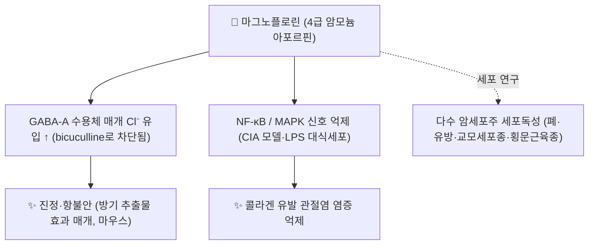

# 🔬 마그노플로린 (Magnoflorine, C₂₀H₂₄NO₄⁺)

> **핵심 3줄 요약 (Key Summary)**:
> - 🌿 기원 본초 & 화학 계열: [[신이]](목련과 *Magnolia biondii* 등, Flos Magnoliae의 소수 수용성 성분 중 하나, PMID 18673228), [[방기]](*Sinomenium acutum*), [[후박]], [[황련]]에 함유된 **4급 암모늄 아포르핀(Aporphine) 알칼로이드**.
> - 🎯 핵심 분자 표적 & 조절 경로: 방기 추출물의 진정·항불안 효과에서 magnoflorine이 GABA-A 수용체 매개 Cl⁻ 유입을 증가시키고 이는 bicuculline(GABA-A 길항제)으로 차단되었다(마우스·신경모세포종, PMID 23456265). 콜라겐 유발 관절염(CIA) 모델·LPS 자극 대식세포에서 NF-κB/MAPK 신호 억제가 보고되었다(PMID 37265745).
> - 🩺 주요 약리 활성: 진정·항불안(방기), 류마티스양 관절염 염증 억제(CIA 모델), 항암(다수 암세포주 세포독성, PMID 33182753), 골관절염 네트워크 약리 예측(PMID 41843133). 2026년 종설이 구조 다양성·기전·신약개발 가능성을 정리했다(PMID 41483316).
> - ⚠️ 독성·생체이용률 한계 & 상호작용: 4급 암모늄 양이온 구조로 경구 흡수가 제한적일 것으로 추정되나(미확인) 사람 약동학 자료는 확인되지 않았다. 플라보노이드 [[루테올린]]과 병용 시 랫드에서 상호 약동학 파라미터 변화가 보고되었다(PMID 37731180). 사람 CYP450 상호작용 자료는 확인되지 않는다.

---

## 📌 목차
1. [기본 화학 정보 & 분자 구조식 (Chemical Identity)](#1-기본-화학-정보--분자-구조식-chemical-identity)
2. [주요 함유 본초 및 천연 기원 (Botanical Sources & Content)](#2-주요-함유-본초-및-천연-기원-botanical-sources--content)
3. [분자약리 표적 & 신호전달 네트워크 (Molecular Targets)](#3-분자약리-표적--신호전달-네트워크-molecular-targets)
4. [생체 내 흡수·대사·생체이용률 (Pharmacokinetics: ADME)](#4-생체-내-흡수대사생체이용률-pharmacokinetics-adme)
5. [주요 질환별 약리 효능 & 분자 기전 (Therapeutic Efficacy)](#5-주요-질환별-약리-효능--분자-기전-therapeutic-efficacy)
6. [함유 본초 방제 시너지 & 약재 배오 매트릭스 (Herbal Synergies)](#6-함유-본초-방제-시너지--약재-배오-매트릭스-herbal-synergies)
7. [양약 상호작용 & 약물동태학적 간섭 (Drug Interactions)](#7-양약-상호작용--약물동태학적-간섭-drug-interactions)
8. [💡 사용자 진료실 핵심 필기 & 임상 응용 팁 (Melt-In & High-Yield)](#8--사용자-진료실-핵심-필기--임상-응용-팁-melt-in--high-yield)
9. [출처 및 학술 참고 문헌 (References)](#9-출처-및-학술-참고-문헌-references)

---

## 1. 기본 화학 정보 & 분자 구조식 (Chemical Identity)

### 1.1 화학적 특성
마그노플로린은 벤질이소퀴놀린에서 유래한 **4급 암모늄 아포르핀(Aporphine) 알칼로이드**입니다. [[d-투보쿠라린]]·[[라우리폴린]]·[[마그노쿠라린]]과 마찬가지로 질소 원자에 메틸기 2개가 붙어 영구 양이온을 이룹니다(구조 비교, PubChem 대조).

| 항목 (Property) | 세부 정보 (Specification) |
| :--- | :--- |
| **IUPAC 명칭** | (6aS)-2,10-dimethoxy-6,6-dimethyl-5,6,6a,7-tetrahydro-4H-dibenzo[de,g]quinolin-6-ium-1,11-diol (PubChem) |
| **분자식 / 분자량** | C₂₀H₂₄NO₄⁺ / 342.4 g/mol (양이온) |
| **PubChem CID** | [73337](https://pubchem.ncbi.nlm.nih.gov/compound/73337) |
| **CAS 등록번호** | 2141-09-5 (PubChem 동의어 기준) |
| **화학 골격 분류** | 4급 암모늄 아포르핀 알칼로이드 (Quaternary aporphine alkaloid) |
| **물리화학 지표** | XLogP 2.7 · TPSA 58.9 Ų (PubChem 계산값) |
| **이명** | Escholine, Thalictrine (PubChem 동의어) |

### 1.2 2D 분자 구조식
![[마그노플로린_1_구조식.png|300]]
> [그림 1: ① 2D 화학 구조식 — 마그노플로린(PubChem CID 73337). 다이벤조퀴놀린 골격에 4급 질소(N⁺(CH₃)₂)와 히드록시·메톡시기 4개가 배치되어 있다. 출처: [PubChem](https://pubchem.ncbi.nlm.nih.gov/compound/73337)]

### 1.3 3D 약리 분자 구조 (Interactive Viewer)
> [!abstract]+ 🧪 3D 약리 분자 구조 (Interactive 3D Viewer)
> <iframe src="https://molecule-viewer-rho.vercel.app/?cid=73337" width="100%" height="450px" frameborder="0" allow="webgl" style="border-radius: 8px;"></iframe>

---

## 2. 주요 함유 본초 및 천연 기원 (Botanical Sources & Content)

![[라우리폴린_2_기원식물_방기.jpg|340]]
> [그림 2: ② 기원 식물 실사 — 방기(청풍등, *Sinomenium acutum*)의 잎과 덩굴. 이 추출물(Sinomeni Caulis et Rhizoma)의 진정·항불안 효과를 매개하는 주요 성분이 마그노플로린으로 규명되었다(PMID 23456265). 출처: りなべる, [Wikimedia Commons](https://commons.wikimedia.org/wiki/File:Sinomenium_acutum_239839604.jpg) (CC BY 4.0)]

| 본초명 | 학명 및 기원식물 | 약용 부위 | 함유 근거 |
| :--- | :--- | :--- | :--- |
| [[방기]] (청풍등) | 방기과 / *Sinomenium acutum* | 줄기·뿌리줄기 | 진정·항불안 효과의 활성 성분으로 규명(PMID 23456265) |
| [[신이]] (辛夷) | 목련과 / *Magnolia biondii* 등 | 꽃봉오리(Flos Magnoliae) | 수용성 성분 중 하나로 검출, 종설(PMID 18673228) |
| [[후박]] (厚朴) | 목련과 / *Magnolia officinalis* | 수피 | 마그놀롤·호노키올·마그노쿠라린과 동시 검출(LC-MS/MS, [[마그노쿠라린]] 노트 §2 PMID 41376510) |
| (원문) [[황련]] (黃連) | 미나리아재비과 / *Coptis chinensis* | 뿌리줄기 | 함유 근거 확인 못 함 ⚠️ |

* 신이(Flos Magnoliae)의 성분은 대부분(90% 이상) 테르페노이드·리그난이고, 마그노플로린은 소수의 수용성 알칼로이드 성분 중 하나로 보고되었습니다(PMID 18673228).
* ⚠️ 각 본초별 정량 함유율(%)은 확인하지 못했습니다.

---

## 3. 분자약리 표적 & 신호전달 네트워크 (Molecular Targets)

### 3.1 GABA-A 수용체 매개 진정·항불안 (확인된 기전)
* 방기 추출물(Sinomeni Caulis et Rhizoma, SR) 70% 에탄올 추출물이 마우스에서 운동량 감소·로타로드 저하·티오펜탈나트륨 수면 연장(진정) 및 고가십자미로 개방팔 체류시간 증가(항불안)를 나타냈고, 그 효과는 디아제팜과 비교할 만했습니다. 사람 신경모세포종 세포에서 SR이 용량 의존적으로 Cl⁻ 유입을 늘렸고 이는 GABA-A 경쟁적 길항제 bicuculline으로 차단되었습니다. SR의 주요 성분 중 **마그노플로린만이 유사한 Cl⁻ 유입 증가**를 보였고 역시 bicuculline에 차단되었습니다(de la Peña 등 2013, PMID 23456265).
* 원문의 "벤조디아제핀 결합 부위 상호작용"은 위 연구가 수용체 결합 부위 수준까지 규명한 것은 아니므로(Cl⁻ 유입·bicuculline 차단까지만 확인) 표현을 GABA-A 매개 Cl⁻ 유입으로 정정합니다 ⚠️.

### 3.2 NF-κB/MAPK 억제 — 관절염 염증
* 콜라겐 유발 관절염(CIA) 마우스 모델(DBA/1J)과 LPS 자극 대식세포 모델에서 마그노플로린(5·10·20 mg/kg/d, 메토트렉세이트 대조군 병행)이 염증 반응을 억제했고 NF-κB/MAPK 신호 경로 관여가 제시되었습니다(Wang·Li 등 2023, PMID 37265745). 같은 논문 서론은 마그노플로린의 항불안·항암·항염증 활성이 기존에 보고되어 있다고 정리합니다.

### 3.3 항암 활성 (세포주 수준)
* 마그노플로린이 NCI-H1299(폐암)·MDA-MB-468(유방암)·T98G(교모세포종)·TE671(횡문근육종) 세포주에 대해 세포독성을 나타냈습니다(Bhattacharya 등 2020, PMID 33182753). 사람·동물 항암 효력은 확인되지 않았습니다 ⚠️.

### 3.4 원문 서술 — 근거 미확인
* 원문의 "혈관 내피 NO 생성 촉진 및 평활근 칼슘 유입 차단을 통한 혈압 강하" — 마그노플로린 직접 근거를 찾지 못했습니다 ⚠️.
* 원문의 "비만세포 IgE 매개 탈과립 차단" — 신이(Flos Magnoliae) 전체 추출물 수준의 항알레르기 보고는 있으나(PMID 18673228) 마그노플로린 단독 실험은 확인하지 못했습니다 ⚠️.

---

## 4. 생체 내 흡수·대사·생체이용률 (Pharmacokinetics: ADME)

| 약동학 항목 (원문) | 원문 서술 | 검토 |
| :--- | :--- | :--- |
| 장관 흡수 | 4급 양이온 구조로 서서히 흡수 | ⚠️ 정량 연구 확인 못 함(구조상 4급 암모늄이라는 사실과는 부합) |
| 간·신장 대사 | 탈메틸화·글루쿠론산 포합 후 담즙·신장 배설 | ⚠️ 마그노플로린 특이적 대사 경로 연구 확인 못 함 |
| [[루테올린]]과의 상호작용 | 병용 시 서로의 약동학 파라미터 변화 | 랫드 PK 상호작용 연구(PMID 37731180) — 구체적 수치(AUC·Cmax 변화율)는 원문 확인 못 함 ⚠️ |

* ⚠️ 마그노플로린의 사람 대상 흡수·분포·대사·배설 정량 연구는 확인되지 않았습니다.

---

## 5. 주요 질환별 약리 효능 & 분자 기전 (Therapeutic Efficacy)

| 적응증 | 근거 수준 | 근거 |
| :--- | :--- | :--- |
| 불안·수면장애 (방기 배오) | 동물(마우스)·세포 | GABA-A 매개 Cl⁻ 유입, 디아제팜과 비교 가능한 효과(PMID 23456265) |
| 류마티스양 관절염 | 동물(CIA 마우스)·세포(대식세포) | NF-κB/MAPK 억제(PMID 37265745) |
| 골관절염 (신규, 네트워크 약리) | 네트워크 약리+시험관 검증 | 예측 후 일부 in vitro 검증(PMID 41843133) — 임상 근거 아님 ⚠️ |
| 암 (폐·유방·교모세포종·횡문근육종) | 세포주 | 세포독성 관찰(PMID 33182753) |
| 알레르기성 비염·축농증 (원문, 신이 배오) | 본초 수준 종설 | Flos Magnoliae 전체의 항알레르기 활성 보고, 마그노플로린 단독 근거는 아님(PMID 18673228) ⚠️ |

⚠️ 위 적응증 중 사람 대상 임상시험이 확인된 것은 없습니다. 모두 동물·세포 수준 근거입니다.

---

## 6. 함유 본초 방제 시너지 & 약재 배오 매트릭스 (Herbal Synergies)

| 함유 본초 / 방제 | 공존 유효 성분군 | 원문의 연계 서술 | 검토 |
| :--- | :--- | :--- | :--- |
| [[신이산]] ([[신이]]+[[백지]]+[[세신]]+[[방풍]] 등) | 마그노플로린 등 알칼로이드 | 비점막 혈류 개선 및 항염증 다표적 네트워크 | ⚠️ 마그노플로린 단독 역할 미검증 |
| [[방기황기탕]] ([[방기]]+[[황기]]+[[백출]]) | 마그노플로린, [[시노메닌]] | 관절강 내 항염증 및 이수소종 시너지 | 방기의 마그노플로린은 관절염 억제 근거 있음(§3.2), 시노메닌과의 시너지 자체는 미검증 |
| [[황련해독탕]] ([[황련]]+[[황금]]+[[황백]]+[[치자]]) | 마그노플로린, [[베르베린]] | 청열해독 경로 NF-κB 억제 시너지 | ⚠️ 황련 함유 근거 자체 미확인(§2) |

---

## 7. 양약 상호작용 & 약물동태학적 간섭 (Drug Interactions)

* **루테올린 병용 시 약동학적 간섭**: 랫드 실험에서 [[루테올린]]과 마그노플로린을 함께 투여하면 서로의 약동학 파라미터가 변화했습니다(PMID 37731180). 플라보노이드·알칼로이드가 함께 든 본초 전탕(예: 신이·후박 혼합 처방)에서 흡수·대사 간섭 가능성을 시사하나, 사람 자료는 아닙니다 ⚠️.
* **중추신경계 진정제 병용 이론적 유의**: GABA-A 매개 Cl⁻ 유입 증가가 확인되었으므로(PMID 23456265) 벤조디아제핀계 등 기존 진정제·항불안제와 병용 시 진정 작용이 더해질 가능성을 이론적으로 고려할 수 있습니다. 사람 병용 연구는 없습니다 ⚠️.
* 사람 CYP450 상호작용 임상 데이터는 확인되지 않았습니다.

---

## 8. 💡 사용자 진료실 핵심 필기 & 임상 응용 팁 (Melt-In & High-Yield)

* 현재 별도로 기록된 원장님 임상 필기가 없습니다.

---

## 9. 출처 및 학술 참고 문헌 (References)

1. **Nazir MM, Mustafa G, Saeed S, et al. (2026)**. *Magnoflorine and its structural diversity: mechanisms, and drug discovery opportunities a review*. **Mol Divers**, 30(4):4843-4867. [PMID 41483316](https://pubmed.ncbi.nlm.nih.gov/41483316/) · [DOI](https://doi.org/10.1007/s11030-025-11440-y)
   - **[연구 요약]**: 마그노플로린의 구조 다양성·분자 기전·신약개발 가능성을 종합한 2026년 종설.
2. **de la Peña JB, Lee HL, Yoon SY, et al. (2013)**. *The involvement of magnoflorine in the sedative and anxiolytic effects of Sinomeni Caulis et Rhizoma in mice*. **J Nat Med**, 67(4):814-821. [PMID 23456265](https://pubmed.ncbi.nlm.nih.gov/23456265/) · [DOI](https://doi.org/10.1007/s11418-013-0754-3)
   - **[연구 요약]**: 방기 추출물의 진정·항불안 효과를 마그노플로린이 GABA-A 매개 Cl⁻ 유입(bicuculline 차단)으로 매개함을 규명.
3. **Wang L, Li P, Zhou Y, et al. (2023)**. *Magnoflorine Ameliorates Collagen-Induced Arthritis by Suppressing the Inflammation Response via the NF-κB/MAPK Signaling Pathways*. **J Inflamm Res**, 16:2271-2296. [PMID 37265745](https://pubmed.ncbi.nlm.nih.gov/37265745/) · [DOI](https://doi.org/10.2147/JIR.S406298)
   - **[연구 요약]**: 콜라겐 유발 관절염 마우스·LPS 대식세포 모델에서 NF-κB/MAPK 억제를 통한 항염증 효과 규명.
4. **Bhattacharya S, et al. (2020)**. *Magnoflorine-Isolation and the Anticancer Potential against NCI-H1299 Lung, MDA-MB-468 Breast, T98G Glioma, and TE671 Rhabdomyosarcoma Cancer Cells*. **Biomolecules**, 10(11):1552. [PMID 33182753](https://pubmed.ncbi.nlm.nih.gov/33182753/)
   - **[연구 요약]**: 마그노플로린의 다수 암세포주에 대한 세포독성 관찰.
5. **Shen Y, Li CG, Zhou SF, et al. (2008)**. *Chemistry and bioactivity of Flos Magnoliae, a Chinese herb for rhinitis and sinusitis*. **Curr Med Chem**, 15(16):1616-1627. [PMID 18673228](https://pubmed.ncbi.nlm.nih.gov/18673228/)
   - **[연구 요약]**: 신이(Flos Magnoliae)의 화학 성분·생리활성 종설, 마그노플로린을 소수 수용성 알칼로이드로 언급.
6. **(요약 확인)** *Pharmacokinetic study of the interaction between luteolin and magnoflorine in rats*. **Chem Biol Drug Des**. 2024 Jan. [PMID 37731180](https://pubmed.ncbi.nlm.nih.gov/37731180/) — 초록 본문은 접속 오류로 확인 못함, 제목·서지정보는 PubMed 색인으로 확인 ⚠️.
7. PubChem Compound Summary — Magnoflorine (CID 73337): [https://pubchem.ncbi.nlm.nih.gov/compound/73337](https://pubchem.ncbi.nlm.nih.gov/compound/73337)

**이미지 출처·라이선스**
- 그림 1: PubChem 2D 구조식 (CID 73337) — 공공 데이터
- 그림 2: りなべる, *Sinomenium acutum* — [Commons](https://commons.wikimedia.org/wiki/File:Sinomenium_acutum_239839604.jpg), CC BY 4.0
