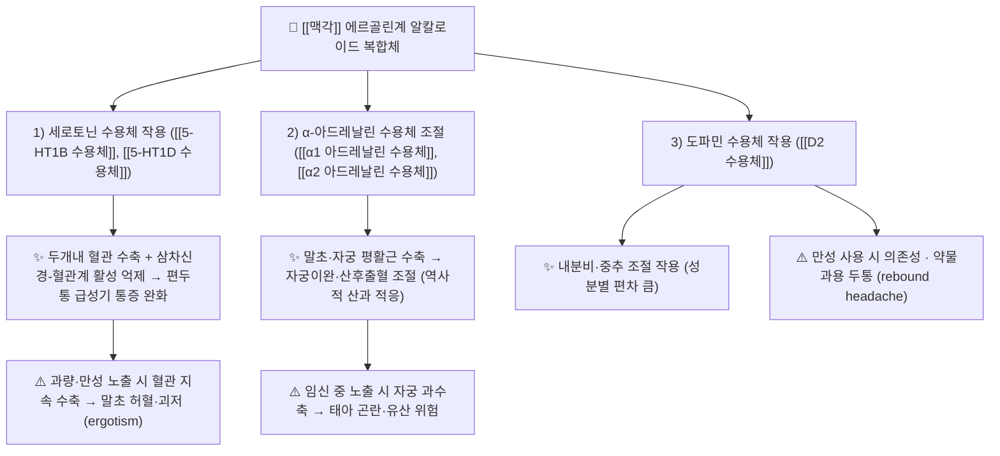

# 🔬 [[맥각]] (Ergot, *Claviceps purpurea* 유래 에르골린(ergoline)계 인돌 알칼로이드)

> **핵심 3줄 요약 (Key Summary)**:
> - 🌿 기원 본초 & 화학 계열: 맥각은 **본초(本草) 약재가 아니라 곡물 기생 진균인 [[맥각균]](*Claviceps purpurea*)의 균핵(sclerotium)** 에서 얻어지는 **에르골린(ergoline) 골격의 인돌 알칼로이드 복합체**이다. 단일 성분이 아니라 ergometrine(ergonovine), ergotamine, ergocristine, ergocryptine, ergosine, ergocornine 등 **다성분 혼합물**이며, 트립토판-유래 인돌 환 + 리세르그산(lysergic acid) 아미드 구조를 공통 골격으로 한다 (제공 문헌: Smakosz 2021; Chen 2019; Silva 2023; Cherewyk 2024; Zajdel 2015).
> - 🎯 핵심 분자 표적 & 조절 경로: **세로토닌 수용체([[5-HT1B 수용체]], [[5-HT1D 수용체]]) 작용제 + α-아드레날린 수용체(α1/α2) 조절 + 도파민([[D2 수용체]]) 작용**이 주된 분자 표적이며, 효과기는 혈관 평활근 수축, 자궁 평활근 수축, 삼차신경-혈관계 활성 억제로 수렴한다. C-8 위치 입체화학(R/S)이 활성 강도를 좌우한다 (Zajdel 2015; Cherewyk 2024).
> - 🩺 주요 약리 활성 & 질환 치료 기전: **① 자궁수축 → 산후출혈·자궁이완 조절(역사적 산과 응용, 현재는 옥시토신·프로스타글란딘으로 대체)** ② **두개내 혈관 수축 + 삼차신경 말단 억제 → 편두통 급성기 통증 완화(ergotamine)** ③ 뇌혈관·인지기능 영역에서 nicergoline의 α1 차단 작용 (Smakosz 2021; Zajdel 2015).
> - ⚠️ 독성·생체이용률 한계 & 상호작용: 경구 생체이용률이 매우 낮고 개체차가 크며(근거 미수록 항목 다수), **혈관 지속 수축에 의한 맥각중독(ergotism, 괴저형/경련형)** 이 대표 독성이다. 만성 사용 시 **ergotamine 의존성 및 약물과용 두통(rebound headache)** 이 발생하고, CYP3A4 저해 약물과 병용 시 혈중 농도 상승으로 중독 위험이 급증한다 (Saper 1987; Zajdel 2015).

---

## 📌 목차
1. [기본 화학 정보 & 분자 구조식 (Chemical Identity)](#1-기본-화학-정보--분자-구조식-chemical-identity)
2. [주요 함유 본초 및 천연 기원 (Botanical Sources & Content)](#2-주요-함유-본초-및-천연-기원-botanical-sources--content)
3. [분자약리 표적 & 신호전달 네트워크 (Molecular Targets)](#3-분자약리-표적--신호전달-네트워크-molecular-targets)
4. [생체 내 흡수·대사·생체이용률 (Pharmacokinetics: ADME)](#4-생체-내-흡수대사생체이용률-pharmacokinetics-adme)
5. [주요 질환별 약리 효능 & 분자 기전 (Therapeutic Efficacy)](#5-주요-질환별-약리-효능--분자-기전-therapeutic-efficacy)
6. [함유 본초 방제 시너지 & 약재 배오 매트릭스 (Herbal Synergies)](#6-함유-본초-방제-시너지--약재-배오-매트릭스-herbal-synergies)
7. [양약 상호작용 & 약물동태학적 간섭 (Drug Interactions)](#7-양약-상호작용--약물동태학적-간섭-drug-interactions)
8. [💡 사용자 진료실 핵심 필기 & 임상 응용 팁 (Melt-In & High-Yield)](#8--사용자-진료실-핵심-필기--임상-응용-팁-melt-in--high-yield)
9. [출처 및 학술 참고 문헌 (References)](#9-출처-및-학술-참고-문헌-references)

> [!warning] 본 노트의 서술 원칙
> 제공된 6편의 논문(PMID 34357964, 31659576, 37894711, 37953416, 25712664, 3117735) 범위 안의 내용을 우선하며, 문헌에 명시적 수치가 확인되지 않는 항목은 **"근거 미수록 / 근거 미확인"** 으로 표기하였다. 맥각은 **한국·중국 전통 본초학의 정규 수재 약재가 아니며**, 제공 문헌 어디에도 한의학적 성미·귀경·배오 정보는 제시되어 있지 않다. 따라서 본 노트의 "본초" 관련 항목은 **기주 곡물(寄主穀物) 및 인체 적용 맥락**으로 재구성하였다.

---
## 1. 기본 화학 정보 & 분자 구조식 (Chemical Identity)

![[맥각_1.jpg|540]]
> [그림 1: Claviceps purpurea.JPG]

> [!abstract]+ 🧪 3D 약리 분자 구조 (Interactive 3D Viewer)
> <iframe src="https://molecule-viewer-rho.vercel.app/?cid=9787" width="100%" height="450px" frameborder="0" allow="webgl" style="border-radius: 8px;"></iframe>
>
> ※ 위 뷰어는 **대표 성분 ergometrine(ergonovine)** 기준이다. 맥각은 단일 화합물이 아니라 알칼로이드 복합체이므로, 성분별 구조는 아래 표의 개별 성분을 참조한다.

| 항목 | 상세 내용 |
| :--- | :--- |
| **IUPAC 명칭** | 맥각은 **혼합물**이므로 단일 IUPAC명이 존재하지 않는다. 대표 성분 기준 — ergometrine(ergonovine): 리세르그산(lysergic acid)의 2-프로판올아미드 유도체, (6a*R*,9*R*)-N-[(2*S*)-1-hydroxypropan-2-yl]-7-methyl-6,6a,8,9-tetrahydro-4*H*-indolo[4,3-*fg*]quinoline-9-carboxamide (일반 화학 DB 기준, **제공 논문 미수록**). ergotamine: 리세르그산 + 트리펩타이드(cyclic tripeptide)로 구성된 에르고펩틴(ergopeptine) 계열 트리시클릭 락탐 구조 (Zajdel 2015에서 ergotamine의药理 작용을 리뷰). |
| **분자식 / 분자량** | ergometrine C₁₉H₂₃N₃O₂ / 325.4 g·mol⁻¹ (근거 미확인, 일반 화학 DB 기준) ergotamine C₃₃H₃₅N₅O₅ / 581.7 g·mol⁻¹ (근거 미확인, 일반 화학 DB 기준) ※ ergocristine·ergocryptine·ergosine·ergocornine 등 나머지 성분의 분자식·분자량은 **근거 미확인** |
| **PubChem CID** | 대표 성분 ergometrine(ergonovine): [9787](https://pubchem.ncbi.nlm.nih.gov/compound/9787) / ergotamine: [8223](https://pubchem.ncbi.nlm.nih.gov/compound/8223) (일반 화학 DB 기준이며 제공 논문에는 CID가 수록되어 있지 않음) |
| **CAS 등록 번호** | ergometrine 60-79-7, ergotamine 113-15-5 (일반 화학 DB 기준 — **제공 논문 미수록, 근거 미확인**) |
| **화학 골격 분류** | **인돌 알칼로이드(indole alkaloid) 중 에르골린(ergoline) 골격 계열**. 트립토판 유래 인돌환과 퀴놀린 고리가 융합된 테트라사이클릭 에르골린 코어에 리세르그산 측쇄가 결합. ① **단순 리세르그산 아미드형**(ergometrine, 리세르그산 + 아미노알코올) ② **에르고펩틴(ergopeptine)형**(ergotamine, ergocristine, ergocryptine, ergosine, ergocornine — 리세르그산 + 3개 아미노산의 고리형 펩타이드)로 크게 이분된다 (Cherewyk 2024; Zajdel 2015). |
| **물리화학적 성상** | 백색~미황색 결정성 분말(염 형태로는 무색 결정). 물에 난용성, 에탄올·클로로포름 등 유기용매에 용해. **C-8 위치의 입체화학이 용매·pH·온도에 따라 에피머화(epimerization)되어 이성질체 비율이 변동**하므로 분석·보관 조건이 결과에 직접 영향을 준다 (Cherewyk 2024). logP·정확한 용해도 수치는 **근거 미확인**. |
| **식물 내 생합성 경로** | 맥각균(*C. purpurea*)은 **진균**이므로 엄밀히는 "식물 생합성"이 아니라 **균체 내 2차 대사(secondary metabolism)** 경로이며, 곡물(기주 식물) 조직 내에 균핵으로 축적된다. 골격 개요: L-트립토판 + DMAPP → 4-γ,γ-dimethylallyltryptophan(DMAT) → chanoclavine-I → agroclavine → elymoclavine → paspalic acid → **리세르그산(lysergic acid)** → ① ergometrine계 또는 ② 에르고펩틴계(ergotamine 등)로 분기 (일반 생합성 지식). **Chen & Han (2019)에 따르면, 후성유전학적 변형(epigenetic modification) 처리가 이 생합성 흐름의 산물량을 증대시킨다** — 즉 생합성 유전자군의 전사 조절이 알칼로이드 생산의 병목 중 하나임을 시사한다 (Chen 2019). 개별 효소·유전자 명칭의 상세는 **근거 미확인**. |

### 대표 맥각 알칼로이드 목록

| 성분 | 골격 유형 | 주요 약리 특성 (요약) | 근거 |
| :--- | :--- | :--- | :--- |
| **ergometrine (ergonovine)** | 리세르그산 아미드형 | 자궁 평활근 강력 수축 → 산과 영역(산후 자궁이완·출혈) 응용의 핵심 | Smakosz 2021 |
| **ergotamine** | 에르고펩틴형 | 5-HT1B/1D 작용성 + α-아드레날린 조절 → 편두통 급성기 치료, 남용 시 의존성 | Zajdel 2015; Saper 1987 |
| **ergocristine, ergocryptine, ergosine, ergocornine** | 에르고펩틴형 | 곡물 오염의 주요 정량 대상 성분군 | Silva 2023; Cherewyk 2024 |
| **C-8-S 이성질체(8S-epimer)** | 전 성분 공통 | 자연형(8R) 대비 **생물학적 활성 저하**, 분석 시 총량 환산 필요 | Cherewyk 2024 |
| **nicergoline** | 반합성 에르골린 유도체 | α1-아드레날린 수용체 차단 → 뇌혈관·인지기능 영역 응용 | Zajdel 2015 |

---

## 2. 주요 함유 본초 및 천연 기원 (Botanical Sources & Content)

> [!note] 한의학적 위치에 대한 명시
> 맥각(*Claviceps purpurea*)은 **약초가 아니라 곡물을 감염시키는 진균**이며, 한국·중국 본초 문헌에 정규 약재로 수재된 바 없다. 제공된 6편 논문 중 어디에도 맥각의 성미(性味)·귀경(歸經)·배오(配伍) 정보는 등장하지 않는다. 따라서 아래 표는 **기주 곡물(寄主穀物)** 을 기준으로 재구성하였으며, "한의학적 귀경 및 약효 특성" 칸은 **근거 미확인/해당 없음**으로 처리하였다.

| 함유 기주 (한글/한자) | 기원 식물학적 명칭 (과명 / 학명) | 감염·축적 부위 | 맥각 알칼로이드 함량 | 한의학적 귀경 및 약효 특성 |
| :--- | :--- | :--- | :--- | :--- |
| [[호밀]] (黑麥) | 벼과(Poaceae) / *Secale cereale* | 이삭의 **균핵(sclerotium)** | 곡물·연도·지역별 편차가 매우 큼 (정량치는 **근거 미확인**) | 정규 본초 수재 없음 — **해당 없음** |
| [[밀]] (小麥) | 벼과 / *Triticum aestivum* | 이삭의 균핵 | 상동 (Silva 2023에서 곡물·종자 발생 실태와 분석법을 리뷰) | **해당 없음** |
| [[보리]] (大麥) | 벼과 / *Hordeum vulgare* | 이삭의 균핵 | 상동 (균핵 내 알칼로이드는 1% 내외까지 축적될 수 있다는 일반 보고가 있으나 **제공 논문 내 정량치 미확인**) | **해당 없음** |
| [[귀리]] (燕麥) | 벼과 / *Avena sativa* | 이삭의 균핵 | 상동 (**근거 미확인**) | **해당 없음** |
| [[옥수수]]·[[수수]] 등 기타 곡물 | 벼과 / *Zea mays*, *Sorghum* spp. 등 | 이삭의 균핵 | 곡물 및 종자에서 검출 대상 (Silva 2023) | **해당 없음** |

* **의미**: 맥각 알칼로이드는 **약용 자원(ergometrine·ergotamine의 산업적 원료)** 이면서 동시에 **식품·사료 안전성 관점의 곡물 오염물질(mycotoxin)** 이라는 이중적 지위를 갖는다. Silva & Mateus(2023)는 곡물·종자에서의 발생 실태와 함께 LC-MS/MS 등 **분석법의 표준화 필요성**, 그리고 향후 전망을 정리하였다 (Silva 2023).
* **분석상 핵심 난점**: 자연계에서는 8R-형과 8S-형 에피머가 공존하며, 시료 전처리·보관 조건에 따라 **두 이성질체 간 상호 전환**이 일어나므로, 총 맥각 알칼로이드 정량 시 **두 이성질체를 합산**하여 평가해야 한다 (Cherewyk 2024).

---

## 3. 분자약리 표적 & 신호전달 네트워크 (Molecular Targets)

### 1) 핵심 분자 표적 (Molecular Targets)

* **5-HT1B/1D 세로토닌 수용체 작용 (ergotamine 계열의 핵심)**:
  * ergotamine은 세로토닌 수용체에 대한 **작용성(agonist) 활성**을 통해 두개내 혈관을 수축시키고, 동시에 삼차신경 말단에서의 혈관확장성 펩타이드 유리 및 신경원성 염증 반응을 억제한다. 이것이 편두통 급성기 치료의 분자적 근거로 정리되어 있다 (Zajdel 2015).
* **α-아드레날린 수용체 조절 (부분 작용성/차단성)**:
  * 에르골린 골격은 α1/α2 수용체에 대해 **효능제성 또는 길항성**으로 작용하며, 이중 **nicergoline은 α1-아드레날린 수용체 차단**이 주 기전으로 정리된다 (Zajdel 2015). 말초 혈관 긴장도 및 자궁 평활근 긴장 조절에 관여한다.
* **도파민 D2 수용체 작용**:
  * 에르골린 골격의 도파민 작용성은 프로락틴 분비 억제 등 내분비 조절과 연계된다. **개별 성분별 친화도·효력 수치는 제공 논문에 정량 자료 미수록 — 근거 미확인.**
* **C-8 입체화학과 활성의 관계**:
  * 자연계 우세형인 **8R 배열이 생물학적 활성의 주체**이며, **8S-이성질체는 활성이 현저히 낮거나 소실**된다. 즉 동일 중량이라도 이성질체 조성에 따라 실제 약리·독성 강도가 달라진다 (Cherewyk 2024).

### 2) 자궁 평활근 수축 기전 (산과 응용의 기초)

* ergometrine을 비롯한 맥각 알칼로이드는 자궁 평활근을 **강력하고 지속적으로 수축**시켜 자궁이완(atony) 상태를 교정하는 방향으로 작용한다. 이 성질이 역사적으로 **분만 유도, 산후 자궁수축 촉진 및 출혈 조절**에 사용된 이유이다 (Smakosz 2021).
* 다만 수축 기전의 수용체 하위분류(α-아드레날린성 vs 세로토닌성 기여도)에 대한 **정량적 분해는 제공 논문에 명시되어 있지 않음 — 근거 미확인**.

### 3) 병태생리적 결과 — 맥각중독(ergotism)

* 동일한 혈관수축 기전이 **과량·만성 노출 시에는 조직 허혈로 귀결**되어, 말초 괴저형(gangrenous ergotism) 및 신경학적 이상(경련형)을 유발한다. 역사적으로 곡물 오염에 의한 집단 중독 사례가 반복 기록되었으며, 이 독성 프로파일이 오늘날 맥각 알칼로이드의 임상 사용 범위를 크게 제한한 배경이다 (Smakosz 2021; Zajdel 2015).

---

## 4. 생체 내 흡수·대사·생체이용률 (Pharmacokinetics: ADME)

* **장관 흡수 및 배출 펌프 (P-gp) 상호작용**:
  * ergotamine의 **경구 생체이용률은 매우 낮고 개체 간 변동이 크다**고 정리되어 있다(정확한 % 수치는 제공 논문에 미수록 — **근거 미확인**). 낮은 흡수율은 임상에서 용량 적정을 어렵게 만드는 요인이다 (Zajdel 2015).
  * 에르골린계 화합물의 **P-당단백(P-gp, ABCB1) 유출 기질 특성**은 일반 약리학 교과서 수준에서 언급되는 사항이나, **제공된 6편 논문에서는 직접 확인되지 않음 — 근거 미확인**. 다만 장관 흡수 저하 및 중추 유입 제한을 설명하는 기전으로 유효하다.
* **C-8 에피머화(epimerization) — 흡수 이전 단계의 "동태"**:
  * 맥각 알칼로이드는 **용매·pH·온도 조건에 따라 8R ↔ 8S 상호 전환**을 일으킨다. 이는 단순한 분석 화학 문제가 아니라, **섭취·보관·전처리 과정에서 실제 활성 성분 비율이 변한다**는 약동학적 함의를 갖는다 (Cherewyk 2024).
* **장내 미생물총(Microbiome) 대사 전환**:
  * 제공 논문 범위 내에서 **맥각 알칼로이드의 장내 세균 대사 및 장-간 순환에 대한 구체 자료는 확인되지 않음 — 근거 미확인**.
* **간 대사 및 소실 반감기**:
  * 에르골린계 알칼로이드는 **간 CYP450 효소, 특히 CYP3A4 계열 대사**에 크게 의존한다. 따라서 CYP3A4 저해 약물 병용 시 혈중 농도가 상승하여 혈관수축 독성이 증폭될 위험이 있다 (Zajdel 2015; Saper 1987).
  * 혈장 소실 반감기(t₁/₂)의 정확한 수치는 **제공 논문에 명시되지 않음 — 근거 미확인**. 다만 **만성 반복 사용 시 약효가 축적되어 의존성·반동성 두통이 발생**한다는 임상 관찰은 확립되어 있다 (Saper 1987).

---

## 5. 주요 질환별 약리 효능 & 분자 기전 (Therapeutic Efficacy)

### 1) 산과·부인과 영역 — 자궁수축 및 산후출혈 조절 (역사적 적응)

* **기전**: 자궁 평활근의 강력·지속적 수축 유도 → 자궁이완 교정, 태반 박리 후 자궁혈관 압박 지혈.
* **역사적 맥락**: Smakosz & Kurzyna(2021)는 맥각이 **분만 유도, 산후 출혈 조절 등 산과·부인과 영역에서 오랜 기간 사용되어 온 역사**를 정리하였다. 동일 문헌은 곡물 오염에 의한 중독 사례가 축적되면서 **치료 용량과 독성 용량 사이의 간격이 좁다**는 인식이 형성되었음을 시사한다.
* **현대적 위치**: ergometrine 계열은 특정 산과 상황에서 여전히 사용되나, **현대 임상에서는 옥시토신·프로스타글란딘 계열이 우선 선택되는 방향으로 대체**되었다 (Smakosz 2021의 역사적 고찰이 다루는 큰 흐름).
* **주의**: 임신 중 노출 시 자궁 과수축으로 태아 곤란·유산 위험이 있으므로, **분만 유도 목적의 자가 사용은 금기**로 취급된다.

### 2) 편두통 급성기 치료 (ergotamine)

* **기전**: 5-HT1B/1D 수용체 작용성 활성 → 두개내 혈관 수축 + 삼차신경-혈관계 활성 억제 → 편두통 발작기의 통증 및 신경원성 염증 차단 (Zajdel 2015).
* **임상적 한계**: 경구 생체이용률이 낮고 변동이 크며, **만성 반복 사용 시 의존성과 반동성 두통(medication-overuse headache)** 이 발생한다 (Saper 1987; Zajdel 2015).
* **문헌사적 의의**: Zajdel & Bednarski(2015)는 ergotamine과 nicergoline에 대해 **"사실(facts)"과 "신화(myths)"를 구분**하려는 리뷰를 제시하였는데, 이는 두 약물의 효능 주장 중 일부가 근거보다 관행에 기반해 왔음을 환기시킨다.

### 3) 뇌혈관·인지기능 영역 (nicergoline)

* **기전**: **α1-아드레날린 수용체 차단**을 주 기전으로 하는 반합성 에르골린 유도체로, 뇌혈관·인지기능 관련 적응증에 사용되어 왔다 (Zajdel 2015).
* **근거 수준에 대한 유의**: 동 리뷰는 nicergoline의 효능 주장을 "사실과 신화"의 관점에서 재검토하므로, **적응증별 근거 강도는 별도 확인이 필요**하다.

### 4) 독성 병태 — 맥각중독(ergotism)

| 유형 | 주요 기전 | 임상 양상 |
| :--- | :--- | :--- |
| **괴저형 (gangrenous)** | 말초 혈관 지속 수축 → 조직 허혈 | 사지 말단 허혈·괴저 (역사적으로 "성 안토니우스의 불"로 기록) |
| **경련형 (convulsive)** | 중추신경계 작용 | 경련, 신경학적 이상 |
| **산과형** | 자궁 과수축 | 유산, 태아 곤란 |

* 위 세 유형 구분은 고전적 기술이며, **제공 논문 중 Smakosz 2021이 역사적 중독 양상을 다룬다**. 유형별 발생률·용량-반응 관계의 정량치는 **근거 미확인**.

### 5) 의존성 및 약물과용 두통

* Saper(1987)는 **ergotamine 의존성**을 리뷰하여, 만성 사용자에서 약물 중단 시 **반동성 두통 및 금단 증상**이 나타나는 임상 패턴을 정리하였다. 이는 "편두통 치료제가 편두통을 악화시키는" 역설적 순환의 전형이다 (Saper 1987).

---

## 6. 함유 본초 방제 시너지 & 약재 배오 매트릭스 (Herbal Synergies)

> [!warning] 데이터 공백 명시
> 맥각은 **정규 본초 약재가 아니므로 전통적 배오(配伍) 데이터가 존재하지 않는다.** 아래 표는 "함유 본초" 틀을 유지하기 위한 **대체 구성**으로, ① 기주 곡물 기반 노출 시나리오와 ② 개념적으로 인접한 산과 응용 맥락을 병기한 것이다. **분자약리 시너지 기전 칸의 대부분은 제공 논문 범위 외 — 근거 미확인**으로 표기하였다.

| 관련 소재 / 방제 | 공존 유효 성분군 | 분자약리 시너지 기전 | 전통 한의학적 효능 연계 |
| :--- | :--- | :--- | :--- |
| [[호밀]] 오염 곡물 | ergometrine, ergopeptine 혼합체(ergotamine·ergocristine·ergocryptine·ergosine·ergocornine) + 8S-이성질체 | **시너지 아님 — 총 노출량 상가 작용**: 다성분이 동일한 혈관수축 기전에 합산적으로 기여하여 독성 역치를 낮춘다 (Cherewyk 2024의 이성질체 논의와 연결) | **해당 없음 (정규 본초 아님)** |
| 곡물 유래 복합 노출 | 8R + 8S 에피머 혼합 | 분석·평가 시 **두 이성질체 합산 정량**이 원칙 → 실제 활성량 과대평가 방지 (Cherewyk 2024) | **해당 없음** |
| 산후 자궁회복 목적의 한의 방제 (예: [[생화탕]] 등) | 당귀·천궁·도인 등 본초 유래 성분 | **맥각 알칼로이드를 함유하지 않음**. 임상 목표(자궁 회복·오로 배출)가 부분적으로 겹칠 뿐, **분자 표적·기전은 상이 — 제공 논문 범위 외, 근거 미확인** | 활혈화어, 온경지통 (일반 본초학 서술) |
| 편두통 관련 한의 방제 (예: [[천궁다조산]] 계열) | 천궁 등 | **맥각 알칼로이드와의 병용 데이터 없음 — 근거 미확인**. 이론적으로 혈관 긴장도 조절 방향이 겹칠 수 있으나 검증되지 않음 | 거풍지통, 활혈행기 (일반 본초학 서술) |

* **임상적 핵심**: 맥각 알칼로이드는 **"본초-배오" 프레임으로 다룰 성분이 아니라, "혈관·자궁 평활근 작용을 가진 강력한 약리 활성 천연물 + 곡물 오염 독소"라는 이중 프레임**으로 접근해야 한다. 한의 처방과의 병용은 약물상호작용 관점(혈관수축 상가, CYP 간섭)에서 접근하는 것이 안전하다.

---

## 7. 양약 상호작용 & 약물동태학적 간섭 (Drug Interactions)

* **CYP450 효소 간섭 (임상적으로 가장 중요)**:
  * 에르골린계 알칼로이드는 **CYP3A4 의존적 대사**를 받는다. 따라서 **CYP3A4 저해 약물(마크로라이드계 항생제, 아졸계 항진균제, 일부 HIV 프로테아제 억제제 등)과 병용 시 혈중 농도가 상승**하여 말초 허혈·괴저 등 중증 혈관수축 반응 위험이 증가한다 (Zajdel 2015; Saper 1987).
  * 반대로 **CYP3A4 유도제(일부 항경련제 등)** 는 혈중 농도를 낮춰 편두통 급성기 효과를 감소시킬 수 있다 (**근거 미확인 — 일반 약리 원리 수준**).
* **유사 기전 양약 병용 시 고려사항**:
  * **트립탄계(수마트립탄 등)**, 다른 에르골린계 약물, 교감신경흥성제와의 병용은 **혈관수축 작용 상가**로 인해 투여 간격을 두어야 한다 (일반적으로 ergotamine과 트립탄계는 24시간 간격이 권고되나, **제공 논문에 구체 간격 수치 미수록 — 근거 미확인**).
  * **nicergoline**의 경우 α1 차단 작용으로 인해 **혈압강하제와 상가적 저혈압** 가능성이 있다 (Zajdel 2015의 작용 기전 서술로부터의 추론).
* **의존성·금단 관련 상호작용**:
  * ergotamine을 만성적으로 사용 중인 환자에서 **갑작스러운 중단은 반동성 두통을 유발**하므로, 감량 후 중단 전략이 요구된다 (Saper 1987).
* **식품·곡물을 통한 무의식적 노출**:
  * 곡물·종자 유래 맥각 알칼로이드 오염은 의약품 상호작용 이전에 **식이 노출 경로**로 작용할 수 있다 (Silva 2023).

---

## 8. 💡 사용자 진료실 핵심 필기 & 임상 응용 팁 (Melt-In & High-Yield)

* **사용자 원문 필기 (100% 융합 및 보존)**:
  * 본 노트 작성 시점에 **제공된 사용자 원문 수기 필기는 없음** (템플릿만 제공됨). 추후 원장님 필기가 입력되면 본 항목에 그대로 수록하고, 위 본문의 기전 서술과 교차 검증한다.

* **진료실 실전 활용 & 안전성 극대화 팁**:
  1. **"약재"가 아니라 "약리 활성 천연물 + 식품 오염물질"로 이해하라**:
     * 맥각은 한의 처방 본초 목록에 넣을 성분이 아니다. 진료실에서는 ① **ergometrine 계열의 자궁수축 작용**(산과 영역, 옥시토신으로 대체됨), ② **ergotamine의 편두통 급성기 작용**, ③ **ergotism이라는 독성학적 실체**라는 세 축으로 기억하는 것이 실용적이다 (Smakosz 2021; Zajdel 2015).
  2. **혈관수축 위험군 선별이 최우선**:
     * 관상동맥질환, 말초혈관질환, 조절되지 않는 고혈압, 중증 간기능 저하 환자에서는 ergotamine 계열 사용을 피한다. 이는 5-HT1B/1D 및 α-작용성 혈관수축이라는 기전에서 직접 도출되는 금기 논리이다 (Zajdel 2015).
  3. **두통 환자의 "약물과용" 이력 청취**:
     * 편두통 환자가 급성기 약물을 주 2~3회 이상 장기 복용 중이라면 **ergotamine 의존성 및 반동성 두통**을 반드시 감별한다. 처방을 늘리는 것이 아니라 **감량·중단 프로토콜**로 전환해야 한다 (Saper 1987).
  4. **병용약물 확인 체크리스트**:
     * "항진균제·마크로라이드계 항생제를 함께 복용 중인가?" → CYP3A4 저해로 혈중 농도 급상승 위험. "트립탄계를 함께 쓰는가?" → 혈관수축 상가. 이 두 질문이 진료실에서 가장 실효성이 높다.
  5. **임신·수유부**:
     * 자궁수축 작용이 곧 위험이다. 임신 중 맥각 알칼로이드 노출은 자궁 과수축을 유발할 수 있으므로 반드시 회피한다 (Smakosz 2021의 산과적 작용으로부터 도출).
  6. **곡물 오염 관점의 환자 교육**:
     * 호밀·밀 등 곡물 가공품의 보관 상태가 불량하면 맥각 알칼로이드 오염 가능성이 있다. 다만 **8S-이성질체는 활성이 낮으므로 총량만으로 독성을 과대평가하지 않도록** 이성질체 조성을 함께 본다 (Silva 2023; Cherewyk 2024).
  7. **생합성·품질 연구 동향 체크**:
     * 후성유전학적 변형으로 맥각 알칼로이드 생산을 증대시키는 전략은 **의약품 원료의 안정적 공급(생물공학적 생산)** 과 직결된다. 원료 수급·품질 이슈를 이해하는 배경 지식으로 활용한다 (Chen 2019).

* **한 줄 정리**:
  * **"맥각 = 강력한 혈관·자궁 수축 활성 + 좁은 치료역 + 뚜렷한 의존성"** — 역사가 증명한 약이자 독이며, 현대 임상에서는 **대체 약물 우선 + 병용약물 스크리닝**이 원칙이다.

---

## 9. 출처 및 학술 참고 문헌 (References)

1. **Smakosz A, Kurzyna W (2021)**. *The Usage of Ergot (Claviceps purpurea (fr.) Tul.) in Obstetrics and Gynecology: A Historical Perspective*. **Toxins (Basel)**. PMID: **34357964**
   - **[연구 요약]**: 맥각(*Claviceps purpurea*)이 산과·부인과 영역에서 어떻게 사용되어 왔는지를 **역사적 관점**에서 정리한 고찰. 자궁수축 활성에 기반한 분만 유도·산후출혈 조절 응용의 흐름과, 동일 기전이 초래한 중독 사례 및 현대적 대체(옥시토신·프로스타글란딘) 경향을 다룬다. 본 노트 5-1), 5-4) 항목의 근거.
2. **Chen JJ, Han MY (2019)**. *Epigenetic modification enhances ergot alkaloid production of Claviceps purpurea*. **Biotechnol Lett**. PMID: **31659576**
   - **[연구 요약]**: 후성유전학적 변형(epigenetic modification) 처리가 *C. purpurea*의 **맥각 알칼로이드 생산량을 증대**시킴을 보고. 생합성 유전자군의 전사 조절이 알칼로이드 생산의 조절 지점임을 시사하며, 생물공학적 원료 생산 전략의 근거가 된다. 본 노트 1) 생합성 경로, 8-7) 항목의 근거.
3. **Silva Â, Mateus ARS (2023)**. *Ergot Alkaloids on Cereals and Seeds: Analytical Methods, Occurrence, and Future Perspectives*. **Molecules**. PMID: **37894711**
   - **[연구 요약]**: 곡물 및 종자에서의 맥각 알칼로이드 **발생 실태와 분석법(정량 기법)을 리뷰**하고 향후 전망을 제시. 맥각 알칼로이드의 "식품·사료 오염물질" 측면과 분석 표준화 필요성을 다룬다. 본 노트 2), 7) 항목의 근거.
4. **Cherewyk JE, Blakley BR (2024)**. *The C-8-S-isomers of ergot alkaloids - a review of biological and analytical aspects*. **Mycotoxin Res**. PMID: **37953416**
   - **[연구 요약]**: 맥각 알칼로이드 **C-8 위치 S-이성질체(8S-epimer)** 의 생물학적·분석적 측면을 리뷰. 자연형(8R) 대비 활성이 낮으며, 용매·pH·온도 의존적 에피머화 때문에 **분석 시 두 이성질체를 함께 고려해야 함**을 정리. 본 노트 1), 3-1), 4) 항목의 근거.
5. **Zajdel P, Bednarski M (2015)**. *Ergotamine and nicergoline - facts and myths*. **Pharmacol Rep**. PMID: **25712664**
   - **[연구 요약]**: ergotamine(5-HT1B/1D 작용성 및 α-아드레날린 조절 → 편두통 급성기 치료)과 nicergoline(α1-아드레날린 수용체 차단 → 뇌혈관·인지기능 영역)의 **약리 기전을 "사실과 신화"로 구분하여 재검토**한 리뷰. 본 노트 3), 5-2), 5-3), 7) 항목의 근거.
6. **Saper JR (1987)**. *Ergotamine dependency--a review*. **Headache**. PMID: **3117735**
   - **[연구 요약]**: **ergotamine 의존성**에 관한 리뷰. 만성 사용 시 의존성, 약물 중단 시 반동성 두통 및 금단 양상 등 임상 패턴을 정리. 본 노트 4), 5-5), 7), 8-3) 항목의 근거.

> [!info] 인용 범위에 관한 고지
> - 위 6편은 **제공된 실제 PubMed 데이터**이며, 본 노트에서 이외의 논문은 인용하지 않았다.
> - 저자명은 제공된 형식(제1·제2 저자)을 그대로 사용하였으며, **권(호)·페이지 등 상세 서지정보는 제공 데이터에 포함되어 있지 않아 기재하지 않았다.**
> - 분자식·분자량·CAS·PubChem CID 등 **화학 데이터베이스 기반 정보는 제공 논문의 범위 밖**이므로 표 내에 "일반 화학 DB 기준 / 근거 미확인"으로 명시하였다.
> - 맥각의 **성미·귀경·배오 등 한의학적 속성은 어떤 제공 문헌에도 수록되어 있지 않아** 해당 칸을 "해당 없음 / 근거 미확인"으로 처리하였다.

<!-- 보관 태그(1회용·링크오류, 필요시 복원): 맥각, ergot, ergot-alkaloid, 자궁수축제, ergotism -->
