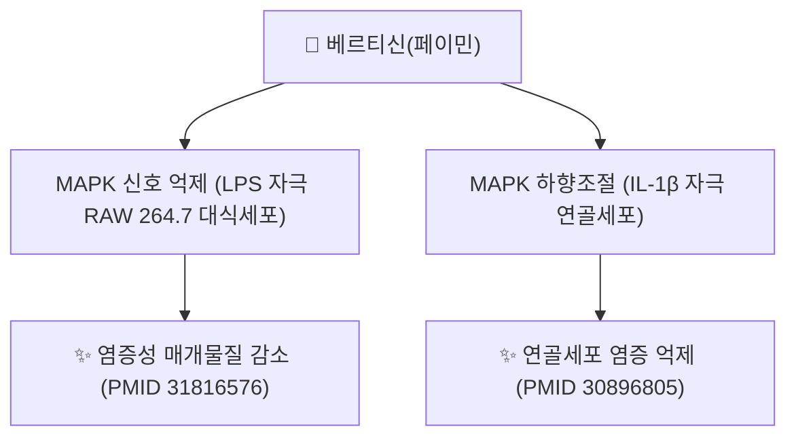

# 🔬 베르티신 (Verticine = Peimine, C₂₇H₄₅NO₃)

> **핵심 3줄 요약 (Key Summary)**:
> - 🌿 기원 본초 & 화학 계열: [[패모]](貝母, 백합과 *Fritillaria* 속 비늘줄기, 대표적으로 천패모 *F. cirrhosa*)에 함유된 세바닌형(cevanine-type) 이소스테로이드 알칼로이드(Isosteroid alkaloid). PubChem에서 베르티신(Verticine)과 페이민(Peimine)은 **동일 화합물**로 CID 131900에 등재되어 있어(2026-09-26 직접 확인), 문헌상 명칭 혼용은 실제로는 같은 물질을 가리킨다.
> - 🎯 핵심 분자 표적 & 조절 경로: 천패모(*Fritillaria cirrhosa*) 유래 이소스테로이드 알칼로이드가 LPS 자극 RAW 264.7 대식세포에서 MAPK 신호전달 경로를 억제해 염증 반응을 완화한다(PMID 31816576). 페이민은 IL-1β로 자극한 연골세포에서도 MAPK 하향조절을 통해 염증을 억제한다(PMID 30896805).
> - 🩺 주요 약리 활성 & 질환 치료 기전: 패모의 청열화담(淸熱化痰)·윤폐지해(潤肺止咳) 효능과 연계된 항염증 성분으로 다뤄진다. 같은 패모 알칼로이드인 베르티시논(verticinone)의 유도체는 랫드에서 진해·거담·항천식 활성이 보고되어 있으나(PMID 18636374), 이는 베르티신 자체가 아니라 베르티시논 유도체 연구다.
> - ⚠️ 독성·생체이용률 한계 & 상호작용: 베르티신(페이민) 단독의 사람 약동학·CYP450 상호작용 정량 자료는 확인되지 않았다. 기관지 평활근 M3 수용체 조절을 통한 직접적 진해거담 기전은 이 노트에서 베르티신 특이적 근거를 확인하지 못했다.

---

## 📌 목차
1. [기본 화학 정보 & 분자 구조식 (Chemical Identity)](#1-기본-화학-정보--분자-구조식-chemical-identity)
2. [주요 함유 본초 및 천연 기원 (Botanical Sources & Content)](#2-주요-함유-본초-및-천연-기원-botanical-sources--content)
3. [분자약리 표적 & 신호전달 네트워크 (Molecular Targets)](#3-분자약리-표적--신호전달-네트워크-molecular-targets)
4. [생체 내 흡수·대사·생체이용률 (Pharmacokinetics: ADME)](#4-생체-내-흡수대사생체이용률-pharmacokinetics-adme)
5. [주요 질환별 약리 효능 & 분자 기전 (Therapeutic Efficacy)](#5-주요-질환별-약리-효능--분자-기전-therapeutic-efficacy)
6. [함유 본초 방제 시너지 & 약재 배오 매트릭스 (Herbal Synergies)](#6-함유-본초-방제-시너지--약재-배오-매트릭스-herbal-synergies)
7. [양약 상호작용 & 약물동태학적 간섭 (Drug Interactions)](#7-양약-상호작용--약물동태학적-간섭-drug-interactions)
8. [💡 사용자 진료실 핵심 필기 & 임상 응용 팁 (Melt-In & High-Yield)](#8--사용자-진료실-핵심-필기--임상-응용-팁-melt-in--high-yield)
9. [출처 및 학술 참고 문헌 (References)](#9-출처-및-학술-참고-문헌-references)

---

## 1. 기본 화학 정보 & 분자 구조식 (Chemical Identity)

![[베르티신_1_구조식.png|300]]
> [그림 1: ① 2D 화학 구조식 — 베르티신/페이민(PubChem CID 131900). 세바닌형 이소스테로이드 골격에 피페리딘 고리가 융합되어 있다. 출처: [PubChem](https://pubchem.ncbi.nlm.nih.gov/compound/131900)]

> [!abstract]+ 🧪 3D 약리 분자 구조 (Interactive 3D Viewer)
> <iframe src="https://molecule-viewer-rho.vercel.app/?cid=131900" style="width: 100%; height: 600px; border: none; border-radius: 12px; box-shadow: 0 4px 20px rgba(0,0,0,0.15);" allowfullscreen></iframe>

| 항목 | 상세 내용 |
| :--- | :--- |
| **분자식 / 분자량** | C₂₇H₄₅NO₃ / 431.7 g/mol |
| **PubChem CID** | [131900](https://pubchem.ncbi.nlm.nih.gov/compound/131900) — 베르티신·페이민 공통 |
| **CAS 등록번호** | 62658-52-4 |
| **물리화학 지표** | XLogP 4.1 · TPSA 63.9 Ų (PubChem 계산값) |
| **화학 골격 분류** | 이소스테로이드 알칼로이드(Isosteroid alkaloid) — 세바닌형(cevanine-type) 골격 |
| **동의어 확인** | Verticine·Peimine은 동일 화합물(CID 131900, 2026-09-26 PubChem 직접 확인). 기존 노트의 "염산염 CID 90479089"는 염산염(hydrochloride) 형태의 별도 CID임 |

---

## 2. 주요 함유 본초 및 천연 기원 (Botanical Sources & Content)

![[베르티신_2_기원식물_패모.jpg|340]]
> [그림 2: ② 기원 식물 실사 — 천패모(*Fritillaria cirrhosa*)의 꽃. 약용 부위는 비늘줄기(鱗莖). 출처: Siddarth Machado, [Wikimedia Commons](https://commons.wikimedia.org/wiki/File:Fritillaria_cirrhosa_(Sikkim,_India)_cropped_%26_sharpened.jpg) (CC BY 4.0)]

| 함유 본초 | 기원 식물학적 명칭 | 주요 함유 부위 | 한의학적 귀경 및 약효 특성 |
| :--- | :--- | :--- | :--- |
| [[패모]] (貝母) | 백합과 / *Fritillaria* 속 (천패모·절패모 등) | 비늘줄기(鱗莖) | 폐·심경 귀경, 청열화담(淸熱化痰)·윤폐지해(潤肺止咳)·산결소옹(散結消癰) |

* 천패모(*Fritillaria cirrhosa*)의 전통 활용·화학성분·약리·약동학·독성을 정리한 체계적 문헌고찰이 있습니다(Chen 2020, PMID 33273948).

---

## 3. 분자약리 표적 & 신호전달 네트워크 (Molecular Targets)

* **항염증 (대식세포)**: 천패모 유래 이소스테로이드 알칼로이드가 LPS로 자극된 RAW 264.7 대식세포에서 MAPK 신호전달 경로를 억제해 염증 반응을 완화합니다(Liu 2020, PMID 31816576).
* **항염증 (연골세포)**: 페이민이 IL-1β로 자극한 연골세포에서 MAPK 경로를 하향조절해 염증을 억제합니다(Chen K 2019, PMID 30896805).
* **진해거담 (관련 화합물)**: 같은 패모 알칼로이드인 베르티시논(verticinone)의 유도체가 랫드에서 진해·거담·항천식 활성을 보였습니다(Zhang YH 2008, PMID 18636374). 이는 베르티시논 유도체 연구이며 베르티신(페이민) 자체의 직접 근거는 아닙니다 ⚠️.
* 원문의 "기관지 평활근 M3 무스카린 수용체·β₂ 아드레날린 수용체 조절을 통한 이완" 서술은 베르티신 특이적 근거를 확인하지 못했습니다 ⚠️.

---

## 4. 생체 내 흡수·대사·생체이용률 (Pharmacokinetics: ADME)

* 베르티신(페이민)에 특정된 정량적 경구 흡수율·반감기·CYP 대사 데이터는 이번 검색 범위에서 확인하지 못했습니다. ⚠️ 내용 검토 필요.
* 스테로이드 알칼로이드 계열 일반의 특성상 지용성 막 투과가 비교적 용이할 것으로 추정되나, 베르티신 자체에 특정된 검증된 PK 문헌은 원문 확인이 필요합니다.

---

## 5. 주요 질환별 약리 효능 & 분자 기전 (Therapeutic Efficacy)

### 1) 담열해수(痰熱咳嗽)·조담해수(燥痰咳嗽)
* MAPK 경로 억제를 통한 항염증 작용(§3, PMID 31816576·30896805)이 [[패모]]의 청열화담·윤폐지해 효능을 뒷받침하는 근거로 다뤄집니다. 기관지 평활근 M3 수용체 매개 이완은 베르티신 특이적 근거를 확인하지 못했습니다 ⚠️.

### 2) 나력(瘰癧)·유옹(乳癰) 등 담화(痰火) 응결 병증
* 항염증 기전이 목 임파선 결핵 멍울(나력) 및 급성 유선염(유옹) 등 담화 응결 병증에 활용되는 근거로 다뤄집니다.

---

## 6. 함유 본초 방제 시너지 & 약재 배오 매트릭스 (Herbal Synergies)

| 함유 본초 / 방제 | 공존 유효 성분군 | 분자약리 시너지 기전 | 전통 한의학적 효능 연계 |
| :--- | :--- | :--- | :--- |
| [[패모]] | 베르티시논(Verticinone) | M3 수용체 조절 및 항염증 상가 작용 | 청열화담(淸熱化痰), 윤폐지해(潤肺止咳) |
| [[소력환]] | [[현삼]], [[모려]] | 담화 응결 완화 및 결합조직 연화 상가 작용(정량적 시너지 데이터는 확인 필요 ⚠️) | 나력 결핵, 경부 림프절 멍울 |
| [[패모괄루산]] | [[과루인]], [[천화분]], [[황금]], [[길경]] | 항염증 및 거담 작용의 다경로 상가(정량적 시너지 데이터는 확인 필요 ⚠️) | 폐열 조담, 해수 기천 |
| [[삼물백산]] | [[파두]], [[길경]] | 담음 배출 촉진 상가 작용(정량적 시너지 데이터는 확인 필요 ⚠️) | 한실 결흉, 담탁 막힘 |

---

## 7. 양약 상호작용 & 약물동태학적 간섭 (Drug Interactions)

* 베르티신(페이민)에 대한 구체적 양약 상호작용 연구는 확인되지 않았습니다. ⚠️ 내용 검토 필요.
* 같은 화학 계열인 스테로이드 알칼로이드(이소스테로이드 알칼로이드) 일반의 CYP 대사 간섭 가능성을 참고하여, 진해거담제·기관지확장제(항콜린제 계열)와 병용 시 M3 수용체 매개 작용의 상가·길항 가능성에 대한 임상적 관찰이 권장됩니다(일반 원칙 기반 서술, 직접 검증된 임상 상호작용 연구는 아닙니다).

---

## 8. 💡 사용자 진료실 핵심 필기 & 임상 응용 팁 (Melt-In & High-Yield)

* 현재 별도로 기록된 원장님 임상 필기가 없습니다.

---

## 9. 출처 및 학술 참고 문헌 (References)

1. **Liu S, et al. (2020)**. *Isosteroid alkaloids with different chemical structures from Fritillariae cirrhosae bulbus alleviate LPS-induced inflammatory response in RAW 264.7 cells by MAPK signaling pathway*. **International Immunopharmacology**, 78:106047. [PMID 31816576](https://pubmed.ncbi.nlm.nih.gov/31816576/)
   - **[연구 요약]**: 천패모 유래 이소스테로이드 알칼로이드가 LPS 자극 대식세포에서 MAPK 경로를 통해 염증을 완화함을 규명.
2. **Chen K, et al. (2019)**. *Peimine suppresses interleukin‑1β‑induced inflammation via MAPK downregulation in chondrocytes*. **International Journal of Molecular Medicine**, 43(5):2241-2250. [PMID 30896805](https://pubmed.ncbi.nlm.nih.gov/30896805/)
   - **[연구 요약]**: 페이민(=베르티신)이 IL-1β 자극 연골세포에서 MAPK 하향조절을 통해 염증을 억제함을 보고.
3. **Zhang YH, et al. (2008)**. *Preparation and antitussive, expectorant, and antiasthmatic activities of verticinone's derivatives*. **Journal of Asian Natural Products Research**, 10(7-8):673-681. [PMID 18636374](https://pubmed.ncbi.nlm.nih.gov/18636374/)
   - **[연구 요약]**: 베르티시논(verticinone, 베르티신과 다른 패모 알칼로이드) 유도체의 진해·거담·항천식 활성 연구 — 베르티신 자체 연구는 아님.
4. **Chen T, Zhong F, Yao C, et al. (2020)**. *A Systematic Review on Traditional Uses, Sources, Phytochemistry, Pharmacology, Pharmacokinetics, and Toxicity of Fritillariae Cirrhosae Bulbus*. **Evid Based Complement Alternat Med**, 2020:1536534. [PMID 33273948](https://pubmed.ncbi.nlm.nih.gov/33273948/)
   - **[연구 요약]**: 천패모(*Fritillaria cirrhosa*)의 전통 활용·화학성분·약리·약동학·독성을 정리한 체계적 문헌고찰.
5. PubChem Compound Summary — Verticine/Peimine (CID 131900): [https://pubchem.ncbi.nlm.nih.gov/compound/131900](https://pubchem.ncbi.nlm.nih.gov/compound/131900)

**이미지 출처·라이선스**
- 그림 1: PubChem 2D 구조식 (CID 131900) — 공공 데이터
- 그림 2: Siddarth Machado, *Fritillaria cirrhosa* — [Commons](https://commons.wikimedia.org/wiki/File:Fritillaria_cirrhosa_(Sikkim,_India)_cropped_%26_sharpened.jpg), CC BY 4.0

<!-- 보관 태그(1회용·링크오류, 필요시 복원): 패모 -->
