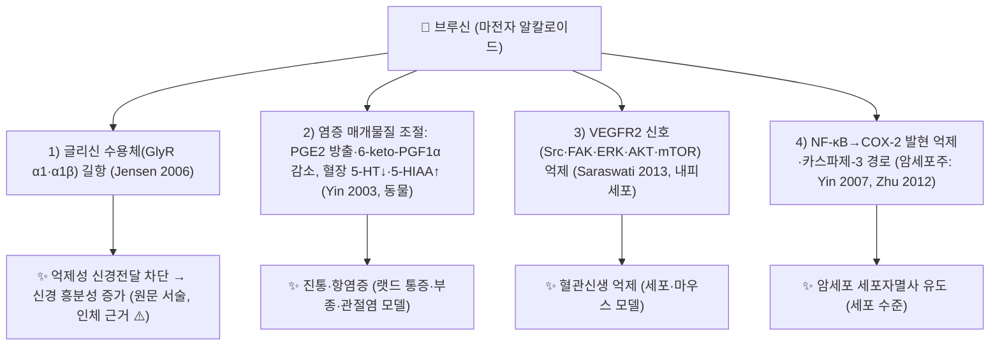

---
aliases:
  - Brucine
  - 브루신 알칼로이드
  - 디메톡시스트리크닌
tags:
  - 약리
  - 약리성분
  - 인돌알칼로이드
  - 마전자
  - 통락지통
title: 브루신
date: 2026-09-21
출처: PMID 12963144
---

# 🔬 브루신 (Brucine, C₂₃H₂₆N₂O₄)

> **핵심 3줄 요약 (Key Summary)**:
> - 🌿 기원 본초 & 화학 계열: 마전과(Loganiaceae) [[마전자]](*Strychnos nux-vomica*)의 종자에 풍부하게 함유된 대표적인 천연 인돌(Indole)계 유독 알칼로이드 화합물.
> - 🎯 핵심 분자 표적 & 조절 경로: 척수 반사궁의 글리신(Glycine) 수용체 길항 작용을 통한 신경 전도 흥분, 진통, 항염증 및 신생혈관 억제 작용.
> - 🩺 주요 약리 활성 & 질환 치료 기전: 마비성 질환(안면마비·소아마비 후유증), 완고한 만성 [[류마티스]] 관절통 및 암성 통증을 치료하는 [[마전자]]의 핵심 활성 지표이자 주의 독성 성분.
> - ⚠️ 독성·생체이용률 한계 & 상호작용: 중추신경계 독성이 임상 적용을 크게 제한하는 성분이며(Lu 2020) 치료창이 좁습니다(Liu 2017). 랫드 경구 생체이용률은 약 40~47%(Chen 2011)이고, 시험관 실험에서 CYP3A4가 주된 대사효소이며 미다졸람 1'-수산화를 억제했습니다(Li 2013). 위 요약의 진통·항염증·항암 서술은 대부분 세포·동물 근거이며, 브루신 단독의 인체 임상 근거는 이번 조회에서 확인하지 못했습니다(§3·§5 참조).

---

## 📌 목차
1. [기본 화학 정보 & 분자 구조식 (Chemical Identity)](#1-기본-화학-정보--분자-구조식-chemical-identity)
2. [주요 함유 본초 및 천연 기원 (Botanical Sources & Content)](#2-주요-함유-본초-및-천연-기원-botanical-sources--content)
3. [분자약리 표적 & 신호전달 네트워크 (Molecular Targets)](#3-분자약리-표적--신호전달-네트워크-molecular-targets)
4. [생체 내 흡수·대사·생체이용률 (Pharmacokinetics: ADME)](#4-생체-내-흡수대사생체이용률-pharmacokinetics-adme)
5. [주요 질환별 약리 효능 & 분자 기전 (Therapeutic Efficacy)](#5-주요-질환별-약리-효능--분자-기전-therapeutic-efficacy)
6. [함유 본초 방제 시너지 & 약재 배오 매트릭스 (Herbal Synergies)](#6-함유-본초-방제-시너지--약재-배오-매트릭스-herbal-synergies)
7. [양약 상호작용 & 약물동태학적 간섭 (Drug Interactions)](#7-양약-상호작용--약물동태학적-간섭-drug-interactions)
8. [💡 사용자 진료실 핵심 필기 & 임상 응용 팁 (Melt-In & High-Yield)](#8--사용자-진료실-핵심-필기--임상-응용-팁-melt-in--high-yield)
9. [출처 및 학술 참고 문헌 (References)](#9-출처-및-학술-참고-문헌-references)

---

## 1. 기본 화학 정보 & 분자 구조식 (Chemical Identity)

> [!abstract]+ 🧪 3D 약리 분자 구조 (Interactive 3D Viewer)
> <iframe src="https://molecule-viewer-rho.vercel.app/?cid=442021" width="100%" height="450px" frameborder="0" allow="webgl" style="border-radius: 8px;"></iframe>

| 항목 | 상세 내용 |
| :--- | :--- |
| **성분명** | 브루신 (Brucine / 10,11-Dimethoxystrychnine) |
| **IUPAC 명칭** | (4aR,5aS,8aR,13aS,15aS,15bR)-10,11-dimethoxy-4a,5,5a,7,8,13a,15,15a,15b,16-decahydro-2H-4,6-methanoindolo[3,2,1-ij]oxepino[2,3,4-de]pyrrolo[2,3-h]quinolin-14-one (PubChem 등록명) |
| **분자식 / 분자량** | C₂₃H₂₆N₂O₄ / 394.46 g/mol (원문 표기, PubChem 394.5) |
| **PubChem CID** | [442021](https://pubchem.ncbi.nlm.nih.gov/compound/442021) |
| **CAS 등록 번호** | 357-57-3 (PubChem 동의어로 확인) |
| **천연 기원 식물** | [[마전자]](馬錢子, 호미자 虎邁子) |
| **화학 골격 분류** | 모노테르펜 인돌 알칼로이드 (스트리크닌 동족체) |
| **물리화학적 성상** | 약염기성(weak alkaline) 인돌 알칼로이드(Lu 2020). 외관·용해도·LogP·안정성 등 그 외 성상은 이번 조회에서 확인한 자료가 없어 기재하지 않음 ⚠️ 내용 검토 필요 |
| **식물 내 생합성 경로** | 이번 조회에서 브루신 고유의 생합성 경로를 확인하지 못함 ⚠️ 내용 검토 필요 (동족체 [[스트리크닌]] 노트 참조) |

> **원문 IUPAC 표기 정정**: 기존 노트의 IUPAC 표기는 입체 기호가 15aR이고 말미가 `quinoline-14-one`이었으나, PubChem(CID 442021) 등록명은 15aS이며 `quinolin-14-one`이므로 PubChem 기준으로 교체했습니다. 3D 뷰어 CID 442021은 PubChem에서 brucine(C23H26N2O4)으로 확인되어 정정이 필요 없었습니다.

* **스트리크닌(Strychnine)과의 독성 비교**:
  * 스트리크닌 구조에 2개의 메톡시기(-OCH3)가 결합된 형태입니다.
  * 중추신경 흥분 독성은 스트리크닌의 약 1/8~1/10 수준으로 낮으나, 항염증 및 말초 신경 마비 치료 작용은 우수하여 한방 가공 포제(모래 볶음 등)를 통해 독성을 완화시켜 임상에 활용합니다.
  * ⚠️ 내용 검토 필요: "약 1/8~1/10" 독성비는 이번 PubMed 조회로 확인하지 못했습니다. 볼트 [[스트리크닌]] 노트는 같은 비교를 "약 1/5"로 적고 있어 볼트 내 수치도 서로 다릅니다. "항염증 및 말초 신경 마비 치료 작용이 스트리크닌보다 우수하다"는 비교 근거와 "모래 볶음 포제로 독성이 완화된다"는 정량 근거도 확인하지 못했습니다. (확인된 것은 브루신·브루신 N-옥사이드의 진통·항염증 활성 보고와 전통 포제법의 목적을 다룬 연구 설계뿐임: Yin 2003)

---

## 2. 주요 함유 본초 및 천연 기원 (Botanical Sources & Content)

| 함유 본초 (한글/한자) | 기원 식물학적 명칭 (과명 / 학명) | 주요 함유 약용 부위 | 지표 함량 (%) | 한의학적 귀경 및 약효 특성 |
| :--- | :--- | :--- | :--- | :--- |
| [[마전자]] (馬錢子, 호미자 虎邁子) | 마전과(Loganiaceae) / *Strychnos nux-vomica* | 성숙한 씨(종자) | 볼트 [[마전자]] 노트는 KP 규격 브루신 0.65% 이상으로 기재(KP 원문은 이번에 확인하지 못함 ⚠️). 임상시험 보고에서 브루신 가공 전 1.425%·가공 후 1.31%로 측정되었고, 같은 논문이 인용한 중국약전 기준은 0.8% 이상(Kong 2011) | 肝·脾經, 苦·寒·大毒, 통락지통(通絡止痛)·산결소종(散結消腫) |

* **본초학적 매핑**:
  * [[마전자]](馬錢子): 극도로 쓰고 차가우며 큰 독이 있음(苦, 寒, 大毒). 간과 비경으로 귀경. 통락지통(通絡止痛), 산결소종(散結消腫).
  * 브루신은 마전자의 "풍습이 깊이 박혀 뼈골이 쑤시고 살이 마비된 것을 뚫어내는" 통락(通絡) 작용의 실체입니다.
* ⚠️ 내용 검토 필요: "브루신이 통락 작용의 실체"라는 서술은 전통 효능과 특정 성분을 직접 연결한 원문 해석이며, 브루신 단독으로 그 효능을 재현했다는 문헌은 이번 조회에서 확인하지 못했습니다. 문헌으로 확인된 것은 마전 종자(*S. nux-vomica*)가 스리랑카·인도·호주에 분포하며 종자가 약용 부위라는 점(Guo 2018)과, 브루신·브루신 N-옥사이드가 생 마전자와 법제 마전자 모두의 주요 알칼로이드로 보고된다는 점(Gao 2023)입니다.

---

## 3. 분자약리 표적 & 신호전달 네트워크 (Molecular Targets)

### 1) 핵심 분자 표적 (Molecular Targets)
* **척수 반사궁 흥분 및 마비 회복 (Glycine Receptor Antagonism)**:
  * 척수 후각 및 연수의 억제성 신경전달물질인 **글리신(Glycine) 수용체**를 경쟁적으로 차단합니다.
  * 감각 자극에 대한 척수의 억제성 개재신경원(Renshaw 세포) 작용을 차단하여 반사 흥분성을 급격히 높임으로써 만성 신경 마비 및 근육 무력증을 깨웁니다.
* **문헌 근거 (GlyR)**: 인간 α1·α1β 글리신 수용체에서 브루신과 스트리크닌이 높은 길항 효능을 보이며 두 아형 사이의 선택성은 없다는 약리학적 특성 분석이 있습니다(Jensen 2006). 브루신을 GlyR 길항제로 전제해 랫드 알코올 섭취 감소를 평가한 연구도 있습니다(Li 2014).
* ⚠️ 내용 검토 필요: 위 원문의 "경쟁적 차단"이라는 결합 양식, "Renshaw 세포 작용 차단", "만성 신경 마비·근육 무력증 회복"은 이번 조회에서 **브루신 단독** 근거를 확인하지 못했습니다(Jensen 2006은 수용체 길항 효능 자료이며 Renshaw 세포·마비 회복을 다루지 않음). Renshaw 세포의 글리신성 억제는 스트리크닌의 고전적 설명입니다.

### 2) 진통 및 항염증 네트워크
* **진통 및 항염증 네트워크**:
  * 중추성 세로토닌 및 오피오이드 경로를 활성화하여 난치성 통증 신호 전달을 차단합니다.
  * COX-2 및 PGE2 생성을 억제하여 관절의 활막 염증을 감소시킵니다.
* **문헌 근거**: 랫드 모델에서 브루신과 브루신 N-옥사이드 모두 열판(hot-plate)·초산 신전(writhing) 시험에서 보호 효과를 보였고, 염증 조직의 [[PGE2]] 방출과 Freund 완전 보강제(FCA) 관절염 랫드 혈장의 6-keto-PGF1α 함량을 줄였으며, 혈장 [[세로토닌]](5-HT)은 낮추고 그 대사체 5-HIAA는 높였습니다. 저자들은 중추와 말초 기전이 모두 관여한다고 결론지었습니다(Yin 2003).
* **COX-2**: 암세포주에서 브루신의 세포자멸사가 COX-2 억제와 카스파제-3 활성화로 부분적으로 설명된다는 보고(Yin 2007), A549 세포에서 IκBα 인산화·p65 핵 이동을 억제해 [[NF-κB]]를 통해 COX-2 발현을 낮춘다는 보고(Zhu 2012)가 있습니다.
* ⚠️ 내용 검토 필요: (1) "중추성 세로토닌·오피오이드 경로 **활성화**"는 Yin 2003이 관찰한 것이 혈장 5-HT 감소·5-HIAA 증가였을 뿐 경로 활성화가 아니며, [[오피오이드]] 경로는 PubMed 검색("brucine serotonin opioid antinociceptive")에서 근거를 찾지 못했습니다. (2) "COX-2 억제로 활막 염증 감소"의 COX-2 근거는 암세포주 실험이며, 활막에서 PGE2 방출 억제(Yin 2003, 염증 조직)와 활막세포 실험(Tang 2019)은 각각 별도 근거입니다.

### 3) 혈관신생 억제 및 항암 활성
* **혈관신생 억제 및 항암 활성**:
  * VEGF 유도 내피세포 증식을 억제하여 고형암의 신생혈관 형성을 차단하고 암세포의 세포자멸사를 유도합니다.
* **문헌 근거**: HUVEC에서 브루신이 [[VEGF]] 유도 증식·이동·모세관 유사 구조 형성을 용량 의존적으로 억제하고, VEGFR2 인산화와 하위 Src·FAK·ERK·AKT·mTOR를 억제하며, 생체 내 신생혈관 형성도 억제했습니다(Saraswati 2013). 유방암 골전이 누드마우스 모델에서 브루신이 VEGF 발현을 낮췄고(Li 2012), 대장암 세포에서 KDR 신호 경로를 통한 성장 억제가 보고되었습니다(Luo 2013, 제목 기준 인용). SMMC-7721 간암 세포에서는 세포자멸사 유도가 확인되었습니다(Yin 2007).
* ⚠️ 내용 검토 필요: 위 근거는 모두 세포·동물 수준이며, "고형암"에 일반화한 원문 서술의 인체 근거는 확인하지 못했습니다.

---

## 4. 생체 내 흡수·대사·생체이용률 (Pharmacokinetics: ADME)

* **장관 흡수 및 배출 펌프 (P-gp) 상호작용**:
  * 랫드에서 경구 투여 후 브루신은 빠르게 흡수되었고(Tmax 0.5시간 미만), 경구 생체이용률은 10·20·40 mg/kg에서 각각 40.31%·47.15%·43.02%였습니다. 정맥 투여에서는 용량이 늘수록 전신 청소율이 감소하고 AUC가 비선형으로 증가했으며, 경로별 독성 차이가 이 용량 의존적 동태로 설명될 수 있다고 보고되었습니다(Chen 2011).
  * 시험관 혈뇌장벽(BBB) 공배양 모델에서 브루신은 P-gp ATPase 친화성(Km 11.4 μmol/L)을 보였고 기저측→관강측 수송이 반대 방향보다 컸으며(외배출비 1.32~1.56), 베라파밀 병용 시 외배출비가 줄어 P-gp 기질로 시사되었습니다(Xu 2012).
* **장내 미생물총(Microbiome) 대사 전환**:
  * 브루신의 장내세균 대사와 장-간 순환에 관한 자료는 이번 조회에서 확인하지 못했습니다 ⚠️ 내용 검토 필요.
* **간 대사 및 소실 반감기**:
  * 인체 간 마이크로솜에서 브루신 대사의 Km은 30.53 μM이었고, 재조합 CYP3A4에서는 20.12 μM으로 [[CYP3A4]]가 주된 대사효소이며 다른 CYP 아형은 대사에 거의 기여하지 않았습니다(Li 2013). 마우스에서는 Cyp3a11이 브루신 대사에 중요하게 기여하고 그 일주기 변동이 시간대별 간독성(밝은 시기 ZT2·ZT8에서 더 심함) 차이를 만든다고 보고되었습니다(Zhou 2019). 랫드에서 브루신·스트리크닌과 각 N-옥사이드의 혈장 동태를 단일 성분과 총알칼로이드 투여로 비교한 연구도 있습니다(Lin 2016, 제목 기준 인용).
  * 인체 자료: 마전자 탕제를 8주 복용한 환자 10명의 혈액에서 브루신·스트리크닌이 검출한계(10 ng) 미만이었고 축적도 관찰되지 않았습니다(Kong 2011, 골불소증 임상시험). 브루신의 인체 소실 반감기·분포 등 약동학 수치는 확인하지 못했습니다 ⚠️ 내용 검토 필요.

---

## 5. 주요 질환별 약리 효능 & 분자 기전 (Therapeutic Efficacy)

### 1) 통증·염증 (완고한 만성 [[류마티스]] 관절통)
* 랫드 열판·초산 신전·포르말린 시험에서 브루신과 브루신 N-옥사이드가 진통 효과를 보였고, 카라기닌 유발 발바닥 부종에서는 브루신 N-옥사이드가 브루신보다 더 강한 억제를 보였습니다. 초산 유발 혈관 투과성과 FCA 관절염 랫드 혈장의 6-keto-PGF1α도 감소했습니다(Yin 2003).
* 류마티스 관절염 활막세포(HFLS-RA) 실험에서 브루신은 TNF-α로 늘어난 증식을 되돌렸고, 높은 농도(0.5 mg/ml 이상)에서는 대조군보다 생존율까지 낮췄습니다(Tang 2019). 브루신이 YY1 조절로 활막세포 기능이상과 염증을 완화한다는 연구도 있습니다(Zhang 2024, 제목 기준 인용). 마전자 알칼로이드의 경피 투여 시 진통·항염증 활성과 약동학을 다룬 연구도 있습니다(Chen 2012, 제목 기준 인용).
* ⚠️ 내용 검토 필요: 만성 류마티스 관절통 환자에서 브루신 단독의 임상 효능을 검증한 자료는 이번 조회에서 확인하지 못했습니다(위는 모두 동물·세포 근거).

### 2) 신경계 마비성 질환 (안면마비·소아마비 후유증)
* 원문 서술: 마비성 질환(안면마비·소아마비 후유증)을 치료하는 마전자의 핵심 활성 지표입니다.
* GlyR 길항제로서의 중추신경계 약리 자료로는 랫드 알코올 섭취·선호 억제 연구가 있습니다(Li 2014).
* ⚠️ 내용 검토 필요: 안면마비·소아마비 후유증·중풍 후유증에 대한 브루신 단독의 임상 근거는 확인하지 못했습니다. 기전(신경 흥분성 증가로 마비 회복)도 §3에서 밝힌 대로 가설 수준입니다.

### 3) 항종양·암성 통증
* 브루신은 SMMC-7721 간암 세포에 대해 마전자 알칼로이드 네 종(브루신·스트리크닌·브루신 N-옥사이드·이소스트리크닌) 중 가장 강한 성장 억제와 세포자멸사를 보였습니다(Yin 2007). VEGFR2 신호 억제를 통한 혈관신생 억제(Saraswati 2013)는 §3에 정리했습니다.
* ⚠️ 내용 검토 필요: 암성 통증에 대한 브루신의 임상 근거와 종양 치료의 인체 유효성은 확인하지 못했습니다.

---

## 6. 함유 본초 방제 시너지 & 약재 배오 매트릭스 (Herbal Synergies)

| 함유 본초 / 방제 | 공존 유효 성분군 | 분자약리 시너지 기전 | 전통 한의학적 효능 연계 |
| :--- | :--- | :--- | :--- |
| [[마전자]] | [[스트리크닌]], 이소스트리크닌, 브루신 N-옥사이드(볼트 [[마전자]] 노트 기재) | 볼트 [[스트리크닌]] 노트는 "브루신의 낮은 중추독성이 스트리크닌의 GlyR 길항을 보완"이라 서술하나 브루신 단독 문헌은 확인하지 못함 ⚠️. 문헌상 확인된 것은, 총알칼로이드에서 스트리크닌을 덜어 브루신:스트리크닌을 2.2:1로 바꾸면 독성이 약 3.17배 낮아지고 경구 약효가 높아졌다는 보고(Chen 2014) | 통락지통, 산결소종 |
| [[마전자]] + [[감초]] | 감초 성분군 | 마전자-감초 공전탕액을 랫드에 투여했을 때 마전자의 독성 성분 혈중 농도와 대사기관 축적이 감소하고 뇌에서의 청소가 빨라졌다는 독성동태 연구(Guo 2022) | 문헌 연구이며 볼트 처방 노트 확인 아님 |
| [[마전자]] + [[백작약]] | 백작약 성분군 | MDCK-MDR1 세포에서 P-gp 외수송 기능·발현이 증가하고 브루신·스트리크닌 수송이 억제되어 독성이 완화될 가능성이 제시됨(Liu 2017, 세포 수준 ⚠️) | 문헌 연구이며 볼트 처방 노트 확인 아님 |

* **배합 처방 및 안전성**:
  * 마비환(馬錢子丸), 견정산 가감: 완고한 구안와사, 뇌졸중 반신불수.
* ⚠️ 내용 검토 필요: 볼트 [[견정산]] 노트의 구성은 [[백부자]](군)·[[백강잠]](신)·[[전갈]](좌)이며 마전자가 포함되어 있지 않습니다. "마비환(馬錢子丸)"은 볼트에 노트가 없고, 처방 폴더에서 마전자를 포함하는 처방도 확인되지 않았습니다. 위 처방 연계는 원문 그대로 보존하되 근거 미확인입니다.

---

## 7. 양약 상호작용 & 약물동태학적 간섭 (Drug Interactions)

* **CYP450 효소 간섭**:
  * 인체 간 마이크로솜에서 브루신은 [[CYP3A4]] 촉매 미다졸람 1'-수산화를 억제했고(Ki 2.14 μM, 10 μM 미만 농도), 다른 CYP 기질에서는 뚜렷한 억제가 없었습니다(IC50 50 μM 초과)(Li 2013). CYP3A4 기질 병용 시 상호작용 가능성이 시사되지만 시험관 자료이며, 임상적 의미는 확인하지 못했습니다 ⚠️ 내용 검토 필요.
  * 브루신의 대사가 CYP3A4(마우스는 Cyp3a11)에 의존하므로(Li 2013, Zhou 2019) CYP3A4 억제제·유도제와 병용 시 브루신 노출이 달라질 수 있다는 것은 이론적 추정이며 직접 병용 자료는 없습니다 ⚠️.
* **P-gp 상호작용**:
  * 시험관 BBB 모델에서 P-gp 기질로 시사되어(Xu 2012) P-gp 억제제·유도제가 뇌 내 노출에 영향을 줄 가능성은 이론적입니다 ⚠️.
* **안전성·독성**:
  * 과량 복용 시 파상풍 유사 전신 경련, 강직성 경련, 호흡근 마비를 유발하므로 1회 복용량(포제품 기준 0.3~0.6g)을 철저히 준수해야 합니다.
  * ⚠️ 내용 검토 필요: 위 원문의 증상 서술과 "0.3~0.6g" 용량은 이번 조회에서 문헌 근거를 확인하지 못했습니다(이 용량은 볼트 [[마전자]] 노트에서는 "가루약 기준"으로 적혀 있어 기준 형태도 다릅니다). 참고로 골불소증 임상시험에서는 마전자를 0.4 g에서 시작해 이틀마다 0.05 g씩 증량하여 최대 1.2 g/일까지 사용했고, 마전자 탕제에서 최대량 기준 브루신 7.44 mg이 측정되었으며, 마전자 투여군 부작용 발생률은 15.38%로 위약군 18.52%와 차이가 없었고 마전자 독성 반응은 1례였습니다(Kong 2011).
  * 브루신은 중추신경계 독성이 임상 적용을 심각하게 제한하는 성분이며(Lu 2020), 정맥 투여 LD50가 13.17 mg/kg으로 보고되었습니다(Chen 2012, 초록 기재 수치이며 동물 종은 확인하지 못함). 마우스에서 간독성이 투여 시간대에 따라 달랐고(Zhou 2019), 제브라피시 유생에서 브루신이 브루신 N-옥사이드보다 강한 간독성을 보였습니다(Gao 2023). 브루신의 신경독성이 카스파제-3를 표적으로 PPARγ/NF-κB/세포자멸사 경로와 관련된다는 연구도 있습니다(Lei 2022, 제목 기준 인용).
* **유사 기전 양약 병용 시 고려사항**:
  * 브루신과 병용 양약(GlyR 관련 약물, 다른 중추신경계 자극·억제 약물 등)의 상호작용을 다룬 인체 자료는 이번 조회에서 확인하지 못했습니다 ⚠️ 내용 검토 필요.

---

## 8. 💡 사용자 진료실 핵심 필기 & 임상 응용 팁 (Melt-In & High-Yield)

* **사용자 원문 필기 (100% 융합 및 보존)**:
  * 기존 노트에는 원장님의 수기 필기나 이미지가 없어 별도로 옮길 내용이 없습니다. 이후 필기를 추가할 자리입니다.
* **진료실 실전 처방 & 생체이용률 극대화 팁**:
  * 원문에 진료실 팁이 없어 새로 작성하지 않았습니다(근거 없는 임상 팁을 지어내지 않기 위함).

---

## 9. 출처 및 학술 참고 문헌 (References)

1. **Yin W, Wang TS, Yin FZ, et al. (2003)**. Analgesic and anti-inflammatory properties of brucine and brucine N-oxide extracted from seeds of Strychnos nux-vomica. ***J Ethnopharmacol***, 88(2-3), 205-214. [PMID 12963144](https://pubmed.ncbi.nlm.nih.gov/12963144/) · DOI 10.1016/s0378-8741(03)00224-1
   - **[연구 요약]**: 브루신 및 브루신 N-옥사이드의 진통·항염증 약리 및 스트리크닌 대비 안전역 규명. *(기존 노트 원문. ⚠️ 초록에는 스트리크닌 대비 안전역 서술이 없고, 초록 기준 내용은 다음과 같음: 열판·초산 신전·포르말린·카라기닌 부종 모델에서 진통·항염증 효과, 염증 조직 PGE2 방출과 FCA 관절염 랫드 혈장 6-keto-PGF1α 감소, 혈장 5-HT 감소·5-HIAA 증가, 전통 법제법의 목적 이해를 위한 설계)*
2. **Jensen AA, Gharagozloo P, Birdsall NJ, et al. (2006)**. Pharmacological characterisation of strychnine and brucine analogues at glycine and alpha7 nicotinic acetylcholine receptors. ***Eur J Pharmacol***, 539(1-2), 27-33. [PMID 16687139](https://pubmed.ncbi.nlm.nih.gov/16687139/) · DOI 10.1016/j.ejphar.2006.04.010
   - **[연구 요약]**: 인간 α1·α1β 글리신 수용체에서 스트리크닌·브루신 및 유사체의 길항 효능 분석. 두 아형 사이 선택성은 없음.
3. **Lu L, Huang R, Wu Y, et al. (2020)**. Brucine: A Review of Phytochemistry, Pharmacology, and Toxicology. ***Front Pharmacol***, 11, 377. [PMID 32308621](https://pubmed.ncbi.nlm.nih.gov/32308621/) · DOI 10.3389/fphar.2020.00377
   - **[연구 요약]**: 브루신의 이화학적 성상·약리·독성 종설. 중추신경계 독성이 임상 적용을 심각하게 제한한다고 정리.
4. **Guo R, Wang T, Zhou G, et al. (2018)**. Botany, Phytochemistry, Pharmacology and Toxicity of Strychnos nux-vomica L.: A Review. ***Am J Chin Med***, 46(1), 1-23. [PMID 29298518](https://pubmed.ncbi.nlm.nih.gov/29298518/) · DOI 10.1142/S0192415X18500015
   - **[연구 요약]**: 마전의 식물학·성분·약리·독성 종설(84종 이상 화합물 분리).
5. **Saraswati S, Agrawal SS. (2013)**. Brucine, an indole alkaloid from Strychnos nux-vomica attenuates VEGF-induced angiogenesis via inhibiting VEGFR2 signaling pathway in vitro and in vivo. ***Cancer Lett***, 332(1), 83-93. [PMID 23348691](https://pubmed.ncbi.nlm.nih.gov/23348691/) · DOI 10.1016/j.canlet.2013.01.012
   - **[연구 요약]**: HUVEC에서 VEGF 유도 증식·이동·모세관 형성 억제, VEGFR2와 Src·FAK·ERK·AKT·mTOR 억제, 생체 내 신생혈관 억제.
6. **Yin W, Deng XK, Yin FZ, et al. (2007)**. The cytotoxicity induced by brucine from the seed of Strychnos nux-vomica proceeds via apoptosis and is mediated by cyclooxygenase 2 and caspase 3 in SMMC 7221 cells. ***Food Chem Toxicol***, 45(9), 1700-1708. [PMID 17449162](https://pubmed.ncbi.nlm.nih.gov/17449162/) · DOI 10.1016/j.fct.2007.03.004
   - **[연구 요약]**: 마전자 알칼로이드 4종 중 브루신의 SMMC-7721 성장 억제가 가장 강했으며, 세포자멸사가 카스파제-3 활성화와 COX-2 억제로 부분 설명됨.
7. **Zhu G, Yin F, Deng X, et al. (2012)**. [Effect of NF-kappaB on inhibition of non-small cell lung cancer cell cyclooxygenase-2 by brucine]. ***Zhongguo Zhong Yao Za Zhi***, 37(9), 1269-1273. [PMID 22803374](https://pubmed.ncbi.nlm.nih.gov/22803374/)
   - **[연구 요약]**: A549 세포에서 브루신이 IκBα 인산화·p65 핵 이동을 억제해 NF-κB를 통해 COX-2 프로모터 활성을 낮추고 세포자멸사를 촉진.
8. **Chen J, Xiao HL, Hu RR, et al. (2011)**. Pharmacokinetics of brucine after intravenous and oral administration to rats. ***Fitoterapia***, 82(8), 1302-1308. [PMID 21958965](https://pubmed.ncbi.nlm.nih.gov/21958965/) · DOI 10.1016/j.fitote.2011.09.004
   - **[연구 요약]**: 랫드 정맥·경구 투여 약동학. 경구 Tmax 0.5시간 미만, 경구 생체이용률 약 40~47%, 정맥 투여 시 비선형 동태.
9. **Xu DH, Yan M, Li HD, et al. (2012)**. Influence of P-glycoprotein on brucine transport at the in vitro blood-brain barrier. ***Eur J Pharmacol***, 690(1-3), 68-76. [PMID 22749978](https://pubmed.ncbi.nlm.nih.gov/22749978/) · DOI 10.1016/j.ejphar.2012.06.032
   - **[연구 요약]**: 시험관 BBB 모델에서 브루신이 P-gp 기질로 시사됨(ATPase Km 11.4 μmol/L, 외배출비 1.32~1.56, 베라파밀로 감소).
10. **Li X, Wang K, Wei W, et al. (2013)**. In vitro metabolism of brucine by human liver microsomes and its interactions with CYP substrates. ***Chem Biol Interact***, 204(3), 140-143. [PMID 23707193](https://pubmed.ncbi.nlm.nih.gov/23707193/) · DOI 10.1016/j.cbi.2013.05.007
    - **[연구 요약]**: 인체 간 마이크로솜에서 CYP3A4가 주된 대사효소이며, 브루신은 미다졸람 1'-수산화를 억제(Ki 2.14 μM)하나 다른 CYP 기질은 뚜렷하게 억제하지 않음.
11. **Zhou Z, Lin Y, Gao L, et al. (2019)**. Cyp3a11 metabolism-based chronotoxicity of brucine in mice. ***Toxicol Lett***, 313, 188-195. [PMID 31284022](https://pubmed.ncbi.nlm.nih.gov/31284022/) · DOI 10.1016/j.toxlet.2019.07.007
    - **[연구 요약]**: 마우스에서 브루신 간독성이 투여 시간대에 따라 달랐고(ZT2·ZT8에서 더 심함), Cyp3a11 대사와 일주기 변동이 그 원인으로 제시됨.
12. **Gao Y, Guo L, Han Y, et al. (2023)**. A Combination of In Silico ADMET Prediction, In Vivo Toxicity Evaluation, and Potential Mechanism Exploration of Brucine and Brucine N-oxide-A Comparative Study. ***Molecules***, 28(3), 1341. [PMID 36771007](https://pubmed.ncbi.nlm.nih.gov/36771007/) · DOI 10.3390/molecules28031341
    - **[연구 요약]**: 제브라피시 유생에서 브루신이 브루신 N-옥사이드보다 강한 간독성을 보임(ADMET 예측을 실험으로 확인).
13. **Kong HY, Zhou W, Guo PH, Sang ZC. (2011)**. Safety of individual medication of Ma Qian Zi (semen strychni) based upon assessment of therapeutic effects of Guo's therapy against moderate fluorosis of bone. ***J Tradit Chin Med***, 31(4), 297-302. [PMID 22462234](https://pubmed.ncbi.nlm.nih.gov/22462234/) · DOI 10.1016/s0254-6272(12)60007-7
    - **[연구 요약]**: 골불소증 환자 114례 무작위 시험. 마전자 0.4 g/일에서 시작해 최대 1.2 g/일까지 증량, 브루신 함량 가공 전 1.425%·후 1.31%, 부작용 발생률 치료군 15.38% vs 대조군 18.52%(차이 없음), 혈중 브루신·스트리크닌 검출한계(10 ng) 미만.
14. **Chen J, Yan GJ, Hu RR, et al. (2012)**. Improved pharmacokinetics and reduced toxicity of brucine after encapsulation into stealth liposomes: role of phosphatidylcholine. ***Int J Nanomedicine***, 7, 3567-3577. [PMID 22904620](https://pubmed.ncbi.nlm.nih.gov/22904620/) · DOI 10.2147/IJN.S32860
    - **[연구 요약]**: 브루신 용액의 정맥 투여 LD50 13.17 mg/kg 등 리포솜 제형별 약동학·독성 비교.
15. **Chen J, Qu Y, Wang D, et al. (2014)**. Pharmacological evaluation of total alkaloids from nux vomica: effect of reducing strychnine contents. ***Molecules***, 19(4), 4395-4408. [PMID 24727413](https://pubmed.ncbi.nlm.nih.gov/24727413/) · DOI 10.3390/molecules19044395
    - **[연구 요약]**: 총알칼로이드에서 스트리크닌을 줄이면(브루신:스트리크닌 2.2:1) 독성이 약 3.17배 낮아지고 경구 약효가 높아짐.
16. **Guo Y, Gao T, Li C, et al. (2022)**. Detoxification mechanisms of a combination of Semen Strychni and Radix Glycyrrhizae: A comparative analyses of differences in toxicokinetics and tissue distribution after oral administration of Semen Strychni-Radix Glycyrrhizae decoction. ***Biomed Chromatogr***, 36(5), e5321. [PMID 34984711](https://pubmed.ncbi.nlm.nih.gov/34984711/) · DOI 10.1002/bmc.5321
    - **[연구 요약]**: 감초 병용 시 랫드 혈중 독성 성분 농도 감소, 대사기관 축적 감소, 뇌 내 독성 물질 청소 가속.
17. **Liu LL, Guan YM, Lu XP, et al. (2017)**. Mechanisms of P-Glycoprotein Modulation by Semen Strychni Combined with Radix Paeoniae Alba. ***Evid Based Complement Alternat Med***, 2017, 1743870. [PMID 29234368](https://pubmed.ncbi.nlm.nih.gov/29234368/) · DOI 10.1155/2017/1743870
    - **[연구 요약]**: MDCK-MDR1 세포에서 마전자·백작약 병용이 P-gp 외수송 기능과 발현을 높이고 브루신·스트리크닌 수송을 억제.
18. **Tang M, Zhu WJ, Yang ZC, et al. (2019)**. Brucine inhibits TNF-α-induced HFLS-RA cell proliferation by activating the JNK signaling pathway. ***Exp Ther Med***, 18(1), 735-740. [PMID 31258709](https://pubmed.ncbi.nlm.nih.gov/31258709/) · DOI 10.3892/etm.2019.7582
    - **[연구 요약]**: TNF-α로 늘어난 RA 활막세포 증식을 브루신이 되돌림(고농도에서는 생존율까지 감소).
19. **Li P, Zhang M, Ma WJ, et al. (2012)**. Effects of brucine on vascular endothelial growth factor expression and microvessel density in a nude mouse model of bone metastasis due to breast cancer. ***Chin J Integr Med***, 18(8), 605-609. [PMID 22855035](https://pubmed.ncbi.nlm.nih.gov/22855035/) · DOI 10.1007/s11655-012-1184-x
    - **[연구 요약]**: 유방암 골전이 누드마우스에서 브루신이 VEGF 발현을 낮춤.
20. **Li YL, Liu Q, Gong Q, et al. (2014)**. Brucine suppresses ethanol intake and preference in alcohol-preferring Fawn-Hooded rats. ***Acta Pharmacol Sin***, 35(7), 853-861. [PMID 24909512](https://pubmed.ncbi.nlm.nih.gov/24909512/) · DOI 10.1038/aps.2014.28
    - **[연구 요약]**: 브루신을 GlyR 길항제로 전제하고 랫드에서 알코올 섭취·선호가 용량 의존적으로 감소함을 평가.
21. *(제목 기준 인용 — 초록·본문 미확인)* **Luo W, Wang X, Zheng L, et al. (2013)**. Brucine suppresses colon cancer cells growth via mediating KDR signalling pathway. ***J Cell Mol Med***, 17(10), 1316-1324. [PMID 23905676](https://pubmed.ncbi.nlm.nih.gov/23905676/) · DOI 10.1111/jcmm.12108
22. *(제목 기준 인용 — 초록·본문 미확인)* **Lin A, Su X, She D, et al. (2016)**. LC-MS/MS determination and comparative pharmacokinetics of strychnine, brucine and their metabolites in rat plasma after intragastric administration of each monomer and the total alkaloids from Semen Strychni. ***J Chromatogr B***, 1008, 65-73. [PMID 26625339](https://pubmed.ncbi.nlm.nih.gov/26625339/) · DOI 10.1016/j.jchromb.2015.11.012
23. *(제목 기준 인용 — 초록·본문 미확인)* **Chen J, Wang X, Qu YG, et al. (2012)**. Analgesic and anti-inflammatory activity and pharmacokinetics of alkaloids from seeds of Strychnos nux-vomica after transdermal administration: effect of changes in alkaloid composition. ***J Ethnopharmacol***, 139(1), 181-188. [PMID 22094056](https://pubmed.ncbi.nlm.nih.gov/22094056/) · DOI 10.1016/j.jep.2011.10.038
24. *(제목 기준 인용 — 초록·본문 미확인)* **Zhang Q, Wang G, Xu B, et al. (2024)**. Brucine alleviates fibroblast-like synoviocytes dysfunction and inflammation by regulating YY1 during rheumatoid arthritis. ***Chem Biol Drug Des***, 103(3), e14472. [PMID 38458967](https://pubmed.ncbi.nlm.nih.gov/38458967/) · DOI 10.1111/cbdd.14472
25. *(제목 기준 인용 — 초록·본문 미확인)* **Lei Y, Hou F, Wu X, et al. (2022)**. Brucine-Induced Neurotoxicity by Targeting Caspase 3: Involvement of PPARγ/NF-κB/Apoptosis Signaling Pathway. ***Neurotox Res***, 40(6), 2117-2131. [PMID 36151391](https://pubmed.ncbi.nlm.nih.gov/36151391/) · DOI 10.1007/s12640-022-00581-9

* ⚠️ 내용 검토 필요: KP(대한민국약전) 원문의 마전자 브루신 규격(볼트 [[마전자]] 노트 기재 0.65% 이상)과 전통 법제(모래 볶음)에 의한 독성 감소의 정량 근거, "스트리크닌의 약 1/8~1/10" 독성비는 이번 조회에서 확인하지 못했습니다.

<!-- 보관 태그(1회용·링크오류, 필요시 복원): 신경독성 -->
