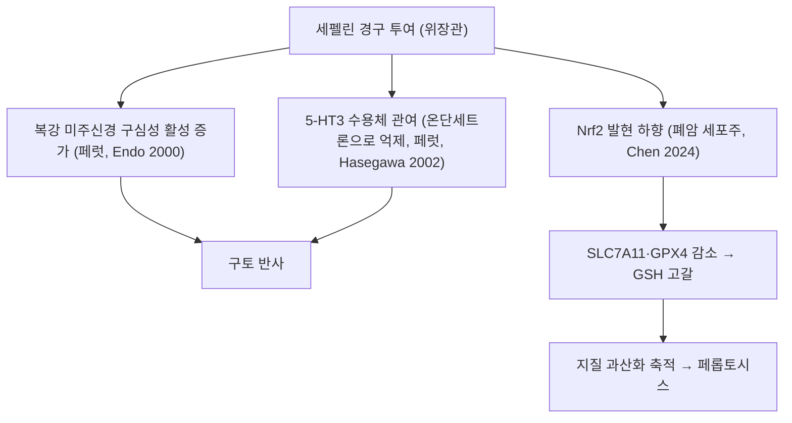

# 🔬 세펠린 (Cephaeline, C28H38N2O4)

> **핵심 3줄 요약 (Key Summary)**:
> - 🌿 기원 본초 & 화학 계열: 꼭두서니과 토근([[토근]], Ipecac, *Carapichea ipecacuanha*)의 뿌리줄기에 에메틴과 함께 공존하는 천연 이소퀴놀린 알칼로이드. (PubChem 동의어상 에메틴의 6'-O-탈메틸체입니다. §1)
> - 🎯 핵심 분자 표적 & 조절 경로: 위점막 화학수용기 자극을 통한 즉각적이고 강력한 반사성 최토(에메틴 대비 2배 강력한 구토 유발), 기관지 분비 촉진(거담), Nrf2 억제를 통한 암세포 페롭토시스(Ferroptosis) 촉진. (⚠️ 페럿에서 복강 미주신경 구심성 활성 증가와 5-HT3 수용체 관여가 확인됐으나 '에메틴 대비 2배'와 '기관지 분비 촉진(거담)'은 근거를 확인하지 못했습니다. Nrf2 억제·페롭토시스는 폐암 세포주와 마우스 이종이식 근거입니다. §3)
> - 🩺 주요 약리 활성 & 질환 치료 기전: 급성 중독 물질의 응급 위 내용물 배출, 만성 호흡기 점조 가래 배출, 한의학의 용토(湧吐) 요법과의 기전적 상동성. (⚠️ 이프칵 시럽의 일상적 투여는 임상 근거 부족으로 권고되지 않으며(Höjer 2013), 거담 근거는 확인하지 못했습니다. §5)
> - ⚠️ 독성·생체이용률 한계 & 상호작용: 에메틴보다 위점막 자극성과 급성 구토 유발력이 강하므로 과량 복용 시 출혈성 위염 주의, 단독 투여보다 토근 총알칼로이드 형태로 관리. (⚠️ '출혈성 위염'은 문헌을 확인하지 못했습니다. hERG 채널 차단 IC50는 세펠린 5.3 µM로 에메틴 21.4 µM보다 강했고, 이프칵 만성 남용은 근병증·심근병증과 관련됩니다. §7)

---

## 📌 목차
1. [기본 화학 정보 & 분자 구조식 (Chemical Identity)](#1-기본-화학-정보--분자-구조식-chemical-identity)
2. [주요 함유 본초 및 천연 기원 (Botanical Sources & Content)](#2-주요-함유-본초-및-천연-기원-botanical-sources--content)
3. [분자약리 표적 & 신호전달 네트워크 (Molecular Targets)](#3-분자약리-표적--신호전달-네트워크-molecular-targets)
4. [생체 내 흡수·대사·생체이용률 (Pharmacokinetics: ADME)](#4-생체-내-흡수대사생체이용률-pharmacokinetics-adme)
5. [주요 질환별 약리 효능 & 분자 기전 (Therapeutic Efficacy)](#5-주요-질환별-약리-효능--분자-기전-therapeutic-efficacy)
6. [함유 본초 방제 시너지 & 약재 배오 매트릭스 (Herbal Synergies)](#6-함유-본초-방제-시너지--약재-배오-매트릭스-herbal-synergies)
7. [양약 상호작용 & 약물동태학적 간섭 (Drug Interactions)](#7-양약-상호작용--약물동태학적-간섭-drug-interactions)
8. [💡 사용자 진료실 핵심 필기 & 임상 응용 팁 (Melt-In & High-Yield)](#8--사용자-진료실-핵심-필기--임상-응용-팁-melt-in--high-yield)
9. [출처 및 학술 참고 문헌 (References)](#9-출처-및-학술-참고-문헌-references)

---

## 1. 기본 화학 정보 & 분자 구조식 (Chemical Identity)

![[세펠린_2D_구조식.png|300]]
> [세펠린 (Cephaeline) 2D 분자 구조식 (PubChem CID: 442195)]

![[세펠린-20240921142824303.png|350]]
> [원장님 수기 필기: 세펠린 6번 페놀성 수산기(-OH) 및 이소퀴놀린 골격 도해]

> [!abstract]+ 🧪 3D 약리 분자 구조 (Interactive 3D Viewer)
> <iframe src="https://molecule-viewer-rho.vercel.app/?cid=442195" width="100%" height="450px" frameborder="0" allow="webgl" style="border-radius: 8px;"></iframe>

| 항목 | 상세 내용 |
| :--- | :--- |
| **IUPAC 명칭** | `(1R)-1-[[(2S,3R,11bS)-3-ethyl-9,10-dimethoxy-2,3,4,6,7,11b-hexahydro-1H-benzo[a]quinolizin-2-yl]methyl]-7-methoxy-1,2,3,4-tetrahydroisoquinolin-6-ol` (PubChem 등록명과 일치 확인) |
| **분자식 / 분자량** | C28H38N2O4 / 466.6 g/mol (PubChem 확인, 정확 질량 466.2832) |
| **PubChem CID** | [442195](https://pubchem.ncbi.nlm.nih.gov/compound/442195) (등록명 Cephaeline, 3D 뷰어 CID 일치). ⚠️ 원문에 적힌 '염산염: 6324-51-2'는 정정이 필요합니다 — 이 번호는 PubChem에서 2-amino-5-chloro-3-nitrobenzoic acid(CID 232055)로 등록돼 있어 세펠린 염산염이 아닙니다. 염산염의 CAS는 확인하지 못해 기재하지 않습니다. |
| **CAS 등록 번호** | 483-17-0 (PubChem 동의어 기준이며 이 번호로 조회하면 CID 442195로 연결됨). ⚠️ 원문에 적힌 482-97-3은 PubChem에서 조회되지 않아(404) 정정했습니다. |
| **화학 골격 분류** | 이소퀴놀린 알칼로이드 — 모노테르페노이드에서 유래하는 테트라하이드로이소퀴놀린 계열의 이프칵 알칼로이드(Colinas 2025). PubChem 동의어: 6'-O-demethylemetine, 7',10,11-Trimethoxyemetan-6'-ol |
| **물리화학적 성상** | 백색 내지 담황색 침상 결정, 쓴맛 (원문). ⚠️ 내용 검토 필요 — PubChem에 성상 항목이 없어 확인하지 못했습니다. 계산값 XLogP는 4.4(에메틴 4.7)입니다. |
| **녹는점** | 115 ~ 116 °C (원문). ⚠️ 내용 검토 필요 — PubChem에 녹는점 자료가 없어 확인하지 못했습니다. |
| **용해도** | 알코올, 클로로포름, 에테르에 가용, 물에 거의 불용 (원문). ⚠️ 내용 검토 필요 — PubChem에 용해도 자료가 없어 확인하지 못했습니다. |
| **화학적 구조 특이성** | 에메틴([[에메틴]])의 6번 메톡시기(-$OCH_3$) 대신 **유리 페놀성 수산기(-OH)**를 지니고 있어 위점막 자극성과 극성이 더 강함 (⚠️ 6'-OH 구조는 IUPAC명과 PubChem 동의어로 확인되나 '위점막 자극성이 더 강함'은 확인하지 못했습니다.) |
| **식물 내 생합성 경로** | 원문에 기재 없음. 이프칵 알칼로이드는 비효소적 Pictet-Spengler 반응으로 시작되는 것으로 제시되었습니다(Colinas 2025; *Carapichea ipecacuanha*와 *Alangium salviifolium*). 세펠린에 이르는 후속 단계는 확인하지 못했습니다. ⚠️ 내용 검토 필요 |

---

## 2. 주요 함유 본초 및 천연 기원 (Botanical Sources & Content)

| 함유 본초 (한글/한자) | 기원 식물학적 명칭 (과명 / 학명) | 주요 함유 약용 부위 | 지표 함량 (%) | 한의학적 귀경 및 약효 특성 |
| :--- | :--- | :--- | :--- | :--- |
| [[토근]] (吐根) | 꼭두서니과(*Rubiaceae*) / *Carapichea ipecacuanha* (이명 *Cephaelis ipecacuanha*) | 근경 및 잔뿌리 | 총 알칼로이드 중 약 30~50% (원문) ⚠️ | 원문에 기재 없음 (볼트에 [[토근]] 노트가 없음) |

### 2.1. 기원 식물: 토근([[토근]])
- 꼭두서니과(*Rubiaceae*) 관목인 **카라피케아 이페카쿠안하(*Carapichea ipecacuanha*)**의 근경 및 잔뿌리.
- 총 알칼로이드 중 약 30~50%를 차지하며, 토근의 산지에 따라 에메틴과의 함유 비율이 달라집니다 (카르타헤나 토근은 세펠린 함량이 더 높음).
  * ⚠️ 내용 검토 필요: '약 30~50%'와 '카르타헤나 토근의 세펠린 함량이 더 높음'은 PubMed에서 확인하지 못했습니다. 볼트 [[에메틴]] 노트는 세펠린을 총 알칼로이드의 30~40%로 서술해 서로 다릅니다.
  * 학명·이명: *Cephaelis ipecacuanha*는 *C. ipecacuanha*의 이명으로 쓰이며(Chen 2024의 초록 표기), 이프칵 알칼로이드는 *Carapichea ipecacuanha*와 *Alangium salviifolium* 두 식물에서 보고됩니다(Colinas 2025). *A. salviifolium*에서의 세펠린 함유 여부는 확인하지 못했습니다.
  * 다른 기원: 한약재가 아닌 *Psychotria klugii*에서도 세펠린이 분리되었습니다(Muhammad 2003).
  * 재배 환경: 전일광(full sunlight)에 노출된 *C. ipecacuanha*에서 에메틴 생산이 증가했습니다(Moll Hüther 2024). 초록에 세펠린(원문 표기 cephalin)의 정량치는 명시되지 않았습니다.

---

## 3. 분자약리 표적 & 신호전달 네트워크 (Molecular Targets)

### 3.1. 강력한 위점막 직접 자극성 최토 작용
- [[세펠린]]은 에메틴보다 지용성이 낮고 극성 페놀기를 지니고 있어 위 점막 상피세포에 직접 접촉 시 감각 신경 말단을 훨씬 더 격렬하게 자극합니다.
- 미주신경 구심성 섬유를 통해 뇌간 구토 중추로 강력한 신호를 전송하여 **에메틴 대비 절반의 용량으로도 2배 이상 신속한 구토 반사**를 유발합니다.
  * 근거(말초 미주신경): 페럿에 이프칵 시럽(TJN-119) 0.5 mg/kg을 경구 투여하면 복강 미주신경 구심성 활동이 투여 전의 219 ± 18%까지 늘어 약 1시간 지속되었고, 세펠린과 에메틴도 비슷한 효과를 보였습니다. 회장의 5-HT는 증가했으나 최후야(area postrema)에서는 증가하지 않아 말초 부위 작용이 시사되었습니다(Endo 2000).
  * 근거(수용체): 페럿에서 5-HT3 수용체 길항제 온단세트론(0.5 mg/kg, 경구)이 세펠린(0.5 mg/kg)·에메틴(5.0 mg/kg)·이프칵 시럽의 구토를 모두 막았고, 도파민 D2 길항제 설피리드는 막지 못했습니다. 결합시험에서 세펠린과 에메틴은 5-HT4 수용체에 뚜렷한 친화도를 보였고 5-HT3·D2 등에는 없거나 약했습니다. 저자들은 [[세로토닌]] 5-HT3 수용체가 구토에 중요하고 5-HT4 수용체가 관여할 수 있다고 결론지었습니다(Hasegawa 2002).
  * ⚠️ 내용 검토 필요: '지용성이 낮고 극성 페놀기가 상피세포 감각 신경 말단을 직접 자극한다'는 기전은 확인하지 못했습니다(계산값 XLogP는 세펠린 4.4, 에메틴 4.7로 차이가 작습니다).
  * ⚠️ 내용 검토 필요: '에메틴 대비 절반의 용량, 2배 이상 신속'은 확인하지 못했습니다. Hasegawa 2002 초록에는 구토 유발에 쓴 용량(세펠린 0.5, 에메틴 5.0 mg/kg)이 다르게 적혀 있으나 효력 비를 직접 비교한 결과는 없습니다. 사람 시험에서는 이프칵 시럽 30 mL 복용 후 세펠린 Cmax가 에메틴의 약 1.5배였고 구토 횟수와 최고 농도 사이 관계는 없었습니다(Scharman 2000).

### 3.2. 반사성 기도 점액 분비 및 거담
- 최토량 이하의 미량을 투여했을 때 미주신경을 매개로 기관지 점막 선세포를 자극하여 수양성 점액 분비를 급증시킵니다.
- 기도의 건조감을 해소하고 농후한 객담을 묽게 하여 배출을 돕습니다.
  * ⚠️ 내용 검토 필요: 세펠린 또는 이프칵의 기도 점액 분비 촉진·거담을 다룬 문헌을 PubMed에서 확인하지 못했습니다(이프칵 및 거담·점액용해·분비 검색에서 해당 논문이 없었습니다).

### 3.3. Nrf2 억제를 통한 종양 세포 페롭토시스(Ferroptosis) 촉진
- 최신 분자생물학 연구(PMID: 38339810)에 따르면, 세펠린은 세포 내 핵심 항산화 전사인자인 [[Nrf2]] 단백질 발현을 표적 하향 조절합니다.
- 글루타티온(GSH) 고갈 및 과산화지질 축적을 유도하여 폐암 등 난치성 종양 세포의 철 의존성 세포사멸인 **페롭토시스(Ferroptosis)**를 강력하게 유도합니다.
  * 근거(폐암): H460·A549 폐암 세포에서 세펠린의 IC50는 24·48·72시간에 각각 H460 88·58·35 nM, A549 89·65·43 nM이었습니다. 페롭토시스 억제제(liproxstatin-1, ferrostatin-1, deferoxamine)가 세포 억제 효과를 되돌렸고, 철 이온과 지질 과산화(LPO·MDA)가 늘고 GPX4·SLC7A11이 감소해 GSH가 고갈되었으며, NRF2를 표적으로 페롭토시스를 유도했습니다. 마우스 피하 이종이식에서 5·10 mg/kg을 12일 투여해 항종양 효과가 있었고 ED50는 3 mg/kg, 10 mg/kg의 효과는 페롭토시스 유도제 erastin과 비슷했습니다(Chen 2024; 세포·마우스 수준의 전임상 결과).
  * 다른 종양: 유방암 4T1·MDA-MB-231 세포에서 IC50 38.89·50.29 nM, MDA·ROS 증가와 GSH·SLC7A11·GPX4 감소가 나타났고 p53 knockdown으로 효과가 약해져 p53/SLC7A11/GPX4 축이 제시되었습니다(Li 2026; Nrf2가 아닌 p53 축). 점액표피양암종 세포에서는 히스톤 H3K9 아세틸화가 늘고 종양구(tumorsphere) 형성이 방해되었습니다(Silva 2022).
  * ⚠️ 내용 검토 필요: '난치성 종양'과 '강력하게'는 세포주와 마우스 결과의 확대 해석입니다. 인체 자료는 확인하지 못했습니다.

---

## 4. 생체 내 흡수·대사·생체이용률 (Pharmacokinetics: ADME)

| 약동학 파라미터 | 성상 및 수치 | 임상적 의의 |
| :--- | :--- | :--- |
| **경구 흡수** | 위점막에서 즉각적인 반사 유발 | 전신 흡수되기 전에 구토로 대부분 배출 (⚠️ 아래 근거 참조) |
| **간 대사 경로** | 간 O-메틸전달효소(COMT 유사 반응) | 메틸화되어 에메틴으로 일부 변환되거나 포합 대사 (⚠️ 아래 근거와 방향이 다름) |
| **체내 배설** | 신장 배설 | 대사체 형태로 뇨중 서서히 배설 (⚠️ 아래 근거 참조) |

* **경구 흡수와 구토 배출**:
  * 사람: USP 시럽 30 mL를 투여한 성인 환자 10명이 모두 30분 안에 구토했고, 구토물로 배출된 알칼로이드는 6명에서 22 ± 14%, 나머지 4명에서 80 ± 16%였습니다. 2시간까지 혈중에서 검출된 사람은 6명(5~73 ng/mL)이었고 모두 흡수는 되었으나 정도는 크게 달랐습니다(Moran 1984). 건강 성인 12명에서 구토물 회수율은 30 mL에서 76 ± 14%, 20 mL에서 39 ± 38%였습니다(Yamashita 2002).
  * 사람 약동학: 건강 성인 10명이 30 mL를 복용한 뒤 5~10분 안에 혈중에서 검출되었고 최고 농도 도달 시간은 약 20분이었습니다. AUC는 에메틴과 비슷했고 세펠린 Cmax는 에메틴의 약 1.5배였습니다. 3시간까지 소변 회수율은 0.15% 미만이었습니다(Scharman 2000).
  * 랫드: 세펠린의 최고 혈장 방사능 도달은 2.00~3.33시간이며 배설 자료로 추정한 흡수율은 약 70%로, 장간순환이 일부 있었습니다(Asano 2002, 흡수·분포·배설).
  * ⚠️ 내용 검토 필요: 구토로 배출되는 비율이 22~80%로 환자마다 크게 달라 '대부분 배출'은 일률적으로 성립하지 않습니다.
* **간 대사**:
  * 랫드: 세펠린은 6'-O-글루쿠로니드로 포합되어 담즙·소변 방사능의 79.5%·84.3%를 차지했습니다. 반대로 에메틴이 탈메틸화되어 세펠린과 9-O-탈메틸에메틴이 되었습니다(Asano 2002, 생체변환).
  * 사람 간 마이크로솜: 에메틴이 CYP3A4와 CYP2D6에 의해 세펠린과 9-O-탈메틸에메틴으로, CYP3A4에 의해 10-O-탈메틸에메틴으로 대사되었습니다(Asano 2001). 세펠린 자체의 사람 대사 경로는 초록에서 확인하지 못했습니다.
  * ⚠️ 내용 검토 필요: '세펠린이 O-메틸화되어 에메틴으로 변환'과 'COMT 유사 반응'은 확인하지 못했고, 확인된 방향은 에메틴이 탈메틸화되어 세펠린이 되는 쪽입니다.
* **배설과 분포**:
  * 랫드 48시간: 세펠린은 담즙 57.5%, 소변 16.5%, 대변 29.1%로 배설되었고 대변 중 미변화 세펠린은 투여량의 42.4%였습니다(Asano 2002).
  * 사람: 소변 회수는 2시간에 0.5% 이하(Moran 1984), 48시간에 2% 미만이었으나 2주 뒤에도 소변에서 검출되었고 구토하지 않은 1명은 12주까지 검출되었습니다(Yamashita 2002).
  * ⚠️ 내용 검토 필요: 사람에서 신장은 주된 배설 경로가 아닙니다. '대사체 형태로 소변 배설'은 랫드의 글루쿠로니드 자료에서만 확인됩니다.
* **반감기와 조직 분포**: 랫드 세펠린의 말기 반감기는 3.45~9.40시간, 에메틴은 65.4~163시간이었고 최대 조직 방사능은 혈장의 세펠린 100~150배, 에메틴 1000~3000배였습니다(Asano 2002). 사람의 반감기는 확인하지 못했습니다.
* **장내 미생물 대사, P-gp 기질성**: 문헌을 확인하지 못했습니다. ⚠️ 내용 검토 필요

---

## 5. 주요 질환별 약리 효능 & 분자 기전 (Therapeutic Efficacy)

### 5.1. 급성 독물 중독의 신속 최토
- 약물 과다 복용 시 즉각적인 위 내용물 구토 유도로 독소 흡수 차단.
  * ⚠️ 내용 검토 필요: 이프칵이 중독 환자의 예후를 개선한다는 설득력 있는 임상 근거는 없고, 현장이나 응급실에서의 일상적 투여는 피해야 하며 활성탄·경구 해독제·전장관세척의 투여를 지연시키거나 효과를 줄일 수 있다는 것이 미국임상독성학회·유럽중독센터협회의 갱신 입장문입니다(Höjer 2013). 이는 이프칵 시럽에 대한 결론이며 세펠린 단독 자료는 아닙니다.

### 5.2. 난치성 객담 정체 및 만성 기관지염
- 점조한 가래가 목구멍에 달라붙어 떨어지지 않는 환자의 거담 유도.
  * ⚠️ 내용 검토 필요: 세펠린 또는 이프칵의 거담 효과를 다룬 임상·전임상 문헌을 확인하지 못했습니다(§3.2).

### 5.3. 차세대 항암 보조 요법 (연구 단계)
- Nrf2 과발현으로 항암제 내성을 획득한 암세포의 페롭토시스 감수성 회복.
  * 근거: 폐암 세포·마우스(Chen 2024), 유방암 세포(Li 2026), 점액표피양암종 세포(Silva 2022)의 세포·동물 수준 결과입니다(§3.3).
  * ⚠️ 내용 검토 필요: Chen 2024 초록은 NRF2를 표적으로 한 페롭토시스 유도를 보였으나 '항암제 내성 세포의 감수성 회복'을 직접 시험했는지는 초록에서 확인하지 못했습니다.

### 5.4. 항바이러스 (전임상, 원문에 없던 근거)
- 구제역바이러스(FMDV)를 BHK-21 세포에 감염시킨 시험에서 세펠린은 감염 후 단계 EC50 0.05 µM(에메틴 0.24 µM), 예방 효과 EC50 0.23 µM(에메틴 0.64 µM)이었습니다. FMDV 복제효소(3Dpol) 억제 IC50는 세펠린 0.15 µM, 에메틴 4.20 µM이었고 세포 밖 바이러스를 직접 줄이는 살바이러스 효과도 나타났습니다(Pantanam 2024). 가축 바이러스 대상 세포 결과이며 인체 근거는 아닙니다.

### 5.5. 항기생충 (시험관, 원문에 없던 근거)
- 세펠린은 *Leishmania donovani*에 대한 시험관 IC50가 0.03 µg/mL로 에메틴과 같은 수준이었으나 VERO 세포 독성은 에메틴이 12배 이상 컸습니다(IC50 에메틴 0.42, 세펠린 5.3 µg/mL). 같은 논문에서 세펠린과 klugine은 열대열말라리아원충(*Plasmodium falciparum*) W2·D6 클론에 강한 활성을 보였고 두 화합물을 합친 IC50 범위는 27.7~46.3 ng/mL였습니다(Muhammad 2003; 세펠린 단독 수치는 초록에 분리되어 있지 않음).
- ⚠️ 내용 검토 필요: 원문 §6 표의 '항아메바 살충력'(세펠린 보통, 에메틴 매우 우수)은 세펠린을 대상으로 한 항아메바 문헌을 찾지 못해 확인하지 못했습니다.

---

## 6. 함유 본초 방제 시너지 & 약재 배오 매트릭스 (Herbal Synergies)

| 함유 본초 / 방제 | 공존 유효 성분군 | 분자약리 시너지 기전 | 전통 한의학적 효능 연계 |
| :--- | :--- | :--- | :--- |
| [[토근]] | [[에메틴]] (공존 알칼로이드) | ⚠️ 내용 검토 필요 — 시너지 문헌은 확인하지 못했습니다. 페럿에서 세펠린과 에메틴은 모두 5-HT3 수용체 의존 구토를 일으켜 같은 기전군으로 보입니다(Hasegawa 2002). | 용토(湧吐) 요법과의 기전적 상동성 (원문 §7) |

* 볼트 `_의학/02_약리/처방/`에서 토근을 구성에 포함한 처방은 확인되지 않았습니다. 원문이 비교 대상으로 든 참외꼭지([[과체]])·[[패모]]·상산도 볼트 [[패모]] 노트에는 토법 관련 서술이 없습니다. ⚠️ 내용 검토 필요

### 에메틴과의 비교 및 안전성 (원문 §6)

| 비교 항목 | 세펠린 (Cephaeline) | 에메틴 ([[에메틴]], Emetine) |
| :--- | :--- | :--- |
| **페놀성 수산기** | 6'-OH (유리 페놀기) | 6'-$OCH_3$ (메톡시기) |
| **구토 유발력** | **극도로 강함 (에메틴의 2배)** | 완만함 |
| **항아메바 살충력** | 보통 | **매우 우수 (전신 감염 다용)** |
| **독성학적 특성** | **국소 위점막 자극성 및 신장 자극 우세** | **심근 축적 및 심장 독성(부정맥) 우세** |
| **원장님 필기 요약** | **위점막 자극 최토와 거담 작용이 강하며 독성과 약성이 강함** | **세펠린에 비해 독성이 완만하고 아메바 이질에 효과적** |

* ⚠️ 내용 검토 필요 — 표와 문헌의 대조:
  * '구토 유발력 2배'와 '항아메바 살충력' 비교는 확인하지 못했습니다(§3.1, §5.5).
  * 조직 축적은 표와 방향이 맞는 부분이 있습니다. 랫드에서 최대 조직 방사능이 혈장의 에메틴 1000~3000배, 세펠린 100~150배였고 반감기도 에메틴이 훨씬 길었습니다(Asano 2002).
  * 심장 독성은 표와 방향이 다른 부분이 있습니다. hERG 채널 차단 IC50는 세펠린 5.3 µM, 에메틴 21.4 µM으로 세펠린이 더 강했습니다(Kratz 2016, HEK293 세포). 세포 독성(VERO)은 에메틴이 12배 이상 컸습니다(Muhammad 2003).
  * '국소 위점막 및 신장 자극 우세'는 근거를 확인하지 못했습니다.
  * '원장님 필기 요약' 행은 원장님 필기이므로 원문 그대로 두었습니다.

---

## 7. 양약 상호작용 & 약물동태학적 간섭 (Drug Interactions)

* **안전성 이슈 (원문)**: 에메틴보다 위점막 자극성과 급성 구토 유발력이 강하므로 과량 복용 시 출혈성 위염 주의, 단독 투여보다 토근 총알칼로이드 형태로 관리.
  * ⚠️ 내용 검토 필요: '출혈성 위염'과 '에메틴보다 자극성이 강하다'는 문헌을 확인하지 못했습니다. 이프칵 알칼로이드 독성은 위장관·심혈관·신경근 증상이 중심이라고 정리되어 있습니다(Manno 1977, 종설).
* **CYP450 효소 간섭**: 사람 간 마이크로솜에서 세펠린의 CYP2D6·[[CYP3A4]] 억제 IC50는 121·1000 µM, Ki는 54·355 µM이었고(에메틴은 IC50 80·480 µM, Ki 43·232 µM), 저자들은 이 시험관 억제가 병용 약물의 혈중 농도를 크게 높이지는 않을 것이라고 결론지었습니다(Asano 2001).
* **hERG 차단과 심독성**: 세펠린은 HEK293 세포에서 hERG 채널 전류를 IC50 5.3 µM로 차단해 에메틴(21.4 µM)보다 강했습니다(Kratz 2016). hERG 차단은 QT 연장과 부정맥 위험과 연관된 표적이라고 논문이 설명합니다. QT 연장 약물과의 병용 위험은 이론적이며 임상 근거는 확인하지 못했습니다. ⚠️ 내용 검토 필요
* **만성 남용**: 섭식장애가 있는 젊은 여성 2명에서 이프칵에 의한 근병증이 확인되었고 1명은 심근병증을 동반했으며 중단 후 근병증과 심초음파가 정상으로 돌아왔습니다(Dresser 1993, 증례 2건). 이프칵 알칼로이드 전체의 결과이며 세펠린 단독 자료는 아닙니다.
* **활성탄·해독제 병용**: 이프칵은 활성탄, 경구 해독제, 전장관세척의 투여를 지연시키거나 효과를 줄일 수 있습니다(Höjer 2013).
* **유사 기전 양약 병용 시 고려사항**: 페럿에서 5-HT3 길항제 온단세트론이 세펠린 구토를 막았으므로(Hasegawa 2002), 5-HT3 길항제 계열 항구토제와 병용하면 구토 유발 효과가 줄 가능성이 있습니다. 사람 자료는 확인하지 못한 추정입니다. ⚠️ 내용 검토 필요

---

## 8. 💡 사용자 진료실 핵심 필기 & 임상 응용 팁 (Melt-In & High-Yield)

* **사용자 원문 필기 (100% 융합 및 보존)**:
  * 원장님 수기 필기 이미지(세펠린 6번 페놀성 수산기(-OH) 및 이소퀴놀린 골격 도해)는 §1에 원문 그대로 배치했습니다.
  * §6 비교표의 '원장님 필기 요약'은 세펠린 "위점막 자극 최토와 거담 작용이 강하며 독성과 약성이 강함", 에메틴 "세펠린에 비해 독성이 완만하고 아메바 이질에 효과적"입니다.

### 8.1. 위점막 자극과 말초 최토의 한방적 의의 (원문 §7.1)
- **담음(痰飮)의 토법 배출**: 한의학에서 상초에 꽉 찬 풍담(風痰)이나 독소를 치료할 때 참외꼭지([[과체]])나 [[패모]], 상산을 사용하는 원리와 같이, 서양의학의 [[토근]] 추출물에서 [[세펠린]]은 위장관 말초를 자극하여 흉격의 병리적 삼출물을 신속히 토해내게 만드는 핵심 활성 성분입니다.
- **용량의 엄격성**: 세펠린은 자극성이 매우 강하므로, 거담 목적으로 투여할 때는 반드시 최토량의 1/10 이하로 정밀 감량하여 기관지 분비만을 선택적으로 촉진해야 합니다.

* **진료실 실전 처방 & 생체이용률 극대화 팁**:
  1. 근거 검토 메모: 위 필기 중 '거담 목적의 최토량 1/10 이하 감량'과 '기관지 분비만의 선택적 촉진'은 용량·효과를 확인한 문헌을 찾지 못했습니다(§3.2). 또한 이프칵 시럽의 일상적 투여는 임상 근거 부족으로 권고되지 않습니다(Höjer 2013). 토법 약재로 든 참외꼭지·패모·상산의 비교는 볼트에 [[과체]]·상산 노트가 없어 확인하지 못했습니다. ⚠️ 내용 검토 필요
  2. 체질별·병증별 맞춤 적용: 원문과 문헌에서 확인되지 않아 기재하지 않습니다. ⚠️ 내용 검토 필요

---

## 9. 출처 및 학술 참고 문헌 (References)

1. **Chen P, Ye Q, Liang S, Zeng L (2024)**. *Cephaeline promotes ferroptosis by targeting NRF2 to exert anti-lung cancer efficacy*. **Pharm Biol**, 62(1):195-206. PMID: [38339810](https://pubmed.ncbi.nlm.nih.gov/38339810/) · DOI: [10.1080/13880209.2024.2309891](https://doi.org/10.1080/13880209.2024.2309891)
   - **[연구 요약]**: 토근의 주성분인 [[세펠린]](Cephaeline)이 [[Nrf2]] 항산화 신호를 차단하여 지질 과산화 및 페롭토시스를 유도함으로써 폐암을 억제하는 현대 분자생물학적 약리 기전을 규명. H460·A549 세포와 마우스 이종이식 결과.
   - 서지 정정: 원문의 저자(Zhou X)와 쪽수(175-184)는 PubMed 기준 Chen P 외, 195-206쪽으로 바로잡았습니다.
2. **Pantanam A, Mana N, Semkum P, Lueangaramkul V, Phecharat N, Lekcharoensuk P, Theerawatanasirikul S (2024)**. *Dual effects of ipecac alkaloids with potent antiviral activity against foot-and-mouth disease virus as replicase inhibitors and direct virucides*. **Int J Vet Sci Med**, 12(1):134-147. PMID: [39359867](https://pubmed.ncbi.nlm.nih.gov/39359867/) · DOI: [10.1080/23144599.2024.2408189](https://doi.org/10.1080/23144599.2024.2408189)
   - **[연구 요약]**: 토근의 세펠린 및 에메틴 알칼로이드가 구제역바이러스(FMDV)의 복제효소(3Dpol)를 억제하고 직접적인 살바이러스 작용을 나타냄을 BHK-21 세포에서 입증.
   - 서지·요약 정정: 원문의 저자(Park S)·쪽수(108-119)는 PubMed 기준 Pantanam A 외, 134-147쪽으로 바로잡았고, 원문의 '광범위 항바이러스 활성'은 초록상 FMDV 대상 결과입니다. ⚠️
3. **Moll Hüther C, Ferreira VF, de Carvalho da Silva F, et al. (2024)**. *Alkaloids (emetine and cephalin) production - affected by full sunlight stress in Carapichea ipecacuanha*. **Nat Prod Res**, 38(13):2296-2305. PMID: [36787159](https://pubmed.ncbi.nlm.nih.gov/36787159/) · DOI: [10.1080/14786419.2023.2172723](https://doi.org/10.1080/14786419.2023.2172723)
   - **[연구 요약]**: 토근이 전일광 스트레스에서 광합성 효율이 떨어지고 에메틴 생산이 증가함을 보고한 식물 생리 연구.
   - 서지·요약 정정: 원문의 저자(Rieder A)·쪽수(2289-2294)는 PubMed 기준 Moll Hüther C 외, 2296-2305쪽으로 바로잡았습니다. 원문의 '세펠린의 환경 스트레스에 따른 축적 및 화학적 변환 메커니즘'은 초록에서 확인하지 못했습니다. ⚠️
4. **Hasegawa M, Sasaki T, Sadakane K, et al. (2002)**. *Studies for the emetic mechanisms of ipecac syrup (TJN-119) and its active components in ferrets: involvement of 5-hydroxytryptamine receptors*. **Jpn J Pharmacol**, 89(2):113-119. PMID: [12120752](https://pubmed.ncbi.nlm.nih.gov/12120752/) · DOI: [10.1254/jjp.89.113](https://doi.org/10.1254/jjp.89.113)
   - **[연구 요약]**: 페럿에서 온단세트론이 세펠린·에메틴·이프칵 시럽의 구토를 막았고 D2 길항제는 막지 못했으며, 5-HT4 수용체 친화도가 확인됨.
5. **Endo T, Nemoto M, Ogawa T, et al. (2000)**. *Pharmacological aspects of ipecac syrup (TJN-119)-induced emesis in ferrets*. **Res Commun Mol Pathol Pharmacol**, 108(3-4):187-200. PMID: [11913711](https://pubmed.ncbi.nlm.nih.gov/11913711/)
   - **[연구 요약]**: 이프칵 시럽과 세펠린·에메틴이 복강 미주신경 구심성 활동을 증가시켰고 회장 5-HT는 늘었으나 최후야에서는 늘지 않음.
6. **Scharman EJ, Hutzler JM, Rosencrance JG, Tracy TS (2000)**. *Single dose pharmacokinetics of syrup of ipecac*. **Ther Drug Monit**, 22(5):566-573. PMID: [11034262](https://pubmed.ncbi.nlm.nih.gov/11034262/) · DOI: [10.1097/00007691-200010000-00011](https://doi.org/10.1097/00007691-200010000-00011)
   - **[연구 요약]**: 건강 성인 10명에서 세펠린·에메틴은 5~10분 안에 검출되고 Tmax 약 20분, 세펠린 Cmax가 에메틴의 약 1.5배, 소변 회수 0.15% 미만.
7. **Moran DM, Crouch DJ, Finkle BS (1984)**. *Absorption of ipecac alkaloids in emergency patients*. **Ann Emerg Med**, 13(12):1100-1102. PMID: [6150666](https://pubmed.ncbi.nlm.nih.gov/6150666/) · DOI: [10.1016/s0196-0644(84)80332-7](https://doi.org/10.1016/s0196-0644(84)80332-7)
   - **[연구 요약]**: 성인 환자 10명 모두 30분 안에 구토했으나 구토물 알칼로이드 비율은 22~80%로 다양했고 소변 배설은 0.5% 이하.
8. **Yamashita M, Yamashita M, Azuma J (2002)**. *Urinary excretion of ipecac alkaloids in human volunteers*. **Vet Hum Toxicol**, 44(5):257-259. PMID: [12361104](https://pubmed.ncbi.nlm.nih.gov/12361104/)
   - **[연구 요약]**: 건강인 12명에서 소변 배설 48시간 2% 미만이나 2주 뒤에도 검출되었고, 구토물 회수율은 20 mL 39%·30 mL 76%.
9. **Asano T, Ishihara K, Wakui Y, et al. (2002)**. *Absorption, distribution and excretion of 3H-labeled cephaeline- and emetine-spiked ipecac syrup in rats*. **Eur J Drug Metab Pharmacokinet**, 27(1):17-27. PMID: [11996323](https://pubmed.ncbi.nlm.nih.gov/11996323/) · DOI: [10.1007/BF03190401](https://doi.org/10.1007/BF03190401)
   - **[연구 요약]**: 랫드에서 세펠린 반감기 3.45~9.40시간, 에메틴 65.4~163시간이며 조직 분포와 담즙 배설 57.5%를 보고.
10. **Asano T, Watanabe J, Sadakane C, et al. (2002)**. *Biotransformation of the ipecac alkaloids cephaeline and emetine from ipecac syrup in rats*. **Eur J Drug Metab Pharmacokinet**, 27(1):29-35. PMID: [11996324](https://pubmed.ncbi.nlm.nih.gov/11996324/) · DOI: [10.1007/BF03190402](https://doi.org/10.1007/BF03190402)
    - **[연구 요약]**: 세펠린은 6'-O-글루쿠로니드로 포합되고 에메틴은 탈메틸화되어 세펠린과 9-O-탈메틸에메틴이 됨.
11. **Asano T, Kushida H, Sadakane C, et al. (2001)**. *Metabolism of ipecac alkaloids cephaeline and emetine by human hepatic microsomal cytochrome P450s, and their inhibitory effects on P450 enzyme activities*. **Biol Pharm Bull**, 24(6):678-682. PMID: [11411558](https://pubmed.ncbi.nlm.nih.gov/11411558/) · DOI: [10.1248/bpb.24.678](https://doi.org/10.1248/bpb.24.678)
    - **[연구 요약]**: 에메틴은 CYP3A4·CYP2D6로 대사되고, 세펠린의 CYP2D6·CYP3A4 억제는 약해 병용 약물 농도를 크게 올리지 않을 것으로 결론(시험관).
12. **Höjer J, Troutman WG, Hoppu K, et al. (2013)**. *Position paper update: ipecac syrup for gastrointestinal decontamination*. **Clin Toxicol (Phila)**, 51(3):134-139. PMID: [23406298](https://pubmed.ncbi.nlm.nih.gov/23406298/) · DOI: [10.3109/15563650.2013.770153](https://doi.org/10.3109/15563650.2013.770153)
    - **[연구 요약]**: 이프칵이 중독 환자 예후를 개선한다는 설득력 있는 근거가 없고 일상적 투여를 피해야 하며 활성탄 등의 투여를 지연·감소시킬 수 있다고 정리.
13. **Kratz JM, Mair CE, Oettl SK, et al. (2016)**. *hERG Channel Blocking Ipecac Alkaloids Identified by Combined In Silico - In Vitro Screening*. **Planta Med**, 82(11-12):1009-1015. PMID: [27145237](https://pubmed.ncbi.nlm.nih.gov/27145237/) · DOI: [10.1055/s-0042-105572](https://doi.org/10.1055/s-0042-105572)
    - **[연구 요약]**: HEK293 세포에서 hERG 전류 차단 IC50가 세펠린 5.3 µM, 에메틴 21.4 µM.
14. **Manno BR, Manno JE (1977)**. *Toxicology of ipecac: a review*. **Clin Toxicol**, 10(2):221-242. PMID: [15766](https://pubmed.ncbi.nlm.nih.gov/15766/) · DOI: [10.3109/15563657708987968](https://doi.org/10.3109/15563657708987968)
    - **[연구 요약]**: 이프칵 알칼로이드 독성이 주로 위장관·심혈관·신경근 증상이라고 정리한 종설(연구 대부분이 에메틴 대상).
15. **Dresser LP, Massey EW, Johnson EE, Bossen E (1993)**. *Ipecac myopathy and cardiomyopathy*. **J Neurol Neurosurg Psychiatry**, 56(5):560-562. PMID: [8099367](https://pubmed.ncbi.nlm.nih.gov/8099367/) · DOI: [10.1136/jnnp.56.5.560](https://doi.org/10.1136/jnnp.56.5.560)
    - **[연구 요약]**: 섭식장애 젊은 여성 2례의 이프칵 근병증(1례는 심근병증 동반)이 중단 후 회복된 증례 보고.
16. **Silva LC, Borgato GB, Wagner VP, et al. (2022)**. *Cephaeline is an inductor of histone H3 acetylation and inhibitor of mucoepidermoid carcinoma cancer stem cells*. **J Oral Pathol Med**, 51(6):553-562. PMID: [34661317](https://pubmed.ncbi.nlm.nih.gov/34661317/) · DOI: [10.1111/jop.13252](https://doi.org/10.1111/jop.13252)
    - **[연구 요약]**: 점액표피양암종 세포에서 세펠린이 생존·이동을 줄이고 H3K9 아세틸화를 늘리며 종양구 형성을 방해.
17. **Li X, Yu J, Lin B, Gong Y (2026)**. *Cephaeline promotes ferroptosis in breast cancer via p53/SLC7A11/GPX4 axis*. **Daru**, 34(2):38. PMID: [42319734](https://pubmed.ncbi.nlm.nih.gov/42319734/) · DOI: [10.1007/s40199-026-00619-9](https://doi.org/10.1007/s40199-026-00619-9)
    - **[연구 요약]**: 4T1·MDA-MB-231 유방암 세포에서 세펠린이 p53/SLC7A11/GPX4 축을 통해 페롭토시스를 유도(p53 knockdown으로 약화).
18. **Muhammad I, Dunbar DC, Khan SI, et al. (2003)**. *Antiparasitic alkaloids from Psychotria klugii*. **J Nat Prod**, 66(7):962-967. PMID: [12880315](https://pubmed.ncbi.nlm.nih.gov/12880315/) · DOI: [10.1021/np030086k](https://doi.org/10.1021/np030086k)
    - **[연구 요약]**: 세펠린의 항리슈만편모충(IC50 0.03 µg/mL)·항말라리아 활성과 에메틴 대비 낮은 VERO 세포 독성.
19. **Colinas M, Morweiser C, Dittberner O, et al. (2025)**. *Ipecac alkaloid biosynthesis in two evolutionarily distant plants*. **Nat Chem Biol**, 21(11):1794-1805. PMID: [40461725](https://pubmed.ncbi.nlm.nih.gov/40461725/) · DOI: [10.1038/s41589-025-01926-z](https://doi.org/10.1038/s41589-025-01926-z)
    - **[연구 요약]**: 이프칵 알칼로이드가 *Carapichea ipecacuanha*와 *Alangium salviifolium*에서 비효소적 Pictet-Spengler 반응으로 시작되는 생합성 경로를 규명.
20. **데이터베이스 확인 항목**: PubChem Compound [442195](https://pubchem.ncbi.nlm.nih.gov/compound/442195)(세펠린), [10219](https://pubchem.ncbi.nlm.nih.gov/compound/10219)(에메틴, 구조 비교용), CID 232055(2-amino-5-chloro-3-nitrobenzoic acid, 원문 '염산염' CAS 6324-51-2의 실제 등록 화합물).

<!-- 보관 태그(1회용·링크오류, 필요시 복원): 거담작용, 페롭토시스 -->
