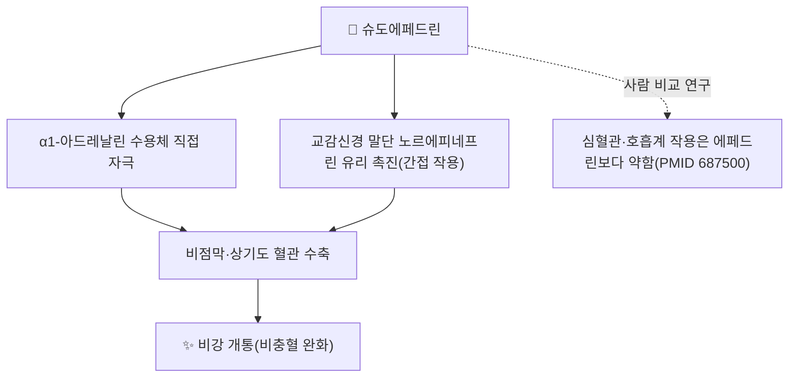

# 🔬 슈도에페드린 (Pseudoephedrine, C₁₀H₁₅NO)

> **핵심 3줄 요약 (Key Summary)**:
> - 🌿 기원 본초 & 화학 계열: [[마황]](麻黃, 마황과 *Ephedra sinica* 등의 지상경)에 [[에페드린]]과 함께 함유된 페네틸아민계 알칼로이드로, 에페드린의 부분입체이성질체(diastereomer, (1S,2S)형)이다.
> - 🎯 핵심 분자 표적 & 조절 경로: α1-아드레날린 수용체 직접 자극과 교감신경 말단의 노르에피네프린 유리 촉진(간접 작용)을 통해 비점막 혈관을 수축시킨다. 사람 대상 비교 연구에서 에페드린과 나란히 심혈관·호흡계 작용을 평가한 고전 연구가 있다(Drew 1978, PMID 687500).
> - 🩺 주요 약리 활성 & 질환 치료 기전: 비충혈제거제(코막힘 완화)로 감기·비염에 항히스타민제와 병용되며(PMID 39484821), 항공성 중이염(이압력손상) 예방 효과의 체계적 문헌고찰이 있다(PMID 41931637). 마황-계지 배오 비율에 따라 랫드에서 약동학이 달라진다(PMID 24929107).
> - ⚠️ 독성·생체이용률 한계 & 상호작용: MAO 억제제와 병용 시 고혈압 위기 위험이 있는 교감신경흥분제 계열이다. 방광경부 평활근 수축을 통한 배뇨장애 가능성이 있어 전립선비대증 환자 주의가 필요하며, 역설적으로 이 α1 작용이 역행성사정 등 사정장애 치료에 시험된 사례도 있다(PMID 39044467, 소규모 임상).

---

## 📌 목차
1. [기본 화학 정보 & 분자 구조식 (Chemical Identity)](#1-기본-화학-정보--분자-구조식-chemical-identity)
2. [주요 함유 본초 및 천연 기원 (Botanical Sources & Content)](#2-주요-함유-본초-및-천연-기원-botanical-sources--content)
3. [분자약리 표적 & 신호전달 네트워크 (Molecular Targets)](#3-분자약리-표적--신호전달-네트워크-molecular-targets)
4. [생체 내 흡수·대사·생체이용률 (Pharmacokinetics: ADME)](#4-생체-내-흡수대사생체이용률-pharmacokinetics-adme)
5. [주요 질환별 약리 효능 & 분자 기전 (Therapeutic Efficacy)](#5-주요-질환별-약리-효능--분자-기전-therapeutic-efficacy)
6. [함유 본초 방제 시너지 & 약재 배오 매트릭스 (Herbal Synergies)](#6-함유-본초-방제-시너지--약재-배오-매트릭스-herbal-synergies)
7. [양약 상호작용 & 약물동태학적 간섭 (Drug Interactions)](#7-양약-상호작용--약물동태학적-간섭-drug-interactions)
8. [💡 사용자 진료실 핵심 필기 & 임상 응용 팁 (Melt-In & High-Yield)](#8--사용자-진료실-핵심-필기--임상-응용-팁-melt-in--high-yield)
9. [출처 및 학술 참고 문헌 (References)](#9-출처-및-학술-참고-문헌-references)

---

## 1. 기본 화학 정보 & 분자 구조식 (Chemical Identity)

![[슈도에페드린_1_구조식.png|300]]
> [그림 1: ① 2D 화학 구조식 — 슈도에페드린(PubChem CID 7028). 에페드린과 같은 분자식(C₁₀H₁₅NO)이나 C1 입체배치가 반대인 부분입체이성질체다. 출처: [PubChem](https://pubchem.ncbi.nlm.nih.gov/compound/7028)]

> [!abstract]+ 🧪 3D 약리 분자 구조 (Interactive 3D Viewer)
> <iframe src="https://molecule-viewer-rho.vercel.app/?cid=7028" style="width: 100%; height: 600px; border: none; border-radius: 12px; box-shadow: 0 4px 20px rgba(0,0,0,0.15);" allowfullscreen></iframe>

| 항목 | 내용 |
| :--- | :--- |
| **IUPAC 명칭** | (1S,2S)-2-(methylamino)-1-phenylpropan-1-ol |
| **분자식 / 분자량** | C₁₀H₁₅NO / 165.23 g/mol |
| **PubChem CID** | [7028](https://pubchem.ncbi.nlm.nih.gov/compound/7028) |
| **CAS 등록번호** | 90-82-4 |
| **물리화학 지표** | XLogP 0.9 · TPSA 32.3 Ų (PubChem 계산값) |
| **화학 골격 분류** | 페네틸아민계 알칼로이드 — [[에페드린]]의 (1S,2S) 부분입체이성질체 |
| **기원 본초** | [[마황]](*Ephedra sinica* 등)의 지상경 |

---

## 2. 주요 함유 본초 및 천연 기원 (Botanical Sources & Content)

![[슈도에페드린_2_기원식물_마황.jpg|340]]
> [그림 2: ② 기원 식물 실사 — 마황(*Ephedra sinica*)의 마디진 녹색 지상경. 약용 부위는 지상경(초마황). 출처: Krzysztof Ziarnek (Kenraiz), [Wikimedia Commons](https://commons.wikimedia.org/wiki/File:Ephedra_sinica_kz01.jpg) (CC BY-SA 4.0)]

| 본초명 | 학명 및 기원식물 | 약용 부위 | 성분 배합 특성 |
| :--- | :--- | :--- | :--- |
| [[마황]] (麻黃) | 마황과 / *Ephedra sinica* Stapf 등 | 지상경(줄기) | [[에페드린]]과 공존하는 주요 알칼로이드, 배오 비율은 처방·가공에 따라 달라짐(PMID 24929107) |

* 원문의 "마황 총 알칼로이드 중 에페드린 약 70~80%·슈도에페드린 약 15~20%"라는 구체적 비율은 이 노트에서 직접 확인하지 못했습니다 ⚠️. 마황-계지 배오 비율에 따라 5종 에페드린 알칼로이드의 랫드 약동학이 달라진다는 연구만 확인했습니다(Zhao 2014, PMID 24929107).

---

## 3. 분자약리 표적 & 신호전달 네트워크 (Molecular Targets)

* **직접 α1 수용체 자극 + 간접 노르에피네프린 유리**: 비점막·상기도 혈관 평활근의 α1 수용체 자극과 교감신경 말단의 노르에피네프린 유리를 통해 혈관을 수축시켜 비강 통로를 넓히는 기전이 교감신경흥분제 일반의 약리로 서술됩니다.
* **에페드린과의 사람 비교 연구**: D-(-)-에페드린과 L-(+)-슈도에페드린을 사람에서 비교해 심혈관·호흡계 작용을 평가한 고전 연구가 있습니다(Drew 등 1978, PMID 687500). 원문이 인용한 "Comparison of the effects of pseudoephedrine and ephedrine on the nasal vasculature"라는 제목은 실제 논문 제목과 다르며(§9 정정), 서지사항(Br J Clin Pharmacol 6(3):221-5, 1978)은 일치합니다.
* 원문의 "IP3/DAG 경로 활성화를 통한 세포 내 칼슘 상승"은 α1 수용체 신호전달의 일반 교과서 기전이며, 슈도에페드린 특이적 근거는 이 노트에서 확인하지 못했습니다 ⚠️.

---

## 4. 생체 내 흡수·대사·생체이용률 (Pharmacokinetics: ADME)

* 마황-계지 배오 비율(4가지 탕액)을 랫드에 경구 투여해 슈도에페드린을 포함한 에페드린 알칼로이드 5종의 약동학을 비교한 연구가 있습니다 — 배오 비율에 따라 흡수·노출(AUC)이 달라졌습니다(Zhao 등 2014, PMID 24929107).
* 원문의 "경구 흡수율 약 95~100%, 반감기 약 5~8시간, 간 대사 10% 미만·대부분 미변화체 신장 배설"은 일반 약리 교과서 수준의 수치이며, 이 노트에서 사람 대상 1차 문헌으로 재확인하지 못했습니다 ⚠️.

---

## 5. 주요 질환별 약리 효능 & 분자 기전 (Therapeutic Efficacy)

| 적응증 | 근거 수준 | 근거 |
| :--- | :--- | :--- |
| 감기·비염의 코막힘 완화 | 병용약물 약리 종설 | 클로르페나민+슈도에페드린 병용의 약리를 정리한 서술적 종설(Eccles 2024, PMID 39484821) |
| 항공성 중이염(이압력손상) 예방 | 체계적 문헌고찰·메타분석 | 슈도에페드린·옥시메타졸린의 예방 효과를 평가(PMID 41931637) |
| 사정장애(역행성사정 등) | 소규모 임상 (신규 적응증) | 고환암 후복막림프절절제술 후 사정장애에 슈도에페드린을 시험(PMID 39044467) — α1 수용체 자극을 통한 방광경부 폐쇄 기전과 방향이 일치 |

* 원문의 "이관 기능장애·항공성 중이염 예방" 서술은 §5의 PMID 41931637과 방향이 일치합니다. 다만 메타분석 결과의 구체적 효과크기는 이 노트에서 확인하지 못했습니다 ⚠️.

---

## 6. 함유 본초 방제 시너지 & 약재 배오 매트릭스 (Herbal Synergies)

| 함유 본초 / 방제 | 공존 유효 성분군 | 원문의 연계 서술 | 검토 |
| :--- | :--- | :--- | :--- |
| [[마황]] | [[에페드린]] | 마황 총알칼로이드 중 두 성분이 공존 | 정확한 비율은 미확인(§2) |
| [[소청룡탕]]·[[마황탕]] | [[마황]], [[계지]], [[행인]], [[감초]] 등 | 비염·코막힘 개선의 핵심 약리 기전으로 서술 | 슈도에페드린 단독 기여는 이 노트에서 확인하지 못함 ⚠️ |

* 마황-계지 배오 비율이 달라지면 랫드 체내 에페드린 알칼로이드 5종의 약동학이 달라진다는 점은 처방 배오가 약리학적으로 의미 있다는 근거입니다(PMID 24929107).

---

## 7. 양약 상호작용 & 약물동태학적 간섭 (Drug Interactions)

* **MAO 억제제 병용 금기**: 교감신경흥분제 일반 원칙상 MAO 억제제(MAOI) 병용 시 급격한 고혈압 위기 위험이 있습니다(일반 약리 원칙, 슈도에페드린 특이적 임상 보고는 이 노트에서 확인하지 못함 ⚠️).
* **전립선비대증·배뇨장애**: α1 수용체 자극에 의한 방광경부 평활근 수축은 배뇨장애를 유발할 수 있는 기전이며, 역설적으로 이 기전이 사정장애 치료 목적의 임상시험에 활용되었습니다(PMID 39044467).
* **심혈관계 부작용**: 빈맥·혈압 상승·심계항진은 교감신경흥분제 일반의 부작용으로 서술되나, 사람 비교 연구(PMID 687500)에서 슈도에페드린의 심혈관 작용은 에페드린보다 약한 것으로 나타났습니다.

---

## 8. 💡 사용자 진료실 핵심 필기 & 임상 응용 팁 (Melt-In & High-Yield)

* 현재 별도로 기록된 원장님 임상 필기가 없습니다.

---

## 9. 출처 및 학술 참고 문헌 (References)

1. **Drew CD, Knight GT, Hughes DT, Bush M (1978)**. *Comparison of the effects of D-(-)-ephedrine and L-(+)-pseudoephedrine on the cardiovascular and respiratory systems in man*. **British Journal of Clinical Pharmacology**, 6(3):221-225. [PMID 687500](https://pubmed.ncbi.nlm.nih.gov/687500/)
   - **[연구 요약]**: 사람에서 에페드린과 슈도에페드린의 심혈관·호흡계 작용을 비교. **정정**: 원문에 적힌 논문 제목("...on the nasal vasculature in man")은 실제와 다르며, 실제 제목은 "cardiovascular and respiratory systems"를 다룹니다(서지사항은 일치).
2. **Eccles R (2024)**. *Pharmacology of chlorphenamine and pseudoephedrine use in the common cold: a narrative review*. **Current Medical Research and Opinion**, 40(12). [PMID 39484821](https://pubmed.ncbi.nlm.nih.gov/39484821/)
   - **[연구 요약]**: 감기에서 클로르페나민+슈도에페드린 병용의 약리를 정리한 서술적 종설.
3. **(2026)**. *Efficacy of Pseudoephedrine and Oxymetazoline in Preventing Otic Barotrauma: A Systematic Review and Meta-Analysis*. **Otology & Neurotology**. [PMID 41931637](https://pubmed.ncbi.nlm.nih.gov/41931637/)
   - **[연구 요약]**: 항공성 중이염 예방에서 슈도에페드린·옥시메타졸린의 효과를 평가한 체계적 문헌고찰·메타분석.
4. **(2024)**. *Pseudoephedrine for ejaculatory dysfunction after retroperitoneal lymph node dissection in testicular cancer*. **BJU International**. [PMID 39044467](https://pubmed.ncbi.nlm.nih.gov/39044467/)
   - **[연구 요약]**: 고환암 후복막림프절절제술 후 사정장애에 슈도에페드린을 적용한 임상 연구.
5. **Zhao Z, et al. (2014)**. *Pharmacokinetic comparisons of five ephedrine alkaloids following oral administration of four different Mahuang-Guizhi herb-pair aqueous extracts ratios in rats*. **Journal of Ethnopharmacology**, 155(1). [PMID 24929107](https://pubmed.ncbi.nlm.nih.gov/24929107/)
   - **[연구 요약]**: 마황-계지 배오 비율에 따른 에페드린 알칼로이드 5종(슈도에페드린 포함)의 랫드 약동학 비교.
6. PubChem Compound Summary — Pseudoephedrine (CID 7028): [https://pubchem.ncbi.nlm.nih.gov/compound/7028](https://pubchem.ncbi.nlm.nih.gov/compound/7028)

**이미지 출처·라이선스**
- 그림 1: PubChem 2D 구조식 (CID 7028) — 공공 데이터
- 그림 2: Krzysztof Ziarnek (Kenraiz), *Ephedra sinica* — [Commons](https://commons.wikimedia.org/wiki/File:Ephedra_sinica_kz01.jpg), CC BY-SA 4.0
