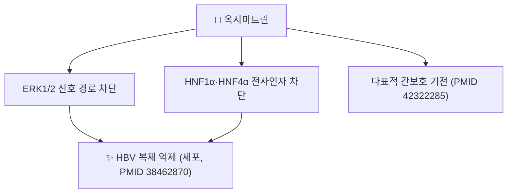

# 🔬 옥시마트린 (Oxymatrine, C₁₅H₂₄N₂O₂)

> **핵심 3줄 요약 (Key Summary)**:
> - 🌿 기원 본초 & 화학 계열: [[고삼]](苦參, *Sophora flavescens*) 및 [[산두근]](*Sophora tonkinensis*)에 함유된 사환계 루피닌형 퀴놀리지딘(Quinolizidine) 알칼로이드로, [[마트린]]의 N-옥사이드체입니다.
> - 🎯 핵심 분자 표적 & 조절 경로: 세포 실험에서 ERK1/2 신호 경로와 간세포 전사인자 HNF1α·HNF4α를 차단해 B형 간염 바이러스(HBV) 복제를 억제합니다(PMID 38462870). 다표적 간보호 알칼로이드로서의 약리 기전이 최근 종설에서 종합되었습니다(PMID 42322285).
> - 🩺 주요 약리 활성 & 질환 치료 기전: 고삼의 청열조습(淸熱燥濕)·살충이뇨(殺蟲利尿) 효능과 연계된 간보호·항바이러스 성분으로 다뤄집니다. 홍피증형 건선(erythrodermic psoriasis) 치료 효능·안전성이 임상에서 평가되었습니다(PMID 38796792).
> - ⚠️ 독성·생체이용률 한계 & 상호작용: 생체 내 간손상(TNF-α 매개 JNK 신호)이 보고되어 있고([[마트린]] 노트 §7, PMID 27097917), 옥시마트린 자체의 사람 약동학·CYP450 상호작용 정량 자료는 확인되지 않았습니다. 원문 3D 뷰어에 적힌 PubChem CID 114840은 실제로는 히게나민(Higenamine)의 CID였습니다 — 옥시마트린의 정확한 CID는 24864132입니다(2026-09-26 재확인).

---

## 📌 목차
1. [기본 화학 정보 & 분자 구조식 (Chemical Identity)](#1-기본-화학-정보--분자-구조식-chemical-identity)
2. [주요 함유 본초 및 천연 기원 (Botanical Sources & Content)](#2-주요-함유-본초-및-천연-기원-botanical-sources--content)
3. [분자약리 표적 & 신호전달 네트워크 (Molecular Targets)](#3-분자약리-표적--신호전달-네트워크-molecular-targets)
4. [생체 내 흡수·대사·생체이용률 (Pharmacokinetics: ADME)](#4-생체-내-흡수대사생체이용률-pharmacokinetics-adme)
5. [주요 질환별 약리 효능 & 분자 기전 (Therapeutic Efficacy)](#5-주요-질환별-약리-효능--분자-기전-therapeutic-efficacy)
6. [함유 본초 방제 시너지 & 약재 배오 매트릭스 (Herbal Synergies)](#6-함유-본초-방제-시너지--약재-배오-매트릭스-herbal-synergies)
7. [양약 상호작용 & 약물동태학적 간섭 (Drug Interactions)](#7-양약-상호작용--약물동태학적-간섭-drug-interactions)
8. [💡 사용자 진료실 핵심 필기 & 임상 응용 팁 (Melt-In & High-Yield)](#8--사용자-진료실-핵심-필기--임상-응용-팁-melt-in--high-yield)
9. [출처 및 학술 참고 문헌 (References)](#9-출처-및-학술-참고-문헌-references)

---

## 1. 기본 화학 정보 & 분자 구조식 (Chemical Identity)

![[옥시마트린_1_구조식.png|300]]
> [그림 1: ① 2D 화학 구조식 — 옥시마트린(PubChem CID 24864132). [[마트린]] 골격의 삼환계 질소 원자에 산소 원자가 결합한 N-옥사이드 구조. 출처: [PubChem](https://pubchem.ncbi.nlm.nih.gov/compound/24864132)]

> [!abstract]+ 🧪 3D 약리 분자 구조 (Interactive 3D Viewer)
> <iframe src="https://molecule-viewer-rho.vercel.app/?cid=24864132" style="width: 100%; height: 600px; border: none; border-radius: 12px; box-shadow: 0 4px 20px rgba(0,0,0,0.15);" allowfullscreen></iframe>

| 항목 | 내용 |
| :--- | :--- |
| **분자식 / 분자량** | C₁₅H₂₄N₂O₂ / 264.36 g/mol |
| **PubChem CID** | [24864132](https://pubchem.ncbi.nlm.nih.gov/compound/24864132) |
| **CAS 등록번호** | 16837-52-8 |
| **화학 골격 분류** | 사환계 루피닌형 퀴놀리지딘 알칼로이드 N-옥사이드 — [[마트린]]의 N-산화형 |
| **물리화학적 성상** | 백색 결정성 분말, 수용성이 매우 높음(원문) |
| **체내 대사** | 생체 내에서 간 대사를 통해 모약물인 [[마트린]]으로 상호 가역적으로 환원·전환된다고 서술되나, 이 노트에서 정량 문헌은 확인하지 못했습니다 ⚠️ |
| **천연 기원 식물** | 콩과(Fabaceae) [[고삼]](*Sophora flavescens*), [[산두근]](*Sophora tonkinensis*) |

---

## 2. 주요 함유 본초 및 천연 기원 (Botanical Sources & Content)

![[마트린_2_기원식물_고삼.jpg|340]]
> [그림 2: ② 기원 식물 실사 — 고삼(苦參, *Sophora flavescens*)의 꼬투리(협과). 약용 부위는 뿌리. 출처: Krzysztof Ziarnek (Kenraiz), [Wikimedia Commons](https://commons.wikimedia.org/wiki/File:Sophora_flavescens_kz01.jpg) (CC BY-SA 4.0)]

| 본초명 | 학명 및 기원식물 | 약용 부위 | 성분 특성 |
| :--- | :--- | :--- | :--- |
| [[고삼]] (苦參) | 콩과 / *Sophora flavescens* | 뿌리 | [[마트린]]과 공존하는 대표 퀴놀리지딘 알칼로이드 |
| [[산두근]] (山豆根) | 콩과 / *Sophora tonkinensis* | 뿌리 | 청열해독·소종이인 효능과 연계 |

* 초피 다당류(식초 법제 시호)가 옥시마트린의 간 표적성을 HNF4α·Mrp2·OCT1 단백질 발현 조절을 통해 촉진한다는 배오 연구가 있습니다(Zhou 등 2021, PMID 33075440).

---

## 3. 분자약리 표적 & 신호전달 네트워크 (Molecular Targets)

1. **HBV 복제 억제**: 세포 실험에서 옥시마트린이 ERK1/2 경로를 억제하고 간세포 핵인자 HNF1α·HNF4α의 발현을 차단해 B형 간염 바이러스 복제를 억제했습니다(Khan 등 2024, PMID 38462870).
2. **다표적 간보호 기전**: 옥시마트린의 간보호 효과가 여러 분자 표적을 통해 이뤄지는 다표적 천연 알칼로이드로 정리한 최신 종설이 있습니다(2026, PMID 42322285).
3. 원문의 "간성상세포 활성화 차단·콜라겐 침착 억제를 통한 간섬유화 방어", "L-type 칼슘 통로·IK 통로 조절을 통한 항부정맥", "TLR4/NF-κB 차단을 통한 면역조절"은 이 노트에서 옥시마트린 단독의 직접 근거를 확인하지 못했습니다 ⚠️. 관련 알칼로이드인 마트린의 TLR4/NF-κB/MAPK 매개 항염증은 별도로 확인되어 있습니다([[마트린]] 노트 §3, PMID 39447411).

---

## 4. 생체 내 흡수·대사·생체이용률 (Pharmacokinetics: ADME)

* ⚠️ 옥시마트린의 정량적 경구 흡수율·반감기·CYP 대사 데이터는 이 노트에서 확인하지 못했습니다.
* 초피 다당류 병용이 옥시마트린의 간 표적 전달을 HNF4α·Mrp2(다제내성단백질2)·OCT1(유기양이온수송체1) 발현 조절을 통해 촉진한다는 배오 연구가 있습니다(PMID 33075440) — 이는 흡수 자체보다는 간 조직 내 분포·수송체 매개 표적화에 관한 근거입니다.

---

## 5. 주요 질환별 약리 효능 & 분자 기전 (Therapeutic Efficacy)

| 적응증 | 근거 수준 | 근거 |
| :--- | :--- | :--- |
| 만성 B형 간염 | 세포 실험 | ERK1/2·HNF1α/HNF4α 차단을 통한 HBV 복제 억제(PMID 38462870) |
| 간보호(다표적) | 종설 | 다표적 천연 알칼로이드로서의 간보호 기전 종합(PMID 42322285) |
| 홍피증형 건선(erythrodermic psoriasis) | 임상 연구 | 유효성·안전성 평가(PMID 38796792) |
| 만성 간염·황달·트리코모나스 질염·심실성 조기수축(원문) | ⚠️ 확인 못함 | 고삼의 전통 효능 서술이며 옥시마트린 단독 임상 근거는 이 노트에서 확인하지 못함 |

---

## 6. 함유 본초 방제 시너지 & 약재 배오 매트릭스 (Herbal Synergies)

| 함유 본초 / 방제 | 공존 유효 성분군 | 원문의 연계 서술 | 검토 |
| :--- | :--- | :--- | :--- |
| [[고삼]] | [[마트린]] | 동일 본초의 알칼로이드/N-옥사이드 관계 | 상호 가역적 대사 전환은 이 노트에서 정량 근거 확인 못함 |
| 초피 시호(醋炙柴胡) + 고삼 | 시호 다당류 | 시호 다당류가 옥시마트린의 간 표적 전달을 촉진(HNF4α·Mrp2·OCT1 조절) | 실제 배오 연구로 확인됨(PMID 33075440) |
| [[산두근]] | — | 청열해독, 소종이인 — 급성 인후종통·편도선염 | ⚠️ 옥시마트린 단독 근거 확인 못함 |

---

## 7. 양약 상호작용 & 약물동태학적 간섭 (Drug Interactions)

* 옥시마트린 자체의 CYP450 상호작용·양약 병용 연구는 이 노트에서 확인하지 못했습니다 ⚠️.
* 관련 알칼로이드인 옥시마트린 투여로 TNF-α 매개 JNK 신호를 통한 생체 내 간손상이 보고되어 있어([[마트린]] 노트 §7, PMID 27097917), 간독성 약물과의 병용 시 주의가 이론적으로 필요합니다.

---

## 8. 💡 사용자 진료실 핵심 필기 & 임상 응용 팁 (Melt-In & High-Yield)

* 현재 별도로 기록된 원장님 임상 필기가 없습니다.

---

## 9. 출처 및 학술 참고 문헌 (References)

1. **(2026)**. *Oxymatrine: Hepatoprotective Effects of a Multitarget Natural Alkaloid*. **Journal of Agricultural and Food Chemistry**. [PMID 42322285](https://pubmed.ncbi.nlm.nih.gov/42322285/)
   - **[연구 요약]**: 옥시마트린의 다표적 간보호 약리 기전을 종합한 최신 종설.
2. **Khan A, et al. (2024)**. *Oxymatrine Inhibition of Hepatitis B Virus Replication Through ERK1/2 Pathway and HNF1α and HNF4α Block in vitro*. **Journal of the College of Physicians and Surgeons Pakistan**. [PMID 38462870](https://pubmed.ncbi.nlm.nih.gov/38462870/)
   - **[연구 요약]**: 세포 실험에서 옥시마트린이 ERK1/2 경로와 HNF1α·HNF4α를 차단해 HBV 복제를 억제함을 규명.
3. **Xiang M, Tian L, Lu S, et al. (2026)**. *Matrine and oxymatrine: a comprehensive review of multitarget mechanisms and therapeutic potential*. **Journal of Natural Medicines**, 80(4):935-952. [PMID 42319640](https://pubmed.ncbi.nlm.nih.gov/42319640/)
   - **[연구 요약]**: 마트린·옥시마트린의 다표적 기전과 치료 잠재력을 종합한 종설([[마트린]] 노트에서도 인용).
4. **(2024)**. *Efficacy and Safety of Oxymatrine in the Treatment of Patients with Erythrodermic Psoriasis*. **Dermatology and Therapy**. [PMID 38796792](https://pubmed.ncbi.nlm.nih.gov/38796792/)
   - **[연구 요약]**: 홍피증형 건선 환자에서 옥시마트린의 유효성·안전성 평가.
5. **Zhou X, et al. (2021)**. *Polysaccharides of vinegar-baked radix bupleuri promote the hepatic targeting effect of oxymatrine by regulating the protein expression of HNF4α, Mrp2, and OCT1*. **Journal of Ethnopharmacology**, 268:113610. [PMID 33075440](https://pubmed.ncbi.nlm.nih.gov/33075440/)
   - **[연구 요약]**: 초피 시호 다당류가 옥시마트린의 간 표적 전달을 수송체 발현 조절을 통해 촉진함을 규명.
6. PubChem Compound Summary — Oxymatrine (CID 24864132): [https://pubchem.ncbi.nlm.nih.gov/compound/24864132](https://pubchem.ncbi.nlm.nih.gov/compound/24864132)

**이미지 출처·라이선스**
- 그림 1: PubChem 2D 구조식 (CID 24864132) — 공공 데이터
- 그림 2: Krzysztof Ziarnek (Kenraiz), *Sophora flavescens* — [Commons](https://commons.wikimedia.org/wiki/File:Sophora_flavescens_kz01.jpg), CC BY-SA 4.0

<!-- 보관 태그(1회용·링크오류, 필요시 복원): 항바이러스, 고삼 -->
