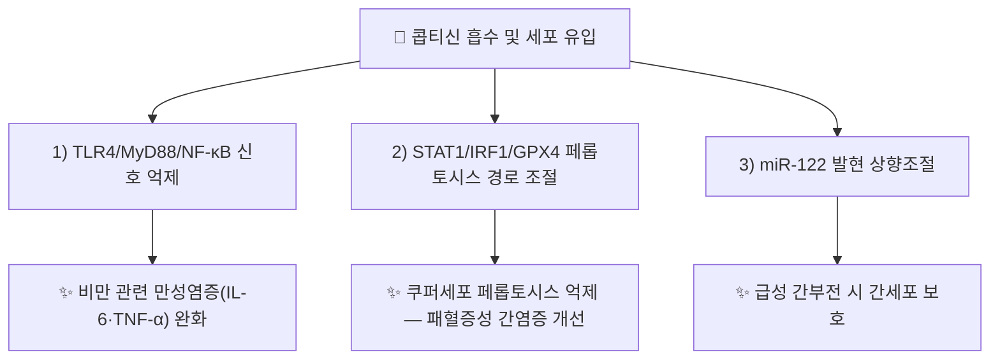

# 🔬 [[콥티신]] (Coptisine, C19H14NO4+ / 320.32 g/mol)

> 🖼️ **이미지 규격(정본)**: `.agents\rules\이미지_가이드.md` §3.3 참조. **이미지 2장(2D 구조식·기원식물) 미확보** — 자동화(정원 가꾸기) 세션 특성상 소싱 생략. 작업기록 §결과에 사유 기재.

> **핵심 3줄 요약 (Key Summary)**:
> - 🌿 기원 본초 & 화학 계열: [[황련]](黃連, *Coptis chinensis*)의 대표 지표성분 중 하나로, 벤조[c]페난트리딘(Benzo[c]phenanthridine)형 4급 이소퀴놀린 알칼로이드. [[백굴채]](*Chelidonium majus*)·현호색속(*Corydalis*)·박주가리아재비속(*Macleaya*) 식물에도 공통 함유.
> - 🎯 핵심 분자 표적 & 조절 경로: TLR4/MyD88/NF-κB 신호 억제, STAT1/IRF1 경로를 통한 페롭토시스(Ferroptosis) 조절, miR-122 발현 상향조절을 통한 간세포 보호.
> - 🩺 주요 약리 활성 & 질환 치료 기전: 항염증(비만 관련 만성염증·패혈증성 간손상), 간보호(급성 간부전), 항종양(G-quadruplex DNA 텔로미어 표적)의 다표적 활성이 보고됨.
> - ⚠️ 독성·생체이용률 한계 & 상호작용: 4급 암모늄 구조로 경구 생체이용률이 낮고, 동속 알칼로이드인 베르베린과 유사하게 CYP450 효소 간섭 및 강한 쓴맛으로 인한 위장관 자극 가능성이 있음.

---

## 📌 목차
1. [기본 화학 정보 & 분자 구조식 (Chemical Identity)](#1-기본-화학-정보--분자-구조식-chemical-identity)
2. [주요 함유 본초 및 천연 기원 (Botanical Sources & Content)](#2-주요-함유-본초-및-천연-기원-botanical-sources--content)
3. [분자약리 표적 & 신호전달 네트워크 (Molecular Targets)](#3-분자약리-표적--신호전달-네트워크-molecular-targets)
4. [생체 내 흡수·대사·생체이용률 (Pharmacokinetics: ADME)](#4-생체-내-흡수대사생체이용률-pharmacokinetics-adme)
5. [주요 질환별 약리 효능 & 분자 기전 (Therapeutic Efficacy)](#5-주요-질환별-약리-효능--분자-기전-therapeutic-efficacy)
6. [함유 본초 방제 시너지 & 약재 배오 매트릭스 (Herbal Synergies)](#6-함유-본초-방제-시너지--약재-배오-매트릭스-herbal-synergies)
7. [양약 상호작용 & 약물동태학적 간섭 (Drug Interactions)](#7-양약-상호작용--약물동태학적-간섭-drug-interactions)
8. [출처 및 학술 참고 문헌 (References)](#8-출처-및-학술-참고-문헌-references)

---
## 1. 기본 화학 정보 & 분자 구조식 (Chemical Identity)

| 항목 | 상세 내용 |
| :--- | :--- |
| **분자식 / 분자량** | C19H14NO4+ (양이온형) / 320.32 g/mol |
| **PubChem CID** | [72322](https://pubchem.ncbi.nlm.nih.gov/compound/72322) |
| **CAS 등록 번호** | 3486-66-6 (유리 양이온형) · 6020-18-4(염화물염, Coptisine chloride) |
| **화학 골격 분류** | 벤조[c]페난트리딘(Benzo[c]phenanthridine)형 4급 이소퀴놀린 알칼로이드 — [[베르베린]]·팔마틴(Palmatine)과 같은 원소벽(原小檗, Protoberberine) 알칼로이드 계열의 근연 구조체 |
| **물리화학적 성상** | 황색 결정성 분말, 강한 쓴맛(苦味)을 지니는 4급 암모늄염 형태로 수용성이 상대적으로 높음 |

---
## 2. 주요 함유 본초 및 천연 기원 (Botanical Sources & Content)

| 함유 본초 (한글/한자) | 기원 식물학적 명칭 (과명 / 학명) | 주요 함유 약용 부위 | 한의학적 귀경 및 약효 특성 |
| :--- | :--- | :--- | :--- |
| [[황련]] (黃連) | 미나리아재비과(Ranunculaceae) *Coptis chinensis* Franch. 등 | 뿌리줄기 | 귀경 심(心)·비(脾)·위(胃)·간(肝)·담(膽), 청열조습(淸熱燥濕)·사화해독(瀉火解毒) |
| [[백굴채]] (白屈菜) | 양귀비과(Papaveraceae) *Chelidonium majus* L. | 전초 | 국내 본초학에서 진통·해독·이뇨 목적으로 제한적 사용, 콥티신·켈리도닌 등 공유 |
| 현호색속 식물 | 양귀비과(Papaveraceae) *Corydalis* spp. | 덩이줄기(일부 종) | [[현호색]] 등 활혈지통(活血止痛) 계열 본초와 화학 계열 상통 |
| [[황벽]] (黃柏) | 운향과(Rutaceae) *Phellodendron* spp. | 수피 | 귀경 신(腎)·방광(膀胱), 청열조습·사화제증(瀉火除蒸) — 베르베린 위주이나 콥티신 공존 보고 |

---
## 3. 분자약리 표적 & 신호전달 네트워크 (Molecular Targets)

### 1) 핵심 분자 표적 (Molecular Targets)
* **TLR4/MyD88/NF-κB 경로 억제**: 시리아 골든 햄스터의 비만 관련 만성염증 모델에서 콥티신이 지방조직·간의 TLR4/MyD88/NF-κB 신호를 억제해 염증성 사이토카인 발현을 낮춤이 확인됨(PMID [26073947](https://pubmed.ncbi.nlm.nih.gov/26073947/)).
* **STAT1/IRF1/GPX4 매개 페롭토시스 조절**: 패혈증 간손상 모델에서 콥티신이 쿠퍼세포(Kupffer cell)의 STAT1/IRF1/GPX4 신호를 조절해 페롭토시스를 억제하고 간염증을 완화함이 보고됨(PMID [40791017](https://pubmed.ncbi.nlm.nih.gov/40791017/)).
* **G-quadruplex DNA 텔로미어 표적 항종양 기전**: 평면형 4급 벤조페난트리딘 구조가 텔로미어 G-quadruplex DNA에 결합·유도하여 항암·항염 이중 활성을 나타냄이 제시됨(PMID [40317769](https://pubmed.ncbi.nlm.nih.gov/40317769/)).

---
## 4. 생체 내 흡수·대사·생체이용률 (Pharmacokinetics: ADME)

* **낮은 경구 생체이용률**: 4급 암모늄 구조(영구 양전하)로 인해 장관 상피 투과성이 낮고, 동속 알칼로이드 베르베린과 유사하게 P-당단백질(P-gp) 유출 기질로 작용해 전신 노출이 제한적인 것으로 추정된다.
* **장내 미생물 대사**: 장내 세균총에 의한 환원·탈메틸화 대사가 흡수 전 주요 경로로 보고되며, 이는 원소벽 알칼로이드(베르베린·팔마틴 등) 계열의 공통 약동학적 특성과 일치한다.
* **간 대사**: 간 CYP450 효소(특히 CYP2D6·CYP3A4 관여 추정) 대사를 거치며, 황련 전탕액 복용 시 공존 알칼로이드(베르베린 등)와의 흡수 경쟁·상호 보완이 나타날 수 있다.

---
## 5. 주요 질환별 약리 효능 & 분자 기전 (Therapeutic Efficacy)

### 1) 대사성 염증 및 비만 관련 질환
* 고지방식이 유발 비만 햄스터 모델에서 TLR4/MyD88/NF-κB 경로 억제를 통해 지방조직·간의 만성 저등급 염증을 완화함(PMID [26073947](https://pubmed.ncbi.nlm.nih.gov/26073947/)).
### 2) 간 보호 및 패혈증성 간손상
* LPS/D-갈락토사민(D-GalN) 유발 급성 간부전 마우스 모델에서 miR-122 발현을 상향조절해 간세포 손상을 완화함(PMID [29253766](https://pubmed.ncbi.nlm.nih.gov/29253766/)).
* 패혈증 모델에서 쿠퍼세포 페롭토시스를 STAT1/IRF1/GPX4 경로로 조절해 간염증을 개선함(PMID [40791017](https://pubmed.ncbi.nlm.nih.gov/40791017/)).
### 3) 항종양 및 항염 이중 활성
* 2023년 종합 리뷰에서 암·대사질환·염증성 질환 전반에 대한 콥티신의 치료 잠재력이 정리됨(PMID [37930333](https://pubmed.ncbi.nlm.nih.gov/37930333/)).
* G-quadruplex DNA 텔로미어 유도 활성을 지닌 평면형 4급 알칼로이드로서 항암·항염 활성이 함께 보고됨(PMID [40317769](https://pubmed.ncbi.nlm.nih.gov/40317769/)).

---
## 6. 함유 본초 방제 시너지 & 약재 배오 매트릭스 (Herbal Synergies)

| 함유 본초 / 방제 | 공존 유효 성분군 | 분자약리 시너지 기전 | 전통 한의학적 효능 연계 |
| :--- | :--- | :--- | :--- |
| [[황련]] | [[베르베린]], 팔마틴, 에피베르베린 | 원소벽 알칼로이드 다중 결합으로 TLR4/NF-κB 억제 시너지 | 청열조습(淸熱燥濕)·사화해독(瀉火解毒) |
| [[좌금환]] (황련+[[오수유]]) | 콥티신·베르베린 + 오수유 에보디아민 | 청간사화(淸肝瀉火)와 화위강역(和胃降逆)의 이중 경로 조절 | 간화범위(肝火犯胃)로 인한 탄산·조잡 치료 |
| [[황련해독탕]] | 황련, [[황금]], [[황벽]], [[치자]] | 다중 청열사화약 배오로 전신 염증 경로 다표적 억제 | 삼초실열(三焦實熱) 해소 |

---
## 7. 양약 상호작용 & 약물동태학적 간섭 (Drug Interactions)

* **CYP450 효소 간섭**: 원소벽 알칼로이드 계열은 CYP2D6·CYP3A4 등에 대한 억제·유도 보고가 있어, 해당 효소로 대사되는 항부정맥제·면역억제제·일부 항암제와 병용 시 혈중 농도 변동 가능성에 유의.
* **혈당강하제 병용**: 동속 알칼로이드(베르베린)의 혈당강하 작용이 잘 알려져 있어, 콥티신 함유 본초(황련) 고용량 전탕액을 경구혈당강하제와 병용 시 저혈당 위험 모니터링 필요.
* **위장관 자극**: 강한 고미(苦味) 및 4급 알칼로이드 특성으로 장기·고용량 복용 시 소화불량·위장 자극 가능, 비위허한(脾胃虛寒) 환자 주의.

## 8. 출처 및 학술 참고 문헌 (References)

1. **Feng Y et al. (2015)**. *Coptisine attenuates obesity-related inflammation through LPS/TLR-4-mediated signaling pathway in Syrian golden hamsters*. [PMID 26073947](https://pubmed.ncbi.nlm.nih.gov/26073947/)
   - **[연구 요약]**: 고지방식이 비만 햄스터 모델에서 콥티신이 TLR4/MyD88/NF-κB 신호를 억제해 지방조직·간의 만성염증을 완화함을 확인.
2. **저자 미상 (2023)**. *Coptisine, the Characteristic Constituent from Coptis chinensis, Exhibits Significant Therapeutic Potential in Treating Cancers, Metabolic and Inflammatory Diseases*. [PMID 37930333](https://pubmed.ncbi.nlm.nih.gov/37930333/)
   - **[연구 요약]**: 황련의 특징적 지표성분인 콥티신의 항암·대사질환·항염증 치료 잠재력을 종합적으로 리뷰.
3. **Zhang Q et al. (2017)**. *Protective effect of Coptisine from Rhizoma Coptidis on LPS/D-GalN-induced acute liver failure in mice through up-regulating expression of miR-122*. [PMID 29253766](https://pubmed.ncbi.nlm.nih.gov/29253766/)
   - **[연구 요약]**: LPS/D-갈락토사민 유발 급성 간부전 마우스 모델에서 콥티신이 miR-122 발현을 상향조절해 간세포를 보호함을 규명.
4. **저자 미상 (2025)**. *Coptisine Improves Liver Inflammation in Sepsis by Regulating STAT1/IRF1/GPX4 Signaling-Mediated Kupffer Cells Ferroptosis*. [PMID 40791017](https://pubmed.ncbi.nlm.nih.gov/40791017/)
   - **[연구 요약]**: 패혈증 모델에서 콥티신이 쿠퍼세포의 STAT1/IRF1/GPX4 매개 페롭토시스를 조절해 간염증을 개선함을 확인.
5. **Valipour M et al. (2025)**. *Anticancer and Anti-Inflammatory Potential of Coptisine as a Planar Quaternary Benzo[C]Phenanthridine Alkaloid With G-Quadruplex DNA Telomeric Induction Activity*. [PMID 40317769](https://pubmed.ncbi.nlm.nih.gov/40317769/) · **Drug Development Research**, DOI: [10.1002/ddr.70071](https://analyticalsciencejournals.onlinelibrary.wiley.com/doi/10.1002/ddr.70071)
   - **[연구 요약]**: 콥티신의 평면형 4급 벤조페난트리딘 구조가 텔로미어 G-quadruplex DNA를 유도하는 항암·항염 이중 기전을 제시.
