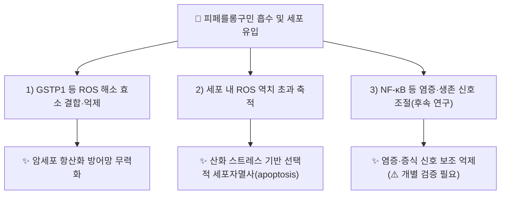

# 🔬 [[피페를롱구민]] (Piperlongumine, Piplartine / C₁₇H₁₉NO₅)

> **핵심 3줄 요약 (Key Summary)**:
> - 🌿 기원 본초 & 화학 계열: [[필발]](蓽撥, *Piper longum* L.의 덜 익은 열매이삭)에 [[피페린]]과 함께 함유된 아마이드 알칼로이드(amide alkaloid). 3,4,5-트리메톡시신나모일기와 α,β-불포화 δ-락탐(5,6-디하이드로피리돈) 골격이 아마이드 결합으로 연결된, 전자친화성(Michael acceptor) 구조.
> - 🎯 핵심 분자 표적 & 조절 경로: 암세포 내 활성산소(ROS) 해소 효소계 — 특히 글루타치온 S-전이효소 P1(GSTP1) — 와의 결합을 통한 항산화 방어망 무력화. 전사인자 NF-κB 등 염증·생존 신호 경로 조절도 후속 연구에서 제시됨.
> - 🩺 주요 약리 활성 & 질환 치료 기전: p53 활성 상태와 무관하게 다양한 암세포주에서 ROS를 세포가 감당 가능한 역치 이상으로 끌어올려 선택적 세포자멸사(apoptosis)를 유도하되, ROS 기저 수준이 낮은 정상세포는 상대적으로 보존 — 2011년 *Nature* 발표 이후 대표적 항종양 리드화합물로 연구됨.
> - ⚠️ 독성·생체이용률 한계 & 상호작용: 전자친화성 구조로 인해 피부·눈·호흡기 자극성이 보고됨(GHS 경고 H315·H319·H335). 인체 경구 생체이용률 수치, 양약과의 정량적 상호작용 데이터는 검색 범위 내에서 확인하지 못함(⚠️ 확인 필요).

---

## 📌 목차
1. [기본 화학 정보 & 분자 구조식 (Chemical Identity)](#1-기본-화학-정보--분자-구조식-chemical-identity)
2. [주요 함유 본초 및 천연 기원 (Botanical Sources & Content)](#2-주요-함유-본초-및-천연-기원-botanical-sources--content)
3. [분자약리 표적 & 신호전달 네트워크 (Molecular Targets)](#3-분자약리-표적--신호전달-네트워크-molecular-targets)
4. [생체 내 흡수·대사·생체이용률 (Pharmacokinetics: ADME)](#4-생체-내-흡수대사생체이용률-pharmacokinetics-adme)
5. [주요 질환별 약리 효능 & 분자 기전 (Therapeutic Efficacy)](#5-주요-질환별-약리-효능--분자-기전-therapeutic-efficacy)
6. [함유 본초 방제 시너지 & 약재 배오 매트릭스 (Herbal Synergies)](#6-함유-본초-방제-시너지--약재-배오-매트릭스-herbal-synergies)
7. [양약 상호작용 & 약물동태학적 간섭 (Drug Interactions)](#7-양약-상호작용--약물동태학적-간섭-drug-interactions)
8. [💡 사용자 진료실 핵심 필기 & 임상 응용 팁 (Melt-In & High-Yield)](#8--사용자-진료실-핵심-필기--임상-응용-팁-melt-in--high-yield)
9. [출처 및 학술 참고 문헌 (References)](#9-출처-및-학술-참고-문헌-references)

---
## 1. 기본 화학 정보 & 분자 구조식 (Chemical Identity)

> [!abstract]+ 🧪 3D 약리 분자 구조 (Interactive 3D Viewer)
> <iframe src="https://molecule-viewer-rho.vercel.app/?cid=637858" width="100%" height="450px" frameborder="0" allow="webgl" style="border-radius: 8px;"></iframe>

| 항목 | 상세 내용 |
| :--- | :--- |
| **IUPAC 명칭** | 1-[(2E)-3-(3,4,5-trimethoxyphenyl)prop-2-enoyl]-5,6-dihydropyridin-2(1H)-one |
| **분자식 / 분자량** | C₁₇H₁₉NO₅ / 317.34 g/mol |
| **PubChem CID** | [637858](https://pubchem.ncbi.nlm.nih.gov/compound/637858) |
| **CAS 등록 번호** | 20069-09-4 |
| **화학 골격 분류** | 아마이드 알칼로이드(피페리딘/디하이드로피리돈 계열) — α,β-불포화 이중 enone(비닐로그 아마이드, Michael acceptor) 구조를 2개 보유 |
| **물리화학적 성상** | 담황색 결정성 고체. GHS 경고(H315 피부자극·H319 안자극·H335 호흡기자극, 신호어 "Warning") — 전자친화성으로 인한 자극성 |
| **식물 내 생합성 경로** | 페닐프로파노이드 경로 유래 3,4,5-트리메톡시신나모일기가 라이신 유래 δ-발레로락탐(피페리디논) 골격과 아마이드 결합으로 연결되는 것으로 추정(⚠️ 피페를롱구민 특이적 생합성 1차 문헌은 확인하지 못함) |

---

## 2. 주요 함유 본초 및 천연 기원 (Botanical Sources & Content)

| 함유 본초 (한글/한자) | 기원 식물학적 명칭 (과명 / 학명) | 주요 함유 약용 부위 | 지표 함량 (%) | 한의학적 귀경 및 약효 특성 |
| :--- | :--- | :--- | :--- | :--- |
| [[필발]] (蓽撥) | 후추과(Piperaceae) / *Piper longum* L. | 덜 익은 건조 열매이삭 | 대한민국약전(KP) 비규격 성분 — 정량 함량 수치 ⚠️ 확인 필요(지표성분은 [[피페린]] ≥2.5%) | 위·대장경 / 온중산한(溫中散寒)·하기지통(下氣止痛)·온위소식(溫胃消食) |

> [[필발]] 노트에는 피페를롱구민이 피페린과 함께 핵심 함유 알칼로이드로 기재되어 있으나, TRPV1 활성화를 통한 관상동맥·위장관 혈류 증가 서술은 본초 전체(피페린 포함) 수준의 설명이며 피페를롱구민 단일 성분에 특이적인 1차 문헌 근거는 이번 조사에서 확인하지 못했습니다(⚠️ 확인 필요).

---

## 3. 분자약리 표적 & 신호전달 네트워크 (Molecular Targets)

### 1) 선택적 ROS 축적을 통한 항종양 기전 (2011 *Nature*, PMID 21753854)
* Broad Institute(Schreiber·Lee·Mandinova 등) 연구팀이 p53 활성 증강 물질을 스크리닝하던 중 발견. 피페를롱구민은 p53 상태와 무관하게 다양한 암세포주를 선택적으로 사멸시키되 정상세포는 상대적으로 보존했습니다.
* 기전적 근거: 암세포는 높은 대사 활성으로 인해 ROS 기저 수준이 이미 높고, 이를 억제하는 항산화 방어 효소계에 의존적입니다. 피페를롱구민이 이 방어 기전을 무력화하면 ROS가 역치를 넘어 세포사를 유발합니다. 정상세포는 ROS 기저 수준이 낮아 해당 방어 효소 의존도가 낮으므로 영향을 덜 받는 것으로 설명됩니다.
* 저자들은 이러한 ROS 의존성이 종양유전자(oncogene)에 의한 정상세포 형질전환 이후 획득되는 특성일 가능성을 제시했습니다.

### 2) 글루타치온 S-전이효소 P1(GSTP1) 결합·억제 (이론 연구, Front Chem 2018)
* 후속 양자화학·분자동역학 이론 연구(Prejanò, Marino, Russo, 2018)는 피페를롱구민이 GSTP1과 결합하여 이를 억제하는 기전을 분자 수준에서 제시했습니다. GSTP1은 암세포의 주요 ROS·이물질 해독 효소 중 하나로, 이 억제가 §1의 ROS 축적 기전을 뒷받침하는 분자적 근거로 거론됩니다.
* ⚠️ 이 연구는 이론(계산) 연구이며, 세포·동물 수준의 직접적 GSTP1 억제 실증 데이터는 이번 조사에서 개별 확인하지 못했습니다.

### 3) NF-κB 등 염증·생존 신호 경로 (⚠️ 개별 1차 문헌 미검증)
* 피페를롱구민의 전자친화성 enone 구조는 IKKβ 등 신호전달 단백질의 시스테인 잔기를 공유결합으로 변형시켜 NF-κB 경로를 억제할 수 있다는 연구들이 다수 보고되어 있으나, 이번 조사에서는 개별 논문의 PMID를 하나하나 검증하지 못했습니다. 다빈치 추가 검증 전까지 '제안된 기전' 수준으로 취급해 주십시오.

---

## 4. 생체 내 흡수·대사·생체이용률 (Pharmacokinetics: ADME)

* ⚠️ 확인 필요: 인체 경구 생체이용률(F%), 간 대사 효소(CYP) 기질 여부, 혈장 반감기 등 정량 ADME 데이터는 검색 범위 내에서 확인하지 못했습니다.
* 전자친화성 Michael acceptor 구조상 글루타치온(GSH) 등 세포 내 티올(thiol)과 비특이적으로 결합할 가능성이 이론적으로 제시되나, 이것이 생체이용률에 미치는 정량적 영향은 ⚠️ 확인 필요.

---

## 5. 주요 질환별 약리 효능 & 분자 기전 (Therapeutic Efficacy)

### 1) 항종양 (다양한 고형암·혈액암 세포주)
* 2011년 *Nature* 보고 이후 유방암·전립선암·폐암 등 다수 암세포주에서 ROS 매개 선택적 세포자멸사를 유도한다는 후속 연구들이 다수 이어진 것으로 알려져 있으나, 각 개별 논문의 PMID 검증은 이번 조사 범위를 넘어갑니다(⚠️ 확인 필요 — 리뷰 수준 참고문헌은 §9-3 참조).
* 교모세포종(glioblastoma) 수술 후 잔존암세포를 겨냥한 피페를롱구민 하이드로겔이 개발되어 임상시험 단계로 진입했다는 보도가 있습니다(Targtex사, 2022년경 1상 예정 보도 — ⚠️ 임상 결과 데이터는 확인하지 못함).

### 2) 염증·대사 보조 작용 (⚠️ 제한적 근거)
* NF-κB 경로 조절을 통한 항염증 보조 가능성이 제시되나, 임상적 의미는 아직 명확하지 않습니다.

---

## 6. 함유 본초 방제 시너지 & 약재 배오 매트릭스 (Herbal Synergies)

| 함유 본초 | 공존 유효 성분군 | 분자약리 시너지 기전 | 전통 한의학적 효능 연계 |
| :--- | :--- | :--- | :--- |
| [[필발]] | [[피페린]] | [[필발]] 노트 서술상 TRPV1 활성화를 통한 관상동맥·위장관 혈류 증가 공조(⚠️ 피페를롱구민 특이적 1차 문헌 미확인) | 온중산한(溫中散寒), 하기지통(下氣止痛) |

---

## 7. 양약 상호작용 & 약물동태학적 간섭 (Drug Interactions)

* ⚠️ 확인 필요: 피페를롱구민과 특정 양약(항암제, 항응고제 등) 간의 임상적 상호작용을 직접 다룬 문헌은 검색 범위 내에서 확인하지 못했습니다.
* 전자친화성 구조상 다른 전자친화성 항암제(백금계 등)와 글루타치온 고갈 경로에서 상가 작용이 이론적으로 존재할 수 있으나(⚠️ 추정), 실측 근거는 아닙니다.

---

## 8. 💡 사용자 진료실 핵심 필기 & 임상 응용 팁 (Melt-In & High-Yield)

* ⚠️ 내용 검토 필요: 원장님의 진료실 필기가 아직 반영되지 않았습니다. [[필발]] 처방 시 피페를롱구민 관련 임상 노트를 추가해 주시면 다음 순찰 시 정리해 드리겠습니다.

---

## 9. 출처 및 학술 참고 문헌 (References)

1. **Raj L, Ide T, Gurkar AU, et al. (2011)**. *Selective killing of cancer cells by a small molecule targeting the stress response to ROS*. **Nature**, 475(7355), 231-234. doi:10.1038/nature10167.
   - [PubMed: PMID 21753854](https://pubmed.ncbi.nlm.nih.gov/21753854/)
   - **[연구 요약]**: p53 활성 증강 물질 스크리닝 중 발견된 피페를롱구민이 p53 상태와 무관하게 다양한 암세포주를 ROS 역치 초과 방식으로 선택적 사멸시키고 정상세포는 보존함을 최초 보고.
2. **Prejanò M, Marino T, Russo N. (2018)**. *On the Inhibition Mechanism of Glutathione Transferase P1 by Piperlongumine. Insight From Theory*. **Frontiers in Chemistry**, 6, 606. doi:10.3389/fchem.2018.00606.
   - **[연구 요약]**: 양자화학·분자동역학 계산을 통해 피페를롱구민의 GSTP1 결합·억제 기전을 분자 수준에서 제시한 이론 연구.
3. **Piska K, Gunia-Krzyżak A, Koczurkiewicz P, Wójcik-Pszczoła K, Pękala E. (2018)**. *Review of piperlongumine as a lead anticancer compound and its analogues*. **European Journal of Medicinal Chemistry**, 156, 13-20.
   - **[연구 요약]**: 피페를롱구민을 리드화합물로 삼은 항종양 유도체 개발 현황을 종합한 리뷰.

> ⚠️ 확인 불가/추정 표시 총괄: 인체 ADME 정량 데이터, NF-κB 관련 개별 1차 문헌, 교모세포종 하이드로겔 임상시험 결과, 필발 내 피페를롱구민 정량 함량은 검색 범위 내에서 확인하지 못해 각 섹션에 개별 표시했습니다. PubChem CID·CAS 번호·PMID 21753854는 실제 데이터베이스·문헌에서 확인된 값입니다.

---
🏛️ **상위 허브**: [[00_약리성분_MOC]]
