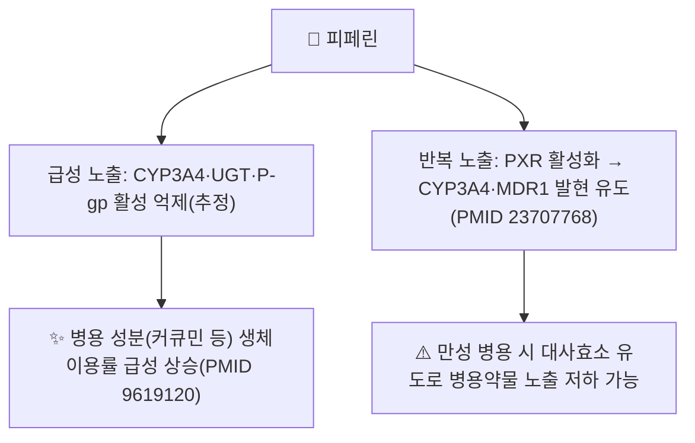

# 🔬 피페린 (Piperine, C₁₇H₁₉NO₃)

> **핵심 3줄 요약 (Key Summary)**:
> - 🌿 기원 본초 & 화학 계열: 후추과(Piperaceae) [[후추]](*Piper nigrum*) 및 [[필발]](*Piper longum*)의 열매에 함유된 매운맛의 피페리딘계 알칼로이드입니다.
> - 🎯 핵심 분자 표적 & 조절 경로: 사람 대상 고전 연구에서 피페린 병용이 커큐민의 생체이용률을 크게 높였습니다(Shoba 등 1998, PMID 9619120). 다만 세포 실험에서는 피페린이 사람 프레그난 X 수용체(PXR)를 활성화해 CYP3A4·MDR1(P-당단백) 발현을 **유도**한다는 보고도 있어(Wang 등 2013, PMID 23707768), "피페린=대사효소 억제제"라는 통념이 급성 억제와 만성 유도라는 이중적 그림으로 복잡해집니다.
> - 🩺 주요 약리 활성 & 질환 치료 기전: 강황([[커큐민]]) 등 지용성 성분의 흡수 증강제(bioenhancer)로 배합되며, 후추·필발의 온중산한(溫中散寒)·하기지통(下氣止痛) 효능과 연계됩니다. 다만 커큐민+피페린 복합제의 슬관절 골관절염 임상시험은 위약과 유의한 차이를 보이지 않았습니다(2026, PMID 42331134) — "흡수를 높이면 효과도 커진다"는 가정이 임상적으로 자동 성립하지 않음을 보여주는 반증 사례입니다.
> - ⚠️ 독성·생체이용률 한계 & 상호작용: 대사효소·유출펌프에 관여하는 성분인 만큼 병용 약물의 혈중 농도를 급성으로는 높이고 반복 노출 시에는 유도할 수 있어 방향을 예단하기 어렵습니다. 다약제 복용자에서는 상호작용 확인이 필요합니다.

---

## 📌 목차
1. [기본 화학 정보 & 분자 구조식 (Chemical Identity)](#1-기본-화학-정보--분자-구조식-chemical-identity)
2. [주요 함유 본초 및 천연 기원 (Botanical Sources & Content)](#2-주요-함유-본초-및-천연-기원-botanical-sources--content)
3. [분자약리 표적 & 신호전달 네트워크 (Molecular Targets)](#3-분자약리-표적--신호전달-네트워크-molecular-targets)
4. [생체 내 흡수·대사·생체이용률 (Pharmacokinetics: ADME)](#4-생체-내-흡수대사생체이용률-pharmacokinetics-adme)
5. [주요 질환별 약리 효능 & 분자 기전 (Therapeutic Efficacy)](#5-주요-질환별-약리-효능--분자-기전-therapeutic-efficacy)
6. [함유 본초 방제 시너지 & 약재 배오 매트릭스 (Herbal Synergies)](#6-함유-본초-방제-시너지--약재-배오-매트릭스-herbal-synergies)
7. [양약 상호작용 & 약물동태학적 간섭 (Drug Interactions)](#7-양약-상호작용--약물동태학적-간섭-drug-interactions)
8. [💡 사용자 진료실 핵심 필기 & 임상 응용 팁 (Melt-In & High-Yield)](#8--사용자-진료실-핵심-필기--임상-응용-팁-melt-in--high-yield)
9. [출처 및 학술 참고 문헌 (References)](#9-출처-및-학술-참고-문헌-references)

---

## 1. 기본 화학 정보 & 분자 구조식 (Chemical Identity)

![[피페린_1_구조식.png|300]]
> [그림 1: ① 2D 화학 구조식 — 피페린(PubChem CID 638024). 피페리딘 고리에 메틸렌디옥시페닐기가 결합된 사슬형 아미드 구조. 출처: [PubChem](https://pubchem.ncbi.nlm.nih.gov/compound/638024)]

> [!abstract]+ 🧪 3D 약리 분자 구조 (Interactive 3D Viewer)
> <iframe src="https://molecule-viewer-rho.vercel.app/?cid=638024" style="width: 100%; height: 600px; border: none; border-radius: 12px; box-shadow: 0 4px 20px rgba(0,0,0,0.15);" allowfullscreen></iframe>

| 항목 | 내용 |
| :--- | :--- |
| **IUPAC 명칭** | (2E,4E)-5-(1,3-benzodioxol-5-yl)-1-piperidin-1-ylpenta-2,4-dien-1-one |
| **분자식 / 분자량** | C₁₇H₁₉NO₃ / 285.34 g/mol |
| **PubChem CID** | [638024](https://pubchem.ncbi.nlm.nih.gov/compound/638024) |
| **CAS 등록번호** | 94-62-2 |
| **화학적 분류** | 피페리딘계 알칼로이드 (Piperidine alkaloid) |
| **천연 기원 식물** | [[후추]](胡椒), [[필발]](蓽撥) |

---

## 2. 주요 함유 본초 및 천연 기원 (Botanical Sources & Content)

![[피페린_2_기원식물_후추.jpg|360]]
> [그림 2: ② 기원 식물 실사 — 후추(*Piper nigrum*)의 미숙 열매(녹색 통후추). 약용 부위는 열매. 출처: Vengolis, [Wikimedia Commons](https://commons.wikimedia.org/wiki/File:Piper_nigrum_fruits.jpg) (CC BY-SA 3.0)]

| 본초명 | 학명 및 기원식물 | 약용 부위 | 한의학적 성미·효능 |
| :--- | :--- | :--- | :--- |
| [[후추]] (胡椒) | 후추과 / *Piper nigrum* | 열매 | 대열(大熱)·신(辛), 위장의 찬 기운을 몰아내고 막힌 기운을 뚫음(온중산한) |
| [[필발]] (蓽撥) | 후추과 / *Piper longum* | 열매(이삭) | 대열·신, 온중산한·하기지통 |

---

## 3. 분자약리 표적 & 신호전달 네트워크 (Molecular Targets)

* **생체이용률 증강(bioenhancer) 효과**: 사람 대상 연구에서 피페린 20mg 병용이 커큐민의 혈중 곡선하면적(AUC)을 유의하게 높였습니다(Shoba 등 1998, PMID 9619120). 원문의 "최대 2,000%(20배)"라는 구체적 수치는 이 논문에서 보고된 범위이나, 시험 조건(용량·검체)에 따라 배수가 달라질 수 있습니다.
* **PXR 활성화를 통한 CYP3A4·MDR1 유도**: 세포 실험에서 피페린은 사람 프레그난 X 수용체(PXR)를 활성화해 CYP3A4와 다제내성단백질1(MDR1, P-gp) 유전자 발현을 유도했습니다(Wang YM 등 2013, PMID 23707768). 이는 원문의 "CYP3A4·P-gp 억제"와 반대 방향의 기전이며, 급성 노출(효소 활성 억제)과 반복·만성 노출(유전자 발현 유도)이 서로 다른 결과를 낼 수 있음을 시사합니다 ⚠️.
* 원문의 "TRPV1 자극을 통한 소화액 분비·열생성", "COX-2/PGE2 억제를 통한 항염증" 서술은 이 노트에서 피페린 단독의 직접 근거를 확인하지 못했습니다 ⚠️.

---

## 4. 생체 내 흡수·대사·생체이용률 (Pharmacokinetics: ADME)

* 피페린 자체의 사람 대상 정량적 흡수율·반감기 자료는 이 노트에서 확인하지 못했습니다 ⚠️.
* 병용 성분(커큐민)의 생체이용률을 높이는 bioenhancer 효과는 사람 대상으로 확인되었으나(PMID 9619120), 피페린 자신의 약동학 프로파일은 별도 문헌 확인이 필요합니다.

---

## 5. 주요 질환별 약리 효능 & 분자 기전 (Therapeutic Efficacy)

| 적응증 | 근거 수준 | 근거 |
| :--- | :--- | :--- |
| 커큐민 등 지용성 성분 흡수 증강 | 사람 임상 | AUC 유의 상승(PMID 9619120) |
| 무릎 골관절염 (커큐민+피페린 복합제) | RCT (음성 결과) | 위약 대비 군간차 0.16mm로 유의차 없음(PMID 42331134) |
| 비위 허한성 소화불량·냉통(원문) | ⚠️ 확인 못함 | 후추·필발의 전통 효능 서술이며 피페린 단독의 직접 임상 근거는 확인하지 못함 |

* PMID 42331134(2026, *Osteoarthritis and Cartilage*)의 무릎 골관절염 경구 복합제 RCT는 피페린 5mg/일을 커큐민 500mg의 흡수 증강 목적으로 포함했으나, **복합제 전체가 위약과 임상적으로 다르지 않았습니다.** 이는 "흡수를 올리면 효과가 커진다"는 가정이 임상 결과로 자동 검증되지 않는다는 반증 사례입니다.

---

## 6. 함유 본초 방제 시너지 & 약재 배오 매트릭스 (Herbal Synergies)

| 함유 본초 / 방제 | 공존 유효 성분군 | 원문의 연계 서술 | 검토 |
| :--- | :--- | :--- | :--- |
| [[후추]]·[[필발]] | 피페린 동종체(피페롱구민 등) | 탕전·처방에서 약효를 신속히 퍼지게 하는 통락(通絡) 역할 | ⚠️ 정량적 시너지 근거는 확인하지 못함 |
| 강황([[커큐민]]) 복합제 | 커큐민 | 피페린이 커큐민 흡수를 증대 | 사람 임상으로 흡수 증대는 확인(PMID 9619120), 임상적 유효성 증대는 반증됨(PMID 42331134) |

---

## 7. 양약 상호작용 & 약물동태학적 간섭 (Drug Interactions)

* **급성 병용 시**: CYP3A4·UGT·P-gp 기능이 일시적으로 억제될 경우 병용 약물의 혈중 농도가 상승할 가능성이 있습니다(원문 서술, 이 노트에서 직접 검증 문헌은 확인하지 못함 ⚠️).
* **반복·만성 병용 시**: PXR 활성화를 통한 CYP3A4·MDR1 유도가 확인되어(PMID 23707768) 오히려 병용 약물의 대사·유출이 촉진되어 혈중 농도가 낮아질 가능성도 이론적으로 존재합니다.
* 다약제 복용자, 특히 좁은 치료역 약물(면역억제제·항응고제 등) 복용자는 피페린 함유 제제 병용 시 방향을 예단하지 말고 개별 확인이 필요합니다.

---

## 8. 💡 사용자 진료실 핵심 필기 & 임상 응용 팁 (Melt-In & High-Yield)

* **본초학적 매핑**: 후추([[후추]])와 필발([[필발]])은 대열(大熱)하고 맵고 따뜻하여 위와 장의 찬 기운을 몰아내고 막힌 기운을 뚫습니다(온중산한, 하기지통).
* 탕전·처방에서 흡수를 돕는 전통적 역할(통락)이 현대 약리학의 bioenhancer 개념과 대응된다는 해석이 있으나, §5의 임상시험 음성 결과를 함께 고려해 과도한 기대는 경계해야 합니다.

---

## 9. 출처 및 학술 참고 문헌 (References)

1. **Shoba G, Joy D, Joseph T, et al. (1998)**. *Influence of piperine on the pharmacokinetics of curcumin in animals and human volunteers*. **Planta Medica**, 64(4):353-356. [PMID 9619120](https://pubmed.ncbi.nlm.nih.gov/9619120/)
   - **[연구 요약]**: 피페린 병용이 사람에서 커큐민의 생체이용률을 유의하게 향상시킴을 입증한 고전적 약동학 연구.
2. **Wang YM, et al. (2013)**. *Piperine activates human pregnane X receptor to induce the expression of cytochrome P450 3A4 and multidrug resistance protein 1*. **Toxicology and Applied Pharmacology**, 272(1):96-107. [PMID 23707768](https://pubmed.ncbi.nlm.nih.gov/23707768/)
   - **[연구 요약]**: 피페린이 PXR 활성화를 통해 CYP3A4·MDR1 발현을 유도함을 규명 — 급성 억제와는 반대 방향의 기전.
3. **(2026)**. 무릎 골관절염 경구 복합제(커큐민+피페린 등) 무작위대조시험. **Osteoarthritis and Cartilage**, 34(10):1515-1524. [PMID 42331134](https://pubmed.ncbi.nlm.nih.gov/42331134/)
   - **[연구 요약]**: 커큐민 500mg + 피페린 5mg/일 복합제가 위약 대비 무릎 골관절염 지표에서 유의한 차이를 보이지 않음.
4. PubChem Compound Summary — Piperine (CID 638024): [https://pubchem.ncbi.nlm.nih.gov/compound/638024](https://pubchem.ncbi.nlm.nih.gov/compound/638024)

**이미지 출처·라이선스**
- 그림 1: PubChem 2D 구조식 (CID 638024) — 공공 데이터
- 그림 2: Vengolis, *Piper nigrum* fruits — [Commons](https://commons.wikimedia.org/wiki/File:Piper_nigrum_fruits.jpg), CC BY-SA 3.0

<!-- 보관 태그(1회용·링크오류, 필요시 복원): 후추, 필발, 생체이용률증강 -->
