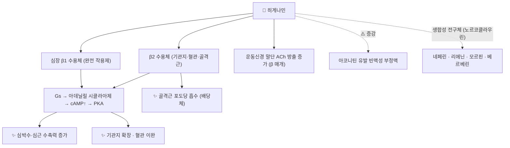

# 🔬 히게나민 (Higenamine = 노르코클라우린, C₁₆H₁₇NO₃)

> 📎 **통합 안내 (2026-09-26)**: 같은 물질을 다루던 `노르코클라우린` 노트를 이 노트로 통합했습니다. 노르코클라우린은 식물 생합성 연구에서 쓰는 이름이고, 히게나민은 약리·임상·도핑 분야에서 쓰는 이름입니다. PubChem에서 (S)-노르코클라우린(CID 440927)은 **(−)-히게나민**과 같은 물질로 등록되어 있습니다.

> **핵심 3줄 요약 (Key Summary)**:
> - 🌿 기원 본초 & 화학 계열: [[부자]](附子)·[[세신]](細辛)·[[연자심]](蓮子心) 등에 들어 있는 가장 단순한 **벤질이소퀴놀린 알칼로이드**. 식물 안에서는 [[도파민]]과 4-HPAA가 노르코클라우린 합성효소(NCS)로 축합되어 생기며(PMID 20428026), [[모르핀]]·[[베르베린]]·[[네페린]] 등 수천 종 BIA의 출발 골격이다.
> - 🎯 핵심 분자 표적: **비선택적 β 아드레날린 작용제** — 생쥐 심방에서 β1 완전 작용제(박동수 EC50 38 nM, 이소프로테레놀과 같은 최대 반응; PMID 7861670), 인간 β2 수용체 발현 세포에서 β2 작용제(PMID 33369180). cAMP 증가로 심박수·심근 수축력↑, 기관지 확장.
> - 🩺 주요 약리 활성: 부자의 강심(회양구역) 성분으로 거론되며, 서맥·심부전의 전통적 사용, 약물 부하 심근관류 영상, 당뇨병성 심근병증·허혈-재관류·대동맥류·우울 모델 보호(동물).
> - ⚠️ 주의: ① **WADA 상시 금지 β2 작용제** — 연자심 0.8 g 하루 3회 3일 복용 6명 전원이 소변 보고 기준(10 ng/mL)을 넘었다(PMID 31973198). ② 부자의 [[아코니틴]]이 일으키는 빈맥성 부정맥을 히게나민이 **증강**했다(PMID 7861670) — "히게나민 = 안전한 강심 성분"으로 단정하면 안 된다. ③ β 자극에 따른 빈맥·심계항진.

---

## 📌 목차
1. [기본 화학 정보 & 분자 구조식 (Chemical Identity)](#1-기본-화학-정보--분자-구조식-chemical-identity)
2. [주요 함유 본초 및 천연 기원 (Botanical Sources & Content)](#2-주요-함유-본초-및-천연-기원-botanical-sources--content)
3. [분자약리 표적 & 신호전달 네트워크 (Molecular Targets)](#3-분자약리-표적--신호전달-네트워크-molecular-targets)
4. [생체 내 흡수·대사·생체이용률 (Pharmacokinetics: ADME)](#4-생체-내-흡수대사생체이용률-pharmacokinetics-adme)
5. [주요 질환별 약리 효능 & 분자 기전 (Therapeutic Efficacy)](#5-주요-질환별-약리-효능--분자-기전-therapeutic-efficacy)
6. [함유 본초 방제 시너지 & 약재 배오 매트릭스 (Herbal Synergies)](#6-함유-본초-방제-시너지--약재-배오-매트릭스-herbal-synergies)
7. [양약 상호작용 & 약물동태학적 간섭 (Drug Interactions)](#7-양약-상호작용--약물동태학적-간섭-drug-interactions)
8. [💡 사용자 진료실 핵심 필기 & 임상 응용 팁 (Melt-In & High-Yield)](#8--사용자-진료실-핵심-필기--임상-응용-팁-melt-in--high-yield)
9. [출처 및 학술 참고 문헌 (References)](#9-출처-및-학술-참고-문헌-references)

---

## 1. 기본 화학 정보 & 분자 구조식 (Chemical Identity)

### 1.1 화학적 특성
히게나민은 1,2,3,4-테트라히드로이소퀴놀린 고리(6,7-디올 = 카테콜)의 1번 탄소에 4-히드록시벤질기가 붙은 페놀 OH 3개짜리 알칼로이드입니다. 카테콜 구조가 [[노르에피네프린]]·[[에피네프린]]·이소프로테레놀 같은 카테콜아민과 닮아 β 아드레날린 수용체에 결합하는 구조적 바탕이 됩니다. 1번 탄소가 키랄 중심이라 (S)형·(R)형이 있으며, 대부분의 약리·도핑 문헌은 이성질체를 구분하지 않고 '히게나민'으로 보고합니다.

| 항목 (Property) | 세부 정보 (Specification) |
| :--- | :--- |
| **IUPAC 명칭** | 1-[(4-hydroxyphenyl)methyl]-1,2,3,4-tetrahydroisoquinoline-6,7-diol (PubChem, 라세미) |
| **분자식 / 분자량** | C₁₆H₁₇NO₃ / 271.31 g/mol |
| **PubChem CID** | [114840](https://pubchem.ncbi.nlm.nih.gov/compound/114840) (히게나민, 라세미) · [440927](https://pubchem.ncbi.nlm.nih.gov/compound/440927) ((S)-노르코클라우린 = (−)-히게나민) — ⚠️ 기존 노트의 CID 1123은 **타우린**이라 정정 |
| **CAS 등록번호** | 5843-65-2 (라세미) · 22672-77-1 ((S)형) — PubChem 동의어 기준, CAS 원본 대조는 못 함 |
| **화학 골격 분류** | 1-벤질테트라히드로이소퀴놀린 — BIA 계열의 시조 골격 |
| **물리화학 지표** | XLogP 2.2 · TPSA 72.7 Ų · 수소결합 공여 4 / 수용 4 (PubChem 계산값). ⚠️ 원문 LogP 1.18은 출처 미확인 |
| **성상·융점·용해도** | 백색~미황색 결정성 분말, 융점 250~253 °C, 물에 난용·산성 수용액·메탄올 가용 ⚠️ 원문 기재, 1차 자료 대조 못 함 |
| **식물 내 생합성** | L-[[티로신]] → 도파민 + 4-HPAA → (NCS, 피크테-스펭글러 축합) → (S)-노르코클라우린 (PMID 20428026) |

### 1.2 2D 분자 구조식
![[히게나민_1_화학구조식.png|320]]
> [그림 1: ① 2D 화학 구조식 — 히게나민(PubChem CID 114840, 라세미). 6,7-디올(카테콜) 이소퀴놀린 + 4-히드록시벤질기. (S)형은 1번 탄소가 쐐기 배치인 (−)-히게나민 = (S)-노르코클라우린. 출처: [PubChem](https://pubchem.ncbi.nlm.nih.gov/compound/114840)]

### 1.3 3D 약리 분자 구조 (Interactive Viewer)
> [!abstract]+ 🧪 3D 약리 분자 구조 (Interactive 3D Viewer)
> <iframe src="https://molecule-viewer-rho.vercel.app/?cid=114840" width="100%" height="450px" frameborder="0" allow="webgl" style="border-radius: 8px;"></iframe>

---

## 2. 주요 함유 본초 및 천연 기원 (Botanical Sources & Content)

![[히게나민_2_기원식물_연꽃.jpg|380]]
> [그림 2: ② 기원 식물 실사 — 연꽃(*Nelumbo nucifera* Gaertn.). 씨의 녹색 배아(연자심)에 히게나민과 그 배당체가 들어 있다. 출처: H. Zell, [Wikimedia Commons](https://commons.wikimedia.org/wiki/File:Nelumbo_nucifera_002.JPG) (CC BY-SA 3.0)]

| 함유 본초 | 기원 식물 (과명 / 학명) | 약용 부위 | 한의학적 효능 | 근거 |
| :--- | :--- | :--- | :--- | :--- |
| [[부자]] (附子) | 미나리아재비과 / *Aconitum carmichaelii* Debeaux (포제품) | 곁뿌리 | 회양구역·보화조양 | 아코니틴과 함께 부자의 성분(PMID 7861670) · 함유 식물로 정리(PMID 35161335). ⚠️ 원문 함량 0.001~0.005%는 출처 미확인 |
| [[초오]] (草烏) | 미나리아재비과 / *Aconitum* 속 | 덩이뿌리 | 거풍습·온경지통 | ⚠️ 원문 기재, 초오 자체의 함유 근거는 이번에 확인 못 함 |
| [[세신]] (細辛) | 쥐방울덩굴과 / *Asarum sieboldii*·*A. heterotropoides* | 뿌리 | 산한해표·온폐화음 | 함유 식물로 정리(*Higenamine in Plants as a Source of Unintentional Doping*, PMID 35161335) |
| [[연자심]] (蓮子心) | 연꽃과 / *Nelumbo nucifera* | 씨의 녹색 배아 | 청심안신·강심화 | 시판 연자심 제품에서 정량·복용자 소변 검출(PMID 31973198·31680485), 히게나민 4'-O-β-D-글루코시드 분리(PMID 25943853). *(원문의 '[[연자육]]'은 배아를 뺀 씨라 연자심으로 정정)* |
| [[후박]]·[[산조인]]·[[신이]]·[[승마]]·[[황련]]·산초 | 각 기원 | — | — | 일본 한방 엑스제 분석에서 히게나민 새로 확인(Sakamoto 2025, PMID 40751788) |

* 함유 식물은 종설에서 연꽃·틴오스포라속·남천·그네툼속·세신 2종·부자·쥐방울덩굴속으로 정리됩니다(*Higenamine in Plants as a Source of Unintentional Doping*, PMID 35161335).
  * 소변 대사체 연구의 서론에서도 부자·번려지(*Annona squamosa*)·남천이 함유 식물로 언급됩니다(Zhao 2022, *Identification and characterization of higenamine metabolites in human urine*, PMID 35325800).

### 2.1 생합성: BIA 계열의 시원 물질 (노르코클라우린)
![[히게나민_2_NCS_생합성반응.png|450]]
> [그림 3: ② 생합성 반응 — 도파민과 4-히드록시페닐아세트알데히드가 물 한 분자를 내놓으며 (S)-노르코클라우린으로 축합(NCS 촉매). 출처: Gilded Snail, [Wikimedia Commons](https://commons.wikimedia.org/wiki/File:(S)-norcoclaurine_synthesis.svg) (CC BY-SA 4.0)]

![[히게나민_2_BIA_생합성경로.png|500]]
> [그림 4: ② 생합성 경로 개관 — L-티로신이 두 갈래(→ L-DOPA → 도파민 / → 4-HPAA)로 나뉜 뒤 다시 만나 1-벤질이소퀴놀린 골격을 이룬다. 출처: Andel, [Wikimedia Commons](https://commons.wikimedia.org/wiki/File:Benzylisoquinoline_Biosynthesis.svg) (Public domain)]

* **NCS 반응**: NCS는 도파민과 4-HPAA의 **피크테-스펭글러 축합**을 입체선택적으로 촉매해 BIA의 중심 전구체 (S)-노르코클라우린을 만들며, 전형적인 이중기능(산·염기) 촉매 기전을 따릅니다(Bonamore 2010, *Norcoclaurine synthase: mechanism of an enantioselective Pictet-Spengler catalyzing enzyme*, PMID 20428026).
* **분기**: 이후 메틸화·수산화·산화 결합을 거쳐 [[코클라우린]] → 레티쿨린을 지나 [[모르핀]](양귀비)·[[베르베린]](황련) 등으로 분화합니다(원문). 반대로 체내에서는 코클라우린이 탈메틸화되어 히게나민이 될 수 있습니다(§4).
* **연꽃은 (R)형 우세**: 양귀비 등 미나리아재비목 식물은 (S)형 벤질이소퀴놀린이 주류인 반면, 연꽃은 아포르핀·비스벤질이소퀴놀린에서 **(R) 이성질체가 우세**합니다. 연꽃에서는 (R,S)-노르코클라우린이 모두 생기지만 R-특이적 메틸전이효소·시토크롬 P450 산화효소가 (R)형 산물을 우선 만들며, 비스벤질이소퀴놀린 골격 형성 효소도 확인되었습니다(2023, *enantiospecific benzylisoquinoline alkaloid biosynthetic pathways in sacred lotus*, PMID 36805479) — 연자심의 [[네페린]]·[[리에닌]]으로 가는 경로입니다. 연잎의 [[누시페린]]도 같은 계열 아포르핀입니다.
  * 연꽃 BIA의 다양성·입체화학은 종설로 정리되어 있습니다(Menéndez-Perdomo 2018, *Benzylisoquinoline Alkaloids Biosynthesis in Sacred Lotus*, PMID 30404216).

---

## 3. 분자약리 표적 & 신호전달 네트워크 (Molecular Targets)

### 3.1 β 아드레날린 수용체 작용
* **β1 — 심장**: 생쥐 우심방에서 박동수(EC50 38 nM)와 좌심방 수축력(EC50 97 nM)을 이소프로테레놀과 같은 최대치까지 올렸고, 이 효과는 프로프라놀롤·프락톨롤(β1)로 막혔으나 부톡사민(β2)으로는 막히지 않아 **β1 완전 작용제**로 판정되었습니다(Kimura 1994, PMID 7861670).
* **β2 — 기관지·혈관·골격근**: 분리 조직·동물·소수 임상 자료가 부분적 β2 작용을 뒷받침하며, 인간 β2 수용체 발현 CHO 세포에서 작용제 활성이 확인되었습니다(Hudzik 2021, *Adrenoceptor agonist activity of higenamine*, PMID 33369180).
  * 종설은 β1·β2 모두 활성화하는 **비선택적 β 작용제**로 정리합니다(Shi 2025, *A Narrative Review on Higenamine: Pharmacological Properties and Clinical Applications*, PMID 40290051).
* **신호전달(원문)**: Gs → 아데닐릴 시클라아제 → [[cAMP]] 상승 → PKA가 L형 칼슘 통로를 인산화해 심근 수축력을 높이고, 혈관 평활근에서는 MLCK 불활성화로 이완시킵니다. 이는 β 수용체의 교과서적 경로입니다.

### 3.2 혈관 확장·혈압
* β2 작용은 관상동맥·말초 혈관 확장과 후부하 감소 방향과 맞습니다(원문). 다만 β1 작용으로 심박수가 함께 오르므로 순효과를 '혈압 강하'로 단정할 수 없습니다. [[연자심]] 노트의 "노르코클라우린이 네페린과 함께 평활근을 이완시켜 혈압을 낮춘다"는 서술은 히게나민 단일 성분 근거를 확인하지 못했습니다 ⚠️.

### 3.3 기타 표적
* **신경근접합부**: 생쥐 횡격막에서 히게나민(10 μM)은 β 수용체를 통해 ACh 방출과 근장력을 늘렸고(프로프라놀롤로 차단), 같은 부자 성분인 [[코리네인]]은 반대로 ACh 방출을 줄였습니다(Nojima 2000, PMID 11256693).
* **포도당 흡수**: 연자심의 히게나민 4'-O-β-D-글루코시드는 L6 근관세포 포도당 흡수를 β2 수용체를 통해 늘렸습니다(Kato 2015, PMID 25943853).
* **당뇨병성 심근병증**: STZ 당뇨 마우스·H9C2 세포에서 히게나민 염산염은 RhoA 억제를 통해 MEK/ERK를 눌러 심근 염증·산화 스트레스·섬유화·세포사멸을 줄였고, RhoA 억제제 파수딜이 이 보호 효과를 없앴습니다(Li 2025, PMID 41469427).
* **허혈-재관류**: β2-AR/PI3K/AKT 경로 활성화로 심근세포 사멸을 억제했습니다(Wu 2016, PMID 26746354, 제목 기준).

---

## 4. 생체 내 흡수·대사·생체이용률 (Pharmacokinetics: ADME)

| 항목 | 내용 | 근거 |
| :--- | :--- | :--- |
| **사람 정맥 투여** | 0.5→4.0 μg/kg/min 단계 증량(건강인 10명): Cmax 15.1~44.0 ng/mL, **반감기 0.133시간(약 8분)**, 분포용적 48 L, 청소율 249 L/h, 8시간 소변 회수 9.3%. 심박수 EC50 8.1 μg/L | Feng 2012, PMID 23085737 |
| **경구 흡수(토끼)** | 10분 안에 최고 농도, 절대 생체이용률 약 20~22%(AUC 기준), 말단 반감기 22분, 혈장 단백결합 54.8%, 두 흡수군으로 갈림 | Lo 1996, PMID 8968531 |
| **대사(사람)** | 5 mg 복용 후 소변에서 대사체 32종: 메틸화 6·황산 포합 10·글루쿠론산 포합 16. **메틸화가 주 경로** | Zhao 2022, PMID 35325800 |
| **전구물질에서의 생성** | [[코클라우린]] 투여 마우스 소변에서 히게나민 검출, 사람 간 마이크로솜에서 코클라우린 → 히게나민 생성 | Sakamoto 2025, PMID 40751788 |
| **경구 복용 후 소변** | 연자심 0.8 g(히게나민 679.6 μg) × 3회/일 × 3일 → 6명 전원 10 ng/mL 초과 · 연자심 캡슐(0.34 g × 6/일 × 7일) 최대 500 ng/mL | PMID 31973198 · Yan 2019, PMID 31680485 |

* 원문의 "경구 Tmax 20~40분, 반감기 15~30분, COMT·SULT 대사"는 방향이 대체로 맞지만 수치는 사람 자료로 확인되지 않았습니다 ⚠️ — 사람 정맥 반감기는 약 8분, 토끼 경구 Tmax는 10분 이내였고, 사람 대사는 메틸화(COMT 경로로 추정)·황산·글루쿠론산 포합이 모두 확인됩니다.
* 랫드 경구 약동학도 도핑 분석 목적으로 연구되어 있습니다(Wang 2020, PMID 31881121, 제목·초록 기준 수치 없음).

---

## 5. 주요 질환별 약리 효능 & 분자 기전 (Therapeutic Efficacy)

| 적응 영역 | 근거 | 근거 수준 |
| :--- | :--- | :--- |
| 서맥·부정맥·[[심부전 hf]] (전통 활용) | 중국 전통의학에서 서맥·부정맥·심부전에 사용되어 왔다고 정리 | 종설 (PMID 40290051) |
| 약물 부하 심근관류 영상 | 히게나민을 부하 약제로 쓴 실험·혈역학 연구 | 중국어 연구, 제목 기준 (PMID 15932714·11953198) |
| [[천식]]·기관지 수축 | β2 작용에 따른 기관지 확장 | 종설 (PMID 40290051) |
| 당뇨병성 심근병증 | RhoA/MEK/ERK 억제 | 동물·세포 (PMID 41469427) |
| 허혈-재관류 심근 손상 | β2-AR/PI3K/AKT 활성화 | 동물 (PMID 26746354) |
| [[복부 대동맥류]] | 산화 스트레스·염증 조절로 혈관 평활근세포 사멸 억제 | 동물 (Li 2026, PMID 41207100) |
| [[우울장애]] | CUMS 마우스(20 mg/kg)에서 성상세포-신경세포 글루타메이트 수송 개선, 흥분독성·신경염증·세포사멸 감소([[플루옥세틴]] 대조) | 동물·세포 (Wang 2026, PMID 42551229) |
| 혈당 | 연자심 히게나민 배당체의 β2 매개 포도당 흡수 | 세포 (PMID 25943853) |

* 원문의 "심인성 쇼크 소생", "중국 주사제로 확장성 심부전 환자의 운동 내약성·LVEF 개선"은 이번 작업에서 임상 문헌을 확인하지 못했습니다 ⚠️.
* ⚠️ 사람 근거는 정맥 투여 1상(심박수, PMID 23085737)과 소변 배설·대사 연구뿐입니다. 치료 효과를 입증한 임상시험은 확인되지 않았습니다.

---

## 6. 함유 본초 방제 시너지 & 약재 배오 매트릭스 (Herbal Synergies)

![[부자-20240916012214999.png|300]]
> [그림 5: 부자의 또 다른 도파민 유래 성분 코리네인(coryneine, 4급 암모늄) 구조식 — 원본 첨부 이미지. 히게나민과 달리 운동신경 말단의 ACh 방출을 **줄이고** 탈분극성 신경근 차단을 일으킨다(PMID 11256693·7492984). *(기존 캡션 '가공 부자 생약'은 이미지 내용과 달라 정정)*]

### 6.1 회양구역(回陽救逆)과 부자 성분의 양면성
* **원문 필기**: 사지가 싸늘하고 맥이 잡히지 않는 망양(亡陽) 위급증을 되살리는 부자의 회양구역 효능을, 히게나민의 심근 수축력·심박출량 증대와 말초 혈관 확장으로 설명한다. 부자의 맹독은 [[아코니틴]](Na⁺ 채널 지속 개방 → 심실성 부정맥)에서 오고, 오래 달이는 포제로 아코니틴을 분해하면서 수용성 히게나민의 강심 효과를 살린다.
* **2026-09-26 보강 — 두 성분의 상호작용**: 생쥐 우심방에서 아코니틴은 Na⁺ 채널·무스카린 수용체를 통해 빈맥성 부정맥을 일으켰는데, 그 자체로는 박동수를 바꾸지 않는 저농도 히게나민(2.5 nM)이 이 부정맥을 **증강**했습니다(Kimura 1994, PMID 7861670). 즉 포제가 불충분해 아코니틴이 남아 있으면 히게나민의 β1 작용이 부정맥 위험을 키울 수 있습니다. "히게나민은 안전한 강심 성분"이라는 해석은 **아코니틴이 충분히 제거된 경우에 한정**해야 합니다.
* 부자 안에는 방향이 반대인 성분이 함께 있습니다 — 히게나민(β 작용, ACh 방출↑)과 코리네인(ACh 방출↓, 탈분극성 차단)(PMID 11256693).

### 6.2 처방·본초 배오 매트릭스

| 함유 본초 / 방제 | 공존 성분 | 히게나민 관련 연결 | 전통 효능 연계 |
| :--- | :--- | :--- | :--- |
| [[사역탕]] (부자·[[건강]]·[[감초]]) | 아코니틴류(포제로 감소) | 부자의 강심 성분 | 회양구역 — 사지궐냉·맥미욕절 |
| [[진무탕]] (복령·작약·백출·생강·부자) | 〃 | 〃 | 온양이수 — 심부전성 부종(음수)에 응용 |
| [[부자이중탕]] | 〃 | 〃 | 온중산한 |
| 마황세신부자탕 ([[마황]]·[[세신]]·[[부자]]) | [[에페드린]] (마황) | 세신·부자 두 약재가 히게나민 함유 + 마황의 에페드린 — **교감신경 자극 성분이 겹침** | 태소양감 — 오한·맥침 |
| [[연자심]] | [[네페린]], [[리에닌]], 히게나민 배당체 | 네페린·리에닌의 생합성 전구 골격이자 β 작용 성분 | 청심안신 — 네페린의 **진정**(동물)과 히게나민의 **β 자극**이 한 약재에 공존 |
| [[황련]]·[[황백]] | [[베르베린]] | 같은 BIA 계열. 황련에서 히게나민, 황백에서 코클라우린 검출(PMID 40751788) | 청열조습 |

* ⚠️ 처방 전탕액에서 히게나민의 정량 기여나 공존 성분과의 상호작용을 측정한 연구는 확인되지 않았습니다. 원문의 사역탕 배오 해석(건강의 진저롤·쇼가올, 감초의 글리시리진이 협력)은 전통 해석으로 두며 실험 근거는 확인하지 못했습니다.

---

## 7. 양약 상호작용 & 약물동태학적 간섭 (Drug Interactions)

* **도핑 — 가장 실제적인 위험**: 히게나민은 2017년부터 WADA 상시 금지 β2 작용제입니다(PMID 33369180). 연자심 복용만으로 보고 기준을 넘었고(PMID 31973198·31680485), 금지 목록에 없는 [[코클라우린]]도 체내에서 히게나민으로 바뀔 수 있어 [[육계]]·[[후박]]·[[오수유]]·[[세신]]·산초·[[승마]]·[[대추]]·포부자·[[황백]] 등 코클라우린 함유 약재도 위험 요인으로 제시되었습니다(PMID 40751788). 대부분의 검사실은 유리형만 보는데, 산 가수분해 후 분석해야 위음성을 줄일 수 있다는 권고가 있습니다(PMID 35325800).
* **β 차단제 — 길항**: 생쥐 심방에서 히게나민의 박동수 증가는 프로프라놀롤·프락톨롤로 막혔습니다(PMID 7861670). β 차단제 복용 환자에서는 히게나민 함유 약재의 강심 효과가 줄어들 수 있습니다(사람 연구 없음).
* **β 작용제·교감신경 흥분제 — 이론적 상가**: [[알부테롤]] 등 β2 작용제, [[에페드린]](마황)·[[에피네프린]]·도부타민과 병용 시 빈맥·심계항진이 더해질 수 있습니다. 실제로 도부타민(1 nM)도 히게나민처럼 아코니틴 부정맥을 증강했습니다(PMID 7861670).
* **아코니틴 함유 약재(포제 불충분한 부자·초오)**: 위 §6.1 — 부정맥 증강(동물 심방).
* **체중 감량 보충제**: 히게나민은 체중 감량 용도로도 연구되어(PMID 40290051·35325800) 보충제로 섭취하는 환자가 있을 수 있으므로 복용력을 확인합니다.
* ⚠️ CYP·수송체 상호작용 연구는 확인되지 않았습니다.

---

## 8. 💡 사용자 진료실 핵심 필기 & 임상 응용 팁 (Melt-In & High-Yield)

* **(원문 필기)** 부자의 천연 베타 강심 물질 — 아코니틴의 독성과 구별되는 심박출량 개선의 약효 주역.
  * → **보강**: 단, 아코니틴이 남아 있으면 부정맥을 오히려 키울 수 있다(PMID 7861670). 포제 품질이 전제.
* **(원문 필기)** 운동선수에게 부자·세신 함유 처방 투여 시 도핑 양성이 나올 수 있으므로 엄격한 복약 확인.
  * → **보강**: 연자심(연심차 포함)이 가장 확실한 위험원(사람 연구 2건). 대회 기간·비대회 기간 모두 피하도록 안내(PMID 31973198).
* **(구 노르코클라우린 노트 필기)** 노르코클라우린은 BIA의 "시조 골격"으로 이해하면 모르핀·베르베린·리에닌·네페린이 한 뿌리에서 갈라진다는 점을 한 번에 설명할 수 있음.
* **(구 노르코클라우린 노트 필기)** 연자심의 청심사화 효능은 심화로 인한 번조·불면·고혈압 경향 설명에 연결.
  * → **보강**: 번조·불면의 진정 근거는 [[네페린]] 쪽이고(동물), 히게나민은 오히려 심박수를 올리는 β 작용제입니다. "연자심 = 혈압 내리는 약"으로 단정하지 않습니다.
* **마황세신부자탕 주의**: 마황(에페드린)·세신·부자(히게나민)가 모두 교감신경계를 자극하는 방향이라 빈맥·고혈압 환자에서는 용량과 맥박을 확인합니다(기전적 추론).

---

## 9. 출처 및 학술 참고 문헌 (References)

1. **Kimura I, et al. (1994)**. *Positive chronotropic and inotropic effects of higenamine and its enhancing action on the aconitine-induced tachyarrhythmia in isolated murine atria*. **Jpn J Pharmacol**, 66(1):75-80. [PMID 7861670](https://pubmed.ncbi.nlm.nih.gov/7861670/) · [DOI](https://doi.org/10.1254/jjp.66.75)
   - **[연구 요약]**: 히게나민은 심방 β1 완전 작용제(EC50 38·97 nM)이며 아코니틴 유발 빈맥성 부정맥을 증강.
2. **Hudzik TJ, Patel M, Brown A. (2021)**. *β2-Adrenoceptor agonist activity of higenamine*. **Drug Test Anal**, 13(2):261-267. [PMID 33369180](https://pubmed.ncbi.nlm.nih.gov/33369180/) · [DOI](https://doi.org/10.1002/dta.2992)
   - **[연구 요약]**: 2017 WADA 금지 배경, in silico·CHO 세포 β2 작용제 활성 확인.
3. **Shi H, Cheng L, Li H, et al. (2025)**. *A Narrative Review on Higenamine: Pharmacological Properties and Clinical Applications*. **Nutrients**, 17(6):1030. [PMID 40290051](https://pubmed.ncbi.nlm.nih.gov/40290051/) · [DOI](https://doi.org/10.3390/nu17061030)
   - **[연구 요약]**: 비선택적 β1/β2 작용제, 심장·기관지·체중 감량·WADA 관련 종설.
4. **Zhang N, Lian Z, Peng X, et al. (2017)**. *Applications of Higenamine in pharmacology and medicine*. **J Ethnopharmacol**, 196:242-252. [PMID 28007527](https://pubmed.ncbi.nlm.nih.gov/28007527/)
   - **[연구 요약]**: 히게나민의 약리·의학적 응용 종설.
5. **Feng S, Jiang J, Hu P, et al. (2012)**. *A phase I study on pharmacokinetics and pharmacodynamics of higenamine in healthy Chinese subjects*. **Acta Pharmacol Sin**, 33(11):1353-1358. [PMID 23085737](https://pubmed.ncbi.nlm.nih.gov/23085737/) · [DOI](https://doi.org/10.1038/aps.2012.114)
   - **[연구 요약]**: 건강인 정맥 주입, 반감기 0.133시간, 청소율 249 L/h, 심박수 EC50 8.1 μg/L.
6. **Lo CF, Chen CM. (1996)**. *Pharmacokinetics of higenamine in rabbits*. **Biopharm Drug Dispos**, 17(9):791-803. [PMID 8968531](https://pubmed.ncbi.nlm.nih.gov/8968531/)
   - **[연구 요약]**: 토끼 반감기 22분, 경구 10분 내 최고 농도, 절대 생체이용률 약 20%, 단백결합 54.8%.
7. **Zhao X, Yuan Y, Wei H, et al. (2022)**. *Identification and characterization of higenamine metabolites in human urine by quadrupole-orbitrap LC-MS/MS for doping control*. **J Pharm Biomed Anal**, 214:114732. [PMID 35325800](https://pubmed.ncbi.nlm.nih.gov/35325800/) · [DOI](https://doi.org/10.1016/j.jpba.2022.114732)
   - **[연구 요약]**: 사람 소변 대사체 32종(메틸화 주 경로), 산 가수분해 분석 권고.
8. **Wang R, Xiong X, Yang M, et al. (2020)**. *A pharmacokinetics study of orally administered higenamine in rats using LC-MS/MS for doping control analysis*. **Drug Test Anal**, 12(4):485-495. [PMID 31881121](https://pubmed.ncbi.nlm.nih.gov/31881121/)
   - **[연구 요약]**: 랫드 경구 투여 약동학·소변 배설을 도핑 분석 목적으로 측정.
9. **Yen CC, Tung CW, Chang CW, et al. (2020)**. *Potential Risk of Higenamine Misuse in Sports: Evaluation of Lotus Plumule Extract Products and a Human Study*. **Nutrients**, 12(2):285. [PMID 31973198](https://pubmed.ncbi.nlm.nih.gov/31973198/) · [DOI](https://doi.org/10.3390/nu12020285)
   - **[연구 요약]**: 연자심 복용 6명 전원 소변 히게나민이 WADA 보고 기준 초과.
10. **Yan K, Wang X, Wang Z, et al. (2019)**. *The risk of higenamine adverse analytical findings following oral administration of plumula nelumbinis capsules*. **Drug Test Anal**, 11(11-12):1731-1736. [PMID 31680485](https://pubmed.ncbi.nlm.nih.gov/31680485/) · [DOI](https://doi.org/10.1002/dta.2701)
    - **[연구 요약]**: 연자심 캡슐 7일 복용 시 대부분 기준 초과, 최대 500 ng/mL.
11. **Sakamoto S, Osaki K, Abe H, et al. (2025)**. *Metabolism of coclaurine into the WADA-banned substance higenamine: a doping-relevant analytical evaluation of Kampo extracts*. **J Nat Med**, 79(5):1140-1153. [PMID 40751788](https://pubmed.ncbi.nlm.nih.gov/40751788/) · [DOI](https://doi.org/10.1007/s11418-025-01940-4)
    - **[연구 요약]**: 코클라우린 → 히게나민 대사, 한방 엑스제 14개 생약에서 히게나민/코클라우린 검출.
12. **Rangelov Kozhuharov V, Ivanov K, Ivanova S. (2022)**. *Higenamine in Plants as a Source of Unintentional Doping*. **Plants (Basel)**, 11(3):354. [PMID 35161335](https://pubmed.ncbi.nlm.nih.gov/35161335/) · [DOI](https://doi.org/10.3390/plants11030354)
    - **[연구 요약]**: 연꽃·부자·세신 등 히게나민 함유 식물과 비의도적 도핑 위험 정리.
13. **Kato E, Inagaki Y, Kawabata J. (2015)**. *Higenamine 4'-O-β-d-glucoside in the lotus plumule induces glucose uptake of L6 cells through β2-adrenergic receptor*. **Bioorg Med Chem**, 23(13):3317-3321. [PMID 25943853](https://pubmed.ncbi.nlm.nih.gov/25943853/)
    - **[연구 요약]**: 연자심 히게나민 배당체의 β2 매개 포도당 흡수 촉진.
14. **Nojima H, Okazaki M, Kimura I. (2000)**. *Counter effects of higenamine and coryneine, components of aconite root, on acetylcholine release from motor nerve terminal in mice*. **J Asian Nat Prod Res**, 2(3):195-203. [PMID 11256693](https://pubmed.ncbi.nlm.nih.gov/11256693/)
    - **[연구 요약]**: 히게나민은 β 매개로 ACh 방출 증가, 코리네인은 감소.
15. **Kimura M, Kimura I, Muroi M, et al. (1995)**. *Depolarizing neuromuscular blocking action of coryneine derived from aconite root in isolated mouse phrenic nerve-diaphragm muscles*. **Biol Pharm Bull**, 18(5):691-695. [PMID 7492984](https://pubmed.ncbi.nlm.nih.gov/7492984/)
    - **[연구 요약]**: 부자 유래 코리네인의 탈분극성·혼합형 신경근 차단.
16. **Li Y, Wang L, Guan T, et al. (2025)**. *Higenamine Hydrochloride Ameliorates Diabetic Cardiomyopathy Through RhoA/MEK/ERK Pathway*. **Inflammation**, 49(1):21. [PMID 41469427](https://pubmed.ncbi.nlm.nih.gov/41469427/) · [DOI](https://doi.org/10.1007/s10753-025-02403-4)
    - **[연구 요약]**: RhoA/MEK/ERK 억제로 당뇨병성 심근병증 완화(마우스·H9C2).
17. **Wang H, Chen C, Tian Z, et al. (2026)**. *Higenamine exerts an antidepressant effect by reducing neuronal damage induced by glutamate excitotoxicity: Based on crosstalk between astrocytes and neuron*. **Phytomedicine**, 160:158608. [PMID 42551229](https://pubmed.ncbi.nlm.nih.gov/42551229/) · [DOI](https://doi.org/10.1016/j.phymed.2026.158608) *(기존 기재 권호 '142'는 오류라 정정)*
    - **[연구 요약]**: CUMS 마우스에서 글루타메이트 흥분독성 억제를 통한 항우울 효과.
18. **Li JY, Li J, Guo RK, et al. (2026)**. *Higenamine alleviates abdominal aortic aneurysm by regulating oxidative stress and inflammation against VSMC apoptosis*. **Int Immunopharmacol**, 168(Pt 1):115809. [PMID 41207100](https://pubmed.ncbi.nlm.nih.gov/41207100/) · [DOI](https://doi.org/10.1016/j.intimp.2025.115809)
    - **[연구 요약]**: 복부 대동맥류 모델에서 혈관 평활근세포 사멸 억제.
19. **Wu MP, et al. (2016)**. *Higenamine protects ischemia/reperfusion induced cardiac injury and myocyte apoptosis through activation of β2-AR/PI3K/AKT signaling pathway*. **Pharmacol Res**, 104:115-123. [PMID 26746354](https://pubmed.ncbi.nlm.nih.gov/26746354/) (제목 기준)
    - **[연구 요약]**: β2-AR/PI3K/AKT 활성화로 허혈-재관류 심근 손상 완화.
20. **Bonamore A, Barba M, Botta B, Boffi A, Macone A. (2010)**. *Norcoclaurine synthase: mechanism of an enantioselective Pictet-Spengler catalyzing enzyme*. **Molecules**, 15(4):2070-2078. [PMID 20428026](https://pubmed.ncbi.nlm.nih.gov/20428026/) · [DOI](https://doi.org/10.3390/molecules15042070)
21. **Menéndez-Perdomo IM, Facchini PJ. (2018)**. *Benzylisoquinoline Alkaloids Biosynthesis in Sacred Lotus*. **Molecules**, 23(11):2899. [PMID 30404216](https://pubmed.ncbi.nlm.nih.gov/30404216/)
    - **[연구 요약]**: 연꽃 BIA의 다양성·입체화학·생합성 효소 종설.
22. **Menéndez-Perdomo IM, Facchini PJ. (2023)**. *Elucidation of the (R)-enantiospecific benzylisoquinoline alkaloid biosynthetic pathways in sacred lotus (Nelumbo nucifera)*. **Sci Rep**, 13(1):2955. [PMID 36805479](https://pubmed.ncbi.nlm.nih.gov/36805479/) · [DOI](https://doi.org/10.1038/s41598-023-29415-0)
23. **Zheng YL, et al. (2005)**. *[Experimental study of pharmaceutic stress myocardial perfusion imaging with higenamine]*. **Zhonghua Xin Xue Guan Bing Za Zhi**, 33(5):473-475. [PMID 15932714](https://pubmed.ncbi.nlm.nih.gov/15932714/) (제목 기준)
    - **[연구 요약]**: 히게나민 약물 부하 심근관류 영상 실험(중국어).
24. **Zhang Z, et al. (2002)**. *[Effects of higeramine on hemodynamics and its tolerability and safety, an experimental study]*. **Zhonghua Yi Xue Za Zhi**, 82(5):352-355. [PMID 11953198](https://pubmed.ncbi.nlm.nih.gov/11953198/) (제목 기준)
    - **[연구 요약]**: 히게나민 혈역학·내약성 실험(중국어).
25. **Stojanovic B, et al. (2024)**. *Urinary excretion profile of higenamine in females after oral administration of supplements — Doping scenario*. **J Chromatogr B**, 1235:124047. [PMID 38387341](https://pubmed.ncbi.nlm.nih.gov/38387341/) (제목 기준)
    - **[연구 요약]**: 여성의 보충제 경구 복용 후 소변 배설 양상.
26. PubChem — Higenamine (CID 114840): [https://pubchem.ncbi.nlm.nih.gov/compound/114840](https://pubchem.ncbi.nlm.nih.gov/compound/114840) · (S)-Norcoclaurine (CID 440927): [https://pubchem.ncbi.nlm.nih.gov/compound/440927](https://pubchem.ncbi.nlm.nih.gov/compound/440927)

**이미지 출처·라이선스**
- 그림 1: PubChem 2D 구조식 (CID 114840) — 공공 데이터
- 그림 2: H. Zell, *Nelumbo nucifera* — [Commons](https://commons.wikimedia.org/wiki/File:Nelumbo_nucifera_002.JPG), CC BY-SA 3.0
- 그림 3: Gilded Snail, *(S)-norcoclaurine synthesis* — [Commons](https://commons.wikimedia.org/wiki/File:(S)-norcoclaurine_synthesis.svg), CC BY-SA 4.0
- 그림 4: Andel, *Benzylisoquinoline Biosynthesis* — [Commons](https://commons.wikimedia.org/wiki/File:Benzylisoquinoline_Biosynthesis.svg), Public domain
- 그림 5: 원본 첨부 이미지 (코리네인 구조식)

<!-- 보관 태그(1회용·링크오류, 필요시 복원): 강심제 -->
