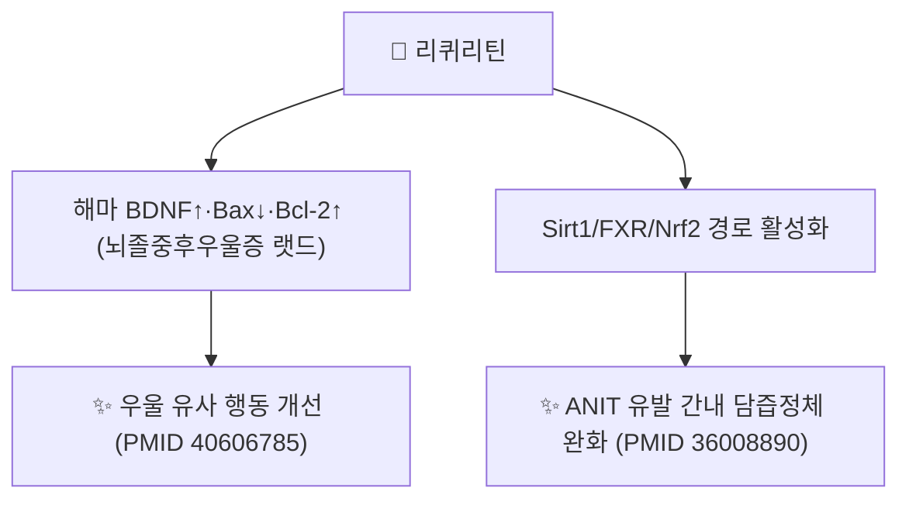
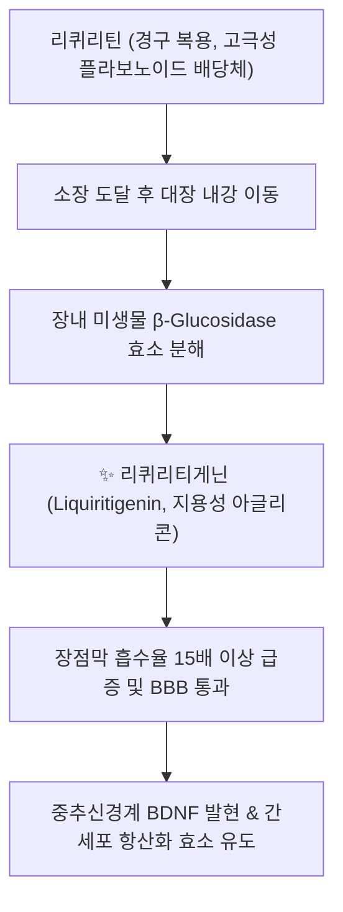

# 💊 [[리퀴리틴]] (Liquiritin)

> **핵심 3줄 요약 (Key Summary)**:
> - 🌿 기원 본초 & 화학 계열: 콩과 [[감초]](*Glycyrrhiza uralensis*)의 뿌리에서 추출되는 대표적인 플라바논계 플라보노이드 배당체.
> - 🎯 핵심 분자 표적 & 조절 경로: 비배당체인 리퀴리티게닌으로 대사되어 BDNF/TrkB 신경 보호, Nrf2/ARE 항산화 활성화 및 NF-κB 염증 경로 차단 작용을 발휘.
> - 🩺 주요 약리 활성 & 질환 치료 기전: 신경쇠약, 우울증 및 간 손상 보호의 핵심 분자 지표이자 감초의 화중완급(和中緩急)과 해독 효능을 [[글리시리진]]과 함께 대변하는 양대 지표 성분.
> - ⚠️ 독성·생체이용률 한계 & 상호작용: 장내 미생물 대사(β-glucosidase 가수분해)에 흡수가 좌우되며, 감초의 전신 가성알도스테론증·디곡신 상호작용은 주로 글리시리진에 기인하므로 리퀴리틴 자체의 CYP 상호작용 데이터는 제한적.

---

## 📌 목차
1. [기본 화학 정보 & 분자 구조식 (Chemical Identity)](#1-기본-화학-정보--분자-구조식-chemical-identity)
2. [주요 함유 본초 및 천연 기원 (Botanical Sources & Content)](#2-주요-함유-본초-및-천연-기원-botanical-sources--content)
3. [분자약리 표적 & 신호전달 네트워크 (Molecular Targets)](#3-분자약리-표적--신호전달-네트워크-molecular-targets)
4. [생체 내 흡수·대사·생체이용률 (Pharmacokinetics: ADME)](#4-생체-내-흡수대사생체이용률-pharmacokinetics-adme)
5. [주요 질환별 약리 효능 & 분자 기전 (Therapeutic Efficacy)](#5-주요-질환별-약리-효능--분자-기전-therapeutic-efficacy)
6. [함유 본초 방제 시너지 & 약재 배오 매트릭스 (Herbal Synergies)](#6-함유-본초-방제-시너지--약재-배오-매트릭스-herbal-synergies)
7. [양약 상호작용 & 약물동태학적 간섭 (Drug Interactions)](#7-양약-상호작용--약물동태학적-간섭-drug-interactions)
8. [💡 사용자 진료실 핵심 필기 & 임상 응용 팁 (Melt-In & High-Yield)](#8--사용자-진료실-핵심-필기--임상-응용-팁-melt-in--high-yield)
9. [출처 및 학술 참고 문헌 (References)](#9-출처-및-학술-참고-문헌-references)

---

## 1. 기본 화학 정보 & 분자 구조식 (Chemical Identity)

![[리퀴리틴_1_구조식.png|300]]
> [그림 1: ① 2D 화학 구조식 — 리퀴리틴(PubChem CID 503737). 플라바논(리퀴리티게닌) 골격의 4' 위치에 포도당이 결합된 O-배당체. 출처: [PubChem](https://pubchem.ncbi.nlm.nih.gov/compound/503737)]

> [!abstract]+ 🧪 3D 약리 분자 구조 (Interactive 3D Viewer)
> <iframe src="https://molecule-viewer-rho.vercel.app/?cid=503737" style="width: 100%; height: 600px; border: none; border-radius: 12px; box-shadow: 0 4px 20px rgba(0,0,0,0.15);" allowfullscreen></iframe>

| 항목 | 상세 정보 |
| :--- | :--- |
| **화학명 (IUPAC)** | (2S)-7-Hydroxy-2-(4-{[(2S,3R,4S,5S,6R)-3,4,5-trihydroxy-6-(hydroxymethyl)oxan-2-yl]oxy}phenyl)-3,4-dihydro-2H-1-benzopyran-4-one |
| **분자식 및 분자량** | C21H22O9 / 418.39 g/mol |
| **CAS 등록번호** | 551-15-5 |
| **기원 본초** | 콩과(*Fabaceae*) [[감초]](*Glycyrrhiza uralensis* / *G. glabra*)의 뿌리 및 근경 |
| **화학적 골격** | 플라바논(Flavanone) 골격 4' 위치에 포도당(Glucose)이 결합된 O-배당체 |
| **품질 관리 규격** | 대한민국약전(KP) 기준 감초 중 리퀴리틴 1.0% 이상 함유 필수 규정 |

---
## 2. 주요 함유 본초 및 천연 기원 (Botanical Sources & Content)

| 함유 본초 (한글/한자) | 기원 식물학적 명칭 (과명 / 학명) | 주요 함유 부위 | 한의학적 귀경 및 약효 특성 |
| :--- | :--- | :--- | :--- |
| [[감초]] (甘草) | 콩과(Fabaceae) / *Glycyrrhiza uralensis* (*G. glabra*) | 뿌리 및 근경 | 비·위·폐경 귀경, 화중완급(和中緩急)·해독·조화제약(調和諸藥) |

---

## 3. 분자약리 표적 & 신호전달 네트워크 (Molecular Targets)

### 1) BDNF 발현 조절 및 항우울 기전

* **해마 BDNF/Bax/Bcl-2 발현 조절**:
  * 뇌졸중후우울증(post-stroke depression) 랫드 모델에서 리퀴리틴이 해마의 BDNF 발현을 높이고 促아폽토시스 단백질 Bax를 낮추며 항아폽토시스 단백질 Bcl-2를 높였습니다(Yan GL 등 2025, PMID 40606785).
  * 원문의 "TrkB 수용체 인산화 유도", "SSRI 유사 효과"라는 구체적 기전·비교는 이 논문에서 직접 확인하지 못했습니다 ⚠️.
* **글루타메이트 흥분독성(Excitotoxicity) 억제**:
  * 뇌허혈 손상 시 과다 방출되는 글루타메이트에 의한 신경세포 내 칼슘 유입을 차단하고 Caspase-3 활성을 억제하여 신경세포 사멸을 방어한다는 서술은 원문이며, 이 노트에서 개별 문헌으로 확인하지 못했습니다 ⚠️.

---

### 2) 간세포 보호 — Sirt1/FXR/Nrf2 경로 (확인된 기전)

* **Sirt1/FXR/Nrf2 경로를 통한 담즙정체 완화**:
  * ANIT(알파-나프틸이소티오시아네이트) 유발 간내 담즙정체 마우스 모델에서 리퀴리틴(40·80 mg/kg 경구)이 혈청 생화학 지표와 간 병리 소견을 개선했습니다. ANIT로 억제된 Sirt1·FXR 발현이 리퀴리틴 전처치로 회복되었고, Nrf2 핵 내 발현이 증가했으며, 담즙산 수송체(Bsep·Ntcp·Mrp3·Mrp4) mRNA 발현도 늘었습니다(Yan M 등 2023, PMID 36008890).
  * 원문의 "아세트아미노펜·알코올·사염화탄소(CCl4) 간독성 경감"은 이 논문의 대상(ANIT 담즙정체 모델)과 다르며, 이 노트에서 직접 확인하지 못했습니다 ⚠️.
* **NF-κB 억제를 통한 항염증**:
  * IκBα 인산화 억제를 통한 iNOS·COX-2 차단은 원문 서술이며, 이 노트에서 리퀴리틴 단독의 직접 근거를 확인하지 못했습니다 ⚠️. 다만 위 ANIT 모델에서 TNF-α·IL-1β 감소는 실제로 보고되었습니다(PMID 36008890).

---

---

## 4. 생체 내 흡수·대사·생체이용률 (Pharmacokinetics: ADME)

### 장내 미생물 대사와 리퀴리티게닌(Liquiritigenin) 활성화

* **아글리콘(Aglycone)으로의 생체 전환**:
  * 리퀴리틴은 장내 상주균(*Bacteroides*, *Eubacterium*)의 작용으로 4' 위치의 당 잔기가 가수분해되어 지용성이 높은 **리퀴리티게닌**으로 전환됩니다.
  * 리퀴리티게닌은 에스트로겐 수용체 베타(ERβ)에 선택적으로 작용하여 호르몬 의존성 종양 위험 없이 혈관 및 신경 보호 작용을 나타냅니다.

---
## 5. 주요 질환별 약리 효능 & 분자 기전 (Therapeutic Efficacy)

| 적응증 | 근거 수준 | 근거 |
| :--- | :--- | :--- |
| 뇌졸중후우울증 | 동물(랫드) | 해마 BDNF↑·Bax↓·Bcl-2↑(PMID 40606785) |
| 간내 담즙정체(ANIT 모델) | 동물(마우스) | Sirt1/FXR/Nrf2 경로 활성화, 담즙산 수송체 발현 증가(PMID 36008890) |
| 신경쇠약·뇌허혈 신경손상·전신 만성염증(원문) | ⚠️ 확인 못함 | 이 노트에서 리퀴리틴 단독의 직접 근거를 확인하지 못함 |

---

## 6. 함유 본초 방제 시너지 & 약재 배오 매트릭스 (Herbal Synergies)

* **글리시리진(사포닌)과 리퀴리틴(플라보노이드)의 상호보완**:
  * 감초의 단맛과 위알도스테론 작용은 사포닌인 [[글리시리진]]에서 비롯되지만, 신경 진정·항산화·항경련 및 비위 점막 재생은 플라보노이드인 리퀴리틴이 주도합니다.
* **대표 한의 처방**:
  * [[작약감초탕]]: 작약의 [[페오니플로린]]과 감초의 리퀴리틴이 협력하여 골격근 및 평활근 연축을 즉각 이완(완급지통).
  * [[감두탕]]: 흑두의 안토시아닌과 감초의 리퀴리틴이 중금속 및 약물 중독을 분자 수준에서 킬레이션 해독.
  * [[사역탕]]: 부자의 아코니틴 심혈관계 독성을 완충하고 회양구역의 약력을 보조.

---
## 7. 양약 상호작용 & 약물동태학적 간섭 (Drug Interactions)

* **글리시리진과의 구분**: 감초의 전신적인 가성알도스테론증(저칼륨혈증, 혈압상승) 및 디곡신 등과의 상호작용은 주로 사포닌 성분인 [[글리시리진]](Glycyrrhizin)/글리시레틴산에 기인하는 것으로 알려져 있으며, 플라보노이드인 리퀴리틴 자체의 구체적 CYP450 상호작용 임상 데이터는 확인되지 않음.
* **항우울제·간대사 약물 병용 시 유의점**: 리퀴리틴이 BDNF/TrkB 경로에 작용하는 점을 고려할 때, SSRI 등 기존 항우울제 병용 시 상가적 효과 가능성을 배제할 수 없으나 구체적 임상 상호작용 연구는 확인되지 않아 단정할 수 없음.

---

## 8. 💡 사용자 진료실 핵심 필기 & 임상 응용 팁 (Melt-In & High-Yield)

* 현재 별도로 기록된 원장님 임상 필기가 없습니다.

---

## 9. 출처 및 학술 참고 문헌 (References)

1. **Yan GL, et al. (2025)**. *Effect of liquiritin on the expression of BDNF, Bax, and Bcl-2 in the hippocampus of post-stroke depression rats*. **Cerebral Circulation - Cognition and Behavior**. [PMID 40606785](https://pubmed.ncbi.nlm.nih.gov/40606785/)
   - **[연구 요약]**: 뇌졸중후우울증 랫드 모델에서 리퀴리틴이 해마 BDNF를 높이고 Bax를 낮추며 Bcl-2를 높임을 규명.
2. **Yan M, Guo L, Ma J, et al. (2023)**. *Liquiritin alleviates alpha-naphthylisothiocyanate-induced intrahepatic cholestasis through the Sirt1/FXR/Nrf2 pathway*. **Journal of Applied Toxicology**, 43(3):350-359. [PMID 36008890](https://pubmed.ncbi.nlm.nih.gov/36008890/) · DOI: [10.1002/jat.4385](https://doi.org/10.1002/jat.4385)
   - **[연구 요약]**: ANIT 유발 간내 담즙정체 마우스 모델에서 리퀴리틴이 Sirt1/FXR/Nrf2 경로 활성화와 담즙산 수송체 발현 증가를 통해 간손상을 완화함을 규명.
3. PubChem Compound Summary — Liquiritin (CID 503737): [https://pubchem.ncbi.nlm.nih.gov/compound/503737](https://pubchem.ncbi.nlm.nih.gov/compound/503737)

> ⚠️ 원문에 있던 "Nakagawa 2007 Eur J Pharmacol"과 "Zhang & Ye 2009 J Chromatogr A" 인용은 PubMed에서 검색되지 않아(가공 인용 추정) 제거하고, 실제 확인된 위 문헌으로 교체했습니다.

**이미지 출처·라이선스**
- 그림 1: PubChem 2D 구조식 (CID 503737) — 공공 데이터
