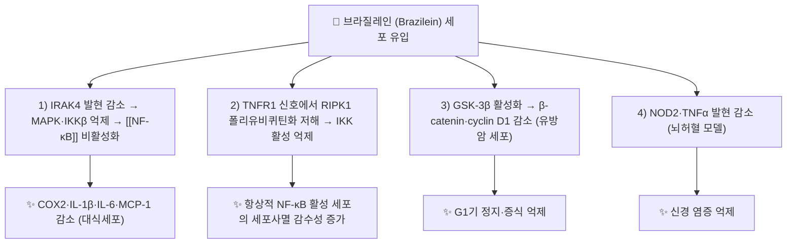

---
aliases:
  - Brazilein
  - 브라질레인
tags:
  - 약리
  - 약리성분
  - 호모이소플라보노이드
  - 소목
title: 브라질레인
date: 2026-09-21
출처: DOI 10.3390/ijms161126048.
---

# 🔬 브라질레인 (Brazilein)

> **핵심 3줄 요약 (Key Summary)**:
> - 🌿 기원 본초 & 화학 계열: [[소목]](蘇木, 콩과 *Caesalpinia sappan* 심재)에 함유된 호모이소플라보노이드(Homoisoflavonoid)계 색소 성분으로, [[브라질린]](Brazilin)이 공기 중에서 산화되어 생성되는 붉은색 산화형 화합물.
> - 🎯 핵심 분자 표적: LPS 유발 대식세포에서 IRAK4-NF-κB 신호전달 경로 억제를 통한 항염증 작용, 활성산소(ROS) 소거를 통한 항산화 작용이 제시됨.
> - 🩺 주요 약리 활성: 항염증, 항산화, 항암(세포독성) 작용이 세포 연구에서 보고되며, 소목의 활혈거어(活血祛瘀)·소종지통(消腫止痛)·배농소옹(排膿消癰) 효능의 분자적 근거로 [[브라질린]]과 함께 다뤄짐.
> - ⚠️ 안전성 검토 필요: 마우스 대상 생식독성(Reproductive toxicity) 연구가 보고되어 있어, 고용량·장기 섭취 시 안전성에 대한 추가 확인이 필요합니다.

---

## 📌 목차
1. [기본 화학 정보 & 분자 구조식 (Chemical Identity)](#1-기본-화학-정보--분자-구조식-chemical-identity)
2. [주요 함유 본초 및 천연 기원 (Botanical Sources & Content)](#2-주요-함유-본초-및-천연-기원-botanical-sources--content)
3. [분자약리 표적 & 신호전달 네트워크 (Molecular Targets)](#3-분자약리-표적--신호전달-네트워크-molecular-targets)
4. [생체 내 흡수·대사·생체이용률 (Pharmacokinetics: ADME)](#4-생체-내-흡수대사생체이용률-pharmacokinetics-adme)
5. [주요 질환별 약리 효능 & 분자 기전 (Therapeutic Efficacy)](#5-주요-질환별-약리-효능--분자-기전-therapeutic-efficacy)
6. [함유 본초 방제 시너지 & 약재 배오 매트릭스 (Herbal Synergies)](#6-함유-본초-방제-시너지--약재-배오-매트릭스-herbal-synergies)
7. [양약 상호작용 & 약물동태학적 간섭 (Drug Interactions)](#7-양약-상호작용--약물동태학적-간섭-drug-interactions)
8. [💡 사용자 진료실 핵심 필기 & 임상 응용 팁 (Melt-In & High-Yield)](#8--사용자-진료실-핵심-필기--임상-응용-팁-melt-in--high-yield)
9. [출처 및 학술 참고 문헌 (References)](#9-출처-및-학술-참고-문헌-references)

---

## 1. 기본 화학 정보 & 분자 구조식 (Chemical Identity)

> [!abstract]+ 🧪 3D 약리 분자 구조 (Interactive 3D Viewer)
> <iframe src="https://molecule-viewer-rho.vercel.app/?cid=6453902" width="100%" height="450px" frameborder="0" allow="webgl" style="border-radius: 8px;"></iframe>

| 항목 | 상세 내용 |
| :--- | :--- |
| **IUPAC 명칭** | 6a,9,10-trihydroxy-6,7-dihydroindeno[2,1-c]chromen-3-one (PubChem 등록명) |
| **분자식 / 분자량** | C₁₆H₁₂O₅ / 약 284.26 g/mol |
| **PubChem CID** | [6453902](https://pubchem.ncbi.nlm.nih.gov/compound/6453902) |
| **CAS 번호** | 600-76-0 |
| **화학 골격 분류** | 호모이소플라보노이드(Homoisoflavonoid) — [[브라질린]]의 산화형(quinoid form) |
| **물리화학적 성상** | 수용액에서 pH에 따라 구조와 색이 달라짐 — 가장 낮은 pH(3)에서는 순전하 0의 노란색 구조가 우세하고, pH가 오르면 탈양성자화된 주황색·붉은색 구조로 바뀜. 높은 pH에서 존재하는 형태는 가열 시 분해가 크고, 낮은 pH의 형태가 더 안정함(Ngamwonglumlert 2020, 식품 색소 연구). 그 외 LogP·수용해도 등은 확인하지 못함 |
| **식물 내 생합성 경로** | [[브라질린]]이 산화되어 생성되는 것으로 기술됨(Dapson 2015 — brazilin이 쉽게 산화되어 붉은 색소 brazilein이 됨). 식물 내 효소적 생합성 캐스케이드는 확인하지 못함 |

⚠️ 내용 검토 필요: 기존 노트의 PubChem CID **917533**은 PubChem에서 **C18H17N5**(4-(benzylamino)-6,7,8,9-tetrahydropyrimido[4,5-b]indolizine-10-carbonitrile)로 확인되어 브라질레인이 아니었습니다. 브라질레인은 **CID 6453902**(C₁₆H₁₂O₅, 284.26, CAS 600-76-0 동의어 일치)이며 이에 맞게 정정했습니다. 기존 링크(`.../compound/Brazilein`)도 CID 링크로 교체했습니다.

---

## 2. 주요 함유 본초 및 천연 기원 (Botanical Sources & Content)

| 함유 본초 (한글/한자) | 기원 식물학적 명칭 (과명 / 학명) | 주요 함유 약용 부위 | 지표 함량 (%) | 한의학적 귀경 및 약효 특성 |
| :--- | :--- | :--- | :--- | :--- |
| [[소목]] (蘇木) | 콩과 / *Caesalpinia sappan* | 심재(붉은색 목질부) | 확인하지 못함 ⚠️ | 심·간·비경 귀경, 활혈거어(活血祛瘀)·소종지통(消腫止痛)·배농소옹(排膿消癰)·파어통경(破瘀通經) |

* 소목(Sappan Lignum) 성분 분석 연구에서 브라질레인은 [[브라질린]], sappanchalcone, protosappanin A·B·C와 함께 소목에서 분리된 성분으로 다뤄집니다(Sasaki 2007).
* 소목 에탄올 추출물에서 순도 약 98%의 브라질레인을 대량으로 얻은 보고가 있습니다(Zhao 2006).
* ⚠️ 내용 검토 필요: 소목 중 브라질레인의 정량 함량(%)이나 약전 지표 규격은 이번 조회에서 확인하지 못했습니다. 브라질레인이 심재에 원래 존재하는 성분인지, 추출·보관 중 [[브라질린]]이 산화되어 늘어나는 것인지 구분한 자료도 확인하지 못했습니다.

---

## 3. 분자약리 표적 & 신호전달 네트워크 (Molecular Targets)

### 1) 핵심 분자 표적 (Molecular Targets)
* **항염증**: LPS로 자극된 RAW264.7 대식세포에서 IRAK4-NF-κB 신호전달 경로를 비활성화하여 염증성 사이토카인 생성을 억제합니다.
  * 논문 초록상 기전은 브라질레인이 IRAK4 단백질 발현을 낮춰 [[MAPK pathway]] 신호와 IKKβ가 억제되고, 이어 [[NF-κB]]와 COX2가 비활성화되어 IL-1β, MCP-1, MIP-2, IL-6 등 하위 염증 사이토카인이 줄어든다는 것입니다. LPS 유도 RAW264.7에서 아질산염(nitrite) 생성도 감소했습니다(Kim 2015).
  * 다른 신호 축으로, TNFR1 자극 시 RIPK1-의존 [[NF-κB]] 활성화를 억제하며 IKK 상류 신호를 저해한다는 세포 연구가 있습니다(Park 2025). 이 연구에서 브라질레인은 항상적으로 [[NF-κB]]가 활성화된 세포의 세포사멸 감수성을 높였습니다.
  * 뇌허혈·산소-포도당 결핍 모델에서는 NOD2 및 TNFα 발현을 낮췄고, NOD2 유전자 전사 억제가 보고됩니다(Yan 2016).
* **항산화**: 강력한 전자 공여 능력을 통해 활성산소(ROS)를 소거하고 지질 과산화를 차단합니다.
  * DPPH·ABTS 라디칼 소거와 지질 과산화 억제는 시험관 내 연구에서 확인됩니다(Liang 2013). ⚠️ 내용 검토 필요: '전자 공여 능력'이라는 기전 서술 자체와 생체 내(in vivo) 항산화 효과는 이번 초록에서 확인하지 못했습니다.
* **항암**: 세포독성(cytotoxic) 및 항염증 활성을 겸한 유도체 합성·평가 연구가 보고됩니다.
  * 전합성 및 유도체 평가 연구(Yen 2010)에서 가장 활성이 강했던 화합물은 브라질레인 자체가 아니라 유도체 1b(초록상 IC50 1.2·1.9 μM: 호중구 초과산화물 생성·엘라스타제 방출, 4종 암세포주 IC50 6-11 μM)였습니다. 이 수치를 브라질레인의 효능으로 옮기면 안 됩니다.
  * 브라질레인 자체의 암세포 기전(GSK-3β/β-catenin/cyclin D1, MMP-2·[[NF-κB]]·p38·PI3K/Akt, survivin, EMT·PD-L1 등)은 §5의 3)에 정리했습니다.

---

## 4. 생체 내 흡수·대사·생체이용률 (Pharmacokinetics: ADME)

* **장관 흡수 및 배출 펌프 (P-gp) 상호작용**:
  * ⚠️ 내용 검토 필요: 경구 흡수율, 장 점막 투과, P-gp 기질 여부를 다룬 연구는 이번 조회에서 확인하지 못했습니다. 확인된 약동학 자료는 정맥 투여(랫드)와 뇌 분포(마우스) 연구뿐입니다.
* **장내 미생물총(Microbiome) 대사 전환**:
  * ⚠️ 내용 검토 필요: 장내세균에 의한 대사·장간순환을 다룬 문헌은 확인하지 못했습니다.
* **간 대사 및 소실 반감기**:
  * 랫드에 정맥 투여한 뒤 혈장 농도-시간 곡선이 2구획 모델에 맞는다고 보고되었습니다(Lan 2008 — 브라질레인의 혈장 HPLC-UV 정량법과 약동학 특성을 처음 보고한 연구). 초록에는 반감기 등 수치가 없어 옮기지 않았습니다.
  * 마우스 뇌에 분포하고 신경세포로 이동하며, 뇌와 세포에서 대사체가 검출되었습니다. 대사체는 브라질레인 10번 수산기가 메틸화된 **10-O-methylbrazilein**이며, 분자 도킹과 약리 실험으로 COMT(catechol-O-methyltransferase)가 이 메틸화에 중요한 효소임이 제시되었습니다(Zhao 2014).
  * ⚠️ 내용 검토 필요: 간 CYP450 대사, 제2상 포합 반응, 인체 약동학은 확인하지 못했습니다.
* **화학적 안정성**: 수용액에서 pH에 따라 색과 구조가 바뀌고, 높은 pH 형태는 가열 시 분해가 커서 pH 민감성이 큽니다(Ngamwonglumlert 2020; 종설 Ngamwonglumlert & Devahastin 2023). 이는 전탕액 조건에서의 성분 안정성을 생각할 때 참고할 수 있으나, 전탕 중 실제 함량 변화를 직접 측정한 자료는 확인하지 못했습니다.

---

## 5. 주요 질환별 약리 효능 & 분자 기전 (Therapeutic Efficacy)

### 1) 염증 & 면역 (세포·동물 연구)
* LPS 유도 RAW264.7 대식세포에서 IRAK4-[[NF-κB]] 경로 억제와 사이토카인·아질산염 감소(Kim 2015).
* 소목 구성 성분 6종(브라질레인, sappanchalcone, protosappanin A·B·C, 브라질린)의 LPS 유도 NO 생성 억제 비교에서 브라질레인은 [[브라질린]]처럼 J774.1 세포주에서 유의한 억제를 보였습니다(Sasaki 2007 — 30 μM에서 100% 억제, 복강 대식세포는 10 μM).
* 마우스 림프구에서 ConA 자극 T세포와 LPS 자극 B세포의 증식을 억제하고 체액성 면역반응(PFC)을 억제했으며, 복강 투여한 마우스에서 흉선·비장이 위축되고 체중이 감소했습니다. 비장 림프구의 세포사멸 유도가 기전 중 하나로 제시되었습니다(Ye 2006). 즉 '면역억제' 성분으로 보고된 것이며, 항염증 효과와 림프구 독성이 함께 나타납니다.

### 2) 신경 (뇌허혈·말초신경 손상)
* 랫드 일과성 국소 뇌허혈-재관류 모델에서 허혈 이후 투여한 브라질레인이 뇌경색 면적을 줄이고 신경학적 점수를 개선했으며, TNF-α·IL-6 mRNA 감소와 BV2 미세아교세포의 LPS 유도 반응 억제를 근거로 항염증 기전이 제시되었습니다(Shen 2007).
* 뇌허혈·산소-포도당 결핍 모델에서 NOD2와 TNFα 발현 상승을 되돌렸습니다(Yan 2016).
* 마우스 좌골신경 손상 모델에서 좌골신경기능지수(SFI), 수초 회복, 척수 L4-L6의 PSD-95 발현을 평가한 연구가 있습니다(Jian 2020). ⚠️ 내용 검토 필요: 조회한 초록이 결과부에서 잘려 있어 결과의 방향과 크기는 확인하지 못했습니다.

### 3) 항암 (세포 수준, 임상 근거 없음)
* 유방암 MCF-7 세포: IC50 7.23 μM, G1기 정지, GSK-3β 활성화 후 β-catenin 감소와 cyclin D1 하향(Tao 2013).
* 유방암 MDA-MB-231 세포: 이동·침습 억제, MMP-2 발현 감소, 핵 내 [[NF-κB]] 감소, p38 MAPK·PI3K·Akt 인산화 억제(ERK1/2·JNK 인산화에는 영향 없음)(Hsieh 2013).
* 유방암 세포에서 EMT와 PD-L1 발현 억제가 보고되었고([[NF-κB]], AKT, GSK3β/β-catenin 신호를 함께 검토)(Wudtiwai 2023), 간암 HepG2 세포에서 survivin 단백질·mRNA 감소와 세포사멸 유도가 보고되었습니다(Zhong 2009).
* 피부 기저세포암(BCC) 세포에서 caspase-3 활성 증가를 통한 세포사멸이 보고되었고, 3T3-L1 지방세포 분화 억제와 [[PPAR]]γ 유도 억제도 관찰되었습니다(Liang 2013).
* 세포주마다 IC50가 크게 다릅니다(MCF-7 약 7 μM 대 MCF-7/HER2 51 μM, WiDr 52 μM).
* ⚠️ 내용 검토 필요: 모두 세포 실험이며 인체 임상 근거는 확인하지 못했습니다. 인체 신경초종 세포에서 miR-133a를 통한 세포사멸을 보고한 논문(Mou 2019)은 철회(retracted)되어 근거로 쓰지 않았습니다.

### 4) 기타 — 색소·심혈관 실험 결과
* 티로시나제를 혼합형으로 가역적으로 억제하고 B16F0 흑색종 세포에서 멜라닌 합성을 억제했습니다(Hridya 2015).
* 적출 심장에서 심박수와 관상동맥 관류에는 영향이 적으면서 용량 의존적으로 심근 수축력을 높였고, β-아드레날린 수용체 자극과는 무관했으며 Na⁺,K⁺-ATPase에는 친화력이 낮았습니다(Zhao 2006).
* 랫드 흉부 대동맥에서 내피 비의존적으로 혈관을 수축시켰고 세포외 칼슘 유입과 ROK·ERK 경로가 관여했습니다(Shen 2008). 이는 [[소목]]의 활혈(活血) 효능을 브라질레인의 혈관 이완으로 설명하는 단순한 도식과 방향이 맞지 않는 결과입니다.

---

## 6. 함유 본초 방제 시너지 & 약재 배오 매트릭스 (Herbal Synergies)

브라질레인은 [[브라질린]]과 함께 [[소목]]의 활혈거어·소종지통·배농소옹 효능을 뒷받침하는 핵심 색소 성분으로, 외상 타박상으로 인한 어혈 종통(피멍·부종)·산후 어혈 복통·월경 폐색 및 화농성 옹종 창양에 활용되는 근거로 제시됩니다.

⚠️ 내용 검토 필요: 위 '근거로 제시된다'는 서술은 전통 효능과의 연계이며, 브라질레인 단일 성분이 활혈거어·소종지통 등 임상 효능을 낸다는 직접 근거는 확인하지 못했습니다. 확인된 것은 항염증·면역 억제·항산화 등 세포·동물 수준의 결과와 §5-4의 혈관 수축 결과입니다.

| 함유 본초 / 방제 | 공존 유효 성분군 | 분자약리 시너지 기전 | 전통 한의학적 효능 연계 |
| :--- | :--- | :--- | :--- |
| [[소목]] | [[브라질린]], sappanchalcone, protosappanin A·B·C (Sasaki 2007) | [[브라질린]]-브라질레인은 산화·환원 관계이며, 브라질린을 산화한 브라질레인이 수용액에서 더 안정적이라는 보고가 있음(Kulaphisit 2026). 공존 성분과의 상승 작용은 확인하지 못함 ⚠️ | 활혈거어, 소종지통, 배농소옹, 파어통경 |
| [[당귀수산]] | [[당귀]], [[적작약]], [[오약]], [[향부자]], [[소목]](3g, 좌약), [[홍화]], [[도인]], [[육계]], [[감초]] | 이 처방에서 브라질레인의 기여를 분리한 연구는 확인하지 못함 ⚠️ | 외상 타박·피하 어혈에 활혈거어, 소종지통 |
| [[경신의이인탕]] | [[의이인]], [[마황]], [[천궁]], [[홍화]], [[소목]](2g, 좌약) 등 | 이 처방에서 브라질레인의 기여를 분리한 연구는 확인하지 못함 ⚠️ | 활혈순환제로서 소목의 활혈거어·소종지통 |

* 처방 구성은 볼트의 [[당귀수산]]·[[경신의이인탕]] 노트에서 [[소목]]이 구성에 들어 있는 것을 확인한 것만 기재했습니다.

---

## 7. 양약 상호작용 & 약물동태학적 간섭 (Drug Interactions)

### 1) 안전성 이슈 (생식독성)
ICR 마우스를 이용한 연구에서 브라질레인의 생식독성이 보고되어, 고용량 장기 투여 시 안전성에 대한 주의가 필요합니다. 소목은 전통적으로 임신부에게 신중히 사용하도록 되어 있어(파어통경 작용으로 인한 유산 위험), 이러한 현대 독성 자료와 부합하는 것으로 볼 수 있습니다. ⚠️ 내용 검토 필요: 정확한 무독성용량(NOAEL) 등 정량적 안전역은 원문 확인이 필요합니다.

* 논문 초록(Yuan 2016)상 수컷의 생식능에는 뚜렷한 독성이 관찰되지 않았지만, 사산 태자와 흡수 배아 비율로 볼 때 태아와 암컷에 상당한 위험이 있을 수 있다고 결론지었고 임신부에게 신중히 사용할 것을 제안했습니다.
* ⚠️ 내용 검토 필요: 위 원문의 '고용량·장기 투여'라는 한정은 초록에서 확인하지 못했습니다(용량·기간은 원문 확인 필요). '소목의 전통적 임신 주의와 부합한다'는 서술은 브라질레인 단일 성분 연구와 본초 전통 금기를 연결한 추론이므로 인과가 확인된 것은 아닙니다.
* 마우스 복강 투여에서 흉선·비장 위축과 체중 감소가 관찰되었습니다(Ye 2006).

### 2) 약물 상호작용
* **CYP450 효소 간섭**:
  * ⚠️ 내용 검토 필요: PubMed에서 브라질레인의 CYP 억제·유도 연구를 확인하지 못했습니다(검색 결과 0건). 브라질레인은 COMT의 기질로 10-O-methylbrazilein이 되므로(Zhao 2014) COMT에 작용하는 약물과의 상호작용 가능성은 이론상 있으나 문헌은 없습니다.
* **유사 기전 양약 병용 시 고려사항**:
  * 항암제: 세포주에서 시스플라틴(WiDr 대장암 세포, 병용 지수 CI 0.65)(Handayani 2017), 독소루비신(MCF-7/HER2 세포)(Handayani 2022)과 병용 시 상승 효과가 보고되었으나 시험관 수준이며 임상 근거는 확인하지 못했습니다.
  * 강심제·혈관 작용 약물: 브라질레인이 적출 심장에서 수축력을 높이고(Zhao 2006) 대동맥을 수축시키는(Shen 2008) 보고가 있으나, 이것이 디곡신·항고혈압제 등과의 병용 위험으로 이어지는지는 확인하지 못했습니다(이론적 가능성).
  * 면역억제제·스테로이드와 병용 시 상가 효과 가능성도 이론적일 뿐 문헌이 없습니다. 임신부 투여는 위 생식독성 자료에 따라 신중해야 합니다.

---

## 8. 💡 사용자 진료실 핵심 필기 & 임상 응용 팁 (Melt-In & High-Yield)

* **사용자 원문 필기 (100% 융합 및 보존)**:
  * 기존 노트에 원장님 수기 필기는 없었습니다. 필기가 생기면 이곳에 원문 그대로 추가합니다.
* **진료실 실전 처방 & 생체이용률 극대화 팁**:
  * 근거 없이 지어내지 않기 위해 임상 팁은 기재하지 않았습니다.

---

## 9. 출처 및 학술 참고 문헌 (References)

1. **Brazilein Suppresses Inflammation through Inactivation of IRAK4-NF-κB Pathway in LPS-Induced Raw264.7 Macrophage Cells**. *PMC*. [https://ncbi.nlm.nih.gov/pmc/articles/PMC4661906](https://ncbi.nlm.nih.gov/pmc/articles/PMC4661906)
   - **[연구 요약]**: 브라질레인이 IRAK4-NF-κB 경로 억제를 통해 대식세포 염증 반응을 억제함을 규명한 연구.
   - 서지: Kim KJ, Yoon KY, Yoon HS, Oh SR 외 (2015). *Int J Mol Sci* 16(11):27589-98. PMID [26593910](https://pubmed.ncbi.nlm.nih.gov/26593910/), DOI 10.3390/ijms161126048.
2. **Antitumor Agents. 271. Total Synthesis and Evaluation of Brazilein and Analogs as Anti-inflammatory and Cytotoxic Agents**. *PMC*. [https://pmc.ncbi.nlm.nih.gov/articles/PMC2831747/](https://pmc.ncbi.nlm.nih.gov/articles/PMC2831747/)
   - **[연구 요약]**: 브라질레인 및 유도체의 항염증·세포독성 활성을 평가한 합성·구조활성관계 연구.
   - 서지: Yen CT, Nakagawa-Goto K, Hwang TL, Wu PC 외 (2010). *Bioorg Med Chem Lett* 20(3):1037-9. PMID [20036537](https://pubmed.ncbi.nlm.nih.gov/20036537/), DOI 10.1016/j.bmcl.2009.12.041.
3. **Reproductive toxicity of brazilein in ICR mice**. PMID: [27473962](https://pubmed.ncbi.nlm.nih.gov/27473962/)
   - **[연구 요약]**: 마우스 모델에서 브라질레인의 생식독성을 평가한 안전성 연구.
   - 서지: Yuan ZY, Lei F, Chai YS, Wu H 외 (2016). *Chin J Nat Med* 14(6):441-8. DOI 10.1016/S1875-5364(16)30041-3. 수컷 생식능에는 뚜렷한 독성이 없었으나 태아·암컷에 위험(사산 태자·흡수 배아)이 있어 임신부에게 신중히 사용할 것을 제안.
4. Lan J, Hu J, Li B 외 (2008). Determination of brazilein in rat plasma after intravenous administration by HPLC. *Biomed Chromatogr* 22(11):1201-5. PMID [18651610](https://pubmed.ncbi.nlm.nih.gov/18651610/), DOI 10.1002/bmc.1045.
   - **[연구 요약]**: 랫드 정맥 투여 후 혈장 농도를 HPLC-UV로 정량하고 2구획 모델로 약동학 특성을 처음 보고.
5. Zhao S, Wang XP, Jiang JF 외 (2014). Transport and metabolism behavior of brazilein during its entrance into neural cells. *PLoS One* 9(9):e108000. PMID [25275506](https://pubmed.ncbi.nlm.nih.gov/25275506/), DOI 10.1371/journal.pone.0108000.
   - **[연구 요약]**: 마우스 뇌 분포와 신경세포 이동, 10-O-methylbrazilein 대사체 및 COMT의 역할 제시.
6. Ngamwonglumlert L, Devahastin S, Chiewchan N 외 (2020). Color and molecular structure alterations of brazilein extracted from *Caesalpinia sappan* L. under different pH and heating conditions. *Sci Rep* 10(1):12386. PMID [32709964](https://pubmed.ncbi.nlm.nih.gov/32709964/), DOI 10.1038/s41598-020-69189-3.
   - **[연구 요약]**: pH 3·7·9 수용액에서 브라질레인의 구조·색과 가열 안정성 비교.
7. Ngamwonglumlert L, Devahastin S (2023). Brazilein as an alternative pigment: Isolation, characterization, stability enhancement and food applications. *Food Chem* 398:133898. PMID [35969994](https://pubmed.ncbi.nlm.nih.gov/35969994/), DOI 10.1016/j.foodchem.2022.133898.
   - **[연구 요약]**: 브라질레인의 분리·구조·색 안정성·식품 응용을 다룬 종설(pH에 민감).
8. Dapson RW, Bain CL (2015). Brazilwood, sappanwood, brazilin and the red dye brazilein: from textile dyeing and folk medicine to biological staining and musical instruments. *Biotech Histochem* 90(6):401-23. PMID [25893688](https://pubmed.ncbi.nlm.nih.gov/25893688/), DOI 10.3109/10520295.2015.1021381.
   - **[연구 요약]**: 브라질린이 쉽게 산화되어 붉은 색소 브라질레인이 됨을 포함한 염료·역사 종설.
9. Kulaphisit M, Jaikamlue W, Jaitan N 외 (2026). Brazilin and its oxidized form "brazilein" … toxify *Plasmodium falciparum* to pyknotic death via disrupting its iron homeostasis. *Free Radic Biol Med* 248:367-385. PMID [41771360](https://pubmed.ncbi.nlm.nih.gov/41771360/), DOI 10.1016/j.freeradbiomed.2026.02.073.
   - **[연구 요약]**: 소목 달임액의 항말라리아 활성 연구 — 브라질린의 산화형인 브라질레인이 수용성 환경에서 더 안정적이며 Fe²⁺에 결합한다고 기술(제목은 요약 표기).
10. Sasaki Y, Hosokawa T, Nagai M 외 (2007). In vitro study for inhibition of NO production about constituents of Sappan Lignum. *Biol Pharm Bull* 30(1):193-6. PMID [17202686](https://pubmed.ncbi.nlm.nih.gov/17202686/), DOI 10.1248/bpb.30.193.
    - **[연구 요약]**: 소목 성분 6종의 LPS 유도 NO 생성 억제 비교. 브라질레인은 브라질린처럼 유의하게 억제.
11. Ye M, Xie WD, Lei F 외 (2006). Brazilein, an important immunosuppressive component from *Caesalpinia sappan* L. *Int Immunopharmacol* 6(3):426-32. PMID [16428078](https://pubmed.ncbi.nlm.nih.gov/16428078/), DOI 10.1016/j.intimp.2005.09.012.
    - **[연구 요약]**: 마우스 림프구 증식·체액성 면역 억제, 흉선·비장 위축과 림프구 세포사멸 유도.
12. Liang CH, Chan LP, Chou TH 외 (2013). Brazilein from *Caesalpinia sappan* L. antioxidant inhibits adipocyte differentiation and induces apoptosis through caspase-3 activity and anthelmintic activities against *Hymenolepis nana* and *Anisakis simplex*. *Evid Based Complement Alternat Med* 2013:864892. PMID [23554834](https://pubmed.ncbi.nlm.nih.gov/23554834/), DOI 10.1155/2013/864892.
    - **[연구 요약]**: DPPH·ABTS 소거·지질 과산화 억제, 3T3-L1 지방세포 분화 억제, BCC 세포 caspase-3 의존 세포사멸.
13. Shen J, Zhang H, Lin H 외 (2007). Brazilein protects the brain against focal cerebral ischemia reperfusion injury correlating to inflammatory response suppression. *Eur J Pharmacol* 558(1-3):88-95. PMID [17239368](https://pubmed.ncbi.nlm.nih.gov/17239368/), DOI 10.1016/j.ejphar.2006.11.059.
    - **[연구 요약]**: 랫드 뇌허혈-재관류에서 뇌경색 면적 감소·신경학적 점수 개선, TNF-α·IL-6 mRNA 감소.
14. Yan XJ, Chai YS, Yuan ZY 외 (2016). Brazilein inhibits neuronal inflammation induced by cerebral ischemia and oxygen-glucose deprivation through targeting NOD2 expression. *Chin J Nat Med* 14(5):354-62. PMID [27478098](https://pubmed.ncbi.nlm.nih.gov/27478098/), DOI 10.3724/SP.J.1009.2016.00354.
    - **[연구 요약]**: 뇌허혈에서 상승한 NOD2·TNFα 발현을 억제하고 NOD2 유전자 전사를 억제.
15. Jian C, Zhang L, Jinlong L 외 (2020). Effects of brazilein on PSD-95 protein expression and neurological recovery in mice after sciatic nerve injury. *Neurosci Lett* 715:134547. PMID [31629776](https://pubmed.ncbi.nlm.nih.gov/31629776/), DOI 10.1016/j.neulet.2019.134547.
    - **[연구 요약]**: 좌골신경 손상 마우스에서 SFI·수초 회복·PSD-95 발현을 평가(조회한 초록에서 결과부는 확인하지 못함).
16. Tao LY, Li JY, Zhang JY (2013). Brazilein, a compound isolated from *Caesalpinia sappan* Linn., induced growth inhibition in breast cancer cells via involvement of GSK-3β/β-Catenin/cyclin D1 pathway. *Chem Biol Interact* 206(1):1-5. PMID [23948132](https://pubmed.ncbi.nlm.nih.gov/23948132/), DOI 10.1016/j.cbi.2013.07.015.
    - **[연구 요약]**: MCF-7 IC50 7.23 μM, G1기 정지, GSK-3β 활성화·β-catenin·cyclin D1 감소.
17. Hsieh CY, Tsai PC, Chu CL 외 (2013). Brazilein suppresses migration and invasion of MDA-MB-231 breast cancer cells. *Chem Biol Interact* 204(2):105-15. PMID [23707804](https://pubmed.ncbi.nlm.nih.gov/23707804/), DOI 10.1016/j.cbi.2013.05.005.
    - **[연구 요약]**: 이동·침습 억제, MMP-2 발현 감소, NF-κB 핵 단백질 감소, p38·PI3K·Akt 인산화 억제.
18. Zhong X, Wu B, Pan YJ 외 (2009). Brazilein inhibits survivin protein and mRNA expression and induces apoptosis in hepatocellular carcinoma HepG2 cells. *Neoplasma* 56(5):387-92. PMID [19580339](https://pubmed.ncbi.nlm.nih.gov/19580339/), DOI 10.4149/neo_2009_05_387.
    - **[연구 요약]**: HepG2 세포에서 survivin 단백질·mRNA 감소와 세포사멸 유도.
19. Wudtiwai B, Kodchakorn K, Shwe TH 외 (2023). Brazilein inhibits epithelial-mesenchymal transition (EMT) and programmed death ligand 1 (PD-L1) expression in breast cancer cells. *Int Immunopharmacol* 118:109988. PMID [36933493](https://pubmed.ncbi.nlm.nih.gov/36933493/), DOI 10.1016/j.intimp.2023.109988.
    - **[연구 요약]**: MCF-7·MDA-MB-231 세포에서 EMT·PD-L1 발현 억제와 AKT·NF-κB·GSK3β/β-catenin 신호 검토(제목 및 초록 앞부분 기준).
20. Park KA, Byun HS, Ha J 외 (2025). Brazilein impedes IKK activation by disrupting RIPK1 polyubiquitination, increasing apoptotic susceptibility in cells with constitutively active NF-κB. *Biomol Ther (Seoul)* 33(6):1024-1033. PMID [40968087](https://pubmed.ncbi.nlm.nih.gov/40968087/), DOI 10.4062/biomolther.2025.099.
    - **[연구 요약]**: TNFR1 신호에서 RIPK1 의존 NF-κB 활성과 상류 IKK 신호 억제(세포 수준).
21. Handayani S, Susidarti RA, Jenie RI 외 (2017). Two active compounds from *Caesalpinia sappan* L. in combination with cisplatin synergistically induce apoptosis and cell cycle arrest on WiDr cells. *Adv Pharm Bull* 7(3):375-380. PMID [29071219](https://pubmed.ncbi.nlm.nih.gov/29071219/).
    - **[연구 요약]**: WiDr 세포에서 브라질린·브라질레인과 시스플라틴의 병용 상승 효과(브라질레인 CI 0.65).
22. Handayani S, Susidarti RA, Utomo RY 외 (2022). Synergistic cytotoxic and antimigratory effect of brazilein and doxorubicin on HER2-overexpressing cells. *Asian Pac J Cancer Prev* 23(8):2623-2632. PMID [36037115](https://pubmed.ncbi.nlm.nih.gov/36037115/).
    - **[연구 요약]**: MCF-7/HER2 세포에서 브라질레인 IC50 51 μM, 독소루비신 병용 시 G2/M 축적·세포사멸·이동 억제.
23. Hridya H, Amrita A, Sankari M 외 (2015). Inhibitory effect of brazilein on tyrosinase and melanin synthesis: kinetics and in silico approach. *Int J Biol Macromol* 81:228-34. PMID [26254246](https://pubmed.ncbi.nlm.nih.gov/26254246/), DOI 10.1016/j.ijbiomac.2015.07.064.
    - **[연구 요약]**: 티로시나제 혼합형 가역 억제와 B16F0 세포 멜라닌 합성 억제.
24. Zhao YN, Pan Y, Tao JL 외 (2006). Study on cardioactive effects of brazilein. *Pharmacology* 76(2):76-83. PMID [16319518](https://pubmed.ncbi.nlm.nih.gov/16319518/), DOI 10.1159/000089721.
    - **[연구 요약]**: 적출 심장에서 심박수 변화 없이 용량 의존적 양성 변력 작용, β-수용체 자극과 무관.
25. Shen J, Yip S, Wang Z 외 (2008). Brazilein-induced contraction of rat arterial smooth muscle involves activation of Ca²⁺ entry and ROK, ERK pathways. *Eur J Pharmacol* 580(3):366-71. PMID [18177858](https://pubmed.ncbi.nlm.nih.gov/18177858/), DOI 10.1016/j.ejphar.2007.11.012.
    - **[연구 요약]**: 랫드 흉부 대동맥의 내피 비의존적 수축, 세포외 칼슘 유입 필요.

> 참고: Mou Z 외 (2019) 인체 신경초종 세포 miR-133a 연구(PMID 30610843)는 Exp Mol Pathol에서 철회(retracted)되어 근거로 사용하지 않았습니다. 정량 지표와 인체 자료가 부족한 항목은 본문에서 ⚠️로 표시했습니다.
