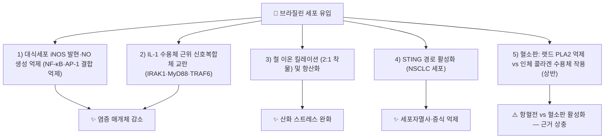

---
aliases:
  - Brazilin
  - 브라질린
tags:
  - 약리
  - 약리성분
  - 호모이소플라보노이드
  - 소목
title: 브라질린
date: 2026-09-21
출처: "PMID: 39397930"
---

# 🔬 브라질린 (Brazilin, C₁₆H₁₄O₅ / (6aS,11bR)-7,11b-dihydro-6H-indeno[2,1-c]chromene-3,6a,9,10-tetrol)

> **핵심 3줄 요약 (Key Summary)**:
> - 🌿 기원 본초 & 화학 계열: [[소목]](蘇木, 콩과 *Caesalpinia sappan* 심재)의 지표 성분인 호모이소플라보노이드(Homoisoflavonoid)계 원색소로, 공기 중 산화되면 [[브라질레인]](Brazilein)으로 전환됩니다. 대한민국약전(KP)에서 소목 규격 성분(≥0.50%)으로 지정. (⚠️ 약전 원문은 이번 검증에서 온라인으로 확인하지 못함)
> - 🎯 핵심 분자 표적: [[iNOS]]·[[COX]]-2 발현 억제를 통한 항염증, 활성산소([[ROS]]) 소거를 통한 항산화, 혈소판 과응집 억제를 통한 항혈전 작용이 제시됨. (⚠️ 혈소판에 대한 작용은 연구마다 방향이 상반됨 — §3 참고)
> - 🩺 주요 약리 활성: 항염증, 항산화, 항혈소판, 최근에는 STING/TBK1/IRF3 경로 조절을 통한 항암(비소세포폐암) 활성이 세포·동물 연구에서 보고되며, 소목의 활혈거어(活血祛瘀)·소종지통(消腫止痛) 효능의 핵심 근거로 다뤄짐.
> - ⚠️ 근거 수준: 항암 관련 근거는 대부분 세포·동물 모델 수준이며, 인체 임상시험 자료는 확인되지 않았습니다. 사람 대상 약동학·CYP/P-gp 상호작용 자료도 확인하지 못했습니다.

---

## 📌 목차
1. [기본 화학 정보 & 분자 구조식 (Chemical Identity)](#1-기본-화학-정보--분자-구조식-chemical-identity)
2. [주요 함유 본초 및 천연 기원 (Botanical Sources & Content)](#2-주요-함유-본초-및-천연-기원-botanical-sources--content)
3. [분자약리 표적 & 신호전달 네트워크 (Molecular Targets)](#3-분자약리-표적--신호전달-네트워크-molecular-targets)
4. [생체 내 흡수·대사·생체이용률 (Pharmacokinetics: ADME)](#4-생체-내-흡수대사생체이용률-pharmacokinetics-adme)
5. [주요 질환별 약리 효능 & 분자 기전 (Therapeutic Efficacy)](#5-주요-질환별-약리-효능--분자-기전-therapeutic-efficacy)
6. [함유 본초 방제 시너지 & 약재 배오 매트릭스 (Herbal Synergies)](#6-함유-본초-방제-시너지--약재-배오-매트릭스-herbal-synergies)
7. [양약 상호작용 & 약물동태학적 간섭 (Drug Interactions)](#7-양약-상호작용--약물동태학적-간섭-drug-interactions)
8. [💡 사용자 진료실 핵심 필기 & 임상 응용 팁 (Melt-In & High-Yield)](#8--사용자-진료실-핵심-필기--임상-응용-팁-melt-in--high-yield)
9. [출처 및 학술 참고 문헌 (References)](#9-출처-및-학술-참고-문헌-references)

---

## 1. 기본 화학 정보 & 분자 구조식 (Chemical Identity)

> [!abstract]+ 🧪 3D 약리 분자 구조 (Interactive 3D Viewer)
> <iframe src="https://molecule-viewer-rho.vercel.app/?cid=73384" width="100%" height="450px" frameborder="0" allow="webgl" style="border-radius: 8px;"></iframe>

| 항목 | 상세 내용 |
| :--- | :--- |
| **IUPAC 명칭** | (6aS,11bR)-7,11b-dihydro-6H-indeno[2,1-c]chromene-3,6a,9,10-tetrol (PubChem 등록명) |
| **분자식 / 분자량** | C₁₆H₁₄O₅ / 약 286.28 g/mol |
| **PubChem CID** | [73384](https://pubchem.ncbi.nlm.nih.gov/compound/73384) (PubChem 실측 확인: 표제어 Brazilin, 이명 (+)-Brazilin·C.I. Natural Red 24) |
| **CAS 등록 번호** | 474-07-7 (PubChem 이명 목록 기준) |
| **화학 골격 분류** | 호모이소플라보노이드(Homoisoflavonoid) — [[브라질레인]]의 환원형(비산화형) |
| **물리화학적 성상** | 거의 무색의 염료 전구체(dye precursor)로, 산화되면 붉은 염료인 브라질레인으로 쉽게 전환됨(Dapson 2015). 수용해도·LogP·열/빛 안정성·맛은 ⚠️ 내용 검토 필요(이번 검증에서 확인하지 못함) |
| **식물 내 생합성 경로** | ⚠️ 내용 검토 필요(원문에 서술 없음, 이번 검증에서 확인하지 못함) |

---

## 2. 주요 함유 본초 및 천연 기원 (Botanical Sources & Content)

| 함유 본초 | 기원 식물학적 명칭 | 주요 함유 부위 | 지표 함량 (%) | 한의학적 귀경 및 약효 특성 |
| :--- | :--- | :--- | :--- | :--- |
| [[소목]] (蘇木) | 콩과 / *Caesalpinia sappan* | 심재(붉은색 목질부) | KP 규격 ≥0.50% (원문 서술, ⚠️ 약전 원문 미확인) | 심·간·비경 귀경, 활혈거어(活血祛瘀)·소종지통(消腫止痛)·배농소옹(排膿消癰)·파어통경(破瘀通經) |

> 최근 문헌에서는 소목의 학명을 *Biancaea sappan*으로도 표기합니다(참고문헌 23·24의 PubMed 제목 표기 기준). 브라질린은 같은 콩과의 *Haematoxylum brasiletto*(수피·심재)에서도 분리되는 것으로 종설에 보고됩니다(Nava-Tapia 2022). 볼트의 [[소목]] 노트는 브라질린과 브라질레인의 산화 관계를 함께 서술합니다.

---

## 3. 분자약리 표적 & 신호전달 네트워크 (Molecular Targets)

### 1) 핵심 분자 표적 (Molecular Targets)

* **항염증**: [[iNOS]] 및 [[COX]]-2 발현을 차단하여 염증성 부종과 통증을 유의하게 억제합니다.
  * 확인된 근거: LPS로 자극한 RAW 264.7 대식세포에서 브라질린은 NO 생성을 용량 의존적으로 억제했고(IC50 24.3 μM), iNOS 단백질·mRNA 발현을 낮췄으며 [[NF-κB]]와 AP-1의 DNA 결합 활성을 억제했습니다(Bae 2005). RANKL로 자극한 RAW264.7 세포에서는 iNOS·COX-2·TNF-α·[[IL-6]] 유전자 발현과 ERK·NF-κB 경로를 억제했습니다(Kim 2015).
  * ⚠️ 내용 검토 필요: J774.1 세포 시험에서 브라질린은 NO 생성은 억제했지만 [[PGE2]]는 거의 억제하지 않았고, COX-2·iNOS mRNA 억제는 sappanchalcone·protosappanin D·E에서 보고되었습니다. 카라기닌 유도 마우스 발부종 시험은 소목 추출물에 브라질린 이외의 활성 성분이 있음을 시사했습니다(Washiyama 2009). 원문 요약 "염증성 부종과 통증을 유의하게 억제"의 근거로 인용된 Taveepanich 2024는 LPS 자극 대식세포에서 NO 생성 감소와 IL-6·TNF-α 발현 억제를 보고한 세포 연구이며, 부종·통증 평가나 iNOS·COX-2 발현 측정은 초록에서 확인되지 않았습니다.
  * 상위 신호: 브라질린은 IL-1β로 유도되는 IRAK1 폴리유비퀴틴화와 IKK-γ 결합을 억제하고 MyD88에 대한 IRAK1/4·TRAF6 동원을 방해했으며, TNF로 유도되는 RIP1 유비퀴틴화는 건드리지 않았습니다(Jeon 2014, [[IL-1β]] 수용체 경로). *S. aureus* 유방염 마우스 모델에서는 TLR2 발현 감소와 NF-κB·[[MAPK pathway]] 조절을 통해 TNF-α·IL-1β·IL-6 발현을 낮췄습니다(Gao 2015).
* **항산화**: 강력한 철 킬레이팅(iron chelating) 및 활성산소 소거 능력이 보고됩니다.
  * 확인된 근거: 정제한 브라질린은 DPPH·ABTS·FRAP 시험과 H₂O₂로 산화 스트레스를 준 Huh-7 간세포에서 농도 의존적 항산화 활성을 보였고, 제2철·제1철 이온과 결합하며 철과 2:1 비율의 이좌리간드(bidentate) 착물을 형성했습니다(Taveepanich 2024). 소목의 6개 성분(브라질린·브라질레인·sappanchalcone·protosappanin A~C)에 대해 NO 생성 억제와 함께 DPPH 라디칼 소거·철 환원·항산화 시험이 비교되었으나(Sasaki 2007), 초록의 결과부가 일부만 확인되어 항산화 수치는 ⚠️ 옮기지 않았습니다.
* **항암**: 비소세포폐암 세포에서 STING/TBK1/IRF3 신호전달 경로 조절을 통한 증식 억제 활성이 최근 연구에서 제시됩니다.
  * 확인된 근거: 초록은 브라질린이 NSCLC 세포의 증식을 줄이고 세포자멸사와 G2 정지(Cyclin B1 감소·P21 증가), 미토콘드리아 기능 이상과 ROS 생성을 유도하며, **STING 경로를 활성화**하고 CXCL10·CXCL9·CCL5 발현을 올렸다고 보고합니다. STING 억제제 H-151이 세포 생존율을 높여 STING이 브라질린 유도 세포자멸사에 관여함을 시사했습니다(Kang 2025).
  * ⚠️ 내용 검토 필요: 초록에는 TBK1·IRF3에 대한 직접 결과가 나오지 않습니다(제목에만 표기). 원문의 "조절"은 STING의 **활성화** 방향으로 읽어야 합니다.

### 2) 혈소판에 대한 상반된 보고 (⚠️ 내용 검토 필요)

* **억제 보고**: 랫드 세척 혈소판에서 브라질린은 트롬빈·콜라겐·ADP 유도 응집과 트롬복산 A₂ 생성, 트롬빈 유도 세포내 칼슘 상승을 억제했고, 이는 PLA2 활성 억제와 관련되는 것으로 해석되었습니다(Hwang 1998).
* **증강 보고**: 사람 세척 혈소판에서 1~10 μM 브라질린은 저농도 콜라겐(0.1 μg/ml) 유도 응집을 증강했고 20~50 μM에서는 직접 응집을 일으켰으며, 콜라겐 수용체(GPVI, 인테그린 α2β1)를 통한 PLCγ2·Lyn 인산화가 관여했습니다. 마우스에서 2·4 mg/kg 투여는 장간막 정맥의 혈소판 마개 형성 시간을 단축했습니다(Chang 2013).
* 원문 요약의 "혈소판 과응집 억제를 통한 항혈전"은 위 두 결과 중 한쪽에만 부합하며, 종(랫드/사람)·농도·실험계에 따라 방향이 다를 수 있어 임상적 결론은 낼 수 없습니다.

---

## 4. 생체 내 흡수·대사·생체이용률 (Pharmacokinetics: ADME)

* **혈장 약동학(랫드, 정맥 투여)**: 25·50·100 mg/kg 단회 정맥 투여 시 Cmax 18.1±4.1·46.7±8.7·82.2±9.6 μg/mL, AUC0-24 20.4±4.3·48.7±6.8·90.4±10.3 μg·h/mL, 반감기(t1/2) 5.4±1.5·5.8±0.9·6.2±1.2시간이었으며 Cmax와 AUC는 용량에 비례했습니다(Jia YY 2014).
* **경구 투여·조직 분포·배설(랫드)**: 브라질린 100 mg/kg 경구 투여 후 혈장 약동학이 LC-MS/MS로 평가되었고(Deng 2013), 혈장·뇨·분변과 뇌·심장·간·폐·신장·비장에서의 분포와 배설이 연구되었습니다(Jia 2013). 초록에 경구 생체이용률·조직별 수치가 제시되지 않아 ⚠️ 수치는 옮기지 않았습니다.
* **당뇨 상태의 영향(랫드)**: 소목 추출물(브라질린 52.25 mg/kg 상당) 경구 투여 후 스트렙토조토신 처치 랫드에서 브라질린의 AUC·Cmax·T1/2가 정상 랫드보다 유의하게 증가했고 소실이 느렸습니다(Tong 2013).
* **산화 전환**: 브라질린은 산화되면 붉은 브라질레인으로 쉽게 전환되는 것으로 서술됩니다(Dapson 2015). 다만 생체 내 대사 경로·대사체는 ⚠️ 내용 검토 필요(이번 검증에서 확인하지 못함).
* **P-gp·장내 미생물 대사·CYP450 대사**: ⚠️ 내용 검토 필요. PubMed 검색에서 브라질린의 CYP 또는 P-gp 관련 문헌은 0건이었습니다.
* **사람 약동학**: ⚠️ 확인하지 못함(랫드 자료만 확인).

---

## 5. 주요 질환별 약리 효능 & 분자 기전 (Therapeutic Efficacy)

### 1) 만성 염증 & 감염성 염증
* 원문에서 소목의 활혈거어·소종지통을 뒷받침하는 항염증 근거로 다뤄지는 부분입니다. 세포·동물 수준의 확인 근거는 §3에 정리했습니다(Bae 2005, Jeon 2014, Gao 2015). *S. aureus* 유방염 마우스 모델에서 염증세포 침윤과 TNF-α·IL-1β·IL-6 발현이 감소했습니다(Gao 2015).
* LPS 유도 급성 폐손상 마우스·세포 모델에서 브라질린 전처치는 미토콘드리아 산화 스트레스와 페롭토시스를 억제하며 SIRT3를 하류 표적으로 지목했고, SIRT3가 GPX4의 K148 잔기를 탈아세틸화한다고 보고되었습니다(Yan 2025).
* RANKL 유도 파골세포 분화가 억제되고 TRAP·NFATc1·MMP-9·카텝신 K 발현이 감소했습니다(Kim 2015, RAW264.7 세포 수준).

### 2) 당대사
* 랫드 부고환 지방세포에서 브라질린은 포도당 흡수를 증가시켰고(Vmax 증가, Km 불변), [[GLUT4]]의 세포막 이동을 늘렸으며 PI3-kinase 억제제 wortmannin이 이 효과를 차단했습니다(Khil 1999).
* 당뇨 랫드 및 정상 랫드에서 분리한 간세포에서 브라질린은 포도당 신생을 감소시켰고 글루카곤 유도 세포내 cAMP를 낮췄으며, cAMP 하류 경로 억제가 시사되었습니다(Won 2004).
* ⚠️ 내용 검토 필요: 위 근거는 모두 분리 세포 실험이며 사람 혈당에 대한 임상 근거는 확인하지 못했습니다.

### 3) 항종양 (세포·동물 수준)
* 종설(Nava-Tapia 2022)은 브라질린이 골육종·신경모세포종·다발골수종·교모세포종·방광암·흑색종·유방암·설암·대장암·자궁경부암·두경부 편평세포암 등 여러 암에서 자가포식(LC3-II 증가)과 세포자멸사를 유도한다고 정리합니다.
* NSCLC: STING 경로 활성화·세포자멸사·G2 정지(Kang 2025, §3). 방광암 T24 세포: 세포 괴사(necroptosis) 유도, RIP1·RIP3·MLKL 발현과 Ca²⁺ 유입 증가(Yang 2023). 유방암 4T1 세포: p53/SLC7A11/GPX4 경로를 통한 페롭토시스 유도(He 2024).
* ⚠️ 내용 검토 필요: 급성 폐손상 모델에서는 브라질린이 페롭토시스를 **억제**(Yan 2025)하고 암세포에서는 **유도**(He 2024)한다고 보고되어, 조직·세포 맥락에 따라 방향이 다릅니다. 인체 임상시험은 확인하지 못했습니다.

---

## 6. 함유 본초 방제 시너지 & 약재 배오 매트릭스 (Herbal Synergies)

브라질린은 [[브라질레인]]과 함께 [[소목]]의 활혈거어·소종지통·배농소옹 효능을 뒷받침하는 핵심 지표 성분으로, 외상 타박상으로 인한 어혈 종통·산후 어혈 복통·월경 폐색 및 화농성 옹종 창양에 활용되는 근거로 제시됩니다.

| 함유 본초 / 방제 | 공존 유효 성분군 | 분자약리 시너지 기전 | 전통 한의학적 효능 연계 |
| :--- | :--- | :--- | :--- |
| [[소목]] | [[브라질레인]], sappanchalcone, protosappanin류(소목 심재의 다른 성분, Sasaki 2007·Washiyama 2009) | 항염 활성이 브라질린 단독이 아니라 성분 간 분담일 가능성(Washiyama 2009) | 활혈거어, 소종지통, 배농소옹, 파어통경 |
| [[당귀수산]] | 소목 3g(좌약, 볼트 확인), [[당귀]]·[[적작약]]·[[오약]]·[[향부자]]·[[홍화]]·[[도인]]·[[육계]]·[[감초]] | ⚠️ 방제 내 병용 시너지를 직접 검증한 문헌은 확인하지 못함(볼트 노트는 NF-κB 억제·PGE2 합성 차단으로 서술하나, 브라질린의 PGE2 억제는 Washiyama 2009와 상충) | 타박·피멍 초기 활혈거어, 소종지통 |
| [[경신의이인탕]] | 소목 2g(좌약, 볼트 확인), [[홍화]] 등 활혈순환제 | ⚠️ 브라질린 기여를 직접 검증한 문헌은 확인하지 못함 | 활혈거어, 체지방 분해 후 대사 촉진(볼트 노트 서술) |

---

## 7. 양약 상호작용 & 약물동태학적 간섭 (Drug Interactions)

* **CYP450·P-gp 상호작용**: ⚠️ 내용 검토 필요. 브라질린의 CYP 억제·유도나 P-gp 상호작용 문헌은 PubMed에서 확인되지 않았습니다.
* **항혈소판제·항응고제 병용**([[아스피린]], [[와파린]] 등): 혈소판에 대한 작용이 랫드(억제, Hwang 1998)와 사람 혈소판·마우스(증강, Chang 2013)에서 상반되어 병용 시 효과의 방향을 예측할 수 없습니다. 브라질린 단독으로 출혈 위험을 평가한 임상 자료는 확인하지 못했습니다. 볼트 [[처방 사이드 대처법]]은 소목을 포함한 강한 활혈 방제가 개방성 외상에서 출혈을 조장할 수 있다고 서술합니다.
* **혈당강하제 병용**: 브라질린의 혈당 저하 근거는 분리 세포 실험(Khil 1999, Won 2004)에 한정되어 병용 시 상가 효과 여부는 ⚠️ 확인하지 못했습니다.
* **임신·수유**: 볼트 [[경신의이인탕]] 노트는 소목을 자궁 수축 자극 약재로 분류해 임산부·수유부 금기로 기재합니다. 브라질린 단독의 임신 안전성 자료는 ⚠️ 확인하지 못했습니다.

---

## 8. 💡 사용자 진료실 핵심 필기 & 임상 응용 팁 (Melt-In & High-Yield)

* **사용자 원문 필기 (100% 융합 및 보존)**:
  * 이 노트에는 원장님의 기존 수기 필기가 없었습니다. 필기를 추가할 때 이 자리에 기록합니다.
* **진료실 실전 처방 & 생체이용률 극대화 팁**:
  * 근거 없이 지어내지 않기 위해 비워 둡니다(사람 약동학·전탕 시 브라질린 용출·흡수 개선 자료는 확인하지 못함).

---

## 9. 출처 및 학술 참고 문헌 (References)

1. **Taveepanich S et al. (2024)**. Iron chelating, antioxidant, and anti-inflammatory properties of brazilin from Caesalpinia sappan Linn. *Heliyon*, 10(19): e38213. [PMID: 39397930](https://pubmed.ncbi.nlm.nih.gov/39397930/) · [DOI](https://doi.org/10.1016/j.heliyon.2024.e38213)
   - **[연구 요약]**: 소목의 브라질린이 iNOS 및 COX-2 발현을 차단하여 염증성 부종과 통증을 유의하게 억제함을 규명. (원문 요약, 보존)
   - ⚠️ 내용 검토 필요: 초록 확인 결과 이 논문은 정제 브라질린의 항산화(DPPH·ABTS·FRAP, Huh-7 간세포)·철 킬레이션(2:1 착물)과 LPS 자극 RAW 264.7 대식세포에서의 NO 생성 감소 및 IL-6·TNF-α 발현 억제를 보고합니다. iNOS·COX-2 발현이나 부종·통증은 초록에서 확인되지 않습니다.
2. **Kang LP, Xu C, Xu P et al. (2025)**. Brazilin Inhibits the Proliferation of Non-Small Cell Lung Cancer by Regulating the STING/TBK1/IRF3 Pathway. *J Cell Mol Med*, 29(13): e70688. [PMID: 40596709](https://pubmed.ncbi.nlm.nih.gov/40596709/) · [DOI](https://doi.org/10.1111/jcmm.70688) · [PMC](https://pmc.ncbi.nlm.nih.gov/articles/PMC12213455/)
   - **[연구 요약]**: 브라질린의 STING/TBK1/IRF3 경로 조절을 통한 비소세포폐암 항증식 기전을 규명한 연구. (원문 요약, 보존)
   - ⚠️ 내용 검토 필요: 초록은 STING 경로의 **활성화**와 CXCL10·CXCL9·CCL5 상승, 세포자멸사·G2 정지를 보고하며 TBK1·IRF3 결과는 명시하지 않습니다.
3. **대한민국약전(KP) 제12개정 (2022)**. 의약품각조 제2부: 소목(Sappan Lignum) 규격 기준 — 브라질린(C₁₆H₁₄O₅) 0.50% 이상 함유. (원문 서술, ⚠️ 약전 원문은 이번 검증에서 온라인으로 확인하지 못함)
4. **Bae IK et al. (2005)**. Suppression of lipopolysaccharide-induced expression of inducible nitric oxide synthase by brazilin in RAW 264.7 macrophage cells. *Eur J Pharmacol*, 513(3): 237-242. [PMID: 15862806](https://pubmed.ncbi.nlm.nih.gov/15862806/) · [DOI](https://doi.org/10.1016/j.ejphar.2005.03.011)
   - **[연구 요약]**: LPS 유도 NO 생성 억제(IC50 24.3 μM), iNOS 단백질·mRNA 발현 억제, NF-κB·AP-1 DNA 결합 활성 억제(세포 수준).
5. **Kim J et al. (2015)**. Inhibitory effect of brazilin on osteoclast differentiation and its mechanism of action. *Int Immunopharmacol*, 29(2): 628-634. [PMID: 26428849](https://pubmed.ncbi.nlm.nih.gov/26428849/) · [DOI](https://doi.org/10.1016/j.intimp.2015.09.018)
   - **[연구 요약]**: RANKL 유도 RAW264.7 파골세포 분화 억제, TRAP·NFATc1·MMP-9·카텝신 K 및 iNOS·COX-2·TNF-α·IL-6 발현 감소, ERK·NF-κB 억제(세포 수준).
6. **Washiyama M et al. (2009)**. Anti-inflammatory constituents of Sappan Lignum. *Biol Pharm Bull*, 32(5): 941-944. [PMID: 19420769](https://pubmed.ncbi.nlm.nih.gov/19420769/) · [DOI](https://doi.org/10.1248/bpb.32.941)
   - **[연구 요약]**: J774.1 세포에서 브라질린은 NO를 억제했으나 PGE2는 거의 억제하지 않았고, COX-2·iNOS mRNA 억제는 sappanchalcone·protosappanin D·E에서 확인. 카라기난 마우스 발부종 시험은 추출물에 브라질린 이외 활성 성분이 있음을 시사.
7. **Sasaki Y et al. (2007)**. In vitro study for inhibition of NO production about constituents of Sappan Lignum. *Biol Pharm Bull*, 30(1): 193-196. [PMID: 17202686](https://pubmed.ncbi.nlm.nih.gov/17202686/) · [DOI](https://doi.org/10.1248/bpb.30.193)
   - **[연구 요약]**: 소목의 6개 성분(브라질린·브라질레인·sappanchalcone·protosappanin A~C)의 NO 생성 억제, iNOS 유전자 발현, 항산화 시험 비교(세포 수준).
8. **Jeon J et al. (2014)**. Brazilin selectively disrupts proximal IL-1 receptor signaling complex formation by targeting an IKK-upstream signaling components. *Biochem Pharmacol*, 89(4): 515-525. [PMID: 24735611](https://pubmed.ncbi.nlm.nih.gov/24735611/) · [DOI](https://doi.org/10.1016/j.bcp.2014.04.004)
   - **[연구 요약]**: IL-1β 유도 IRAK1 폴리유비퀴틴화·IKK-γ 결합 억제, MyD88에 대한 IRAK1/4·TRAF6 동원 방해, TNF 유도 RIP1 유비퀴틴화는 영향 없음(세포 수준).
9. **Gao XJ et al. (2015)**. Brazilin plays an anti-inflammatory role with regulating Toll-like receptor 2 and TLR 2 downstream pathways in Staphylococcus aureus-induced mastitis in mice. *Int Immunopharmacol*, 27(1): 130-137. [PMID: 25939535](https://pubmed.ncbi.nlm.nih.gov/25939535/) · [DOI](https://doi.org/10.1016/j.intimp.2015.04.043)
   - **[연구 요약]**: 유방염 마우스에서 염증세포 침윤과 TNF-α·IL-1β·IL-6 발현 감소, TLR2 발현 감소 및 NF-κB·MAPK 경로 조절.
10. **Hwang GS et al. (1998)**. Effects of brazilin on the phospholipase A2 activity and changes of intracellular free calcium concentration in rat platelets. *Arch Pharm Res*, 21(6): 774-778. [PMID: 9868555](https://pubmed.ncbi.nlm.nih.gov/9868555/) · [DOI](https://doi.org/10.1007/BF02976775)
    - **[연구 요약]**: 랫드 세척 혈소판에서 트롬빈·콜라겐·ADP 유도 응집, ATP 방출, 트롬복산 A₂ 생성, 세포내 칼슘 상승 억제(PLA2 활성 억제와 관련).
11. **Chang Y et al. (2013)**. Brazilin isolated from Caesalpinia sappan L. acts as a novel collagen receptor agonist in human platelets. *J Biomed Sci*, 20(1): 4. [PMID: 23350663](https://pubmed.ncbi.nlm.nih.gov/23350663/) · [DOI](https://doi.org/10.1186/1423-0127-20-4)
    - **[연구 요약]**: 사람 혈소판에서 1~10 μM은 콜라겐 유도 응집을 증강, 20~50 μM은 직접 응집 유발(GPVI·α2β1, PLCγ2·Lyn 인산화 관여). 마우스에서 2·4 mg/kg은 혈소판 마개 형성 시간을 단축.
12. **Khil LY et al. (1999)**. Effects of brazilin on GLUT4 recruitment in isolated rat epididymal adipocytes. *Biochem Pharmacol*, 58(11): 1705-1712. [PMID: 10571244](https://pubmed.ncbi.nlm.nih.gov/10571244/) · [DOI](https://doi.org/10.1016/s0006-2952(99)00275-0)
    - **[연구 요약]**: 랫드 지방세포에서 포도당 흡수 증가(Vmax 증가)와 GLUT4 세포막 이동 촉진, PI3-kinase 의존(분리 세포 수준).
13. **Won HS et al. (2004)**. Mechanism of action of Brazilin on gluconeogenesis in isolated rat hepatocytes. *Planta Med*, 70(8): 740-744. [PMID: 15368663](https://pubmed.ncbi.nlm.nih.gov/15368663/) · [DOI](https://doi.org/10.1055/s-2004-827205)
    - **[연구 요약]**: 랫드 간세포에서 포도당 신생 감소와 글루카곤 유도 cAMP 저하, cAMP 하류 경로 억제 시사(분리 세포 수준).
14. **Yang X et al. (2023)**. Brazilin inhibits bladder cancer by promoting cell necroptosis. *Clin Exp Pharmacol Physiol*, 50(9): 738-748. [PMID: 37321597](https://pubmed.ncbi.nlm.nih.gov/37321597/) · [DOI](https://doi.org/10.1111/1440-1681.13800)
    - **[연구 요약]**: T24 방광암 세포에서 괴사 유도, RIP1·RIP3·MLKL 발현과 Ca²⁺ 유입 증가(세포 수준).
15. **He D et al. (2024)**. Brazilin Actuates Ferroptosis in Breast Cancer Cells via p53/SLC7A11/GPX4 Signaling Pathway. *Chin J Integr Med*, 30(11): 1001-1006. [PMID: 38652227](https://pubmed.ncbi.nlm.nih.gov/38652227/) · [DOI](https://doi.org/10.1007/s11655-024-4104-y)
    - **[연구 요약]**: 4T1 유방암 세포에서 p53/SLC7A11/GPX4 경로를 통한 페롭토시스 유도(초록에서 결과부 일부 확인, 세포 수준).
16. **Yan X et al. (2025)**. Brazilin alleviates acute lung injury via inhibition of ferroptosis through the SIRT3/GPX4 pathway. *Apoptosis*, 30(3-4): 768-783. [PMID: 39720978](https://pubmed.ncbi.nlm.nih.gov/39720978/) · [DOI](https://doi.org/10.1007/s10495-024-02058-w)
    - **[연구 요약]**: LPS 유도 급성 폐손상에서 브라질린 전처치가 미토콘드리아 산화 스트레스와 페롭토시스를 억제, SIRT3가 GPX4 K148을 탈아세틸화(마우스·세포 수준).
17. **Nava-Tapia DA et al. (2022)**. Brazilin: Biological activities and therapeutic potential in chronic degenerative diseases and cancer. *Pharmacol Res*, 175: 106023. [PMID: 34883212](https://pubmed.ncbi.nlm.nih.gov/34883212/) · [DOI](https://doi.org/10.1016/j.phrs.2021.106023)
    - **[연구 요약]**: 브라질린의 항산화·항염증·항균·혈당 저하 및 여러 암에서의 자가포식·세포자멸사 유도를 정리한 종설.
18. **Yan-yan J et al. (2014)** (본문의 Jia YY 2014, PubMed 저자 표기는 "Yan-yan J"). A simple high-performance liquid chromatographic method for the determination of brazilin and its application to a pharmacokinetic study in rats. *J Ethnopharmacol*, 151(1): 108-113. [PMID: 24095700](https://pubmed.ncbi.nlm.nih.gov/24095700/) · [DOI](https://doi.org/10.1016/j.jep.2013.08.054)
    - **[연구 요약]**: 랫드 정맥 투여(25·50·100 mg/kg) 후 t1/2 약 5.4~6.2시간, Cmax·AUC 용량 비례.
19. **Deng Z et al. (2013)**. A validated LC-MS/MS method for rapid determination of brazilin in rat plasma and its application to a pharmacokinetic study. *Biomed Chromatogr*, 27(6): 802-806. [PMID: 23303567](https://pubmed.ncbi.nlm.nih.gov/23303567/) · [DOI](https://doi.org/10.1002/bmc.2863)
    - **[연구 요약]**: 랫드 혈장 브라질린 정량법 확립, 100 mg/kg 경구 투여 후 약동학 평가(초록에 수치 미제시).
20. **Jia Y et al. (2013)**. Application of a liquid chromatography-tandem mass spectrometry method to the pharmacokinetics, tissue distribution and excretion studies of brazilin in rats. *J Chromatogr B*, 931: 61-67. [PMID: 23777611](https://pubmed.ncbi.nlm.nih.gov/23777611/) · [DOI](https://doi.org/10.1016/j.jchromb.2013.05.017)
    - **[연구 요약]**: 랫드 혈장·뇨·분변과 뇌·심장·간·폐·신장·비장에서의 브라질린 정량 및 약동학·분포·배설 평가(초록에 수치 미제시).
21. **Tong XZ et al. (2013)**. An LC/MS/MS method for simultaneous quantitation of two homoisoflavones: protosappanin B and brazilin with hypoglycemic activity in rat plasma and its application to a comparative pharmacokinetic study in normal and streptozotocin-treated rats. *J Ethnopharmacol*, 148(2): 682-690. [PMID: 23707335](https://pubmed.ncbi.nlm.nih.gov/23707335/) · [DOI](https://doi.org/10.1016/j.jep.2013.05.029)
    - **[연구 요약]**: 소목 추출물 경구 투여 후 STZ 처치 랫드에서 브라질린의 AUC·Cmax·T1/2 증가와 소실 지연.
22. **Dapson RW, Bain CL (2015)**. Brazilwood, sappanwood, brazilin and the red dye brazilein: from textile dyeing and folk medicine to biological staining and musical instruments. *Biotech Histochem*, 90(6): 401-423. [PMID: 25893688](https://pubmed.ncbi.nlm.nih.gov/25893688/) · [DOI](https://doi.org/10.3109/10520295.2015.1021381)
    - **[연구 요약]**: 브라질린이 거의 무색의 염료 전구체이며 산화되어 붉은 브라질레인이 됨을 서술한 종설.
23. **Youngest R et al. (2026)**. Brazilin From Biancaea sappan as a Multi-Target Candidate in Thalassaemia: Mechanistic Insights Into Iron Chelation, Antioxidant Activity, and Potential JAK2 Modulation. *Clin Exp Pharmacol Physiol*, 53(8): e70145. [PMID: 42575857](https://pubmed.ncbi.nlm.nih.gov/42575857/) · [DOI](https://doi.org/10.1111/1440-1681.70145)
    - **[연구 요약]**: 소목 학명을 *Biancaea sappan*으로 표기한 근거로만 인용(제목 기준, 초록은 읽지 않음).
24. **Tiono YV et al. (2025)**. Inhibition of oxidative stress of Biancaea sappan (L) Tod. from Java. *Nat Prod Res*, 39(17): 4968-4974. [PMID: 38757413](https://pubmed.ncbi.nlm.nih.gov/38757413/) · [DOI](https://doi.org/10.1080/14786419.2024.2355585)
    - **[연구 요약]**: 소목 학명을 *Biancaea sappan*으로 표기한 근거로만 인용(제목 기준, 초록은 읽지 않음).
