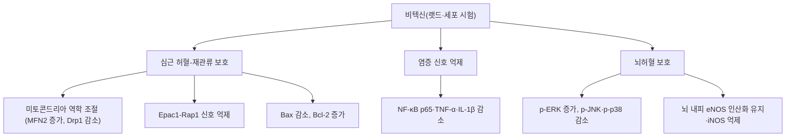

# 🔬 비텍신 (Vitexin)

> **핵심 3줄 요약 (Key Summary)**:
> - 🌿 기원 본초 & 화학 계열: [[산사]](Crataegi Fructus) 및 만형자 등에 함유된 대표적인 아피게닌 모핵의 플라본 C-배당체(Apigenin-8-C-glucoside). (⚠️ 문헌에서 확인된 것은 산사나무(*Crataegus pinnatifida*) 잎의 비텍신이며 열매는 잎보다 함량이 낮았습니다. 산사(열매)와 만형자 자체의 지표 함량은 확인하지 못했습니다. §2)
> - 🎯 핵심 분자 표적: 관상동맥 혈류 확장·심근 허혈-재관류 손상 보호·항부정맥 및 내피세포 기능 개선. (⚠️ 랫드 허혈-재관류 모델에서 심근 손상 완화·염증 사이토카인 감소·미토콘드리아 역학(MFN2·Drp1) 조절은 확인되나, 항부정맥과 eNOS 활성화를 통한 관상동맥 확장은 비텍신 문헌을 찾지 못했습니다. §3)
> - 🩺 주요 약리 활성: 한의학의 소식화적(消食化積)·행기산어(行氣散瘀)·통맥(通脈) 본초의 핵심 심혈관 약리 성분. (⚠️ 위 효능과 비텍신을 직접 연결한 근거는 확인하지 못했고, 사람 대상 근거는 산사 추출물에 한정됩니다. §5)
> - ⚠️ 생체이용률·상호작용: 랫드에서 장 초회통과효과가 94.1%로 경구 생체이용률이 낮습니다. 랫드 정맥 투여에서 CYP3A1·CYP2C11 활성을 바꾸었고, 밀의 C-글리코실플라본 연구에서 갑상선 호르몬 합성 억제가 보고되었으나 사람 자료는 없습니다. §4·§7

---

## 📌 목차
1. [기본 화학 정보 & 분자 구조식 (Chemical Identity)](#1-기본-화학-정보--분자-구조식-chemical-identity)
2. [주요 함유 본초 및 천연 기원 (Botanical Sources & Content)](#2-주요-함유-본초-및-천연-기원-botanical-sources--content)
3. [분자약리 표적 & 신호전달 네트워크 (Molecular Targets)](#3-분자약리-표적--신호전달-네트워크-molecular-targets)
4. [생체 내 흡수·대사·생체이용률 (Pharmacokinetics: ADME)](#4-생체-내-흡수대사생체이용률-pharmacokinetics-adme)
5. [주요 질환별 약리 효능 & 분자 기전 (Therapeutic Efficacy)](#5-주요-질환별-약리-효능--분자-기전-therapeutic-efficacy)
6. [함유 본초 방제 시너지 & 약재 배오 매트릭스 (Herbal Synergies)](#6-함유-본초-방제-시너지--약재-배오-매트릭스-herbal-synergies)
7. [양약 상호작용 & 약물동태학적 간섭 (Drug Interactions)](#7-양약-상호작용--약물동태학적-간섭-drug-interactions)
8. [💡 사용자 진료실 핵심 필기 & 임상 응용 팁 (Melt-In & High-Yield)](#8--사용자-진료실-핵심-필기--임상-응용-팁-melt-in--high-yield)
9. [출처 및 학술 참고 문헌 (References)](#9-출처-및-학술-참고-문헌-references)

---

## 1. 기본 화학 정보 & 분자 구조식 (Chemical Identity)

> [!abstract]+ 🧪 3D 약리 분자 구조 (Interactive 3D Viewer)
> <iframe src="https://molecule-viewer-rho.vercel.app/?cid=5280441" width="100%" height="450px" frameborder="0" allow="webgl" style="border-radius: 8px;"></iframe>

비텍신(Vitexin)은 아피게닌(Apigenin)의 8번 탄소 위치에 글루코오스가 탄소-탄소(C-C) 결합으로 직접 연결된 C-배당체 플라보노이드이다.

| 항목 | 상세 내용 |
| :--- | :--- |
| **IUPAC 명칭** | `5,7-dihydroxy-2-(4-hydroxyphenyl)-8-[(2S,3R,4R,5S,6R)-3,4,5-trihydroxy-6-(hydroxymethyl)oxan-2-yl]chromen-4-one` (PubChem 등록명). 원문의 "8-β-D-glucopyranosyl-5,7-dihydroxy-2-(4-hydroxyphenyl)chromen-4-one"과 같은 구조를 가리킵니다. |
| **분자식 / 분자량** | C₂₁H₂₀O₁₀ / 432.38 g/mol(원문). PubChem 등록값은 432.4 g/mol |
| **PubChem CID** | [5280441](https://pubchem.ncbi.nlm.nih.gov/compound/5280441) (등록명 Vitexin, C21H20O10 — PubChem에서 확인, 원문 3D 뷰어 CID와 일치) |
| **CAS 등록 번호** | 3681-93-4 — PubChem 동의어 항목 기준이며 CAS 원본 대조는 못함 ⚠️ |
| **화학 골격 분류** | 플라본 C-배당체(아피게닌-8-C-글루코사이드). 이성질체 이소비텍신([[이소비텍신]], 아피게닌-6-C-글루코사이드)과 루테올린 골격의 [[오리엔틴]](CID 5281675, 8-C)·이소오리엔틴(CID 114776, 6-C)은 서로 다른 성분입니다. |
| **물리화학적 성상** | 원문: C-배당체 구조 특성상 일반적인 O-배당체보다 장내 세균이나 위산에 의한 가수분해에 저항성이 높아 생체 이용률이 우수함. ⚠️ 내용 검토 필요 — 가수분해 저항성 자체와 달리, 랫드에서 경구 생체이용률은 낮았습니다(§4; Xue 2014). Caco-2 모델에서도 비텍신은 거의 대사되지 않았습니다(Tremmel 2021). 수용성·LogP·맛은 확인하지 못함 |
| **식물 내 생합성 경로** | 원문에 기재 없음. 확인하지 못함 ⚠️ |

* **안정성(원문)**: C-배당체 구조 특성상 일반적인 O-배당체보다 장내 세균이나 위산에 의한 가수분해에 저항성이 높아 생체 이용률이 우수함. (⚠️ 위 표 '물리화학적 성상' 행과 §4 참조)

---

## 2. 주요 함유 본초 및 천연 기원 (Botanical Sources & Content)

| 함유 본초 | 기원 식물학적 명칭 | 주요 함유 부위 | 한의학적 귀경 및 약효 특성 |
| :--- | :--- | :--- | :--- |
| [[산사]] (山楂) | 장미과 / *Crataegus pinnatifida* | 잎 및 열매(원문) | 비·위·간경 귀경(볼트 산사 노트 기준), 소식화적·행기산어·화탁강지 |
| 만형자 (蔓荊子) | 마편초과 / *Vitex trifolia* | 원문에 부위 기재 없음 | 원문에 기재 없음 |
| 패션플라워 | 시계꽃과 / *Passiflora* | 원문에 부위 기재 없음 | 원문에 기재 없음 |

* **기원 표기 관련 ⚠️**:
  * 산사나무 잎에서 비텍신이 분리·정량되었고(Wen 2017; Ying 2009), 모세관 전기영동 분석에서 산사나무 플라본 함량은 열매보다 잎에서 높았습니다(Liu 2003). 약재인 산사(열매)의 비텍신 지표 함량은 확인하지 못했습니다.
  * 만형자는 *Vitex trifolia* 및 *V. trifolia* subsp. *litoralis*의 열매로 정의되며 리뷰는 과를 Lamiaceae로 적습니다(Meng 2023). 만형자 열매의 비텍신 함량은 초록에서 확인하지 못했습니다. Vitex 속에서 비텍신은 핵심 활성 성분으로 보고됩니다(Xie 2026).
  * *Passiflora incarnata*에서는 비텍신을 포함한 C-글리코실 플라보노이드가 확인됩니다(Tremmel 2021).
  * 볼트 [[죽엽]] 노트도 비텍신을 성분으로 적고 있으나 외부 문헌으로는 확인하지 못했습니다.
* **지표 함량(%)**: 원문에 수치 기재 없음. 확인하지 못함 ⚠️
* **한약재 규격상의 지표 함량**: 대한민국약전 산사 규격에 비텍신 기준이 있는지는 확인하지 못했습니다. ⚠️ 내용 검토 필요

---

## 3. 분자약리 표적 & 신호전달 네트워크 (Molecular Targets)

### 1) 관상동맥 확장 및 항심근허혈 (원문 §2-1)
1. **관상동맥 확장 및 항심근허혈**:
   * 혈관 내피세포의 [[eNOS]]를 활성화하여 산화질소(NO) 생성을 촉진, 관상동맥 혈관 저항을 낮추고 심근 산소 공급 증대.
   * 심근 허혈-재관류 모델에서 미토콘드리아 투과성 전이공(mPTP) 개방을 억제하여 심근세포 괴사 및 부정맥 방어.
   * 근거: Langendorff 관류 랫드 심장의 허혈-재관류에서 비텍신(50·100·200 μmol/L)은 관상동맥 유량을 늘리고 병리 점수를 낮췄습니다(Dong 2011). 랫드 관상동맥 결찰 모델에서 ST 분절 상승과 경색 크기를 줄였습니다(Dong 2013). 신생 랫드 심근세포의 무산소-재산소 모델에서 전처치(10·30·100 μM)는 생존율을 높이고 LDH·CK 유출, 세포자멸, 세포 내 칼슘을 줄였으며 p-ERK 증가가 이를 억제하는 PD98059로 차단되었습니다(Dong 2008). 미토콘드리아에서는 MFN2 발현을 늘리고 Drp1 동원을 줄여 미토콘드리아 기능 이상을 완화했고(Xue 2020), Epac1-Rap1 신호를 억제했습니다(Yang 2021; Che 2016).
   * ⚠️ 내용 검토 필요: eNOS 활성화·NO 생성을 통한 관상동맥 확장은 심장 조직에서 확인하지 못했습니다. 확인된 eNOS 관련 결과는 뇌 미세혈관 내피세포에서 eNOS 인산화를 유지하는 동시에 iNOS를 억제하고 세포 내 NO·ONOO⁻를 줄였다는 보고(Cui 2019)뿐이라 방향과 조직이 다릅니다. mPTP 개방 억제도 직접 확인하지 못했고(확인된 것은 미토콘드리아 막전위·ATP 함량 개선과 역학 조절), '부정맥 방어'는 항부정맥 문헌을 찾지 못했습니다.

### 2) 항산화 및 염증 신호 억제 (원문 §2-2)
2. **항산화 및 염증 신호 억제**:
   * [[Nrf2]]/HO-1 신호 경로를 상향 조절하여 과산화물 생성을 억제하고 글루타치온(GSH) 고갈 방어.
   * [[NF-κB]] 차단을 통해 TNF-α, [[IL-1β]], [[ICAM-1]] 발현을 낮추어 혈관염 및 죽상경화증 억제.
   * 근거: 허혈-재관류 심장에서 NF-κB p65 발현, TNF-α, IL-1β가 감소했고 Bax는 줄고 Bcl-2는 늘었습니다(Dong 2011). 랫드 심근 허혈-재관류에서 NF-κB·TNF-α·MDA는 감소하고 SOD는 늘었으며 p-ERK는 증가, p-c-Jun은 감소했습니다(Dong 2013; [[MAPK pathway]]). 고혈압 신병증 랫드에서도 TNF-α·IL-6·NF-κB가 줄고 SOD가 늘었습니다(Duan 2024). 스코폴라민 인지장애 랫드에서는 Nrf2/HO-1이 활성화되고 신경염증이 억제되었습니다(Yildirim 2026).
   * ⚠️ 내용 검토 필요: 심장·혈관에서 Nrf2/HO-1 활성화(확인된 것은 뇌 인지 모델), 글루타치온 고갈 방어, ICAM-1 발현 감소, '혈관염 및 죽상경화증 억제'는 비텍신 단독 근거를 찾지 못했습니다. 죽상경화 근거는 산사 잎 플라보노이드 추출물의 ApoE 결손 마우스 연구(Bai 2024)이며 비텍신 단독 결과가 아닙니다.

### 3) 중추신경 보호 및 인지 기능 개선 (원문 §2-3)
3. **중추신경 보호 및 인지 기능 개선**:
   * 뇌혈관 장벽(BBB)을 통과하여 허혈성 뇌졸중 후 신경세포 사멸 억제.
   * 근거: 마우스 중대뇌동맥 폐쇄 모델에서 전신 투여한 비텍신이 신경학적 결손·뇌경색 부피·신경세포 손상을 줄였고 p-ERK1/2는 늘리고 p-JNK·p-p38은 줄이며 Bcl-2를 높였습니다(Wang 2015). 사람 뇌 미세혈관 내피세포의 산소·포도당 결핍 모델에서 밀착연접 단백질 발현을 늘리고 MMP를 억제해 투과성 증가를 막았습니다(Cui 2019). 신생 랫드 저산소-허혈(45 mg/kg)에서 NKCC1 발현을 낮추고 경련을 줄였습니다(Luo 2018).
   * ⚠️ 내용 검토 필요: 비텍신이 BBB를 '통과'해 뇌에 도달한다는 직접 자료(뇌 조직 농도)는 확인하지 못했습니다. 전신 투여로 뇌 손상이 줄었다는 결과와 BBB 내피세포 보호 결과만 확인됩니다.

---

## 4. 생체 내 흡수·대사·생체이용률 (Pharmacokinetics: ADME)

* **장관 흡수 및 배출 펌프 (P-gp) 상호작용**:
  * 랫드에서 비텍신의 간·위·장 초회통과효과는 각각 5.2%, 31.3%, 94.1%였고 경구 절대 생체이용률이 낮았습니다(Xue 2014, 30 mg/kg). 같은 연구에서 베라파밀(P-gp/CYP3A 억제제) 병용 시 AUC가 약 1.13배로 커져 P-gp의 영향은 크지 않았습니다.
  * 산사 잎 플라보노이드(비텍신 포함)는 Caco-2에서 Papp가 낮고 랫드 위·소장 흡수가 저조했으며, 수동 확산에 능동 수송·장내세균 대사·담즙 분비·장 배출이 겹치는 BCS class III로 분류되었습니다(Chow 2025). 토끼에서 미세캡슐 제형이 비텍신·이소비텍신의 Cmax와 AUC를 높였으며 저자들은 낮은 경구 생체이용률을 한계로 적었습니다(Nguyen 2025).
  * 분자 도킹으로 비텍신이 P-gp 기질일 가능성이 제시되었으나 실험 검증은 아닙니다(Kundu 2024). ⚠️ 내용 검토 필요
* **장내 미생물총(Microbiome) 대사 전환**:
  * Caco-2 모델에서 비텍신은 이소비텍신·오리엔틴·이소오리엔틴과 달리 거의 대사되지 않았고, 후자 3종은 당-아글리콘 C-C 결합이 끊어져 아피게닌·루테올린 유도체로 전환되었습니다(Tremmel 2021). 산사 잎 플라보노이드가 장내 미생물 대사를 받는다는 보고는 있으나(Chow 2025), 비텍신의 아피게닌 전환은 확인하지 못했습니다. ⚠️
* **간 대사 및 소실 반감기**:
  * 랫드 경구 투여 후 C-글리코실 플라본 4종(비텍신·이소비텍신 포함, 녹두 씨 추출물)은 약 1.5시간에 Cmax에 도달하고 여러 조직에 빠르게 분포했으며 4시간 안에 조직 농도가 뚜렷이 감소했습니다(Bai 2017; 추출물 연구). 비텍신 단독의 반감기와 사람 약동학은 확인하지 못했습니다. ⚠️ 내용 검토 필요

---

## 5. 주요 질환별 약리 효능 & 분자 기전 (Therapeutic Efficacy)

### 1) 허혈성 심질환 (전임상)
* 허혈-재관류 심근 손상에서 경색 크기·효소 유출·세포자멸 감소가 랫드와 심근세포에서 반복 확인됩니다(Dong 2008; Dong 2011; Dong 2013; Xue 2020; Yang 2021). 만성 허혈-재관류 랫드(14일)에서 좌심실 이완기 기능이 개선되고 심근 섬유화가 줄었습니다(Che 2016).
* 참고: 같은 주제의 다른 보고(PI3K/Akt/mTOR와 자가포식)는 철회 공지가 있어(Fisher 2021, PMID 35426991) 인용하지 않았습니다.
* ⚠️ 협심증·관상동맥경화증에 대한 비텍신의 사람 임상 근거는 확인하지 못했습니다. 산사 추출물(비텍신 단독이 아님)은 만성 심부전 무작위 시험 메타분석에서 최대 운동부하와 압력-심박 곱을 개선했고(Pittler 2003), NYHA III 209명 시험에서 1800 mg/일 WS 1442가 16주 후 운동 능력을 늘렸습니다(Tauchert 2002). 이는 추출물 결과이며 비텍신의 기여는 알 수 없습니다.

### 2) 뇌허혈 및 신경보호
* 마우스 뇌허혈-재관류에서 뇌경색 부피와 신경 결손을 줄이고(Wang 2015), Vitex 속 리뷰는 비텍신 10~50 mg/kg이 랫드 뇌경색 부피를 30~40% 줄였다고 정리합니다(Xie 2026; 리뷰 초록 기준). 랫드 스코폴라민 인지장애에서 도네페질과 비슷한 수준의 행동 개선이 보고되었습니다(Yildirim 2026; 30 mg/kg 경구 14일). 모두 동물 연구입니다.

### 3) 고혈압·지질 대사
* 자발성 고혈압 랫드의 고혈압 신병증 모델에서 수축기·이완기·평균 동맥압과 크레아티닌·BUN·TC·TG·LDL-C가 낮아졌습니다(Duan 2024). ⚠️ 원문에는 없던 항목이며 단일 랫드 연구입니다. 원문의 '혈청 지질 개선'(§6 표)은 산사 추출물 근거(Bai 2024)를 포함하며 비텍신 단독 결과는 아닙니다. ⚠️

### 4) 한의학적 연계 (원문 §3)
* 비텍신은 산사자의 대표 활성 성분으로서, [[고지혈증]], 관상동맥경화증, [[협심증]]의 한의 치료 원리인 **소식산어(消食散瘀)**를 뒷받침한다.
* ⚠️ 내용 검토 필요: 위 서술에서 비텍신을 '대표 활성 성분'으로, 그리고 소식산어와 직접 연결한 근거는 확인하지 못했습니다. 산사(열매)보다 산사나무 잎에서 비텍신이 더 많이 확인됩니다(§2). 산사의 효능은 [[산사]] 노트를 참고하세요.

---

## 6. 함유 본초 방제 시너지 & 약재 배오 매트릭스 (Herbal Synergies)

| 본초 | 주요 배속 효능 | 비텍신 매개 약리 |
| :--- | :--- | :--- |
| [[산사]] | 소식화적, 행기산어, 화탁강지 | 관상동맥 혈류 확장, 심근 수축력 보조, 혈청 지질 개선 (⚠️ 관상동맥 유량 증가는 Langendorff 랫드 심장에서 확인(Dong 2011), 심근 수축력 보조·혈청 지질 개선은 비텍신 단독 근거를 확인하지 못함) |
| [[단삼]] | 활혈거어, 통경지통, 청심양혈 | 비텍신과 상용 배합 시 심혈관 내피세포 보호 시너지 발휘 (⚠️ 내용 검토 필요 — 비텍신과 단삼 성분의 병용 시너지 문헌 미확인) |

| 산사 포함 방제(볼트 처방 노트에서 구성 확인) | 산사의 역할 | 비텍신 관련 근거 |
| :--- | :--- | :--- |
| [[보화환]] | 군약, 8~12g | ⚠️ 전탕액·환제에서 비텍신 함량과 기여는 문헌 미확인 |
| [[보비위탕]] | 좌약(산사·오매 각 4g) | ⚠️ 미확인 |
| [[삼출건비탕]] | 좌약, 3.0g | ⚠️ 미확인 |
| [[소달건비탕]] | 좌약, 3.0g | ⚠️ 미확인 |
| [[향사양위탕]] | 좌약, 4~6g | ⚠️ 미확인 |
| [[생간건비탕]] | 좌약(산사·신곡·맥아·사인·나복자 각 3~5g) | ⚠️ 미확인 |

* 위 방제는 소식화적 목적의 처방이며, 비텍신이 이 처방들의 효과에 기여하는지는 확인하지 못했습니다.

---

## 7. 양약 상호작용 & 약물동태학적 간섭 (Drug Interactions)

* **CYP450 효소 간섭**:
  * 랫드에 비텍신을 정맥 투여하고 칵테일 프로브 약물(페나세틴·톨부타미드·미다졸람)을 경구 투여한 시험에서 CYP1A2는 영향이 없었고, CYP3A1 활성은 농도·시간 의존적으로 억제되었으며, CYP2C11은 단기 투여에서 유도, 장기 투여에서 억제되었습니다(Wang 2015). 저자들은 CYP2C11·CYP3A1 기질 약물과의 병용 주의를 제안했습니다. 사람 CYP3A4([[CYP3A4]]) 등에서의 결과는 확인하지 못했습니다. ⚠️ 내용 검토 필요
* **P-gp 기질 약물**:
  * 랫드 십이지장 시험에서 베라파밀이 비텍신 노출에 크게 영향을 주지 않았습니다(Xue 2014). 사람에서 [[P-당단백(P-gp)]] 기질·억제제 상호작용 자료는 확인하지 못했습니다. ⚠️
* **강심배당체(디곡신) 병용 (산사 추출물 자료)**:
  * 산사 특수추출물 WS 1442(450 mg, 1일 2회)를 건강인 8명에게 21일간 병용했을 때 디곡신 약동학 지표에 유의한 차이가 없었습니다(Tankanow 2003). 반면 산사 추출물은 디곡신 면역측정법 중 한 종(Digoxin III)에 간섭을 일으켰고, 랫드 심근세포에서 디곡신과 가산되지 않는 세포 내 칼슘 증가를 보여 디곡신 복용 환자는 산사를 피하라고 제안되었습니다(Dasgupta 2010). 두 결과 모두 산사 추출물이며 비텍신 단독 결과가 아닙니다.
* **갑상선 기능에 미치는 영향**:
  * 밀 식이의 C-글리코실플라본이 갑상선종을 유발하는 성분이라는 가설에서, 랫드에 비텍신 80 μmol을 위장관 투여했을 때 갑상선 요오드 흡수는 억제되지 않았으나 T3·T4 합성의 결합 반응이 유의하게 억제되었습니다(Gaitan 1995; 급성 단회 투여). 산사 복용량에서 임상적으로 의미가 있는지는 확인하지 못했습니다. 갑상선 질환 환자에서의 사람 자료는 없습니다([[갑상선 기능 저하증]]). ⚠️ 내용 검토 필요
* **유사 기전 양약 병용 시 고려사항**:
  * 혈압강하제·항혈전제·질산염 등과 비텍신의 병용 안전성 문헌은 확인하지 못했습니다. ⚠️ 내용 검토 필요

---

## 8. 💡 사용자 진료실 핵심 필기 & 임상 응용 팁 (Melt-In & High-Yield)

* **사용자 원문 필기 (100% 융합 및 보존)**:
  * 기존 노트에 원장님의 수기 필기는 없었습니다. (추후 필기가 생기면 이곳에 원문 그대로 추가)
* **진료실 실전 처방 & 생체이용률 극대화 팁**:
  1. 비텍신의 심근·뇌 보호 근거는 랫드·마우스·세포 시험 자료이며, 산사 전탕액에서의 비텍신 함량과 흡수는 확인되지 않았습니다(§2·§4). 전탕 처방의 심혈관 효과 근거로 그대로 옮기지 않도록 주의합니다.
  2. 체질별·병증별 적용은 원문·문헌에서 확인되지 않아 기재하지 않습니다. ⚠️ 내용 검토 필요

---

## 9. 출처 및 학술 참고 문헌 (References)

1. **Dong L, et al. (2011)**. *Vitexin protects against myocardial ischemia/reperfusion injury in Langendorff-perfused rat hearts by attenuating inflammatory response and apoptosis*. **Food Chem Toxicol**, 49(12):3211-3216. PMID: [22001368](https://pubmed.ncbi.nlm.nih.gov/22001368/) · DOI: [10.1016/j.fct.2011.09.040](https://doi.org/10.1016/j.fct.2011.09.040)
   - **[연구 요약]**: 관류 랫드 심장 허혈-재관류에서 비텍신(50~200 μmol/L)이 관상동맥 유량을 늘리고 TNF-α·IL-1β·NF-κB p65 발현과 세포자멸을 줄임.
2. **Dong LY, et al. (2013)**. *Cardioprotection of vitexin on myocardial ischemia/reperfusion injury in rat via regulating inflammatory cytokines and MAPK pathway*. **Am J Chin Med**, 41(6):1251-1266. PMID: [24228599](https://pubmed.ncbi.nlm.nih.gov/24228599/) · DOI: [10.1142/S0192415X13500845](https://doi.org/10.1142/S0192415X13500845)
   - **[연구 요약]**: 랫드 심근 허혈-재관류에서 ST 상승과 경색 크기, LDH·CK·MDA를 줄이고 SOD를 늘림. NF-κB·TNF-α 감소, p-ERK 증가, p-c-Jun 감소.
3. **Dong LY, et al. (2008)**. *Mechanisms of vitexin preconditioning effects on cultured neonatal rat cardiomyocytes with anoxia and reoxygenation*. **Am J Chin Med**, 36(2):385-397. PMID: [18457368](https://pubmed.ncbi.nlm.nih.gov/18457368/) · DOI: [10.1142/S0192415X08005849](https://doi.org/10.1142/S0192415X08005849)
   - **[연구 요약]**: 비텍신 전처치(10·30·100 μM)가 심근세포 생존율을 높이고 LDH·CK 유출과 세포 내 칼슘을 줄이며 p-ERK 증가와 연관됨.
4. **Che X, et al. (2016)**. *Vitexin exerts cardioprotective effect on chronic myocardial ischemia/reperfusion injury in rats via inhibiting myocardial apoptosis and lipid peroxidation*. **Am J Transl Res**, 8(8):3319-3328. PMID: [27648122](https://pubmed.ncbi.nlm.nih.gov/27648122/)
   - **[연구 요약]**: 만성 허혈-재관류 랫드에서 좌심실 이완기 기능 개선과 섬유화 감소, Bax·Epac1·Rap1 감소와 Bcl-2 증가.
5. **Xue W, et al. (2020)**. *Vitexin attenuates myocardial ischemia/reperfusion injury in rats by regulating mitochondrial dysfunction induced by mitochondrial dynamics imbalance*. **Biomed Pharmacother**, 124:109849. PMID: [31972356](https://pubmed.ncbi.nlm.nih.gov/31972356/) · DOI: [10.1016/j.biopha.2020.109849](https://doi.org/10.1016/j.biopha.2020.109849)
   - **[연구 요약]**: 심근 손상 완화, MFN2 증가·Drp1 동원 감소, ROS 감소·미토콘드리아 막전위와 ATP 개선.
6. **Yang H, et al. (2021)**. *Vitexin mitigates myocardial ischemia/reperfusion injury in rats by regulating mitochondrial dysfunction via Epac1-Rap1 signaling*. **Oxid Med Cell Longev**, 2021:9921982. PMID: [34257823](https://pubmed.ncbi.nlm.nih.gov/34257823/) · DOI: [10.1155/2021/9921982](https://doi.org/10.1155/2021/9921982)
   - **[연구 요약]**: Epac1-Rap1 신호 억제로 미토콘드리아 기능 이상과 세포자멸을 줄임.
7. **Wang Y, et al. (2015)**. *Vitexin protects brain against ischemia/reperfusion injury via modulating mitogen-activated protein kinase and apoptosis signaling in mice*. **Phytomedicine**, 22(3):379-384. PMID: [25837275](https://pubmed.ncbi.nlm.nih.gov/25837275/) · DOI: [10.1016/j.phymed.2015.01.009](https://doi.org/10.1016/j.phymed.2015.01.009)
   - **[연구 요약]**: 마우스 MCAO에서 신경 결손·뇌경색·신경 손상 감소, p-ERK1/2 증가와 p-JNK·p-p38 감소, Bcl-2 증가.
8. **Cui YH, et al. (2019)**. *Vitexin protects against ischemia/reperfusion-induced brain endothelial permeability*. **Eur J Pharmacol**, 853:210-219. PMID: [30876978](https://pubmed.ncbi.nlm.nih.gov/30876978/) · DOI: [10.1016/j.ejphar.2019.03.015](https://doi.org/10.1016/j.ejphar.2019.03.015)
   - **[연구 요약]**: 사람 뇌 미세혈관 내피세포 I/R 모델에서 밀착연접 단백질 증가·MMP 억제, Akt 의존적 eNOS 인산화 유지와 iNOS 억제.
9. **Luo WD, et al. (2018)**. *Vitexin reduces epilepsy after hypoxic ischemia in the neonatal brain via inhibition of NKCC1*. **J Neuroinflammation**, 15(1):186. PMID: [29925377](https://pubmed.ncbi.nlm.nih.gov/29925377/) · DOI: [10.1186/s12974-018-1221-6](https://doi.org/10.1186/s12974-018-1221-6)
   - **[연구 요약]**: 신생 랫드 저산소-허혈(45 mg/kg)에서 NKCC1 발현 감소와 경련 감소.
10. **Yildirim C, et al. (2026)**. *Vitexin protects against scopolamine-induced cognitive impairment by preserving synaptic integrity and modulating Nrf2/HO-1 and NF-κB signaling pathways*. **Mol Neurobiol**, 63(1). PMID: [42348083](https://pubmed.ncbi.nlm.nih.gov/42348083/) · DOI: [10.1007/s12035-026-05947-0](https://doi.org/10.1007/s12035-026-05947-0)
    - **[연구 요약]**: 스코폴라민 랫드(30 mg/kg 경구, 14일)에서 인지 개선, 시냅스 단백질 보존, Nrf2/HO-1 활성화와 신경염증 억제.
11. **Duan T, et al. (2024)**. *The protective effect of vitexin on hypertensive nephropathy rats*. **Kidney Blood Press Res**, 49(1):753-762. PMID: [39079512](https://pubmed.ncbi.nlm.nih.gov/39079512/) · DOI: [10.1159/000540618](https://doi.org/10.1159/000540618)
    - **[연구 요약]**: 자발성 고혈압 랫드 신병증 모델에서 혈압·Cr·BUN·지질 저하, TNF-α·IL-6·NF-κB 감소와 SOD 증가.
12. **Xie C, et al. (2026)**. *Phytochemical and anti-ischemic stroke properties from the Vitex L. genus*. **Drug Des Devel Ther**, 20:585338. PMID: [41710581](https://pubmed.ncbi.nlm.nih.gov/41710581/) · DOI: [10.2147/DDDT.S585338](https://doi.org/10.2147/DDDT.S585338)
    - **[연구 요약]**: Vitex 속 성분·뇌졸중 리뷰. 비텍신 10~50 mg/kg이 랫드 MCAO 뇌경색 부피를 30~40% 감소(리뷰 초록 기준).
13. **Yan W, et al. (2025)**. *Dietary flavonoids vitexin and isovitexin: new insights into their functional roles in human health and disease prevention*. **Int J Mol Sci**, 26(14):6997. PMID: [40725244](https://pubmed.ncbi.nlm.nih.gov/40725244/) · DOI: [10.3390/ijms26146997](https://doi.org/10.3390/ijms26146997)
    - **[연구 요약]**: 비텍신·이소비텍신의 약리·약동학·임상적 의의를 종합한 최근 리뷰(초록 기준).
14. **Xue HF, et al. (2014)**. *Hepatic, gastric, and intestinal first-pass effects of vitexin in rats*. **Pharm Biol**, 52(8):967-971. PMID: [24555505](https://pubmed.ncbi.nlm.nih.gov/24555505/) · DOI: [10.3109/13880209.2013.874464](https://doi.org/10.3109/13880209.2013.874464)
    - **[연구 요약]**: 간·위·장 초회통과효과 5.2%·31.3%·94.1%로 경구 생체이용률이 낮음. 베라파밀 병용 AUC 약 1.13배.
15. **Chow J, et al. (2025)**. *Gastrointestinal absorption and its regulation of hawthorn leaves flavonoids*. **Sci Rep**, 15(1):658. PMID: [39753628](https://pubmed.ncbi.nlm.nih.gov/39753628/) · DOI: [10.1038/s41598-024-81823-y](https://doi.org/10.1038/s41598-024-81823-y)
    - **[연구 요약]**: 산사 잎 플라보노이드(비텍신 포함)는 BCS class III로 경구 생체이용률이 낮으며 수동 확산·능동 수송·장내세균 대사·담즙 분비·장 배출이 관여.
16. **Nguyen DT, et al. (2025)**. *Development and validation of an HPLC-MS/MS method for the simultaneous quantification of vitexin and isovitexin in rabbit plasma: pharmacokinetic insights on a microcapsule formulation*. **Molecules**, 30(8):1690. PMID: [40333599](https://pubmed.ncbi.nlm.nih.gov/40333599/) · DOI: [10.3390/molecules30081690](https://doi.org/10.3390/molecules30081690)
    - **[연구 요약]**: 낮은 경구 생체이용률을 배경으로 미세캡슐 제형이 토끼에서 Cmax·AUC를 높임.
17. **Bai Y, et al. (2017)**. *Plasma pharmacokinetics, bioavailability, and tissue distribution of four C-glycosyl flavones from mung bean (Vigna radiata L.) seed extracts in rat by ultrahigh-performance liquid chromatography-tandem mass spectrometry*. **J Agric Food Chem**, 65(27):5570-5580. PMID: [28627167](https://pubmed.ncbi.nlm.nih.gov/28627167/) · DOI: [10.1021/acs.jafc.7b02053](https://doi.org/10.1021/acs.jafc.7b02053)
    - **[연구 요약]**: 녹두 추출물의 C-글리코실 플라본 4종이 약 1.5시간에 Cmax, 여러 조직에 분포, 4시간 내 감소(추출물 연구).
18. **Tremmel M, et al. (2021)**. *In vitro metabolism of six C-glycosidic flavonoids from Passiflora incarnata L.* **Int J Mol Sci**, 22(12):6566. PMID: [34207335](https://pubmed.ncbi.nlm.nih.gov/34207335/) · DOI: [10.3390/ijms22126566](https://doi.org/10.3390/ijms22126566)
    - **[연구 요약]**: Caco-2에서 비텍신은 거의 대사되지 않았고 이소비텍신·오리엔틴·이소오리엔틴은 C-C 결합 절단과 포합체 생성.
19. **Wang XS, et al. (2015)**. *Effects of vitexin on the pharmacokinetics and mRNA expression of CYP isozymes in rats*. **Phytother Res**, 29(3):366-372. PMID: [25447838](https://pubmed.ncbi.nlm.nih.gov/25447838/) · DOI: [10.1002/ptr.5260](https://doi.org/10.1002/ptr.5260)
    - **[연구 요약]**: 랫드 정맥 투여에서 CYP3A1 억제, CYP2C11 단기 유도·장기 억제, CYP1A2 무영향(mRNA와 일치).
20. **Kundu A, et al. (2024)**. *Vitexin along with verapamil downregulates efflux pump P-glycoprotein in macrophages and potentiate M1 to M2 switching via TLR4-NF-κB-TNFR2 pathway in lipopolysaccharide treated mice*. **Immunobiology**, 229(1):152767. PMID: [38103391](https://pubmed.ncbi.nlm.nih.gov/38103391/) · DOI: [10.1016/j.imbio.2023.152767](https://doi.org/10.1016/j.imbio.2023.152767)
    - **[연구 요약]**: 분자 도킹에서 비텍신이 P-gp 기질로 제시되고, 베라파밀 병용 LPS 마우스에서 P-gp·TLR4·NF-κB 감소(제목·초록 기준).
21. **Gaitan E, et al. (1995)**. *Antithyroid effects in vivo and in vitro of vitexin: a C-glucosylflavone in millet*. **J Clin Endocrinol Metab**, 80(4):1144-1147. PMID: [7714083](https://pubmed.ncbi.nlm.nih.gov/7714083/) · DOI: [10.1210/jcem.80.4.7714083](https://doi.org/10.1210/jcem.80.4.7714083)
    - **[연구 요약]**: 랫드에 비텍신 80 μmol 투여 시 갑상선 요오드 흡수는 억제되지 않았으나 T3·T4 합성 결합 반응이 유의하게 억제됨.
22. **Pittler MH, et al. (2003)**. *Hawthorn extract for treating chronic heart failure: meta-analysis of randomized trials*. **Am J Med**, 114(8):665-674. PMID: [12798455](https://pubmed.ncbi.nlm.nih.gov/12798455/) · DOI: [10.1016/s0002-9343(03)00131-1](https://doi.org/10.1016/s0002-9343(03)00131-1)
    - **[연구 요약]**: 산사 추출물 단일제제 무작위 시험 8건(632명) 메타분석에서 최대 운동부하와 압력-심박 곱 개선(추출물 결과).
23. **Tauchert M (2002)**. *Efficacy and safety of crataegus extract WS 1442 in comparison with placebo in patients with chronic stable New York Heart Association class-III heart failure*. **Am Heart J**, 143(5):910-915. PMID: [12040357](https://pubmed.ncbi.nlm.nih.gov/12040357/) · DOI: [10.1067/mhj.2002.121463](https://doi.org/10.1067/mhj.2002.121463)
    - **[연구 요약]**: 209명 16주 시험에서 WS 1442 1800 mg/일이 위약 대비 운동 능력과 증상을 개선(추출물 결과).
24. **Tankanow R, et al. (2003)**. *Interaction study between digoxin and a preparation of hawthorn (Crataegus oxyacantha)*. **J Clin Pharmacol**, 43(6):637-642. PMID: [12817526](https://pubmed.ncbi.nlm.nih.gov/12817526/)
    - **[연구 요약]**: 건강인 8명 교차 시험에서 WS 1442 병용 시 디곡신 약동학 지표에 유의한 변화 없음(추출물 결과).
25. **Dasgupta A, et al. (2010)**. *Interference of hawthorn on serum digoxin measurements by immunoassays and pharmacodynamic interaction with digoxin*. **Arch Pathol Lab Med**, 134(8):1188-1192. PMID: [20670141](https://pubmed.ncbi.nlm.nih.gov/20670141/) · DOI: [10.5858/2009-0404-OA.1](https://doi.org/10.5858/2009-0404-OA.1)
    - **[연구 요약]**: 산사 추출물이 Digoxin III 면역측정에 간섭하고 랫드 심근세포 칼슘 증가에서 디곡신과 가산되지 않음(추출물 결과).
26. **Bai X, et al. (2024)**. *Hawthorn leaf flavonoids alleviate the deterioration of atherosclerosis by inhibiting SCAP-SREBP2-LDLR pathway through sPLA2-ⅡA signaling in macrophages in mice*. **J Ethnopharmacol**, 327:118006. PMID: [38442806](https://pubmed.ncbi.nlm.nih.gov/38442806/) · DOI: [10.1016/j.jep.2024.118006](https://doi.org/10.1016/j.jep.2024.118006)
    - **[연구 요약]**: 산사 잎 플라보노이드(추출물)가 ApoE 결손 마우스에서 죽상경화 악화를 완화(비텍신 단독 결과 아님).
27. **Liu W, et al. (2003)**. *Determination of flavones in Crataegus pinnatifida by capillary zone electrophoresis*. **J Chromatogr Sci**, 41(2):87-91. PMID: [12639256](https://pubmed.ncbi.nlm.nih.gov/12639256/) · DOI: [10.1093/chromsci/41.2.87](https://doi.org/10.1093/chromsci/41.2.87)
    - **[연구 요약]**: 산사나무 플라본 함량은 잎이 열매보다 높음.
28. **Ying X, et al. (2009)**. *HPLC determination of eight polyphenols in the leaves of Crataegus pinnatifida Bge. var. major*. **J Chromatogr Sci**, 47(3):201-205. PMID: [19298706](https://pubmed.ncbi.nlm.nih.gov/19298706/) · DOI: [10.1093/chromsci/47.3.201](https://doi.org/10.1093/chromsci/47.3.201)
    - **[연구 요약]**: 산사나무 잎에서 비텍신을 포함한 폴리페놀 8종의 HPLC 정량법.
29. **Wen L, et al. (2017)**. *An efficient method for the preparative isolation and purification of flavonoids from leaves of Crataegus pinnatifida by HSCCC and pre-HPLC*. **Molecules**, 22(5):767. PMID: [28486427](https://pubmed.ncbi.nlm.nih.gov/28486427/) · DOI: [10.3390/molecules22050767](https://doi.org/10.3390/molecules22050767)
    - **[연구 요약]**: 산사나무 잎에서 비텍신 등 플라보노이드 7종을 분리.
30. **Meng X, et al. (2023)**. *Traditional use, phytochemistry and pharmacology of Viticis Fructus*. **Heliyon**, 9(9):e19144. PMID: [37810114](https://pubmed.ncbi.nlm.nih.gov/37810114/) · DOI: [10.1016/j.heliyon.2023.e19144](https://doi.org/10.1016/j.heliyon.2023.e19144)
    - **[연구 요약]**: 만형자(*Vitex trifolia*·*V. trifolia* subsp. *litoralis* 열매)의 전통 용도·성분·약리 리뷰. 비텍신 함량은 초록에서 확인하지 못함.
31. **Fisher L (2021)**. *Retraction: Vitexin mitigates myocardial ischemia reperfusion-induced damage by inhibiting excessive autophagy to suppress apoptosis via the PI3K/Akt/mTOR signaling cascade*. **RSC Adv**, 11(8):4440. PMID: [35426991](https://pubmed.ncbi.nlm.nih.gov/35426991/) · DOI: [10.1039/d1ra90024b](https://doi.org/10.1039/d1ra90024b)
    - **[연구 요약]**: 위 제목의 논문에 대한 철회 공지. 해당 논문은 근거로 쓰지 않음.
32. **데이터베이스 확인 항목**: PubChem Compound [5280441](https://pubchem.ncbi.nlm.nih.gov/compound/5280441)(Vitexin), [5281675](https://pubchem.ncbi.nlm.nih.gov/compound/5281675)(Orientin), [114776](https://pubchem.ncbi.nlm.nih.gov/compound/114776)(Isoorientin).

### ⚠️ 검증되지 않은 원문 인용 (근거에서 제외, 원문 보존)

아래 2건은 저자·제목·저널·쪽수 조합이 PubMed에서 확인되지 않아 위 근거로 쓰지 않았습니다.

* Dong LY, et al. Vitexin protects against hypoxic-ischemic injury via neuroprotection and anti-inflammatory mechanisms. *Cell Physiol Biochem*. 2008;22(5-6):745-754.
  * [연구 요약] 비텍신의 허혈 손상 보호, 활성산소 억제 및 신경염증 억제 분자 기전을 규명.
  * ⚠️ 확인 결과: *Cell Physiol Biochem* 22(5-6):745-756은 BBB 내피세포의 Mdr1b 유출 수송체를 다룬 다른 논문(Yu C 2008, PMID 19088456)이며, 같은 1저자(Dong LY)의 2008년 비텍신 논문은 *Am J Chin Med* 36(2):385-397(위 3번)입니다. 신생 뇌 저산소-허혈에 대한 비텍신 논문은 Luo 2018(위 9번)이 확인됩니다.
* Ganesan P, et al. Molecular mechanisms of vitexin in cardiovascular diseases: A review. *Biomed Pharmacother*. 2020;125:109965.
  * [연구 요약] 비텍신의 관상동맥 이완, 심근세포 보호, 항산화 및 항혈전 분자 경로를 총정리.
  * ⚠️ 확인 결과: *Biomed Pharmacother* 125:109965는 자궁경부암 lncRNA 논문(Liu W 2020, PMID 32058219)이며, 저자·제목에 해당하는 비텍신 심혈관 리뷰는 PubMed에서 찾지 못했습니다. 최근의 비텍신 종합 리뷰로는 Yan 2025(위 13번)가 있습니다. '항혈전' 서술은 비텍신 혈소판 응집 문헌 검색에서 0건이었습니다.
