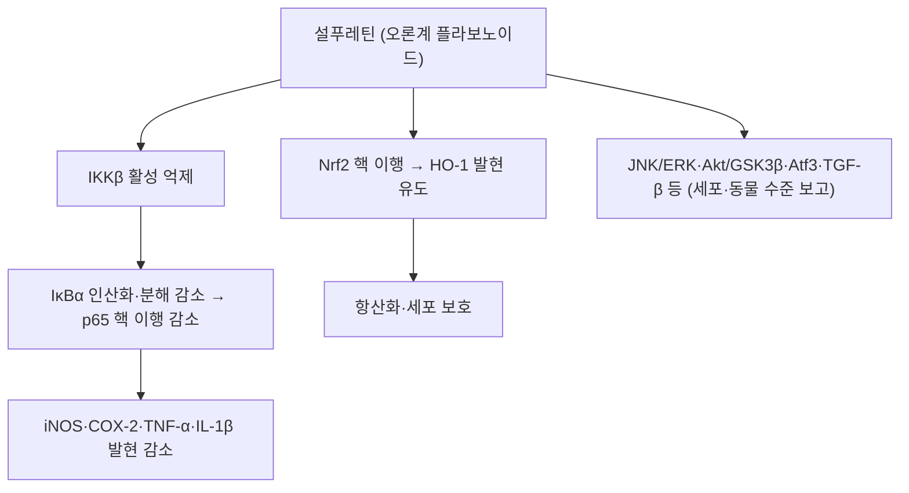

# 🔬 설푸레틴 (Sulfuretin)

> **핵심 3줄 요약 (Key Summary)**:
> - 🌿 기원 본초 & 화학 계열: [[건칠]](乾漆, 옻나무과 *Toxicodendron vernicifluum* 수지)에 함유된 오로바이오플라보노이드(Aurone) 계열 플라보노이드로, 푸스틴과 함께 옻나무의 무독성(비-[[우루시올]]) 활성 성분. (⚠️ 문헌에서 설푸레틴은 옻나무 심재·수피·줄기에서 분리·정량되었고, 건칠(수지)에서 검출된 보고는 확인하지 못했습니다. '무독성'도 확인하지 못했습니다. §2·§7)
> - 🎯 핵심 분자 표적: [[NF-κB]] 활성 억제를 통한 [[iNOS]]·COX-2·염증성 [[사이토카인]] 발현 차단, 헴옥시게나제-1(HO-1) 유도를 통한 항염증·항산화 작용이 제시됨.
> - 🩺 주요 약리 활성: 항염증, 항산화, 진통, 실험적 관절염 개선 작용이 세포·동물 연구에서 보고되며, 우루시올 알레르기 반응 없이 항종양(세포고사 유도) 활성도 함께 다뤄져 건칠의 파혈거어(破血祛瘀)·소적(消積) 효능과 별개로 독자적인 약리학적 가치를 지님. (⚠️ '진통'과 '우루시올 알레르기 반응 없이'는 설푸레틴 단독 문헌으로 확인하지 못했습니다. §5·§7)
> - ⚠️ 근거 수준: 대부분 세포·동물 모델 연구이며, 인체 임상시험 자료는 확인되지 않았습니다. 설푸레틴의 경구 약동학·CYP 상호작용·독성 자료도 확인하지 못했고, 접촉 감작능을 다룬 1987년 논문(제목만 확인)이 있어 '알레르기 없음'을 전제로 삼지 않습니다. (§4·§7)

---

## 📌 목차
1. [기본 화학 정보 & 분자 구조식 (Chemical Identity)](#1-기본-화학-정보--분자-구조식-chemical-identity)
2. [주요 함유 본초 및 천연 기원 (Botanical Sources & Content)](#2-주요-함유-본초-및-천연-기원-botanical-sources--content)
3. [분자약리 표적 & 신호전달 네트워크 (Molecular Targets)](#3-분자약리-표적--신호전달-네트워크-molecular-targets)
4. [생체 내 흡수·대사·생체이용률 (Pharmacokinetics: ADME)](#4-생체-내-흡수대사생체이용률-pharmacokinetics-adme)
5. [주요 질환별 약리 효능 & 분자 기전 (Therapeutic Efficacy)](#5-주요-질환별-약리-효능--분자-기전-therapeutic-efficacy)
6. [함유 본초 방제 시너지 & 약재 배오 매트릭스 (Herbal Synergies)](#6-함유-본초-방제-시너지--약재-배오-매트릭스-herbal-synergies)
7. [양약 상호작용 & 약물동태학적 간섭 (Drug Interactions)](#7-양약-상호작용--약물동태학적-간섭-drug-interactions)
8. [💡 사용자 진료실 핵심 필기 & 임상 응용 팁 (Melt-In & High-Yield)](#8--사용자-진료실-핵심-필기--임상-응용-팁-melt-in--high-yield)
9. [출처 및 학술 참고 문헌 (References)](#9-출처-및-학술-참고-문헌-references)

---

## 1. 기본 화학 정보 & 분자 구조식 (Chemical Identity)

> [!abstract]+ 🧪 3D 약리 분자 구조 (Interactive 3D Viewer)
> <iframe src="https://molecule-viewer-rho.vercel.app/?cid=5281295" width="100%" height="450px" frameborder="0" allow="webgl" style="border-radius: 8px;"></iframe>

| 항목 | 상세 내용 |
| :--- | :--- |
| **IUPAC 명칭** | (2Z)-2-[(3,4-dihydroxyphenyl)methylidene]-6-hydroxy-1-benzofuran-3-one (PubChem 등록명) |
| **분자식 / 분자량** | C₁₅H₁₀O₅ / 약 270.24 g/mol |
| **PubChem CID** | [5281295](https://pubchem.ncbi.nlm.nih.gov/compound/5281295) |
| **CAS 등록 번호** | 120-05-8 — PubChem 동의어 항목 기준이며 CAS 원본 대조는 못함. ⚠️ 내용 검토 필요 |
| **화학 골격 분류** | 오론(Aurone) — 플라보노이드 이성질체 계열 (이명: 3',4',6-trihydroxyaurone) |
| **물리화학적 성상** | 수용성·LogP·열/빛 안정성·맛은 확인하지 못함. ⚠️ 내용 검토 필요. 참고: 간세포 보호 활성에서 페놀성 수산기가 핵심이라는 구조-활성 예비 결과가 있음(Lu 2019). |
| **식물 내 생합성 경로** | 원문에 기재 없음. 식물 내 생합성 경로는 확인하지 못함. ⚠️ 내용 검토 필요 |

---

## 2. 주요 함유 본초 및 천연 기원 (Botanical Sources & Content)

| 함유 본초 | 기원 식물학적 명칭 | 주요 함유 부위 | 지표 함량 (%) | 한의학적 귀경 및 약효 특성 |
| :--- | :--- | :--- | :--- | :--- |
| [[건칠]] (乾漆) | 옻나무과 / *Toxicodendron vernicifluum* | 수액을 가공·건조한 수지 | 확인하지 못함 ⚠️ | 간·비경 귀경, 파혈거어(破血祛瘀)·소적(消積)·살충(殺蟲) |

* **기원 부위 관련 ⚠️ 내용 검토 필요**: 위 표의 '수액을 가공·건조한 수지'는 볼트 [[건칠]] 노트의 정의와 일치합니다. 다만 설푸레틴이 분리·정량된 문헌은 옻나무(*R. verniciflua*)의 **심재**(Shin 2010; Park 2004; Lee 2015), **수피**(Kim 2015), **줄기**(Kim SA 2013)이며, 가공·건조된 수지(건칠)에서 설푸레틴이 검출된 보고는 확인하지 못했습니다.
* **다른 기원**: 옻나무과(Anacardiaceae) 외에도 국화과(Compositae)·콩과(Leguminosae)에 널리 분포한다고 종설에 기술되어 있으며(Li 2025), 콩과 자귀나무(*Albizzia julibrissin*) 줄기껍질에서도 분리됩니다(Kwon 2015).
* **정량**: 옻나무 줄기 추출물(Kim SA 2013)·옻나무 플라보노이드 6종 동시정량(Chen 2020)의 HPLC 분석법이 보고되어 있으나, 부위별 함량(%) 수치는 초록에서 확인하지 못했습니다. ⚠️ 내용 검토 필요
* **한약재 규격상의 지표 함량**: ⚠️ 내용 검토 필요 — 대한민국약전의 건칠 규격에 설푸레틴 함량 기준이 있는지는 확인하지 못했습니다.

---

## 3. 분자약리 표적 & 신호전달 네트워크 (Molecular Targets)

### 1) 핵심 분자 표적 (Molecular Targets)
* **항염증**: LPS로 자극된 RAW264.7 대식세포에서 [[NF-κB]] 활성을 억제하여 [[iNOS]]·COX-2 및 염증성 [[사이토카인]] 발현을 차단합니다.
  * 근거: 설푸레틴은 LPS 유도 NO·PGE2·[[TNF-a]]·[[IL-1β]] 생성과 iNOS·COX-2 발현을 농도 의존적으로 줄이고, IκBα의 인산화·분해와 NF-κB p65의 핵 이행, DNA 결합·전사 활성을 낮췄으며 LPS로 자극된 IKKβ 활성화도 억제했습니다(Shin 2010; RAW 264.7). 같은 계열 결과가 복강 대식세포에서도 보고되었습니다(Lee 2010).
* **항산화**: 헴옥시게나제-1(HO-1) 발현 유도를 통한 항산화 방어 기전이 제시됩니다.
  * 근거: 설푸레틴은 [[Nrf2]]의 핵 이행을 통해 HO-1 발현과 HO 활성을 높였고, HO-1 억제제(SnPP)가 NO·PGE2·TNF-α·IL-1β 억제 효과를 부분적으로 되돌렸습니다(Lee 2010). HepG2 간세포에서 t-BHP 산화 손상을 Nrf2/ARE 활성화와 JNK·ERK [[MAPK pathway]] 매개 HO-1 발현으로 줄였고(Lee 2014), 연골세포 분화에서도 Nrf2 안정화가 보고되었습니다(Chang 2023).
* **항염증(관절염 모델)**: 실험적 관절염 동물모델에서 관절 부종과 염증 지표를 개선하는 것으로 보고됩니다.
  * 근거: TNF-α로 자극한 사람 류마티스 섬유아세포유사 활막세포(FLS)에서 케모카인 생성·[[MMP]] 분비·증식을 억제하고 파골세포 분화를 억제했으며, 콜라겐 유도 관절염(CIA) 마우스에서 발병률과 관절 파괴를 낮췄습니다. 이 효과는 [[NF-κB]] 신호 억제로 매개되었습니다(Lee YR 2012).

### 2) 그 밖에 보고된 표적 (세포·동물 수준, 원문에 없던 내용)
* **세포자멸사**: HL-60 백혈병 세포에서 Fas·FasL 발현, caspase-8·-9·-3 활성화, 미토콘드리아 기능 이상을 유도했습니다(Lee KW 2012; [[Caspase-3]]).
* **암세포 침윤**: MCF-7 유방암 세포에서 TPA 유도 NF-κB 의존적 MMP-9 발현과 침윤을 억제했습니다(Kim JM 2013).
* **세포주기·miRNA**: 사람 암세포주에서 miR-30C 발현을 높여 cyclin D1·D2를 낮추고 세포자멸사·세포주기 정지를 유도했습니다(Poudel 2013).
* **자가포식·미토파지**: 팔미트산 스트레스를 받은 간세포에서 p-TBK1·LC3 활성화와 p62 감소를 통한 미토파지 유도가 보고되었습니다(Lu 2019).
* **지방세포 분화**: 3T3-L1 세포에서 C/EBPα·C/EBPβ·[[PPAR]]γ 발현을 억제했고(Lamichhane 2017), 고지방식이 마우스에서 전사인자 Atf3 발현 증가를 통한 항비만 효과가 보고되었습니다(Kim 2019).
* **신경 보호 신호**: Akt/GSK3β·ERK 경로(MPP⁺ 모델, Pariyar 2017)와 ROS 의존적 기전(6-OHDA 모델, Kwon 2014)이 보고되었습니다.

---

## 4. 생체 내 흡수·대사·생체이용률 (Pharmacokinetics: ADME)

* **경구 흡수 (옻나무 추출물 기준)**: 랫드에 옻나무 추출물 1.5 g/kg을 경구 투여했을 때 설푸레틴을 포함한 페놀성 화합물 8종이 모두 혈장에서 검출되었고 주로 **포합체 형태**로 존재했습니다(Jin 2015; β-글루쿠로니다아제 처리 전후 비교). 설푸레틴 단독의 Cmax·Tmax·반감기 수치는 초록에서 확인하지 못했습니다. ⚠️ 내용 검토 필요
* **설푸레틴 단독 경구 생체이용률, P-gp 기질성, 장내 미생물 대사**: PubMed에서 'sulfuretin bioavailability' 검색 결과가 없었고, 단독 성분의 관련 논문을 확인하지 못했습니다. ⚠️ 내용 검토 필요
* **간 CYP450 대사**: 설푸레틴의 CYP 대사 경로·효소 억제·유도 문헌은 확인하지 못했습니다(§7). ⚠️ 내용 검토 필요
* **대사체와의 관계**: 감초 성분 이소리퀴리티게닌(isoliquiritigenin)의 1상 대사체 6종을 제조해 신경보호 효과를 비교한 연구에서 설푸레틴이 그중 하나로 포함되었습니다(Yang 2016; HT22 세포). 옻나무 추출물 복용 후의 설푸레틴이 어떤 경로로 생기는지와는 별개입니다.
* **건칠(수지) 전탕액에서의 함량·흡수**: 확인하지 못했습니다. ⚠️ 내용 검토 필요

---

## 5. 주요 질환별 약리 효능 & 분자 기전 (Therapeutic Efficacy)

> ⚠️ 아래는 모두 세포·동물 연구(설푸레틴 단독)이며 인체 임상시험은 확인하지 못했습니다. 최근 종설(Li 2025)도 향후 독성 평가와 임상 평가가 필요하다고 기술합니다.

### 1) 염증성·자가면역 질환 ([[류마티스]]·관절염)
* 원문 §3의 관절염 서술은 §3 참고. 콜라겐 유도 관절염 마우스에서 조기 투여 시 발병률·관절 파괴가 감소했고 이미 발병한 관절염에서도 활막 염증과 관절 파괴가 줄었습니다(Lee YR 2012).
* Freund 완전 보조제(FCA) 랫드에서 설푸레틴 30 mg/kg 경구 투여가 RA·CRP 인자를 유의하게 낮췄고, 옻나무 EtOAc 분획은 항산화 효소 활성을 높이고 무릎의 침윤 비만세포 수를 줄였습니다(Choi 2003).
* 원문의 '진통' 서술: 설푸레틴의 진통 효과를 직접 확인한 논문은 찾지 못했습니다. ⚠️ 내용 검토 필요

### 2) 산화 스트레스 보호 (간·신경)
* **간**: HepG2 세포의 t-BHP 산화 손상(Lee 2014), 팔미트산 유도 간세포 스트레스(Lu 2019)에서 보호 효과가 보고되었습니다.
* **신경**: 6-OHDA(Kwon 2014)·MPP⁺([[파킨슨병]] 세포 모델, Pariyar 2017)·아밀로이드 β25-35(Kwon 2015)로 유도한 SH-SY5Y 등 신경세포 손상에서 보호 효과가, LPS 유도 우울 마우스 모델에서 부동 시간 감소와 BDNF·ERK 신호 회복이 보고되었습니다(Sun 2022). 아밀로이드 전구단백질(APP) 처리에서는 ADAM10 관련 조절이 보고되었습니다(Chen 2021).

### 3) 항종양
* HL-60 백혈병 세포의 Fas 매개 세포자멸사(Lee KW 2012), MCF-7 침윤 억제(Kim JM 2013), miR-30C 매개 세포주기 조절(Poudel 2013)이 세포주에서 보고되었습니다.
* 옻나무 수피에서 분리한 성분 중 설푸레틴을 포함한 6종이 사람 암세포주 4종에 대해 IC50 4.78~28.89 μM의 증식 억제를 보였고, 설푸레틴은 LPS 유도 BV-2 미세아교세포의 NO 생성을 IC50 23.37 μM로 억제했습니다(Kim 2015).
* 원문 참고문헌(Lee 2004)의 림프종 억제는 설푸레틴 단독이 아니라 옻나무 추출 분획(RCMF)의 결과입니다(§9 참조).

### 4) 대사성 질환 ([[인슐린 저항성]]·당뇨·비만)
* 고지방식이 비만 마우스에서 비만 예방과 인슐린 감수성 개선, adiponectin 증가, 염증 지표 감소가 보고되었습니다(Kim 2019).
* 사이토카인·스트렙토조토신 유도 췌장 β세포 손상을 NF-κB 억제로 줄이고 스트렙토조토신 유도 당뇨를 예방했습니다(Song 2010, *Exp Mol Med*; 랫드 인슐린종 세포·분리 췌도·동물).

### 5) 알레르기·피부 질환 ([[천식]]·[[알레르기]]·[[아토피 피부염]])
* 오브알부민 유도 기도염증 마우스에서 1회 복강 투여만으로 기도 염증세포 침윤·사이토카인·점액 생성·기도 과민반응이 줄었습니다(Song 2010, *Biochem Biophys Res Commun*).
* DNCB 유도 아토피 피부염 양상 마우스에서 Th2 세포의 IL-4 생성 억제를 통한 증상 완화가 보고되었습니다(Jiang 2018).
* B16 흑색종 세포와 사람 멜라닌세포에서 멜라닌 생성을 억제했고 티로시나아제 활성을 시험관에서 직접 억제했습니다(Zhou 2019).

### 6) 혈전·혈소판 응집
* 옻나무 심재 추출물의 활성 성분인 피세틴·부테인·설푸레틴이 콜라겐·트롬빈·ADP로 유도한 혈소판 응집을 농도 의존적으로 억제했습니다(Lee 2015; 씻은 혈소판). 다만 생체 내 혈전 억제는 피세틴 경구 투여(100 mg/kg, 7일)에서 확인되었고, 설푸레틴의 생체 내 효과는 확인하지 못했습니다. ⚠️ 내용 검토 필요

### 7) 골·연골 형성
* 골모세포 분화를 TGF-β 신호(Song 2015)와 Runx2·BMP-2·Wnt/β-catenin 관련 경로(Auh 2016)로 촉진하고 마우스 두개골 결손의 뼈 재생을 돕는다고 보고되었습니다. Nrf2 활성화를 통한 연골세포 분화와 제브라피시 유생의 몸길이 증가도 보고되었습니다(Chang 2023).

### 8) 인체 근거 (설푸레틴 단독 없음, 옻나무 추출물)
* 설푸레틴 단독의 인체 시험은 확인하지 못했습니다. ⚠️ 내용 검토 필요
* 참고(추출물): 알레르겐 제거 옻나무 추출물(aRVS)을 투여한 진행성 췌장암 42명의 단일기관 관찰 연구에서 중앙 생존기간 7.87개월, 이상반응은 대부분 경미했습니다(Lee 2011). 1차 항암치료에 옻나무 추출물을 병용한 25명의 관찰 파일럿에서 경증 가려움 1례 외 간·신독성이 없었고 질병 조절률 72.2%였습니다(Jin 2024). 건강한 성인 79명에서 발효 옻나무 추출물(주성분 fustin·fisetin) 12주 이중맹검 시험은 간기능·지질 지표에서 유의한 차이가 없었습니다(Kwak 2021). 이 추출물들의 설푸레틴 함량은 확인하지 못했습니다.

---

## 6. 함유 본초 방제 시너지 & 약재 배오 매트릭스 (Herbal Synergies)

| 함유 본초 / 방제 | 공존 유효 성분군 | 분자약리 시너지 기전 | 전통 한의학적 효능 연계 |
| :--- | :--- | :--- | :--- |
| [[건칠]] | [[우루시올]], [[플라보노이드]](볼트 건칠 노트 기준: 푸스틴·부테인·피세틴) | ⚠️ 내용 검토 필요 — 설푸레틴과 공존 성분 간 시너지 문헌은 확인하지 못함. 참고: 옻나무 심재 추출물에서 피세틴·부테인·설푸레틴 3종이 모두 혈소판 응집 억제 활성을 보임(Lee 2015) | 파혈거어(破血祛瘀)·소적(消積) |

* **한의학적 연계 (원문 §4)**: 설푸레틴은 [[건칠]]의 우루시올(옻독 유발 물질)과 구분되는 무독성 플라보노이드 성분으로, 건칠 전탕액·엑스의 항염증·항산화 활성에 기여하는 것으로 다뤄지며, 옻나무 추출물을 이용한 어혈·적취(積聚) 치료의 안전성 확보 측면에서도 함께 논의됩니다.
  * ⚠️ 내용 검토 필요: '무독성', '건칠 전탕액·엑스의 활성에 기여', '어혈·적취 치료의 안전성 확보' 서술은 설푸레틴 단독 근거를 확인하지 못했습니다. 옻나무는 '혈액순환을 촉진하고 어혈을 막는' 전통 용도가 있다고 하며(Lee 2015), 이 연구는 심재 추출물 기준입니다.
* **처방 연계**: 볼트 `_의학/02_약리/처방/`에서 건칠이 구성에 들어가는 처방 노트는 확인하지 못했습니다(파혈약으로 언급되는 본초 노트만 있음). 처방 수준의 설푸레틴 기여는 확인하지 못했습니다. ⚠️ 내용 검토 필요

---

## 7. 양약 상호작용 & 약물동태학적 간섭 (Drug Interactions)

* **CYP450 효소 간섭**: 설푸레틴 단독의 CYP 억제·유도 문헌은 확인하지 못했습니다. ⚠️ 내용 검토 필요
* **항혈소판제·항응고제 병용(이론적 우려)**: 설푸레틴은 시험관(씻은 혈소판)에서 혈소판 응집을 억제했으므로(Lee 2015) 아스피린·클로피도그렐·와파린 등과의 병용 시 출혈 위험이 이론적으로 가능합니다. 생체 내·임상 병용 자료는 확인하지 못했습니다. ⚠️ 내용 검토 필요
* **접촉 감작(알레르기) 안전성**: 원문 서술('우루시올 알레르기 반응 없이')과 달리, 설푸레틴의 감작능을 다룬 논문(Hausen 1987, *Contact Dermatitis*; 제목 "The sensitizing capacity of sulfuretin")이 있습니다. PubMed에 초록이 없어 결과(감작 여부)는 확인하지 못했습니다. ⚠️ 내용 검토 필요. 우루시올 자체의 알레르기 기전은 [[우루시올]] 노트를 참고하세요.
* **추출물 수준의 이상반응**: 알레르겐 제거 옻나무 추출물(Lee 2011)·병용 관찰(Jin 2024)에서 이상반응은 대부분 경미했으나 추출물 결과이며 설푸레틴 단독 안전성이 아닙니다. 종설(Li 2025)도 독성 평가가 필요하다고 기술합니다.
* **유사 기전 양약 병용 시 고려사항**: 항염증제(NSAIDs)·혈당강하제 병용 시 상가 효과와 복용 간격에 대한 문헌은 확인하지 못했습니다. ⚠️ 내용 검토 필요

---

## 8. 💡 사용자 진료실 핵심 필기 & 임상 응용 팁 (Melt-In & High-Yield)

* **사용자 원문 필기 (100% 융합 및 보존)**:
  * 기존 노트에 원장님의 수기 필기는 없었습니다. (추후 필기가 생기면 이곳에 원문 그대로 추가)
* **진료실 실전 처방 & 생체이용률 극대화 팁**:
  1. 설푸레틴의 근거는 옻나무 심재·수피 유래 성분에 대한 세포·동물 자료이며, 건칠 전탕액의 설푸레틴 함량과 흡수는 확인되지 않았습니다(§2·§4). 건칠 처방의 항염증·항산화 근거로 그대로 옮기지 않도록 주의합니다.
  2. 체질별·병증별 적용은 원문·문헌에서 확인되지 않아 기재하지 않습니다. ⚠️ 내용 검토 필요

---

## 9. 출처 및 학술 참고 문헌 (References)

1. **Lee DS et al. (2010)**. *Anti-inflammatory effects of sulfuretin from Rhus verniciflua Stokes via the induction of heme oxygenase-1 expression in murine macrophages*. **Int Immunopharmacol**, 10(8):850-858. PMID: [20450988](https://pubmed.ncbi.nlm.nih.gov/20450988/) · DOI: [10.1016/j.intimp.2010.04.019](https://doi.org/10.1016/j.intimp.2010.04.019) · 원문 링크: [ScienceDirect](https://www.sciencedirect.com/science/article/abs/pii/S1567576910001335)
   - **[연구 요약]**: 설푸레틴이 HO-1 발현 유도를 통해 대식세포의 항염증 반응을 나타냄을 규명. iNOS·COX-2·TNF-α·IL-1β 감소, IκBα 인산화·분해와 p65 핵 이행 억제, Nrf2 핵 이행 후 HO-1 유도(SnPP가 효과를 부분 역전).
2. **Shin JS et al. (2010)**. *Sulfuretin isolated from heartwood of Rhus verniciflua inhibits LPS-induced inducible nitric oxide synthase, cyclooxygenase-2, and pro-inflammatory cytokines expression via the down-regulation of NF-κB in RAW 264.7 murine macrophage cells*. **Int Immunopharmacol**, 10(8):943-950. PMID: [20546946](https://pubmed.ncbi.nlm.nih.gov/20546946/) · DOI: [10.1016/j.intimp.2010.05.007](https://doi.org/10.1016/j.intimp.2010.05.007) · 원문 링크: [ScienceDirect](https://www.sciencedirect.com/science/article/abs/pii/S1567576910001669)
   - **[연구 요약]**: 설푸레틴의 NF-κB 경로 억제를 통한 iNOS·COX-2 발현 차단 기전을 규명. IκBα 분해·p65 핵 이행 감소와 IKKβ 활성 억제 확인.
3. **Lee YR et al. (2012)**. *Sulfuretin, a major flavonoid isolated from Rhus verniciflua, ameliorates experimental arthritis in mice*. **Life Sci**, 90(19-20):799-807. PMID: [22521292](https://pubmed.ncbi.nlm.nih.gov/22521292/) · DOI: [10.1016/j.lfs.2012.04.015](https://doi.org/10.1016/j.lfs.2012.04.015) · 원문 링크: [ScienceDirect](https://www.sciencedirect.com/science/article/abs/pii/S0024320512001919)
   - **[연구 요약]**: 설푸레틴의 실험적 관절염 모델에서의 개선 효과를 검증한 연구. (⚠️ 원문의 저널 표기 *Biochemical Pharmacology*는 PubMed 기준 *Life Sciences*로 정정) 사람 류마티스 FLS와 CIA 마우스에서 NF-κB 억제로 염증·관절 파괴 감소.
4. **Lee JC et al. (2004)**. Extract from Rhus verniciflua Stokes is capable of inhibiting the growth of human lymphoma cells. *Food and Chemical Toxicology*, 42(9): 1383-8. [PMID: 15234068](https://pubmed.ncbi.nlm.nih.gov/15234068/) · DOI: [10.1016/j.fct.2004.03.012](https://doi.org/10.1016/j.fct.2004.03.012)
   - **[연구 요약]**: 건칠 유래 플라보노이드(설푸레틴 등)가 우루시올 알레르기 반응 없이 종양세포 고사를 유도함을 입증.
   - ⚠️ 내용 검토 필요: PubMed 초록은 옻나무 아세톤 추출물의 클로로폼-메탄올 분획(RCMF)이 B 림프종 세포 증식을 억제하고 세포자멸사를 유도했으며, 이 분획에서 protocatechuic acid·fustin·fisetin·sulfuretin·butein이 확인되었다는 내용입니다. 우루시올 알레르기 반응에 대한 언급은 없고, 설푸레틴 단독 결과도 아닙니다. 건칠(수지)이 아니라 옻나무 추출물 기준입니다.
5. **Li MC et al. (2025)**. *Sulfuretin: Unraveling its potent therapeutic potential in a holistic literature review*. **Fitoterapia**, 182:106490. PMID: [40107426](https://pubmed.ncbi.nlm.nih.gov/40107426/) · DOI: [10.1016/j.fitote.2025.106490](https://doi.org/10.1016/j.fitote.2025.106490)
   - **[연구 요약]**: 1953~2024년 설푸레틴 약리 연구 종설. 신경보호·항산화·항암·간보호·항균·항염증·항당뇨 활성과 NF-κB·PI3K/AKT/mTOR·Nrf2/HO-1·MAPK 표적을 정리하고, 독성 평가와 임상 평가가 필요하다고 기술.
6. **Jin MJ et al. (2015)**. *Pharmacokinetic Profile of Eight Phenolic Compounds and Their Conjugated Metabolites after Oral Administration of Rhus verniciflua Extracts in Rats*. **J Agric Food Chem**, 63(22):5410-5416. PMID: [25998231](https://pubmed.ncbi.nlm.nih.gov/25998231/) · DOI: [10.1021/acs.jafc.5b01724](https://doi.org/10.1021/acs.jafc.5b01724)
   - **[연구 요약]**: 랫드에 옻나무 추출물 1.5 g/kg 경구 투여 후 설푸레틴 포함 8종이 혈장에서 주로 포합체로 검출.
7. **Choi J et al. (2003)**. *Antirheumatoid arthritis effect of Rhus verniciflua and of the active component, sulfuretin*. **Planta Med**, 69(10):899-904. PMID: [14648391](https://pubmed.ncbi.nlm.nih.gov/14648391/) · DOI: [10.1055/s-2003-45097](https://doi.org/10.1055/s-2003-45097)
   - **[연구 요약]**: FCA 랫드에서 옻나무 추출물과 설푸레틴 30 mg/kg 경구 투여가 RA·CRP 인자를 낮추고 항산화 효소를 높임.
8. **Lee DS et al. (2014)**. *The cytoprotective effect of sulfuretin against tert-butyl hydroperoxide-induced hepatotoxicity through Nrf2/ARE and JNK/ERK MAPK-mediated heme oxygenase-1 expression*. **Int J Mol Sci**, 15(5):8863-8877. PMID: [24857917](https://pubmed.ncbi.nlm.nih.gov/24857917/) · DOI: [10.3390/ijms15058863](https://doi.org/10.3390/ijms15058863)
   - **[연구 요약]**: HepG2 세포에서 t-BHP 유도 세포독성·ROS를 줄이고 Nrf2 핵 이행·ARE 활성·JNK/ERK 인산화로 HO-1 발현을 유도.
9. **Lu YT et al. (2019)**. *Sulfuretin protects hepatic cells through regulation of ROS levels and autophagic flux*. **Acta Pharmacol Sin**, 40(7):908-918. PMID: [30560904](https://pubmed.ncbi.nlm.nih.gov/30560904/) · DOI: [10.1038/s41401-018-0193-5](https://doi.org/10.1038/s41401-018-0193-5)
   - **[연구 요약]**: 팔미트산 스트레스 간세포에서 p-TBK1·LC3 활성화 미토파지와 p62 감소, 페놀성 수산기가 활성 유지에 핵심이라는 예비 구조-활성 결과.
10. **Kwon SH et al. (2015)**. *Involvement of the Nrf2/HO-1 signaling pathway in sulfuretin-induced protection against amyloid beta25-35 neurotoxicity*. **Neuroscience**, 304:14-28. PMID: [26192096](https://pubmed.ncbi.nlm.nih.gov/26192096/) · DOI: [10.1016/j.neuroscience.2015.07.030](https://doi.org/10.1016/j.neuroscience.2015.07.030)
    - **[연구 요약]**: SH-SY5Y 세포와 일차 해마 신경세포에서 Aβ25-35 신경독성(생존율 감소·LDH 방출·ROS)을 줄이고 Nrf2/HO-1 경로가 관여. 설푸레틴이 옻나무 심재와 자귀나무 줄기껍질에서 분리됨을 기술.
11. **Kwon SH et al. (2014)**. *Sulfuretin inhibits 6-hydroxydopamine-induced neuronal cell death via reactive oxygen species-dependent mechanisms in human neuroblastoma SH-SY5Y cells*. **Neurochem Int**, 74:53-64. PMID: [24801546](https://pubmed.ncbi.nlm.nih.gov/24801546/) · DOI: [10.1016/j.neuint.2014.04.016](https://doi.org/10.1016/j.neuint.2014.04.016)
    - **[연구 요약]**: 6-OHDA 유도 신경세포 사멸·세포자멸사·ROS 생성을 억제하는 ROS 의존적 기전.
12. **Pariyar R et al. (2017)**. *Sulfuretin Attenuates MPP⁺-Induced Neurotoxicity through Akt/GSK3β and ERK Signaling Pathways*. **Int J Mol Sci**, 18(12). DOI: [10.3390/ijms18122753](https://doi.org/10.3390/ijms18122753) · PMID: [29257079](https://pubmed.ncbi.nlm.nih.gov/29257079/)
    - **[연구 요약]**: SH-SY5Y 파킨슨병 세포 모델에서 caspase 3 활성·PARP 절단·ROS·미토콘드리아 막전위 붕괴·p53·Bax/Bcl-2 비를 줄임.
13. **Sun X et al. (2022)**. *Sulfuretin exerts anti-depressive effects in the lipopolysaccharide-induced depressive mouse models*. **Physiol Behav**, 250:113800. PMID: [35395250](https://pubmed.ncbi.nlm.nih.gov/35395250/) · DOI: [10.1016/j.physbeh.2022.113800](https://doi.org/10.1016/j.physbeh.2022.113800)
    - **[연구 요약]**: LPS 유도 우울 마우스에서 부동 시간을 농도 의존적으로 줄이고 해마 BDNF·ERK 신호를 회복.
14. **Chen J et al. (2021)**. *Sulfuretin exerts diversified functions in the processing of amyloid precursor protein*. **Genes Dis**, 8(6):867-881. PMID: [34522714](https://pubmed.ncbi.nlm.nih.gov/34522714/) · DOI: [10.1016/j.gendis.2020.11.008](https://doi.org/10.1016/j.gendis.2020.11.008)
    - **[연구 요약]**: APP 처리 효소 ADAM10·BACE1 관련 조절. ADAM10 전사 증가가 RXR·PPAR-α 관여로 보고.
15. **Lee KW et al. (2012)**. *Sulfuretin from heartwood of Rhus verniciflua triggers apoptosis through activation of Fas, Caspase-8, and the mitochondrial death pathway in HL-60 human leukemia cells*. **J Cell Biochem**, 113(9):2835-2844. PMID: [22492309](https://pubmed.ncbi.nlm.nih.gov/22492309/) · DOI: [10.1002/jcb.24158](https://doi.org/10.1002/jcb.24158)
    - **[연구 요약]**: Fas·FasL 발현과 caspase-8·-9·-3 활성화, 미토콘드리아 기능 이상을 통한 백혈병 세포 세포자멸사.
16. **Kim JM et al. (2013)**. *Suppression of TPA-induced tumor cell invasion by sulfuretin via inhibition of NF-κB-dependent MMP-9 expression*. **Oncol Rep**, 29(3):1231-1237. PMID: [23292685](https://pubmed.ncbi.nlm.nih.gov/23292685/) · DOI: [10.3892/or.2012.2218](https://doi.org/10.3892/or.2012.2218)
    - **[연구 요약]**: MCF-7 세포에서 TPA 유도 NF-κB 활성·MMP-9 발현·침윤을 억제.
17. **Poudel S et al. (2013)**. *Sulfuretin-induced miR-30C selectively downregulates cyclin D1 and D2 and triggers cell death in human cancer cell lines*. **Biochem Biophys Res Commun**, 431(3):572-578. PMID: [23318178](https://pubmed.ncbi.nlm.nih.gov/23318178/) · DOI: [10.1016/j.bbrc.2013.01.012](https://doi.org/10.1016/j.bbrc.2013.01.012)
    - **[연구 요약]**: miR-30C 발현 증가로 cyclin D1·D2 하향, 사람 암세포주의 세포자멸사·세포주기 정지.
18. **Kim KH et al. (2015)**. *Identification of cytotoxic and anti-inflammatory constituents from the bark of Toxicodendron vernicifluum (Stokes) F.A. Barkley*. **J Ethnopharmacol**, 162:231-237. PMID: [25582488](https://pubmed.ncbi.nlm.nih.gov/25582488/) · DOI: [10.1016/j.jep.2014.12.071](https://doi.org/10.1016/j.jep.2014.12.071)
    - **[연구 요약]**: 옻나무 수피에서 분리한 오론 설푸레틴 등이 암세포주 증식을 억제(IC50 4.78~28.89 μM, 화합물 4~9)하고 설푸레틴이 BV-2 세포 NO 생성을 IC50 23.37 μM로 억제.
19. **Kim S et al. (2019)**. *Sulfuretin Prevents Obesity and Metabolic Diseases in Diet Induced Obese Mice*. **Biomol Ther (Seoul)**, 27(1):107-116. PMID: [30130954](https://pubmed.ncbi.nlm.nih.gov/30130954/) · DOI: [10.4062/biomolther.2018.090](https://doi.org/10.4062/biomolther.2018.090)
    - **[연구 요약]**: 지방세포 분화 억제, 고지방식이 마우스의 비만 예방·인슐린 감수성 개선, Atf3 발현 증가 매개.
20. **Lamichhane R et al. (2017)**. *Exploration of Underlying Mechanism of Anti-adipogenic Activity of Sulfuretin*. **Biol Pharm Bull**, 40(9):1366-1373. PMID: [28579594](https://pubmed.ncbi.nlm.nih.gov/28579594/) · DOI: [10.1248/bpb.b17-00049](https://doi.org/10.1248/bpb.b17-00049)
    - **[연구 요약]**: 3T3-L1 세포에서 C/EBPα·C/EBPβ·PPARγ 등 지방세포 분화 인자 발현을 억제.
21. **Song MY et al. (2010)**. *Sulfuretin protects against cytokine-induced beta-cell damage and prevents streptozotocin-induced diabetes*. **Exp Mol Med**, 42(9):628-638. PMID: [20661005](https://pubmed.ncbi.nlm.nih.gov/20661005/) · DOI: [10.3858/emm.2010.42.9.062](https://doi.org/10.3858/emm.2010.42.9.062)
    - **[연구 요약]**: 사이토카인 유도 NF-κB 활성·iNOS·NO를 줄여 랫드 인슐린종 세포와 분리 췌도를 보호하고 스트렙토조토신 유도 당뇨를 예방.
22. **Song MY et al. (2010)**. *Sulfuretin attenuates allergic airway inflammation in mice*. **Biochem Biophys Res Commun**, 400(1):83-88. PMID: [20696133](https://pubmed.ncbi.nlm.nih.gov/20696133/) · DOI: [10.1016/j.bbrc.2010.08.014](https://doi.org/10.1016/j.bbrc.2010.08.014)
    - **[연구 요약]**: 오브알부민 유도 기도염증 마우스에서 기도 염증세포 침윤·사이토카인·점액 생성·과민반응을 줄임(초록 말미의 기전 서술은 확인하지 못함).
23. **Jiang P et al. (2018)**. *Sulfuretin alleviates atopic dermatitis-like symptoms in mice via suppressing Th2 cell activity*. **Immunol Res**, 66(5):611-619. PMID: [30159861](https://pubmed.ncbi.nlm.nih.gov/30159861/) · DOI: [10.1007/s12026-018-9025-4](https://doi.org/10.1007/s12026-018-9025-4)
    - **[연구 요약]**: DNCB 유도 아토피 피부염 마우스에서 Th2 세포의 IL-4 생성과 GATA3 경로를 억제해 증상 완화.
24. **Zhou Z et al. (2019)**. *Characterization of sulfuretin as a depigmenting agent*. **Fundam Clin Pharmacol**, 33(2):208-215. PMID: [30216535](https://pubmed.ncbi.nlm.nih.gov/30216535/) · DOI: [10.1111/fcp.12414](https://doi.org/10.1111/fcp.12414)
    - **[연구 요약]**: B16 세포와 사람 멜라닌세포에서 멜라닌 합성을 억제하고 티로시나아제 활성을 시험관에서 직접 억제.
25. **Lee JH et al. (2015)**. *Antiplatelet effects of Rhus verniciflua stokes heartwood and its active constituents--fisetin, butein, and sulfuretin--in rats*. **J Med Food**, 18(1):21-30. PMID: [25372471](https://pubmed.ncbi.nlm.nih.gov/25372471/) · DOI: [10.1089/jmf.2013.3116](https://doi.org/10.1089/jmf.2013.3116)
    - **[연구 요약]**: 피세틴·부테인·설푸레틴이 콜라겐·트롬빈·ADP 유도 혈소판 응집을 농도 의존적으로 억제. 설푸레틴은 ERK 활성화를 막지 못했고, 생체 내 항혈전 효과는 피세틴 경구 100 mg/kg에서 확인.
26. **Song NJ et al. (2015)**. *Sulfuretin induces osteoblast differentiation through activation of TGF-β signaling*. **Mol Cell Biochem**, 410(1-2):55-63. PMID: [26260053](https://pubmed.ncbi.nlm.nih.gov/26260053/) · DOI: [10.1007/s11010-015-2537-5](https://doi.org/10.1007/s11010-015-2537-5)
    - **[연구 요약]**: TGF-β 표적 유전자(SMAD7·PAI-1) 유도를 통한 골모세포 분화 촉진.
27. **Auh QS et al. (2016)**. *Sulfuretin promotes osteoblastic differentiation in primary cultured osteoblasts and in vivo bone healing*. **Oncotarget**, 7(48):78320-78330. PMID: [27713171](https://pubmed.ncbi.nlm.nih.gov/27713171/) · DOI: [10.18632/oncotarget.12460](https://doi.org/10.18632/oncotarget.12460)
    - **[연구 요약]**: ALP·골 분화 표지 상향, Runx2·BMP-2·Wnt/β-catenin 관련 경로 활성화, 마우스 두개골 결손의 뼈 재생.
28. **Chang SH et al. (2023)**. *Activation of Nrf2 by sulfuretin stimulates chondrocyte differentiation and increases bone lengths in zebrafish*. **BMB Rep**, 56(9):496-501. PMID: [37748761](https://pubmed.ncbi.nlm.nih.gov/37748761/) · DOI: [10.5483/BMBRep.2023-0056](https://doi.org/10.5483/BMBRep.2023-0056)
    - **[연구 요약]**: Nrf2 안정화·전사 활성으로 비대 연골세포 분화 촉진, 제브라피시 유생의 몸길이 증가.
29. **Lee S et al. (2011)**. *Efficacy and safety of standardized allergen-removed Rhus verniciflua Stokes extract in patients with advanced or metastatic pancreatic cancer: a Korean single-center experience*. **Oncology**, 81(5-6):312-318. PMID: [22179506](https://pubmed.ncbi.nlm.nih.gov/22179506/) · DOI: [10.1159/000334695](https://doi.org/10.1159/000334695)
    - **[연구 요약]**: 알레르겐 제거 옻나무 추출물 투여 췌장암 42명 관찰 연구, 중앙 생존 7.87개월, 이상반응 대부분 경미(설푸레틴 단독이 아닌 추출물 결과).
30. **Jin H et al. (2024)**. *Rhus verniciflua stokes extract, a traditional herbal medicine, combined with first-line chemotherapy for unresectable locally advanced and metastatic pancreatic cancer: a prospective observational pilot study*. **Front Oncol**, 14:1469616. PMID: [39610932](https://pubmed.ncbi.nlm.nih.gov/39610932/) · DOI: [10.3389/fonc.2024.1469616](https://doi.org/10.3389/fonc.2024.1469616)
    - **[연구 요약]**: 25명 등록·18명 추적, 경증 가려움 1례 외 간·신독성 없음, 질병조절률 72.2%(추출물 결과).
31. **Kwak JH et al. (2021)**. *Effect of fermented Rhus verniciflua stokes extract on liver function parameters in healthy Korean adults: a double-blind randomized controlled trial*. **Trials**, 22(1):830. PMID: [34809689](https://pubmed.ncbi.nlm.nih.gov/34809689/) · DOI: [10.1186/s13063-021-05656-0](https://doi.org/10.1186/s13063-021-05656-0)
    - **[연구 요약]**: 건강 성인 79명 12주 이중맹검 시험, 간기능·지질 지표에서 군 간 유의한 차이 없음(주성분 fustin 129 mg·fisetin 59 mg).
32. **Hausen BM (1987)**. *The sensitizing capacity of sulfuretin*. **Contact Dermatitis**, 17(5):323-325. PMID: [3436142](https://pubmed.ncbi.nlm.nih.gov/3436142/) · DOI: [10.1111/j.1600-0536.1987.tb01493.x](https://doi.org/10.1111/j.1600-0536.1987.tb01493.x)
    - **[연구 요약]**: 제목 기준 인용(PubMed에 초록 없음). 감작 여부의 결과는 확인하지 못함.
33. **Yang EJ et al. (2016)**. *The comparison of neuroprotective effects of isoliquiritigenin and its Phase I metabolites against glutamate-induced HT22 cell death*. **Bioorg Med Chem Lett**, 26(23):5639-5643. PMID: [27815122](https://pubmed.ncbi.nlm.nih.gov/27815122/) · DOI: [10.1016/j.bmcl.2016.10.072](https://doi.org/10.1016/j.bmcl.2016.10.072)
    - **[연구 요약]**: 이소리퀴리티게닌의 1상 대사체 6종(설푸레틴 포함) 제조·비교. 부테인이 모체보다 신경보호 효과가 컸음.
34. **Kim SA et al. (2013)**. *Simultaneous determination of bioactive phenolic compounds in the stem extract of Rhus verniciflua stokes by high performance liquid chromatography*. **Food Chem**, 141(4):3813-3819. PMID: [23993553](https://pubmed.ncbi.nlm.nih.gov/23993553/) · DOI: [10.1016/j.foodchem.2013.06.068](https://doi.org/10.1016/j.foodchem.2013.06.068)
    - **[연구 요약]**: 옻나무 줄기 추출물의 갈산·fustin·fisetin·sulfuretin HPLC 정량법(초록에서 함량 수치는 확인하지 못함).
35. **Chen H et al. (2020)**. *Simultaneous quantification of six flavonoids of Rhus verniciflua Stokes using matrix solid-phase dispersion via high-performance liquid chromatography coupled with photodiode array detector*. **J Sep Sci**, 43(23):4281-4288. PMID: [32991034](https://pubmed.ncbi.nlm.nih.gov/32991034/) · DOI: [10.1002/jssc.202000749](https://doi.org/10.1002/jssc.202000749)
    - **[연구 요약]**: fisetin·fustin·butein·sulfuretin·garbanzol·quercetin 6종 동시정량법.
36. **데이터베이스 확인 항목**: PubChem Compound [5281295](https://pubchem.ncbi.nlm.nih.gov/compound/5281295)(분자식·분자량·IUPAC 등록명, CAS 120-05-8은 동의어 항목).

<!-- 보관 태그(1회용·링크오류, 필요시 복원): 건칠 -->
