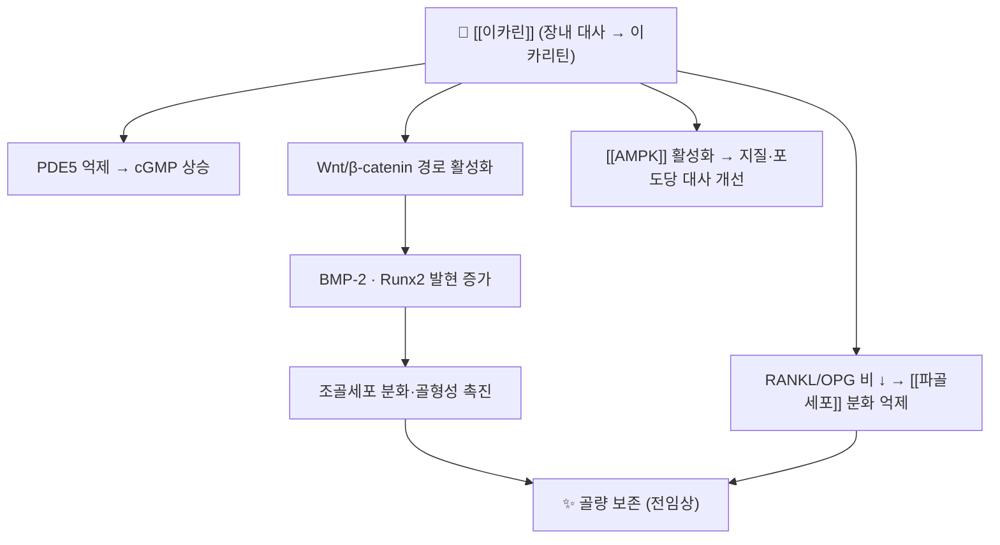

# 🔬 이카린 (Icariin, C33H40O15 / 프레닐화 플라보놀 배당체)

> 🖼️ **이미지**: ①2D 구조식(PubChem 정본) ②기원 식물(음양곽) ③Wnt 신호전달 경로 도해 ④골 재형성 주기 도해.

> **핵심 3줄 요약 (Key Summary)**:
> - 🌿 기원 본초 & 화학 계열: [[음양곽]](삼지구엽초·전엽음양곽 등 *Epimedium* 속)의 대표 **프레닐화 플라보놀 배당체**. 음양곽의 '보신양(補腎陽)·강근골(強筋骨)' 효능을 설명하는 핵심 성분으로 연구된다.
> - 🎯 핵심 분자 표적 & 조절 경로: PDE5 억제(cGMP 상승) · **Wnt/β-catenin 및 BMP-2–Runx2 촉진 → 조골세포 분화** · RANKL/OPG 비 조절 → [[파골세포]] 억제 · AMPK 활성화.
> - 🩺 주요 약리 활성 & 질환 치료 기전: 골다공증·골재생(전임상 중심), 혈관내피 기능, 항염(NF-κB 억제), 대사 조절.
> - ⚠️ 생체이용률 한계와 상호작용: 경구 흡수율이 매우 낮고 장내 대사로 **이카리틴**으로 전환된다. **PDE5 억제제(실데나필 등)와 병용 시 혈압 강하 위험**, 항응고제 병용 주의.

---

## 📌 목차
1. [기본 화학 정보 & 분자 구조식 (Chemical Identity)](#1-기본-화학-정보--분자-구조식-chemical-identity)
2. [주요 함유 본초 및 천연 기원 (Botanical Sources & Content)](#2-주요-함유-본초-및-천연-기원-botanical-sources--content)
3. [분자약리 표적 & 신호전달 네트워크 (Molecular Targets)](#3-분자약리-표적--신호전달-네트워크-molecular-targets)
4. [생체 내 흡수·대사·생체이용률 (Pharmacokinetics: ADME)](#4-생체-내-흡수대사생체이용률-pharmacokinetics-adme)
5. [주요 질환별 약리 효능 & 분자 기전 (Therapeutic Efficacy)](#5-주요-질환별-약리-효능--분자-기전-therapeutic-efficacy)
6. [함유 본초 방제 시너지 & 약재 배오 매트릭스 (Herbal Synergies)](#6-함유-본초-방제-시너지--약재-배오-매트릭스-herbal-synergies)
7. [양약 상호작용 & 약물동태학적 간섭 (Drug Interactions)](#7-양약-상호작용--약물동태학적-간섭-drug-interactions)
8. [💡 사용자 진료실 핵심 필기 & 임상 응용 팁 (Melt-In & High-Yield)](#8--사용자-진료실-핵심-필기--임상-응용-팁-melt-in--high-yield)
9. [출처 및 학술 참고 문헌 (References)](#9-출처-및-학술-참고-문헌-references)

---

## 1. 기본 화학 정보 & 분자 구조식 (Chemical Identity)

![[이카린_01_구조식.png|420]]
> [그림 1: 이카린 2D 화학 구조식 — **PubChem PNG 정본**, CID [5318997](https://pubchem.ncbi.nlm.nih.gov/compound/5318997)]

> [!abstract]+ 🧪 3D 약리 분자 구조 (Interactive 3D Viewer)
> <iframe src="https://molecule-viewer-rho.vercel.app/?cid=5318997" width="100%" height="450px" frameborder="0" allow="webgl" style="border-radius: 8px;"></iframe>

| 항목 | 상세 내용 |
| :--- | :--- |
| **IUPAC/일반 명칭** | Icariin (ICA) — 이카린 |
| **분자식 / 분자량** | C33H40O15 / 676.7 g/mol |
| **PubChem CID** | [5318997](https://pubchem.ncbi.nlm.nih.gov/compound/5318997) |
| **화학 골격 분류** | 프레닐화 플라보놀(prenylated flavonol) O-배당체 — 켐페롤 유사 골격 + 이소펜틸(enyl)기 + 람노스-글루코스 이당체 |
| **물리화학적 성상** | 황색 결정성 분말, 지용성 우세(LogP 높음), 물 용해도 매우 낮음 |
| **식물 내 생합성** | 페닐프로파노이드–플라보노이드 경로에서 켐페롤 골격이 만들어지고 **프레닐화·배당화** 단계를 거쳐 이카린이 된다 |
| **주요 대사체** | 장내 탈당화 → **이카리틴(icaritin)**, 더 탈메틸화된 이카리신(icariside) 계열 |

---

## 2. 주요 함유 본초 및 천연 기원 (Botanical Sources & Content)

![[이카린_02_기원식물.jpg|420]]
> [그림 2: 음양곽 기원 식물 *Epimedium sagittatum* — 잎과 지상부 — Wikimedia Commons, CC BY-SA 4.0]

| 함유 본초 (한글/한자) | 기원 식물학적 명칭 (과명 / 학명) | 주요 함유 약용 부위 | 한의학적 귀경 및 약효 특성 |
| :--- | :--- | :--- | :--- |
| [[음양곽]] (淫羊藿) | 매자나무과 / *Epimedium koreanum*(삼지구엽초)·*E. sagittatum*·*E. pubescens* | 잎(지상부) | 肝·腎 — 보신양·강근골·거풍습 |
| [[제하수오]] (製何首烏) | 마디풀과 / *Polygonum multiflorum* | 덩이뿌리 | 肝·腎 — 보간신·익정혈 (배오 시 보신 축 보강) |

- **함량 표기는 쓰지 않는다**: 품종·산지·수확기·채취 부위에 따라 이카린 함량 차이가 매우 커서, 특정 수치를 인용하면 오해를 만든다. 규격은 공정서·제조사 시험성적서로 확인한다.

---

## 3. 분자약리 표적 & 신호전달 네트워크 (Molecular Targets)

![[이카린_03_Wnt_경로.png|460]]
> [그림 3: 표준 Wnt 신호전달 경로 도해(좌: Wnt 없음 — β-catenin 분해 / 우: Wnt 있음 — β-catenin 축적·전사) — Wikimedia Commons, CC BY-SA 3.0]

![[이카린_04_골재형성_도해.png|460]]
> [그림 4: 골 재형성 주기(Bone remodeling cycle) — 파골세포 흡수 → 조골세포 형성 순차 도해 — Servier Medical Art, CC BY-SA 3.0] → [[골 재형성]]

### 1) 핵심 분자 표적
* **PDE5 억제**: 음양곽의 전통 효능(보신양)과 연결되는 기전 — cGMP 분해를 막아 평활근 이완·혈류 증가 방향으로 작동한다
* **Wnt/β-catenin · BMP-2/Runx2**: 조골세포 분화를 촉진하는 축. 골다공증 연구에서 반복 인용되는 기전이다 → [[골 재형성]]
* **RANKL/OPG 비 조절**: 파골세포 분화 억제 → [[파골세포]]
* **항염**: NF-κB 경로 억제, 염증성 사이토카인 감소 → [[NF-κB]] · [[TNF-a]]

---

## 4. 생체 내 흡수·대사·생체이용률 (Pharmacokinetics: ADME)

* **낮은 경구 생체이용률이 최대 약점**: 배당체가 크고 수용성이 낮아 장관 흡수가 제한적이며, 흡수 개선 전략(나노제형·공용매·흡수촉진)이 별도로 연구될 정도다
* **장내 미생물·효소 탈당화**: 흡수 전 장에서 **이카리틴** 등 활성 대사체로 전환 — 개인별 장내균총 차이가 효과 편차를 만든다 → [[단쇄지방산]]을 만드는 균총과 같은 층위의 문제
* **배오의 의미**: 본초 전탕액 상태로 복용할 때 공존 성분이 흡수를 돕는다는 관찰이 있어, **단일 성분 정제보다 전탕·복합 처방이 유리**할 수 있다 → §6

---

## 5. 주요 질환별 약리 효능 & 분자 기전 (Therapeutic Efficacy)

### 1) 골 대사 — 골다공증·골재생 (전임상 중심)
* 골수유래 줄기세포(BMSC)의 조골세포 분화 촉진과 골형성 증가가 리뷰 수준으로 정리되어 있다 → [[골다공증]]
* ⚠️ **인체 임상에서 골밀도·골절을 개선했다는 근거는 아직 확립되지 않았다** — 항흡수제를 대체하는 개념이 아니라 전임상·보조 축으로 읽는다
### 2) 혈관·대사
* 내피 기능(eNOS)·혈관 확장, 지질·포도당 대사 개선(AMPK) 방향의 전임상 결과
### 3) 항염·면역 조절
* 이카린·이카리틴의 항염·면역조절 효과가 리뷰로 정리되어 있다

---

## 6. 함유 본초 방제 시너지 & 약재 배오 매트릭스 (Herbal Synergies)

| 함유 본초 / 방제 | 공존 유효 성분군 | 분자약리 시너지 기전 | 전통 한의학적 효능 연계 |
| :--- | :--- | :--- | :--- |
| [[음양곽]] | [[이카린]], 이카리틴, 플라보놀 배당체군 | 다당·플라보노이드 공존 시 흡수·대사체 균형 | 보신양·강근골·거풍습 |
| [[진력달과립]] | [[인삼]], [[황정]], [[제하수오]], [[산수유]] | 보신고정 축에서 골·대사 보조 역할 | 익기양음·건비운진 |
| [[제하수오]] | [[에모딘]], TSG | 보간신 축 중첩(단, 간독성 감시 필요) | 보간신·익정혈 |

---

## 7. 양약 상호작용 & 약물동태학적 간섭 (Drug Interactions)

* **PDE5 억제제 병용 금기 수준 주의**: [[실데나필]]·타달라필 등과 병용하면 혈압 강하·두통·심혈관 이벤트 위험이 상가한다 → 복용력을 반드시 문진
* **항응고·항혈소판 병용**: 출혈 경향 보고 — [[와파린]]·DOAC·아스피린 복용자에서 주의
* **CYP 간섭**: 플라보노이드 특성상 CYP 억제 가능성 → 병용 양약 혈중농도 변동 고려 → [[CYP3A4]]
* **복용 시점 분리**: 흡수 간섭을 피해 **1~2시간 간격** 원칙

---

## 8. 💡 사용자 진료실 핵심 필기 & 임상 응용 팁 (Melt-In & High-Yield)

> 🛡️ **Melt-In 원칙**: 원장님 필기는 상부 섹션에 녹여내고, 여기엔 상부에 담기지 않은 진료실 노하우만 남긴다.

* **진료실 현실적 위치 정리**
  1. 음양곽은 **전당뇨·노인 대사 처방(예: 진력달과립 구조)** 의 보신고정 축에서 쓴다 — 골다공증 치료제로 기대하게 설명하지 않는다.
  2. **문진 필수 항목**: PDE5 억제제 복용 여부, 항응고제 복용 여부, 혈압약 복용 여부. 세 가지가 확인되면 병용 상담을 먼저 한다.
  3. **효과 판정**: 골밀도가 아니라 증상(야간뇨·요슬산연·기력)과 대사 지표([[HbA1c]]·[[HOMA-IR]]) 로 추적한다.
* **환자 티스크립트**
  > "이 약초 성분은 혈관을 넓히는 약(발기부전 치료제)과 같은 계열의 경로를 건드립니다. 같이 드시면 어지럽고 혈압이 떨어질 수 있어, 드시기 전에 꼭 말씀해 주세요."

---

## 9. 출처 및 학술 참고 문헌 (References)

1. **Zhang J, et al. (2022)**. *Bioavailability Improvement Strategies for Icariin and Its Derivates: A Review*. **Int J Mol Sci**. [PMID 35886867](https://pubmed.ncbi.nlm.nih.gov/35886867/)
   - **[연구 요약]**: 이카린의 **낮은 경구 생체이용률** 원인(수용성·배당체 크기·P-gp 등)과 개선 전략을 정리한 리뷰 — ADME 한계를 정확히 알려 준다.
2. **Bi Z, et al. (2022)**. *Anti-inflammatory and immunoregulatory effects of icariin and icaritin*. **Biomed Pharmacother**. [PMID 35676785](https://pubmed.ncbi.nlm.nih.gov/35676785/)
   - **[연구 요약]**: 이카린·이카리틴의 항염·면역조절 기전(NF-κB 등) 정리 — 전임상 수준 근거.
3. **Chen M, et al. (2026)**. *The Mechanism of Icariin in Regulating BMSCs for Treating Osteoporosis: A Review*. **Endocr Metab Immune Disord Drug Targets**. [PMID 42576520](https://pubmed.ncbi.nlm.nih.gov/42576520/)
   - **[연구 요약]**: 이카린이 **골수유래 줄기세포(BMSC)의 조골세포 분화(Wnt/Runx2)** 를 조절한다는 골다공증 리뷰 — 인체 임상 근거는 별도 검증이 필요함을 명시한다.
4. **이미지 출처**
   - 구조식: PubChem CID 5318997 — PubChem 2D PNG
   - 기원 식물: [Epimedium sagittatum (Wikimedia Commons)](https://commons.wikimedia.org/wiki/File:Epimedium_sagittatum_0zz.jpg) — CC BY-SA 4.0
   - Wnt 경로: [Canonical Wnt pathway (Wikimedia Commons)](https://commons.wikimedia.org/wiki/File:Canonical_Wnt_pathway.jpg) — CC BY-SA 3.0
   - 골 재형성 도해: [Bone remodeling cycle II (Wikimedia Commons)](https://commons.wikimedia.org/wiki/File:Bone_regeneration-Bone_remodeling_cycle_II-Pre-Osteoblast_Osteoblast_Bone-lining_cell_etc_--Smart-Servie_cropped.jpg) — Servier Medical Art, CC BY-SA 3.0

---

## 📎 개념 학습 보충 (2026-09-26 논문 연계)

- **이번 논문에서의 역할**: FOCUS 시험은 진력달과립의 다표적 기전을 설명하면서 **음양곽 유래 이카린·에피메딘 B/C**를 당·지질 대사 관여 성분으로 언급했다(🧪 2026-09-26 심층리뷰 1번). 즉 이카린은 이 처방에서 **보신고정 + 대사 조절 보조** 축을 담당한다 → [[진력달과립]] · [[음양곽]]
- **주의(정직성)**: 논문이 제시한 것은 **성분 수준의 다표적 가능성**이며, 이카린 단독이 당뇨 발생을 줄였다는 인체 근거는 없다. 복합 처방 RCT(HR 0.59)와 성분 전임상 사이의 층위 차이를 환자 설명에서 구분한다.
- **관련**: [[음양곽]] · [[진력달과립]] · [[제하수오]] · [[골 재형성]] · [[파골세포]] · [[골다공증]] · [[2026-09-26_대사노인질환_심층리뷰]] 1번
