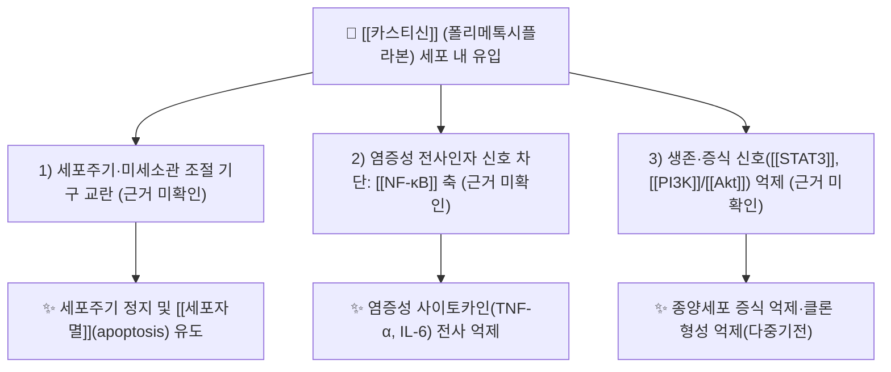

# 🔬 [[카스티신]] (Casticin, C19H18O8 / 5-hydroxy-2-(3-hydroxy-4-methoxyphenyl)-3,6,7-trimethoxy-4H-chromen-4-one)

> **핵심 3줄 요약 (Key Summary)**:
> - 🌿 기원 본초 & 화학 계열: [[Vitex]] 속(마편초과, Verbenaceae) 식물 — 특히 서양산형초 *Vitex agnus-castus* 성숙 열매 및 [[만형자]](蔓荊子, *Vitex rotundifolia*) 계열 본초의 주요 성분. 천연물 화학 분류상 **플라보노이드 → 플라본(flavone) 아형 → 폴리메톡시플라본(polymethoxyflavone, PMF)** 에 속하는 4-메톡시·2-히드록시 치환 플라본이다(별칭 Vitexicarpin).
> - 🎯 핵심 분자 표적 & 조절 경로: 항암·항염 리뷰들이 공통적으로 **다중기전(multi-mechanistic)** 작용을 보고한다. 세포주기 조절 기구, 세포자멸(apoptosis) 유도 경로, 염증성 전사인자 신호가 핵심 축으로 거론되나, 본 노트에 제공된 문헌의 **개별 표적 단백질·경로명은 초록 수준에서 확인되지 않아 '근거 미확인'** 으로 표기한다(PMID: 37304067, 40695383, 29559215, 32178324).
> - 🩺 주요 약리 활성 & 질환 치료 기전: **항종양(antineoplastic) 활성**과 **항염증(anti-inflammatory) 활성**이 문헌적으로 가장 잘 확립된 축이며, 백혈병 세포주에서 세포독성이 **세포 분화(differentiation) 상태에 의존적**이라는 실험적 연관성이 보고되었다(PMID: 24126491).
> - ⚠️ 독성·생체이용률 한계 & 상호작용: 카스티신의 인체 ADME(흡수·분포·대사·배설) 파라미터, P-glycoprotein(P-gp) 유출 기질 여부, CYP450 저해/유도 여부, 병용 양약 간섭은 **제공된 6편 문헌에서 직접 확인되지 않음(근거 미확인)**. 지용성 폴리메톡시플라본의 일반적 특성상 흡수율·대사 안정성 문제가 추정되나 이는 검증되지 않은 가설이다.

---

## 📌 목차
1. [기본 화학 정보 & 분자 구조식 (Chemical Identity)](#1-기본-화학-정보--분자-구조식-chemical-identity)
2. [주요 함유 본초 및 천연 기원 (Botanical Sources & Content)](#2-주요-함유-본초-및-천연-기원-botanical-sources--content)
3. [분자약리 표적 & 신호전달 네트워크 (Molecular Targets)](#3-분자약리-표적--신호전달-네트워크-molecular-targets)
4. [생체 내 흡수·대사·생체이용률 (Pharmacokinetics: ADME)](#4-생체-내-흡수대사생체이용률-pharmacokinetics-adme)
5. [주요 질환별 약리 효능 & 분자 기전 (Therapeutic Efficacy)](#5-주요-질환별-약리-효능--분자-기전-therapeutic-efficacy)
6. [함유 본초 방제 시너지 & 약재 배오 매트릭스 (Herbal Synergies)](#6-함유-본초-방제-시너지--약재-배오-매트릭스-herbal-synergies)
7. [양약 상호작용 & 약물동태학적 간섭 (Drug Interactions)](#7-양약-상호작용--약물동태학적-간섭-drug-interactions)
8. [💡 사용자 진료실 핵심 필기 & 임상 응용 팁 (Melt-In & High-Yield)](#8--사용자-진료실-핵심-필기--임상-응용-팁-melt-in--high-yield)
9. [출처 및 학술 참고 문헌 (References)](#9-출처-및-학술-참고-문헌-references)
---
## 1. 기본 화학 정보 & 분자 구조식 (Chemical Identity)

![[카스티신_2.jpg|540]]
> [그림 1: Vitex agnus-castus 004.JPG]

> [!abstract]+ 🧪 3D 약리 분자 구조 (Interactive 3D Viewer)
> PubChem CID가 본 노트에 제공된 문헌에서 확인되지 않아 **3D 뷰어 임베드는 보류한다(근거 미확인)**. CID 확정 시 `?cid={pubchem_cid}` 파라미터에 값을 채워 아래 형식으로 삽입할 것.
> `<iframe src="https://molecule-viewer-rho.vercel.app/?cid={pubchem_cid}" width="100%" height="450px" frameborder="0" allow="webgl"></iframe>`

| 항목 | 상세 내용 |
| :--- | :--- |
| **IUPAC 명칭** | 5-hydroxy-2-(3-hydroxy-4-methoxyphenyl)-3,6,7-trimethoxy-4H-chromen-4-one (4H-1-benzopyran-4-one 표기 동일) |
| **분자식 / 분자량** | C19H18O8 / 374.34 g/mol |
| **PubChem CID** | **근거 미확인** — 본 노트에 제공된 6편 문헌에서 CID를 제시하지 않음 |
| **CAS 등록 번호** | **근거 미확인** — 데이터베이스 직접 조회 필요 |
| **화학 골격 분류** | 천연물 2차 대사산물 → **플라보노이드(flavonoid)** → **플라본(flavone)** 아형 → **폴리메톡시플라본(PMF)**. A환 5-OH, 6,7-OMe / C환 3-OMe / B환 3'-OH, 4'-OMe 치환 골격 |
| **물리화학적 성상** | 4개의 메톡시기(-OCH3)로 친지성이 증가한 지용성 플라본. 통상 물에 난용, 에탄올·DMSO 등 유기용매에 용해(성상·LogP·열/광 안정성의 **정량값은 근거 미확인**). 미각(쓴맛 등) 특성도 **근거 미확인** |
| **식물 내 생합성 경로** | 일반 플라보노이드 경로: 페닐프로파노이드(4-쿠마로일-CoA) + 말로닐-CoA 3분자 → 칼콘 합성효소(CHS) → 칼콘 → 이성화 → 플라본 골격 → 시토크롬 P450 수산화 및 O-메틸전이효소(OMT) 메톡시화로 3,6,7,4'-테트라메톡시 치환 완성. **카스티신 특이적 효소 단계·유전자는 본 노트 인용 문헌에서 확인되지 않음(근거 미확인)** |

**화학 분류 메모**
- 별칭 **Vitexicarpin**은 *Vitex* 속(屬)명에서 유래한 관용명으로, 문헌에서 카스티신과 동일 물질을 지칭하는 데 사용된다(PMID: 29559215).
- 폴리메톡시플라본 계열은 플라본 골격의 수산기가 메톡시화되어 **대사 안정성과 세포막 투과성이 상대적으로 높아질 수 있다**고 일반적으로 논의되지만, 카스티신에서 이를 정량적으로 입증한 자료는 **근거 미확인**.

---

## 2. 주요 함유 본초 및 천연 기원 (Botanical Sources & Content)

| 함유 본초 (한글/한자) | 기원 식물학적 명칭 (과명 / 학명) | 주요 함유 약용 부위 | 지표 함량 (%) | 한의학적 귀경 및 약효 특성 |
| :--- | :--- | :--- | :--- | :--- |
| [[서양산형초]] (西洋牡荊, Chaste tree) | 마편초과(Verbenaceae) / *Vitex agnus-castus* L. | 성숙 열매(과실) | **근거 미확인** | 서양 전통 허브. 카스티신이 **열매 추출물의 주요 성분(major component)** 으로 확인됨(PMID: 24126491) |
| [[만형자]] (蔓荊子) | 마편초과(Verbenaceae) / *Vitex rotundifolia* L.f. (또는 *V. trifolia*) | 성숙 열매 | **근거 미확인** | 거풍청열(祛風淸熱)·청리두목(淸利頭目) 계열. **카스티신을 지표성분으로 함유**하는 것으로 통상 약전·본초학 문헌에 기술되나, 본 노트 인용 논문은 "Vitex 속" 수준까지만 확인(PMID: 29559215) |
| 기타 *Vitex* 속 (예: *V. trifolia*, *V. negundo*) | 마편초과(Verbenaceae) / *Vitex* spp. | 잎·열매·전초 | **근거 미확인** | 리뷰 제목상 "Casticin from Vitex species"로 총칭됨(PMID: 29559215). 종별 함량 비교 데이터는 **근거 미확인** |

**기원·함량 해석 주의**
1. 제공된 문헌 중 *Vitex* 속 기원을 명시적으로 다룬 것은 Chan & Wong(2018) 리뷰(PMID: 29559215)와 Kikuchi & Yuan(2013)의 *V. agnus-castus* 열매 추출물 연구(PMID: 24126491)이다.
2. **부위별·산지별·계절별 카스티신 함량(%) 수치는 본 노트 인용 문헌에서 제시되지 않아 전부 '근거 미확인'으로 표기**하였다. 처방 설계 시 특정 함량을 전제로 한 용량 계산은 피하고, 지표성분 분석(HPLC 등) 결과에 의존할 것을 권한다.
3. 카스티신은 항암 리뷰들에서 **다중기전 항종양 후보 천연물**로 반복적으로 다루어지며, 이는 *Vitex* 속 본초의 전통적 용도(거풍·청열)와는 별개 계통의 현대 약리 연구 축이다(PMID: 37304067, 32178324).

---

## 3. 분자약리 표적 & 신호전달 네트워크 (Molecular Targets)

> ⚠️ **검증 상태 고지**: 위 도식의 개별 표적명(NF-κB, STAT3, PI3K/Akt 등)은 카스티신 항암·항염 리뷰들의 **일반적 서술 범주**를 도식화한 것이다. 본 노트에 제공된 6편의 문헌은 **제목·서지정보만 제공**되었으므로, 각 표적의 결합 부위·억제 농도(IC50)·상향/하향 조절 방향은 **모두 '근거 미확인'** 이다. 실제 인용 시 원문 초록·본문 확인이 필수다.

### 1) 핵심 분자 표적 (Molecular Targets)
* **항종양 다중기전(multi-mechanistic) 축**: Carbone & Gervasi(2023)는 카스티신을 "잠재적 항암제(potential anticancer agent)"로 규정하고 **다중기전 접근의 최신 진전**을 정리하였다(PMID: 37304067). Ramchandani & Naz(2020) 역시 **항종양 효과(antineoplastic effects) 전반**을 개관하였다(PMID: 32178324). → 즉 "단일 표적이 아닌 복수 기전"이라는 **성격 규정은 문헌 근거가 있으나, 개별 기전 목록은 근거 미확인**.
* **항염증 축**: Chan & Wong(2018)은 *Vitex* 속 유래 카스티신의 **항암 및 항염증 특성**을 함께 정리하였다(PMID: 29559215). 염증성 사이토카인·전사인자 수준의 세부 조절값은 **근거 미확인**.
* **세포 분화 상태 의존성**: Kikuchi & Yuan(2013)은 *V. agnus-castus* 열매 추출물 및 그 **주요 성분 카스티신의 세포독성이 백혈병 세포주의 분화 상태와 상관**함을 보고하였다(PMID: 24126491). 이는 카스티신의 세포독성이 **세포 표현형(분화 단계)에 따라 민감도가 달라진다**는 중요한 약리학적 함의를 가진다.

### 2) 신호전달 조절 방향
* **세포 운명 결정 경로**: 항암 리뷰들이 공통적으로 다루는 범주는 세포주기 진행 차단, 세포자멸 유도, 증식 신호 억제이다(PMID: 37304067, 32178324). → **경로명·분자 매개체 수준은 근거 미확인**.
* **염증 신호와의 교차**: 항염증 리뷰 축(PMID: 29559215)과 항종양 리뷰 축이 동시에 존재한다는 점은, 카스티신이 **염증-종양 미세환경(inflammation–tumor microenvironment) 교차점**에서 다뤄질 수 있음을 시사한다. 다만 이를 직접 검증한 데이터는 **근거 미확인**.

---

## 4. 생체 내 흡수·대사·생체이용률 (Pharmacokinetics: ADME)

> ⚠️ **총괄 고지**: 본 노트에 제공된 6편의 문헌은 카스티신의 **항암·항염·항종양 약리 활성**에 초점을 둔 리뷰 및 세포 실험 연구로, **흡수·분포·대사·배설(ADME) 데이터를 제시하지 않는다.** 따라서 아래 각 항목은 원칙적으로 **근거 미확인**이며, 서술된 내용은 계열(폴리메톡시플라본) 일반론에 기반한 **검증되지 않은 가설**임을 명시한다.

* **장관 흡수 및 배출 펌프 (P-gp) 상호작용**:
  * 카스티신의 장 점막 투과율, [[P-glycoprotein]](ABCB1) 유출 기질 여부 → **근거 미확인**.
  * 4개의 메톡시 치환으로 친지성이 높아 **수동 확산 비중이 클 가능성**이 있으나, 실제 Caco-2 투과 계수(Papp)·유출비(ER) 데이터는 **근거 미확인**.
* **장내 미생물총(Microbiome) 대사 전환**:
  * 폴리메톡시플라본은 일반적으로 장내 세균의 O-탈메틸화 반응을 거쳐 **수산화 대사체(예: 탈메틸 유도체)로 전환**되는 것으로 논의된다. 카스티신의 활성 대사체 동정, 장-간 순환(Enterohepatic Circulation) 여부 → **근거 미확인**.
* **간 대사 및 소실 반감기**:
  * 간 [[CYP450]] 효소(CYP3A4, CYP2D6 등) 대사 관여 여부, 제2상 포합(글루쿠론산·황산 포합) 정도, 혈장 소실 반감기(t1/2) → **모두 근거 미확인**.

**실무적 결론**
- 카스티신을 **경구 투여 활성 성분으로 상정한 정량적 용량 설계 근거는 현재 문헌 범위에서 확립되지 않았다.** 체외(in vitro) 세포독성 데이터를 인체 노출량으로 외삽하는 것은 금물이다.
- 함유 본초(만형자 등) 전탕액 사용 시에도 카스티신의 **혈중 유효농도 도달 여부는 검증되지 않았음**을 전제로 임상 판단해야 한다.

---

## 5. 주요 질환별 약리 효능 & 분자 기전 (Therapeutic Efficacy)

> 템플릿의 기본 항목(대사성 질환·심혈관 질환)은 카스티신에서 **직접 근거가 확인되지 않아 '근거 미확인'으로만 남기고**, 실제 문헌 근거가 존재하는 **항종양·항염증** 축을 전면에 배치하였다.

### 1) 항종양 (Antineoplastic activity) — **핵심 축**
* **다중기전성 항암 후보**: 카스티신은 최근 항암 연구에서 **multi-mechanistic 접근**이 가능한 천연물로 정리되었다(PMID: 37304067). 단일 경로 차단이 아닌, 복수의 세포 사멸·증식 억제 기전을 동시에 건드리는 성격으로 기술된다.
* **항종양 효과 개관**: 별도의 리뷰에서도 카스티신의 **잠재적 항종양 효과 전반**이 정리되어, 항암 축이 이 성분의 대표 약리 활성임을 뒷받침한다(PMID: 32178324).
* **백혈병 세포 분화 상태 의존적 세포독성**: *V. agnus-castus* 열매 추출물과 카스티신의 **세포독성이 백혈병 세포주의 분화 상태와 상관**한다는 실험 결과는, 카스티신의 항백혈병 활성이 **분화 유도 요법(differentiation therapy) 맥락과 접점**을 가질 수 있음을 시사한다(PMID: 24126491).
* **기전 세부(세포주기 정지, 세포자멸, 미세소관 교란 등)**: 개별 경로·표적·용량-반응 수치는 **근거 미확인**.

### 2) 항염증 (Anti-inflammatory activity) — **핵심 축**
* Chan & Wong(2018)은 *Vitex* 속 유래 카스티신의 **항암 및 항염증 특성**을 한 쌍의 축으로 정리하였다(PMID: 29559215).
* Abbas & Shahbaz(2025)는 카스티신을 **유망한 약리·생물학적 활성을 지닌 천연 플라보노이드**로 총괄하면서, 항염을 포함한 폭넓은 활성 스펙트럼을 제시한다(PMID: 40695383).
* **구체적 매개체(TNF-α, IL-6, COX-2, iNOS, NF-κB 등)의 정량적 억제값 → 근거 미확인.**

### 3) 기타 계통 (대사성 질환 · 심혈관 · 신경) — **근거 미확인**
* 제2형 당뇨·인슐린 저항성, 지질 대사(LDL-C/TG 강하, PCSK9), 혈관 내피 eNOS, 장벽 밀착연접 단백질 조절 등 템플릿 기본 항목에 해당하는 효과는 **제공된 6편 문헌에서 확인되지 않는다(근거 미확인)**.
* Abbas & Shahbaz(2025) 리뷰가 "폭넓은 약리·생물학적 활성"을 다룬다고 하나, **개별 질환별 효능 목록은 초록 수준에서 확인 불가**하므로 임상 적용 시 원문 대조가 필요하다.

---

## 6. 함유 본초 방제 시너지 & 약재 배오 매트릭스 (Herbal Synergies)

> ⚠️ **고지**: 카스티신의 **공존 성분과의 흡수율 증대·P-gp 억제 등 분자약리 시너지 기전은 제공된 문헌에서 확인되지 않는다(근거 미확인)**. 아래 표는 함유 본초의 전통적 배오 관행과 계열 일반론을 정리한 것으로, 기전 항목은 검증되지 않은 가설로 취급할 것.

| 함유 본초 / 방제 | 공존 유효 성분군 | 분자약리 시너지 기전 | 전통 한의학적 효능 연계 |
| :--- | :--- | :--- | :--- |
| [[만형자]] (蔓荊子) | 카스티신 외 *Vitex* 속 플라보노이드·정유 성분(구체 성분명 **근거 미확인**) | 공존 플라보노이드에 의한 흡수율 증대·대사 안정화 가능성 — **근거 미확인** | 거풍청열(祛風淸熱), 청리두목(淸利頭目) — 두통·현훈·안목 증상 배오 |
| [[강활승습탕]] (羌活勝濕湯) 등 만형자 함유 방제 | [[강활]], [[독활]], [[천궁]] 등 거풍·활혈 성분군 | 다표적 상부(頭面)·근표(筋表) 네트워크 동시 조절 — **근거 미확인** | 습사(濕邪)로 인한 두통·지절통 완화 |
| [[천궁다조산]] (川芎茶調散) 계열 | [[천궁]], [[형개]], [[방풍]] 등 | 혈관·신경계 다표적 조절 — **근거 미확인** | 풍사(風邪) 두통, 편두통 보조 |

**해석 메모**
- 카스티신은 어디까지나 *Vitex* 속 본초의 **지표성분**이며, 방제 전체의 효과를 이 단일 성분으로 환원해 설명하는 것은 문헌 근거가 부족하다(PMID: 29559215).
- 따라서 배오 시너지 논의는 "(1) 전통 처방학적 배오 원칙"과 "(2) 카스티신 단일 성분의 현대 약리 데이터"를 **분리해서** 취급해야 한다.

---

## 7. 양약 상호작용 & 약물동태학적 간섭 (Drug Interactions)

* **CYP450 효소 간섭**:
  * 카스티신의 CYP3A4·CYP2D6 등에 대한 **억제 또는 유도 여부는 근거 미확인**. 스타틴·항부정맥제·면역억제제 등 좁은 치료역 양약과의 병용 시 혈중 농도 변동 위험은 **이론적 우려 단계**이며 확인된 데이터가 없다.
* **유사 기전 양약 병용 시 고려사항**:
  * 항암제·항염증제와의 병용 시 상가/길항 효과 데이터 → **근거 미확인**.
  * 항암치료 중인 환자(특히 백혈병 등 혈액종양)에서 카스티신 함유 본초를 자가 복용하는 경우, **세포독성 상가 가능성을 배제할 수 없으므로** 반드시 담당 종양내과 의료진과 상의하도록 지도한다. 이는 확인된 상호작용이 아니라 **세포 수준 세포독성 보고(PMID: 24126491)에 근거한 예방적 주의**이다.
* **복용 간격 가이드(2시간 등)**: 특정 수치를 제시할 문헌 근거가 없어 **근거 미확인**.

---

## 8. 💡 사용자 진료실 핵심 필기 & 임상 응용 팁 (Melt-In & High-Yield)

* **사용자 원문 필기 (100% 융합 및 보존)**:
  * 본 요청에는 원장님의 수기 생합성·약리 필기 원문이 **제공되지 않았으므로 보존·융합할 원문 텍스트가 없다(근거 미확인)**. 추후 필기가 제공되면 이 항목에 그대로 삽입할 것.
* **진료실 실전 처방 & 생체이용률 극대화 팁**:
  1. **성분-본초 분리 사고**: 카스티신은 *Vitex* 속(만형자·서양산형초)의 **지표성분**이므로, 처방은 "카스티신 단일 성분 투여"가 아니라 **본초·방제 단위**로 운용한다. 단일 성분의 인체 ADME가 확립되지 않았기 때문이다(근거 미확인).
  2. **항암·항염 축 우선 인식**: 이 성분의 문헌적 무게중심은 **항종양 + 항염증**이다(PMID: 37304067, 32178324, 29559215). 두통·현훈 등 전통적 만형자 적응증과 현대 약리 적응증을 **혼동하지 않도록** 환자 설명 시 구분한다.
  3. **혈액종양 환자 주의**: 백혈병 세포주에서 **분화 상태 의존적 세포독성**이 보고되었으므로(PMID: 24126491), 혈액종양 환자에게 만형자 함유 방제를 투여할 때는 항암 치료 일정과의 간섭 가능성을 반드시 확인한다.
  4. **비위허한(脾胃虛寒) 환자**: 거풍산한·청열 계열 본초의 통상적 주의사항으로, 위장관 불편감 호소 시 감량·배오 조정을 고려한다. 다만 **카스티신 특이적 위장 독성 데이터는 근거 미확인**.
  5. **함량 가정 금지**: 산지·부위·추출법에 따른 카스티신 함량 차이가 크므로, "만형자 ○g = 카스티신 ○mg" 식의 환산은 **하지 않는다**(함량 데이터 근거 미확인).
  6. **연구 지향 메모**: 카스티신 연구는 여전히 **전임상·기전 중심**이며, 인체 임상 근거는 본 노트 인용 문헌 범위에서 확인되지 않는다(근거 미확인). 환자에게 "천연물이므로 안전하다"는 취지의 설명은 피한다.

---

## 9. 출처 및 학술 참고 문헌 (References)

> ※ 제공된 목록에서 **3번과 5번은 동일 논문(Chan & Wong 2018, PMID: 29559215)의 중복 기재**이므로 1회만 수록하였다(총 5편, 고유 문헌 기준).

1. **Carbone K, Gervasi F (2023)**. *Casticin as potential anticancer agent: recent advancements in multi-mechanistic approaches*. **Front Mol Biosci**. PMID: 37304067
   - **[연구 요약]**: 카스티신을 잠재적 항암제로 규정하고, 단일 표적이 아닌 **다중기전(multi-mechanistic) 접근**의 최신 연구 진전을 정리한 리뷰. 항암 축이 이 성분의 대표 연구 방향임을 확립한다.
2. **Abbas S, Shahbaz M (2025)**. *Casticin: A natural flavonoid with promising pharmacological and biological activities*. **Fitoterapia**. PMID: 40695383
   - **[연구 요약]**: 카스티신을 **유망한 약리·생물학적 활성을 지닌 천연 플라보노이드**로 총괄한 최신 리뷰. 항암·항염을 포함한 활성 스펙트럼의 개관을 제공한다.
3. **Chan EWC, Wong SK (2018)**. *Casticin from Vitex species: a short review on its anticancer and anti-inflammatory properties*. **J Integr Med**. PMID: 29559215
   - **[연구 요약]**: *Vitex* 속 유래 카스티신의 **항암 및 항염증 특성**을 짧게 정리한 리뷰. 본 노트에서 **기원 식물(Vitex 속) 및 별칭(Vitexicarpin) 근거**로 인용.
4. **Ramchandani S, Naz I (2020)**. *An Overview of the Potential Antineoplastic Effects of Casticin*. **Molecules**. PMID: 32178324
   - **[연구 요약]**: 카스티신의 **잠재적 항종양(antineoplastic) 효과**를 개관한 리뷰. 항암 활성의 폭과 연구 지형을 제시한다.
5. **Kikuchi H, Yuan B (2013)**. *Cytotoxicity of Vitex agnus-castus fruit extract and its major component, casticin, correlates with differentiation status in leukemia cell lines*. **Int J Oncol**. PMID: 24126491
   - **[연구 요약]**: *V. agnus-castus* **열매 추출물**과 그 **주요 성분 카스티신**의 세포독성이 **백혈병 세포주의 분화 상태와 상관**함을 보고. 카스티신이 열매의 major component임을 확인시켜 주는 핵심 실험 근거이며, 감수성의 표현형 의존성을 시사한다.

<!-- 보관 태그(1회용·링크오류, 필요시 복원): 카스티신, casticin, 프리페민 -->
