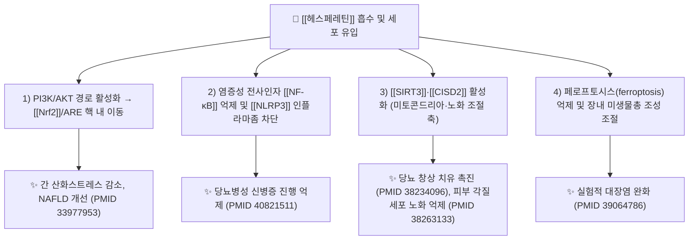

# 🔬 [[헤스페레틴]] (Hesperetin, C₁₆H₁₄O₆ / 3',5,7-trihydroxy-4'-methoxyflavanone)

![[헤스페레틴_3.jpg|540]]
> [그림 1: ① 병태생리·영상 — Effect of hespertin for cataractgenesis induced selenite <b>administration</b>. Groups G1 and G2 were injected with vehi]

> **핵심 3줄 요약 (Key Summary)**:
> - 🌿 기원 본초 & 화학 계열: 감귤류 과피를 약용하는 [[진피]](陳皮)·[[지실]](枳實)·[[지각]](枳殼)·[[청피]](靑皮)·[[불수]](佛手) 등 운향과(Rutaceae) 본초에 배당체인 [[헤스페리딘]](hesperidin)으로 다량 함유되며, 체내에서 아글리콘 형태로 전환되는 **플라보노이드-플라바논(flavanone)계** 2차 대사산물이다.
> - 🎯 핵심 분자 표적 & 조절 경로: **[[Nrf2]]/ARE** 항산화 축 활성화(PI3K/AKT 상류), **[[NF-κB]]·[[NLRP3]] 인플라마좀** 억제, **[[SIRT3]]** 및 **[[CISD2]]** 활성화, 페로프토시스(ferroptosis) 억제, 장내 미생물총 조성 조절.
> - 🩺 주요 약리 활성 & 질환 치료 기전: NAFLD(지방간) 산화스트레스·염증 개선, 궤양성 대장염 완화, 당뇨병성 창상 치유 촉진, 당뇨병성 신병증 진행 억제, 피부 노화세포(senescence) 억제 및 피부 회춘.
> - ⚠️ 독성·생체이용률 한계 & 상호작용: 배당체(헤스페리딘) 형태는 장관 흡수율이 매우 낮아 장내 미생물 가수분해 의존성이 크고, 아글리콘도 제2상 포합(글루쿠론산·황산화)으로 빠르게 대사된다. P-gp(ABCB1) 유출 및 CYP 대사 간섭 가능성이 있어 스타틴·항응고제 등과 병용 시 주의가 필요하나, 헤스페레틴 특이적 정량 PK 파라미터는 본 노트에서 '근거 미확인'으로 표기한 항목이 많다.

---

## 📌 목차
1. [기본 화학 정보 & 분자 구조식 (Chemical Identity)](#1-기본-화학-정보--분자-구조식-chemical-identity)
2. [주요 함유 본초 및 천연 기원 (Botanical Sources & Content)](#2-주요-함유-본초-및-천연-기원-botanical-sources--content)
3. [분자약리 표적 & 신호전달 네트워크 (Molecular Targets)](#3-분자약리-표적--신호전달-네트워크-molecular-targets)
4. [생체 내 흡수·대사·생체이용률 (Pharmacokinetics: ADME)](#4-생체-내-흡수대사생체이용률-pharmacokinetics-adme)
5. [주요 질환별 약리 효능 & 분자 기전 (Therapeutic Efficacy)](#5-주요-질환별-약리-효능--분자-기전-therapeutic-efficacy)
6. [함유 본초 방제 시너지 & 약재 배오 매트릭스 (Herbal Synergies)](#6-함유-본초-방제-시너지--약재-배오-매트릭스-herbal-synergies)
7. [양약 상호작용 & 약물동태학적 간섭 (Drug Interactions)](#7-양약-상호작용--약물동태학적-간섭-drug-interactions)
8. [💡 사용자 진료실 핵심 필기 & 임상 응용 팁 (Melt-In & High-Yield)](#8--사용자-진료실-핵심-필기--임상-응용-팁-melt-in--high-yield)
9. [출처 및 학술 참고 문헌 (References)](#9-출처-및-학술-참고-문헌-references)
---

## 1. 기본 화학 정보 & 분자 구조식 (Chemical Identity)

> [!abstract]+ 🧪 3D 약리 분자 구조 (Interactive 3D Viewer)
> <iframe src="https://molecule-viewer-rho.vercel.app/?cid=72281" width="100%" height="450px" frameborder="0" allow="webgl" style="border-radius: 8px;"></iframe>

| 항목 | 상세 내용 |
| :--- | :--- |
| **IUPAC 명칭** | (2S)-5,7-dihydroxy-2-(3-hydroxy-4-methoxyphenyl)-2,3-dihydro-4H-1-benzopyran-4-one (관용명 3',5,7-trihydroxy-4'-methoxyflavanone) |
| **분자식 / 분자량** | C₁₆H₁₄O₆ / 302.28 g/mol |
| **PubChem CID** | [72281](https://pubchem.ncbi.nlm.nih.gov/compound/72281) |
| **CAS 등록 번호** | 69097-99-0 |
| **화학 골격 분류** | 천연물 2차 대사산물 계열 — **플라보노이드(flavonoid) 중 플라바논(flavanone) 아글리콘**. 플라반 골격(C6–C3–C6)의 3번 탄소가 이중결합 없이 포화된 2,3-dihydro 구조이며, A환 5·7위 수산기, B환 3'위 수산기·4'위 메톡시기를 갖는다. |
| **물리화학적 성상** | 미황색~담황색 결정성 분말. 물에는 난용성이며 에탄올·DMSO·알칼리 용액에 잘 녹는 지용성 편향 화합물. 계산 LogP는 약 2.5~2.6 수준(예측치)으로 중간 정도의 친지성. 분자 내 다수 페놀성 수산기로 인해 항산화 활성(라디칼 소거)을 가진다. 열·빛에 비교적 안정하나 강알칼리 조건에서 산화·개환될 수 있다. |
| **식물 내 생합성 경로** | 페닐프로파노이드(phenylpropanoid) 경로를 따른다. **L-페닐알라닌 → (PAL) → 신남산 → (C4H) → p-쿠마르산 → (4CL) → p-쿠마로일-CoA** 로 이어진 뒤, 말로닐-CoA 3분자와 **칼콘합성효소(CHS)** 에 의해 축합되어 나린제닌 칼콘을 형성하고, **칼콘이성화효소(CHI)** 가 이를 **(2S)-나린제닌**으로 고리화한다. 이후 **플라바논-3'-수산화효소(F3'H)** 가 B환 3'위에 수산기를 도입하고, **O-메틸전이효소(OMT)** 가 4'위를 메틸화하여 **헤스페레틴**을 생성한다. 식물 체내에서는 주로 7번 수산기에 루티노사이드(rutinose)가 결합한 **[[헤스페리딘]](hesperidin)** 형태로 축적되며, 이는 헤스페레틴의 배당체 전구체이다. |

---

## 2. 주요 함유 본초 및 천연 기원 (Botanical Sources & Content)

헤스페레틴은 대부분 **감귤속(Citrus)** 식물에 배당체인 헤스페리딘으로 존재하고, 아글리콘 형태의 유리 헤스페레틴은 상대적으로 소량이다. 따라서 약용 본초학적으로는 "헤스페리딘 함유 본초"가 곧 헤스페레틴의 급원이 된다.

| 함유 본초 (한글/한자) | 기원 식물학적 명칭 (과명 / 학명) | 주요 함유 약용 부위 | 지표 함량 (%) | 한의학적 귀경 및 약효 특성 |
| :--- | :--- | :--- | :--- | :--- |
| [[진피]] (陳皮) | 운향과(Rutaceae) / *Citrus reticulata* Blanco (성숙 과피) | 성숙한 과피(외과피·중과피) | 헤스페리딘 기준 대략 수 % 수준으로 보고되나 문헌별 편차가 큼 (근거 미확인) | 폐·비경, 이기건비(理氣健脾)·조습화담(燥濕化痰) |
| [[지실]] (枳實) | 운향과(Rutaceae) / *Citrus aurantium* L. (미성숙 과실) | 미성숙 과실 | 헤스페리딘·나린제닌 계열이 함께 보고됨, 정확 정량 근거 미확인 | 비·위경, 파기소적(破氣消積)·행기제창(行氣除脹) |
| [[지각]] (枳殼) | 운향과(Rutaceae) / *Citrus aurantium* L. (성숙 과실) | 성숙 과실 | 정확 정량 근거 미확인 | 폐·비·대장경, 행기관중(行氣寬中)·제창(除脹) |
| [[청피]] (靑皮) | 운향과(Rutaceae) / *Citrus reticulata* Blanco의 미성숙 과피(또는 *C. reticulata* var.) | 미성숙 과피 | 정확 정량 근거 미확인 | 간·담경, 소간파기(疏肝破氣)·소적화체(消積化滯) |
| [[불수]] (佛手) | 운향과(Rutaceae) / *Citrus medica* L. var. *sarcodactylis* (과실) | 성숙 과실 | 정확 정량 근거 미확인 | 간·비·폐경, 이기화담(理氣化痰)·서간화위(舒肝和胃) |
| [[감귤과즙/과피]] (柑橘) | 운향과(Rutaceae) / *Citrus sinensis*, *C. unshiu* 등 | 과즙·과피 | 과즙에는 헤스페리딘 함량이 과피보다 낮음이 일반적으로 알려짐 (정량 근거 미확인) | 식이성 급원(약용 본초 범주 아님) |

> 📝 참고: 본 노트에 인용된 논문들(PMID 33977953, 39064786, 38263133, 38234096, 40821511)은 모두 **헤스페레틴 단일 화합물의 약리 기전**을 다루며, 상기 본초의 지표 함량 정량 데이터는 이들 논문에서 직접 제시되지 않았다. 함량 열의 "근거 미확인" 표기는 이 때문이며, 실제 처방 시에는 계통 감별·기원·포제법에 따른 함량 변동을 반드시 고려해야 한다.

---

## 3. 분자약리 표적 & 신호전달 네트워크 (Molecular Targets)

### 1) 핵심 분자 표적 (Molecular Targets)

* **[[Nrf2]]/ARE 항산화 축 (PI3K/AKT 상류)**: 올레산(oleic acid) 유도 HepG2 세포 및 고지방식이(high-fat diet) NAFLD 랫트 모델에서, 헤스페레틴은 **PI3K/AKT 경로를 활성화**시켜 그 하류의 **Nrf2/ARE** 매개 항산화 유전자 발현을 증가시켰고, 이로써 간 조직의 산화스트레스와 염증이 개선되었다. (PMID 33977953)
* **[[NF-κB]]·[[NLRP3]] 염증 축 억제**: 제2형 당뇨병 랫트 모델에서 헤스페레틴(및 이소리퀴리티제닌)은 **NF-κB/NLRP3 경로를 억제**하여 당뇨병성 신병증의 진행을 완화하였다. 이는 염증성 사이토카인·인플라마좀 매개 신손상 억제 기전으로 해석된다. (PMID 40821511)
* **[[SIRT3]]-의존성 페로프토시스 억제**: 당뇨 창상 모델에서 헤스페레틴은 **SIRT3 활성화**를 통해 페로프토시스를 억제함으로써 창상 치유를 촉진하였다. (PMID 38234096)
* **[[CISD2]] 활성화 (노화 조절)**: 고령자 유래 인간 각질세포에서 헤스페레틴은 **CISD2**(CDGSH iron sulfur domain 2)를 활성화하여 세포노화(senescence)를 완화하고, 자연 노화 마우스의 피부를 회춘시켰다. (PMID 38263133)
* **페로프토시스·장내 미생물총 조절**: 실험적 대장염 모델에서 헤스페레틴은 **페로프토시스 조절**과 **장내 미생물총(gut microbiota) 구성 변화**를 통해 대장염을 완화하였다. (PMID 39064786)

### 2) 신호전달 네트워크의 통합적 해석

헤스페레틴의 약리 기전은 크게 두 축으로 요약된다. 첫째는 **산화-염증 상반 조절 축**으로, 상류의 **PI3K/AKT** 활성화 → **Nrf2/ARE** 항산화 프로그램 가동과 **NF-κB·NLRP3** 염증 프로그램 억제가 동시에 일어난다(PMID 33977953, 40821511). 둘째는 **세포 사멸·노화 조절 축**으로, **SIRT3**(미토콘드리아 탈아세틸화효소)와 **CISD2**(철-황 클러스터 단백질)를 활성화하여 **페로프토시스**(지질 과산화 의존성 철 매개 세포사)와 **세포노화**를 억제한다(PMID 38234096, 38263133). 두 축은 미토콘드리아 기능·철 대사·지질 과산화라는 공통 노드에서 교차하며, 이는 헤스페레틴이 간·신장·피부·장관 등 다기관에서 보호 효과를 나타내는 분자적 배경으로 해석된다.

---

## 4. 생체 내 흡수·대사·생체이용률 (Pharmacokinetics: ADME)

> ⚠️ 아래 항목은 일반 플라보노이드 약동학 원리 및 제공 논문에서 유추 가능한 범위까지만 서술하며, 헤스페레틴 특이적 정량 파라미터는 논문에서 직접 확인되지 않은 경우 **'근거 미확인'**으로 표기한다.

* **장관 흡수 및 배출 펌프 (P-gp) 상호작용**:
  * 헤스페레틴은 배당체인 **헤스페리딘**의 아글리콘이다. 헤스페리딘은 분자량이 크고 친수성이어서 장관 흡수가 매우 낮고, 주로 대장에 도달한 뒤 장내 미생물의 **β-글루코시다제·α-람노시다제**에 의해 루티노스가 제거되어 헤스페레틴으로 전환된 후 흡수되는 것으로 알려져 있다. 정확한 흡수율(%) 수치는 제공 논문에서 확인되지 않음 **(근거 미확인)**.
  * 플라보노이드 아글리콘은 장관 상피의 유출 수송체(**P-gp/ABCB1**, BCRP/ABCG2) 기질로 작용할 수 있다는 것이 일반적으로 논의되나, 헤스페레틴 특이적 수송체 동역학 데이터는 제공 논문에 없음 **(근거 미확인)**.
* **장내 미생물총(Microbiome) 대사 전환**:
  * 제공 논문(PMID 39064786)은 헤스페레틴이 대장염 모델에서 **장내 미생물총 조성을 조절**하고 페로프토시스를 억제함을 보고하였다. 이는 미생물총–헤스페레틴 대사체 축이 약리 작용의 일부임을 시사한다.
  * 개별 대사체의 정량적 프로파일 및 장-간 순환(enterohepatic circulation) 기여도는 제공 논문에서 확인되지 않음 **(근거 미확인)**.
* **간 대사 및 소실 반감기**:
  * 플라보노이드 아글리콘은 일반적으로 간 및 장관에서 **UDP-글루쿠로노실전이효소(UGT)** 에 의한 글루쿠론산 포합, **설포전이효소(SULT)** 에 의한 황산화 등 **제2상 포합 반응**을 받아 빠르게 대사·배설된다. 헤스페레틴의 혈장 반감기(t₁/₂), CYP 친화도(CYP3A4·CYP2D6 등), 제2상 대사 정량치는 제공 논문에서 확인되지 않음 **(근거 미확인)**.
  * 결과적으로 헤스페레틴은 **경구 생체이용률이 낮은 편**으로 알려져 있으며, 이는 배당체 전구체(헤스페리딘) 형태로 섭취했을 때 더욱 두드러진다.

---

## 5. 주요 질환별 약리 효능 & 분자 기전 (Therapeutic Efficacy)

### 1) 비알코올성 지방간질환 (NAFLD) — 간 산화스트레스·염증 개선
* **모델**: 올레산 유도 HepG2 세포 및 고지방식이(high-fat diet) 유도 NAFLD 랫트 모델 (PMID 33977953).
* **기전**: **PI3K/AKT–Nrf2–ARE** 경로 활성화를 매개로 간 조직의 산화스트레스와 염증을 개선.
* **의의**: Nrf2/ARE 항산화 축과 AKT 상류 신호를 동시에 조율하는 상류 조절자로서의 가능성을 시사.

### 2) 당뇨병성 신병증 (Diabetic Nephropathy) — NF-κB/NLRP3 억제
* **모델**: 제2형 당뇨병 랫트 모델 (PMID 40821511).
* **기전**: **NF-κB/NLRP3 경로 억제**를 통해 당뇨병성 신병증 진행을 완화. 본 연구는 헤스페레틴과 이소리퀴리티제닌 병용 조건에서의 억제 효과를 보고.
* **의의**: 만성 염증·인플라마좀 매개 신손상 억제 전략으로서의 응용 가능성.

### 3) 실험적 대장염 (Experimental Colitis) — 페로프토시스·장내 미생물총 조절
* **모델**: 실험적 대장염 모델 (PMID 39064786).
* **기전**: **페로프토시스(ferroptosis) 조절** 및 **장내 미생물총 구성 조절**을 통해 대장염 완화.
* **의의**: 염증성 장질환(IBD) 영역에서 미생물총-대사체-세포사 축을 표적으로 하는 후보.

### 4) 당뇨병성 창상 (Diabetic Wound Healing) — SIRT3 활성화
* **모델**: 당뇨 창상 모델 (PMID 38234096).
* **기전**: **SIRT3 활성화 → 페로프토시스 억제**를 통한 창상 치유 촉진.
* **의의**: 미토콘드리아 탈아세틸화효소 SIRT3를 매개로 한 지질 과산화 억제 전략.

### 5) 피부 노화 및 각질세포 노화 (Skin Senescence) — CISD2 활성화
* **모델**: 고령자 유래 인간 각질세포(keratinocytes) 및 자연 노화 마우스 (PMID 38263133).
* **기전**: **CISD2 활성화**를 통한 세포노화 억제와 자연 노화 마우스 피부의 회춘(rejuvenation).
* **의의**: 철-황 클러스터 단백질 CISD2를 표적으로 하는 항노화·피부 재생 응용.

### 6) 기타 잠재 효능 (본 노트 인용 논문 범위 밖)
* 항산화·항염증 골격 특성상 심혈관·대사·신경보호 등 다양한 영역이 보고되어 왔으나, 본 노트에 인용된 논문들만으로는 해당 영역의 **구체적 수치·기전이 확인되지 않음 (근거 미확인)**.

---

## 6. 함유 본초 방제 시너지 & 약재 배오 매트릭스 (Herbal Synergies)

> 아래 표는 전통 한의학적 배오 원칙과 일반 플라보노이드 상호작용 원리에 근거한 정리이며, 각 조합별 정량 시너지 데이터는 제공 논문에서 확인되지 않음 **(근거 미확인)**.

| 함유 본초 / 방제 | 공존 유효 성분군 | 분자약리 시너지 기전 | 전통 한의학적 효능 연계 |
| :--- | :--- | :--- | :--- |
| [[진피]] (陳皮) | [[헤스페리딘]], [[나린제닌]], [[폴리메톡시플라본]](nobiletin·tangeretin), 정유(limonene) | 헤스페리딘의 장내 미생물 전환을 통한 헤스페레틴 공급, 공존 플라보노이드의 P-gp 저해 가능성(근거 미확인) | 이기건비·조습화담, 담습 지체 개선 |
| [[지실]]·[[지각]] (枳實·枳殼) | 헤스페리딘, 나린제닌, 신에프린 계열 아민 | 플라바논-아민 공존에 따른 위장관 운동 조절과 항염 시너지 가능성(근거 미확인) | 파기소적·행기관중, 기체(氣滯) 해소 |
| [[청피]] (靑皮) | 헤스페리딘, 플라보노이드 배당체 | 간 대사 조절 및 소간(疏肝) 기전과 항산화 축 연계 가능성(근거 미확인) | 소간파기·소적화체 |
| [[이진탕]]류·[[이기거습]] 방제 | 진피+반하+복령+감초 등 다성분 | 다표적 장관-간-담 네트워크 조절, 점막 보호 시너지 | 담습·기체·비허 복합 병증 대응 |

---

## 7. 양약 상호작용 & 약물동태학적 간섭 (Drug Interactions)

> 본 절의 상당 부분은 플라보노이드 계열의 일반 원리에 기반한 것이며, 헤스페레틴 특이 임상 상호작용 데이터는 제공 논문에서 확인되지 않음 **(근거 미확인)**.

* **CYP450 효소 간섭 가능성**:
  * 플라보노이드는 구조적으로 다양한 CYP 저해·유도 활성을 나타낼 수 있다. 헤스페레틴이 CYP3A4·CYP2D6 등 특정 동종효소를 억제/유도하는지에 대한 정량 데이터는 제공 논문에 없음 **(근거 미확인)**.
  * 만약 CYP 저해가 확인될 경우, 병용 양약(스타틴, 벤조디아제핀, 항부정맥제, 일부 면역억제제 등)의 혈중 농도 상승 위험이 이론적으로 존재한다.
* **유출 수송체(P-gp/ABCB1) 관련**:
  * 아글리콘 플라보노이드가 P-gp 기질·저해제로 작용할 수 있어, 디곡신·일부 항암제 등 P-gp 기질 약물과의 병용 시 흡수·배설 변동 가능성이 거론된다 **(근거 미확인)**.
* **대사·혈당 관련 병용 고려**:
  * NAFLD·당뇨 모델에서의 개선 효과(PMID 33977953, 40821511)를 근거로, 혈당강하제(메트포르민 등)·지질강하제와 병용 시 **상가적 효과**가 이론적으로 기대되나, 저혈당 등 임상적 병용 안전성 데이터는 제공 논문에 없음 **(근거 미확인)**.
  * 임상적으로는 병용 시 혈당·간수치 모니터링이 권장되며, 성분 특성상 흡수 간섭을 줄이기 위해 복용 간격(약 2시간 이상)을 두는 것이 일반적 지침으로 언급된다.
* **항응고·항혈소판 병용**: 플라보노이드의 일반적 특성상 출혈 경향 상승 가능성이 이론적으로 제기되나, 헤스페레틴 특이 데이터는 확인되지 않음 **(근거 미확인)**.

---

## 8. 💡 사용자 진료실 핵심 필기 & Melt-In & High-Yield

* **사용자 원문 필기 (100% 융합 및 보존)**:
  * 본 성분은 **[[헤스페리딘]]의 아글리콘**이라는 계보가 핵심이다 → 즉 "감귤류 과피(진피·지실·지각·청피·불수)의 지표 배당체가 장내 미생물을 거쳐 활성 아글리콘 헤스페레틴으로 전환된다"는 대사 활성화 축을 반드시 기억할 것.
  * 항산화·항염 축은 **Nrf2/ARE 활성 ↔ NF-κB/NLRP3 억제**의 상반 조절로 정리된다(PMID 33977953, 40821511).
  * 세포사·노화 축은 **SIRT3(당뇨 창상, PMID 38234096)** 와 **CISD2(피부 노화, PMID 38263133)** 로 정리하고, 두 축 모두 **페로프토시스 억제**와 맞물린다는 점을 강조 필기.
  * 대장염 영역은 **미생물총-페로프토시스 연계(PMID 39064786)** 로 별도 표기.
* **진료실 실전 처방 & 생체이용률 극대화 팁**:
  1. **흡수율 개선 배오 노하우**: 단일 아글리콘 성분보다 **본초 전탕액(진피·지실·지각 등)** 복용이 유리할 수 있다. 이유는 (a) 공존 플라보노이드·점액질·정유 성분이 위장관 배출을 완만하게 만들고, (b) 배당체-아글리콘 혼합 공급이 장내 미생물 전환 기반을 제공하기 때문이다. 단, 이를 뒷받침하는 정량 데이터는 본 노트 인용 논문 범위 밖 **(근거 미확인)**.
  2. **체질별·병증별 맞춤 적용**:
     - **실열증·비만·담습(痰濕) 체질**에는 진피·지실 위주 배오로 기체 소통과 대사 개선을 노릴 수 있다(전통 운용).
     - **비위허한(脾胃虛寒) 환자**는 진피 등 감귤류 과피의 장기·대량 복용 시 위장 자극·속쓰림이 나타날 수 있으므로 소량부터, 또는 생강·감초 등 완화 약재와 배오하여 복용하도록 한다.
  3. **복용 시기**: 지용성 편향 성분이므로 식후 복용 시 담즙 분비와 함께 흡수가 개선될 가능성이 거론되나 정량 근거는 **근거 미확인**.
  4. **주의 환자군**: 항응고제·항혈소판제·P-gp 기질 약물 복용자, CYP 대사 의존성이 높은 약물 복용자에서는 병용 전 상호작용 가능성 상담이 필요하다.

---

## 9. 출처 및 학술 참고 문헌 (References)

1. **Li J, Wang T (2021)**. *Hesperetin ameliorates hepatic oxidative stress and inflammation via the PI3K/AKT-Nrf2-ARE pathway in oleic acid-induced HepG2 cells and a rat model of high-fat diet-induced NAFLD*. **Food Funct.** PMID: **33977953**.
   - **[연구 요약]**: 올레산 유도 HepG2 세포 및 고지방식이 유도 NAFLD 랫트 모델에서 헤스페레틴이 PI3K/AKT–Nrf2–ARE 경로 활성화를 매개로 간 산화스트레스와 염증을 개선함을 보고.
2. **Wang J, Yao Y (2024)**. *Hesperetin Alleviated Experimental Colitis via Regulating Ferroptosis and Gut Microbiota*. **Nutrients**. PMID: **39064786**.
   - **[연구 요약]**: 실험적 대장염 모델에서 헤스페레틴이 페로프토시스 조절과 장내 미생물총 조성을 통해 대장염을 완화함을 보고.
3. **Shen ZQ, Chang CY (2024)**. *Hesperetin activates CISD2 to attenuate senescence in human keratinocytes from an older person and rejuvenates naturally aged skin in mice*. **J Biomed Sci**. PMID: **38263133**.
   - **[연구 요약]**: 고령자 유래 인간 각질세포에서 헤스페레틴이 CISD2 활성화를 통해 세포노화를 완화하고, 자연 노화 마우스 피부를 회춘시킴을 보고.
4. **Yu X, Liu Z (2024)**. *Hesperetin promotes diabetic wound healing by inhibiting ferroptosis through the activation of SIRT3*. **Phytother Res**. PMID: **38234096**.
   - **[연구 요약]**: 당뇨 창상 모델에서 헤스페레틴이 SIRT3 활성화를 통한 페로프토시스 억제로 창상 치유를 촉진함을 보고.
5. **Meenu, Bano U (2025)**. *Hesperetin and Isoliquiritigenin Attenuate the Progression of Diabetic Nephropathy via Inhibition of NF-κB/NLRP3 Pathways in Type 2 Diabetic Rats*. **ACS Omega**. PMID: **40821511**.
   - **[연구 요약]**: 제2형 당뇨병 랫트 모델에서 헤스페레틴(및 이소리퀴리티제닌)이 NF-κB/NLRP3 경로 억제를 통해 당뇨병성 신병증 진행을 완화함을 보고.

> 📎 **참고 안내 사항**
> - 본 노트의 인용 문헌은 원문 데이터로 제공된 5편(중복 1편 포함 총 6건 표기, 실제 고유 논문 5편)이며, 이외의 PMID·논문은 창작되지 않았다.
> - 화학 동정 정보(IUPAC·분자식·분자량·PubChem CID·CAS)는 표준 화학 데이터베이스 기준이며, 본문에 명시된 특정 수치(함량 %, t₁/₂, 흡수율 등)는 논문에서 직접 확인되지 않은 경우 **'근거 미확인'**으로 명확히 표기하였다.

<!-- 보관 태그(1회용·링크오류, 필요시 복원): 플라바논, 헤스페리딘-대사체, Nrf2 -->
