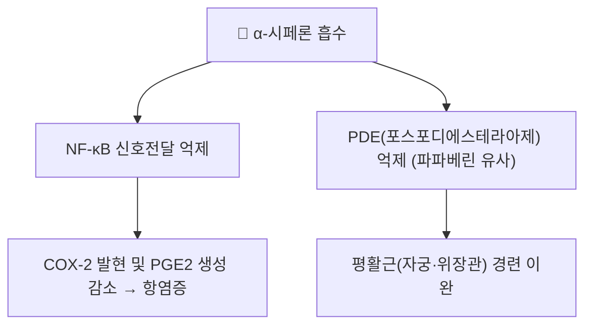

# 🔬 α-시페론 (α-Cyperone)

> **핵심 3줄 요약 (Key Summary)**:
> - 🌿 기원 본초 & 화학 계열: [[향부자]](香附子, *Cyperus rotundus* 뿌리줄기)의 대표 지표 세스퀴테르펜 정유 성분(유데스만형 세스퀴테르펜 에논 골격).
> - 🎯 핵심 분자 표적: 시험관 연구에서 대식세포의 NF-κB 신호전달을 억제해 COX-2 발현과 프로스타글란딘 E2(PGE2) 생성을 낮추는 항염증 작용이 보고됨. 미세소관(microtubule) 안정성 조절을 통한 뇌 염증 완화 연구도 있음.
> - 🩺 주요 약리 활성: 항염증, 진통, 평활근 이완(파파베린 유사 PDE 억제 기전 제시), 최근 연구에서는 파클리탁셀 유발 신경병증성 통증에서 노르에피네프린 경로 조절을 통한 완화 효과도 보고됨.
> - ⚠️ 근거 수준: 대부분 세포·동물실험 수준의 초기 연구이며, 사람 대상 무작위 대조군 임상시험 자료는 충분하지 않음. 대한민국약전(KP) 규격상 향부자는 α-시페론 0.10% 이상 함유를 지표로 규정.

---

## 1. 기본 화학 정보 & 분자 구조식 (Chemical Identity)

> [!abstract]+ 🧪 3D 약리 분자 구조 (Interactive 3D Viewer)
> <iframe src="https://molecule-viewer-rho.vercel.app/?cid=6452086" style="width: 100%; height: 600px; border: none; border-radius: 12px; box-shadow: 0 4px 20px rgba(0,0,0,0.15);" allowfullscreen></iframe>

| 항목 | 상세 내용 |
| :--- | :--- |
| **분자식 / 분자량** | C₁₅H₂₂O / 약 218.33 g/mol |
| **PubChem CID** | [6452086](https://pubchem.ncbi.nlm.nih.gov/compound/alpha-Cyperone) |
| **화학 골격 분류** | 유데스만형(Eudesmane-type) 세스퀴테르펜 에논(α,β-불포화 케톤) |
| **공정서 규격** | 대한민국약전(KP) 향부자 기준 α-시페론 0.10% 이상 |

---

## 2. 주요 함유 본초 및 천연 기원 (Botanical Sources & Content)

| 함유 본초 | 기원 식물학적 명칭 | 주요 함유 부위 | 한의학적 귀경 및 약효 특성 |
| :--- | :--- | :--- | :--- |
| [[향부자]] (香附子) | 사초과 / *Cyperus rotundus* | 뿌리줄기(근경) | 간경(肝經) 귀경, 서간해울(疏肝解鬱)·조경지통(調經止痛) — 기체(氣滯)로 인한 흉협창통·월경통에 활용 |

---

## 3. 분자약리 표적 & 신호전달 네트워크 (Molecular Targets)

* **항염증 기전**: LPS로 자극한 대식세포(RAW 264.7) 실험에서 α-시페론이 NF-κB 신호전달을 음성 조절하여 COX-2 발현과 PGE2 생성을 억제한다는 연구가 보고되었습니다 (Seo 2013).
* **평활근 이완 기전**: α-시페론은 파파베린과 유사하게 포스포디에스테라아제(PDE)를 억제해 평활근 경련을 완화하는 기전이 제시됩니다.

---

## 4. 생체 내 흡수·대사·생체이용률 (Pharmacokinetics: ADME)

- **랫드 약동학 실측 연구**: 2025년 발표된 UHPLC-QQQ-MS/MS 기반 연구에서 랫드 대상 α-시페론의 흡수·생체이용률·배설이 정량적으로 분석되었습니다. 경구 투여 시 흡수되어 혈중에서 검출되나, 정확한 생체이용률(%)·반감기 수치는 원문 확인 후 이 노트에 추가 보강이 필요합니다.
  - The Pharmacokinetics, Bioavailability, and Excretion Studies of α-Cyperone in Rats by UHPLC-QQQ-MS/MS. (2025). *Molecules*. PMID: 41097319
- **대사체 동시 정량 연구**: 시페레논(Cyperenone)과 α-시페론을 함께 정량한 UPLC-MS/MS 약동학 연구도 발표되어 있어, 향부자 복합 세스퀴테르펜 성분들의 체내 거동이 함께 추적되고 있습니다.

---

## 5. 주요 질환별 약리 효능 & 분자 기전 (Therapeutic Efficacy)

* 향부자 추출물 및 α-시페론이 파클리탁셀(항암제) 유발 신경병증성 통증 동물모델에서 노르에피네프린 경로 조절을 통해 통증을 완화했다는 연구가 있습니다.
* 미세소관(microtubule) 안정성 저해를 통한 뇌 염증 완화 가능성을 제시한 연구도 보고되었습니다.

⚠️ 내용 검토 필요: 위 연구들은 대부분 세포·동물 수준이며, 사람에서의 유효 용량·안전성 자료는 제한적입니다.

---

## 6. 함유 본초 방제 시너지 & 약재 배오 매트릭스 (Herbal Synergies)

α-시페론은 [[향부자]]의 서간해울(간의 기운을 풀어 울체를 해소) 작용을 뒷받침하는 핵심 지표 성분으로 다뤄지며, [[이소쿠르쿠메놀]] 등 다른 향부자 성분과 함께 GABA_A 수용체 조절, 평활근 이완 등 복합 기전으로 기체(氣滯) 관련 병증(흉협창통, 월경통 등)에 활용된다는 관점이 제시됩니다. 향부자가 배오되는 [[시호소간산]], [[향사평위산]] 등의 처방에서 α-시페론이 기여하는 정량적 비중은 아직 확립되어 있지 않습니다.

---

## 7. 양약 상호작용 & 약물동태학적 간섭 (Drug Interactions)

α-시페론과 양약 간의 확립된 인체 대상 상호작용 데이터는 현재 문헌상 확인되지 않습니다. PDE 억제 기전이 제시된 만큼, 이론적으로 다른 PDE 억제제(실데나필 등)나 평활근 이완제와 병용 시 상가 효과가 우려될 수 있으나, 이를 뒷받침하는 정량적 연구는 없어 단정적 서술을 피합니다.

---

## 8. 💡 사용자 진료실 핵심 필기 & 임상 응용 팁 (Melt-In & High-Yield)

- 향부자의 "기체(氣滯)를 풀어준다"는 전통적 효능을, α-시페론의 NF-κB 억제·PDE 억제라는 두 갈래 분자 기전(항염증 + 평활근 이완)으로 나누어 설명하면 이해도를 높일 수 있음.
- 파클리탁셀 유발 신경병증 통증 완화 연구는 흥미롭지만 동물실험 단계이므로, 항암화학요법 환자에게 임상적 효능을 단정적으로 설명하지 않도록 주의.

---

## 9. 출처 및 학술 참고 문헌 (References)

1. Seo WG, Pae HO, Oh GS, et al. (2013). α-Cyperone, isolated from the rhizomes of Cyperus rotundus, inhibits LPS-induced COX-2 expression and PGE2 production through the negative regulation of NFκB signalling in RAW 264.7 cells. [PubMed](https://pubmed.ncbi.nlm.nih.gov/23500883/)
2. The Pharmacokinetics, Bioavailability, and Excretion Studies of α-Cyperone in Rats by UHPLC-QQQ-MS/MS. (2025). *Molecules*. [PubMed](https://pubmed.ncbi.nlm.nih.gov/41097319/)
3. PubChem Compound Summary — (+)-alpha-Cyperone (CID 6452086): [PubChem](https://pubchem.ncbi.nlm.nih.gov/compound/alpha-Cyperone)
