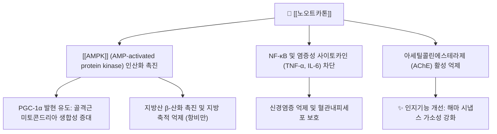

---
aliases:
  - Nootkatone
  - 노오트카톤
  - (+)-Nootkatone
tags:
  - 약리
  - status/draft
  - 약리성분
  - 세스퀴테르페노이드
title: 노오트카톤
date: 2026-09-22
출처: "https://molecule-viewer-rho.vercel.app/?cid=1268142\""
---

# 🌿 [[노오트카톤]] (Nootkatone)

> **핵심 요약 (Key Summary)**:
> 한약재 [[익지인]] 및 자몽 정유에서 분리되는 천연 세스퀴테르페노이드 정유 지표 성분
> [[AMPK]] 경로 활성화로 지방 축적 억제 및 미토콘드리아 생합성 촉진, 항염증·신경보호 작용 발휘
> 대사증후군 개선, 지구력 향상, 인지기능 보호 및 익지인의 온신고정·축뇨 효능의 현대적 지표

---

## 📌 목차
1. [기본 화학 정보 & 분자 구조식 (Chemical Identity)](#1-기본-화학-정보--분자-구조식-chemical-identity)
2. [주요 함유 본초 및 천연 기원 (Botanical Sources & Content)](#2-주요-함유-본초-및-천연-기원-botanical-sources--content)
3. [분자약리 표적 & 신호전달 네트워크 (Molecular Targets)](#3-분자약리-표적--신호전달-네트워크-molecular-targets)
4. [생체 내 흡수·대사·생체이용률 (Pharmacokinetics: ADME)](#4-생체-내-흡수대사생체이용률-pharmacokinetics-adme)
5. [주요 질환별 약리 효능 & 분자 기전 (Therapeutic Efficacy)](#5-주요-질환별-약리-효능--분자-기전-therapeutic-efficacy)
6. [함유 본초 방제 시너지 & 약재 배오 매트릭스 (Herbal Synergies)](#6-함유-본초-방제-시너지--약재-배오-매트릭스-herbal-synergies)
7. [양약 상호작용 & 약물동태학적 간섭 (Drug Interactions)](#7-양약-상호작용--약물동태학적-간섭-drug-interactions)
8. [💡 사용자 진료실 핵심 필기 & 임상 응용 팁 (Melt-In & High-Yield)](#8--사용자-진료실-핵심-필기--임상-응용-팁-melt-in--high-yield)
9. [출처 및 학술 참고 문헌 (References)](#9-출처-및-학술-참고-문헌-references)

---

## 1. 기본 화학 정보 & 분자 구조식 (Chemical Identity)

> [!abstract]+ 🧪 3D 약리 분자 구조 (Interactive 3D Viewer)
> <iframe src="https://molecule-viewer-rho.vercel.app/?cid=1268142" width="100%" height="450px" frameborder="0" allow="webgl" style="border-radius: 8px;"></iframe>

| 항목 | 상세 내용 |
| :--- | :--- |
| **성분명** | [[노오트카톤]] (Nootkatone, (+)-Nootkatone) |
| **IUPAC 명칭** | (4R,4aS,6R)-4,4a-dimethyl-6-prop-1-en-2-yl-3,4,5,6,7,8-hexahydronaphthalen-2-one |
| **화학식** | $C_{15}H_{22}O$ |
| **분자량** | 218.33 g/mol |
| **PubChem CID** | [1268142](https://pubchem.ncbi.nlm.nih.gov/compound/1268142) |
| **화합물 분류** | 에레모필란형 바이사이클릭 세스퀴테르페노이드 (Sesquiterpenoid) |

---

## 2. 주요 함유 본초 및 천연 기원 (Botanical Sources & Content)

| 함유 본초 | 기원 식물학적 명칭 | 주요 함유 부위 | 한의학적 귀경 및 약효 특성 |
| :--- | :--- | :--- | :--- |
| [[익지인]] (益智仁) | *Alpinia oxyphylla* Miq. | 과실 | 신양(腎陽)을 따뜻하게 하고 비위를 덥혀 소변 빈삭, 유뇨, 야간뇨 및 유연(군침 흘림)을 멈춤 |
| 자몽 | *Citrus paradisi* | 과피 | — (정유 성분 기원) |

---

## 3. 분자약리 표적 & 신호전달 네트워크 (Molecular Targets)

### (1) 강력한 AMPK 활성화 매개 대사 개선
* **골격근 및 간 에너지 센서 조절**: 노오트카톤은 세포 내 [[AMPK]] 인산화를 직접 촉진하여 PGC-1α 신호전달을 자극함.
* **미토콘드리아 활성화**: 골격근 내 미토콘드리아 밀도를 높이고 지구력을 증대시키며, 간세포 내 지방 축적을 억제하여 비알코올성 지방간(NAFLD)을 개선함.

⚠️ 검증 메모: C2C12 근세포에서 노오트카톤이 AMPKα1·α2 활성과 AMP/ATP 비 및 ACC 인산화를 높이며 LKB1과 CaMKK 관여가 시사되고, PGC-1α를 상향 조절하며, 마우스(200 mg/kg)의 간·근육에서 AMPK 활성을 높이고 전신 에너지 소비를 증가시키며 0.1~0.3% 식이 섭취로 고지방·고자당 식이 유도 체중·복부지방 증가를 줄였다고 보고되었습니다(Murase 2010). "지구력 증대", "간세포 지방 축적 억제(NAFLD 개선)"는 위 논문에서 직접 확인하지 못해 **내용 검토 필요**입니다.

### (2) 신경세포 보호 및 아세틸콜린 분해 억제
* 뇌 해마 부위의 콜린성 신경망을 활성화하고 아세틸콜린 분해효소(AChE)를 억제하여 알츠하이머병 모델에서 공간 학습 및 기억 능력을 보존함.

⚠️ 검증 메모: Aβ1-42 유도 알츠하이머 마우스에서 노오트카톤이 Y-미로·모리스 수중미로 성능을 개선하고 뇌 MDA·Aβ·AChE 수준을 낮추며 GSH-Px를 높였다는 보고(He 2018), LPS 유도 알츠하이머 마우스에서 신경염증(IL-1β, IL-6, TNF-α, NLRP3, NF-κB p65)을 줄이며 인지기능을 개선했다는 보고(Wang 2018)가 있습니다. 모두 동물 연구입니다.

---

## 4. 생체 내 흡수·대사·생체이용률 (Pharmacokinetics: ADME)

⚠️ 내용 검토 필요: 노오트카톤 단일 성분의 인체·동물 정량 약동학(흡수율·반감기·생체이용률) 문헌은 PubMed 검색 기준 확인되지 않았습니다. 정유 성분으로서 지용성이라는 일반적 특성 외에는 실측 근거 없이 서술하지 않습니다.

---

## 5. 주요 질환별 약리 효능 & 분자 기전 (Therapeutic Efficacy)

* **대사 촉진 및 지구력 증진**: 운동 지구력 한계 시간을 연장하고 근육 내 글리코겐 보존을 돕는 대사 활성 입증.
* **천연 해충 기피 효과**: 진드기, 모기 등에 대한 우수한 살충 및 기피 활성으로 미국 EPA 인증 획득.

### 근거 보충 (검증됨)
* **식이성 비만 예방**: 위 §3의 (1) 참조(Murase 2010) — 마우스 실험 수준.
* **인지기능**: 위 §3의 (2) 참조(He 2018, Wang 2018) — 동물 수준.
* **진드기 기피**: 야외 시험에서 노오트카톤 처리 옷이 *Ixodes scapularis*에 대해 1일 후 100% 기피, 3일까지 완전 보호를 유지했고 *Amblyomma americanum*에도 3일까지 효과적이었으며, 7일 후에는 비교 제품 중 가장 효과적이었다고 보고되었습니다(Jordan 2012).
* ⚠️ 내용 검토 필요: "지구력 한계 시간 연장·글리코겐 보존"과 "미국 EPA 인증"(및 모기 대상 효과)은 이 노트에서 문헌으로 직접 확인하지 못했습니다.

---

## 6. 함유 본초 방제 시너지 & 약재 배오 매트릭스 (Herbal Synergies)

### (1) 핵심 함유 본초: [[익지인]]
* [[익지인]](益智仁)은 신양(腎陽)을 따뜻하게 하고 비위를 덥혀 소변 빈삭, 유뇨, 야간뇨 및 유연(군침 흘림)을 멈추게 하는 명약임.
* 노오트카톤은 익지인의 방향성 건비(健脾) 및 온신(溫腎) 효능을 뒷받침하는 핵심 정유 성분으로, 방광 평활근 긴장도 조절 및 비기허 증후 개선에 관여함.

### (2) 주요 배오 처방
* [[축천환]]: [[오약]], [[산약]]과 함께 신허유뇨(腎虛遺尿) 및 소변 실금 치료.
* [[비해분청음]]: 비뇨기계 만성 염증 및 요탁(백탁) 해소.

| 방제 | 볼트 내 확인된 구성 | 노오트카톤 연계 |
| :--- | :--- | :--- |
| [[축천환]] | [[익지인]](군약) + [[오약]](신약) + [[산약]](좌사약) | 익지인 온신고섭의 지표 성분 |
| [[비해분청음]] | [[비해]], [[익지인]], [[오약]], [[석창포]], [[감초]] | 익지인의 온신고삽 |

⚠️ 내용 검토 필요: "방광 평활근 긴장도 조절"에 대한 노오트카톤 단일 성분 문헌은 확인되지 않았습니다.

---

## 7. 양약 상호작용 & 약물동태학적 간섭 (Drug Interactions)

* **온조(溫燥)성 주의**: 노오트카톤을 다량 함유한 익지인은 성질이 맵고 따뜻하므로, 음허화왕(陰虛火旺)으로 인한 소변 적삽 환자에게는 투여를 주의함.
* ⚠️ 내용 검토 필요: 노오트카톤과 양약 간 병용 상호작용을 직접 검증한 문헌은 확인되지 않았습니다. AMPK 활성화 기전 때문에 혈당강하제와의 상가 효과가 이론적으로 가능하나 근거는 없습니다.

---

## 8. 💡 사용자 진료실 핵심 필기 & 임상 응용 팁 (Melt-In & High-Yield)

* 익지인의 온신고정·축뇨 효능(유뇨, 야간뇨, 유연)을 설명할 때 노오트카톤을 지표 성분으로 연결.
* 익지인은 성질이 맵고 따뜻하므로 음허화왕으로 소변이 붉고 껄끄러운 환자에게는 신중.
* 대사·인지 관련 기전은 동물 수준의 근거임을 환자 설명 시 구분.

---

## 9. 출처 및 학술 참고 문헌 (References)

1. **Murase T, Misawa K, Haramizu S, et al. (2010)**. *Nootkatone, a characteristic constituent of grapefruit, stimulates energy metabolism and prevents diet-induced obesity by activating AMPK*. **Am J Physiol Endocrinol Metab**, 299(2):E266-E275. PMID: [20501876](https://pubmed.ncbi.nlm.nih.gov/20501876/)
   - **[연구 요약]**: 노오트카톤이 AMPK를 활성화(LKB1·CaMKK 관여 시사)하고 PGC-1α를 상향 조절하며 전신 에너지 소비를 늘려 식이성 비만을 억제함을 마우스에서 보고.
2. **He B, Xu F, Xiao F, et al. (2018)**. *Neuroprotective effects of nootkatone from Alpiniae oxyphyllae Fructus against amyloid-β-induced cognitive impairment*. **Metab Brain Dis**, 33(1):251-259. PMID: [29177693](https://pubmed.ncbi.nlm.nih.gov/29177693/)
   - **[연구 요약]**: Aβ1-42 유도 마우스에서 노오트카톤이 학습·기억을 개선하고 MDA·Aβ·AChE 수준을 낮춘다고 보고.
3. **Wang Y, Wang M, Xu M, et al. (2018)**. *Nootkatone, a neuroprotective agent from Alpiniae Oxyphyllae Fructus, improves cognitive impairment in lipopolysaccharide-induced mouse model of Alzheimer's disease*. **Int Immunopharmacol**, 62:77-85. PMID: [29990697](https://pubmed.ncbi.nlm.nih.gov/29990697/)
   - **[연구 요약]**: LPS 유도 알츠하이머 마우스에서 노오트카톤이 신경염증(IL-1β, IL-6, TNF-α, NLRP3, NF-κB p65)을 줄이고 인지기능을 개선.
4. **Jordan RA, Schulze TL, Dolan MC (2012)**. *Efficacy of plant-derived and synthetic compounds on clothing as repellents against Ixodes scapularis and Amblyomma americanum (Acari: Ixodidae)*. **J Med Entomol**, 49(1):101-106. PMID: [22308777](https://pubmed.ncbi.nlm.nih.gov/22308777/)
   - **[연구 요약]**: 노오트카톤 처리 의류가 두 종의 진드기에 대해 높은 기피 효과를 보임을 야외 시험으로 확인.

<!-- 보관 태그(1회용·링크오류, 필요시 복원): 익지인, AMPK -->
