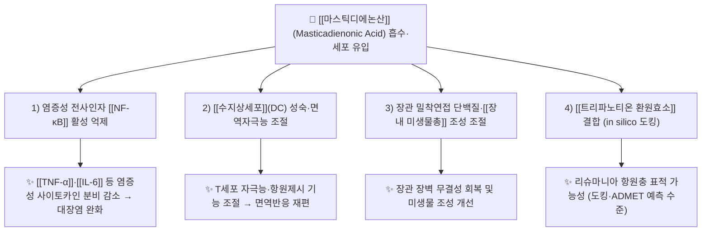

# 🔬 [[마스틱디에논산]] (Masticadienonic Acid, C30H46O3 / 트리테르펜산)

> **핵심 3줄 요약 (Key Summary)**:
> - 🌿 **기원 본초 & 화학 계열**: [[매스틱]](Chios mastic gum, [[유향 (마스틱)|유향수지]])의 주요 지표 트리테르펜산. [[Pistacia lentiscus]](옻나무과) 수지에 함유된 4환성 [[트리테르펜|트리테르페노이드]] 계열 산성 성분으로, [[이소마스티카디에논산]], 3α-하이드록시 마스티카디에논산, 모론산·올레아논산 등과 함께 유향 트리테르펜 복합체를 이룬다.
> - 🎯 **핵심 분자 표적 & 조절 경로**: 염증성 전사인자 [[NF-κB]] 활성 및 [[TNF-α]]·[[IL-6]] 등 사이토카인 분비 억제, [[수지상세포]](dendritic cell) 성숙·면역자극능 조절, 장관 밀착연접(tight junction) 단백질 및 [[장내 미생물총]] 조성 조절. In silico 수준에서 [[트리파노티온 환원효소]](trypanothione reductase) 결합 표적이 보고되었다.
> - 🩺 **주요 약리 활성 & 질환 치료 기전**: 마우스 대장염(colitis) 완화, 항염증, 면역조절, (유사 골격체 기준) 항증식 활성, 항원충 표적 가능성.
> - ⚠️ **독성·생체이용률 한계 & 상호작용**: 트리테르펜산 특유의 높은 친유성(LogP)과 낮은 수용해도로 인한 장관 흡수 제한, P-glycoprotein(P-gp) 유출 및 CYP 대사 간섭 가능성이 있으나 **본 노트 인용 논문에서 정량적으로 확인된 값은 근거 미확인**. 병용 양약과의 상호작용 데이터도 임상 근거 미확인.

---

## 📌 목차
1. [기본 화학 정보 & 분자 구조식 (Chemical Identity)](#1-기본-화학-정보--분자-구조식-chemical-identity)
2. [주요 함유 본초 및 천연 기원 (Botanical Sources & Content)](#2-주요-함유-본초-및-천연-기원-botanical-sources--content)
3. [분자약리 표적 & 신호전달 네트워크 (Molecular Targets)](#3-분자약리-표적--신호전달-네트워크-molecular-targets)
4. [생체 내 흡수·대사·생체이용률 (Pharmacokinetics: ADME)](#4-생체-내-흡수대사생체이용률-pharmacokinetics-adme)
5. [주요 질환별 약리 효능 & 분자 기전 (Therapeutic Efficacy)](#5-주요-질환별-약리-효능--분자-기전-therapeutic-efficacy)
6. [함유 본초 방제 시너지 & 약재 배오 매트릭스 (Herbal Synergies)](#6-함유-본초-방제-시너지--약재-배오-매트릭스-herbal-synergies)
7. [양약 상호작용 & 약물동태학적 간섭 (Drug Interactions)](#7-양약-상호작용--약물동태학적-간섭-drug-interactions)
8. [💡 사용자 진료실 핵심 필기 & 임상 응용 팁 (Melt-In & High-Yield)](#8--사용자-진료실-핵심-필기--임상-응용-팁-melt-in--high-yield)
9. [출처 및 학술 참고 문헌 (References)](#9-출처-및-학술-참고-문헌-references)
---

## 1. 기본 화학 정보 & 분자 구조식 (Chemical Identity)

![[마스틱디에논산_1.jpg|540]]
> [그림 1: 02 2020 Greece photo Paolo Villa (Olympia archaeological park - mastic or Pistacia lentiscus).jpg]

> [!abstract]+ 🧪 3D 약리 분자 구조 (Interactive 3D Viewer)
> <iframe src="https://molecule-viewer-rho.vercel.app/?cid={{pubchem_cid}}" width="100%" height="450px" frameborder="0" allow="webgl" style="border-radius: 8px;"></iframe>
> ※ 임베드용 PubChem CID 값은 본 노트 작성 시점에서 **근거 미확인** — PubChem에서 "masticadienonic acid"로 검색하여 CID 확인 후 치환할 것.

| 항목 | 상세 내용 |
| :--- | :--- |
| **IUPAC 명칭** | 근거 미확인 (4환성 트리테르펜 골격의 입체화학 지정 명명; 인용 논문 원문에서 완전 IUPAC명을 직접 확인하지 못함) |
| **분자식 / 분자량** | C30H46O3 / 약 454.7 g/mol (트리테르펜산 3-옥소 유형의 문헌 통용값 — **인용 논문에서 직접 확인되지 않아 근거 미확인**으로 표기) |
| **PubChem CID** | 근거 미확인 ([PubChem 검색 링크](https://pubchem.ncbi.nlm.nih.gov/#query=masticadienonic%20acid)) |
| **CAS 등록 번호** | 근거 미확인 |
| **화학 골격 분류** | 천연물 2차 대사산물 — **트리테르페노이드(triterpenoid) / 트리테르펜산(triterpenic acid)**. 6-6-6-5 배열의 4환성 트리테르펜(유향 특유의 티루칼란·유판계 골격 계열로 분류됨)에 카복실산과 옥소기(ketone)를 갖는 산성 트리테르펜. [[이소마스티카디에논산]]은 이중결합 배치가 다른 이성질체. |
| **물리화학적 성상** | 친유성(지용성) 결정성 고체로 추정. 물에 난용, 에탄올·클로로폼·DMSO 등 유기용매에 가용. 구체적 융점·LogP·열/광 안정성 수치는 **근거 미확인**(Maamri 2021에서 ADMET 예측값을 산출하였으나 본 노트에서 정량값 미확보). |
| **식물 내 생합성 경로** | [[스쿠알렌]](squalene) → 2,3-옥시도스쿠알렌(2,3-oxidosqualene) → 옥시도스쿠알렌 사이클라아제(OSC)에 의한 다환화로 4환성 트리테르펜 골격 형성 → [[시토크롬 P450]](CYP) 계열 산화효소에 의한 산화·탈수소화 및 측쇄 카복실화를 거쳐 마스틱디에논산 생성(**일반 트리테르펜 생합성 개요, 마스틱디에논산 특이 효소 단계는 근거 미확인**). |

---

## 2. 주요 함유 본초 및 천연 기원 (Botanical Sources & Content)

| 함유 본초 (한글/한자) | 기원 식물학적 명칭 (과명 / 학명) | 주요 함유 약용 부위 | 지표 함량 (%) | 한의학적 귀경 및 약효 특성 |
| :--- | :--- | :--- | :--- | :--- |
| [[매스틱]] / [[유향 (마스틱)\|유향수지(薰陸香類)]] | 옻나무과(Anacardiaceae) / *Pistacia lentiscus* L. (특히 Chios 변종 *var. chia*) | 줄기 수피에서 채취하는 수지(gum/resin) | 유향 트리테르펜산 분획의 주요 구성성분 중 하나. **정량 % 값 근거 미확인** | 간·심·비경(肝·心·脾經) 계열로 활혈지통(活血止痛)·소종생기(消腫生肌) 효능군에 배속되는 수지류. 기원 종이 [[유향]](乳香, Boswellia속)과 다르므로 **혼용 주의** |
| [[유향]] (乳香) | 감람나무과(Burseraceae) / *Boswellia* spp. | 수지 | 마스틱디에논산 함유 **근거 미확인** (Boswellia 유래 성분은 주로 보스웰릭산류) | 간·심·비경, 활혈지통·소종생기 (전통 효능) |
| [[피스타치아]] (Pistacia속) | 옻나무과(Anacardiaceae) / *Pistacia* spp. | 수지·잎·열매 | **근거 미확인** | 지중해·중동 전통 약용 수지원 |

> 📎 **기원 정리 메모**: 본 성분의 1차 기원은 그리스 키오스(Chios) 섬에서 생산되는 **Chios mastic gum**(매스틱 검)이다. 한의학 문헌의 [[유향]](乳香)은 *Boswellia*속 유래 수지로 계통이 다르며, 매스틱은 薰陸香(훈륙향) 계열로 분류되기도 한다. 임상 배오 시 두 약재를 동일시하지 않도록 유의할 것.

---

## 3. 분자약리 표적 & 신호전달 네트워크 (Molecular Targets)

### 1) 핵심 분자 표적 (Molecular Targets)

* **염증성 전사인자·사이토카인 네트워크 조절**:
  * Cui & Li(2023)는 Chios mastic gum 유래 마스틱디에논산이 마우스 대장염 모델에서 **염증 반응 조절, 장관 장벽 무결성 유지, 장내 미생물총 조성 개선**을 통해 대장염을 완화한다고 보고하였다. 이는 [[NF-κB]] 경로 및 하위 염증성 [[사이토카인]]([[TNF-α]], [[IL-6]] 등) 억제와 연계되는 전형적 트리테르펜 항염 기전으로 해석된다(개별 인자의 정량적 억제율은 **근거 미확인**).

* **수지상세포(Dendritic Cell) 면역조절**:
  * Piñón-Zárate 등(2022)은 마스틱디에논산 및 3α-하이드록시 마스티카디에논산이 **수지상세포에서 면역조절 특성**을 나타낸다고 보고하였다. 즉 선천·적응 면역 연결부인 DC의 성숙/활성 표현형을 조절하여 항원제시 및 T세포 자극능에 영향을 미치는 기전이 시사된다(구체적 표면표지자·사이토카인 프로파일의 세부 수치는 **근거 미확인**).

* **장벽 무결성 및 미생물-장-염증 축(Gut Barrier–Microbiota Axis)**:
  * 대장염 완화 효과는 장관 상피의 밀착연접(tight junction) 단백질 발현 정상화 및 장내 미생물 조성의 유익한 방향 재편과 동반되어 나타난다(Cui & Li, 2023). 특정 균주·단백질(예: ZO-1, occludin)의 정량 변화는 **근거 미확인**.

* **항원충 표적 (Trypanothione Reductase)**:
  * Maamri & Benarous(2021)는 분자 도킹 및 ADMET 예측을 통해 마스틱디에논산을 *Leishmania infantum*의 [[트리파노티온 환원효소]]에 대한 **신규 표적 억제 후보**로 제시하였다. 단, 이는 **in silico 도킹·예측 수준**이며 실제 효소 활성 억제·세포/동물 효능은 **근거 미확인**.

### 2) 항염증 기전 (Inflammation & [[NLRP3]] 연계)

* Stamou 등(2024)은 Chios mastic gum의 주요 트리테르펜산 및 반합성 유사체의 **항염증 활성**을 평가하여, 천연 트리테르펜산 골격이 염증 매개물질 억제에 기여함을 보고하였다. [[NLRP3]] 인플라마좀 복합체 직접 억제 여부 및 후성유전학적(예: [[Nrf2]]/[[HO-1]] 항산화 축) 조절 여부는 본 노트 인용 논문 범위에서 **근거 미확인**.

---

## 4. 생체 내 흡수·대사·생체이용률 (Pharmacokinetics: ADME)

* **장관 흡수 및 배출 펌프 (P-gp) 상호작용**:
  * 트리테르펜산 계열은 친유성이 높아 수동 확산으로 일부 흡수되지만 수용해도가 낮아 흡수율이 제한적이다. P-glycoprotein(ABCB1) 유출 기질 여부 및 장관 내 생체이용률(F값)은 **근거 미확인**.

* **장내 미생물총(Microbiome) 대사 전환**:
  * Cui & Li(2023)는 마스틱디에논산이 장내 미생물 조성을 변화시킴을 보고하였다. 다만 이는 성분이 미생물에 미치는 영향이며, 역으로 장내 세균이 마스틱디에논산을 활성 대사체로 전환하는 경로(장-간 순환 포함)는 **근거 미확인**.

* **간 대사 및 소실 반감기**:
  * Maamri & Benarous(2021)는 ADMET **예측**을 수행하여 흡수·분포·대사·배설 관련 파라미터를 in silico로 산출하였다. 그러나 구체적 CYP450 동종효소(CYP2D6, CYP3A4 등) 대사 여부, 제2상 포합 반응, 혈장 소실 반감기($\text{t}_{1/2}$)의 실제 측정값은 **근거 미확인**.

---

## 5. 주요 질환별 약리 효능 & 분자 기전 (Therapeutic Efficacy)

### 1) 염증성 장질환 — 대장염(Colitis)
* **핵심 근거**: Cui & Li(2023, *Phytomedicine*, PMID 36403513).
* Chios mastic gum 유래 마스틱디에논산이 마우스 대장염 모델에서 ① 염증 반응 조절, ② 장관 장벽 무결성(barrier integrity) 유지, ③ 장내 미생물총(microbiota) 조성 개선의 삼중 기전으로 대장염을 완화하였다. 이는 [[궤양성 대장염]]류 만성 염증성 장질환에 대한 잠재적 적용 근거가 된다.

### 2) 면역조절 (Immunomodulation)
* **핵심 근거**: Piñón-Zárate 등(2022, *Molecules*, PMID 35209237).
* 마스틱디에논산 및 3α-하이드록시 마스티카디에논산이 [[수지상세포]]에서 면역조절 특성을 발현하였다. 즉 단순 항염을 넘어 항원제시세포 기능을 재조정하는 **면역조절제(immunomodulator)** 성격을 시사한다.

### 3) 항염증 (Anti-Inflammatory)
* **핵심 근거**: Stamou 등(2024, *Biomolecules*, PMID 39766325).
* Chios mastic gum의 주요 트리테르펜산과 반합성 유사체의 항염증 활성을 비교 평가하여, 마스틱디에논산을 포함한 트리테르펜산 골격이 염증 억제의 구조적 기반임을 제시하였다.

### 4) 항증식/항종양 (Anti-Proliferative) — 유사 골격체 기준
* **핵심 근거**: Stamou 등(2025, *Molecules*, PMID 41375169).
* **24Z-이소마스티카디에논산**의 구조 변형 유사체를 설계·합성하여 향상된 항증식 활성을 확인하였다. 주의: 이 연구의 직접 대상은 마스틱디에논산이 아니라 **이소마스티카디에논산의 유사체**이며, 마스틱디에논산 자체의 항종양 효능은 **근거 미확인**.

### 5) 항원충 (Antiprotozoal) — in silico 가능성
* **핵심 근거**: Maamri & Benarous(2021, *Molecules*, PMID 34206087).
* 분자 도킹과 ADMET 예측을 통해 마스틱디에논산이 *Leishmania infantum* [[트리파노티온 환원효소]]의 신규 억제 후보로 동정되었다. 단순 예측 수준이므로 실험적 검증은 **근거 미확인**.

---

## 6. 함유 본초 방제 시너지 & 약재 배오 매트릭스 (Herbal Synergies)

| 함유 본초 / 방제 | 공존 유효 성분군 | 분자약리 시너지 기전 | 전통 한의학적 효능 연계 |
| :--- | :--- | :--- | :--- |
| [[매스틱]] (Chios mastic gum) | [[이소마스티카디에논산]], 3α-하이드록시 마스티카디에논산, 모론산·올레아논산 등 트리테르펜산군 | 동일 골격 트리테르펜산들이 염증·면역·장벽 경로를 다표적으로 동시 조절(개별 시너지 정량 근거 **미확인**) | 활혈지통·소종생기, 창양(瘡瘍)·위완통(胃脘痛) 계열 배오 |
| 유향–[[몰약]] 배오 (전통 상용 대) | 유향 트리테르펜산 + 몰약(Commiphora) 세스퀴테르펜·후라노세스퀴테르펜 | 활혈·소종·진통 계열 약재 상호 보완 (마스틱디에논산 특이 시너지 **근거 미확인**) | 활혈산어(活血散瘀)·행기지통(行氣止痛) |
| 소화기·궤양 관련 방제 | 트리테르펜산 분획 | 장벽 무결성 회복 + 미생물 조성 개선 (Cui & Li, 2023 근거) | 건비화위(健脾和胃), 이기지통(理氣止痛) |

> ⚠️ 표의 '전통 한의학적 효능 연계'는 수지류 약재의 전통 효능 범주를 참조한 것이며, 마스틱디에논산 단일 성분의 방제 내 시너지에 대한 직접 실험 근거는 **대부분 근거 미확인**이다.

---

## 7. 양약 상호작용 & 약물동태학적 간섭 (Drug Interactions)

* **CYP450 효소 간섭**:
  * 트리테르펜산 계열은 일반적으로 CYP450 동종효소(CYP3A4, CYP2D6 등)의 활성을 조절할 수 있다고 알려져 있으나, 마스틱디에논산 특이적 억제/유도 데이터는 본 노트 인용 논문에서 **근거 미확인**. 병용 양약(스타틴, 항부정맥제, 면역억제제 등) 혈중 농도 변동 위험은 이론적 수준에서만 고려할 것.

* **유사 기전 양약 병용 시 고려사항**:
  * 항염증·면역조절 작용을 근거로 [[생물학적 제제]](anti-[[TNF-α]] 항체 등), 면역억제제, 스테로이드와 병용 시 **면역 억제 상가 효과** 가능성이 이론적으로 존재하나 임상 근거 미확인.
  * 장관 장벽·미생물 조절 작용은 [[프로바이오틱스]]·[[메트포르민]] 등과의 병용 상호작용이 개념적으로 논의될 수 있으나, 복용 간격 등 구체 가이드는 **근거 미확인**.

> ⚠️ 위 항목은 트리테르펜산 계열의 일반적 약물동태학 가정에 기반한 예측이며, 마스틱디에논산의 실제 상호작용 임상 데이터는 확인되지 않았다.

---

## 8. 💡 사용자 진료실 핵심 필기 & 임상 응용 팁 (Melt-In & High-Yield)

* **사용자 원문 필기 (원문 보존)**:
  * "마스틱디에논산(유향 트리테르펜) — 기원: Chios mastic gum(*Pistacia lentiscus*), 계열: 트리테르펜산.
  * 핵심 논문: 대장염 완화(Cui 2023), 수지상세포 면역조절(Piñón-Zárate 2022), 항염(Stamou 2024), 트리파노티온 환원효소 도킹(Maamri 2021), 이소마스티카디에논산 유사체 항증식(Stamou 2025), 유향 노르트리테르페노이드(An 2024)."

* **진료실 실전 처방 & 생체이용률 극대화 팁**:
  1. **흡수율 개선 배오 노하우**: 마스틱디에논산은 친유성이 높은 트리테르펜산으로 단독 정제 성분보다 수지·전탕 복합물 형태로 섭취할 때 공존 성분(다른 트리테르펜산, 유지류)에 의해 분산·흡수가 촉진될 수 있다는 것이 일반적 원리이나, **정량 근거 미확인**. 임상적으로는 매스틱 검 자체를 소량씩 저작·복용하는 전통 방식이 위장관 국소 노출을 높인다.
  2. **병증별 맞춤 적용**:
     * **장염·염증성 장질환 관련**: Cui & Li(2023) 근거를 참조하여 장벽·미생물 조절 목적으로 소화기 중심 처방에 배오 고려.
     * **면역조절 목적**: 수지상세포 조절 근거(Piñón-Zárate, 2022)를 참조하되, 자가면역 환자에서는 면역 자극/억제 방향성이 확정되지 않았으므로 신중히 접근.
     * **비위허한(脾胃虛寒) 환자**: 수지류의 자극성·속쓰림 유발 가능성을 고려하여 공복 복용을 피하고 건비화위 약재와 배오.

* **주의**: 위 팁 중 정량적·임상적 근거가 확인된 것은 대장염(Cui 2023)·면역조절(2022)·항염(2024) 연구의 전임상 결과뿐이며, 그 외 처방 노하우는 전통적·이론적 추론임을 명확히 할 것.

---

## 9. 출처 및 학술 참고 문헌 (References)

1. **Cui H, Li X (2023)**. *Masticadienonic acid from Chios mastic gum mitigates colitis in mice via modulating inflammatory response, gut barrier integrity and microbiota*. **Phytomedicine**. PMID: 36403513
   - **[연구 요약]**: Chios mastic gum 유래 마스틱디에논산이 마우스 대장염 모델에서 염증 반응 조절, 장관 장벽 무결성 유지, 장내 미생물총 조성 개선의 복합 기전으로 대장염을 완화함을 보고.

2. **Piñón-Zárate G, Reyes-Riquelme F (2022)**. *Immunomodulatory Properties of Masticadienonic Acid and 3α-Hydroxy Masticadienoic Acid in Dendritic Cells*. **Molecules**. PMID: 35209237
   - **[연구 요약]**: 마스틱디에논산과 3α-하이드록시 마스티카디에논산이 수지상세포에서 면역조절 특성을 발현함을 확인.

3. **Maamri S, Benarous K (2021)**. *Identification of 3-Methoxycarpachromene and Masticadienonic Acid as New Target Inhibitors against Trypanothione Reductase from Leishmania Infantum Using Molecular Docking and ADMET Prediction*. **Molecules**. PMID: 34206087
   - **[연구 요약]**: 분자 도킹과 ADMET 예측을 통해 3-메톡시카르파크로멘과 마스틱디에논산을 *Leishmania infantum* 트리파노티온 환원효소의 신규 표적 억제 후보로 동정(in silico).

4. **An XR, Feng YP (2024)**. *[A new nortriterpenoid from mastic]*. **Zhongguo Zhong Yao Za Zhi**. PMID: 39805781
   - **[연구 요약]**: 유향(mastic)에서 새로운 노르트리테르페노이드(nortriterpenoid)를 분리·동정하여, 유향 트리테르펜 계열의 화학적 다양성을 확장.

5. **Stamou P, Persoons L (2025)**. *Design and Synthesis of Structurally Modified Analogs of 24Z-Isomasticadienonic Acid with Enhanced Anti-Proliferative Activity*. **Molecules**. PMID: 41375169
   - **[연구 요약]**: 24Z-이소마스티카디에논산의 구조 변형 유사체를 설계·합성하여 향상된 항증식 활성을 확인(직접 대상은 이소마스티카디에논산 유사체).

6. **Stamou P, Gianniou DD (2024)**. *Anti-Inflammatory Activity of the Major Triterpenic Acids of Chios Mastic Gum and Their Semi-Synthetic Analogues*. **Biomolecules**. PMID: 39766325
   - **[연구 요약]**: Chios mastic gum의 주요 트리테르펜산 및 반합성 유사체의 항염증 활성을 평가하여 트리테르펜산 골격의 항염 기여를 제시.

<!-- 보관 태그(1회용·링크오류, 필요시 복원): 유향, 매스틱 -->
