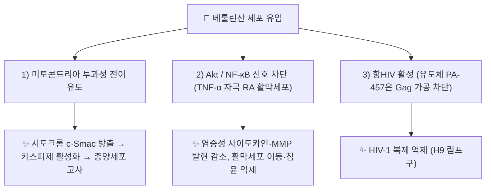

# 🔬 베툴린산 (Betulinic Acid, C₃₀H₄₈O₃ / 루판형 오환성 트라이테르페노이드)

> **핵심 3줄 요약 (Key Summary)**:
> - 🌿 기원 본초 & 화학 계열: 자작나무 껍질·[[백두옹]]·[[대추]] 등에서 분리되는 천연 루판형 오환성 트라이테르페노이드 화합물
> - 🎯 핵심 분자 표적 & 조절 경로: 미토콘드리아 외막 투과성 전이공 개방을 통한 암세포 선택적 세포고사 및 강력한 항HIV·항염증
> - 🩺 주요 약리 활성 & 질환 치료 기전: 청열해독·항종양 및 관절염 활막세포 염증 억제 한약의 핵심 생리활성 분자 기반
> - ⚠️ 근거 수준·한계: 항종양·항염증 근거는 세포·동물 연구 수준이며 인체 약동학·임상 자료는 확인하지 못했습니다. 항HIV '성숙 억제제' 활성은 베툴린산 자체가 아니라 3-O-디메틸석시닐 유도체(PA-457)의 근거이고, 수용성이 극히 낮아 생체이용률이 제한됩니다.

---

## 📌 목차
1. [기본 화학 정보 & 분자 구조식 (Chemical Identity)](#1-기본-화학-정보--분자-구조식-chemical-identity)
2. [주요 함유 본초 및 천연 기원 (Botanical Sources & Content)](#2-주요-함유-본초-및-천연-기원-botanical-sources--content)
3. [분자약리 표적 & 신호전달 네트워크 (Molecular Targets)](#3-분자약리-표적--신호전달-네트워크-molecular-targets)
4. [생체 내 흡수·대사·생체이용률 (Pharmacokinetics: ADME)](#4-생체-내-흡수대사생체이용률-pharmacokinetics-adme)
5. [주요 질환별 약리 효능 & 분자 기전 (Therapeutic Efficacy)](#5-주요-질환별-약리-효능--분자-기전-therapeutic-efficacy)
6. [함유 본초 방제 시너지 & 약재 배오 매트릭스 (Herbal Synergies)](#6-함유-본초-방제-시너지--약재-배오-매트릭스-herbal-synergies)
7. [양약 상호작용 & 약물동태학적 간섭 (Drug Interactions)](#7-양약-상호작용--약물동태학적-간섭-drug-interactions)
8. [💡 사용자 진료실 핵심 필기 & 임상 응용 팁 (Melt-In & High-Yield)](#8--사용자-진료실-핵심-필기--임상-응용-팁-melt-in--high-yield)
9. [출처 및 학술 참고 문헌 (References)](#9-출처-및-학술-참고-문헌-references)

---

## 1. 기본 화학 정보 & 분자 구조식 (Chemical Identity)

> [!abstract]+ 🧪 3D 약리 분자 구조 (Interactive 3D Viewer)
> <iframe src="https://molecule-viewer-rho.vercel.app/?cid=64971" width="100%" height="450px" frameborder="0" allow="webgl" style="border-radius: 8px;"></iframe>

베툴린산(Betulinic acid, BA)은 루판(Lupane) 골격을 가지는 천연 오환성 트라이테르페노이드(Pentacyclic triterpenoid) 카르복실산이다.

* 영문명: Betulinic acid
* 화학식: C₃₀H₄₈O₃
* 분자량: 456.70 g/mol
* IUPAC 명칭: (1R,3aS,5aR,5bR,7aR,9S,11aR,11bR,13aR,13bR)-9-hydroxy-5a,5b,8,8,11a-pentamethyl-1-prop-1-en-2-yl-1,2,3,4,5,6,7,7a,9,10,11,11b,12,13,13a,13b-hexadecahydrocyclopenta[a]chrysene-3a-carboxylic acid
* 기원 식물: 자작나무(*Betula alba*) 수피, [[백두옹]](Pulsatillae Radix), [[산조인]](Zizyphi Semen), [[대추]](대조) 등.

| 항목 | 상세 내용 |
| :--- | :--- |
| **IUPAC 명칭** | 위 원문 IUPAC 명칭과 동일 (PubChem 등록명 확인) |
| **분자식 / 분자량** | C₃₀H₄₈O₃ / 456.7 g/mol (PubChem) |
| **PubChem CID** | [64971](https://pubchem.ncbi.nlm.nih.gov/compound/64971) |
| **CAS 등록 번호** | 472-15-1 (PubChem 동의어 기준) |
| **화학 골격 분류** | 루판(Lupane)형 오환성 트리테르페노이드 카르복실산 (C-3 수산기, C-28 카르복실기, C-20(29) 이소프로페닐기) |
| **물리화학적 성상** | 수용성이 극히 낮음(원문 §4 서술). 계산 XLogP 8.2(PubChem), 수소결합 공여체 2·수용체 3. 외관·열/빛 안정성·맛은 확인하지 못했습니다 ⚠️ 내용 검토 필요 |
| **식물 내 생합성 경로** | 루페올(lupeol) → 베툴린(betulin) → 베툴린산. 사이토크롬 P450 CYP716A 아과 효소의 C-28 산화(Fukushima 2011, *Plant Cell Physiol*, PMID 22039103)로 진행되며, 로즈마리의 CYP716A155가 루페올을 베툴린산으로 전환함(Huang 2019, *Appl Microbiol Biotechnol*, PMID 31309269) |

> ⚠️ **3D 뷰어 CID 정정**: 기존 뷰어의 CID 72326은 PubChem에서 **베툴린(Betulin, C₃₀H₅₀O₂, 442.7)** 으로 등록되어 있어 베툴린산이 아닙니다. 원문 IUPAC 명칭과 일치하는 CID **64971**(Betulinic Acid, C₃₀H₄₈O₃)로 정정했습니다.

---

## 2. 주요 함유 본초 및 천연 기원 (Botanical Sources & Content)

| 함유 본초 (한글/한자) | 기원 식물학적 명칭 (과명 / 학명) | 주요 함유 약용 부위 | 지표 함량 (%) | 한의학적 귀경 및 약효 특성 |
| :--- | :--- | :--- | :--- | :--- |
| [[백두옹]] (白頭翁) | 미나리아재비과 / *Pulsatilla koreana*, *Pulsatilla chinensis* | 뿌리 | 미확인 | 위·대장경, 苦寒, 청열해독·양혈지리 (볼트 백두옹 노트 기준) |
| [[산조인]] (酸棗仁) | 갈매나무과 / *Zizyphus jujuba* var. *spinosa* | 씨(종인) | 미확인 | 심·비·간·담경, 甘酸平, 안신 (볼트 산조인 노트 기준) |
| [[대추]] (大棗) | 갈매나무과 / *Zizyphus jujuba* | 성숙한 열매 | 미확인 | 비·위·심경, 甘溫, 보익 (볼트 대추 노트 기준) |

* [[산조인]]: 대추나무 종자(*Z. jujuba*)에서 베툴린산이 분리되었고(Su 2002, *Planta Med*, PMID 12494342), 멧대추 씨의 UPLC-MS/MS 분석에서 주요 성분으로 확인되었습니다(Yang 2013, *Analyst*, PMID 24071816).
* [[대추]]: 열매의 주요 트리테르펜산으로 베툴린산·알피톨산·마슬린산·올레아놀산·우르솔산이 보고되었습니다(Song 2020, *Plants*, PMID 32230740).
* [[백두옹]]: *P. chinensis* 뿌리에서는 23-하이드록시베툴린산의 루판 배당체(풀사틸로사이드 D·E 등)가 확인되었습니다(Ye 2002, *Planta Med*, PMID 11859478). 초록에서 유리형 베툴린산 자체의 검출은 확인하지 못했습니다 ⚠️ 내용 검토 필요.
* 원문의 자작나무 수피 기원과 지표 함량(%)은 이번 검증에서 확인하지 못했습니다 ⚠️ 내용 검토 필요.

---

## 3. 분자약리 표적 & 신호전달 네트워크 (Molecular Targets)

### 1) 미토콘드리아 표적 선택적 항종양 활성 (Antitumor via Apoptosis)
* 베툴린산은 정상 세포에는 거의 독성을 나타내지 않으면서, 흑색종(Melanoma), 신경교종, 백혈병 등 다양한 종양 세포에 선택적으로 세포사멸(Apoptosis)을 유도한다.
  * 근거: 흑색종 선택적 세포사멸(Pisha 1995, PMID 7489361), 신경외배엽 종양(Fulda 1997, PMID 9354463), 소아 급성 백혈병 일차세포의 65%·백혈병 세포주 전부(Ehrhardt 2004, PMID 15201849), 환자 유래 일차 교모세포종 세포 21건 중 9건(43%)에서 75% 이상 세포사(Jeremias 2004, PMID 15197616). 정상 조직이 상대적으로 저항성이라는 정리는 Fulda 2009(PMID 19520182)를 참고. 모두 세포 수준 근거입니다.
* 암세포 미토콘드리아 외막에 직접 결합하여 미토콘드리아 막전위($\Delta\Psi_m$)를 붕괴시키고 시토크롬 c(Cytochrome c) 및 Smac/DIABLO의 방출을 촉진한다.
  * 근거: 분리 미토콘드리아에서 베툴린산이 막전위 소실을 직접 유도하고 투과성 전이공(bongkrekic acid로 억제됨)을 통해 시토크롬 c·AIF 방출이 일어남(Fulda 1998, PMID 9852046). 백혈병 세포의 분리 미토콘드리아에서 시토크롬 c와 Smac 방출이 확인됨(Ehrhardt 2004).
  * ⚠️ 내용 검토 필요: 확인된 것은 미토콘드리아에 대한 '직접 작용'이며, 외막의 구체적 결합 표적(단백질·부위)은 확인하지 못했습니다.
* 카스파제-9 및 카스파제-3([[Caspase-3]])을 연쇄 활성화하여 p53 유전자 변이 암세포에서도 독립적으로 고사를 유도한다.
  * 근거: 카스파제 활성화를 통한 CD95·p53 비의존성 고사(Fulda 1997), 미토콘드리아 상등액에 의한 카스파제-3·-8 절단(Fulda 1998).
  * ⚠️ 내용 검토 필요: 카스파제-9는 확인한 초록에서 명시되지 않았습니다(카스파제-8과 -3의 절단이 확인됨).

### 2) 항바이러스 및 항HIV 활성
* 인간 면역결핍 바이러스(HIV-1)의 증식을 억제하며, 특히 바이러스 캡시드(Capsid) 성숙 과정을 차단하는 성숙 억제제(Maturation inhibitor)로서의 활성을 발휘한다.
  * 근거: 베툴린산은 *Syzigium claviflorum* 잎에서 분리되어 H9 림프구에서 HIV 복제를 억제(Fujioka 1994, PMID 8176401). 캡시드 전구체 p25→p24 전환을 막는 '성숙 억제제'로 규명된 것은 3-O-(3′,3′-dimethylsuccinyl) betulinic acid(PA-457, 베비리맷)입니다(Li 2003, PNAS, PMID 14573704).
  * ⚠️ 내용 검토 필요: 성숙 억제 기전은 베툴린산 자체가 아니라 그 유도체에서 확인된 것이며, 베툴린산 자체의 항HIV 기전 근거는 확인하지 못했습니다.

### 3) 항염증 및 관절 활막세포 보호
* 활액막 섬유아세포(FLS)에서 [[NF-κB]] 활성화를 차단하여 류마티스 관절염 모델에서 관절 파괴와 판누스(Pannus) 형성을 억제한다.
  * 근거: 류마티스 관절염 환자 유래 FLS에서 TNF-α로 유도된 NF-κB 활성화와 핵 축적이 줄고 IL-1β·IL-6·IL-8·IL-17A mRNA가 감소하며, 콜라겐 유도 관절염(CIA) 마우스에서 활막 염증·관절 파괴가 완화됨(Li 2019, PMID 30553912). Akt/NF-κB 경로 차단과 MMP 발현·염증성 사이토카인 감소(Wang 2019, PMID 30367550). CIA 흰쥐에서 발 부종·활막 증식·연골 파괴가 감소하고 NF-κB p65·IκBα·IKKα/β 발현이 낮아짐(Kun-Liu 2020, PMID 32718263).
  * ⚠️ 내용 검토 필요: '판누스 형성 억제'라는 표현은 확인한 초록에 직접 나오지 않았습니다(활막 증식·연골 파괴 감소로 확인).
* **NF-κB 조절의 상반된 보고**: 발암물질로 유도된 NF-κB 활성화를 IκBα 키나제·p65 인산화 억제로 차단한다는 보고(Takada 2003, PMID 12960358)가 있는 반면, 일부 종양세포에서는 베툴린산이 NF-κB를 오히려 활성화한다는 보고(Kasperczyk 2005, PMID 16007147)도 있어 세포 종류·조건에 따라 방향이 다를 수 있습니다 ⚠️ 내용 검토 필요.

---

## 4. 생체 내 흡수·대사·생체이용률 (Pharmacokinetics: ADME)

* 수용성이 극히 낮아 경구 투여 시 흡수율이 낮다는 한계가 있어, 현대 제약학에서는 나노에멀전 또는 글리코실화 유도체 개발이 활발하다.
  * 근거: 베툴린산의 낮은 생체이용률이 임상 적용의 제한점이며, 분무건조 점막부착 미립자 제형에서 흰쥐 Cmax 3.90배·AUC 7.41배 증가(Godugu 2014, PMID 24614362). 나노제형 종설은 Wang 2024(PMID 39748899).
  * ⚠️ 내용 검토 필요: 나노에멀전·글리코실화 유도체 개발 동향은 확인한 자료에서 직접 검증하지 못했습니다(확인된 것은 나노제형·분무건조 미립자).
* 세포 독성이 선택적이어서 전신 정상 장기에 대한 부작용이 매우 적다.
  * 근거: 설치류에서 분무건조 제형의 만성 투여 시 독성이 관찰되지 않았음(Godugu 2014).
  * ⚠️ 내용 검토 필요: 인체 안전성 자료는 확인하지 못했으므로 '부작용이 매우 적다'는 서술은 전임상 수준의 근거입니다.
* **동물 약동학**: CD-1 마우스에 250·500 mg/kg를 복강 투여했을 때 혈청 최고농도 도달 0.15·0.23시간, 소실 반감기 11.5·11.8시간이었고, 24시간 후 조직 분포는 신장주위 지방·난소·비장 순으로 높고 뇌·심장이 가장 낮았음(Udeani 1999, PMID 10870094).
* **P-gp(ABCB1) 상호작용**: 비종양 신장 세포주에서 저독성 농도의 베툴린산은 P-gp·MRP1 활성을 바꾸지 않았고 메토트렉세이트 축적에도 영향이 없었음(Delou 2009, PMID 21475824). P-gp 기질 여부 자체는 확인하지 못했습니다 ⚠️ 내용 검토 필요.
* **장내 미생물 대사·간 CYP450 대사·인체 반감기**: 확인한 문헌이 없습니다 ⚠️ 내용 검토 필요.

---

## 5. 주요 질환별 약리 효능 & 분자 기전 (Therapeutic Efficacy)

### 1) 종양 (전임상)
* 흑색종·신경외배엽 종양·소아 급성 백혈병·교모세포종 세포에서 세포사멸 유도(기전은 §3-1). 인체 임상시험 근거는 확인하지 못했습니다 ⚠️ 내용 검토 필요.

### 2) 바이러스 감염 (HIV)
* 베툴린산은 H9 림프구에서 HIV 복제를 억제(Fujioka 1994). 임상 개발된 성숙 억제제 계열은 베툴린산의 3-O-치환 유도체입니다(Li 2003, PA-457; 구조-활성 연구는 Qian 2010, *J Med Chem*, PMID 20329730).

### 3) 류마티스 관절염·만성 염증
* RA 활막세포의 이동·침윤·염증성 매개체 억제와 CIA 동물의 관절 병변 완화(기전은 §3-3). 항염증 전임상 근거의 종설은 Oliveira-Costa 2022(*Front Pharmacol*, PMID 35677426).

### 4) 장관 점막 보호 (전임상)
* T-2 독소로 유발된 마우스 장 손상에서 베툴린산(0.25~1 mg/kg, 2주 경구) 전처치가 항산화능을 올리고 ZO-1·Occludin 발현과 융모 형태를 회복시키며 p-NF-κB·p-IκBα와 IL-1β·IL-6·TNF-α mRNA를 낮춤(Luo 2020, *Toxins*, PMID: 33322178).
* ⚠️ 내용 검토 필요: 궤양성 대장염 등 이질·염증성 장질환 자체에 대한 베툴린산 단독 근거는 확인하지 못했습니다(확인한 것은 독소 유발 장 손상 모델).

### 5) 대사성 질환 (전임상)
* 대추 열매에서 분리된 베툴린산·베툴론산·올레아논산이 랫드 L6 근관세포에서 GLUT4([[GLUT4]]) 의존적으로 포도당 흡수를 촉진(Kawabata 2017, PMID 28757534). 인체 혈당 개선 근거는 확인하지 못했습니다 ⚠️ 내용 검토 필요.

---

## 6. 함유 본초 방제 시너지 & 약재 배오 매트릭스 (Herbal Synergies)

| 함유 본초 / 방제 | 공존 유효 성분군 | 분자약리 시너지 기전 | 전통 한의학적 효능 연계 |
| :--- | :--- | :--- | :--- |
| [[백두옹]] | [[아네모닌]], 23-하이드록시베툴린산 루판 배당체(풀사틸로사이드) | 장점막 염증 차단, 원충 및 종양 억제 ⚠️ 내용 검토 필요(원충 억제·베툴린산 단독 기여는 근거 미확인) | 열독혈리(熱毒血痢), 아메바성 이질, 종양 |
| [[산조인]] | [[스피노신]] | 신경세포 산화 손상 방어, 신경 진정 ⚠️ 내용 검토 필요(진정·수면 효과를 보인 멧대추 부위에 베툴린산이 공통 성분으로 검출됨 — Li 2024, PMID 38675375 — 단일 성분 인과는 미확인) | 허번불면(虛煩不眠), 신경쇠약, 도한 |
| [[대추]] | [[올레아놀산]], [[우르솔산]] | 열매 트리테르펜산이 GLUT4 의존 포도당 흡수를 촉진(Kawabata 2017, 전임상) | 보익(補益)약 (베툴린산 매개 주치는 원문에 별도 기재 없음) |
| [[백두옹탕]] | [[백두옹]]·[[황련]]·[[황백]]·진피(秦皮) | 대장 점막 세포고사 방어 및 소염 ⚠️ 내용 검토 필요(백두옹탕 자체의 베툴린산 연구 없음, 장점막 보호는 독소 모델 근거만 Luo 2020) | 급성 세균성·염증성 장 질환, 궤양성 대장염 |
| [[하고초]], [[시체]], [[모과]] | (볼트 각 본초 노트가 베툴린산을 성분으로 기재) | 외부 문헌으로 재확인하지 않았음 ⚠️ 내용 검토 필요 | 각 본초 노트 참조 |

> 볼트에서 확인한 [[백두옹탕]]의 구성은 [[백두옹]] 15g(군), [[황련]] 9g·[[황백]] 9g(신), 진피(秦皮) 9~12g(좌)입니다.

---

## 7. 양약 상호작용 & 약물동태학적 간섭 (Drug Interactions)

* **CYP450 효소 간섭**:
  * 베툴린산의 CYP 억제·유도 자료는 확인하지 못했습니다 ⚠️ 내용 검토 필요. (검색된 랫드 간 마이크로솜 연구는 루페올·베툴린을 대상으로 한 것으로 베툴린산에 그대로 적용할 수 없음: Seervi 2016, PMID 26959552.)
* **P-gp·MRP1·병용 항암제**:
  * 비종양 신장 세포주에서 P-gp·MRP1 활성과 메토트렉세이트 축적을 바꾸지 않았다는 세포 수준 결과만 있음(Delou 2009). 인체 병용 시험은 확인하지 못했습니다.
* **유사 기전 양약 병용 시 고려사항**:
  * 대추 유래 베툴린산이 근육세포 포도당 흡수를 늘린다는 전임상 결과(Kawabata 2017)가 있어 혈당강하제와의 상가 작용은 이론적으로 가능하나, 임상 상호작용 자료는 없습니다 ⚠️ 내용 검토 필요.

---

## 8. 💡 사용자 진료실 핵심 필기 & 임상 응용 팁 (Melt-In & High-Yield)

* 현재 별도로 기록된 원장님 임상 필기가 없습니다.

---

## 9. 출처 및 학술 참고 문헌 (References)

1. **Pisha E, et al.** (1995). *Discovery of betulinic acid as a selective inhibitor of human melanoma that functions by induction of apoptosis.* Nat Med, 1(10):1046-1051. PMID: [7489361](https://pubmed.ncbi.nlm.nih.gov/7489361/) | DOI: [10.1038/nm1095-1046](https://doi.org/10.1038/nm1095-1046)
   - **[연구 요약]**: 베툴린산의 흑색종 특이적 세포사멸 유도 및 정상 세포 무독성을 최초 규명한 기념비적 연구.
2. **Yogeeswari P, Sriram D.** (2005). *Betulinic acid and its derivatives: a review on their biological properties.* Curr Med Chem, 12(6):657-666. PMID: [15790304](https://pubmed.ncbi.nlm.nih.gov/15790304/) | DOI: [10.2174/0929867053202214](https://doi.org/10.2174/0929867053202214)
   - **[연구 요약]**: 베툴린산의 항종양, 항HIV 및 항염증 생리활성 기전과 유도체 합성 동향을 총망라함.
3. **Fulda S, et al.** (1997). *Betulinic acid triggers CD95 (APO-1/Fas)- and p53-independent apoptosis via activation of caspases in neuroectodermal tumors.* Cancer Res, 57(21):4956-4964. PMID: [9354463](https://pubmed.ncbi.nlm.nih.gov/9354463/)
   - **[연구 요약]**: 신경외배엽 종양에서 CD95·p53 비의존적, 카스파제 매개 세포사멸을 보고.
4. **Fulda S, et al.** (1998). *Activation of mitochondria and release of mitochondrial apoptogenic factors by betulinic acid.* J Biol Chem, 273(51):33942-33948. PMID: [9852046](https://pubmed.ncbi.nlm.nih.gov/9852046/) | DOI: [10.1074/jbc.273.51.33942](https://doi.org/10.1074/jbc.273.51.33942)
   - **[연구 요약]**: 분리 미토콘드리아에서 막전위 소실·투과성 전이 유도와 시토크롬 c·AIF 방출, 카스파제-3·-8 절단을 확인.
5. **Ehrhardt H, et al.** (2004). *Betulinic acid-induced apoptosis in leukemia cells.* Leukemia, 18(8):1406-1412. PMID: [15201849](https://pubmed.ncbi.nlm.nih.gov/15201849/) | DOI: [10.1038/sj.leu.2403406](https://doi.org/10.1038/sj.leu.2403406)
   - **[연구 요약]**: 소아 급성 백혈병 일차세포·세포주에서 고사 유도, 분리 미토콘드리아에서 시토크롬 c·Smac 방출.
6. **Jeremias I, et al.** (2004). *Cell death induction by betulinic acid, ceramide and TRAIL in primary glioblastoma multiforme cells.* Acta Neurochir (Wien), 146(7):721-729. PMID: [15197616](https://pubmed.ncbi.nlm.nih.gov/15197616/) | DOI: [10.1007/s00701-004-0286-4](https://doi.org/10.1007/s00701-004-0286-4)
   - **[연구 요약]**: 환자 유래 일차 교모세포종 세포 21건 중 9건에서 75% 이상 세포사.
7. **Fulda S, Kroemer G.** (2009). *Targeting mitochondrial apoptosis by betulinic acid in human cancers.* Drug Discov Today, 14(17-18):885-890. PMID: [19520182](https://pubmed.ncbi.nlm.nih.gov/19520182/) | DOI: [10.1016/j.drudis.2009.05.015](https://doi.org/10.1016/j.drudis.2009.05.015)
   - **[연구 요약]**: 미토콘드리아 막 투과화를 통한 항종양 기전과 정상 조직의 상대적 저항성 종설.
8. **Fujioka T, et al.** (1994). *Anti-AIDS agents, 11. Betulinic acid and platanic acid as anti-HIV principles from Syzigium claviflorum, and the anti-HIV activity of structurally related triterpenoids.* J Nat Prod, 57(2):243-247. PMID: [8176401](https://pubmed.ncbi.nlm.nih.gov/8176401/) | DOI: [10.1021/np50104a008](https://doi.org/10.1021/np50104a008)
   - **[연구 요약]**: 베툴린산과 플라타닉산이 H9 림프구에서 HIV 복제 억제.
9. **Li F, et al.** (2003). *PA-457: a potent HIV inhibitor that disrupts core condensation by targeting a late step in Gag processing.* Proc Natl Acad Sci U S A, 100(23):13555-13560. PMID: [14573704](https://pubmed.ncbi.nlm.nih.gov/14573704/) | DOI: [10.1073/pnas.2234683100](https://doi.org/10.1073/pnas.2234683100)
   - **[연구 요약]**: 베툴린산 유도체 PA-457이 캡시드 전구체 p25→p24 전환을 막는 성숙 억제제임을 규명.
10. **Qian K, et al.** (2010). *Anti-AIDS agents 81. Design, synthesis, and structure-activity relationship study of betulinic acid and moronic acid derivatives as potent HIV maturation inhibitors.* J Med Chem, 53(8):3133-3141. PMID: [20329730](https://pubmed.ncbi.nlm.nih.gov/20329730/) | DOI: [10.1021/jm901782m](https://doi.org/10.1021/jm901782m)
    - **[연구 요약]**: 베툴린산·모로닉산 유도체의 HIV 성숙 억제제 구조-활성 연구(제목 기준 인용).
11. **Li N, et al.** (2019). *Betulinic acid inhibits the migration and invasion of fibroblast-like synoviocytes from patients with rheumatoid arthritis.* Int Immunopharmacol, 67:186-193. PMID: [30553912](https://pubmed.ncbi.nlm.nih.gov/30553912/) | DOI: [10.1016/j.intimp.2018.11.042](https://doi.org/10.1016/j.intimp.2018.11.042)
    - **[연구 요약]**: RA FLS의 이동·침윤·사이토카인 발현을 NF-κB 차단으로 억제, CIA 마우스에서 활막 염증 완화.
12. **Wang J, et al.** (2019). *Betulinic acid inhibits cell proliferation, migration, and inflammatory response in rheumatoid arthritis fibroblast-like synoviocytes.* J Cell Biochem, 120(2):2151-2158. PMID: [30367550](https://pubmed.ncbi.nlm.nih.gov/30367550/) | DOI: [10.1002/jcb.27523](https://doi.org/10.1002/jcb.27523)
    - **[연구 요약]**: RA FLS 증식·이동·염증 반응을 Akt/NF-κB 경로 차단으로 억제.
13. **Kun-Liu, Wang JY, Zhang L, et al.** (2020). *Effects of betulinic acid on synovial inflammation in rats with collagen-induced arthritis.* Int J Immunopathol Pharmacol, 34:2058738420945078. PMID: [32718263](https://pubmed.ncbi.nlm.nih.gov/32718263/) | DOI: [10.1177/2058738420945078](https://doi.org/10.1177/2058738420945078)
    - **[연구 요약]**: CIA 흰쥐에서 발 부종·활막 증식·연골 파괴 감소, NF-κB 경로 단백질 발현 저하. (제1저자 표기는 PubMed 색인 기준)
14. **Takada Y, Aggarwal BB.** (2003). *Betulinic acid suppresses carcinogen-induced NF-kappa B activation through inhibition of I kappa B alpha kinase and p65 phosphorylation: abrogation of cyclooxygenase-2 and matrix metalloprotease-9.* J Immunol, 171(6):3278-3286. PMID: [12960358](https://pubmed.ncbi.nlm.nih.gov/12960358/) | DOI: [10.4049/jimmunol.171.6.3278](https://doi.org/10.4049/jimmunol.171.6.3278)
    - **[연구 요약]**: 발암물질 유도 NF-κB 활성화를 IKK·p65 인산화 억제로 차단(제목 기준 인용).
15. **Kasperczyk H, et al.** (2005). *Betulinic acid as new activator of NF-kappaB: molecular mechanisms and implications for cancer therapy.* Oncogene, 24(46):6945-6956. PMID: [16007147](https://pubmed.ncbi.nlm.nih.gov/16007147/) | DOI: [10.1038/sj.onc.1208842](https://doi.org/10.1038/sj.onc.1208842)
    - **[연구 요약]**: 종양세포에서 베툴린산이 NF-κB를 활성화한다는 상반된 보고(제목 기준 인용).
16. **Oliveira-Costa JF, et al.** (2022). *Anti-Inflammatory Activities of Betulinic Acid: A Review.* Front Pharmacol, 13:883857. PMID: [35677426](https://pubmed.ncbi.nlm.nih.gov/35677426/) | DOI: [10.3389/fphar.2022.883857](https://doi.org/10.3389/fphar.2022.883857)
    - **[연구 요약]**: 베툴린산과 유도체의 항염증 전임상 근거·작용 기전 종설.
17. **Luo C, et al.** (2020). *Betulinic Acid Ameliorates the T-2 Toxin-Triggered Intestinal Impairment in Mice by Inhibiting Inflammation and Mucosal Barrier Dysfunction through the NF-κB Signaling Pathway.* Toxins (Basel), 12(12):794. PMID: [33322178](https://pubmed.ncbi.nlm.nih.gov/33322178/) | DOI: [10.3390/toxins12120794](https://doi.org/10.3390/toxins12120794)
    - **[연구 요약]**: T-2 독소 유발 마우스 장 손상에서 항산화·장벽 회복·NF-κB 경로 억제.
18. **Udeani GO, et al.** (1999). *Pharmacokinetics and tissue distribution of betulinic acid in CD-1 mice.* Biopharm Drug Dispos, 20(8):379-383. PMID: [10870094](https://pubmed.ncbi.nlm.nih.gov/10870094/)
    - **[연구 요약]**: 복강 투여 후 이구획 모델, 소실 반감기 약 11.5~11.8시간, 조직 분포 순서 보고.
19. **Godugu C, et al.** (2014). *Approaches to improve the oral bioavailability and effects of novel anticancer drugs berberine and betulinic acid.* PLoS One, 9(3):e89919. PMID: [24614362](https://pubmed.ncbi.nlm.nih.gov/24614362/) | DOI: [10.1371/journal.pone.0089919](https://doi.org/10.1371/journal.pone.0089919)
    - **[연구 요약]**: 분무건조 점막부착 미립자 제형으로 흰쥐 Cmax·AUC 증가, 만성 투여 무독성.
20. **Wang K, et al.** (2024). *Advancements in Betulinic Acid-Loaded Nanoformulations for Enhanced Anti-Tumor Therapy.* Int J Nanomedicine, 19:14075-14103. PMID: [39748899](https://pubmed.ncbi.nlm.nih.gov/39748899/) | DOI: [10.2147/IJN.S493489](https://doi.org/10.2147/IJN.S493489)
    - **[연구 요약]**: 베툴린산 나노제형 개발 동향 종설(제목 기준 인용).
21. **Delou JM, et al.** (2009). *Betulinic acid does not modulate the activity of P-gp/ABCB1 or MRP1/ABCC1 in a non-tumoral renal cell line: Possible utility in multidrug resistance cancer chemotherapy.* Mol Med Rep, 2(2):271-275. PMID: [21475824](https://pubmed.ncbi.nlm.nih.gov/21475824/) | DOI: [10.3892/mmr_00000095](https://doi.org/10.3892/mmr_00000095)
    - **[연구 요약]**: 비종양 신장 세포주에서 P-gp·MRP1 활성 및 메토트렉세이트 축적에 영향 없음.
22. **Ye W, et al.** (2002). *New lupane glycosides from Pulsatilla chinensis.* Planta Med, 68(2):183-186. PMID: [11859478](https://pubmed.ncbi.nlm.nih.gov/11859478/) | DOI: [10.1055/s-2002-20254](https://doi.org/10.1055/s-2002-20254)
    - **[연구 요약]**: 백두옹 뿌리에서 23-하이드록시베툴린산 배당체(풀사틸로사이드 D·E) 분리.
23. **Su BN, et al.** (2002). *Activity-guided fractionation of the seeds of Ziziphus jujuba using a cyclooxygenase-2 inhibitory assay.* Planta Med, 68(12):1125-1128. PMID: [12494342](https://pubmed.ncbi.nlm.nih.gov/12494342/) | DOI: [10.1055/s-2002-36354](https://doi.org/10.1055/s-2002-36354)
    - **[연구 요약]**: 대추나무 종자에서 베툴린산과 3-O-옥타데세노일베툴린산 분리.
24. **Yang B, et al.** (2013). *Phytochemical analyses of Ziziphus jujuba Mill. var. spinosa seed by ultrahigh performance liquid chromatography-tandem mass spectrometry and gas chromatography-mass spectrometry.* Analyst, 138(22):6881-6888. PMID: [24071816](https://pubmed.ncbi.nlm.nih.gov/24071816/) | DOI: [10.1039/c3an01478a](https://doi.org/10.1039/c3an01478a)
    - **[연구 요약]**: 멧대추 씨의 주요 성분으로 베툴린산 확인.
25. **Song L, et al.** (2020). *Optimized Extraction of Total Triterpenoids from Jujube (Ziziphus jujuba Mill.) and Comprehensive Analysis of Triterpenic Acids in Different Cultivars.* Plants (Basel), 9(4):412. PMID: [32230740](https://pubmed.ncbi.nlm.nih.gov/32230740/) | DOI: [10.3390/plants9040412](https://doi.org/10.3390/plants9040412)
    - **[연구 요약]**: 대추 열매의 우세 트리테르펜산으로 베툴린산·알피톨산·마슬린산·올레아놀산·우르솔산.
26. **Kawabata K, et al.** (2017). *Triterpenoids Isolated from Ziziphus jujuba Enhance Glucose Uptake Activity in Skeletal Muscle Cells.* J Nutr Sci Vitaminol (Tokyo), 63(3):193-199. PMID: [28757534](https://pubmed.ncbi.nlm.nih.gov/28757534/) | DOI: [10.3177/jnsv.63.193](https://doi.org/10.3177/jnsv.63.193)
    - **[연구 요약]**: 대추의 베툴린산·베툴론산·올레아논산이 L6 근관세포에서 GLUT4 의존적 포도당 흡수 촉진.
27. **Li B, et al.** (2024). *Comparative Analysis of the Sedative and Hypnotic Effects among Various Parts of Zizyphus spinosus Hu and Their Chemical Analysis.* Pharmaceuticals (Basel), 17(4):413. PMID: [38675375](https://pubmed.ncbi.nlm.nih.gov/38675375/) | DOI: [10.3390/ph17040413](https://doi.org/10.3390/ph17040413)
    - **[연구 요약]**: 멧대추 각 부위의 진정·수면 효과 비교, 공통 성분으로 마그노플로린·베툴린산·세아노틱산·알피톨산 제시(추출물 연구).
28. **Fukushima EO, et al.** (2011). *CYP716A subfamily members are multifunctional oxidases in triterpenoid biosynthesis.* Plant Cell Physiol, 52(12):2050-2061. PMID: [22039103](https://pubmed.ncbi.nlm.nih.gov/22039103/) | DOI: [10.1093/pcp/pcr146](https://doi.org/10.1093/pcp/pcr146)
    - **[연구 요약]**: CYP716A12가 루페올을 베툴린을 거쳐 베툴린산으로 산화하는 다기능 효소임을 규명.
29. **Huang J, et al.** (2019). *Identification of RoCYP01 (CYP716A155) enables construction of engineered yeast for high-yield production of betulinic acid.* Appl Microbiol Biotechnol, 103(17):7029-7039. PMID: [31309269](https://pubmed.ncbi.nlm.nih.gov/31309269/) | DOI: [10.1007/s00253-019-10004-z](https://doi.org/10.1007/s00253-019-10004-z)
    - **[연구 요약]**: 로즈마린 유래 CYP716A155가 루페올→베툴린산 전환을 촉매, 효모 생산 균주 구축.
30. **Seervi M, et al.** (2016). *Assessment of cytochrome P450 inhibition and induction potential of lupeol and betulin in rat liver microsomes.* Drug Metab Pers Ther, 31(2):115-122. PMID: [26959552](https://pubmed.ncbi.nlm.nih.gov/26959552/) | DOI: [10.1515/dmpt-2015-0043](https://doi.org/10.1515/dmpt-2015-0043)
    - **[연구 요약]**: 루페올·베툴린(베툴린산 아님)의 랫드 간 마이크로솜 CYP 억제·유도 평가(제목 기준 인용, §7 비교 참고용).

> 참고: Fulda 1999(*Int J Cancer* 82(3):435-441, 뇌종양 세포 대상 논문)는 2025년 Expression of Concern(PMID 39438136)이 게시되어 근거로 인용하지 않았습니다.

<!-- 보관 태그(1회용·링크오류, 필요시 복원): 루판 -->
