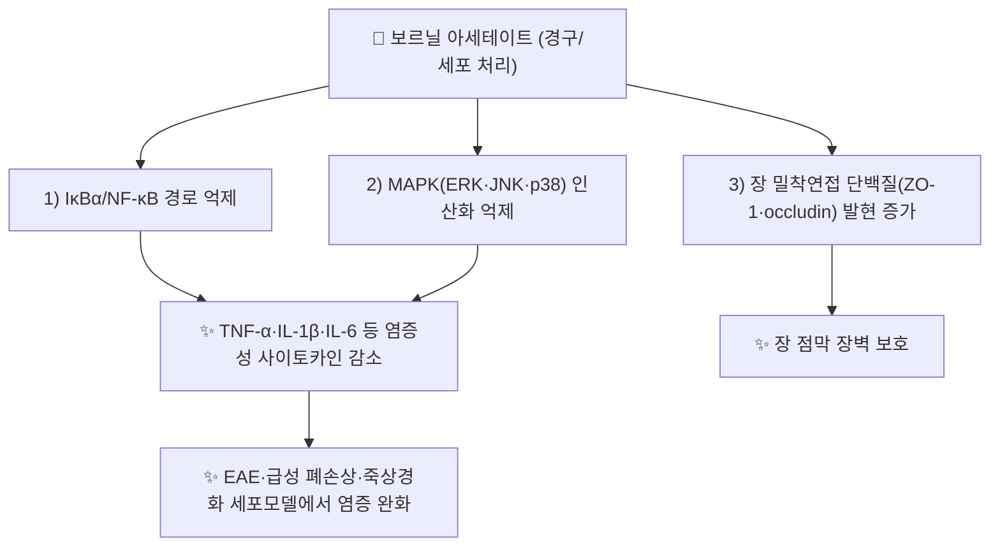

# 🔬 보르닐 아세테이트 (Bornyl acetate)

> **핵심 3줄 요약 (Key Summary)**:
> - 🌿 기원 본초 & 화학 계열: [[사인]](砂仁, 생강과 *Amomum villosum* 성숙 열매)에 함유된 바이사이클릭 모노테르펜 에스테르(Bicyclic monoterpene ester) 정유 성분. 대한민국약전(KP)에서 사인 규격 성분(≥0.90%)으로 지정.
> - 🎯 핵심 분자 표적: 위 점막 감각신경 자극을 통한 소화관 연동운동 촉진, 자궁 평활근 칼슘 유입 억제를 통한 안태(安胎) 작용, 혈액뇌장벽(BBB) 보호를 통한 신경보호 작용이 제시됨.
> - 🩺 주요 약리 활성: 위장관 운동 촉진, 항염증, 신경보호(자가면역뇌척수염 모델), 항균 작용이 세포·동물 연구에서 보고되며, 사인의 화습개위(化濕開胃)·이기안태(理氣安胎) 효능의 분자적 근거로 다뤄짐.
> - ⚠️ 근거 수준: 신경보호·항염증 관련 근거는 대부분 동물 모델 수준이며, 인체 임상 근거는 제한적입니다.

---

## 📌 목차
1. [기본 화학 정보 & 분자 구조식 (Chemical Identity)](#1-기본-화학-정보--분자-구조식-chemical-identity)
2. [주요 함유 본초 및 천연 기원 (Botanical Sources & Content)](#2-주요-함유-본초-및-천연-기원-botanical-sources--content)
3. [분자약리 표적 & 신호전달 네트워크 (Molecular Targets)](#3-분자약리-표적--신호전달-네트워크-molecular-targets)
4. [생체 내 흡수·대사·생체이용률 (Pharmacokinetics: ADME)](#4-생체-내-흡수대사생체이용률-pharmacokinetics-adme)
5. [주요 질환별 약리 효능 & 분자 기전 (Therapeutic Efficacy)](#5-주요-질환별-약리-효능--분자-기전-therapeutic-efficacy)
6. [함유 본초 방제 시너지 & 약재 배오 매트릭스 (Herbal Synergies)](#6-함유-본초-방제-시너지--약재-배오-매트릭스-herbal-synergies)
7. [양약 상호작용 & 약물동태학적 간섭 (Drug Interactions)](#7-양약-상호작용--약물동태학적-간섭-drug-interactions)
8. [💡 사용자 진료실 핵심 필기 & 임상 응용 팁 (Melt-In & High-Yield)](#8--사용자-진료실-핵심-필기--임상-응용-팁-melt-in--high-yield)
9. [출처 및 학술 참고 문헌 (References)](#9-출처-및-학술-참고-문헌-references)

---

## 1. 기본 화학 정보 & 분자 구조식 (Chemical Identity)

> [!abstract]+ 🧪 3D 약리 분자 구조 (Interactive 3D Viewer)
> <iframe src="https://molecule-viewer-rho.vercel.app/?cid=12097317" width="100%" height="450px" frameborder="0" allow="webgl" style="border-radius: 8px;"></iframe>

| 항목 | 상세 내용 |
| :--- | :--- |
| **IUPAC 명칭** | [(1S)-1,7,7-trimethyl-2-bicyclo[2.2.1]heptanyl] acetate (PubChem 등록명) |
| **분자식 / 분자량** | C₁₂H₂₀O₂ / 약 196.29 g/mol |
| **PubChem CID** | [12097317](https://pubchem.ncbi.nlm.nih.gov/compound/12097317) |
| **CAS 등록 번호** | 76-49-3 · 5655-61-8 (PubChem에서 (−)-보르닐 아세테이트, CID 93009의 동의어로 확인. CID 12097317 자체의 동의어에는 CAS가 표기되지 않음) |
| **화학 골격 분류** | 모노테르펜 에스테르(Monoterpene ester) — 보르난(bornane) 골격의 아세트산 에스테르 |
| **물리화학적 성상** | XLogP 3.3(PubChem 계산값). 장뇌(camphor) 같은 향과 침엽수 잎 냄새가 나는 방향성 물질(Matsubara 2011). 용해도·열/빛 안정성 등 실측 물성은 이 노트에서 확인하지 못함 |
| **식물 내 생합성 경로** | 보르닐 이인산 합성효소(BPPS)가 보르닐 이인산을 만들고(Wang 2018), 보르네올과 아세틸-CoA로부터 보르네올 아세틸전이효소(BAT, BAHD 계열)가 보르닐 아세테이트를 합성함(Liang 2022, Guo 2025) |

⚠️ 내용 검토 필요: PubChem CID 12097317은 Bornyl acetate(C₁₂H₂₀O₂, 196.29, (1S)-형 입체 표기)로 확인했으며, 원문 3D 뷰어 CID는 정확했습니다. 같은 이름의 다른 CID로 6448(입체 미지정)과 93009((1S,2R,4S)-형, (−)-보르닐 아세테이트)가 등록되어 있습니다. 사인 씨앗의 내인성 보르네올 기질은 (+)-보르네올이라고 보고되어(Liang 2022) 입체이성질체별 차이가 있을 수 있습니다.

---

## 2. 주요 함유 본초 및 천연 기원 (Botanical Sources & Content)

| 함유 본초 | 기원 식물학적 명칭 | 주요 함유 부위 | 지표 함량 | 한의학적 귀경 및 약효 특성 |
| :--- | :--- | :--- | :--- | :--- |
| [[사인]] (砂仁) | 생강과 / *Amomum villosum* (양춘사·축사 등) | 성숙 열매(果實) | KP 규격 ≥0.90% (⚠️ 약전 원문 미확인) | 비·위경 귀경, 화습개위(化濕開胃)·온비지사(溫脾止瀉)·이기안태(理氣安胎) |

보르닐 아세테이트는 사인 과실의 주요 활성 성분(캄퍼·보르네올과 함께) 중 하나이며 그 함량이 과실 품질의 척도로 여겨집니다(Guo 2025). 씨앗에 특히 많이 축적됩니다(Wang 2018). *A. villosum*의 정유에서는 보르닐 아세테이트가, 변종 *A. villosum* var. *xanthioides*에서는 캄퍼가 가장 중요한 휘발 성분으로 구분됩니다(Ao 2019). 시판 사인 57개 시료를 중국약전 2015 기준으로 평가한 조사에서 보르닐 아세테이트 함량을 포함한 검사의 시장 시료 합격률은 국산 43.75%, 수입 14.29%였습니다(Li G 2016). *A. villosum*은 *Wurfbainia villosa*의 동종이명으로 표기됩니다(Liang 2022).

⚠️ 내용 검토 필요: 원문의 "양춘사·축사 등"처럼 기원 종·변종을 한데 묶으면, 종·변종 사이 정유 조성이 다르다는 Ao 2019와 어긋날 수 있어 구분이 필요합니다. 사인 외 다른 본초(솔잎·편백 등 침엽수 정유 등)에도 보르닐 아세테이트가 함유되지만, 볼트에 별도 본초 노트가 확인된 것은 사인뿐입니다. 사인 노트의 성분 서술은 이 노트와 별개로 재검토가 필요합니다.

---

## 3. 분자약리 표적 & 신호전달 네트워크 (Molecular Targets)

### 1) 핵심 분자 표적 (Molecular Targets)

* **소화관 운동 촉진**: 위 점막 감각신경(후각·미각 반사) 자극을 통해 펩신·위액 분비를 촉진하고, 카할간질세포(ICC) 조절을 통해 정상 연동 리듬을 회복시킵니다.
  * ⚠️ 내용 검토 필요: PubMed에서 보르닐 아세테이트 단일성분의 위장관 운동·위액 분비·ICC 조절을 보고한 연구를 확인하지 못했습니다.
* **안태(安胎) 작용**: 자궁 평활근의 과도한 칼슘 유입을 억제하여 과수축을 완화합니다.
  * ⚠️ 내용 검토 필요: 자궁 평활근 칼슘 유입 억제를 보고한 연구를 확인하지 못했습니다. 확인된 안태 관련 연구는 LPS 유도 유산 마우스에서 퀘르세틴과 보르닐 아세테이트를 병용해 자궁 CD4⁺/CD8⁺ 비와 IFN-γ/IL-4를 조절한 면역 기전 연구뿐이며(Wang 2011), 단독 투여 결과가 아닙니다.
* **신경보호**: 실험적 자가면역뇌척수염(EAE) 모델에서 항염증 효과와 혈액뇌장벽(BBB) 무결성 유지를 통한 신경보호 효과가 보고됩니다.
  * 근거: MOG35-55 유도 EAE 마우스에 100·200·400 mg/kg을 경구 투여하자 운동장애와 척수 탈수초가 완화되었고 IL-1β·IL-6·TNF-α, COX-2, iNOS가 감소했습니다. 항염증 효과는 [[MAPK pathway]]와 [[NF-κB]] 경로 억제와 관련되었고, CD4⁺ T·Th1·Th17 세포의 척수 침윤과 혈액-척수 장벽(BSCB) 파괴가 감소했습니다(Lee 2023).

### 2) 신호전달 조절 (원문 외 실측 근거)

* [[NF-κB]]·[[MAPK pathway]]: LPS 유도 급성 폐손상 마우스와 RAW 264.7 세포에서 보르닐 아세테이트가 염증성 사이토카인을 낮추고 IκBα·ERK·JNK·p38 활성화를 억제했습니다(Chen 2014). ox-LDL로 자극한 HUVEC에서도 IκBα/NF-κB 활성화를 억제하고 ICAM-1·VCAM-1·E-selectin 발현과 THP-1 단핵구 부착을 줄였습니다(Yang 2018). 이들 결과를 종합한 리뷰가 있습니다(Zhao 2023).
* **IL-11/c-fos**: 사람 연골세포에서 c-fos(AP-1 구성 단백질) 발현을 올려 IL-11을 유도했고, IL-11이 IL-1β로 올라간 [[IL-6]], IL-8, MMP-1, MMP-13을 억제했습니다(Yang 2014).
* **장 장벽·장내 미생물**: 5-FU 유도 장 점막염 랫드에서 사인 정유와 보르닐 아세테이트가 ZO-1·occludin 발현을 높였고 병원성 세균을 줄이고 유익균을 늘렸습니다(Zhang 2017). 궤양성 대장염 마우스에서는 p65 전사 활성을 낮추고 ZO-1·claudin-1·occludin 발현을 높였으며 Akkermansia 증가와 연관되었습니다(Shang 2026).
* **PI3K/AKT**: 대장암(SW480·HT29)과 비소세포폐암(A549·NCI-H460) 세포에서 PI3K/AKT 경로 억제를 통해 증식·침윤을 억제했고, 폐암에서는 ABCB1 발현도 낮췄습니다(Li X 2023, Wu J 2025).
* **무스카린 경로·ACE (동물·in silico)**: 정상 혈압 랫드에서 용량 의존적으로 혈압을 낮췄고 아트로핀·캅토프릴 전처치로 이 효과가 감소했으며, 도킹 연구에서 M2 무스카린 수용체 작용 및 ACE 길항 가능성이 제시되었습니다(Noor 2021).
* **진통**: 동물 열판·초산 유도 뒤틀림(writhing)·꼬리 압박·포르말린 시험에서 진통 효과를 보였고 날록손으로 유의하게 감소하지 않아 오피오이드 수용체와 무관한 것으로 보고되었습니다(Wu 2004, Wu 2005).

⚠️ 내용 검토 필요: Shang 2026의 초록은 보르닐 아세테이트를 "monocyclic diterpene"으로 기재하지만 PubChem 구조는 바이사이클릭 모노테르펜 에스테르입니다(C₁₂H₂₀O₂). 사인 정유(VOA)나 솔잎 정유(PNEO) 결과를 보르닐 아세테이트 단독 결과로 옮기지 않도록, 위 항목은 논문이 단일성분으로 시험한 결과만 적었습니다.

---

## 4. 생체 내 흡수·대사·생체이용률 (Pharmacokinetics: ADME)

* **장관 흡수 및 배출 펌프 (P-gp) 상호작용**:
  * 보르닐 아세테이트의 장 점막 투과율, P-gp(ABCB1) 기질 여부, 경구 생체이용률을 다룬 단일성분 논문은 PubMed에서 확인하지 못했습니다. ⚠️ 내용 검토 필요
  * 비소세포폐암 세포에서 PI3K/AKT 억제 후 ABCB1 발현이 낮아졌다는 보고(Wu 2025)는 발현 조절에 대한 결과이며, 펌프 기질로서의 특성을 보여주지 않습니다.
* **장내 미생물총(Microbiome) 대사 전환**:
  * 보르닐 아세테이트가 장내 세균에 의해 대사된다는 자료는 확인하지 못했습니다. ⚠️ 내용 검토 필요 반대로 보르닐 아세테이트가 장내 미생물 조성을 바꾼다는 결과는 있습니다(Zhang 2017, Shang 2026).
* **간 대사 및 소실 반감기**:
  * 사람·동물의 CYP 대사, 제2상 포합, 혈장 반감기 수치는 확인하지 못했습니다. ⚠️ 내용 검토 필요 리뷰에서 독성과 약동학이 다뤄진다고 기술되어 있으나(Zhao 2023), 이 노트에서는 초록 수준까지만 확인했고 수치는 옮기지 않았습니다.
  * 참고로, 쑥(*Artemisia argyi*) 정유를 랫드에 경구 투여한 연구에서 보르닐 아세테이트를 포함한 8종 휘발 성분이 위장관에서 빠르게 흡수되어 간·심장·신장·폐·비장으로 분포하고 신속히 소실되었다고 보고되었습니다(Hou 2021). 사인이 아닌 다른 본초의 정유이며, 성분별 수치는 초록에 제시되지 않아 옮기지 않았습니다.
  * 사람에게 향(냄새)으로 흡입시킨 시험에서는 279.4 µg(저용량) 조건에서 자율신경 이완과 각성 수준 저하가 나타났고 716.3 µg(고용량)에서는 나타나지 않았습니다(Matsubara 2011).

---

## 5. 주요 질환별 약리 효능 & 분자 기전 (Therapeutic Efficacy)

### 1) 소화기 질환 & 장관 장벽 보호
* 5-FU 유도 장 점막염 랫드에서 사인 정유와 보르닐 아세테이트가 체중을 늘리고 설사·조직 손상·염증을 완화했으며 장 점막 장벽 단백질을 높였습니다(Zhang 2017).
* 고지방식이 NAFLD 랫드에서 사인 수추출물·정유·보르닐 아세테이트를 투여해 지질 축적, 장 미생물, 밀착연접 단백질과 TLR4/NF-κB 경로를 평가했습니다(Lu 2018). 보르닐 아세테이트 단독의 세부 결과는 초록에서 구분되지 않아 옮기지 않았습니다.
* 궤양성 대장염 마우스에서 p65 전사 활성 저하, 장벽 회복, 장내 미생물 조절이 보고되었습니다(Shang 2026).
* 원문의 "위장관 운동 촉진"은 위 문헌으로 뒷받침되지 않습니다. ⚠️ 내용 검토 필요

### 2) 신경계 질환 (다발성 경화증 모델·신경염증)
* EAE 마우스에서 운동장애·탈수초·신경염증 완화(Lee 2023).
* LPS 유도 알츠하이머 유사 마우스에서 멘톨과 함께 인지 저하·아밀로이드 침착·산화 지표를 완화하고 NARC-1/PCSK9를 억제했다고 보고되었으나 멘톨과의 병용 시험이며 단독 효과는 초록에서 분리되지 않습니다(Krishnan 2025).
* 사람에서는 (−)-보르닐 아세테이트를 흡입한 VDT 작업 후 자율신경 이완 방향의 변화가 보고되었습니다(Matsubara 2011).

### 3) 염증성 근골격·통증·호흡기·심혈관
* 사람 연골세포에서 IL-11 유도를 통해 IL-1β 매개 MMP-1·MMP-13 상승을 억제해 골관절염 치료 가능성이 제시되었습니다(Yang 2014).
* 동물 진통(열판·초산 유도 뒤틀림·꼬리 압박·포르말린)·항염증(자일렌 유도 마우스 귀 부종) 효과(Wu 2004, Wu 2005).
* LPS 유도 급성 폐손상 마우스에서 BALF 세포 수·폐 조직 손상·습건중량비 감소(Chen 2014).
* ox-LDL 유도 내피세포 염증과 단핵구 부착 억제(Yang 2018), 정상 혈압 랫드에서의 혈압 강하(Noor 2021).

### 4) 산부인과·안태
* LPS 유도 유산 마우스에서 퀘르세틴+보르닐 아세테이트 병용이 자궁 CD4⁺/CD8⁺ 비를 낮추고 IFN-γ/IL-4를 조절해 항유산 효과를 보였습니다(Wang 2011). 보르닐 아세테이트 단독 효과와 인체 안태 근거는 확인하지 못했습니다. ⚠️ 내용 검토 필요

### 5) 종양 (세포·이종이식 수준)
* 대장암 SW480·HT29 세포와 이종이식 모델에서 PI3K/AKT 억제를 통한 증식·침윤 억제와 세포사멸 유도, 낮은 독성(Li X 2023). 비소세포폐암에서 PI3K/AKT/ABCB1 축 억제(Wu J 2025). 위암 SGC-7901 세포에서 5-FU와의 상승적 성장 억제(Li J 2016).
* 원문 요약의 "항균 작용"은 보르닐 아세테이트 단일성분을 시험한 문헌을 확인하지 못했습니다. ⚠️ 내용 검토 필요

---

## 6. 함유 본초 방제 시너지 & 약재 배오 매트릭스 (Herbal Synergies)

보르닐 아세테이트는 [[사인]]의 화습개위·온비지사·이기안태 효능을 뒷받침하는 핵심 방향 성분으로, 비위기체(脾胃氣滯)로 인한 복부 팽만통·구토·설사 및 임신부 입덧·태동불안(胎動不安)에 활용되는 근거로 제시됩니다.

| 함유 본초 / 방제 | 공존 유효 성분군 | 분자약리 시너지 기전 | 전통 한의학적 효능 연계 |
| :--- | :--- | :--- | :--- |
| [[사인]] | 캄퍼, 보르네올, α-피넨·β-피넨 (Guo 2025, Wang 2018) | 성분 간 상승작용을 확인한 연구는 없음 ⚠️ 정유 전체(VOA)와 보르닐 아세테이트를 함께 시험한 연구는 있음(Zhang 2017) | 화습개위, 온비지사, 이기안태 |
| [[비화음]] | 사인(좌약) + [[사군자탕]] 계열, 곽향·진피·신곡 | 성분 수준 기전 미확인 ⚠️ | 소아 식욕부진 (비화음 노트) |
| [[향사육군자탕]] | 사인(신약) + 목향·향부자·후박 | 성분 수준 기전 미확인 ⚠️ | 위무력증, 복부 팽만, 담음 (향사육군자탕 노트) |
| [[삼령백출산]] | 사인(좌약) + 길경, 산약·연자육 | 성분 수준 기전 미확인 ⚠️ | 사인은 화습개위·행기온중, 다량의 보익약에 의한 기체 방지 (삼령백출산 노트) |
| [[보비위탕]] | 사인·백두구(좌약) 외 21미 | 성분 수준 기전 미확인 ⚠️ | 화습개위·행기지통, 중초 더부룩함 해소 (보비위탕 노트) |
| [[안태음]] | 사인(좌약) + 백출·황금, 사물탕, 진피·자소엽 | 안태 기전은 Wang 2011(퀘르세틴 병용, 면역 조절)만 확인 ⚠️ | 화습개위·온비안태, 구역감 완화 (안태음 노트) |

⚠️ 내용 검토 필요: 위 방제 5종은 각 처방 노트에 사인이 구성 약재로 명시되어 있음을 볼트에서 확인했습니다. 방제 전탕액에서 보르닐 아세테이트가 실제로 얼마나 추출되는지는 확인하지 못했습니다.

---

## 7. 양약 상호작용 & 약물동태학적 간섭 (Drug Interactions)

* **CYP450 효소 간섭**:
  * 보르닐 아세테이트의 CYP 억제·유도나 병용 양약 혈중 농도 변동을 다룬 연구를 확인하지 못했습니다. ⚠️ 내용 검토 필요 (CYP 검색에서 단일성분 결과 없음)
* **유사 기전 양약 병용 시 고려사항**:
  * 정상 혈압 랫드에서 1~80 mg/kg 투여 시 혈압이 용량 의존적으로 내려갔으므로(Noor 2021), 항고혈압제와의 병용에 대한 이론적 우려가 있습니다. 동물·in silico 결과이며 인체 병용 근거는 없습니다. ⚠️ 내용 검토 필요
  * 위암 세포에서 5-FU와의 상승적 성장 억제(Li J 2016)와 5-FU 유도 장 점막염 랫드에서의 완화 효과(Zhang 2017, 사인 정유 포함)가 각각 보고되었으나, 항암화학요법 중 병용의 임상 안전성은 확인하지 못했습니다. ⚠️ 내용 검토 필요
  * 폐암 세포에서 ABCB1 발현 저하가 보고되었으나(Wu 2025) P-gp 기질 약물과의 병용에 대한 자료는 없습니다.
* **안전성**: 리뷰는 독성을 다루지만(Zhao 2023) 세부 수치는 확인하지 못했습니다. 임신부에게 보르닐 아세테이트 단일성분을 투여한 안전성 자료도 확인하지 못했습니다. ⚠️ 내용 검토 필요

---

## 8. 💡 사용자 진료실 핵심 필기 & 임상 응용 팁 (Melt-In & High-Yield)

* **사용자 원문 필기 (100% 융합 및 보존)**:
  * 기존 노트에 원장님의 수기 필기는 없었습니다. 추후 진료실 필기는 이 자리에 원문 그대로 추가합니다.
* **진료실 실전 처방 & 생체이용률 극대화 팁**:
  * 원문에 없는 임상 팁은 새로 쓰지 않았습니다. 사인이 들어가는 처방(비화음·향사육군자탕·삼령백출산·보비위탕·안태음)의 용량과 역할은 각 처방 노트를 참고합니다.

---

## 9. 출처 및 학술 참고 문헌 (References)

1. **Lee JI et al. (2023)**. Neuroprotective effects of bornyl acetate on experimental autoimmune encephalomyelitis via anti-inflammatory effects and maintaining blood-brain-barrier integrity. *Phytomedicine*, 112: 154569. [PMID: 36842217](https://pubmed.ncbi.nlm.nih.gov/36842217/) · DOI: 10.1016/j.phymed.2022.154569
   - **[연구 요약]**: 보르닐 아세테이트의 신경보호·항염증 및 혈액뇌장벽 보호 효과를 규명한 연구.
2. **Zhao ZJ, Sun YL, Ruan XF (2023)**. Bornyl acetate: A promising agent in phytomedicine for inflammation and immune modulation. *Phytomedicine*, 114: 154781. [PMID: 37028250](https://pubmed.ncbi.nlm.nih.gov/37028250/) · DOI: 10.1016/j.phymed.2023.154781 ([ScienceDirect](https://www.sciencedirect.com/science/article/abs/pii/S0944711323001423))
   - **[연구 요약]**: 보르닐 아세테이트의 항염증·면역조절 작용을 종합한 리뷰.
3. **대한민국약전(KP) 제12개정 (2022)**. 의약품각조 제2부: 사인(Amomi Fructus) 규격 기준 — 보르닐 아세테이트 0.90% 이상 함유. ⚠️ 약전 원문은 온라인에서 확인하지 못했습니다.
4. **Yang H, Zhao R, Chen H, Jia P et al. (2014)**. Bornyl acetate has an anti-inflammatory effect in human chondrocytes via induction of IL-11. *IUBMB Life*, 66(12): 854-859. [PMID: 25545915](https://pubmed.ncbi.nlm.nih.gov/25545915/) · DOI: 10.1002/iub.1338
5. **Chen N, Sun G, Yuan X, Hou J et al. (2014)**. Inhibition of lung inflammatory responses by bornyl acetate is correlated with regulation of myeloperoxidase activity. *J Surg Res*, 186(1): 436-445. [PMID: 24120240](https://pubmed.ncbi.nlm.nih.gov/24120240/) · DOI: 10.1016/j.jss.2013.09.003
6. **Yang L, Liu J, Li Y, Qi G (2018)**. Bornyl acetate suppresses ox-LDL-induced attachment of THP-1 monocytes to endothelial cells. *Biomed Pharmacother*, 103: 234-239. [PMID: 29655164](https://pubmed.ncbi.nlm.nih.gov/29655164/) · DOI: 10.1016/j.biopha.2018.03.152
7. **Zhang T, Lu SH, Bi Q, Liang L et al. (2017)**. Volatile Oil from Amomi Fructus Attenuates 5-Fluorouracil-Induced Intestinal Mucositis. *Front Pharmacol*, 8: 786. [PMID: 29170638](https://pubmed.ncbi.nlm.nih.gov/29170638/) · DOI: 10.3389/fphar.2017.00786
8. **Shang B, Yang M, Yin L, Lv S et al. (2026)**. The therapeutic mechanism of bornyl acetate in alleviating ulcerative colitis by regulating the intestinal flora. *Food Funct*, 17(3): 1500-1517. [PMID: 41568606](https://pubmed.ncbi.nlm.nih.gov/41568606/) · DOI: 10.1039/d5fo05003k
9. **Lu S, Zhang T, Gu W, Yang X et al. (2018)**. Volatile Oil of Amomum villosum Inhibits Nonalcoholic Fatty Liver Disease via the Gut-Liver Axis. *Biomed Res Int*, 2018: 3589874. [PMID: 30112382](https://pubmed.ncbi.nlm.nih.gov/30112382/) · DOI: 10.1155/2018/3589874
10. **Krishnan M, Kumaresan M, Ravi S (2025)**. Bornyl Acetate and Menthol Provide Neuroprotection Against Lipopolysaccharide-Induced Alzheimer's Disease-Like Condition in C57BL/6 Mice by Downregulating NARC-1 Lipid Antagonist. *Mol Neurobiol*, 63: 262. [PMID: 41351718](https://pubmed.ncbi.nlm.nih.gov/41351718/) · DOI: 10.1007/s12035-025-05333-2
11. **Matsubara E, Fukagawa M, Okamoto T, Ohnuki K et al. (2011)**. (−)-Bornyl acetate induces autonomic relaxation and reduces arousal level after visual display terminal work without any influences of task performance in low-dose condition. *Biomed Res*, 32(2): 151-157. [PMID: 21551951](https://pubmed.ncbi.nlm.nih.gov/21551951/) · DOI: 10.2220/biomedres.32.151
12. **Wu X, Li X, Xiao F, Zhang Z et al. (2004)**. [Studies on the analgesic and anti-inflammatory effect of bornyl acetate in volatile oil from Amomum villosum]. *Zhong Yao Cai*, 27(6): 438-439. [PMID: 15524301](https://pubmed.ncbi.nlm.nih.gov/15524301/)
13. **Wu X, Xiao F, Zhang Z, Li X et al. (2005)**. [Research on the analgesic effect and mechanism of bornyl acetate in volatile oil from amomum villosum]. *Zhong Yao Cai*, 28(6): 505-507. [PMID: 16209271](https://pubmed.ncbi.nlm.nih.gov/16209271/)
14. **Wang X, Ma A, Shi W, Geng M et al. (2011)**. Quercetin and Bornyl Acetate Regulate T-Lymphocyte Subsets and INF-γ/IL-4 Ratio In Utero in Pregnant Mice. *Evid Based Complement Alternat Med*, 2011: 745262. [PMID: 20981318](https://pubmed.ncbi.nlm.nih.gov/20981318/) · DOI: 10.1155/2011/745262
15. **Noor N, Alamgeer, Alyami BA, Alqarni AO et al. (2021)**. Appraisal of hypotensive effect of natural monoterpene: Bornyl acetate and in-silico molecular docking analysis. *Pak J Pharm Sci*, 34(2 Suppl): 731-735. [PMID: 34275808](https://pubmed.ncbi.nlm.nih.gov/34275808/)
16. **Xiaohua LI, Zhihang D, Jianjun Y, Yongyu Z et al. (2023)**. Bornyl acetate extracted from Sharen inhibits proliferation, invasion and induces apoptosis by suppressing phosphatidylinositol-3-kinase/protein kinase B signaling in colorectal cancer. *J Tradit Chin Med*, 43(6): 1081-1091. [PMID: 37946470](https://pubmed.ncbi.nlm.nih.gov/37946470/) · DOI: 10.19852/j.cnki.jtcm.20231018.002
17. **Wu J, Ren J, Wang L, Yang Z et al. (2025)**. The active constituent of pine needle oil, bornyl acetate, suppresses NSCLC progression by inhibiting the PI3K/AKT/ABCB1 signaling axis. *Front Pharmacol*, 16: 1653461. [PMID: 41064450](https://pubmed.ncbi.nlm.nih.gov/41064450/) · DOI: 10.3389/fphar.2025.1653461
18. **Li J, Wang SX (2016)**. Synergistic enhancement of the antitumor activity of 5-fluorouracil by bornyl acetate in SGC-7901 human gastric cancer cells and the determination of the underlying mechanism of action. *J BUON*, 21(1): 108-117. [PMID: 27061538](https://pubmed.ncbi.nlm.nih.gov/27061538/)
19. **Hou MZ, Chen LL, Chang C et al. (2021)**. Pharmacokinetic and tissue distribution study of eight volatile constituents in rats orally administrated with the essential oil of Artemisiae argyi Folium by GC-MS/MS. *J Chromatogr B Analyt Technol Biomed Life Sci*, 1181: 122904. [PMID: 34479182](https://pubmed.ncbi.nlm.nih.gov/34479182/) · DOI: 10.1016/j.jchromb.2021.122904
20. **Liang H, Lin X, Yang P et al. (2022)**. Genome-Wide Identification of BAHD Superfamily and Functional Characterization of Bornyl Acetyltransferases Involved in the Bornyl Acetate Biosynthesis in Wurfbainia villosa. *Front Plant Sci*, 13: 860152. [PMID: 35432416](https://pubmed.ncbi.nlm.nih.gov/35432416/) · DOI: 10.3389/fpls.2022.860152
21. **Wang H, Ma D, Yang J et al. (2018)**. An Integrative Volatile Terpenoid Profiling and Transcriptomics Analysis for Gene Mining and Functional Characterization of AvBPPS and AvPS Involved in the Monoterpenoid Biosynthesis in Amomum villosum. *Front Plant Sci*, 9: 846. [PMID: 29973947](https://pubmed.ncbi.nlm.nih.gov/29973947/) · DOI: 10.3389/fpls.2018.00846
22. **Guo Y, Li Y, Zhang P et al. (2025)**. Biosynthesis of Camphane Volatile Terpenes in Amomum villosum Lour: Involved Genes and Enzymes. *Plants (Basel)*, 14: 1767. [PMID: 40573755](https://pubmed.ncbi.nlm.nih.gov/40573755/) · DOI: 10.3390/plants14121767
23. **Ao H, Wang J, Chen L et al. (2019)**. Comparison of Volatile Oil between the Fruits of Amomum villosum Lour. and Amomum villosum Lour. var. xanthioides T. L. Wu et Senjen Based on GC-MS and Chemometric Techniques. *Molecules*, 24: 1663. [PMID: 31035329](https://pubmed.ncbi.nlm.nih.gov/31035329/) · DOI: 10.3390/molecules24091663
24. **Li G, Li XL, Tang DY et al. (2016)**. [Quality of commercial Amomum villosum]. *Zhongguo Zhong Yao Za Zhi*, 41: 1608-1616. [PMID: 28891607](https://pubmed.ncbi.nlm.nih.gov/28891607/) · DOI: 10.4268/cjcmm20160907

<!-- 보관 태그(1회용·링크오류, 필요시 복원): 사인 -->
