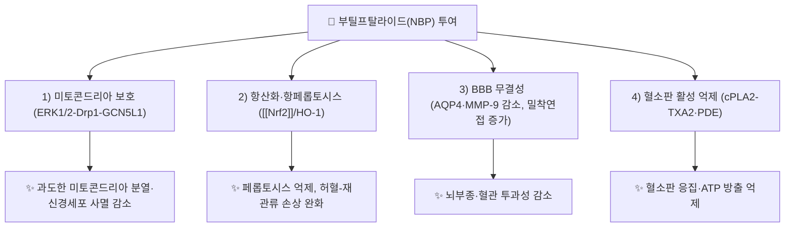

---
aliases:
  - n-Butylphthalide
  - 3-n-Butylphthalide
  - NBP
  - 부틸프탈라이드
tags:
  - 약리
  - 약리성분
  - 프탈라이드
title: 부틸프탈라이드
date: 2026-09-21
출처: PMID 41320852
---

# 🔬 부틸프탈라이드 (n-Butylphthalide, NBP)

> **핵심 3줄 요약 (Key Summary)**:
> - 🌿 기원 본초 & 화학 계열: [[고본]](藁本, 산형과 *Ligusticum sinense*/*L. tenuissimum* 뿌리줄기)에 함유된 프탈라이드(Phthalide)계 정유 성분으로, [[리구스틸라이드]]와 함께 고본·천궁 계열 산형과 본초의 지표 성분.
> - 🎯 핵심 분자 표적: 혈뇌장벽(BBB) 투과를 통한 중추신경계 작용, 미토콘드리아 보호·항산화·항혈소판 응집을 통한 뇌허혈 손상 완화 기전이 제시됨.
> - 🩺 주요 약리 활성: 신경보호, 뇌혈류 개선, 인지기능 개선 작용이 다수의 임상시험을 거쳐 **중국에서 dl-3-n-부틸프탈라이드(DL-NBP)가 허혈성 뇌졸중 치료제로 정식 승인**되어 사용 중이며, 고본의 거풍산한(祛風散寒)·통규지통(通竅止痛) 효능의 현대적 근거로 다뤄짐.
> - ⚠️ 유의사항: 임상 승인·시판된 것은 화학 합성 dl-NBP 제제이며, 고본 유래 천연 성분으로서의 임상 용량·안전성 자료는 상대적으로 제한적입니다. 또한 대사체 3-hydroxy-NBP를 통한 간독성 기전이 보고되어 있고(§4·§7), 인체 CYP 상호작용의 임상적 의미는 확인되지 않았습니다.

---

## 📌 목차
1. [기본 화학 정보 & 분자 구조식 (Chemical Identity)](#1-기본-화학-정보--분자-구조식-chemical-identity)
2. [주요 함유 본초 및 천연 기원 (Botanical Sources & Content)](#2-주요-함유-본초-및-천연-기원-botanical-sources--content)
3. [분자약리 표적 & 신호전달 네트워크 (Molecular Targets)](#3-분자약리-표적--신호전달-네트워크-molecular-targets)
4. [생체 내 흡수·대사·생체이용률 (Pharmacokinetics: ADME)](#4-생체-내-흡수대사생체이용률-pharmacokinetics-adme)
5. [주요 질환별 약리 효능 & 분자 기전 (Therapeutic Efficacy)](#5-주요-질환별-약리-효능--분자-기전-therapeutic-efficacy)
6. [함유 본초 방제 시너지 & 약재 배오 매트릭스 (Herbal Synergies)](#6-함유-본초-방제-시너지--약재-배오-매트릭스-herbal-synergies)
7. [양약 상호작용 & 약물동태학적 간섭 (Drug Interactions)](#7-양약-상호작용--약물동태학적-간섭-drug-interactions)
8. [💡 사용자 진료실 핵심 필기 & 임상 응용 팁 (Melt-In & High-Yield)](#8--사용자-진료실-핵심-필기--임상-응용-팁-melt-in--high-yield)
9. [출처 및 학술 참고 문헌 (References)](#9-출처-및-학술-참고-문헌-references)

---

## 1. 기본 화학 정보 & 분자 구조식 (Chemical Identity)

> [!abstract]+ 🧪 3D 약리 분자 구조 (Interactive 3D Viewer)
> <iframe src="https://molecule-viewer-rho.vercel.app/?cid=61361" width="100%" height="450px" frameborder="0" allow="webgl" style="border-radius: 8px;"></iframe>

| 항목 | 상세 내용 |
| :--- | :--- |
| **IUPAC 명칭** | 3-butyl-3H-2-benzofuran-1-one (PubChem 등록명) |
| **분자식 / 분자량** | C₁₂H₁₄O₂ / 약 190.24 g/mol |
| **PubChem CID** | [61361](https://pubchem.ncbi.nlm.nih.gov/compound/61361) |
| **CAS 번호** | 6066-49-5 (dl-체) |
| **화학 골격 분류** | 프탈라이드(Phthalide) — 벤조퓨란온 유도체 |
| **물리화학적 성상** | PubChem 계산값 XLogP 2.8(지용성). 외관·용해도·안정성 등 그 외 성상은 이번 조회에서 확인한 자료가 없어 기재하지 않음 ⚠️ 내용 검토 필요 |
| **식물 내 생합성 경로** | 천궁(*Ligusticum chuanxiong*)에서 Fe(II)/2-옥소글루타르산 의존성 다이옥시게나제 4종과 CYP 2종이 프탈라이드 C-4/C-5 탈포화효소(P4,5D)로 규명되어 (S)-3-n-butylphthalide와 butylidenephthalide 생성을 촉진함(Nie 2024). 고본에서의 경로는 확인되지 않음 ⚠️ |

> **입체이성질체 참고**: 셀러리(*Apium graveolens*) 씨앗에서 분리된 것은 l-3-n-butylphthalide이며, 중국에서 승인된 것은 이를 바탕으로 합성한 라세미체(dl-NBP)입니다(Wang 2018). CID 61361은 PubChem에서 dl-3-n-butylphthalide 등을 동의어로 갖는 항목(Butylphthalide)입니다.

---

## 2. 주요 함유 본초 및 천연 기원 (Botanical Sources & Content)

| 함유 본초 | 기원 식물학적 명칭 | 주요 함유 부위 | 지표 함량 | 한의학적 귀경 및 약효 특성 |
| :--- | :--- | :--- | :--- | :--- |
| [[고본]] (藁本) | 산형과 / *Ligusticum sinense*, *L. tenuissimum* | 뿌리줄기 및 뿌리(根莖) | *L. sinense* Chaxiong(茶芎) 재배종 뿌리줄기 정유(VOC) 중 NBP 1.38%(정유 기준이며 생약 자체의 함량이 아님, Hu 2021) ⚠️ 표준 고본·*L. tenuissimum*의 함량은 확인하지 못함 | 방광경 귀경, 거풍산한(祛風散寒)·승습지통(勝濕止痛)·통규지통(通竅止痛) |
| [[천궁]] (川芎) | 산형과 / *Ligusticum chuanxiong* | 뿌리줄기 | 확인하지 못함 ⚠️ (Wang 2019가 천궁 추출물 투여 랫드 혈장에서 리구스틸라이드·dl-3-n-butylphthalide·센키눌라이드 A를 정량한 제목 기준 근거만 확인) | 자세한 귀경·효능은 [[천궁]] 노트 참조 |
| 셀러리 씨앗 (*Apium graveolens*) | 산형과 / *Apium graveolens* | 씨앗 | 확인하지 못함 | 볼트에 본초 노트 없음. NBP가 처음 분리된 원천으로 다수 논문(Cui 2013, Wang 2018, Zhang 2025)이 기술 |

**⚠️ 내용 검토 필요 — 기원 서술의 근거 범위**
- 원문 요약의 "고본·천궁 계열 산형과 본초의 **지표 성분**"은 약전상 정량 지표(기준) 성분이라는 근거를 이번 조회에서 확인하지 못했습니다. 확인된 것은 Chaxiong 재배종 뿌리줄기 정유에서의 NBP 검출(Hu 2021)과, *L. sinense* **지상부**에서 butylphthalide가 분리되었다는 보고(Liu 2025)입니다.
- 고본 뿌리줄기·뿌리(Ligustici Rhizoma et Radix)는 중국약전에 *L. sinense*와 *L. jeholense*로 수록되어 있고, 풍한두통·감기·관절통에 전통적으로 쓰였다고 정리됩니다(Liu 2024). *L. tenuissimum*에서 NBP가 검출되었다는 문헌은 PubMed 검색에서 찾지 못했습니다.

---

## 3. 분자약리 표적 & 신호전달 네트워크 (Molecular Targets)

> 위 도식의 각 경로는 세포·동물(랫드/마우스) 또는 인체 혈소판 시험관 실험에서 확인된 것입니다. 인체 뇌조직에서 같은 경로가 작동한다는 근거는 이번 조회에서 확인하지 못했습니다.

* **신경보호**: 미토콘드리아 기능 보호, 산화스트레스 억제, 항세포사멸(anti-apoptotic) 기전을 통해 허혈성 뇌손상을 완화합니다.
* **뇌혈류 개선**: 혈액뇌장벽(BBB) 무결성 회복 및 미세혈관 재구성을 통한 뇌혈류 개선 효과가 보고됩니다.
* **항혈소판 응집**: 혈소판 응집 억제를 통한 항혈전 작용이 제시됩니다.

### 1) 핵심 분자 표적 (Molecular Targets)
* **미토콘드리아 (ERK1/2–Drp1–GCN5L1)**: 산소-포도당 결핍(OGD)을 준 신경세포와 마우스 dMCAO 모델에서 NBP는 허혈/저산소로 인한 미토콘드리아 기능 손상과 신경세포사멸을 완화했습니다. 기전은 ERK1/2 신호를 막아 Drp1 인산화를 줄이고, Drp1과 GCN5L1의 상호작용 및 Drp1 아세틸화, 과도한 미토콘드리아 분열을 억제하는 것으로 보고되었습니다(Zhang 2025, PMID 41320852).
* **Nrf2/HO-1 · 페롭토시스**: 랫드 MCAO/R 모델에서 NBP는 신경학적 결손과 뇌경색 부피를 줄이고 [[Nrf2]] 핵 이동과 HO-1 발현을 올렸습니다. Nrf2 특이 억제제 ML385 병용군을 두어 Nrf2/HO-1 경로 의존성을 검증한 설계이며, 병용군 결과는 확인한 초록이 잘려 있어 기재하지 않습니다(Sun 2024, PMID 39353831).
* **BBB 무결성**: 랫드 MCAO 모델에서 NBP(90 mg/kg, 3일)는 뇌부종·경색 부피를 줄이고 [[eNOS]] 발현과 표면 혈류를 늘렸으며, Evans blue·IgG 누출을 줄이고 밀착연접 단백질 발현을 높였습니다. AQP4 발현과 MMP-9 효소 활성이 감소했고 [[MAPK pathway]] 관여 가능성이 제시되었습니다(Mamtilahun 2020, PMID 33510620). 마우스 허혈-재관류 모델에서도 밀착연접 관련 단백질은 올리고 caveolin-1은 내려 혈관 투과성이 개선되었습니다(Li 2019, PMID 31247236).
* **미세혈관**: 랫드 MCAO/R에서 NBP는 뇌혈류와 미세혈관 밀도를 높이고 미세혈관 손상을 회복시켰으며, 광친화성 표지 기반 단백체 분석으로 비멘틴(vimentin, VIM)이 표적 단백질로, Arg-304 잔기가 결합 부위로 제시되었습니다(Xiao 2026, PMID 41365434).
* **항혈소판 (인체 혈소판 시험관)**: NBP는 ADP·트롬빈·U46619·아라키돈산·콜라겐으로 유도된 인체 혈소판 응집과 ATP 방출을 농도 의존적으로 억제했습니다. cPLA2 인산화를 억제해 TXA2 합성을 줄이고 세포내 칼슘 동원을 낮추었으며, 혈소판 포스포디에스테라제(PDE)를 억제해 cAMP를 높였습니다(Ye 2015, PMID 25734213).

### 2) 종합 리뷰
* 신경퇴행성질환 관련 기전 종합(Luo 2019)과 허혈성 뇌졸중 20년 연구 종합(Wang 2018: 항산화·항염증·항세포사멸·항혈전·미토콘드리아 보호)에서도 같은 다중 표적 성격이 정리됩니다.
* ⚠️ 내용 검토 필요: 원문의 "BBB 투과를 통한 중추신경계 작용"은 모체 NBP 자체의 뇌 투과율을 직접 보여준 자료를 이번에 확인하지 못했습니다. 랫드에서 대사체 3-OH-NBP와 10-OH-NBP의 뇌 노출을 비교한 연구(Diao 2015)가 있으나, 3-OH-NBP는 P-gp·BCRP 배출의 영향을 받고 뇌 노출이 10-OH-NBP의 11.8%에 그쳤습니다(§4).

---

## 4. 생체 내 흡수·대사·생체이용률 (Pharmacokinetics: ADME)

* **장관 흡수 및 배출 펌프 (P-gp) 상호작용**:
  * 인체: 200 mg 경구 투여 후 잘 흡수되고(well absorbed) 여러 효소로 광범위하게 대사된 뒤 소변으로 배설되었습니다(Diao 2013, PMID 23169608). 모체 NBP의 인체 절대 생체이용률과 P-gp 기질 여부는 이번 조회에서 확인하지 못했습니다 ⚠️.
  * 랫드에서 Chaxiong 정유 성분(NBP 포함 5종)의 경구 절대 생체이용률은 25% 미만이었고, 고체분산체·β-사이클로덱스트린 포접체로 AUC와 MRT가 증가했습니다(Hu 2021, PMID 33888111). 이는 순수 NBP가 아닌 정유 혼합물 자료입니다.
  * 랫드에서 3-OH-NBP는 P-gp·BCRP 억제제(타리퀴다르·판토프라졸) 전처치 시 Kp,uu가 유의하게 증가해 뇌 배출 수송의 영향을 받았습니다(Diao 2015, PMID 26567730).
* **장내 미생물총(Microbiome) 대사 전환**:
  * 장내 세균 대사와 장-간 순환에 대한 자료는 이번 조회에서 확인하지 못했습니다 ⚠️ 내용 검토 필요.
* **간 대사 및 소실 반감기**:
  * 인체 경구 200 mg 후 혈장·소변에서 대사체 23종이 확인되었고, 알킬 측쇄의 3-·ω-1-·ω-위 수산화와 이후 산화·포합이 주요 경로입니다. 투여량의 약 81.6%가 소변으로 회수되었으며 주로 NBP-11-oic acid(M5-2)와 그 포합체입니다. 순환 주요 대사체는 10-keto-NBP(M2), 3-hydroxy-NBP(M3-1), 10-hydroxy-NBP(M3-2), M5-2이며 AUC는 모체의 각각 1.6·2.9·10.3·4.1배입니다(Diao 2013, PMID 23169608).
  * 관여 효소: 시험관 표현형 분석에서 CYP3A4·2E1·1A2가 M3-1·M3-2·11-hydroxy-NBP 생성에 관여하고, CYP·알코올 탈수소효소(ADH)·알데하이드 탈수소효소(ALDH)가 M2·M5-2 생성에 관여했습니다(Diao 2013). 별도의 간 미세소체 연구는 인체에서 주로 CYP2E1·2C19·3A4/5가 대사한다고 보고했습니다(Zhao 2015, PMID 26234133).
  * 랫드 14C-NBP 경구(60 mg/kg): Tmax 0.75시간, 말단 반감기 9.73시간(초록 기재), 7일 회수율 소변 85.12%·분변 14.73%, 대사체 49종이며 주 경로는 산화·글루쿠론산 포합·황산 포합입니다(Tian 2021, PMID 34500404).
  * 인체 혈장 소실 반감기(t½)와 Tmax는 이번에 확인한 초록에 수치가 없어 기재하지 않습니다 ⚠️. 인체 투여 후 혈장 정량법과 주요 대사체 4종의 노출은 Diao 2013(PMID 23434525)에 보고됩니다.

---

## 5. 주요 질환별 약리 효능 & 분자 기전 (Therapeutic Efficacy)

### 1) 허혈성 뇌졸중 & 임상 응용
DL-3-n-부틸프탈라이드(DL-NBP)는 중국에서 허혈성 뇌졸중 치료제로 정식 승인되어 임상에서 사용되고 있으며, 뇌졸중 후 인지기능 저하(Post-Stroke Cognitive Impairment) 개선에 대한 다기관 무작위대조시험(End-PSCI 등)이 진행되고 있습니다.

* **승인 시점**: dl-NBP는 2002년 중국 식품의약품 관리기관에서 허혈성 뇌졸중 치료제로 승인되었다고 보고됩니다(Wang 2018). 다른 논문은 2004년 시판으로 기술합니다(Tian 2021). 승인 연도와 시판 연도를 구분해 읽어야 합니다.
* **BAST 시험 (재관류 치료 환자)**: 정맥 혈전용해 및/또는 혈관내 치료를 받은 급성 허혈성 뇌졸중 1,216명을 대상으로 한 이중맹검 위약대조 다기관 RCT에서, 90일 유리한 기능 결과가 NBP군 56.7%(344/607), 위약군 44.0%(268/609)였습니다(OR 1.70, 95% CI 1.35–2.14, P<.001). 90일 내 중대 이상반응은 NBP군 10.1%, 위약군 12.0%였습니다(Wang 2023, PMID 37358859).
* **90일 투여 시험**: 발병 48시간 이내 환자 573명을 대상으로 14일 정맥주입 후 NBP 캡슐을 이어 투여하는 군이 14일 오자그렐(ozagrel) 후 아스피린군보다 90일 mRS에서 유의하게 좋은 결과를 보였고, Barthel 지수는 군간 차이가 없었으며 이상반응 빈도는 비슷했습니다(Cui 2013, PMID 24034079).

### 2) 혈관성 인지장애 & 뇌졸중 후 인지장애
* 피질하 허혈성 소혈관질환에 의한 치매 없는 혈관성 인지장애 281명 대상 24주 RCT(NBP 200 mg 1일 3회 vs 위약)에서 ADAS-cog 변화가 NBP −2.46 vs 위약 −1.39(P=.03, ITT), CIBIC-plus 개선 환자가 57.1% vs 42.1%(P=.01)였고, NBP 관련 이상반응은 드물며 주로 경미한 위장관 증상이었습니다(Jia 2016, PMID 26086183).
* End-PSCI 시험은 뇌졸중 후 지연성 인지장애에서 DL-NBP의 효과를 평가하는 다기관 RCT이며, 이번에 확인한 것은 프로토콜(Liu 2022, PMID 36384493)뿐이고 결과 보고는 조회에서 찾지 못했습니다 ⚠️.

### 3) 편두통·두통 (동물 실험 수준)
* 니트로글리세린(NTG) 유도 만성 편두통 마우스에서 NBP(30·60·120 mg/kg 경구) 전처치가 통각 역치 저하, 광과민, 불안 행동을 완화하고 [[Nrf2]] 경로 활성화 및 산화스트레스·신경염증 완화와 연관되었습니다(Liu 2024, PMID 38565987). 사람 두통·편두통에서 NBP의 효과를 검증한 임상시험은 조회에서 찾지 못했습니다 ⚠️ 내용 검토 필요.

---

## 6. 함유 본초 방제 시너지 & 약재 배오 매트릭스 (Herbal Synergies)

부틸프탈라이드는 [[고본]]의 거풍산한·승습지통·통규지통 효능을 뒷받침하는 핵심 프탈라이드 성분으로, 뇌혈관 경련을 완화하고 통각 수용체를 억제하여 정두통(頂頭痛)·풍한습비(風寒濕痺)로 인한 두통·신체통에 활용되는 근거로 제시됩니다.

> ⚠️ 내용 검토 필요: 위 서술 중 "뇌혈관 경련 완화"와 "통각 수용체 억제"가 NBP 단일 성분으로 확인된 사람 또는 고본 추출물 연구는 이번 조회에서 찾지 못했습니다. NBP 관련 통증·두통 근거는 §5-3의 마우스 편두통 모델뿐이며, 고본의 진통·항염증 작용은 고본(Ligustici Rhizoma et Radix) 전체에 대한 리뷰 수준의 기술입니다(Liu 2024, PMID 38163554).

| 함유 본초 / 방제 | 공존 유효 성분군 | 분자약리 시너지 기전 | 전통 한의학적 효능 연계 |
| :--- | :--- | :--- | :--- |
| [[고본]] | [[리구스틸라이드]], senkyunolide A, neocnidilide, butenyl phthalide (Chaxiong 정유의 5대 프탈라이드, Hu 2021) | 프탈라이드 병용 시너지 기전은 확인하지 못함 ⚠️ | 거풍산한, 승습지통, 통규지통 |
| [[천궁]] | [[리구스틸라이드]] 등 프탈라이드계 | 천궁·고본 병용 시 NBP 상가 여부 확인하지 못함 ⚠️ | 활혈행기·거풍지통 (상세는 [[천궁]] 노트) |
| [[통규탕]] | 군약 [[천궁]]·[[세신]]·마황·[[백지]], 신약 [[강활]]·[[방풍]]·[[고본]] | 방제 수준의 NBP 기여도는 확인하지 못함 ⚠️ | 정수리·후두부 풍한사를 날려 통증 해소(승양산한·거풍승습), 완고한 비색·전두통 |
| [[옥지산]] | 군약 [[세신]], 신약 [[백지]]·[[방풍]]·[[고본]], [[승마]]·황련·[[천궁]] 등 | 방제 수준의 NBP 기여도는 확인하지 못함 ⚠️ | 양명경 거풍통락 & 지통, 시린니·잇몸 부종 |
| [[신이산]] | [[신이]]·[[백지]]·[[세신]]·[[고본]](좌약)·[[방풍]]·[[천궁]]·[[승마]] 등 | 방제 수준의 NBP 기여도는 확인하지 못함 ⚠️ | 거풍산한, 두정부·뇌냉 통증 해소, 완고한 코막힘·전두통 |
| [[청상사화탕]] | 신약 [[강활]]·[[방풍]]·[[고본]]·만형자, [[천궁]] 등 | 방제 수준의 NBP 기여도는 확인하지 못함 ⚠️ | 두면부 경락의 풍사를 흩어 두정부·후두부·태양혈 통증 유도 |

> 처방의 구성은 볼트의 각 처방 노트에서 고본 포함 여부를 확인한 것이며, 방제에서 NBP가 실제로 얼마나 전달되는지(전탕 시 정유 성분 보존 등)는 확인하지 못했습니다.

---

## 7. 양약 상호작용 & 약물동태학적 간섭 (Drug Interactions)

* **CYP450 효소 간섭**:
  * NBP는 인체 간 미세소체에서 CYP3A4/5·2E1·2C19(Zhao 2015), 시험관 표현형 분석에서 [[CYP3A4]]·2E1·1A2(Diao 2013)에 의해 대사됩니다. 강한 CYP3A4 억제제·유도제와의 병용이 NBP 혈중 농도에 미치는 임상 영향은 확인하지 못했습니다 ⚠️.
  * 고농도(≥15 μM, 시험관)에서 인체 CYP2C19 활성을 억제했으나, 랫드에서 경구 160 mg/kg 또는 정맥 20 mg/kg 투여 시 간 CYP 동종효소의 유의한 유도·억제는 관찰되지 않았습니다(Zhao 2015). 사람에서의 임상적 의미는 확인하지 못했습니다 ⚠️.
* **간독성 관련 대사 활성화**:
  * NBP는 임상 사용에서 중등도의 간독성이 관찰된 것으로 기술되며, 대사체 3-OH-NBP가 황산화(주로 SULT1A1)를 거쳐 반응성 친전자체를 만들어 글루타티온·단백질과 결합하는 기전이 시험관에서 제시되었습니다(Diao 2014, PMID 24468743).
  * 사람·랫드 일차 간세포에서 3-OH-NBP가 가장 독성이 큰 대사체였고, 글루타티온 고갈·미토콘드리아 손상·공유결합 단백질 변형이 독성의 주요 원인으로 제시되었습니다. 리팜피신으로 CYP3A4를 유도하면 NBP 유발 세포독성이 커졌고 GSH·NAC 보충은 이를 완화했습니다(Xue 2021, PMID 34762904). 세포 실험이므로 사람 환자에서 CYP3A4 유도제 병용이 간손상 위험을 높인다는 임상 근거는 확인하지 못했습니다 ⚠️.
  * 급성 허혈성 뇌졸중 입원 환자 실제 진료 자료(6개 3차 병원, 성향점수 매칭 727명씩)에서 NBP 주사제는 간·신기능·지질·응고 검사 이상의 촉진 요인이 아니었고, 에다라본군보다 이상반응 빈도가 낮았습니다. 처방 순서 대칭 분석에서 NBP와 혈소판 수 이상 사이에 약한 연관이 있었습니다(Lyu 2023, PMID 37122986).
* **유사 기전 양약 병용 시 고려사항**:
  * NBP는 인체 혈소판 응집을 억제하고(Ye 2015) 제시된 기전이 cPLA2-TXA2 억제·PDE 억제·cAMP 상승이므로, [[아스피린]]·[[클로피도그렐]] 같은 항혈소판제와의 병용 시 출혈 위험이 이론적으로 가산될 수 있습니다. 이 병용의 임상 상호작용 시험은 이번 조회에서 찾지 못했습니다 ⚠️ 내용 검토 필요. 참고로 Cui 2013 시험은 NBP를 14일 주입한 뒤 아스피린으로 이어가는 순차 투여 군을 포함했습니다.

---

## 8. 💡 사용자 진료실 핵심 필기 & 임상 응용 팁 (Melt-In & High-Yield)

* **사용자 원문 필기 (100% 융합 및 보존)**:
  * 기존 노트에는 원장님의 수기 필기가 없었습니다. 필기가 생기면 이 자리에 원문 그대로 기입합니다.
* **진료실 실전 처방 & 생체이용률 극대화 팁**:
  * 별도 서술 없음. 승인·시판된 dl-NBP 제제(합성품)와 고본 전탕액은 성분 조성과 노출량이 달라 직접 대응시키지 않습니다(§2·§6 ⚠️ 참조).

---

## 9. 출처 및 학술 참고 문헌 (References)

1. **Luo R, Wangqin R, Zhu L, et al. (2019)**. **Neuroprotective mechanisms of 3-n-butylphthalide in neurodegenerative diseases**. *Biomed Rep*, 11(6):235-240. PMID [31798868](https://pubmed.ncbi.nlm.nih.gov/31798868/), DOI [10.3892/br.2019.1246](https://doi.org/10.3892/br.2019.1246). [PMC](https://pmc.ncbi.nlm.nih.gov/articles/PMC6873419/)
   - **[연구 요약]**: 부틸프탈라이드의 신경퇴행성질환 관련 신경보호 기전을 종합한 리뷰.
2. **Liu Z, Lu W, Gao L, et al. (2022)**. **Protocol of End-PSCI trial: a multicenter, randomized controlled trial to evaluate the effects of DL-3-n-butylphthalide on delayed-onset post stroke cognitive impairment**. *BMC Neurol*, 22(1):435. PMID [36384493](https://pubmed.ncbi.nlm.nih.gov/36384493/), DOI [10.1186/s12883-022-02957-y](https://doi.org/10.1186/s12883-022-02957-y). [PMC](https://pmc.ncbi.nlm.nih.gov/articles/PMC9667601/)
   - **[연구 요약]**: DL-NBP의 뇌졸중 후 지연성 인지기능장애 개선 효과를 평가하는 다기관 RCT 프로토콜.
3. **Lyu SX, Qian DF, Feng YF, et al. (2023)**. **Safety of butylphthalide and edaravone in patients with ischemic stroke: a multicenter real-world study**. *J Geriatr Cardiol*, 20(4):293-308. PMID [37122986](https://pubmed.ncbi.nlm.nih.gov/37122986/), DOI [10.26599/1671-5411.2023.04.002](https://doi.org/10.26599/1671-5411.2023.04.002). [PMC](https://pmc.ncbi.nlm.nih.gov/articles/PMC10139928/)
   - **[연구 요약]**: 허혈성 뇌졸중 환자 대상 부틸프탈라이드의 실제 임상 안전성을 평가한 다기관 연구.
4. **Wang S, Ma F, Huang L, et al. (2018)**. **Dl-3-n-Butylphthalide (NBP): A Promising Therapeutic Agent for Ischemic Stroke**. *CNS Neurol Disord Drug Targets*, 17(5):338-347. PMID [29895257](https://pubmed.ncbi.nlm.nih.gov/29895257/), DOI [10.2174/1871527317666180612125843](https://doi.org/10.2174/1871527317666180612125843).
   - **[연구 요약]**: 셀러리 씨앗 유래 l-NBP를 바탕으로 한 라세미 dl-NBP가 2002년 중국에서 허혈성 뇌졸중 치료제로 승인되었음을 정리하고, 항산화·항염증·항세포사멸·항혈전·미토콘드리아 보호 등 기전을 종합한 리뷰.
5. **Cui LY, Zhu YC, Gao S, et al. (2013)**. **Ninety-day administration of dl-3-n-butylphthalide for acute ischemic stroke: a randomized, double-blind trial**. *Chin Med J (Engl)*, 126(18):3405-3410. PMID [24034079](https://pubmed.ncbi.nlm.nih.gov/24034079/).
   - **[연구 요약]**: 573명 대상 3군 RCT에서 NBP 90일 치료가 90일 mRS에서 오자그렐 대비 유의하게 좋은 결과, 이상반응 빈도는 유사.
6. **Wang A, Jia B, Zhang X, et al. (2023)**. **Efficacy and Safety of Butylphthalide in Patients With Acute Ischemic Stroke: A Randomized Clinical Trial**. *JAMA Neurol*, 80(8):851-859. PMID [37358859](https://pubmed.ncbi.nlm.nih.gov/37358859/), DOI [10.1001/jamaneurol.2023.1871](https://doi.org/10.1001/jamaneurol.2023.1871).
   - **[연구 요약]**: 재관류 치료를 받은 급성 허혈성 뇌졸중 1,216명에서 90일 유리한 기능 결과 56.7% vs 44.0%(OR 1.70).
7. **Jia J, Wei C, Liang J, et al. (2016)**. **The effects of DL-3-n-butylphthalide in patients with vascular cognitive impairment without dementia caused by subcortical ischemic small vessel disease: A multicentre, randomized, double-blind, placebo-controlled trial**. *Alzheimers Dement*, 12(2):89-99. PMID [26086183](https://pubmed.ncbi.nlm.nih.gov/26086183/), DOI [10.1016/j.jalz.2015.04.010](https://doi.org/10.1016/j.jalz.2015.04.010).
   - **[연구 요약]**: 24주 NBP 200 mg 1일 3회가 ADAS-cog·CIBIC-plus에서 위약보다 우수했고 이상반응은 경미.
8. **Ye J, Zhai L, Zhang S, et al. (2015)**. **DL-3-n-butylphthalide inhibits platelet activation via inhibition of cPLA2-mediated TXA2 synthesis and phosphodiesterase**. *Platelets*, 26(8):736-744. PMID [25734213](https://pubmed.ncbi.nlm.nih.gov/25734213/), DOI [10.3109/09537104.2014.989826](https://doi.org/10.3109/09537104.2014.989826).
   - **[연구 요약]**: 인체 혈소판에서 NBP가 cPLA2 인산화 억제로 TXA2 합성을 줄이고 PDE를 억제해 cAMP를 높임.
9. **Mamtilahun M, Wei Z, Qin C, et al. (2020)**. **DL-3n-Butylphthalide Improves Blood-Brain Barrier Integrity in Rat After Middle Cerebral Artery Occlusion**. *Front Cell Neurosci*, 14:610714. PMID [33510620](https://pubmed.ncbi.nlm.nih.gov/33510620/), DOI [10.3389/fncel.2020.610714](https://doi.org/10.3389/fncel.2020.610714).
   - **[연구 요약]**: 랫드 MCAO에서 NBP가 AQP4·MMP-9를 줄이고 밀착연접 단백질을 높여 BBB 무결성 보호.
10. **Li J, Liu Y, Zhang X, et al. (2019)**. **Dl-3-N-Butylphthalide Alleviates the Blood-Brain Barrier Permeability of Focal Cerebral Ischemia Reperfusion in Mice**. *Neuroscience*, 413:99-107. PMID [31247236](https://pubmed.ncbi.nlm.nih.gov/31247236/), DOI [10.1016/j.neuroscience.2019.06.020](https://doi.org/10.1016/j.neuroscience.2019.06.020).
    - **[연구 요약]**: 마우스 허혈-재관류에서 밀착연접 단백질은 올리고 caveolin-1은 내려 BBB 투과성·뇌부종·경색 부피를 줄임.
11. **Zhang H, Zhang N, Yang X, et al. (2025)**. **DL-3-n-Butylphthalide Protects Mitochondria Against Ischemia/Hypoxia Damage via Suppressing GCN5L1-Mediated Drp1 Acetylation in Neurons and Mouse Brains**. *CNS Neurosci Ther*, 31(12):e70682. PMID [41320852](https://pubmed.ncbi.nlm.nih.gov/41320852/), DOI [10.1002/cns.70682](https://doi.org/10.1002/cns.70682).
    - **[연구 요약]**: ERK1/2를 통한 Drp1 인산화와 GCN5L1 매개 아세틸화를 억제해 미토콘드리아 분열과 신경세포 사멸을 줄임.
12. **Sun M, Chen J, Liu F, et al. (2024)**. **Butylphthalide inhibits ferroptosis and ameliorates cerebral Ischaemia-Reperfusion injury in rats by activating the Nrf2/HO-1 signalling pathway**. *Neurotherapeutics*, 21(5):e00444. PMID [39353831](https://pubmed.ncbi.nlm.nih.gov/39353831/), DOI [10.1016/j.neurot.2024.e00444](https://doi.org/10.1016/j.neurot.2024.e00444).
    - **[연구 요약]**: 랫드 MCAO/R에서 Nrf2 핵 이동과 HO-1 발현을 올려 페롭토시스와 뇌 허혈-재관류 손상을 완화.
13. **Xiao H, Xie H, Qin M, et al. (2026)**. **Butylphthalide enhances neurorestoration following ischemic stroke by restructuring microvasculature through vimentin modulation**. *J Adv Res*, 87:557-571. PMID [41365434](https://pubmed.ncbi.nlm.nih.gov/41365434/), DOI [10.1016/j.jare.2025.11.068](https://doi.org/10.1016/j.jare.2025.11.068).
    - **[연구 요약]**: 랫드 MCAO/R에서 뇌혈류·미세혈관 밀도를 높였고 비멘틴(VIM)을 표적 단백질로 제시.
14. **Diao X, Deng P, Xie C, et al. (2013)**. **Metabolism and pharmacokinetics of 3-n-butylphthalide (NBP) in humans: the role of cytochrome P450s and alcohol dehydrogenase in biotransformation**. *Drug Metab Dispos*, 41(2):430-444. PMID [23169608](https://pubmed.ncbi.nlm.nih.gov/23169608/), DOI [10.1124/dmd.112.049684](https://doi.org/10.1124/dmd.112.049684).
    - **[연구 요약]**: 200 mg 경구 후 대사체 23종 확인, 투여량 약 81.6% 소변 회수, CYP3A4·2E1·1A2 및 ADH/ALDH 관여.
15. **Diao X, Ma Z, Wang H, et al. (2013)**. **Simultaneous quantitation of 3-n-butylphthalide (NBP) and its four major metabolites in human plasma by LC-MS/MS using deuterated internal standards**. *J Pharm Biomed Anal*, 78-79:19-26. PMID [23434525](https://pubmed.ncbi.nlm.nih.gov/23434525/), DOI [10.1016/j.jpba.2013.01.033](https://doi.org/10.1016/j.jpba.2013.01.033).
    - **[연구 요약]**: NBP와 주요 대사체 4종의 인체 혈장 동시 정량법을 확립하고 200 mg 경구 단회 투여 건강인 약동학에 적용.
16. **Zhao Q, Hu JP, Jiang J, et al. (2015)**. **[Interaction of butylphthalide with rat and human liver CYP450 isoenzymes]**. *Yao Xue Xue Bao*, 50(5):541-546. PMID [26234133](https://pubmed.ncbi.nlm.nih.gov/26234133/).
    - **[연구 요약]**: 인체 간 미세소체에서 NBP는 주로 CYP2E1·2C19·3A4/5로 대사되고, 고농도(≥15 μM)에서 CYP2C19를 억제하나 랫드 생체 내 유의한 유도·억제는 없음.
17. **Tian J, Lei P, He Y, et al. (2021)**. **Absorption, distribution, metabolism, and excretion of [14C]NBP (3-n-butylphthalide) in rats**. *J Chromatogr B Analyt Technol Biomed Life Sci*, 1181:122915. PMID [34500404](https://pubmed.ncbi.nlm.nih.gov/34500404/), DOI [10.1016/j.jchromb.2021.122915](https://doi.org/10.1016/j.jchromb.2021.122915).
    - **[연구 요약]**: 랫드 경구 60 mg/kg 후 Tmax 0.75시간, 주로 소변 배설, 대사체 49종.
18. **Diao XX, Zhong K, Li XL, et al. (2015)**. **Isomer-selective distribution of 3-n-butylphthalide (NBP) hydroxylated metabolites, 3-hydroxy-NBP and 10-hydroxy-NBP, across the rat blood-brain barrier**. *Acta Pharmacol Sin*, 36(12):1520-1527. PMID [26567730](https://pubmed.ncbi.nlm.nih.gov/26567730/), DOI [10.1038/aps.2015.64](https://doi.org/10.1038/aps.2015.64).
    - **[연구 요약]**: 3-OH-NBP의 뇌 노출이 10-OH-NBP의 11.8%로 낮은 것이 단백결합 차이와 P-gp·BCRP 배출에 기인.
19. **Diao X, Pang X, Xie C, et al. (2014)**. **Bioactivation of 3-n-butylphthalide via sulfation of its major metabolite 3-hydroxy-NBP: mediated mainly by sulfotransferase 1A1**. *Drug Metab Dispos*, 42(4):774-781. PMID [24468743](https://pubmed.ncbi.nlm.nih.gov/24468743/), DOI [10.1124/dmd.113.056218](https://doi.org/10.1124/dmd.113.056218).
    - **[연구 요약]**: 3-OH-NBP 황산화(SULT1A1)를 통한 반응성 대사체 생성 기전과 간독성 연관성 제시.
20. **Xue Y, Ren X, Zhu Z, et al. (2021)**. **Site-specific protein modification by 3-n-butylphthalide in primary hepatocytes: Covalent protein adducts diminished by glutathione and N-acetylcysteine**. *Life Sci*, 287:120125. PMID [34762904](https://pubmed.ncbi.nlm.nih.gov/34762904/), DOI [10.1016/j.lfs.2021.120125](https://doi.org/10.1016/j.lfs.2021.120125).
    - **[연구 요약]**: 3-OH-NBP가 가장 독성이 큰 대사체이며 CYP3A4 유도가 세포독성을 키우고 GSH·NAC가 완화.
21. **Hu PY, Zhong YH, Feng JF, et al. (2021)**. **Pharmacokinetics of five phthalides in volatile oil of Ligusticum sinense Oliv.cv. Chaxiong, and comparison study on physicochemistry and pharmacokinetics after being formulated into solid dispersion and inclusion compound**. *BMC Complement Med Ther*, 21(1):129. PMID [33888111](https://pubmed.ncbi.nlm.nih.gov/33888111/), DOI [10.1186/s12906-021-03289-z](https://doi.org/10.1186/s12906-021-03289-z).
    - **[연구 요약]**: Chaxiong 정유의 주성분(센키눌라이드 A 33.81%, NBP 1.38%, neocnidilide 16.53%, Z-리구스틸라이드 38.36%, butenyl phthalide 2.48%)과 랫드 경구 절대 생체이용률 25% 미만.
22. **Liu H, Zhou XM, Zheng T, et al. (2025)**. **[Chemical constituents of butyl-phthalides from Ligusticum sinense]**. *Zhongguo Zhong Yao Za Zhi*, 50(2):439-443. PMID [39929625](https://pubmed.ncbi.nlm.nih.gov/39929625/), DOI [10.19540/j.cnki.cjcmm.20241101.202](https://doi.org/10.19540/j.cnki.cjcmm.20241101.202).
    - **[연구 요약]**: *L. sinense* 지상부에서 butylphthalide 등 부틸프탈라이드 8종을 분리.
23. **Nie B, Chen X, Hou Z, et al. (2024)**. **Haplotype-phased genome unveils the butylphthalide biosynthesis and homoploid hybrid origin of Ligusticum chuanxiong**. *Sci Adv*, 10(6):eadj6547. PMID [38324681](https://pubmed.ncbi.nlm.nih.gov/38324681/), DOI [10.1126/sciadv.adj6547](https://doi.org/10.1126/sciadv.adj6547).
    - **[연구 요약]**: 천궁 유전체에서 프탈라이드 C-4/C-5 탈포화효소를 규명하고 (S)-3-n-butylphthalide 생성을 확인, 천궁이 *L. sinense*를 잠재 친본으로 하는 동질배수 교잡종임을 제시.
24. **Liu Y, Meng X, Jin X, et al. (2024)**. **A comprehensive review of the botany, ethnopharmacology, phytochemistry, pharmacology, quality control and other applications of Ligustici Rhizoma et Radix**. *J Ethnopharmacol*, 323:117687. PMID [38163554](https://pubmed.ncbi.nlm.nih.gov/38163554/), DOI [10.1016/j.jep.2023.117687](https://doi.org/10.1016/j.jep.2023.117687).
    - **[연구 요약]**: 고본(*L. sinense*·*L. jeholense*)의 전통 용도(풍한두통·감기·관절통)와 화합물 190종, 항염증·진통 작용을 종합.
25. **Liu Y, Gong Z, Zhai D, et al. (2024)**. **Unveiling the therapeutic potential of Dl-3-n-butylphthalide in NTG-induced migraine mouse: activating the Nrf2 pathway to alleviate oxidative stress and neuroinflammation**. *J Headache Pain*, 25(1):50. PMID [38565987](https://pubmed.ncbi.nlm.nih.gov/38565987/), DOI [10.1186/s10194-024-01750-1](https://doi.org/10.1186/s10194-024-01750-1).
    - **[연구 요약]**: NTG 유도 만성 편두통 마우스에서 NBP 전처치가 통각 과민·행동 이상을 완화하고 Nrf2 경로를 활성화.
26. **Wang Q, Yan T, Jiang W, et al. (2019)**. **Simultaneous quantification of ligustilide, dl-3-n-butylphthalide and senkyunolide A in rat plasma by GC-MS and its application to comparative pharmacokinetic studies of Rhizoma Chuanxiong extract alone and Baizhi Chuanxiong Decoction**. *Biomed Chromatogr*, 33(10):e4625. PMID [31222844](https://pubmed.ncbi.nlm.nih.gov/31222844/), DOI [10.1002/bmc.4625](https://doi.org/10.1002/bmc.4625).
    - **[연구 요약]**: 제목 기준으로만 인용(초록 미열람) — 천궁 추출물 및 백지천궁탕 투여 랫드 혈장에서 리구스틸라이드·dl-3-n-butylphthalide·센키눌라이드 A를 GC-MS로 동시 정량.

<!-- 보관 태그(1회용·링크오류, 필요시 복원): 고본 -->
