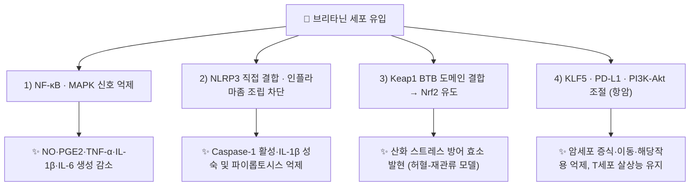

---
aliases:
  - Britannin
  - Britanin
  - 브리타닌
tags:
  - 약리
  - status/draft
  - 약리성분
  - 세스퀴테르펜락톤
title: 브리타닌
date: 2026-09-22
출처: PMID 25342596
---

# 🔬 브리타닌 (Britannin, C₁₉H₂₆O₇)

> **핵심 3줄 요약 (Key Summary)**:
> - 🌿 기원 본초 & 화학 계열: [[선복화]](旋覆花, 국화과 *Inula japonica*/*I. britannica* 두상화서)에 함유된 세스퀴테르펜 락톤(Sesquiterpene lactone) 계열 성분으로, 1-O-아세틸브리타닌과 함께 선복화의 규격 지표성분. (⚠️ 브리타닌 자체가 규격 지표인지는 이번 검증에서 확인하지 못함 — §2)
> - 🎯 핵심 분자 표적: [[NF-κB]] 신호전달 경로 억제를 통한 항염증 작용, 위식도 평활근의 과도한 콜린성 연축 억제를 통한 진경(鎭痙) 작용이 제시됨. (⚠️ 진경 작용은 문헌 미확인 — §3)
> - 🩺 주요 약리 활성: 항염증, 세포독성(항암), 최근에는 KLF5 하향조절을 통한 폐암 세포 증식·이동·해당작용 억제 및 대장암에 대한 네트워크 약리학 기반 기전 연구가 보고되며, 선복화의 강기지구(降氣止嘔)·소담행수(消痰行水) 효능의 분자적 근거로 다뤄짐.
> - ⚠️ 근거 수준: 항암 관련 활성은 세포·동물 연구 단계이며, 인체 임상 근거는 확인되지 않았습니다. 브리타닌 자체의 약동학·약물상호작용 자료는 PubMed에서 확인하지 못했습니다(§4·§7).

---

## 📌 목차
1. [기본 화학 정보 & 분자 구조식 (Chemical Identity)](#1-기본-화학-정보--분자-구조식-chemical-identity)
2. [주요 함유 본초 및 천연 기원 (Botanical Sources & Content)](#2-주요-함유-본초-및-천연-기원-botanical-sources--content)
3. [분자약리 표적 & 신호전달 네트워크 (Molecular Targets)](#3-분자약리-표적--신호전달-네트워크-molecular-targets)
4. [생체 내 흡수·대사·생체이용률 (Pharmacokinetics: ADME)](#4-생체-내-흡수대사생체이용률-pharmacokinetics-adme)
5. [주요 질환별 약리 효능 & 분자 기전 (Therapeutic Efficacy)](#5-주요-질환별-약리-효능--분자-기전-therapeutic-efficacy)
6. [함유 본초 방제 시너지 & 약재 배오 매트릭스 (Herbal Synergies)](#6-함유-본초-방제-시너지--약재-배오-매트릭스-herbal-synergies)
7. [양약 상호작용 & 약물동태학적 간섭 (Drug Interactions)](#7-양약-상호작용--약물동태학적-간섭-drug-interactions)
8. [💡 사용자 진료실 핵심 필기 & 임상 응용 팁 (Melt-In & High-Yield)](#8--사용자-진료실-핵심-필기--임상-응용-팁-melt-in--high-yield)
9. [출처 및 학술 참고 문헌 (References)](#9-출처-및-학술-참고-문헌-references)

---

## 1. 기본 화학 정보 & 분자 구조식 (Chemical Identity)

> [!abstract]+ 🧪 3D 약리 분자 구조 (Interactive 3D Viewer)
> <iframe src="https://molecule-viewer-rho.vercel.app/?cid=14466541" width="100%" height="450px" frameborder="0" allow="webgl" style="border-radius: 8px;"></iframe>

| 항목 | 상세 내용 |
| :--- | :--- |
| **IUPAC 명칭** | [(3aS,5R,5aS,6S,8S,8aS,9S,9aR)-9-acetyloxy-8-hydroxy-5,8a-dimethyl-1-methylidene-2-oxo-4,5,5a,6,7,8,9,9a-octahydro-3aH-azuleno[6,5-b]furan-6-yl] acetate (PubChem 등록명) |
| **분자식 / 분자량** | C₁₉H₂₆O₇ / 약 366.41 g/mol (PubChem 표기 366.40) |
| **PubChem CID** | [14466541](https://pubchem.ncbi.nlm.nih.gov/compound/Britannin) (PubChem 실측 확인: 표제어 Britannin, 이명 Britanin·Inulicin A) |
| **CAS 등록 번호** | 33627-28-0 (PubChem 이명 목록 기준) |
| **화학 골격 분류** | 슈도구아이아놀라이드(Pseudoguaianolide)형 세스퀴테르펜 락톤 |
| **물리화학적 성상** | α-메틸렌-γ-락톤(α-methylene-γ-lactone) 부분구조를 가져 단백질의 설프하이드릴(-SH)기와 비특이적으로 반응할 수 있는 반응성이 높은 구조(Bailly 2021). 외관 성상·용해도·열/빛 안정성·맛은 ⚠️ 내용 검토 필요(미확인) |
| **식물 내 생합성 경로** | ⚠️ 내용 검토 필요(원문에 서술 없음, 이번 검증에서 확인하지 못함) |

---

## 2. 주요 함유 본초 및 천연 기원 (Botanical Sources & Content)

| 함유 본초 | 기원 식물학적 명칭 | 주요 함유 부위 | 지표 함량 (%) | 한의학적 귀경 및 약효 특성 |
| :--- | :--- | :--- | :--- | :--- |
| [[선복화]] (旋覆花) | 국화과 / *Inula japonica*, *I. britannica* | 건조한 두상화서(꽃) | ⚠️ 미확인 | 폐·비·위경 귀경, 소담행수(消痰行水)·강기지구(降氣止嘔)·하기평천(下氣平喘) |

> **기원 식물 문헌 확인 (⚠️ 표기 포함)**
> - *Inula japonica* 꽃에서 브리타닌(britanin)이 분리된 것은 확인됩니다(Piao 2016). 항염증 연구(Park 2013)도 *I. japonica* 꽃(Inulae Flos)에서 분리한 브리타닌을 사용했습니다.
> - *I. aucheriana*에서 분리한 브리타닌을 쓴 연구도 있습니다(Hajimehdipoor 2014). Bailly 2021 종설은 브리타닌이 "여러 *Inula* 종"에서 발견된다고 기술합니다.
> - 원문 기원에 적힌 *I. britannica*에서의 브리타닌 검출은 이번 검증에서 확인하지 못했습니다. 참고문헌 1(Bai 2006)은 *I. britannica* var. *chinensis* 꽃에서 신규 세스퀴테르펜 3종과 기지 세스퀴테르펜 락톤 4종을 분리했으나, 초록에 브리타닌이 명시되어 있지 않습니다. ⚠️ 내용 검토 필요
> - 원문의 "1-O-아세틸브리타닌과 함께 선복화의 규격 지표성분"은 확인하지 못했습니다. 볼트의 [[선복화]] 노트는 KP 규격 지표를 1-O-아세틸브리타닌(≥0.15%)으로 서술할 뿐 브리타닌을 지표로 명시하지 않으며, 문헌상의 명칭은 1-O-acetylbritannilactone(ABL, *I. britannica*에 풍부; Li 2016)이라 원문의 '1-O-아세틸브리타닌'과 동일 성분인지도 미확인입니다. ⚠️ 내용 검토 필요
> - 볼트에 '1-O-아세틸브리타닌' 노트는 없어 링크하지 않았습니다.

---

## 3. 분자약리 표적 & 신호전달 네트워크 (Molecular Targets)

* **항염증**: [[NF-κB]] 활성 억제를 통해 강력한 항염증 및 평활근 진경 활성을 나타냅니다.
  * ⚠️ 원문은 이 서술의 근거로 Bai 2006을 제시하지만, 그 논문 초록은 세스퀴테르펜 락톤의 세포독성·아폽토시스를 다루며 NF-κB·진경은 언급하지 않습니다. NF-κB 억제의 직접 근거는 다음 논문들입니다.
  * RAW 264.7 대식세포에서 브리타닌이 LPS 유도 NO·PGE2 생성과 iNOS·COX-2 발현, TNF-α·IL-1β·IL-6 분비를 낮췄고, p38·JNK 인산화를 억제했으며 IκBα 분해와 핵 내 p65 증가를 막았습니다(Park 2013). HMC-1 비만세포에서도 IκBα 분해·NF-κB 핵 이행·p38 인산화를 억제했고 마우스 수동피부아나필락시스(PCA) 반응을 줄였습니다(Park 2014).
* **진경(위식도)**: 위식도 평활근의 과도한 콜린성 연축을 억제하고 염증성 사이토카인을 차단하여 역류성 식도염 및 위장관 운동 불균형을 개선합니다.
  * ⚠️ 내용 검토 필요: 브리타닌이 위식도 평활근의 콜린성 연축을 억제한다는 문헌은 이번 PubMed 검색(브리타닌·*Inula* 평활근 수축·역류성 식도염)에서 확인되지 않았습니다. 확인된 콜린계 자료는 아세틸콜린에스터라아제(AChE) 억제 시험관 연구뿐이며 300 μg/L에서 25.2% 억제(Ellman법, *I. aucheriana* 유래; Hajimehdipoor 2014)로 갈란딘(67.0%)보다 낮았습니다. AChE 억제는 콜린성 신호를 증가시키는 방향이라 원문의 '콜린성 연축 억제'와 방향이 다릅니다.
* **항암**: KLF5 하향조절을 통한 폐암세포 증식·이동·해당작용(glycolysis) 억제, 네트워크 약리학 기반 대장암 억제 기전이 최근 연구에서 제시됩니다.
  * KLF5: A549 폐암 세포에서 브리타닌이 증식·이동·해당작용을 억제하며 KLF5 단백질 발현이 감소했고, KLF5를 과발현시키면 이 억제 효과가 반전되었습니다. 분자 도킹으로 KLF5 표적 가능성도 탐색되었습니다(Wang 2024).
  * 대장암: 네트워크 약리학 분석이 PI3K-Akt 경로·PD-L1 발현·HIF-1 신호를 후보로 제시했고, 시험관에서 증식 억제·세포자멸사 촉진·AKT 인산화 억제, 마우스에서 종양 성장 억제와 M1 대식세포 극성화 억제가 확인되었습니다(Liu 2025).

### 1) 핵심 분자 표적 (Molecular Targets)
* **NLRP3 직접 결합**: 95종 천연물 중 LPS+ATP 자극 BMDM의 IL-1β 분비를 가장 강하게 억제(IC50 3.630 μM). NLRP3-NEK7 상호작용을 방해해 인플라마좀 조립을 막고, NLRP3 NACHT 도메인의 Arg335·Gly271에 직접 결합합니다(Shao 2024). [[NLRP3]] 참고.
* **Keap1–Nrf2 축**: [[Nrf2]] 유도제로, 브리타닌과 Keap1의 BTB 도메인 복합체 결정 구조가 보고되었고, 브리타닌은 Nrf2 시스템의 강력한 유도제로 기술됩니다(Wu 2017). Bailly 2021 종설은 α-메틸렌 부분이 Keap1의 시스테인 잔기에 공유결합한다고 정리합니다.
* **c-Myc/HIF-1α–PD-L1 축**: 브리타닌이 c-Myc과 HIF-1α의 상호작용을 끊어 PD-L1 발현을 낮추고 T세포 살상 활성을 유지한다고 보고되었습니다(Zhang 2021; 종설 Bailly 2021).
* **NF-κB 억제**: [[NF-κB]] — 췌장암(Li 2020)·위암(Shi 2020)에서 p65·p-p65 감소가 보고되었습니다.

---

## 4. 생체 내 흡수·대사·생체이용률 (Pharmacokinetics: ADME)

* **브리타닌 자체의 약동학**: ⚠️ 내용 검토 필요. PubMed에서 브리타닌(britannin·britanin)의 약동학·생체이용률 논문은 확인되지 않았습니다(검색 결과 0건). 흡수율·P-glycoprotein 기질 여부·장내세균 대사·간 CYP 대사·반감기 모두 미확인입니다.
* **같은 식물의 다른 세스퀴테르펜 락톤 (참고, 브리타닌 값이 아님)**: 1-O-acetylbritannilactone(ABL)은 랫드 정맥 투여(0.14·0.42·1.26 mg/kg) 후 소실 반감기가 0.412~0.453시간이었고 용량에 비례하는 노출을 보였습니다(Li 2016). 브리타닌의 값으로 옮기지 않습니다.
* **구조적 고려**: α-메틸렌-γ-락톤은 단백질 설프하이드릴기와 비특이적으로 반응하는 것으로 논의됩니다(Bailly 2021). 이 반응성이 체내 분포·표적 특이성에 미치는 영향은 확인하지 못했습니다.
* **투여 경로 참고**: 동물 실험은 주로 복강 투여(NLRP3 20 mg/kg i.p., Shao 2024; 비만 5·15 mg/kg i.p., Zhang 2026)와 경구 위관 투여(심근 허혈-재관류 50 mg/kg, Lu 2022)로 이루어졌으며, 경구 생체이용률과의 관계는 알려진 바 없습니다.

---

## 5. 주요 질환별 약리 효능 & 분자 기전 (Therapeutic Efficacy)

### 1) 항염증·알레르기·호흡기
* 대식세포 NO·PGE2·사이토카인 감소(Park 2013), 비만세포 매개 PCA 억제(Park 2014).
* 난알부민(OVA) 유도 마우스 천식 모델에서 기도과민성·호산구 침윤·Th2 사이토카인·점액 분비를 줄였습니다(Kim 2016). 브리타닌이 천식·기침(담음천해)에 쓰이는 선복화의 효능을 뒷받침하는 동물 실험 수준의 근거입니다. [[천식]] 참고.
* NLRP3 관련 질환: MSU 유도 통풍성 관절염 및 LPS 유도 급성폐손상 마우스 모델(20 mg/kg, i.p.)에서 효과가 보고되었습니다(Shao 2024).

### 2) 항암 (세포·동물 수준, 인체 임상 없음)
* 폐암: KLF5 하향조절(Wang 2024). [[폐암]]
* 대장암: PI3K-Akt·PD-L1·HIF-1, 대식세포 극성화 조절(Liu 2025). [[대장암]]
* 췌장암: PANC-1·BxPC-3·MIA PaCa-2에서 IC50 1.348·3.367·3.104 μmol/L, NF-κB p65 인산화 감소, 이종이식 마우스에서 종양 억제, 참을 수 없는 독성은 없었다고 보고(Li 2020). [[췌장암]]
* 위암: BGC-823 이식 누드마우스에서 종양 성장 억제, p65·p-p65 감소(Shi 2020). [[위암]]
* PD-L1 억제를 통한 T세포 살상 유지(Zhang 2021).
* 이 외 유방암·간암·백혈병 등 다수의 세포 연구가 있으나(예: PMID 25342596, 29288670, 34478011) 이번 검증에서 초록 전체를 대조하지는 않았습니다.

### 3) 허혈-재관류·대사·골
* 뇌허혈-재관류: 브리타닌이 Nrf2 경로를 유도해 산소포도당결핍-재산소화(OGD-R) 신경 손상과 마우스 MCAO-R 손상을 완화(Wu 2017).
* 심근 허혈-재관류: 랫드에서 경구 50 mg/kg 전처치가 경색 면적을 38.67%에서 22.50%로 줄였다고 보고(Lu 2022, 초록 일부 확인).
* 비만·지질대사: 고지방식 유도 비만 마우스(5·15 mg/kg i.p.)에서 연구되었고 MAPK 신호 조절이 제시되었습니다(Zhang 2026, 제목·초록 일부 확인). NAFLD는 네트워크 약리학과 도킹 분석에서 HO-1이 핵심 표적으로 도출되었습니다(Dou 2024, 초록 일부 확인).
* 골: 티타늄 마모입자 유발 골용해 및 파골세포 분화 억제(Kim 2023, 초록 일부 확인).

---

## 6. 함유 본초 방제 시너지 & 약재 배오 매트릭스 (Herbal Synergies)

> **한의학적 연계 (원문)**: 브리타닌은 [[선복화]]의 강기지구·소담행수 효능을 뒷받침하는 핵심 세스퀴테르펜 락톤 성분으로, 상한론의 심하비경(心下痞硬, 명치 밑이 단단하게 막힘)·애기부제(噫氣不除, 잦은 트림과 딸꾹질) 및 가래 끓는 기침(담음천해)에 활용되는 근거로 제시됩니다.
>
> ⚠️ 내용 검토 필요: 위 원문의 심하비경·애기부제(트림·딸꾹질) 증상과 브리타닌을 직접 연결한 문헌은 확인하지 못했습니다. 위식도 평활근 진경 작용 자체가 미확인이므로(§3) 이 연계는 전통 효능에서 성분을 역추론한 가설로 보아야 합니다. 마우스 천식 모델 근거(Kim 2016)만 담음천해(가래 기침)와 부분적으로 겹칩니다. 관련 고전 처방은 [[상한론]] 참고.

볼트 처방 노트에서 선복화 구성이 확인된 것만 기재합니다.

| 함유 본초 / 방제 | 공존 유효 성분군 | 분자약리 시너지 기전 | 전통 한의학적 효능 연계 |
| :--- | :--- | :--- | :--- |
| [[선복화]] | 브리타닌 외 세스퀴테르펜 락톤, 플라보노이드(볼트 [[선복화]] 노트 기준) | ⚠️ 브리타닌과 공존 성분·타 약재 간 시너지 기전은 문헌 미확인 | 소담행수·강기지구·하기평천 |
| [[선복대자탕]] | 군약 [[선복화]](9g, 포전)·[[대자석]]·[[반하]]·[[생강]]·[[인삼]]·대조·[[감초]] | ⚠️ 방제 수준에서 브리타닌 기여도를 확인한 연구는 못 찾음 | 위허담저·심하비경·희애기부제·애역(딸꾹질) |
| [[침향사마탕]] | 위산 역류·신트림이 심할 때 [[선복화]] 8g·[[대자석]] 12g 가미 | ⚠️ 미확인 | 위기 상역 시 강기화담 |
| [[생간건비탕]] | 복부 가스·GERD 역류가 심할 때 [[선복화]]·[[대자석]]·[[침향]] 가미 | ⚠️ 미확인 | 강기화담 |

---

## 7. 양약 상호작용 & 약물동태학적 간섭 (Drug Interactions)

* **CYP450 효소 간섭**: ⚠️ 내용 검토 필요. 브리타닌과 CYP·P-gp를 다룬 PubMed 논문은 확인되지 않았습니다(검색 0건). 병용 양약의 혈중 농도 변동 여부는 알려진 바 없습니다.
* **유사 기전 양약 병용 시 고려사항**: 브리타닌의 표적 상당수(NF-κB·NLRP3·PD-L1)가 항염증제·면역조절제·PD-1/PD-L1 항체 등과 기전이 겹칠 수 있으나, 병용 시의 상가·상쇄 효과를 확인한 인체·동물 자료는 확인하지 못했습니다. ⚠️
* **AChE 억제 시험관 결과**: 약한 AChE 억제(25.2%, 300 μg/L; Hajimehdipoor 2014)는 시험관 결과이며 항콜린제·콜린에스터라아제 억제제와의 임상적 상호작용 근거는 아닙니다.
* **과민반응 (이론적, 브리타닌 특이 자료 아님)**: 국화과(Compositae) 식물에서 세스퀴테르펜 락톤은 알레르기 접촉피부염의 가장 중요한 알레르겐으로 보고됩니다(Paulsen 2002). 이 문헌에 *Inula helenium*(elecampane)은 언급되나 선복화·브리타닌은 언급되지 않으므로, 국화과 알레르기 병력 환자에서 선복화 사용 시 주의 가능성은 이론적 고려일 뿐입니다. ⚠️
* **독성**: 췌장암 이종이식 마우스 실험에서 참을 수 없는 독성은 관찰되지 않았다고 보고되었으나(Li 2020), 인체 안전성 자료는 없습니다.
* 선복화의 솜털 자극으로 반드시 포전(包煎)해야 한다는 주의는 볼트 [[선복대자탕]] 노트를 참고.

---

## 8. 💡 사용자 진료실 핵심 필기 & 임상 응용 팁 (Melt-In & High-Yield)

* **사용자 원문 필기**: 기존 노트에 원장님 수기 필기는 없었습니다. 이후 필기를 추가할 자리입니다.
* **진료실 실전 처방 & 생체이용률 극대화 팁**: 브리타닌의 흡수율 개선·체질별 적용에 관한 근거는 확인하지 못해 임상 팁을 작성하지 않았습니다. 선복화 처방의 실제 운용은 [[선복대자탕]] 노트를 참고.

---

## 9. 출처 및 학술 참고 문헌 (References)

1. **Bai N, et al. (2006)**. Sesquiterpene lactones from *Inula britannica* and their cytotoxic and apoptotic effects on human cancer cell lines. *Journal of Natural Products*, 69(4), 531-535. DOI: [10.1021/np050437q](https://doi.org/10.1021/np050437q), PMID: [16643020](https://pubmed.ncbi.nlm.nih.gov/16643020/)
   - **[연구 요약]**: *I. britannica* var. *chinensis* 꽃에서 신규 세스퀴테르펜 3종과 기지 세스퀴테르펜 락톤 4종을 분리하고, 사람 암세포주(COLO 205·HT-29·HL-60·AGS)에서 세포독성·아폽토시스 비율을 평가. α-메틸렌-γ-락톤을 가진 2종이 중등도 활성을 보임.
   - ⚠️ 원문 인용은 제목을 "…anti-inflammatory and cytotoxic activities"로, 요약을 "선복화의 브리타닌 성분이 NF-κB 활성 억제를 통해 강력한 항염증 및 평활근 진경 활성을 나타냄을 규명"으로 적었으나, PubMed 실제 제목·초록과 일치하지 않아 정정했습니다. 초록에 NF-κB·진경·브리타닌은 언급되지 않습니다.
2. **Wang Y, et al. (2024)**. Britannin inhibits cell proliferation, migration and glycolysis by downregulating KLF5 in lung cancer. *Experimental and Therapeutic Medicine*, 27(3), 109. DOI: [10.3892/etm.2024.12397](https://www.spandidos-publications.com/10.3892/etm.2024.12397), PMID: [38361511](https://pubmed.ncbi.nlm.nih.gov/38361511/)
   - **[연구 요약]**: 브리타닌의 KLF5 하향조절을 통한 폐암세포 증식·이동·해당작용 억제 기전을 규명한 연구.
3. **Liu X, et al. (2025)**. Exploring mechanisms of britannin against colorectal cancer based on experimentally validated network pharmacology. *Naunyn-Schmiedeberg's Archives of Pharmacology*, 398(9), 11869-11881. DOI: [10.1007/s00210-025-03995-2](https://doi.org/10.1007/s00210-025-03995-2), PMID: [40080155](https://pubmed.ncbi.nlm.nih.gov/40080155/)
   - **[연구 요약]**: 네트워크 약리학 기반으로 브리타닌의 대장암 억제 기전을 실험적으로 검증한 연구.
4. **대한민국약전(KP) 제12개정 (2022)**. 의약품각조 제2부: 선복화(Inulae Flos) 규격 기준. ⚠️ 약전 원문은 온라인에서 확인하지 못했고, 지표 성분이 브리타닌인지도 확인하지 못했습니다.
5. **Park HH, et al. (2013)**. Britanin suppresses LPS-induced nitric oxide, PGE2 and cytokine production via NF-κB and MAPK inactivation in RAW 264.7 cells. *International Immunopharmacology*, 15(2), 296-302. DOI: [10.1016/j.intimp.2012.12.005](https://doi.org/10.1016/j.intimp.2012.12.005), PMID: [23270759](https://pubmed.ncbi.nlm.nih.gov/23270759/)
   - **[연구 요약]**: *I. japonica* 꽃에서 분리한 브리타닌이 LPS 자극 대식세포의 NO·PGE2·사이토카인 생성을 줄이고 p38·JNK 인산화와 IκBα 분해를 통한 NF-κB 활성화를 억제.
6. **Park HH, et al. (2014)**. Suppressive effects of britanin, a sesquiterpene compound isolated from Inulae flos, on mast cell-mediated inflammatory responses. *The American Journal of Chinese Medicine*, 42(4), 935-947. DOI: [10.1142/S0192415X14500591](https://doi.org/10.1142/S0192415X14500591), PMID: [25004884](https://pubmed.ncbi.nlm.nih.gov/25004884/)
   - **[연구 요약]**: 경구 10~20 mg/kg이 마우스 PCA 반응을 줄이고, HMC-1 세포에서 사이토카인 발현과 NF-κB·p38 활성화를 억제.
7. **Kim SG, et al. (2016)**. Britanin attenuates ovalbumin-induced airway inflammation in a murine asthma model. *Archives of Pharmacal Research*, 39(7), 1006-1012. DOI: [10.1007/s12272-016-0783-z](https://doi.org/10.1007/s12272-016-0783-z), PMID: [27342608](https://pubmed.ncbi.nlm.nih.gov/27342608/)
   - **[연구 요약]**: OVA 유도 천식 마우스에서 기도과민성·호산구·Th2 사이토카인·IgE·점액 분비를 감소.
8. **Shao JJ, et al. (2024)**. Britannin as a novel NLRP3 inhibitor, suppresses inflammasome activation in macrophages and alleviates NLRP3-related diseases in mice. *Acta Pharmacologica Sinica*, 45(4), 803-814. DOI: [10.1038/s41401-023-01212-5](https://doi.org/10.1038/s41401-023-01212-5), PMID: [38172305](https://pubmed.ncbi.nlm.nih.gov/38172305/)
   - **[연구 요약]**: 95종 천연물 스크리닝에서 IL-1β 분비를 가장 강하게 억제(IC50 3.630 μM), NLRP3 NACHT 도메인(Arg335·Gly271)에 직접 결합해 NLRP3-NEK7 상호작용을 방해.
9. **Wu G, et al. (2017)**. Britanin Ameliorates Cerebral Ischemia-Reperfusion Injury by Inducing the Nrf2 Protective Pathway. *Antioxidants & Redox Signaling*, 27(11), 754-768. DOI: [10.1089/ars.2016.6885](https://doi.org/10.1089/ars.2016.6885), PMID: [28186440](https://pubmed.ncbi.nlm.nih.gov/28186440/)
   - **[연구 요약]**: 브리타닌이 Nrf2 시스템 유도제로 OGD-R 신경 손상과 MCAO-R 손상을 완화하며 Keap1 BTB 도메인과의 복합체 결정 구조를 보고.
10. **Zhang YF, et al. (2021)**. Britannin stabilizes T cell activity and inhibits proliferation and angiogenesis by targeting PD-L1 via abrogation of the crosstalk between Myc and HIF-1α in cancer. *Phytomedicine*, 81, 153425. DOI: [10.1016/j.phymed.2020.153425](https://doi.org/10.1016/j.phymed.2020.153425), PMID: [33310309](https://pubmed.ncbi.nlm.nih.gov/33310309/)
    - **[연구 요약]**: 브리타닌이 종양세포의 PD-L1 발현을 낮춰 T세포 살상 활성을 유지하고 증식·이동·신생혈관을 억제(초록 일부 확인).
11. **Li K, et al. (2020)**. A novel natural product, britanin, inhibits tumor growth of pancreatic cancer by suppressing nuclear factor-κB activation. *Cancer Chemotherapy and Pharmacology*, 85(4), 699-709. DOI: [10.1007/s00280-020-04052-w](https://doi.org/10.1007/s00280-020-04052-w), PMID: [32185482](https://pubmed.ncbi.nlm.nih.gov/32185482/)
    - **[연구 요약]**: 췌장암 세포주 IC50 1.348~3.367 μmol/L, NF-κB p65 인산화 감소, 이종이식 마우스 종양 억제·참을 수 없는 독성 없음.
12. **Shi K, et al. (2020)**. In vivo antitumour activity of Britanin against gastric cancer through nuclear factor-κB-mediated immune response. *Journal of Pharmacy and Pharmacology*, 72(4), 607-618. DOI: [10.1111/jphp.13230](https://doi.org/10.1111/jphp.13230), PMID: [31943207](https://pubmed.ncbi.nlm.nih.gov/31943207/)
    - **[연구 요약]**: BGC-823 이식 누드마우스에서 종양 성장 억제, p65·p-p65 감소(초록 일부 확인).
13. **Bailly C (2021)**. Anticancer Targets and Signaling Pathways Activated by Britannin and Related Pseudoguaianolide Sesquiterpene Lactones. *Biomedicines*, 9(10), 1325. DOI: [10.3390/biomedicines9101325](https://doi.org/10.3390/biomedicines9101325), PMID: [34680439](https://pubmed.ncbi.nlm.nih.gov/34680439/)
    - **[연구 요약]**: 브리타닌의 항암 작용을 NF-κB/ROS, Keap1-Nrf2, c-Myc/HIF-1α–PD-1/PD-L1 세 가지 기전으로 정리하고 α-메틸렌-γ-락톤의 비특이적 반응성을 논의한 종설.
14. **Piao D, et al. (2016)**. DNA Topoisomerase Inhibitory Activity of Constituents from the Flowers of *Inula japonica*. *Chemical and Pharmaceutical Bulletin*, 64(3), 276-281. DOI: [10.1248/cpb.c15-00780](https://doi.org/10.1248/cpb.c15-00780), PMID: [26936053](https://pubmed.ncbi.nlm.nih.gov/26936053/)
    - **[연구 요약]**: *I. japonica* 꽃에서 britanin을 포함한 14종을 분리, britanin이 토포이소머라제 II를 IC50 6.9 μM로 억제(에토포시드 26.9 μM보다 강함). 세포독성은 약했음.
15. **Hajimehdipoor H, et al. (2014)**. Natural sesquiterpen lactones as acetylcholinesterase inhibitors. *Anais da Academia Brasileira de Ciências*, 86(2), 801-806. DOI: [10.1590/0001-3765201420130005](https://doi.org/10.1590/0001-3765201420130005), PMID: [24838542](https://pubmed.ncbi.nlm.nih.gov/24838542/)
    - **[연구 요약]**: *I. aucheriana* 유래 브리타닌의 AChE 억제 25.2%(300 μg/L, Ellman법). 갈란딘 67.0%, 풀첼린 C 10.9%.
16. **Lu H, et al. (2022)**. Britanin relieves ferroptosis-mediated myocardial ischaemia/reperfusion damage by upregulating GPX4 through activation of AMPK/GSK3β/Nrf2 signalling. *Pharmaceutical Biology*, 60(1), 38-45. DOI: [10.1080/13880209.2021.2007269](https://doi.org/10.1080/13880209.2021.2007269), PMID: [34860639](https://pubmed.ncbi.nlm.nih.gov/34860639/)
    - **[연구 요약]**: 랫드 심근 허혈-재관류 모델에서 브리타닌 50 mg/kg 경구 전처치가 경색 면적을 줄임(초록 일부 확인).
17. **Kim JA, et al. (2023)**. Britanin inhibits titanium wear particle‑induced osteolysis and osteoclastogenesis. *Molecular Medicine Reports*, 28(5). DOI: [10.3892/mmr.2023.13092](https://doi.org/10.3892/mmr.2023.13092), PMID: [37732549](https://pubmed.ncbi.nlm.nih.gov/37732549/)
    - **[연구 요약]**: 파골세포 분화와 마우스 두개골 골용해 모델에서 브리타닌의 보호 효과를 평가(초록 일부만 확인, 결과 세부는 미확인).
18. **Zhang Y, et al. (2026)**. Britanin improved high-fat diet-induced obesity by regulating the MAPK signaling pathway. *Pakistan Journal of Pharmaceutical Sciences*, 39(12), 3729-3743. DOI: [10.36721/PJPS.2026.39.12.342.1](https://doi.org/10.36721/PJPS.2026.39.12.342.1), PMID: [42708785](https://pubmed.ncbi.nlm.nih.gov/42708785/)
    - **[연구 요약]**: 고지방식 비만 마우스에 브리타닌 5·15 mg/kg(i.p.)을 투여하고 네트워크 약리학으로 표적을 탐색(초록 일부만 확인, 제목 기준 MAPK 경로 조절).
19. **Dou C, et al. (2024)**. Integrated Pharmaco-Bioinformatics Approaches and Experimental Verification To Explore the Effect of Britanin on Nonalcoholic Fatty Liver Disease. *ACS Omega*, 9(7), 8274-8286. DOI: [10.1021/acsomega.3c08968](https://doi.org/10.1021/acsomega.3c08968), PMID: [38405493](https://pubmed.ncbi.nlm.nih.gov/38405493/)
    - **[연구 요약]**: 네트워크 약리학·도킹 분석에서 HO-1이 핵심 표적으로 도출(초록 일부만 확인, 실험 검증 세부는 미확인).
20. **Li H, et al. (2016)**. LC-MS/MS determination of 1-O-acetylbritannilactone in rat plasma and its application to a preclinical pharmacokinetic study. *Biomedical Chromatography*, 30(3), 419-425. DOI: [10.1002/bmc.3564](https://doi.org/10.1002/bmc.3564), PMID: [26179842](https://pubmed.ncbi.nlm.nih.gov/26179842/)
    - **[연구 요약]**: 브리타닌이 아닌 ABL의 랫드 정맥 투여 약동학(소실 반감기 0.412~0.453 h). §4 참고용.
21. **Paulsen E (2002)**. Contact sensitization from Compositae-containing herbal remedies and cosmetics. *Contact Dermatitis*, 47(4), 189-198. DOI: [10.1034/j.1600-0536.2002.470401.x](https://doi.org/10.1034/j.1600-0536.2002.470401.x), PMID: [12492516](https://pubmed.ncbi.nlm.nih.gov/12492516/)
    - **[연구 요약]**: 국화과 식물 함유 한약·화장품의 접촉 감작을 정리하고 세스퀴테르펜 락톤을 가장 중요한 알레르겐으로 지목. 브리타닌·선복화는 다루지 않음.

<!-- 보관 태그(1회용·링크오류, 필요시 복원): 선복화 -->
