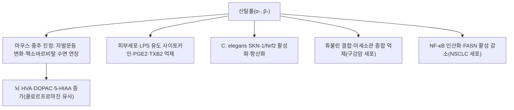

# 🔬 산탈롤 (Santalol)

> **핵심 3줄 요약 (Key Summary)**:
> - 🌿 기원 본초 & 화학 계열: [[단향]](Santalum album)의 심재 정유에서 추출되는 대표적인 천연 [[세스퀴테르펜]] 알코올 지표 성분
> - 🎯 핵심 분자 표적: GABA_A 수용체 알로스테릭 조절을 통한 중추 진정·항불안 및 COX-2/iNOS 억제 기반 항염증 활성 (⚠️ 산탈롤 단독의 GABA_A 결합·COX-2/iNOS 억제 근거는 확인하지 못했고, 확인된 것은 마우스 중추 진정·뇌 내 모노아민 대사체 증가와 피부세포의 사이토카인·PGE2 억제입니다. §3)
> - 🩺 주요 약리 활성: 흉격 기체 흉통·위완통·스트레스성 심계항진을 치료하는 한의 이기개울 본초의 분자 기반 (⚠️ 이 적응증에 대한 산탈롤 단독 근거는 확인하지 못했습니다. §5)
> - ⚠️ 독성·생체이용률 한계 & 상호작용: 산탈롤의 사람 약동학·CYP 상호작용 문헌은 확인하지 못했습니다. 백단유는 식품 향료 사용 수준에서 안전하다고 평가되나 자극·감작 반응이 간헐적으로 보고됩니다(Burdock 2008). 사람 흡입 시험에서는 진정이 아니라 각성 지표가 올랐습니다(Heuberger 2006). §4·§7

---

## 📌 목차
1. [기본 화학 정보 & 분자 구조식 (Chemical Identity)](#1-기본-화학-정보--분자-구조식-chemical-identity)
2. [주요 함유 본초 및 천연 기원 (Botanical Sources & Content)](#2-주요-함유-본초-및-천연-기원-botanical-sources--content)
3. [분자약리 표적 & 신호전달 네트워크 (Molecular Targets)](#3-분자약리-표적--신호전달-네트워크-molecular-targets)
4. [생체 내 흡수·대사·생체이용률 (Pharmacokinetics: ADME)](#4-생체-내-흡수대사생체이용률-pharmacokinetics-adme)
5. [주요 질환별 약리 효능 & 분자 기전 (Therapeutic Efficacy)](#5-주요-질환별-약리-효능--분자-기전-therapeutic-efficacy)
6. [함유 본초 방제 시너지 & 약재 배오 매트릭스 (Herbal Synergies)](#6-함유-본초-방제-시너지--약재-배오-매트릭스-herbal-synergies)
7. [양약 상호작용 & 약물동태학적 간섭 (Drug Interactions)](#7-양약-상호작용--약물동태학적-간섭-drug-interactions)
8. [💡 사용자 진료실 핵심 필기 & 임상 응용 팁 (Melt-In & High-Yield)](#8--사용자-진료실-핵심-필기--임상-응용-팁-melt-in--high-yield)
9. [출처 및 학술 참고 문헌 (References)](#9-출처-및-학술-참고-문헌-references)

---

## 1. 기본 화학 정보 & 분자 구조식 (Chemical Identity)

> [!abstract]+ 🧪 3D 약리 분자 구조 (Interactive 3D Viewer) — α-산탈롤
> <iframe src="https://molecule-viewer-rho.vercel.app/?cid=11085337" width="100%" height="450px" frameborder="0" allow="webgl" style="border-radius: 8px;"></iframe>

| 항목 | 상세 내용 |
| :--- | :--- |
| **IUPAC 명칭** | α-산탈롤: (Z)-5-[(1S,3R,6R)-2,3-dimethyl-3-tricyclo[2.2.1.02,6]heptanyl]-2-methylpent-2-en-1-ol (PubChem 등록명) · β-산탈롤: (Z)-2-methyl-5-[(1S,2R,4R)-2-methyl-3-methylidene-2-bicyclo[2.2.1]heptanyl]pent-2-en-1-ol (PubChem 등록명) |
| **분자식 / 분자량** | 두 이성질체 모두 C15H24O / 220.35 g/mol (PubChem) |
| **PubChem CID** | α-산탈롤 [11085337](https://pubchem.ncbi.nlm.nih.gov/compound/11085337) ((Z)-α-santalol) · β-산탈롤 [6857681](https://pubchem.ncbi.nlm.nih.gov/compound/6857681) (cis-β-santalol). ⚠️ 원문의 3D 뷰어 CID 5281542는 PubChem에서 하르파고사이드(C24H30O11)여서 정정했습니다. |
| **CAS 등록 번호** | α-산탈롤 115-71-9 · β-산탈롤 77-42-9 — PubChem 동의어 항목 기준이며 CAS 원본 대조는 못함 ⚠️ |
| **화학 골격 분류** | 세스퀴테르펜(C15) 알코올. α-산탈롤은 삼환계(tricyclic, tricyclo[2.2.1.02,6]heptane 골격), β-산탈롤은 이환계(bicyclic, bicyclo[2.2.1]heptane 골격) |
| **물리화학적 성상** | 백단향의 목질 향(woody odor)을 이루는 성분(Yan 2024). 수용성·LogP·열 안정성·외관은 확인하지 못함 ⚠️ |
| **식물 내 생합성 경로** | 최초 단계는 다생성물 산탈렌/베르가모텐 합성효소가 담당하고, 이후 시토크롬 P450(CYP76F 계열, SaCYP736A167 등)이 산탈렌·베르가모텐을 수산화해 산탈롤을 만듭니다. SaCYP736A167은 (Z)-α-산탈롤·(Z)-β-산탈롤·(Z)-epi-β-산탈롤·(Z)-α-exo-베르가모톨을 입체선택적으로 생성합니다(Diaz-Chavez 2013; Celedon 2016). |

산탈롤(Santalol)은 단향과(Santalaceae) 식물인 [[단향]](檀香, 백단향, *Santalum album* L.)의 심재(Heartwood)에서 수증기 증류로 얻어지는 백단유(Sandalwood oil)의 주성분(90% 이상)인 [[세스퀴테르펜]] 알코올(Sesquiterpene alcohol)이다.

* ⚠️ 내용 검토 필요: '산탈롤이 정유의 90% 이상'이라는 수치는 확인하지 못했습니다. 문헌에서 확인된 것은 α-·β-·epi-β-산탈롤과 α-exo-베르가모톨 4종의 합이 *S. album* 정유의 약 90%라는 것이며(Diaz-Chavez 2013), 정유에는 100종 이상의 성분이 있고 주성분이 α-산탈롤입니다(Burdock 2008).

자연계에서는 주로 **알파-산탈롤(α-Santalol, 약 50~60%)**과 **베타-산탈롤(β-Santalol, 약 20~25%)**의 이성질체 혼합물로 존재한다.

* ⚠️ 내용 검토 필요: α 약 50~60%·β 약 20~25%라는 함량 수치는 이번 검증에서 확인하지 못했습니다(정유 규격 문서 미대조). 산탈롤 함량이 높은 동인도 백단유(EISO)일수록 피부세포 사이토카인 억제 활성이 컸다는 보고는 있습니다(Sharma 2014).

* 알파-산탈롤 (α-Santalol):
  * 화학식: C15H24O (원문의 깨진 표기 `{15}H_{24}O$`를 PubChem 기준으로 복구)
  * 분자량: 220.35 g/mol
  * IUPAC 명칭: (2Z)-5-[(1S,2R,4R,5S)-2,3-dimethyltricyclo[2.2.1.0^{2,6}]heptan-3-yl]-2-methylpent-2-en-1-ol (원문 표기. ⚠️ PubChem 등록명과 입체 기호·위치 번호가 달라 위 표의 PubChem 등록명을 기준으로 삼으세요.)
  * 삼환계(Tricyclic) 골격 구조.
* 베타-산탈롤 (β-Santalol):
  * 이환계(Bicyclic) 골격 구조.

---

## 2. 주요 함유 본초 및 천연 기원 (Botanical Sources & Content)

| 함유 본초 (한글/한자) | 기원 식물학적 명칭 (과명 / 학명) | 주요 함유 약용 부위 | 지표 함량 (%) | 한의학적 귀경 및 약효 특성 |
| :--- | :--- | :--- | :--- | :--- |
| [[단향]] (檀香, 백단향) | 단향과(Santalaceae) / *Santalum album* L. | 심재(Heartwood) | 원문: 정유의 주성분(α 약 50~60%, β 약 20~25%) ⚠️ 수치 미확인(§1) | 볼트 [[단향]] 노트 기준: 辛·溫, 脾·胃·心·肺經, 행기온중·개위지통·산한지통·통규안신 |

* **한약재 규격상의 지표 함량**: ⚠️ 내용 검토 필요 — 문헌상 단향의 품질은 α-산탈롤·β-산탈롤과 휘발성 정유의 정량·확인으로 관리된다고 기술됩니다(Han 2025). 대한민국약전외한약규격집(KHP)의 정확한 함량 기준은 원문을 확인하지 못했습니다.
* **산지별 정유 차이**: 서호주산과 동인도산 백단유를 비교한 보고에서 동인도 백단유의 피부세포 사이토카인 억제 활성이 더 컸고, 이는 산탈롤 농도가 더 높은 것과 상관했습니다(Sharma 2014). 종별 정확한 함량 수치는 확인하지 못했습니다. ⚠️

---

## 3. 분자약리 표적 & 신호전달 네트워크 (Molecular Targets)

### 1) 중추신경계 진정 및 항불안·수면 유도 (Neurosedative & Anxiolytic)
* 산탈롤을 흡입하거나 투여하면 혈액뇌장벽(BBB)을 신속히 통과한다.
  * 근거: 마우스에 (+)-α-산탈롤 0.03 mL/kg을 복강 투여한 뒤 뇌 조직에서 2.6 µg/g이 측정되어 뇌 이행이 확인되었습니다(Satou 2015). 랫드 흡입 시험에서는 후각 기능을 떨어뜨려도 수면 변화가 유지되어, 호흡기 점막으로 흡수돼 혈행을 거쳐 작용할 가능성이 제시되었습니다(Ohmori 2007).
  * ⚠️ 내용 검토 필요: '신속히' 통과한다는 속도 자료와 흡입 후 뇌 농도 측정은 확인하지 못했습니다.
* 뇌내 [[GABA]]_A 수용체의 벤조디아제핀 결합 부위에 작용하여 염화이온 유입을 촉진하고 신경세포의 과흥분을 진정시킨다.
  * ⚠️ 내용 검토 필요: PubMed에서 산탈롤과 GABA_A 수용체를 직접 다룬 논문을 확인하지 못했습니다. 산탈롤 이성질체의 중추 작용을 분석한 Okugawa 1995는 뇌 내 호모바닐산·DOPAC·5-HIAA(도파민·세로토닌 대사체)가 증가하고 클로르프로마진과 유사한 neuroleptic 양상이라고 보고했으며, 이는 GABA_A 경로와 다른 기전입니다. 또한 (+)-α-산탈롤은 마우스에서 항불안 유사 활성이 관찰되지 않았고 진정 효과만 시사되었습니다(Satou 2015).
* 자율신경계 교감신경 긴장을 완화하여 심박수와 생리적 스트레스 지표(타액 코르티솔)를 유의하게 감소시킨다.
  * ⚠️ 내용 검토 필요: 사람 시험 결과가 원문 서술과 방향이 다릅니다. 흡입 시 단향유는 맥박·피부전도도·수축기혈압을 높였고 α-산탈롤은 주의력·기분 평점을 높였습니다(Heuberger 2006). 경피 흡수 시에는 α-산탈롤이 이완·진정으로 해석되는 생리 변화를 보였고 단향유는 생리적 비활성과 행동적 활성을 보였습니다(Hongratanaworakit 2004). 두 초록 모두 [[코르티솔]] 변화는 보고하지 않았습니다.

### 2) 강력한 항염증 및 항산화
* 대식세포에서 NF-κB 신호 경로를 차단하여 COX-2, iNOS 발현 및 TNF-α, IL-1β 분비를 억제한다.
  * ⚠️ 내용 검토 필요: PubMed 'santalol macrophage' 검색은 0건이었습니다. 확인된 근거는 사람 진피 섬유아세포·각질형성세포 공배양에서 LPS가 유도한 사이토카인·케모카인 26종 중 20종을 단향유가 억제했고, 정제 α-산탈롤·β-산탈롤도 지표 5종과 프로스타글란딘 E2·트롬복산 B2 생성을 억제했다는 것입니다. 이부프로펜과 유사해 사이클로옥시게네이스 억제 가능성이 제시되었습니다(Sharma 2014). [[NF-κB]] 전사인자 차단, COX-2·[[iNOS]] 발현, TNF-α·[[IL-1β]]는 이 초록에서 확인하지 못했습니다.
  * 참고: 건선 피부 모델에서 동인도 백단유가 ENA-78·IL-6·IL-8·MCP-1·GM-CSF·IL-1β 생성을 줄였으나 산탈롤 단독 결과는 아닙니다(Sharma 2017). 산탈롤이 비소세포폐암(A549, PC9) 세포에서 NF-κB 인산화와 지방산 합성효소(FASN) 활성을 낮췄다는 보고가 있으며(Meng 2026), 이는 항종양 맥락이고 이성질체 구분은 초록에 없습니다.
* 지질 과산화를 방지하고 [[Nrf2]] 경로를 유도하여 산화적 스트레스로부터 심근세포 및 신경세포를 보호한다.
  * 지질 과산화: α-산탈롤이 마우스 피부·간 마이크로솜의 지질 과산화를 시험관에서 억제했고(Bommareddy 2007), α-산탈롤 100 mg/kg 복강 투여가 마우스에서 산화 스트레스 지표를 조절했습니다(Misra & Dey 2013).
  * Nrf2: α-·β-산탈롤이 *C. elegans*에서 SKN-1/Nrf2를 통해 항산화 유전자 발현을 높이고 6-OHDA·α-시누클레인·아밀로이드-β 응집 모델을 완화했습니다(Mohankumar 2018; Mohankumar 2020). 선충 모델 결과입니다.
  * ⚠️ 내용 검토 필요: 포유류 심근세포·신경세포 보호 근거는 확인하지 못했습니다.

### 3) 관상동맥 확장 및 심근 보호
* 혈관 평활근의 칼슘 채널을 억제하여 관상동맥 연축을 완화하고 관류량을 개선한다.
  * ⚠️ 내용 검토 필요: 'santalol vasodilation calcium channel' 검색은 0건이었습니다. 단향(*S. album*) 추출물이 ISO 유도 심부전 마우스를 완화한 연구(Ding 2024)는 활성 성분으로 산탈롤이 아니라 루테올린·시링가알데하이드를 제시했습니다. 산탈롤 단독의 칼슘 채널·관상동맥 근거는 확인하지 못했습니다.

---

## 4. 생체 내 흡수·대사·생체이용률 (Pharmacokinetics: ADME)

* **경구·전탕 흡수**: 산탈롤의 경구 흡수·생체이용률, 탕전액의 산탈롤 잔존량 문헌은 확인하지 못했습니다. ⚠️ 내용 검토 필요
  * 참고: 볼트 [[단삼음]] 노트는 단향의 방향성 정유(산탈롤 등)를 보존하려고 단삼을 먼저 달이고 단향을 후하(불 끄기 5~10분 전 투입)하도록 적고 있으나, 산탈롤의 열 안정성·휘발 손실 자체는 문헌으로 확인하지 못했습니다.
* **경피·흡입 흡수**: 마스크로 흡입을 막고 α-산탈롤·단향유를 피부에 바른 사람 시험에서 생리 지표 변화가 나타나 경피 흡수 후 전신 작용이 시사되었습니다(Hongratanaworakit 2004). 랫드 유방 피부·젖꼭지 국소 도포 시 α-산탈롤은 혈중에서 측정되지 않았고 유방 조직에서 높은 농도를 보였습니다(Dave 2017).
* **분포**: 마우스 복강 투여 후 뇌 조직 농도 2.6 µg/g(Satou 2015).
* **장내 미생물 대사, 간 CYP450 대사, P-gp 기질성, 소실 반감기**: PubMed 'santalol pharmacokinetics'·'santalol metabolism' 검색에서 산탈롤의 사람·동물 대사·약동학 논문을 확인하지 못했습니다. ⚠️ 내용 검토 필요

---

## 5. 주요 질환별 약리 효능 & 분자 기전 (Therapeutic Efficacy)

### 1) 중추 진정·수면 (전임상·사람 시험)
* 벤젠 추출분획에서 분리한 α-·β-산탈롤이 마우스에서 헥소바르비탈 수면 시간 연장, 체온 변화, 진통, 자발운동 변화를 보여 백단 제제의 진정 효과에 기여하는 성분으로 제시되었습니다. 위내·뇌실 투여 모두 활성이 있었습니다(Okugawa 1995).
* 수면장애 랫드에서 산탈롤 흡입(5×10^-2 ppm)이 총 각성 시간을 줄이고 비렘(NREM) 수면 시간을 늘렸습니다(Ohmori 2007).
* 사람에서는 흡입 시 각성 지표가 올랐고(Heuberger 2006), 경피 시 α-산탈롤에서 이완·진정으로 해석되는 생리 변화가 나타났습니다(Hongratanaworakit 2004). 불안·불면 등 임상 적응증에 대한 사람 근거는 확인하지 못했습니다. ⚠️ 내용 검토 필요

### 2) 피부 염증
* 정제 α-·β-산탈롤이 피부세포의 LPS 유도 사이토카인·PGE2·TXB2 생성을 줄였습니다(Sharma 2014). 동인도 백단유 국소 도포는 경증~중등도 건선에서 내약성이 좋고 증상 완화에 도움이 된다는 2상 시험 중간 결과가 있으나 산탈롤 단독 결과는 아닙니다(Sharma 2017).

### 3) 항종양·화학예방 (전임상, 원문에 없던 근거)
* α-산탈롤 5% 국소 도포가 UVB 유도 피부 종양 발생을 늦추고 종양 수를 줄였습니다(마우스, Bommareddy 2007). α-·β-산탈롤이 정제 튜불린 중합을 억제하고 구강 편평세포암 세포에서 G2/M 정지를 일으켰으며, 이종이식에서 동인도 백단유 국소 투여가 종양 성장을 억제했습니다(Lee 2015). 종설은 Bommareddy 2019와 Wang 2025를 참고하세요. 사람 임상 근거는 확인하지 못했습니다.

### 4) 항고혈당·항산화 (전임상)
* 알록산 당뇨 마우스에서 α-산탈롤 100 mg/kg 복강 투여가 혈당 등 지표를 정상 수준으로 조절했습니다(Misra & Dey 2013). 복강 투여 결과라 경구 복용으로 옮기기는 어렵습니다.

### 5) 한의학적 연계 (원문 §3)
단향은 한의학에서 방향성이 강하여 기운을 소통시키고 울체된 흉격을 열어주며 비위를 따뜻하게 하는 행기온중(行氣溫中), 개울지통(開鬱止痛)의 요약이다.

* ⚠️ 내용 검토 필요: 단향(*S. album*) 종설은 기를 돌리고 통증을 완화하는 능력에 대한 현대 근거가 있다고 정리하지만(Han 2025), 흉통·위완통·심계항진에 대한 산탈롤 단독의 근거는 확인하지 못했습니다. 본초 자체의 설명은 [[단향]] 노트를 참고하세요.

---

## 6. 함유 본초 방제 시너지 & 약재 배오 매트릭스 (Herbal Synergies)

| 본초/처방 | 주치 병증 | 산탈롤 매개 약리 역할 |
| :--- | :--- | :--- |
| [[단향]] | 흉격비만(胸膈痞滿), 심복동통, 기체위통 | 관상혈관 확장, 평활근 진경, 항불안 진정 ⚠️ 내용 검토 필요(§3에서 산탈롤 단독 근거 미확인) |
| 단향음 | 협심통(진심통), 가슴 답답함, 식욕 부진 | 혈관 내피 보호 및 허혈성 흉통 완화 ⚠️ 볼트에 '단향음' 처방 노트가 없어 구성을 확인하지 못함. 협심통에 단향을 쓰는 볼트 처방은 아래 [[단삼음]] 행 참고 |
| [[소합향원]] 가감 | 한응기체(寒凝氣滯)로 인한 급성 심교통 | 방향성 개규 및 중추성 진경 작용 ⚠️ 볼트 [[소합향원]] 노트에서 단향 1.0g(신약) 포함은 확인했으나 가감 구성과 산탈롤의 기여는 확인하지 못함 |
| [[단삼음]] | 혈어와 기체가 얽힌 심흉통·위완통(협심증, 신경성 위경련) | 볼트 노트 기준 구성: [[단삼]] 30g(군), [[단향]] 3~4.5g 후하(신), [[사인]] 3~4.5g 후하(좌사). ⚠️ 산탈롤의 기여는 확인하지 못함 |
| [[관심소합환]] | 급성 협심증 흉비심통·관상동맥 경련 | 볼트 노트 기준 구성: [[소합향]](군), [[빙편]]·[[단향]](백단향)(신), [[유향]]·[[목향]](좌), 연밀(사). 단향 2~4g. ⚠️ 산탈롤의 기여는 확인하지 못함 |

* **공존 성분**: 볼트 [[단향]] 노트는 α,β-산탈렌과 탄닌·수지를 함께 적고 있습니다. 단향 추출물의 심부전 마우스 연구에서는 유효 후보 성분 17종 중 [[루테올린]]과 시링가알데하이드 조합이 가장 효과적이었다고 보고되었습니다(Ding 2024). 산탈롤과 공존 성분 사이의 시너지 문헌은 확인하지 못했습니다. ⚠️ 내용 검토 필요

---

## 7. 양약 상호작용 & 약물동태학적 간섭 (Drug Interactions)

* **안전성 (원문 §4)**:
  * 정상적인 외용(아로마테라피) 및 탕전 복용 용량에서 매우 안전하다.
  * 기혈이 심하게 허약하거나 음허화왕(陰虛火旺)으로 인한 구갈 및 내열 환자에게는 단독 과량 사용을 피한다.
  * 근거·⚠️: 백단유는 식품 향료로 하루 0.0074 mg/kg 섭취되고, 실험동물에서 급성 경구·경피 독성이 낮으며, 사람에서 자극·감작 반응이 간헐적으로 보고되었습니다. 독성 자료는 제한적이나 현재 사용 수준에서 안전하다고 평가되었습니다(Burdock & Carabin 2008). 이종이식 마우스에서 백단유 국소 투여 시 관찰된 독성이 없었다는 보고도 있습니다(Lee 2015). 탕전 복용 용량에서의 '매우 안전' 서술은 확인하지 못했습니다. 음허화왕 환자 주의는 볼트 [[단향]] 노트 §4(금기)와 일치하나 문헌으로는 확인하지 못했습니다. ⚠️ 내용 검토 필요
* **CYP450 효소 간섭**: 산탈롤 자체의 CYP 억제·유도 문헌은 확인하지 못했습니다. ⚠️ 내용 검토 필요
* **유사 기전 양약 병용 시 고려사항**: 마우스에서 산탈롤이 헥소바르비탈 수면 시간을 늘렸으므로(Okugawa 1995) 진정제와의 병용은 이론적으로 진정 작용이 겹칠 수 있으나, 사람 병용 안전성 문헌은 확인하지 못했습니다. ⚠️ 내용 검토 필요

---

## 8. 💡 사용자 진료실 핵심 필기 & 임상 응용 팁 (Melt-In & High-Yield)

* **사용자 원문 필기 (100% 융합 및 보존)**:
  * 기존 노트에 원장님의 수기 필기는 없었습니다. (추후 필기가 생기면 이곳에 원문 그대로 추가)
* **진료실 실전 처방 & 생체이용률 극대화 팁**:
  1. 산탈롤의 진정 근거는 마우스·랫드 실험이고 사람 흡입 시험에서는 각성 지표가 올랐으므로(§3·§5), 불안·불면 환자의 아로마 처방에 그대로 옮기지 않도록 주의합니다. ⚠️ 내용 검토 필요
  2. 체질별·병증별 적용은 원문·문헌에서 확인되지 않아 기재하지 않습니다. ⚠️ 내용 검토 필요

---

## 9. 출처 및 학술 참고 문헌 (References)

1. **Okugawa H, Ueda R, Matsumoto K, et al. (1995)**. *Effect of α-santalol and β-santalol from sandalwood on the central nervous system in mice*. **Phytomedicine**, 2(2):119-126. PMID: [23196153](https://pubmed.ncbi.nlm.nih.gov/23196153/) · DOI: [10.1016/S0944-7113(11)80056-5](https://doi.org/10.1016/S0944-7113(11)80056-5)
   - **[연구 요약]**: 산탈롤 이성질체의 중추신경 진정, 자발운동 감소 및 수면 연장 약리 활성을 정량화함. (초록 기준: 헥소바르비탈 수면 시간 연장·체온·진통·자발운동 변화를 시험했고, 뇌 내 HVA·DOPAC·5-HIAA가 증가해 클로르프로마진과 유사한 neuroleptic 양상이라고 결론.)
2. **Satou T, Ogawa Y, Koike K (2015)**. *Relationship Between Emotional Behavior in Mice and the Concentration of (+)-α-Santalol in the Brain*. **Phytother Res**, 29(8):1246-1250. PMID: [25991569](https://pubmed.ncbi.nlm.nih.gov/25991569/) · DOI: [10.1002/ptr.5372](https://doi.org/10.1002/ptr.5372)
   - **[연구 요약]**: 복강 투여 후 뇌 농도 2.6 µg/g. 항불안 유사 활성은 없고 진정 효과만 시사.
3. **Ohmori A, Shinomiya K, Utsu Y, et al. (2007)**. *[Effect of santalol on the sleep-wake cycle in sleep-disturbed rats]*. **Nihon Shinkei Seishin Yakurigaku Zasshi**, 27(4):167-171. PMID: [17879595](https://pubmed.ncbi.nlm.nih.gov/17879595/)
   - **[연구 요약]**: 산탈롤 흡입이 랫드의 총 각성 시간을 줄이고 NREM 수면을 늘림. 후각 손상에도 효과 유지.
4. **Hongratanaworakit T, Heuberger E, Buchbauer G (2004)**. *Evaluation of the effects of East Indian sandalwood oil and alpha-santalol on humans after transdermal absorption*. **Planta Med**, 70(1):3-7. PMID: [14765284](https://pubmed.ncbi.nlm.nih.gov/14765284/) · DOI: [10.1055/s-2004-815446](https://doi.org/10.1055/s-2004-815446)
   - **[연구 요약]**: 경피 흡수 후 α-산탈롤은 이완·진정으로 해석되는 생리 변화, 단향유는 생리적 비활성과 행동적 활성.
5. **Heuberger E, Hongratanaworakit T, Buchbauer G (2006)**. *East Indian Sandalwood and alpha-santalol odor increase physiological and self-rated arousal in humans*. **Planta Med**, 72(9):792-800. PMID: [16783696](https://pubmed.ncbi.nlm.nih.gov/16783696/) · DOI: [10.1055/s-2006-941544](https://doi.org/10.1055/s-2006-941544)
   - **[연구 요약]**: 흡입 시 단향유가 맥박·피부전도도·수축기혈압을 높이고 α-산탈롤은 주의력·기분 평점을 높임.
6. **Sharma M, Levenson C, Bell RH, et al. (2014)**. *Suppression of lipopolysaccharide-stimulated cytokine/chemokine production in skin cells by sandalwood oils and purified α-santalol and β-santalol*. **Phytother Res**, 28(6):925-932. PMID: [24318647](https://pubmed.ncbi.nlm.nih.gov/24318647/) · DOI: [10.1002/ptr.5080](https://doi.org/10.1002/ptr.5080)
   - **[연구 요약]**: 사람 진피 섬유아세포·각질형성세포 공배양에서 LPS 유도 사이토카인·PGE2·TXB2를 정제 산탈롤이 억제.
7. **Sharma M, Levenson C, Clements I, et al. (2017)**. *East Indian Sandalwood Oil (EISO) Alleviates Inflammatory and Proliferative Pathologies of Psoriasis*. **Front Pharmacol**, 8:125. PMID: [28360856](https://pubmed.ncbi.nlm.nih.gov/28360856/) · DOI: [10.3389/fphar.2017.00125](https://doi.org/10.3389/fphar.2017.00125)
   - **[연구 요약]**: 건선 조직 모델에서 EISO가 염증성 사이토카인 생성과 증식 표지를 낮춤. 2상 시험 중간 결과에서 내약성 양호(산탈롤 단독 결과 아님).
8. **Mohankumar A, Shanmugam G, Kalaiselvi D, et al. (2018)**. *East Indian sandalwood (Santalum album L.) oil confers neuroprotection and geroprotection in Caenorhabditis elegans via activating SKN-1/Nrf2 signaling pathway*. **RSC Adv**, 8(59):33753-33774. PMID: [30319772](https://pubmed.ncbi.nlm.nih.gov/30319772/) · DOI: [10.1039/c8ra05195j](https://doi.org/10.1039/c8ra05195j)
   - **[연구 요약]**: EISO와 α-·β-산탈롤이 6-OHDA·α-시누클레인 모델에서 SKN-1/Nrf2 경로로 보호 효과(선충 모델).
9. **Mohankumar A, Kalaiselvi D, Thiruppathi G, et al. (2020)**. *α- and β-Santalols Delay Aging in Caenorhabditis elegans via Preventing Oxidative Stress and Protein Aggregation*. **ACS Omega**, 5(50):32641-32654. PMID: [33376901](https://pubmed.ncbi.nlm.nih.gov/33376901/) · DOI: [10.1021/acsomega.0c05006](https://doi.org/10.1021/acsomega.0c05006)
   - **[연구 요약]**: 산탈롤 이성질체가 SKN-1/Nrf2와 EOR-1/PLZF를 조절해 노화·단백질 응집을 억제(선충 모델).
10. **Bommareddy A, Hora J, Cornish B, et al. (2007)**. *Chemoprevention by alpha-santalol on UVB radiation-induced skin tumor development in mice*. **Anticancer Res**, 27(4B):2185-2188. PMID: [17695502](https://pubmed.ncbi.nlm.nih.gov/17695502/)
    - **[연구 요약]**: 5% α-산탈롤 국소 도포가 UVB 피부 종양 발생을 늦추고 지질 과산화를 시험관에서 억제.
11. **Lee B, Bohmann J, Reeves T, et al. (2015)**. *α- and β-Santalols Directly Interact with Tubulin and Cause Mitotic Arrest and Cytotoxicity in Oral Cancer Cells*. **J Nat Prod**, 78(6):1357-1362. PMID: [25993496](https://pubmed.ncbi.nlm.nih.gov/25993496/) · DOI: [10.1021/acs.jnatprod.5b00207](https://doi.org/10.1021/acs.jnatprod.5b00207)
    - **[연구 요약]**: 산탈롤이 튜불린 중합을 억제하고 G2/M 정지를 유도. 이종이식에서 국소 투여 시 종양 성장 억제, 관찰된 독성 없음.
12. **Meng J, Wu Y, Bu X, et al. (2026)**. *Antitumor effects of Santalol on non-small cell lung cancer via disruption of NF-κB-mediated lipid metabolism*. **J Transl Med**, 24(1). PMID: [41559684](https://pubmed.ncbi.nlm.nih.gov/41559684/) · DOI: [10.1186/s12967-025-07670-1](https://doi.org/10.1186/s12967-025-07670-1)
    - **[연구 요약]**: 산탈롤이 NSCLC 세포에서 FASN 활성·NF-κB 인산화를 낮추고 이종이식 종양 성장 억제. 이성질체 구분은 초록에 없음.
13. **Misra BB, Dey S (2013)**. *Evaluation of in vivo anti-hyperglycemic and antioxidant potentials of α-santalol and sandalwood oil*. **Phytomedicine**, 20(5):409-416. PMID: [23369343](https://pubmed.ncbi.nlm.nih.gov/23369343/) · DOI: [10.1016/j.phymed.2012.12.017](https://doi.org/10.1016/j.phymed.2012.12.017)
    - **[연구 요약]**: 알록산 당뇨·d-갈락토스 산화 스트레스 마우스에서 α-산탈롤(100 mg/kg 복강)이 혈당·항산화 지표를 조절.
14. **Dave K, Alsharif FM, Islam S, et al. (2017)**. *Chemoprevention of Breast Cancer by Transdermal Delivery of α-Santalol through Breast Skin and Mammary Papilla (Nipple)*. **Pharm Res**, 34(9):1897-1907. PMID: [28589445](https://pubmed.ncbi.nlm.nih.gov/28589445/) · DOI: [10.1007/s11095-017-2198-z](https://doi.org/10.1007/s11095-017-2198-z)
    - **[연구 요약]**: 랫드에서 유방 국소 경피 전달 시 혈중 α-산탈롤 측정 불가, 유방 조직 농도 높음, 종양 억제.
15. **Burdock GA, Carabin IG (2008)**. *Safety assessment of sandalwood oil (Santalum album L.)*. **Food Chem Toxicol**, 46(2):421-432. PMID: [17980948](https://pubmed.ncbi.nlm.nih.gov/17980948/) · DOI: [10.1016/j.fct.2007.09.092](https://doi.org/10.1016/j.fct.2007.09.092)
    - **[연구 요약]**: 백단유는 급성 경구·경피 독성이 낮고 간헐적 자극·감작 보고가 있으며 현재 사용 수준에서 안전하다고 평가.
16. **Bommareddy A, Brozena S, Steigerwalt J, et al. (2019)**. *Medicinal properties of alpha-santalol, a naturally occurring constituent of sandalwood oil: review*. **Nat Prod Res**, 33(4):527-543. PMID: [29130352](https://pubmed.ncbi.nlm.nih.gov/29130352/) · DOI: [10.1080/14786419.2017.1399387](https://doi.org/10.1080/14786419.2017.1399387)
    - **[연구 요약]**: α-산탈롤의 항종양·암 예방·피부 염증 지표 감소 등 종설.
17. **Wang R, Shi G, Liu Y, et al. (2025)**. *Therapeutic potential of α-santalol: Sources, mechanisms, and anti-tumor prospects*. **Fitoterapia**, 187:106957. PMID: [41167347](https://pubmed.ncbi.nlm.nih.gov/41167347/) · DOI: [10.1016/j.fitote.2025.106957](https://doi.org/10.1016/j.fitote.2025.106957)
    - **[연구 요약]**: α-산탈롤의 G2/M 정지·세포자멸사 유도, PI3K/Akt/mTOR·Wnt/β-catenin 조절, 낮은 생체이용률 등 종설.
18. **Han C, Zhang Z, Adiham A, et al. (2025)**. *Santali Albi Lignum: From traditional efficacies to pharmacological properties and modern therapeutic applications*. **J Ethnopharmacol**, 350:120031. PMID: [40419205](https://pubmed.ncbi.nlm.nih.gov/40419205/) · DOI: [10.1016/j.jep.2025.120031](https://doi.org/10.1016/j.jep.2025.120031)
    - **[연구 요약]**: 단향의 성분·약리·품질관리(α·β-산탈롤 및 정유 정량)·임상 응용 종설. 기를 돌리고 통증을 완화하는 능력에 대한 근거를 정리.
19. **Ding B, Jiang L, Zhang N, et al. (2024)**. *Santalum album L. alleviates cardiac function injury in heart failure by synergistically inhibiting inflammation, oxidative stress and apoptosis through multiple components*. **Chin Med**, 19(1):98. PMID: [39010069](https://pubmed.ncbi.nlm.nih.gov/39010069/) · DOI: [10.1186/s13020-024-00968-0](https://doi.org/10.1186/s13020-024-00968-0)
    - **[연구 요약]**: 단향 추출물이 심부전 마우스를 완화. 활성 성분 후보로 루테올린·시링가알데하이드 조합을 제시(산탈롤 아님).
20. **Diaz-Chavez ML, Moniodis J, Madilao LL, et al. (2013)**. *Biosynthesis of Sandalwood Oil: Santalum album CYP76F cytochromes P450 produce santalols and bergamotol*. **PLoS One**, 8(9):e75053. PMID: [24324844](https://pubmed.ncbi.nlm.nih.gov/24324844/) · DOI: [10.1371/journal.pone.0075053](https://doi.org/10.1371/journal.pone.0075053)
    - **[연구 요약]**: 산탈롤·베르가모톨 4종이 *S. album* 정유의 약 90%. CYP76F가 산탈렌·베르가모텐을 수산화.
21. **Celedon JM, Chiang A, Yuen MM, et al. (2016)**. *Heartwood-specific transcriptome and metabolite signatures of tropical sandalwood (Santalum album) reveal the final step of (Z)-santalol fragrance biosynthesis*. **Plant J**, 86(4):289-299. PMID: [26991058](https://pubmed.ncbi.nlm.nih.gov/26991058/) · DOI: [10.1111/tpj.13162](https://doi.org/10.1111/tpj.13162)
    - **[연구 요약]**: SaCYP736A167이 (Z)-α-·(Z)-β-·(Z)-epi-β-산탈롤과 (Z)-α-exo-베르가모톨을 입체선택적으로 생성.
22. **Yan X, David SD, Du G, et al. (2024)**. *Biological Properties of Sandalwood Oil and Microbial Synthesis of Its Major Sesquiterpenoids*. **Biomolecules**, 14(8). PMID: [39199359](https://pubmed.ncbi.nlm.nih.gov/39199359/) · DOI: [10.3390/biom14080971](https://doi.org/10.3390/biom14080971)
    - **[연구 요약]**: (Z)-α-·(Z)-β-산탈롤이 백단유의 활성과 목질 향의 핵심 성분이라는 종설.
23. **데이터베이스 확인 항목**: PubChem Compound [11085337](https://pubchem.ncbi.nlm.nih.gov/compound/11085337)(α-산탈롤)·[6857681](https://pubchem.ncbi.nlm.nih.gov/compound/6857681)(β-산탈롤)·[5281542](https://pubchem.ncbi.nlm.nih.gov/compound/5281542)(원문 뷰어 CID, 하르파고사이드로 확인).

* ⚠️ **미확인 인용 (원문 보존)**: Standring S. *Natural Essential Oils in Pharmacotherapy*. Elsevier; 2021.
  * [연구 요약] 백단유 산탈롤의 GABAergic 조절 기반 항스트레스 및 심혈관 평활근 이완 메커니즘을 총괄함.
  * 이 서지는 Crossref 조회로 확인하지 못했고, 산탈롤과 GABA_A·심혈관 평활근 이완을 직접 다룬 PubMed 논문도 확인하지 못했습니다. 위 요약은 검증되지 않은 서술입니다. ⚠️ 내용 검토 필요

<!-- 보관 태그(1회용·링크오류, 필요시 복원): 단향 -->
