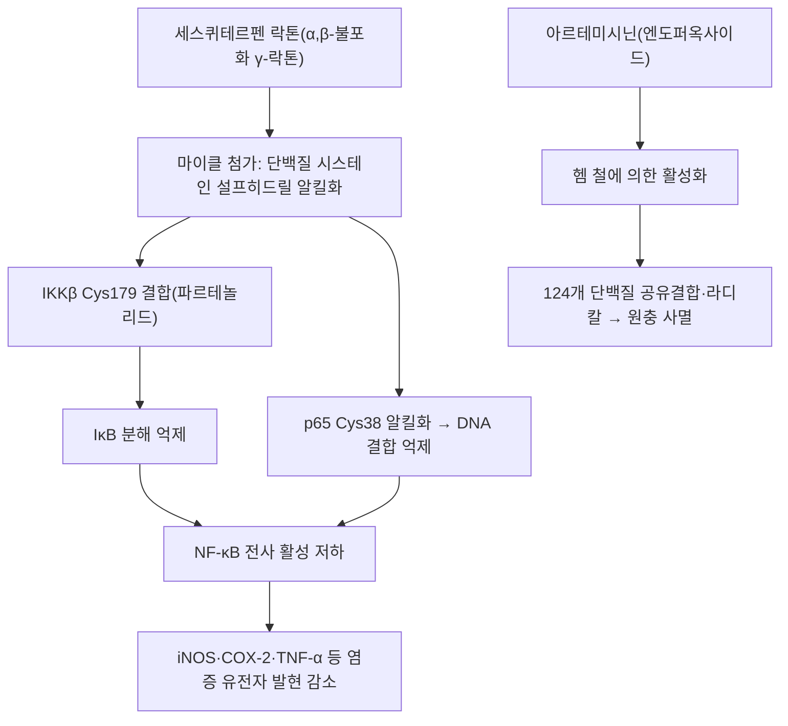

---
aliases:
  - Sesquiterpene
  - Sesquiterpenoid
  - Sesquiterpenes
  - 세스퀴테르페노이드
tags:
  - 약리
  - 약리성분
  - 화학분류
  - 테르펜
title: 세스퀴테르펜
date: 2026-09-21
출처: "https://pubchem.ncbi.nlm.nih.gov/compound/445713"
---

# 🔬 세스퀴테르펜 (Sesquiterpenes)

> **핵심 3줄 요약 (Key Summary)**:
> - 🌿 기원 본초 & 화학 계열: 세 개의 이소프렌($C_5H_8$) 단위로 구성된 15개 탄소 골격($C_{15}H_{24}$)의 천연 테르페노이드 화합물군. [[백출]](아트락틸론), [[목향]](코스투놀라이드), [[청호]](아르테미시닌) 등 한약 정유 및 보기이기 본초의 핵심 약리 물질. (⚠️ 단일 화합물이 아니라 화학 분류(class)입니다. §1)
> - 🎯 핵심 분자 표적: 세스퀴테르펜 락톤의 $\alpha,\beta$-불포화 $\gamma$-락톤이 단백질의 설프히드릴(-SH)기(IKK·p65 소단위의 시스테인 잔기 등)와 마이클 첨가 반응을 일으켜 NF-$\kappa$B 경로를 억제. (§3)
> - 🩺 주요 약리 활성: 세스퀴테르펜 락톤 구조를 중심으로 NF-$\kappa$B 억제·항염·항암·항말라리아 및 위점막 보호 활성 발휘. (⚠️ 위점막 보호 기전과 성분별 근거는 서술마다 다릅니다. §5)
> - ⚠️ 근거 수준·안전성: 이 노트는 class 노트라 개별 성분의 근거를 본초 전탕에 그대로 옮길 수 없습니다. 원문의 'NF-κB 핵 내 이동 직접 차단'과 '프로스타글란딘 합성 촉진', 아트락틸론의 위점막 보호는 확인된 문헌과 달라 ⚠️로 표기했고, 세스퀴테르펜 락톤은 국화과 접촉 알레르기 항원으로 알려져 있습니다. (§3·§5·§7)

---

## 📌 목차
1. [기본 화학 정보 & 분자 구조식 (Chemical Identity)](#1-기본-화학-정보--분자-구조식-chemical-identity)
2. [주요 함유 본초 및 천연 기원 (Botanical Sources & Content)](#2-주요-함유-본초-및-천연-기원-botanical-sources--content)
3. [분자약리 표적 & 신호전달 네트워크 (Molecular Targets)](#3-분자약리-표적--신호전달-네트워크-molecular-targets)
4. [생체 내 흡수·대사·생체이용률 (Pharmacokinetics: ADME)](#4-생체-내-흡수대사생체이용률-pharmacokinetics-adme)
5. [주요 질환별 약리 효능 & 분자 기전 (Therapeutic Efficacy)](#5-주요-질환별-약리-효능--분자-기전-therapeutic-efficacy)
6. [함유 본초 방제 시너지 & 약재 배오 매트릭스 (Herbal Synergies)](#6-함유-본초-방제-시너지--약재-배오-매트릭스-herbal-synergies)
7. [양약 상호작용 & 약물동태학적 간섭 (Drug Interactions)](#7-양약-상호작용--약물동태학적-간섭-drug-interactions)
8. [💡 사용자 진료실 핵심 필기 & 임상 응용 팁 (Melt-In & High-Yield)](#8--사용자-진료실-핵심-필기--임상-응용-팁-melt-in--high-yield)
9. [출처 및 학술 참고 문헌 (References)](#9-출처-및-학술-참고-문헌-references)

---

## 1. 기본 화학 정보 & 분자 구조식 (Chemical Identity)

> [!info] 🧪 3D 뷰어 미적용
> 세스퀴테르펜은 단일 화합물이 아니라 C15 테르페노이드의 화학 분류(class)이므로 PubChem CID 기반 3D 뷰어를 삽입하지 않습니다. 원문 3D 뷰어의 CID 5281767은 PubChem에서 커큐민(C21H20O6)으로 확인되어 삭제했습니다. 개별 성분은 아래 대표 성분 표의 CID를 참고하세요.

세스퀴테르펜(Sesquiterpenoids)은 [[메발론산]](Mevalonate) 및 MEP 경로를 통해 합성되는 15탄소 테르펜 화합물이다.

* 전구체: 파르네실 이인산(FPP, Farnesyl pyrophosphate).
* 대표 골격 분류:
  1. **사슬형(비고리형)**: 파르네솔(Farnesol).
  2. **단환식(Monocyclic)**: 비사볼롤(Bisabolol), 제르마크렌(Germacrene).
  3. **이환식(Bicyclic)**: 카리오필렌(Caryophyllene), 카디넨(Cadinene).
  4. **세스퀴테르펜 락톤(Sesquiterpene lactones, STLs)**: $\alpha,\beta$-불포화 $\gamma$-락톤 고리를 함유하여 단백질의 설프히드릴(-SH)기와 마이클 첨가 반응을 일으켜 강력한 생리활성을 나타냄.

| 항목 | 상세 내용 |
| :--- | :--- |
| **구조 분류** | C15 테르페노이드(이소프렌 3단위). 화학 분류(class) 개념이라 단일 IUPAC명·PubChem CID·CAS 번호가 없고, 개별 성분마다 별도로 등록됨 |
| **전구체** | 파르네실 이인산(FPP) — PubChem CID [445713](https://pubchem.ncbi.nlm.nih.gov/compound/445713), C15H28O7P2, 382.33 |
| **분자식 범위** | 탄화수소형은 C15H24(예: β-카리오필렌 204.35). 알코올·케톤·락톤·엔도퍼옥사이드 등 산소 함유 유도체는 분자식이 달라짐(예: 파르네솔 C15H26O, 코스투놀라이드 C15H20O2, 아르테미시닌 C15H22O5) |
| **화학 골격 분류** | 사슬형·단환식·이환식·세스퀴테르펜 락톤(위 원문 목록). 락톤형의 활성 구조는 알킬화 중심(마이클 수용체)의 반응성·친유성·분자 기하로 설명됨(Ghantous 2010) |
| **물리화학적 성상** | class 전체를 대표하는 값은 확인하지 못했습니다. ⚠️ 내용 검토 필요 (볼트 [[테르펜]] 노트는 세스퀴테르펜을 '약한 휘발성, 쓴맛 정유/락톤'으로 정리하나 문헌 근거는 확인하지 못함) |
| **식물 내 생합성 경로** | 메발론산·MEP 경로 → FPP → 세스퀴테르펜 합성효소가 다양한 골격을 생성(Degenhardt 2009, 제목 기준 인용). 성분별 세부 경로는 확인하지 못했습니다. ⚠️ 내용 검토 필요 |

### 대표 성분의 PubChem 등록 (2026-09-21 PubChem 조회)

| 성분 | 골격 | PubChem CID | 분자식 / 분자량 | 볼트 연계 |
| :--- | :--- | :--- | :--- | :--- |
| 파르네솔(Farnesol) | 사슬형 | [445070](https://pubchem.ncbi.nlm.nih.gov/compound/445070) | C15H26O / 222.37 | — |
| 비사볼롤(Bisabolol) | 단환식 | [10586](https://pubchem.ncbi.nlm.nih.gov/compound/10586) (입체 지정 레코드 [1549992](https://pubchem.ncbi.nlm.nih.gov/compound/1549992)) | C15H26O / 222.37 | — |
| β-카리오필렌(Caryophyllene) | 이환식(bicyclo[7.2.0]) | [5281515](https://pubchem.ncbi.nlm.nih.gov/compound/5281515) | C15H24 / 204.35 | — |
| 코스투놀라이드(Costunolide) | 락톤(10원환) | [5281437](https://pubchem.ncbi.nlm.nih.gov/compound/5281437) | C15H20O2 / 232.32 | [[목향]] |
| 데하이드로코스투스락톤 | 락톤(아줄레노퓨란온) | [73174](https://pubchem.ncbi.nlm.nih.gov/compound/73174) | C15H18O2 / 230.30 | [[데하이드로코스투스락톤]] |
| 파르테놀리드(Parthenolide) | 락톤(참고: 국화과 페버퓨 유래) | [6473881](https://pubchem.ncbi.nlm.nih.gov/compound/6473881) | C15H20O3 / 248.32 | — |
| 아르테미시닌(Artemisinin) | 엔도퍼옥사이드 락톤 | [68827](https://pubchem.ncbi.nlm.nih.gov/compound/68827) | C15H22O5 / 282.33 | [[아르테미시닌]] |
| 아트락틸론(Atractylon) | 세스퀴테르펜(퓨란 골격) | [3080635](https://pubchem.ncbi.nlm.nih.gov/compound/3080635) | C15H20O / 216.32 | [[아트락틸론]] |
| β-유데스몰(β-Eudesmol) | 세스퀴테르페놀 | [91457](https://pubchem.ncbi.nlm.nih.gov/compound/91457) | C15H26O / 222.37 | [[β-유데스몰]] |
| 큐커디온(Curdione) | 세스퀴테르펜 케톤 | [14106072](https://pubchem.ncbi.nlm.nih.gov/compound/14106072) | C15H24O2 / 236.35 | — |
| 제둠발론 (원문 표기) | ⚠️ 표기 미확인 | 해당 없음 | 아출 유래 세스퀴테르펜으로 zedoarondiol이 보고됨: CID [24834047](https://pubchem.ncbi.nlm.nih.gov/compound/24834047), C15H24O3 / 252.35. 원문의 '제둠발론'과 같은 성분인지는 확인하지 못했습니다. ⚠️ 내용 검토 필요 | — |

* 위 표의 골격명은 PubChem 등록 IUPAC명 기준의 분류이며, 볼트에 노트가 없는 성분(코스투놀라이드·큐커디온 등)은 링크하지 않았습니다.
* 세스퀴테르펜 락톤은 식물에서 자기 방어 등 다양한 생태적 기능을 하며 국화과(Asteraceae) 식물에서 특히 다양하게 보고됩니다(Chadwick 2013).

---

## 2. 주요 함유 본초 및 천연 기원 (Botanical Sources & Content)

### 대표 한약재 및 함유 세스퀴테르펜 (원문 표)

| 본초 | 주요 세스퀴테르펜 성분 | 임상 효능 및 약리 |
| :--- | :--- | :--- |
| [[청호]] | [[아르테미시닌]](Artemisinin) | 청열해서, 학질(말라리아) 치료 |
| [[목향]] | 코스투놀라이드(Costunolide), [[데하이드로코스투스락톤]] | 행기지통, 건비소식, 위장 연동 조절 |
| [[백출]] | [[아트락틸론]](Atractylon) | 건비익기, 조습이수, 위점막 세포 보호 |
| [[창출]] | [[β-유데스몰]]($\beta$-Eudesmol) | 조습건비, 항궤양, 신경근 접합부 조절 |
| [[아출]] | 큐커디온(Curdione), 제둠발론 | 파혈거어, 행기지통, 항종양 |

### 기원 식물 (볼트 본초 노트 기준)

| 함유 본초 | 기원 식물학적 명칭 (과명 / 학명) | 주요 함유 약용 부위 | 한의학적 귀경 및 약효 특성 |
| :--- | :--- | :--- | :--- |
| [[청호]] (靑蒿) | 국화과 / 개똥쑥 *Artemisia annua* L. | 지상부 | 청열해서, 학질 치료(원문 표) |
| [[목향]] (木香) | 국화과 / 운목향 *Aucklandia lappa* Decne. (또는 *Saussurea costus*) | 뿌리 | 행기지통, 건비소식(원문 표) |
| [[백출]] (白朮) | 국화과 / 큰꽃삽주 *Atractylodes macrocephala* Koidz. 또는 삽주 *Atractylodes japonica* Koidz. | 뿌리줄기 | 건비익기, 조습이수(원문 표) |
| [[창출]] (蒼朮) | 국화과 / 가는잎삽주 *Atractylodes lancea* (Thunb.) DC. 또는 북창출 *Atractylodes chinensis* | 뿌리줄기 | 조습건비(원문 표) |
| [[아출]] (莪朮) | 생강과 / 봉아출 *Curcuma phaeocaulis* Val. 또는 온울금 | 뿌리줄기(근경) | 파혈거어, 행기지통(원문 표) |

* **성분–본초 대응의 문헌 근거**:
  * 코스투놀라이드와 데하이드로코스투스락톤은 목향(Aucklandiae Radix)의 주요 활성 성분으로 기술됩니다(Dong 2018).
  * 아트락틸론은 백출(*A. macrocephala*)에서 분리된 주성분으로 기술되며(Xu 2026), *A. japonica* 쪽 함량이 *A. chinensis*·*A. macrocephala*보다 높았습니다(Chen 2016).
  * β-유데스몰은 창출(*A. lancea*)의 주성분으로 기술됩니다(Kimura 1992).
  * 큐커디온은 아출류(Curcumae Rhizoma)의 활성 세스퀴테르펜으로 기술됩니다(Yang 2025).
  * 아르테미시닌은 청호 추출물에서 발견되었습니다(Tu 2011).
* **함량(지표 함량 %)**: 원문에 수치가 없으며 성분별 함량은 문헌으로 확인하지 못했습니다. ⚠️ 내용 검토 필요
* ⚠️ 원문 '제둠발론'의 표준 명칭과 아출 기원 종(봉아출 vs 다른 *Curcuma*)과의 대응은 확인하지 못했습니다(§1).

---

## 3. 분자약리 표적 & 신호전달 네트워크 (Molecular Targets)

### 1) 핵심 분자 표적 (Molecular Targets)

1. **강력한 항염증 및 NF-$\kappa$B 억제**:
   * 세스퀴테르펜 락톤(코스투놀라이드 등)은 IKK 효소 또는 p65 소단위의 시스테인 잔기를 알킬화하여 **NF-$\kappa$B 핵 내 이동을 직접 차단**한다.
   * iNOS, COX-2, TNF-$\alpha$, IL-1$\beta$의 유전자 발현을 차단하여 만성 염증을 억제한다.
   * 근거 (검증됨):
     * 파르테놀리드는 IKKβ에 직접 결합하며 IKKβ의 Cys179 돌연변이에서 민감성이 사라졌고, 항염 활성은 다른 세스퀴테르펜 락톤과 공유하는 α-메틸렌 γ-락톤 부분이 매개했습니다(Kwok 2001).
     * 세스퀴테르펜 락톤은 p65의 Cys38을 알킬화해 DNA 결합을 억제하며, 파르테놀리드도 같은 기전으로 제시되었습니다(García-Piñeres 2001).
     * 세스퀴테르펜 락톤은 여러 자극에서 IκB-α·IκB-β의 분해를 막아 NF-κB 활성화를 억제했고, 이미 활성화된 NF-κB의 DNA 결합에는 영향이 없었으며, 엑소메틸렌이 없는 락톤은 억제하지 못했습니다(Hehner 1998).
     * 코스투놀라이드는 ApoE-/- 마우스 동맥경화 모델에서 IKKβ에 공유결합해 NF-κB 매개 염증을 억제했다고 보고되었고(Huang 2023), LPS 유도 폐손상 모델에서 IKK/NF-κB 신호 억제가 보고되었습니다(Zhu 2024, 제목 기준 인용).
     * 코스투놀라이드 종설은 표적으로 MAPK·Akt·NF-κB·STAT·AP-1을 들고, COX-2·iNOS·NO·프로스타글란딘·사이토카인 생성 감소를 정리합니다(Kim 2019).
     * 코스투놀라이드는 마우스 위 조직에서 NF-κB·TNF-α·NO·iNOS·COX-2를 억제했습니다(Zheng 2016).
   * ⚠️ 내용 검토 필요: 위 '**NF-κB 핵 내 이동을 직접 차단**' 서술은 확인된 기전과 다릅니다. 확인된 것은 p65 Cys38 알킬화에 의한 DNA 결합 억제(García-Piñeres 2001), IκB 분해 억제(Hehner 1998), IKKβ Cys179 결합(Kwok 2001)이며, 핵 내 이동의 직접 차단은 초록에서 확인하지 못했습니다. 연구마다 강조하는 기전이 서로 다릅니다.
   * ⚠️ 내용 검토 필요: IL-1β 유전자 발현 차단은 이번 조회의 초록에서 확인하지 못했습니다. 또한 위 기전 근거의 상당수가 파르테놀리드·헬레날린 등 다른 세스퀴테르펜 락톤 연구이며, 락톤이라도 α-메틸렌 구조가 없으면 억제하지 못했으므로(Hehner 1998) 코스투놀라이드 이외의 성분·본초로 일반화할 수 없습니다.
2. **항말라리아 활성 (아르테미시닌)**:
   * 청호(*Artemisia annua*) 유래의 **아르테미시닌(Artemisinin)**은 엔도퍼옥사이드(Endoperoxide bridge) 구조를 통해 말라리아 원충 내 철($Fe^{2+}$)과 반응하여 자유 라디칼을 형성, 충체를 파괴한다 (2015년 노벨 생리의학상).
   * 근거 (검증됨):
     * 알킨 표지 아르테미시닌 유사체로 열원충의 공유결합 단백질 표적 124개가 확인되었고, 활성화의 주된 원인은 유리 제1철이 아니라 헴이었습니다(Wang 2015).
     * 아르테미시닌의 강력한 활성은 원충의 헤모글로빈 소화에 의존했습니다(Klonis 2011).
     * 아르테미시닌의 발견 과정은 투유유의 회고에 정리되어 있습니다(Tu 2011).
     * 2015년 노벨 생리의학상은 캠벨, 오무라, 투유유가 공동 수상했습니다(노벨재단 수상 페이지).
   * ⚠️ 내용 검토 필요: 위 '철($Fe^{2+}$)과 반응' 서술은 Wang 2015에서 유리 제1철이 아니라 헴이 주된 활성화 인자로 보고되어 표현의 재확인이 필요합니다. 코스투놀라이드 등 다른 성분에는 적용되지 않는 아르테미시닌 고유 기전입니다.

### 2) 세스퀴테르펜 락톤 공통 특성
* 항암·항염 효과를 높이는 화학적 성질로 알킬화 중심의 반응성, 친유성, 분자 기하와 전자적 특성이 제시되며, 임상시험 단계의 세스퀴테르펜 락톤은 아르테미시닌·타프시가르긴·파르테놀리드와 그 합성 유도체입니다(Ghantous 2010).

---

## 4. 생체 내 흡수·대사·생체이용률 (Pharmacokinetics: ADME)

⚠️ 내용 검토 필요: 이 노트는 화학 분류(class)를 다루므로 일반화된 약동학 수치를 제시할 수 없습니다. 아래는 개별 성분의 확인된 자료뿐입니다.

* **경구·전탕 흡수**:
  * 목향 성분: 랫드에 목향 추출물을 경구 투여했을 때 코스투놀라이드와 데하이드로코스투스락톤의 약동학 지표(AUC0-t, Cmax, Tmax, Vd, CL)가 단일 성분 투여군과 유의하게 달랐고, 추출물 형태에서 상대 생체이용률이 개선되었습니다. 위궤양 랫드에서는 데하이드로코스투스락톤의 Tmax,2가 늘고 Cmax·AUC0-t가 줄었습니다(Dong 2018).
  * 아르테미시닌: 반복 경구 투여 시 혈중 농도가 떨어지는 자가유도가 보고되었습니다(§7).
  * 반감기·절대 생체이용률 등 성분별 수치와 전탕 시 잔존량은 확인하지 못했습니다. ⚠️ 내용 검토 필요
* **장내 미생물 대사, P-gp 기질성**: class 수준의 문헌을 확인하지 못했습니다. ⚠️ 내용 검토 필요
* **간 대사**: 건강 성인 14명에게 아르테미시닌-피페라퀸 2일 경구 투여 후 혈장에서 아르테미시닌의 1상 대사체 4종(M1~M3, 데옥시-아르테미시닌)과 2상 대사체 2종(M4·M5)이 검출되었습니다(Zang 2014). 다른 성분의 CYP 대사는 확인하지 못했습니다. ⚠️ 내용 검토 필요
* **전탕 안정성**: 볼트 [[아르테미시닌]] 노트는 엔도퍼옥사이드 구조가 장시간 가열 시 열분해되어 후하(後下)를 원칙으로 서술합니다(볼트 노트 기준, 이 노트에서 재검증하지 못함).

---

## 5. 주요 질환별 약리 효능 & 분자 기전 (Therapeutic Efficacy)

### 1) 소화기: 위장 점막 보호 및 기 순환 촉진
* **위장 점막 보호 및 기 순환 촉진**:
  * 비위 점막 혈류를 개선하고 내인성 프로스타글란딘 합성을 촉진하여 궤양을 방어한다.
* 근거 (검증됨):
  * 코스투놀라이드(5·20 mg/kg)와 데하이드로코스투스락톤은 마우스 에탄올 위궤양에서 궤양 지수와 조직 손상을 줄였고, 코스투놀라이드는 NF-κB·TNF-α·NO·iNOS·COX-2를 억제하고 IL-10과 SOD를 높이며 PCNA 발현으로 점막 상피 증식을 촉진했습니다. 코스투놀라이드가 더 많은 경로를 조절했습니다(Zheng 2016).
  * 파르테놀리드(페버퓨 유래)는 에탄올·피록시캄 궤양을 줄였고, 인도메타신·L-NAME·요힘빈 전처치로 효과가 사라져 프로스타글란딘·산화질소·아드레날린 수용체 관여가 시사되었습니다(Ferraz 2026). 이 노트의 본초 성분이 아닙니다.
  * 백출 유래 성분: *A. ovata* 뿌리줄기의 세스퀴테르페노이드 5종 중 아트락틸론·아트락틸레놀라이드 I·비아트락틸올라이드는 위점막 세포에 강한 독성을 보였고, 아트락틸레놀라이드 III만 에탄올 유도 세포 손상과 랫드 위궤양(10 mg/kg)을 줄였습니다(Wang 2010).
  * 아트락틸론은 LPS 유도 RAW 264.7 세포에서 NO·PGE2 생성과 iNOS·COX-2 발현을 억제했고 마우스 진통·부종 모델에서 효과가 있었습니다(Chen 2016).
* ⚠️ 내용 검토 필요: 원문의 '내인성 프로스타글란딘 합성 촉진'은 본초 성분에서 확인하지 못했고, 코스투놀라이드는 오히려 COX-2를 억제했습니다(Zheng 2016). 프로스타글란딘 관여는 파르테놀리드에서만 시사되었습니다. '비위 점막 혈류 개선'과 '기 순환 촉진'도 확인하지 못했습니다.
* ⚠️ 내용 검토 필요: 원문 표의 아트락틸론 '위점막 세포 보호'는 Wang 2010에서 아트락틸론이 위점막 세포에 강한 독성을 보인 결과와 다릅니다. 위점막 보호 성분은 아트락틸레놀라이드 III로 보고되었습니다.

### 2) 항염증
* NF-κB 억제와 염증 유전자 발현 감소는 §3에 정리했습니다. 이 외에 아출 유래로 보고된 zedoarondiol이 H2O2 손상 HUVEC에서 NF-κB p65 Ser536 인산화를 낮추고 VCAM-1·ICAM-1 발현과 THP-1 세포 부착을 줄였습니다(Xie 2026, 세포 수준). 원문 표의 '제둠발론'과 같은 성분인지는 확인하지 못했습니다. ⚠️ 내용 검토 필요

### 3) 항암 (전임상)
* 임상시험 단계로 언급되는 세스퀴테르펜 락톤은 아르테미시닌·타프시가르긴·파르테놀리드와 그 유도체입니다(Ghantous 2010). 이 노트의 본초 성분 중 아르테미시닌 외에는 임상시험 후보로 확인하지 못했습니다. ⚠️ 내용 검토 필요
* 큐커디온은 인간 자궁근종 세포의 증식을 억제하고 세포자멸사를 유도하며 YTHDF1 발현을 낮췄고 랫드 자궁근종 모델에서도 평가되었습니다(Yang 2025).
* 아트락틸론은 HepG2 간암 세포에서 PI3K/AKT/mTOR 경로 억제와 자가포식 의존적 미토콘드리아 세포자멸사를 유도했습니다(Xu 2026).
* 코스투놀라이드의 항암 전임상 근거는 종설에 정리되어 있습니다(Kim 2019).
* ⚠️ 내용 검토 필요: 원문 표의 아출 '항종양'과 백출·목향의 항암 효능은 세포·동물 수준이며, 인체 임상 근거는 확인하지 못했습니다.

### 4) 항말라리아
* 아르테미시닌 기전은 §3에 정리했습니다(Wang 2015; Klonis 2011; Tu 2011). 실제 임상 처방은 청호 전탕이 아니라 정제된 아르테미시닌 제제를 전제로 한 근거이며, 청호 전탕의 말라리아 치료 근거는 이번 조회에서 확인하지 못했습니다. ⚠️ 내용 검토 필요

### 5) 신경근 접합부 (창출·β-유데스몰)
* β-유데스몰(10~80 μM)은 마우스 횡격막에서 네오스티그민이 유발한 강축 소실·근섬유속 수축·연축 증강을 길항했고, 시냅스 전에서 아세틸콜린의 재생성 방출을 억제하는 작용으로 제시되었으며 투보쿠라린 유사 기전은 아니었습니다(Chiou 1992).
* 창출의 주성분 β-유데스몰은 bis-ammonium 유도체의 신경근 차단을 증강했습니다(Kimura 1992, 제목 기준 인용).
* ⚠️ 내용 검토 필요: 원문 '신경근 접합부 조절'은 위 적출 근육 실험까지 확인했고 인체 근거는 확인하지 못했습니다. '항궤양'은 β-유데스몰 단독으로 이번에 확인하지 못했습니다.

---

## 6. 함유 본초 방제 시너지 & 약재 배오 매트릭스 (Herbal Synergies)

| 함유 본초 / 방제 | 공존 유효 성분군 | 분자약리 시너지 기전 | 전통 한의학적 효능 연계 |
| :--- | :--- | :--- | :--- |
| [[청골산]] | [[청호]](좌약) + [[은시호]]·[[호황련]]·[[지모]]·[[지골피]]·[[진교]]·[[별갑]]·[[감초]] (볼트 처방 노트에서 구성 확인) | ⚠️ 내용 검토 필요 — 청호의 아르테미시닌이 처방 효과에 기여하는지는 문헌 미확인 | 자음청허열, 퇴골증. 청호는 음분의 복열을 체표로 투출 |
| [[삼령백출산]] | [[백출]](군약, 6~8g) + [[인삼]]·[[복령]]·[[감초]]·[[산약]]·[[연자육]]·[[백편두]]·[[의이인]]·[[사인]]·[[길경]] (볼트 처방 노트에서 구성 확인) | ⚠️ 내용 검토 필요 — 백출 세스퀴테르펜의 기여 문헌 미확인 | 조습건비, 만성 설사 |
| [[평위산]] | [[창출]](군약, 8~12g) + [[후박]]·[[진피]]·[[감초]]·[[생강]]·[[대추]] (볼트 처방 노트에서 구성 확인) | ⚠️ 내용 검토 필요 — 창출 β-유데스몰의 기여 문헌 미확인 | 조습건비, 소화기 습체 |
| [[귀비탕]] | [[백출]](군약, 6~8g)·[[목향]](좌약, 3~4g) + [[인삼]]·[[복신]]·[[감초]]·[[황기]]·[[당귀]]·[[용안육]]·[[산조인]]·[[원지]]·[[생강]]·[[대추]] (볼트 처방 노트에서 구성 확인) | ⚠️ 내용 검토 필요 — 목향 락톤류의 기여 문헌 미확인 | 보기건비·안신, 목향은 행기지통·체기 방지 |
| [[통경환]] | [[아출]](봉출, 신약, 15g) + [[대황]]·[[도인]]·[[홍화]]·[[당귀]]·[[백작약]]·[[천궁]]·[[우슬]]·[[삼릉]]·[[육계]]·[[봉밀]] (볼트 처방 노트에서 구성 확인) | ⚠️ 내용 검토 필요 — 아출 세스퀴테르펜의 처방 내 기여는 문헌 미확인 (볼트 통경환 노트는 삼릉·봉출 세스퀴테르펜의 섬유아세포 증식 억제를 서술하나 이 노트에서 재검증하지 못함) | 행기파혈, 소적소징 |

* 위 처방은 볼트 처방 노트에서 해당 본초가 구성에 들어 있음을 확인한 것만 넣었습니다. 처방 수준의 세스퀴테르펜 시너지를 검증한 문헌은 확인하지 못했습니다. ⚠️ 내용 검토 필요

---

## 7. 양약 상호작용 & 약물동태학적 간섭 (Drug Interactions)

* **CYP450·MDR1 간섭 (아르테미시닌)**:
  * 아르테미시닌 계열 약물은 인간 PXR과 인간·마우스 CAR를 활성화하고, 인간 간세포와 장세포주(LS174T)에서 CYP2B6·CYP3A4·MDR1 발현을 유도했습니다. 다회 투여 시 혈중 농도 감소는 CYP2B6 매개 자가유도로 설명되어 왔습니다(Burk 2005).
  * 건강 성인 14명에게 아르테미시닌-피페라퀸을 2일 경구 투여했을 때 아르테미시닌과 1상 대사체의 AUC0-t가 줄고 경구 청소율이 늘었으며 1상 대사능이 1.5배 늘었습니다. 부프로피온·미다졸람 프로브로 CYP2B6·CYP3A 활성을 함께 평가했습니다(Zang 2014).
  * 목향·백출·창출·아출 성분의 CYP·P-gp 상호작용은 확인하지 못했습니다. ⚠️ 내용 검토 필요
* **접촉 알레르기 (국화과)**:
  * 15년간 7,163명의 상용 첩포검사에서 세스퀴테르펜 락톤 혼합물(SL mix)에 157명(2.19%)이 양성이었고, 성분 중 코스투놀라이드가 가장 자주 양성이었으며 다음이 데하이드로코스투스락톤, 알란토락톤이었습니다(Paulsen 2011).
  * 세스퀴테르펜 락톤 함유 식물이 농장 노동자에게 접촉피부염을 일으키는 것으로 알려져 있고, 유전독성 우려와 아르테미시닌류의 배태자독성 우려도 제기되었습니다. 치료적 이용을 가능하게 하는 알킬화 성질이 독성의 원인이기도 합니다(Amorim 2013).
  * ⚠️ 내용 검토 필요: 목향·백출·창출·청호 등을 경구 복용할 때의 알레르기·독성 위험 수준과 임신 중 사용 안전성은 이번 조회에서 확인하지 못했습니다.
* **유사 기전 양약 병용 시 고려사항**: NF-κB·COX-2 경로에 작용하는 양약(NSAIDs·스테로이드 등)과의 병용 상호작용 문헌은 확인하지 못했습니다. ⚠️ 내용 검토 필요

---

## 8. 💡 사용자 진료실 핵심 필기 & 임상 응용 팁 (Melt-In & High-Yield)

* **사용자 원문 필기 (100% 융합 및 보존)**:
  * 기존 노트에 원장님의 수기 필기는 없었습니다. (추후 필기가 생기면 이곳에 원문 그대로 추가)
* **진료실 실전 처방 & 생체이용률 극대화 팁**:
  1. 세스퀴테르펜은 화학 분류(class)라서 코스투놀라이드·아르테미시닌·아트락틸론 등의 세포·동물 근거를 백출·목향·청호 전탕의 효능 근거로 그대로 옮기지 않도록 주의합니다(§4). 아르테미시닌의 항말라리아 근거는 정제 제제 기준입니다(§5).
  2. 체질별·병증별 적용은 원문·문헌에서 확인되지 않아 기재하지 않습니다. ⚠️ 내용 검토 필요 (국화과 알레르기 병력 환자는 §7 참고)

---

## 9. 출처 및 학술 참고 문헌 (References)

1. **Ghantous A, et al. (2010)**. *What made sesquiterpene lactones reach cancer clinical trials?* **Drug Discov Today**, 15(15-16):668-678. PMID: [20541036](https://pubmed.ncbi.nlm.nih.gov/20541036/) · DOI: [10.1016/j.drudis.2010.06.002](https://doi.org/10.1016/j.drudis.2010.06.002)
   - **[연구 요약]**: 세스퀴테르펜 락톤의 화학적 반응성(마이클 첨가), NF-$\kappa$B 및 항암 분자 표적을 체계화. 임상시험 단계 화합물은 아르테미시닌·타프시가르긴·파르테놀리드와 유도체.
2. **Tu Y (2011)**. *The discovery of artemisinin (qinghaosu) and gifts from Chinese medicine*. **Nat Med**, 17(10):1217-1220. PMID: [21989013](https://pubmed.ncbi.nlm.nih.gov/21989013/) · DOI: [10.1038/nm.2471](https://doi.org/10.1038/nm.2471)
   - **[연구 요약]**: 한의학 청호 추출물에서 아르테미시닌을 발견하고 말라리아 치료제로 정립한 투유유 박사의 노벨상 수상 연구.
   - ⚠️ 정정: 원문 제목의 끝 부분 "to the world"는 PubMed 등록 제목에 없어 삭제했습니다.
3. **Kwok BH, et al. (2001)**. *The anti-inflammatory natural product parthenolide from the medicinal herb Feverfew directly binds to and inhibits IkappaB kinase*. **Chem Biol**, 8(8):759-766. PMID: [11514225](https://pubmed.ncbi.nlm.nih.gov/11514225/) · DOI: [10.1016/s1074-5521(01)00049-7](https://doi.org/10.1016/s1074-5521(01)00049-7)
   - **[연구 요약]**: 파르테놀리드가 IKKβ에 직접 결합하며 Cys179 돌연변이에서 민감성이 소실, α-메틸렌 γ-락톤이 항염 활성을 매개.
4. **García-Piñeres AJ, et al. (2001)**. *Cysteine 38 in p65/NF-kappaB plays a crucial role in DNA binding inhibition by sesquiterpene lactones*. **J Biol Chem**, 276(43):39713-39720. PMID: [11500489](https://pubmed.ncbi.nlm.nih.gov/11500489/) · DOI: [10.1074/jbc.M101985200](https://doi.org/10.1074/jbc.M101985200)
   - **[연구 요약]**: p65 Cys38→Ser 돌연변이에서 세스퀴테르펜 락톤의 DNA 결합 억제가 사라짐. 파르테놀리드도 p65 Cys38 알킬화로 억제하는 것으로 제시.
5. **Hehner SP, et al. (1998)**. *Sesquiterpene lactones specifically inhibit activation of NF-kappa B by preventing the degradation of I kappa B-alpha and I kappa B-beta*. **J Biol Chem**, 273(3):1288-1297. PMID: [9430659](https://pubmed.ncbi.nlm.nih.gov/9430659/) · DOI: [10.1074/jbc.273.3.1288](https://doi.org/10.1074/jbc.273.3.1288)
   - **[연구 요약]**: 여러 자극에서 IκB-α·β 분해를 막아 NF-κB 활성화를 억제하나 활성화된 NF-κB의 DNA 결합에는 영향이 없었고, 엑소메틸렌이 없는 락톤은 억제하지 못함.
6. **Huang ZQ, et al. (2023)**. *Costunolide alleviates atherosclerosis in high-fat diet-fed ApoE(-/-) mice through covalently binding to IKKβ and inhibiting NF-κB-mediated inflammation*. **Acta Pharmacol Sin**, 44(1):58-70. PMID: [35710877](https://pubmed.ncbi.nlm.nih.gov/35710877/) · DOI: [10.1038/s41401-022-00928-0](https://doi.org/10.1038/s41401-022-00928-0)
   - **[연구 요약]**: 코스투놀라이드(10·20 mg/kg/일)가 마우스 동맥경화를 완화하고 대식세포에서 NF-κB/p65 신호를 차단, IKKβ 공유결합을 통한 NF-κB 불활성화를 제시(초록 일부 확인).
7. **Zhu X, et al. (2024)**. *Costunolide attenuates LPS-induced inflammation and lung injury through inhibiting IKK/NF-κB signaling*. **Naunyn Schmiedebergs Arch Pharmacol**, 397(3):1601-1610. PMID: [37688623](https://pubmed.ncbi.nlm.nih.gov/37688623/) · DOI: [10.1007/s00210-023-02705-0](https://doi.org/10.1007/s00210-023-02705-0)
   - **[연구 요약]**: 제목 기준 인용(초록 미확인).
8. **Kim DY, et al. (2019)**. *Costunolide-A Bioactive Sesquiterpene Lactone with Diverse Therapeutic Potential*. **Int J Mol Sci**, 20(12):2926. PMID: [31208018](https://pubmed.ncbi.nlm.nih.gov/31208018/) · DOI: [10.3390/ijms20122926](https://doi.org/10.3390/ijms20122926)
   - **[연구 요약]**: 코스투놀라이드의 항산화·항염·항암 등 전임상 활성과 표적(MAPK·Akt·NF-κB·STAT·AP-1), COX-2·iNOS·NO·프로스타글란딘·사이토카인 감소를 정리한 종설.
9. **Zheng H, et al. (2016)**. *Evaluation of protective effects of costunolide and dehydrocostuslactone on ethanol-induced gastric ulcer in mice based on multi-pathway regulation*. **Chem Biol Interact**, 250:68-77. PMID: [26970604](https://pubmed.ncbi.nlm.nih.gov/26970604/) · DOI: [10.1016/j.cbi.2016.03.003](https://doi.org/10.1016/j.cbi.2016.03.003)
   - **[연구 요약]**: 코스투놀라이드·데하이드로코스투스락톤의 마우스 에탄올 위궤양 보호. 코스투놀라이드는 NF-κB·TNF-α·NO·iNOS·COX-2 억제, IL-10·SOD·PCNA 증가.
10. **Dong S, et al. (2018)**. *Pharmacokinetics of costunolide and dehydrocostuslactone after oral administration of Radix aucklandiae extract in normal and gastric ulcer rats*. **J Asian Nat Prod Res**, 20(11):1055-1063. PMID: [30130142](https://pubmed.ncbi.nlm.nih.gov/30130142/) · DOI: [10.1080/10286020.2018.1489379](https://doi.org/10.1080/10286020.2018.1489379)
    - **[연구 요약]**: 목향 추출물 투여 시 두 락톤의 상대 생체이용률이 개선되었고 위궤양 랫드에서 데하이드로코스투스락톤의 흡수 지표가 변화.
11. **Ferraz CV, et al. (2026)**. *Tanacetum parthenium and parthenolide increase defensive agents and promote antisecretory activity supporting their gastroprotective actions in rodents*. **Nat Prod Res**, 40(5):1345-1353. PMID: [39506519](https://pubmed.ncbi.nlm.nih.gov/39506519/) · DOI: [10.1080/14786419.2024.2425806](https://doi.org/10.1080/14786419.2024.2425806)
    - **[연구 요약]**: 파르테놀리드의 위 보호가 인도메타신·L-NAME·요힘빈 전처치로 소실되어 프로스타글란딘·산화질소·아드레날린 수용체 관여를 시사(이 노트의 본초 성분 아님).
12. **Wang KT, et al. (2010)**. *Gastroprotective activity of atractylenolide III from Atractylodes ovata on ethanol-induced gastric ulcer in vitro and in vivo*. **J Pharm Pharmacol**, 62(3):381-388. PMID: [20487223](https://pubmed.ncbi.nlm.nih.gov/20487223/) · DOI: [10.1211/jpp.62.03.0014](https://doi.org/10.1211/jpp.62.03.0014)
    - **[연구 요약]**: 세스퀴테르페노이드 5종 중 아트락틸론은 위점막 세포에 강한 독성, 아트락틸레놀라이드 III만 세포·랫드 위궤양 보호.
13. **Chen LG, et al. (2016)**. *Anti-inflammatory and Antinociceptive Constituents of Atractylodes japonica Koidzumi*. **J Agric Food Chem**, 64(11):2254-2262. PMID: [26919689](https://pubmed.ncbi.nlm.nih.gov/26919689/) · DOI: [10.1021/acs.jafc.5b05841](https://doi.org/10.1021/acs.jafc.5b05841)
    - **[연구 요약]**: 아트락틸론이 LPS 유도 RAW 264.7 세포에서 NO·PGE2·iNOS·COX-2를 억제하고 마우스 진통·부종 모델에서 효과. 아트락틸론 함량은 *A. japonica*가 *A. chinensis*·*A. macrocephala*보다 높음.
14. **Xu J, et al. (2026)**. *Atractylon induces autophagy-dependent apoptosis in hepatocellular carcinoma cells via inhibition of the PI3K/AKT/mTOR pathway*. **Biochem Biophys Res Commun**, 808:153465. PMID: [41713198](https://pubmed.ncbi.nlm.nih.gov/41713198/) · DOI: [10.1016/j.bbrc.2026.153465](https://doi.org/10.1016/j.bbrc.2026.153465)
    - **[연구 요약]**: 백출의 주성분으로 기술된 아트락틸론이 HepG2에서 미토콘드리아 세포자멸사·자가포식을 유도하고 PI3K/AKT/mTOR를 억제(세포 수준).
15. **Chiou LC, et al. (1992)**. *Antagonism by beta-eudesmol of neostigmine-induced neuromuscular failure in mouse diaphragms*. **Eur J Pharmacol**, 216(2):199-206. PMID: [1397007](https://pubmed.ncbi.nlm.nih.gov/1397007/) · DOI: [10.1016/0014-2999(92)90361-7](https://doi.org/10.1016/0014-2999(92)90361-7)
    - **[연구 요약]**: β-유데스몰이 네오스티그민 유발 신경근 부전을 시냅스 전 작용으로 길항.
16. **Kimura M, et al. (1992)**. *Different modes of potentiation by beta-eudesmol, a main compound from Atractylodes lancea, depending on neuromuscular blocking actions of p-phenylene-polymethylene bis-ammonium derivatives in isolated phrenic nerve-diaphragm muscles of normal and alloxan-diabetic mice*. **Jpn J Pharmacol**, 60(1):19-24. PMID: [1460801](https://pubmed.ncbi.nlm.nih.gov/1460801/) · DOI: [10.1254/jjp.60.19](https://doi.org/10.1254/jjp.60.19)
    - **[연구 요약]**: 제목 기준 인용(초록 미확인). β-유데스몰을 창출의 주성분으로 기술.
17. **Yang X, et al. (2025)**. *Curdione inhibits the proliferation of human uterine leiomyomas by targeting YTHDF1*. **Phytomedicine**, 144:156938. PMID: [40505487](https://pubmed.ncbi.nlm.nih.gov/40505487/) · DOI: [10.1016/j.phymed.2025.156938](https://doi.org/10.1016/j.phymed.2025.156938)
    - **[연구 요약]**: 큐커디온이 인간 자궁근종 세포의 증식을 억제하고 세포자멸사를 유도하며 YTHDF1을 하향 조절, 랫드 모델에서도 평가.
18. **Xie BL, et al. (2026)**. *Zedoarondiol inhibits monocyte adhesion and expression of VCAM and ICAM in endothelial cells induced by oxidative stress*. **Nat Prod Res**, 40(4):1067-1073. PMID: [39381963](https://pubmed.ncbi.nlm.nih.gov/39381963/) · DOI: [10.1080/14786419.2024.2413430](https://doi.org/10.1080/14786419.2024.2413430)
    - **[연구 요약]**: zedoary turmeric 유래 zedoarondiol이 H2O2 손상 HUVEC에서 NF-κB p65 Ser536 인산화와 VCAM-1·ICAM-1 발현, 단핵구 부착을 감소(세포 수준).
19. **Wang J, et al. (2015)**. *Haem-activated promiscuous targeting of artemisinin in Plasmodium falciparum*. **Nat Commun**, 6:10111. PMID: [26694030](https://pubmed.ncbi.nlm.nih.gov/26694030/) · DOI: [10.1038/ncomms10111](https://doi.org/10.1038/ncomms10111)
    - **[연구 요약]**: 아르테미시닌 공유결합 표적 124개를 확인했고, 활성화의 주된 원인은 유리 제1철이 아니라 헴.
20. **Klonis N, et al. (2011)**. *Artemisinin activity against Plasmodium falciparum requires hemoglobin uptake and digestion*. **Proc Natl Acad Sci U S A**, 108(28):11405-11410. PMID: [21709259](https://pubmed.ncbi.nlm.nih.gov/21709259/) · DOI: [10.1073/pnas.1104063108](https://doi.org/10.1073/pnas.1104063108)
    - **[연구 요약]**: 아르테미시닌의 활성이 원충의 헤모글로빈 소화에 의존.
21. **Burk O, et al. (2005)**. *Antimalarial artemisinin drugs induce cytochrome P450 and MDR1 expression by activation of xenosensors pregnane X receptor and constitutive androstane receptor*. **Mol Pharmacol**, 67(6):1954-1965. PMID: [15761118](https://pubmed.ncbi.nlm.nih.gov/15761118/) · DOI: [10.1124/mol.104.009019](https://doi.org/10.1124/mol.104.009019)
    - **[연구 요약]**: 아르테미시닌이 PXR·CAR를 활성화해 CYP2B6·CYP3A4·MDR1 발현을 유도(인간 간세포·장세포주).
22. **Zang M, et al. (2014)**. *Auto-induction of phase I and phase II metabolism of artemisinin in healthy Chinese subjects after oral administration of a new artemisinin-piperaquine fixed combination*. **Malar J**, 13:214. PMID: [24889062](https://pubmed.ncbi.nlm.nih.gov/24889062/) · DOI: [10.1186/1475-2875-13-214](https://doi.org/10.1186/1475-2875-13-214)
    - **[연구 요약]**: 건강 성인 14명에서 2일 경구 투여 후 아르테미시닌 AUC 감소·청소율 증가·1상 대사능 1.5배 증가(초록 일부 확인).
23. **Paulsen E, et al. (2011)**. *Screening for Compositae sensitization with pure allergens: implications of molecular structure, strength of reaction, and time of testing*. **Contact Dermatitis**, 64(2):96-103. PMID: [21138444](https://pubmed.ncbi.nlm.nih.gov/21138444/) · DOI: [10.1111/j.1600-0536.2010.01822.x](https://doi.org/10.1111/j.1600-0536.2010.01822.x)
    - **[연구 요약]**: 7,163명 15년 첩포검사에서 SL mix 양성 2.19%, 코스투놀라이드가 가장 흔한 양성 성분.
24. **Amorim MH, et al. (2013)**. *Sesquiterpene lactones: adverse health effects and toxicity mechanisms*. **Crit Rev Toxicol**, 43(7):559-579. PMID: [23875764](https://pubmed.ncbi.nlm.nih.gov/23875764/) · DOI: [10.3109/10408444.2013.813905](https://doi.org/10.3109/10408444.2013.813905)
    - **[연구 요약]**: 세스퀴테르펜 락톤의 접촉피부염·독성 증후군·유전독성 우려와 아르테미시닌류의 배태자독성 우려를 정리한 종설.
25. **Chadwick M, et al. (2013)**. *Sesquiterpenoids lactones: benefits to plants and people*. **Int J Mol Sci**, 14(6):12780-12805. PMID: [23783276](https://pubmed.ncbi.nlm.nih.gov/23783276/) · DOI: [10.3390/ijms140612780](https://doi.org/10.3390/ijms140612780)
    - **[연구 요약]**: 국화과 세스퀴테르펜 락톤의 식물 내 생태적 역할과 사람에서의 염증·종양 관련 기전을 정리한 종설.
26. **Degenhardt J, et al. (2009)**. *Monoterpene and sesquiterpene synthases and the origin of terpene skeletal diversity in plants*. **Phytochemistry**, 70(15-16):1621-1637. PMID: [19793600](https://pubmed.ncbi.nlm.nih.gov/19793600/) · DOI: [10.1016/j.phytochem.2009.07.030](https://doi.org/10.1016/j.phytochem.2009.07.030)
    - **[연구 요약]**: 제목 기준 인용(초록 미확인).
27. **노벨재단**. *The Nobel Prize in Physiology or Medicine 2015 — Summary*. NobelPrize.org. [https://www.nobelprize.org/prizes/medicine/2015/summary/](https://www.nobelprize.org/prizes/medicine/2015/summary/) (2026-09-21 조회)
    - **[요약]**: 2015년 노벨 생리의학상 수상자: William C. Campbell, Satoshi Ōmura, Tu Youyou.
28. **데이터베이스 확인 항목**: PubChem Compound 445713(FPP), 445070, 10586·1549992, 5281515, 5281437, 73174, 6473881, 68827, 3080635, 91457, 14106072, 24834047 (§1 표 참조).
