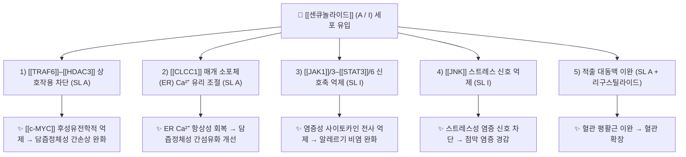

# 🔬 [[센큐놀라이드]] (Senkyunolides, 프탈라이드계 / Senkyunolide A · I)

> **핵심 3줄 요약 (Key Summary)**:
> - 🌿 기원 본초 & 화학 계열: [[천궁]](川芎, *Ligusticum chuanxiong*)의 대표적인 **프탈라이드(phthalide)계** 성분군으로, [[리구스틸라이드]](ligustilide)와 함께 천궁의 주요 지표 성분으로 보고된다. 센큐놀라이드 A(3-부틸 프탈라이드 골격)와 센큐놀라이드 I(6,7-디히드록시 치환체)가 가장 많이 연구된 대표 화합물이다.
> - 🎯 핵심 분자 표적 & 조절 경로: **센큐놀라이드 A**는 [[TRAF6]]–[[HDAC3]] 상호작용을 차단하여 [[c-MYC]]을 후성유전학적으로 억제하고(PMID: 40187727), **[[CLCC1]]** 매개 소포체(ER) Ca²⁺ 유리를 조절한다(PMID: 40664817). **센큐놀라이드 I**는 **JAK1/3–STAT3/6** 및 **JNK** 신호전달을 억제한다(PMID: 40911991).
> - 🩺 주요 약리 활성 & 질환 치료 기전: 담즙정체성 간손상·간섬유화 개선, 알레르기 비염 완화, 적출 대동맥 이완(리구스틸라이드와 함께 천궁의 대표 활성 성분, PMID: 17222996) 등이 보고되었다. 한의학적으로는 천궁의 **활혈행기(活血行氣)·거풍지통(祛風止痛)** 효능과 연결된다.
> - ⚠️ 독성·생체이용률 한계 & 상호작용: 센큐놀라이드 I의 약물동태(ADME)와 drug-likeness가 리뷰로 정리되어 있으나(PMID: 37110869), 본 노트에 인용된 논문만으로는 장관 흡수율·P-gp 기질성·CYP 간섭·혈장 반감기의 구체 수치를 확정할 수 없다(**근거 미확인**). 태그에 기재된 COX-1 억제 및 혈소판응집억제 기전 역시 인용 논문에서 직접 확인되지 않아 **근거 미확인**으로 표기한다.

---

## 📌 목차
1. [기본 화학 정보 & 분자 구조식 (Chemical Identity)](#1-기본-화학-정보--분자-구조식-chemical-identity)
2. [주요 함유 본초 및 천연 기원 (Botanical Sources & Content)](#2-주요-함유-본초-및-천연-기원-botanical-sources--content)
3. [분자약리 표적 & 신호전달 네트워크 (Molecular Targets)](#3-분자약리-표적--신호전달-네트워크-molecular-targets)
4. [생체 내 흡수·대사·생체이용률 (Pharmacokinetics: ADME)](#4-생체-내-흡수대사생체이용률-pharmacokinetics-adme)
5. [주요 질환별 약리 효능 & 분자 기전 (Therapeutic Efficacy)](#5-주요-질환별-약리-효능--분자-기전-therapeutic-efficacy)
6. [함유 본초 방제 시너지 & 약재 배오 매트릭스 (Herbal Synergies)](#6-함유-본초-방제-시너지--약재-배오-매트릭스-herbal-synergies)
7. [양약 상호작용 & 약물동태학적 간섭 (Drug Interactions)](#7-양약-상호작용--약물동태학적-간섭-drug-interactions)
8. [💡 사용자 진료실 핵심 필기 & 임상 응용 팁 (Melt-In & High-Yield)](#8--사용자-진료실-핵심-필기--임상-응용-팁-melt-in--high-yield)
9. [출처 및 학술 참고 문헌 (References)](#9-출처-및-학술-참고-문헌-references)
---
## 1. 기본 화학 정보 & 분자 구조식 (Chemical Identity)

> [!abstract]+ 🧪 3D 약리 분자 구조 (Interactive 3D Viewer)
> <iframe src="https://molecule-viewer-rho.vercel.app/?cid=3085257" style="width: 100%; height: 600px; border: none; border-radius: 12px; box-shadow: 0 4px 20px rgba(0,0,0,0.15);" allowfullscreen></iframe>

> [!note] 이미지 안내
> 본 노트에는 화학구조식 이미지 및 3D 뷰어 임베드가 포함되지 않았다. 구조 확인이 필요할 경우 PubChem 등 외부 데이터베이스에서 직접 검색할 것.

| 항목 | 상세 내용 |
| :--- | :--- |
| **IUPAC 명칭** | **Senkyunolide A**: (3S)-3-butyl-4,5-dihydro-2-benzofuran-1(3H)-one 계열(3-부틸-4,5-디히드로이소벤조퓨란-1(3H)-온) — 통상 표기, 원문 DB 대조 권장 **Senkyunolide I**: 3-butyl-6,7-dihydroxy-4,5,6,7-tetrahydro-2-benzofuran-1(3H)-one 계열 — 통상 표기, 원문 DB 대조 권장 |
| **분자식 / 분자량** | **Senkyunolide A**: C₁₂H₁₆O₂ / 약 192.25 g/mol (리구스틸라이드의 4,5-디히드로 유도체에 해당하는 프탈라이드 골격) — **계산 기반 추정, 인용 논문 본문 수치 확인 필요** **Senkyunolide I**: C₁₂H₁₈O₄ / 약 226.27 g/mol — **계산 기반 추정, 인용 논문 본문 수치 확인 필요** |
| **PubChem CID** | 근거 미확인 (인용 논문 및 제공 자료에서 확인되지 않음) |
| **CAS 등록 번호** | 근거 미확인 (인용 논문 및 제공 자료에서 확인되지 않음) |
| **화학 골격 분류** | **프탈라이드(phthalide)계** 천연물. 벤조퓨란-1(3H)-온 골격에 3번 위치 부틸(또는 부틸리덴) 측쇄를 갖는 2차 대사산물. 천궁·당귀 등 산형과(미나리과) 식물의 대표적 **저분자 지용성 성분군** |
| **물리화학적 성상** | 프탈라이드류는 전형적으로 **지용성(친유성)** 저분자 화합물로, 휘발성·불안정성이 비교적 높아 열과 빛에 의해 분해·이성질화되기 쉬운 것으로 알려져 있다. **구체적 LogP, 융점, 안정성 수치는 인용 논문에서 확인되지 않아 근거 미확인** |
| **식물 내 생합성 경로** | 프탈라이드 골격은 식물에서 통상 **폴리케타이드(아세트산-말로네이트) 경로**를 통해 형성되는 것으로 설명된다. 정확한 효소 단계(핵심 합성효소, 부틸 측쇄 도입 단계)는 본 노트 인용 논문에서 확인되지 않아 **근거 미확인** |
| **성분군 내 주요 동족체** | Senkyunolide A, Senkyunolide I (본 노트의 두 중심 화합물). 이 외에 다수의 센큐놀라이드 동족체 및 리구스틸라이드가 천궁의 화학 성분 리뷰에서 함께 정리되어 있다(PMID: 40235541) |

> [!warning] 데이터 신뢰도 표기 원칙
> 위 표에서 "통상 표기" 또는 "계산 기반 추정"으로 표기한 항목은 화학적 골격으로부터 유도한 값이며, **제공된 6편의 논문 초록·서지 정보만으로는 원문 수치를 직접 인용할 수 없어** 별도로 표시하였다. 실제 처방·연구 인용 시에는 원문 또는 PubChem/CAS 데이터베이스로 재확인할 것.

---

## 2. 주요 함유 본초 및 천연 기원 (Botanical Sources & Content)

| 함유 본초 (한글/한자) | 기원 식물학적 명칭 (과명 / 학명) | 주요 함유 약용 부위 | 지표 함량 (%) | 한의학적 귀경 및 약효 특성 |
| :--- | :--- | :--- | :--- | :--- |
| [[천궁]] (川芎) | 산형과(Apiaceae, 미나리과) / *Ligusticum chuanxiong* Hort. | 뿌리줄기(근경) 및 뿌리 | 함량 % **근거 미확인** (리구스틸라이드·센큐놀라이드류가 주요 프탈라이드 성분군으로 보고됨, PMID: 17222996 / 40235541) | 辛溫, 歸肝·膽·心包經. **活血行氣, 祛風止痛** — 혈액순환 촉진, 기체 소통, 두통·관절통·월경통 등 |
| [[천궁]]의 대표 공존 성분 | 산형과 / *Ligusticum chuanxiong* | 뿌리줄기 | — | **[[리구스틸라이드]]**(ligustilide) — 천궁의 2대 주요 성분 중 하나로, 센큐놀라이드 A와 함께 적출 대동맥 이완 작용을 나타냄(PMID: 17222996) |
| (동속·근연 본초) 일천궁·당귀 등 | 산형과 / *Cnidium officinale*, *Angelica* spp. | 근경 / 뿌리 | **근거 미확인** — 본 노트 인용 논문은 *Ligusticum chuanxiong*만을 다룸 | 문헌상 프탈라이드류 함유가 보고되나, 본 노트에서는 확인된 근거 없음 |

**요점 정리**
- 본 노트에서 근거가 확인되는 기원 식물은 **천궁(*Ligusticum chuanxiong*)** 이다. 천궁의 화학적·약리적·임상적 특성은 별도의 종합 리뷰에서 정리되어 있다(PMID: 40235541).
- 천궁의 대표 활성 성분으로 **리구스틸라이드와 센큐놀라이드 A**가 제시되며, 흰쥐 적출 대동맥 이완 실험에서 두 성분이 함께 검증되었다(PMID: 17222996).
- 센큐놀라이드 I은 천궁 유래 프탈라이드로서 식물화학·약리·약물동태·drug-likeness가 리뷰로 정리되어 있다(PMID: 37110869).

---

## 3. 분자약리 표적 & 신호전달 네트워크 (Molecular Targets)

### 1) 핵심 분자 표적 (Molecular Targets)

* **센큐놀라이드 A — TRAF6–HDAC3 축 차단 (PMID: 40187727)**
  * 담즙정체성 간손상 모델에서 센큐놀라이드 A는 **[[TRAF6]]와 [[HDAC3]]의 상호작용을 방해(interrupt)** 하는 것으로 보고되었다.
  * 그 결과 **[[c-MYC]]** 발현이 **후성유전학적(epigenetic) 수준에서 억제**되고, 담즙정체성 간손상이 완화된다. 즉 단순한 효소 활성 저해가 아니라, 단백질–단백질 상호작용(PPI)을 표적으로 하는 기전이다.
  * 세부 결합 부위(binding pocket), HDAC3 탈아세틸화 기질 특이성, c-MYC 프로모터/인핸서의 히스톤 아세틸화 변화 수치는 **근거 미확인**.

* **센큐놀라이드 A — CLCC1 매개 ER Ca²⁺ 유리 조절 (PMID: 40664817)**
  * 담즙정체성 간섬유화 모델에서 센큐놀라이드 A는 **[[CLCC1]](chloride channel CLIC-like 1) 매개 소포체(ER) Ca²⁺ 유리**를 조절함으로써 간섬유화를 개선하는 것으로 보고되었다.
  * 즉 ER–Ca²⁺ 항상성(homeostasis) 회복이 항섬유화 효과의 상류 기전으로 제시된다. 간성상세포(HSC) 활성화 억제 여부, 하류 Ca²⁺ 의존 신호(calcineurin/NFAT 등) 연결은 **근거 미확인**.

* **센큐놀라이드 I — JAK–STAT 및 JNK 억제 (PMID: 40911991)**
  * 알레르기 비염 모델에서 센큐놀라이드 I는 **[[JAK1]]/3–[[STAT3]]/6 신호축**과 **[[JNK]]** 신호전달을 억제하여 염증을 완화한다.
  * 두 축을 동시에 억제하는 **다표적(multi-target) 항염 기전**이라는 점이 특징적이다. 구체적 IC₅₀, 인산화 억제 정도(%), 세포주·동물 모델 세부는 **근거 미확인**.

* **센큐놀라이드 A — 혈관 이완 (PMID: 17222996)**
  * 흰쥐 적출 대동맥(rat isolated aorta) 실험에서 리구스틸라이드와 센큐놀라이드 A가 **이완 작용(relaxation)** 을 나타냈다.
  * 내피 의존성(eNOS/NO)인지 평활근 직접 작용(Ca²⁺ 채널, K⁺ 채널)인지의 구체 기전은 **근거 미확인**.

### 2) 신호전달 조절 요약

| 화합물 | 상류 표적 | 하류 결과 | 근거 |
| :--- | :--- | :--- | :--- |
| 센큐놀라이드 A | TRAF6–HDAC3 상호작용 차단 | c-MYC 후성유전학적 억제 → 담즙정체성 간손상 완화 | PMID: 40187727 |
| 센큐놀라이드 A | CLCC1 매개 ER Ca²⁺ 유리 조절 | 담즙정체성 간섬유화 개선 | PMID: 40664817 |
| 센큐놀라이드 I | JAK1/3–STAT3/6, JNK 억제 | 알레르기 비염 염증 완화 | PMID: 40911991 |
| 센큐놀라이드 A (+리구스틸라이드) | 혈관 평활근 (세부 근거 미확인) | 적출 대동맥 이완 | PMID: 17222996 |

---

## 4. 생체 내 흡수·대사·생체이용률 (Pharmacokinetics: ADME)

* **문헌적 근거 범위**
  * 센큐놀라이드 I의 **식물화학·약리·약물동태·drug-likeness**가 종합 리뷰로 정리되어 있다(PMID: 37110869). 즉 ADME 및 신약 유사성 평가가 학술적으로 다루어져 온 성분이다.
  * 다만 본 노트에 제공된 논문 서지 정보만으로는 **구체적인 Cmax, Tmax, AUC, 생체이용률(F%), 반감기(t₁/₂) 수치를 인용할 수 없다 → 근거 미확인.**

* **장관 흡수 및 배출 펌프 (P-gp) 상호작용**
  * 프탈라이드류는 지용성이 비교적 높아 수동 확산에 의한 장관 흡수가 기대되나, **P-glycoprotein(ABCB1) 유출 기질 여부는 인용 논문에서 확인되지 않음 → 근거 미확인.**
  * 리뷰(PMID: 37110869)의 drug-likeness 평가 항목을 확인하면 흡수·분포 예측치를 확인할 수 있을 것으로 판단된다.

* **장내 미생물총(Microbiome) 대사 전환**
  * 프탈라이드계 성분은 구조적 불안정성으로 인해 체내에서 이성질화·수화·개열 등 다양한 대사 전환이 일어나는 것으로 논의되나, **구체적 대사체 구조 및 장–간 순환 여부는 근거 미확인.**

* **간 대사 및 소실 반감기**
  * CYP450 효소(CYP2D6, CYP3A4 등) 관여 여부, 제2상 포합 반응, 혈장 소실 반감기 **모두 근거 미확인.**
  * ⚠️ 임상 적용 시에는 반드시 별도 약물동태 문헌을 확인할 것.

---

## 5. 주요 질환별 약리 효능 & 분자 기전 (Therapeutic Efficacy)

### 1) 담즙정체성 간질환 (Cholestatic Liver Injury & Fibrosis)

* **간손상 완화 (PMID: 40187727)**
  * 센큐놀라이드 A는 **TRAF6–HDAC3 상호작용을 차단**하여 **c-MYC을 후성유전학적으로 억제**함으로써 담즙정체성 간손상을 완화한다.
  * 후성유전학적 조절이라는 점에서, 단순 항염·항산화 기전과 구별되는 **새로운 분자 표적 기반 간보호 기전**으로 평가된다.

* **간섬유화 개선 (PMID: 40664817)**
  * 센큐놀라이드 A는 **CLCC1 매개 소포체 Ca²⁺ 유리**를 조절하여 담즙정체성 간섬유화를 개선한다.
  * ER Ca²⁺ 항상성이라는 세포소기관 수준 기전이 항섬유화 효과와 연결된다. 한의학적으로는 천궁의 **활혈(活血)·행기(行氣)** 효능이 간담 울체(肝膽鬱滯)로 인한 혈어(血瘀) 병리를 개선하는 것과 개념적으로 대응된다.

### 2) 알레르기 염증 질환 — 알레르기 비염 (PMID: 40911991)

* 센큐놀라이드 I는 **JAK1/3–STAT3/6** 및 **JNK** 신호전달을 억제하여 알레르기 비염을 완화한다.
* JAK–STAT 축은 Th2 사이토카인(IL-4, IL-5, IL-13 등) 신호의 핵심 경로이므로, 이 축의 억제는 **비점막 호산구 침윤·IgE 매개 염증의 상류 차단**으로 해석된다.
* 구체적 사이토카인 농도 변화, 비점막 조직학적 개선 수치는 **근거 미확인**.

### 3) 심혈관 — 혈관 이완 (PMID: 17222996)

* 흰쥐 적출 대동맥에서 **리구스틸라이드와 센큐놀라이드 A가 이완 작용**을 나타냈다. 이는 천궁의 전통적 **활혈(活血)** 효능에 대한 분자약리학적 근거의 하나로 제시된다.
* 기전 세부(내피 의존성/비의존성)는 **근거 미확인**.

### 4) 그 외 — 근거 미확인 영역

* 제2형 당뇨·인슐린 저항성, 지질 대사 개선(LDL-C/TG 강하, PCSK9 억제), NLRP3 인플라마좀 직접 억제, 장벽 밀착연접 단백질 정상화 등은 **본 노트 인용 논문에서 직접 확인되지 않음 → 근거 미확인.**
* 태그에 기재된 **COX-1 억제 / 혈소판응집억제** 기전 역시 **인용 논문에서 직접 확인되지 않음 → 근거 미확인.** (전통적으로 천궁의 활혈 효능과 연결되어 논의되는 항목이나, 본 노트에서는 근거를 확보하지 못했으므로 별도 문헌 확인이 필요하다.)

---

## 6. 함유 본초 방제 시너지 & 약재 배오 매트릭스 (Herbal Synergies)

| 함유 본초 / 방제 | 공존 유효 성분군 | 분자약리 시너지 기전 | 전통 한의학적 효능 연계 |
| :--- | :--- | :--- | :--- |
| [[천궁]] (川芎) 단미 | [[리구스틸라이드]] + 센큐놀라이드 A | 두 프탈라이드가 함께 **적출 대동맥 이완**을 유도 — 천궁 활혈 효능의 성분군 수준 근거(PMID: 17222996) | 活血行氣, 祛風止痛 |
| [[천궁]] 단미 (성분군) | 센큐놀라이드 I 등 프탈라이드류 | 식물화학·약리·약물동태·drug-likeness가 리뷰로 정리된 대표 지표 성분(PMID: 37110869) | 두통·월경통 등 血滯 관련 증상 |
| [[천궁]] 단미 (성분군) | 천궁 화학 성분 전반 | 화학·약리·임상 종합 리뷰에서 천궁 성분군의 다표적 활성이 정리됨(PMID: 40235541) | 活血祛瘀, 行氣開鬱 |
| [[사물탕]]·[[혈부축어탕]]·[[보양환오탕]] 등 천궁 함유 방제 | 천궁 프탈라이드 + 배오 본초 성분 ([[당귀]], [[백작약]], [[도인]], [[홍화]], [[황기]] 등) | **근거 미확인** — 방제 단위에서 센큐놀라이드 특이적 시너지 기전을 규명한 인용 논문은 없음. 현재로서는 "천궁 단미 수준의 성분군 근거"까지만 확보됨 | 補血活血, 活血祛瘀, 益氣活血 등 방제 효능 |

> [!tip] 배오 해석 시 주의
> 위 방제 항목은 **전통적 배오 논리**를 정리한 것이며, 센큐놀라이드 특이적 시너지(예: P-gp 억제를 통한 흡수율 증대, 공존 성분에 의한 대사 안정화)는 **본 노트 인용 논문에서 확인되지 않았다.** 방제–성분 상호작용을 주장하려면 별도 약물동태/생약학 논문을 근거로 삼아야 한다.

---

## 7. 양약 상호작용 & 약물동태학적 간섭 (Drug Interactions)

* **CYP450 효소 간섭**
  * 센큐놀라이드 A/I의 특정 CYP 효소(CYP2D6, CYP3A4 등) 억제/유도 여부는 **본 노트 인용 논문에서 확인되지 않음 → 근거 미확인.**
  * 스타틴, 항부정맥제 등 좁은 치료역 양약과 병용 시 혈중 농도 변동 위험은 **이론적 고려사항일 뿐이며, 실증 데이터 미확보.**

* **유사 기전 양약 병용 시 고려사항**
  * 센큐놀라이드 I의 작용 기전이 **JAK 억제**(JAK1/3–STAT3/6)로 보고된 만큼(PMID: 40911991), **JAK 억제제(예: 토파시티닙 계열)** 또는 면역억제제와 병용 시 **면역억제 상가 작용** 가능성을 이론적으로 고려할 수 있다. 다만 실제 병용 연구는 **근거 미확인.**
  * 천궁은 전통적으로 **활혈(活血)** 본초로 분류되므로, **항응고제(와파린 등)·항혈소판제(아스피린, 클로피도그렐 등)와의 병용 시 출혈 위험 증가**가 한의학 임상에서 일반적으로 유의되는 항목이다. 다만 본 노트가 인용한 논문들에서는 이 상호작용을 직접 검증하지 않았으므로 **임상적 주의사항(경험적·전통적 고려)** 으로만 기재한다.
  * **복용 간격**: 양약과의 물리화학적 결합(킬레이트 등)을 피하기 위한 2시간 이상 간격 두기는 **일반적 생약 복용 지침**이며, 센큐놀라이드 특이 근거는 확인되지 않았다.

---

## 8. 💡 사용자 진료실 핵심 필기 & 임상 응용 팁 (Melt-In & High-Yield)

* **사용자 원문 필기 (100% 융합 및 보존)**:
  * 본 노트 작성 시점에 **제공된 사용자 수기 필기는 없음.** 향후 진료실 필기(생합성 경로, 배오 노하우, 증례 메모)가 확보되면 본 항목에 그대로 보존·융합할 것.

* **진료실 실전 처방 & 임상 응용 팁**:
  1. **성분–효능 연결 지도로 기억하기**
     * **센큐놀라이드 A** = 간(肝) 담즙정체 축. 핵심 키워드 3개: **TRAF6–HDAC3 차단 → c-MYC 억제**(PMID: 40187727), **CLCC1–ER Ca²⁺ 조절 → 항섬유화**(PMID: 40664817), **혈관 이완**(PMID: 17222996).
     * **센큐놀라이드 I** = 면역·알레르기 축. 핵심 키워드: **JAK1/3–STAT3/6 + JNK 동시 억제**(PMID: 40911991), **ADME·drug-likeness 리뷰 확보**(PMID: 37110869).
     * **천궁 전체 성분군** = 리구스틸라이드 + 센큐놀라이드 A의 **혈관 이완 공동 작용**(PMID: 17222996), 화학·약리·임상 종합 근거(PMID: 40235541).
  2. **병증별 활용 사고 흐름**
     * **담즙정체성 간질환·간섬유화 병태**: 천궁 함유 활혈 방제를 고려할 때, 센큐놀라이드 A의 후성유전학적·ER Ca²⁺ 기전이 학술적 근거로 제시될 수 있다. 단, 이는 **전임상 연구 수준**이며 인체 임상 근거는 **미확인**이다.
     * **알레르기 비염 등 점막 알레르기 염증**: JAK–STAT 및 JNK 억제 기전이 제시되므로, 한의학적 변증에서 **풍열(風熱)·폐기불선(肺氣不宣)** 병리에 천궁 배오를 고려하는 논리와 접목 가능하다. 역시 **임상 근거는 미확인.**
     * **혈액순환 개선·두통**: 천궁의 祛風止痛 전통 효능과 프탈라이드계 혈관 이완 근거가 방향성을 같이한다.
  3. **비위허한(脾胃虛寒) 및 허증 환자 주의**
     * 천궁은 辛溫 芳香 走竄하는 약성으로, 전통적으로 **음허화왕(陰虛火旺)·기혈허약(氣血虛弱) 단독 병태** 또는 **비위허한** 환자에서 과용을 삼간다. 이는 전통적 용량·체질 지침이며, 센큐놀라이드 성분 자체의 독성 데이터는 **근거 미확인.**
  4. **확인이 필요한 공백 항목 (연구·처방 전 체크리스트)**
     * [ ] 센큐놀라이드 A/I의 CAS·PubChem CID·LogP·용해도
     * [ ] 인체 생체이용률 및 반감기
     * [ ] CYP/P-gp 관여 여부 → 양약 병용 위험도
     * [ ] COX-1 억제 및 혈소판응집 억제 활성의 실증 데이터
     * [ ] 전탕액 내 센큐놀라이드 함량 및 추출 조건별 안정성

---

## 9. 출처 및 학술 참고 문헌 (References)

1. **Huang Y, Wu Y (2023)**. *Senkyunolide I: A Review of Its Phytochemistry, Pharmacology, Pharmacokinetics, and Drug-Likeness*. **Molecules**. PMID: 37110869
   - **[연구 요약]**: 센큐놀라이드 I을 대상으로 식물화학(phytochemistry), 약리 작용(pharmacology), 약물동태(pharmacokinetics), 그리고 drug-likeness를 종합 정리한 리뷰. 본 노트에서는 **센큐놀라이드 I의 ADME 및 신약 유사성 근거의 1차 출처**로 사용하였다. 구체 수치는 서지 정보만으로 확인 불가하여 '근거 미확인'으로 표기.

2. **Li Y, Liu R (2026)**. *Senkyunolide A interrupts TRAF6-HDAC3 interaction to epigenetically suppress c-MYC and attenuate cholestatic liver injury*. **J Adv Res**. PMID: 40187727
   - **[연구 요약]**: 센큐놀라이드 A가 **TRAF6–HDAC3 단백질 상호작용을 차단**하고, 그 결과 **c-MYC을 후성유전학적으로 억제**하여 **담즙정체성 간손상을 완화**함을 제시. 본 성분의 핵심 분자표적(PPI 표적) 근거.

3. **Liu T, Wen T (2025)**. *Senkyunolide I alleviates allergic rhinitis by inhibiting JAK1/3-STAT3/6 and JNK signalings*. **Int Immunopharmacol**. PMID: 40911991
   - **[연구 요약]**: 센큐놀라이드 I가 **JAK1/3–STAT3/6 축**과 **JNK 신호**를 동시에 억제하여 **알레르기 비염을 완화**함을 보고. 다표적 항염 기전의 근거.

4. **Li YJ, Guo MY (2025)**. *Senkyunolide A ameliorates cholestatic liver fibrosis by controlling CLCC1-mediated endoplasmic reticulum Ca(2+) release*. **Acta Pharmacol Sin**. PMID: 40664817
   - **[연구 요약]**: 센큐놀라이드 A가 **CLCC1 매개 소포체 Ca²⁺ 유리**를 조절하여 **담즙정체성 간섬유화를 개선**함을 제시. 세포소기관 Ca²⁺ 항상성 기반 항섬유화 기전 근거.

5. **Wang Y, Wu L (2025)**. *Ligusticum chuanxiong: a chemical, pharmacological and clinical review*. **Front Pharmacol**. PMID: 40235541
   - **[연구 요약]**: 천궁(*Ligusticum chuanxiong*)의 화학 성분, 약리 활성, 임상 응용을 총괄한 리뷰. 본 노트에서 **기원 본초 및 성분군(프탈라이드류)의 학술적 배경**으로 사용.

6. **Chan SS, Cheng TY (2007)**. *Relaxation effects of ligustilide and senkyunolide A, two main constituents of Ligusticum chuanxiong, in rat isolated aorta*. **J Ethnopharmacol**. PMID: 17222996
   - **[연구 요약]**: 천궁의 두 주요 성분인 **리구스틸라이드와 센큐놀라이드 A**가 흰쥐 적출 대동맥에서 **이완 작용**을 나타냄을 보고. 천궁 활혈 효능의 성분군 수준 분자약리 근거.

---

> [!danger] 근거 등급 요약
> | 구분 | 근거 수준 | 비고 |
> | :--- | :--- | :--- |
> | 담즙정체성 간손상·간섬유화 (SL A) | 전임상(기전 연구) | PMID: 40187727, 40664817 |
> | 알레르기 비염 (SL I) | 전임상(기전 연구) | PMID: 40911991 |
> | 혈관 이완 (SL A + 리구스틸라이드) | 전임상(적출 혈관) | PMID: 17222996 |
> | ADME·drug-likeness (SL I) | 리뷰 | PMID: 37110869 (세부 수치 재확인 필요) |
> | COX-1 억제 / 혈소판응집억제 | **근거 미확인** | 태그 기재 항목, 인용 논문에 없음 |
> | 인체 임상 효능 | **근거 미확인** | 별도 임상 문헌 필요 |

<!-- 보관 태그(1회용·링크오류, 필요시 복원): 혈소판응집억제, COX-1 -->
